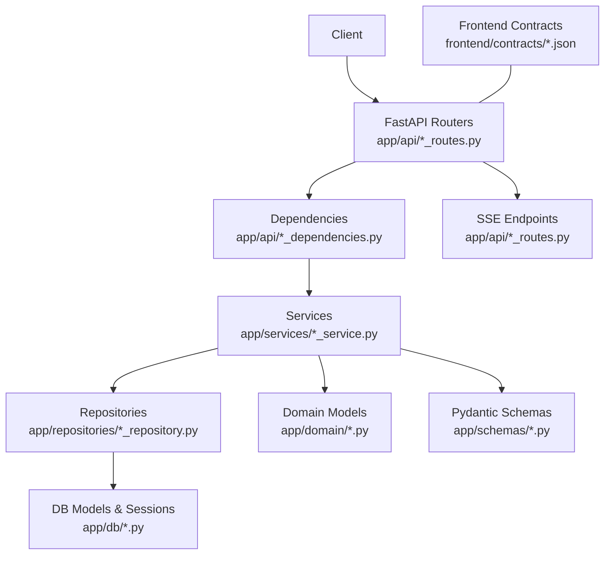
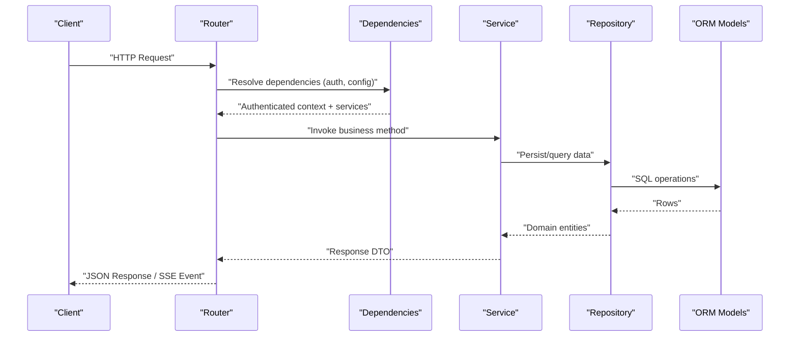
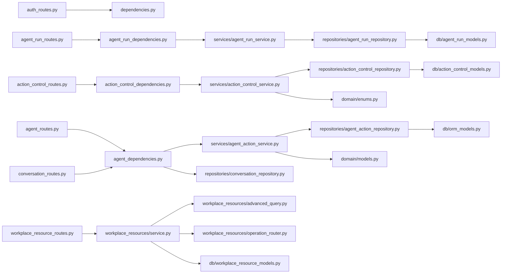

# API Reference

<cite>
**Referenced Files in This Document**
- [main.py](file://app/main.py)
- [auth_routes.py](file://app/api/auth_routes.py)
- [agent_routes.py](file://app/api/agent_routes.py)
- [conversation_routes.py](file://app/api/conversation_routes.py)
- [action_control_routes.py](file://app/api/action_control_routes.py)
- [workplace_resource_routes.py](file://app/api/workplace_resource_routes.py)
- [health_routes.py](file://app/api/health_routes.py)
- [nucleus_routes.py](file://app/api/nucleus_routes.py)
- [action_conversation_control_routes.py](file://app/api/action_conversation_control_routes.py)
- [agent_run_routes.py](file://app/api/agent_run_routes.py)
- [action_control_dependencies.py](file://app/api/action_control_dependencies.py)
- [action_dependencies.py](file://app/api/action_dependencies.py)
- [agent_dependencies.py](file://app/api/agent_dependencies.py)
- [agent_run_dependencies.py](file://app/api/agent_run_dependencies.py)
- [dependencies.py](file://app/api/dependencies.py)
- [schemas/agent.py](file://app/schemas/agent.py)
- [schemas/agent_actions.py](file://app/schemas/agent_actions.py)
- [schemas/agent_run.py](file://app/schemas/agent_run.py)
- [schemas/action_control.py](file://app/schemas/action_control.py)
- [schemas/conversation.py](file://app/schemas/conversation.py)
- [schemas/workplace_resources.py](file://app/schemas/workplace_resources.py)
- [core/security.py](file://app/core/security.py)
- [core/errors.py](file://app/core/errors.py)
- [services/action_control_service.py](file://app/services/action_control_service.py)
- [services/agent_action_service.py](file://app/services/agent_action_service.py)
- [services/agent_run_service.py](file://app/services/agent_run_service.py)
- [workplace_resources/service.py](file://app/workplace_resources/service.py)
- [workplace_resources/advanced_query.py](file://app/workplace_resources/advanced_query.py)
- [workplace_resources/operation_router.py](file://app/workplace_resources/operation_router.py)
- [repositories/action_control_repository.py](file://app/repositories/action_control_repository.py)
- [repositories/agent_action_repository.py](file://app/repositories/agent_action_repository.py)
- [repositories/agent_run_repository.py](file://app/repositories/agent_run_repository.py)
- [repositories/conversation_repository.py](file://app/repositories/conversation_repository.py)
- [db/action_control_models.py](file://app/db/action_control_models.py)
- [db/agent_run_models.py](file://app/db/agent_run_models.py)
- [db/orm_models.py](file://app/db/orm_models.py)
- [db/workplace_resource_models.py](file://app/db/workplace_resource_models.py)
- [domain/models.py](file://app/domain/models.py)
- [domain/enums.py](file://app/domain/enums.py)
- [mock_api/routes.py](file://app/mock_api/routes.py)
- [frontend/contracts/api-manifest.json](file://frontend/contracts/api-manifest.json)
- [frontend/contracts/agent-run-event.schema.json](file://frontend/contracts/agent-run-event.schema.json)
- [frontend/contracts/ui-event.schema.json](file://frontend/contracts/ui-event.schema.json)
</cite>

## Table of Contents
1. [Introduction](#introduction)
2. [Project Structure](#project-structure)
3. [Core Components](#core-components)
4. [Architecture Overview](#architecture-overview)
5. [Detailed Component Analysis](#detailed-component-analysis)
6. [Dependency Analysis](#dependency-analysis)
7. [Performance Considerations](#performance-considerations)
8. [Troubleshooting Guide](#troubleshooting-guide)
9. [Conclusion](#conclusion)
10. [Appendices](#appendices)

## Introduction
This document provides a comprehensive API reference for the application’s REST endpoints and real-time interfaces. It covers authentication, agent management (including conversations), action control plane APIs for approvals and governance, workplace resource discovery and queries, and Server-Sent Events (SSE) streams for real-time updates. It includes request/response schemas, authentication methods, error codes, rate limiting guidance, practical examples, client implementation guidelines, integration patterns, and versioning strategy.

## Project Structure
The backend exposes REST endpoints via FastAPI routers under app/api, with dependency injection, service layer orchestration, repository persistence, domain models, and Pydantic schemas. Real-time updates are delivered through SSE endpoints. The frontend contracts define event schemas and an API manifest that can be used to validate wire formats.

**Diagram sources**
- [main.py:1-200](file://app/main.py#L1-L200)
- [auth_routes.py:1-200](file://app/api/auth_routes.py#L1-L200)
- [agent_routes.py:1-200](file://app/api/agent_routes.py#L1-L200)
- [conversation_routes.py:1-200](file://app/api/conversation_routes.py#L1-L200)
- [action_control_routes.py:1-200](file://app/api/action_control_routes.py#L1-L200)
- [workplace_resource_routes.py:1-200](file://app/api/workplace_resource_routes.py#L1-L200)
- [agent_run_routes.py:1-200](file://app/api/agent_run_routes.py#L1-L200)
- [action_control_dependencies.py:1-200](file://app/api/action_control_dependencies.py#L1-L200)
- [action_dependencies.py:1-200](file://app/api/action_dependencies.py#L1-L200)
- [agent_dependencies.py:1-200](file://app/api/agent_dependencies.py#L1-L200)
- [agent_run_dependencies.py:1-200](file://app/api/agent_run_dependencies.py#L1-L200)
- [dependencies.py:1-200](file://app/api/dependencies.py#L1-L200)
- [services/action_control_service.py:1-200](file://app/services/action_control_service.py#L1-L200)
- [services/agent_action_service.py:1-200](file://app/services/agent_action_service.py#L1-L200)
- [services/agent_run_service.py:1-200](file://app/services/agent_run_service.py#L1-L200)
- [repositories/action_control_repository.py:1-200](file://app/repositories/action_control_repository.py#L1-L200)
- [repositories/agent_action_repository.py:1-200](file://app/repositories/agent_action_repository.py#L1-L200)
- [repositories/agent_run_repository.py:1-200](file://app/repositories/agent_run_repository.py#L1-L200)
- [repositories/conversation_repository.py:1-200](file://app/repositories/conversation_repository.py#L1-L200)
- [db/action_control_models.py:1-200](file://app/db/action_control_models.py#L1-L200)
- [db/agent_run_models.py:1-200](file://app/db/agent_run_models.py#L1-L200)
- [db/orm_models.py:1-200](file://app/db/orm_models.py#L1-L200)
- [db/workplace_resource_models.py:1-200](file://app/db/workplace_resource_models.py#L1-L200)
- [domain/models.py:1-200](file://app/domain/models.py#L1-L200)
- [domain/enums.py:1-200](file://app/domain/enums.py#L1-L200)
- [schemas/action_control.py:1-200](file://app/schemas/action_control.py#L1-L200)
- [schemas/agent_actions.py:1-200](file://app/schemas/agent_actions.py#L1-L200)
- [schemas/agent_run.py:1-200](file://app/schemas/agent_run.py#L1-L200)
- [schemas/conversation.py:1-200](file://app/schemas/conversation.py#L1-L200)
- [schemas/workplace_resources.py:1-200](file://app/schemas/workplace_resources.py#L1-L200)
- [frontend/contracts/api-manifest.json:1-200](file://frontend/contracts/api-manifest.json#L1-L200)
- [frontend/contracts/agent-run-event.schema.json:1-200](file://frontend/contracts/agent-run-event.schema.json#L1-L200)
- [frontend/contracts/ui-event.schema.json:1-200](file://frontend/contracts/ui-event.schema.json#L1-L200)

**Section sources**
- [main.py:1-200](file://app/main.py#L1-L200)

## Core Components
- Authentication: Login, logout, token refresh, and session management endpoints.
- Agent Management: CRUD for agents and their actions; conversation lifecycle and messages.
- Action Control Plane: Proposal creation, approval workflows, multi-approval, rollbacks, audit trails.
- Workplace Resources: Dynamic resource discovery, advanced querying, operation routing.
- Real-Time: SSE streams for agent run events and UI activity updates.
- Health and Nucleus Admin: Health checks and nucleus administration endpoints.

Key responsibilities:
- Routers expose HTTP endpoints and SSE streams.
- Dependencies provide authenticated context, services, repositories, and configuration.
- Services implement business logic and orchestrate repositories and domain rules.
- Repositories abstract data access over ORM models.
- Schemas define request/response payloads and validation.

**Section sources**
- [auth_routes.py:1-200](file://app/api/auth_routes.py#L1-L200)
- [agent_routes.py:1-200](file://app/api/agent_routes.py#L1-L200)
- [conversation_routes.py:1-200](file://app/api/conversation_routes.py#L1-L200)
- [action_control_routes.py:1-200](file://app/api/action_control_routes.py#L1-L200)
- [workplace_resource_routes.py:1-200](file://app/api/workplace_resource_routes.py#L1-L200)
- [agent_run_routes.py:1-200](file://app/api/agent_run_routes.py#L1-L200)
- [action_control_dependencies.py:1-200](file://app/api/action_control_dependencies.py#L1-L200)
- [action_dependencies.py:1-200](file://app/api/action_dependencies.py#L1-L200)
- [agent_dependencies.py:1-200](file://app/api/agent_dependencies.py#L1-L200)
- [agent_run_dependencies.py:1-200](file://app/api/agent_run_dependencies.py#L1-L200)
- [dependencies.py:1-200](file://app/api/dependencies.py#L1-L200)
- [services/action_control_service.py:1-200](file://app/services/action_control_service.py#L1-L200)
- [services/agent_action_service.py:1-200](file://app/services/agent_action_service.py#L1-L200)
- [services/agent_run_service.py:1-200](file://app/services/agent_run_service.py#L1-L200)
- [workplace_resources/service.py:1-200](file://app/workplace_resources/service.py#L1-L200)
- [workplace_resources/advanced_query.py:1-200](file://app/workplace_resources/advanced_query.py#L1-L200)
- [workplace_resources/operation_router.py:1-200](file://app/workplace_resources/operation_router.py#L1-L200)
- [repositories/action_control_repository.py:1-200](file://app/repositories/action_control_repository.py#L1-L200)
- [repositories/agent_action_repository.py:1-200](file://app/repositories/agent_action_repository.py#L1-L200)
- [repositories/agent_run_repository.py:1-200](file://app/repositories/agent_run_repository.py#L1-L200)
- [repositories/conversation_repository.py:1-200](file://app/repositories/conversation_repository.py#L1-L200)
- [db/action_control_models.py:1-200](file://app/db/action_control_models.py#L1-L200)
- [db/agent_run_models.py:1-200](file://app/db/agent_run_models.py#L1-L200)
- [db/orm_models.py:1-200](file://app/db/orm_models.py#L1-L200)
- [db/workplace_resource_models.py:1-200](file://app/db/workplace_resource_models.py#L1-L200)
- [domain/models.py:1-200](file://app/domain/models.py#L1-L200)
- [domain/enums.py:1-200](file://app/domain/enums.py#L1-L200)
- [schemas/action_control.py:1-200](file://app/schemas/action_control.py#L1-L200)
- [schemas/agent_actions.py:1-200](file://app/schemas/agent_actions.py#L1-L200)
- [schemas/agent_run.py:1-200](file://app/schemas/agent_run.py#L1-L200)
- [schemas/conversation.py:1-200](file://app/schemas/conversation.py#L1-L200)
- [schemas/workplace_resources.py:1-200](file://app/schemas/workplace_resources.py#L1-L200)

## Architecture Overview
The API follows a layered architecture:
- Presentation: FastAPI routers handle HTTP requests and SSE streaming.
- Application: Service layer orchestrates business operations and policy enforcement.
- Domain: Models and enums encapsulate core concepts and state machines.
- Infrastructure: Repositories interact with database models and sessions.

**Diagram sources**
- [main.py:1-200](file://app/main.py#L1-L200)
- [auth_routes.py:1-200](file://app/api/auth_routes.py#L1-L200)
- [agent_routes.py:1-200](file://app/api/agent_routes.py#L1-L200)
- [action_control_routes.py:1-200](file://app/api/action_control_routes.py#L1-L200)
- [workplace_resource_routes.py:1-200](file://app/api/workplace_resource_routes.py#L1-L200)
- [agent_run_routes.py:1-200](file://app/api/agent_run_routes.py#L1-L200)
- [action_control_dependencies.py:1-200](file://app/api/action_control_dependencies.py#L1-L200)
- [action_dependencies.py:1-200](file://app/api/action_dependencies.py#L1-L200)
- [agent_dependencies.py:1-200](file://app/api/agent_dependencies.py#L1-L200)
- [agent_run_dependencies.py:1-200](file://app/api/agent_run_dependencies.py#L1-L200)
- [dependencies.py:1-200](file://app/api/dependencies.py#L1-L200)
- [services/action_control_service.py:1-200](file://app/services/action_control_service.py#L1-L200)
- [services/agent_action_service.py:1-200](file://app/services/agent_action_service.py#L1-L200)
- [services/agent_run_service.py:1-200](file://app/services/agent_run_service.py#L1-L200)
- [repositories/action_control_repository.py:1-200](file://app/repositories/action_control_repository.py#L1-L200)
- [repositories/agent_action_repository.py:1-200](file://app/repositories/agent_action_repository.py#L1-L200)
- [repositories/agent_run_repository.py:1-200](file://app/repositories/agent_run_repository.py#L1-L200)
- [repositories/conversation_repository.py:1-200](file://app/repositories/conversation_repository.py#L1-L200)
- [db/action_control_models.py:1-200](file://app/db/action_control_models.py#L1-L200)
- [db/agent_run_models.py:1-200](file://app/db/agent_run_models.py#L1-L200)
- [db/orm_models.py:1-200](file://app/db/orm_models.py#L1-L200)
- [db/workplace_resource_models.py:1-200](file://app/db/workplace_resource_models.py#L1-L200)

## Detailed Component Analysis

### Authentication API
Endpoints:
- POST /api/v1/auth/login
- POST /api/v1/auth/logout
- POST /api/v1/auth/token/refresh
- GET /api/v1/auth/me

Authentication:
- Bearer JWT required for protected routes.
- Session-based login returns tokens; logout invalidates session.

Request/Response Schemas:
- Login request: username, password
- Login response: access_token, token_type, expires_in, user profile
- Refresh request: refresh_token
- Refresh response: new access_token, token_type, expires_in
- Me response: current user details

Error Codes:
- 401 Unauthorized: missing or invalid credentials
- 403 Forbidden: insufficient permissions
- 429 Too Many Requests: rate limit exceeded

Rate Limiting:
- Login attempts limited per IP and per user.
- Token refresh throttled to prevent abuse.

Practical Example:
- Client logs in, stores access_token, attaches Authorization header to subsequent requests.

Integration Patterns:
- Use interceptor to attach Authorization header automatically.
- Implement token refresh on 401 responses.

**Section sources**
- [auth_routes.py:1-200](file://app/api/auth_routes.py#L1-L200)
- [core/security.py:1-200](file://app/core/security.py#L1-L200)
- [dependencies.py:1-200](file://app/api/dependencies.py#L1-L200)
- [schemas/user.py:1-200](file://app/schemas/user.py#L1-L200)

### Agent Management API
Endpoints:
- GET /api/v1/agents
- POST /api/v1/agents
- GET /api/v1/agents/{agent_id}
- PUT /api/v1/agents/{agent_id}
- DELETE /api/v1/agents/{agent_id}
- GET /api/v1/agents/{agent_id}/actions
- POST /api/v1/agents/{agent_id}/actions
- GET /api/v1/agents/{agent_id}/actions/{action_id}
- PATCH /api/v1/agents/{agent_id}/actions/{action_id}
- DELETE /api/v1/agents/{agent_id}/actions/{action_id}

Conversation Sub-API:
- GET /api/v1/agents/{agent_id}/conversations
- POST /api/v1/agents/{agent_id}/conversations
- GET /api/v1/agents/{agent_id}/conversations/{conversation_id}
- POST /api/v1/agents/{agent_id}/conversations/{conversation_id}/messages
- GET /api/v1/agents/{agent_id}/conversations/{conversation_id}/messages

Request/Response Schemas:
- Agent: id, name, description, capabilities, created_at, updated_at
- AgentAction: id, agent_id, type, payload, status, metadata
- Conversation: id, agent_id, title, created_at, updated_at
- Message: id, conversation_id, role, content, timestamp

Error Codes:
- 404 Not Found: agent or action not found
- 409 Conflict: duplicate agent name or invalid state transition
- 422 Unprocessable Entity: schema validation errors

Rate Limiting:
- Read-heavy endpoints have higher limits than write endpoints.

Practical Example:
- Create an agent, propose an action, list actions, and retrieve conversation history.

Integration Patterns:
- Use pagination and filtering for lists.
- Handle optimistic concurrency via ETags if provided.

**Section sources**
- [agent_routes.py:1-200](file://app/api/agent_routes.py#L1-L200)
- [conversation_routes.py:1-200](file://app/api/conversation_routes.py#L1-L200)
- [agent_dependencies.py:1-200](file://app/api/agent_dependencies.py#L1-L200)
- [action_dependencies.py:1-200](file://app/api/action_dependencies.py#L1-L200)
- [schemas/agent.py:1-200](file://app/schemas/agent.py#L1-L200)
- [schemas/agent_actions.py:1-200](file://app/schemas/agent_actions.py#L1-L200)
- [schemas/conversation.py:1-200](file://app/schemas/conversation.py#L1-L200)
- [repositories/agent_action_repository.py:1-200](file://app/repositories/agent_action_repository.py#L1-L200)
- [repositories/conversation_repository.py:1-200](file://app/repositories/conversation_repository.py#L1-L200)

### Action Control Plane API
Endpoints:
- POST /api/v1/actions/proposals
- GET /api/v1/actions/proposals
- GET /api/v1/actions/proposals/{proposal_id}
- POST /api/v1/actions/proposals/{proposal_id}/approve
- POST /api/v1/actions/proposals/{proposal_id}/reject
- POST /api/v1/actions/proposals/{proposal_id}/rollback
- GET /api/v1/actions/proposals/{proposal_id}/audit

Governance and Audit:
- Multi-approval workflow support.
- Rollback capability for approved actions.
- Immutable audit trail entries.

Request/Response Schemas:
- Proposal: id, agent_action_id, requested_by, requested_at, payload, status
- Approval: approver_id, decision, reason, timestamp
- AuditEntry: id, proposal_id, actor, action, timestamp, details

Error Codes:
- 403 Forbidden: unauthorized to approve/reject
- 409 Conflict: invalid state transitions
- 422 Unprocessable Entity: invalid proposal payload

Rate Limiting:
- Approval endpoints are strictly rate-limited.

Practical Example:
- Propose an operational change, collect approvals, execute, and rollback if needed.

Integration Patterns:
- Poll proposals or subscribe to SSE for real-time status changes.
- Enforce least privilege for approval roles.

**Section sources**
- [action_control_routes.py:1-200](file://app/api/action_control_routes.py#L1-L200)
- [action_conversation_control_routes.py:1-200](file://app/api/action_conversation_control_routes.py#L1-L200)
- [action_control_dependencies.py:1-200](file://app/api/action_control_dependencies.py#L1-L200)
- [services/action_control_service.py:1-200](file://app/services/action_control_service.py#L1-L200)
- [repositories/action_control_repository.py:1-200](file://app/repositories/action_control_repository.py#L1-L200)
- [schemas/action_control.py:1-200](file://app/schemas/action_control.py#L1-L200)
- [db/action_control_models.py:1-200](file://app/db/action_control_models.py#L1-L200)

### Workplace Resource Management API
Endpoints:
- GET /api/v1/workplace/resources
- GET /api/v1/workplace/resources/{resource_id}
- POST /api/v1/workplace/resources/{resource_id}/operations
- GET /api/v1/workplace/resources/search
- GET /api/v1/workplace/resources/discover

Advanced Query:
- Support complex filters, sorting, and pagination.

Operation Routing:
- Dynamically route operations based on resource type and preconditions.

Request/Response Schemas:
- Resource: id, type, attributes, relationships, meta
- Operation: id, resource_id, verb, payload, status
- SearchRequest: filters, sort, page, size
- DiscoverRequest: scope, criteria

Error Codes:
- 404 Not Found: resource not found
- 403 Forbidden: insufficient permissions
- 422 Unprocessable Entity: invalid query parameters

Rate Limiting:
- Discovery and search endpoints have moderate limits.

Practical Example:
- Discover resources matching criteria, perform read-only operations, and execute guarded writes.

Integration Patterns:
- Cache discover results with short TTL.
- Validate advanced queries server-side to prevent expensive scans.

**Section sources**
- [workplace_resource_routes.py:1-200](file://app/api/workplace_resource_routes.py#L1-L200)
- [workplace_resources/service.py:1-200](file://app/workplace_resources/service.py#L1-L200)
- [workplace_resources/advanced_query.py:1-200](file://app/workplace_resources/advanced_query.py#L1-L200)
- [workplace_resources/operation_router.py:1-200](file://app/workplace_resources/operation_router.py#L1-L200)
- [schemas/workplace_resources.py:1-200](file://app/schemas/workplace_resources.py#L1-L200)
- [db/workplace_resource_models.py:1-200](file://app/db/workplace_resource_models.py#L1-L200)

### Real-Time API (Server-Sent Events)
Streams:
- GET /api/v1/agent-runs/{run_id}/events
- GET /api/v1/ui/activity/stream

Event Types:
- AgentRunCreated
- AgentRunStateUpdated
- AgentRunActivity
- AgentRunAnswer
- ApprovalApproved
- ExecutionSucceeded
- ExecutionReconciliationRequired
- StaleProposalError
- UiActivityUpdate
- UiExecutionUpdate

Connection Management:
- Reconnect with last_event_id for durability.
- Heartbeat interval recommended by server.

Request/Response Schemas:
- Event: event, data, id, retry
- Data: typed payload per event type

Error Codes:
- 401 Unauthorized: missing or expired token
- 404 Not Found: run not found
- 429 Too Many Requests: stream rate limit exceeded

Practical Example:
- Connect to SSE, parse frames, update UI in real time, handle reconnects gracefully.

Integration Patterns:
- Use authenticated SSE client to inject Authorization header.
- Debounce high-frequency events for UI performance.

**Section sources**
- [agent_run_routes.py:1-200](file://app/api/agent_run_routes.py#L1-L200)
- [agent_run_dependencies.py:1-200](file://app/api/agent_run_dependencies.py#L1-L200)
- [services/agent_run_service.py:1-200](file://app/services/agent_run_service.py#L1-L200)
- [schemas/agent_run.py:1-200](file://app/schemas/agent_run.py#L1-L200)
- [frontend/contracts/agent-run-event.schema.json:1-200](file://frontend/contracts/agent-run-event.schema.json#L1-L200)
- [frontend/contracts/ui-event.schema.json:1-200](file://frontend/contracts/ui-event.schema.json#L1-L200)

### Health and Nucleus Admin API
Health:
- GET /api/v1/health

Nucleus Admin:
- Organization overview, admin projections, seat management, user mapping.

Request/Response Schemas:
- Health: status, uptime, version
- Admin responses: organization details, seats, users

Error Codes:
- 503 Service Unavailable: health check fails
- 403 Forbidden: admin privileges required

**Section sources**
- [health_routes.py:1-200](file://app/api/health_routes.py#L1-L200)
- [nucleus_routes.py:1-200](file://app/api/nucleus_routes.py#L1-L200)

### Mock API
For development and testing:
- GET /api/v1/mock/data
- POST /api/v1/mock/data

Useful for prototyping without backend dependencies.

**Section sources**
- [mock_api/routes.py:1-200](file://app/mock_api/routes.py#L1-L200)

## Dependency Analysis
The following diagram shows key module relationships across routers, dependencies, services, repositories, and models.

**Diagram sources**
- [auth_routes.py:1-200](file://app/api/auth_routes.py#L1-L200)
- [agent_routes.py:1-200](file://app/api/agent_routes.py#L1-L200)
- [conversation_routes.py:1-200](file://app/api/conversation_routes.py#L1-L200)
- [action_control_routes.py:1-200](file://app/api/action_control_routes.py#L1-L200)
- [workplace_resource_routes.py:1-200](file://app/api/workplace_resource_routes.py#L1-L200)
- [agent_run_routes.py:1-200](file://app/api/agent_run_routes.py#L1-L200)
- [dependencies.py:1-200](file://app/api/dependencies.py#L1-L200)
- [agent_dependencies.py:1-200](file://app/api/agent_dependencies.py#L1-L200)
- [action_control_dependencies.py:1-200](file://app/api/action_control_dependencies.py#L1-L200)
- [agent_run_dependencies.py:1-200](file://app/api/agent_run_dependencies.py#L1-L200)
- [services/agent_action_service.py:1-200](file://app/services/agent_action_service.py#L1-L200)
- [services/action_control_service.py:1-200](file://app/services/action_control_service.py#L1-L200)
- [services/agent_run_service.py:1-200](file://app/services/agent_run_service.py#L1-L200)
- [workplace_resources/service.py:1-200](file://app/workplace_resources/service.py#L1-L200)
- [workplace_resources/advanced_query.py:1-200](file://app/workplace_resources/advanced_query.py#L1-L200)
- [workplace_resources/operation_router.py:1-200](file://app/workplace_resources/operation_router.py#L1-L200)
- [repositories/agent_action_repository.py:1-200](file://app/repositories/agent_action_repository.py#L1-L200)
- [repositories/action_control_repository.py:1-200](file://app/repositories/action_control_repository.py#L1-L200)
- [repositories/agent_run_repository.py:1-200](file://app/repositories/agent_run_repository.py#L1-L200)
- [repositories/conversation_repository.py:1-200](file://app/repositories/conversation_repository.py#L1-L200)
- [db/orm_models.py:1-200](file://app/db/orm_models.py#L1-L200)
- [db/action_control_models.py:1-200](file://app/db/action_control_models.py#L1-L200)
- [db/agent_run_models.py:1-200](file://app/db/agent_run_models.py#L1-L200)
- [db/workplace_resource_models.py:1-200](file://app/db/workplace_resource_models.py#L1-L200)
- [domain/models.py:1-200](file://app/domain/models.py#L1-L200)
- [domain/enums.py:1-200](file://app/domain/enums.py#L1-L200)

**Section sources**
- [main.py:1-200](file://app/main.py#L1-L200)

## Performance Considerations
- Prefer paginated and filtered queries for list endpoints.
- Use indexes on frequently queried fields (e.g., agent_id, conversation_id).
- Cache discovery results with appropriate TTL.
- Debounce SSE events on the client to reduce UI churn.
- Avoid deep joins; use repository abstractions to optimize queries.
- Monitor SSE connection lifetimes and implement backoff strategies.

[No sources needed since this section provides general guidance]

## Troubleshooting Guide
Common issues and resolutions:
- Authentication failures: verify token validity and expiration handling.
- Rate limiting: implement exponential backoff and respect Retry-After headers.
- SSE disconnects: reconnect using last_event_id and heartbeat monitoring.
- Validation errors: inspect 422 responses for field-level errors.
- Permission errors: ensure correct roles and scopes for approval endpoints.

**Section sources**
- [core/errors.py:1-200](file://app/core/errors.py#L1-L200)
- [core/security.py:1-200](file://app/core/security.py#L1-L200)

## Conclusion
This API reference outlines the complete surface area for authentication, agent management, action control, workplace resources, and real-time streams. By adhering to the documented schemas, error codes, and integration patterns, clients can build robust integrations with clear versioning and compatibility expectations.

[No sources needed since this section summarizes without analyzing specific files]

## Appendices

### API Versioning Strategy
- Base path uses /api/v1/.
- Backwards compatibility: additive changes only; deprecate fields with warnings.
- Breaking changes require major version bump and migration guide.

**Section sources**
- [frontend/contracts/api-manifest.json:1-200](file://frontend/contracts/api-manifest.json#L1-L200)

### Error Contract
- Standardized error envelope with code, message, details.
- Consistent HTTP status usage across endpoints.

**Section sources**
- [core/errors.py:1-200](file://app/core/errors.py#L1-L200)

### SSE Event Schemas
- Agent run events validated against JSON Schema.
- UI events follow separate schema for presentation-layer updates.

**Section sources**
- [frontend/contracts/agent-run-event.schema.json:1-200](file://frontend/contracts/agent-run-event.schema.json#L1-L200)
- [frontend/contracts/ui-event.schema.json:1-200](file://frontend/contracts/ui-event.schema.json#L1-L200)