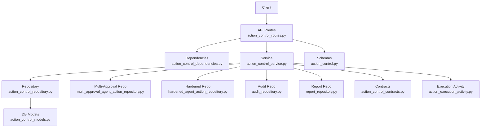
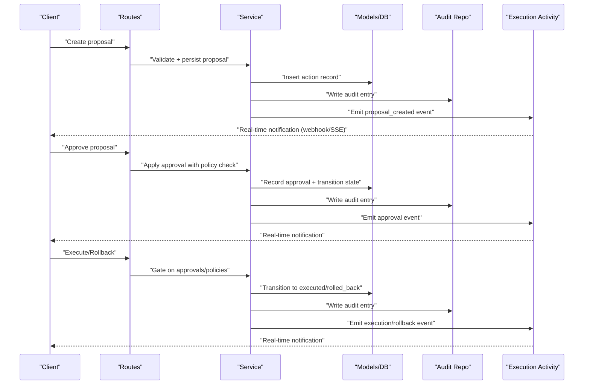
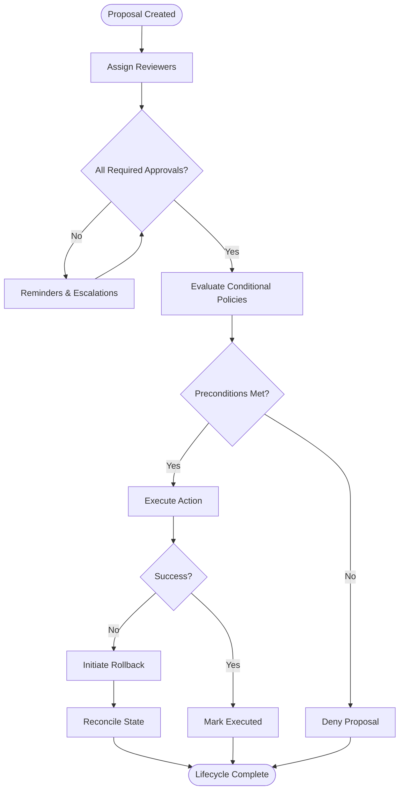
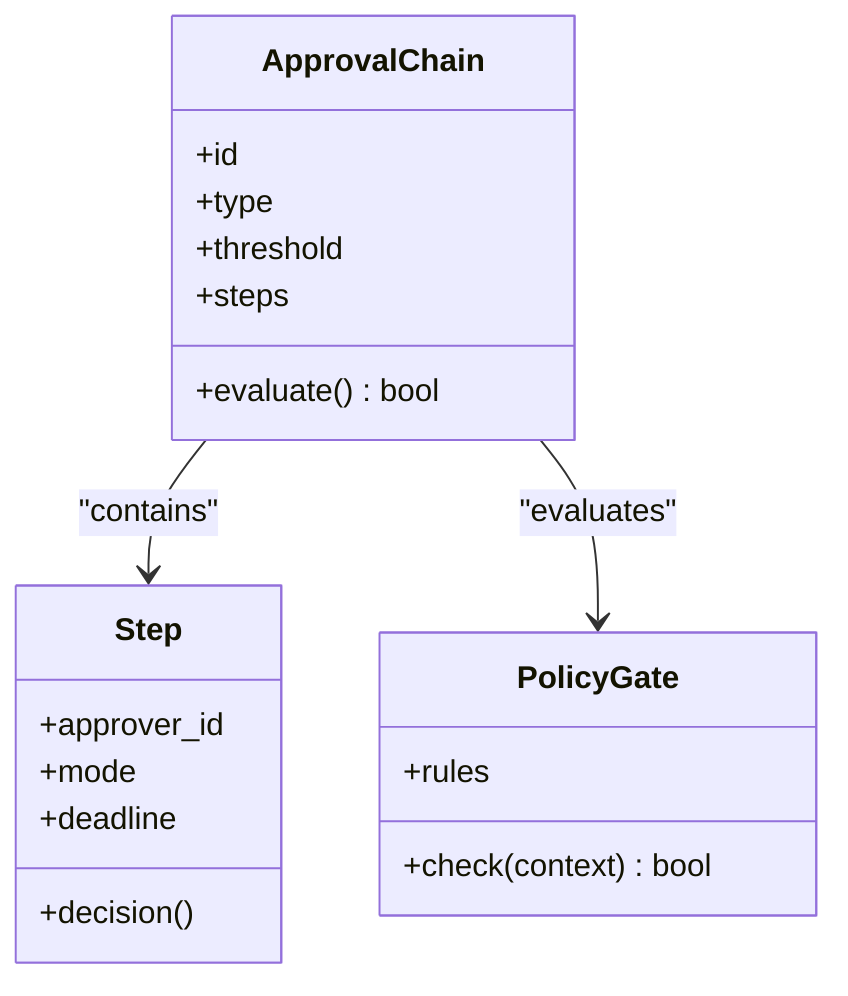
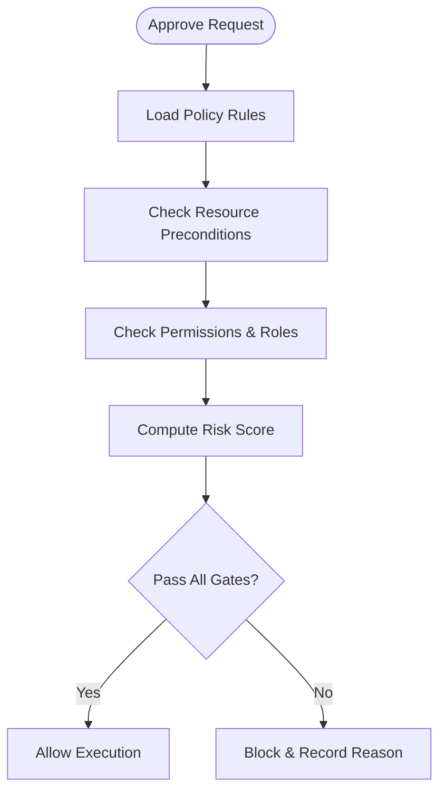
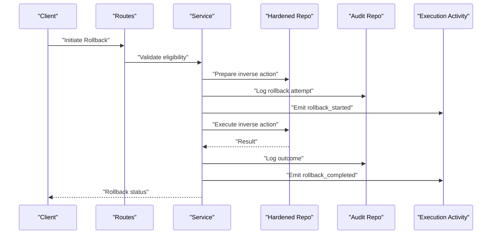
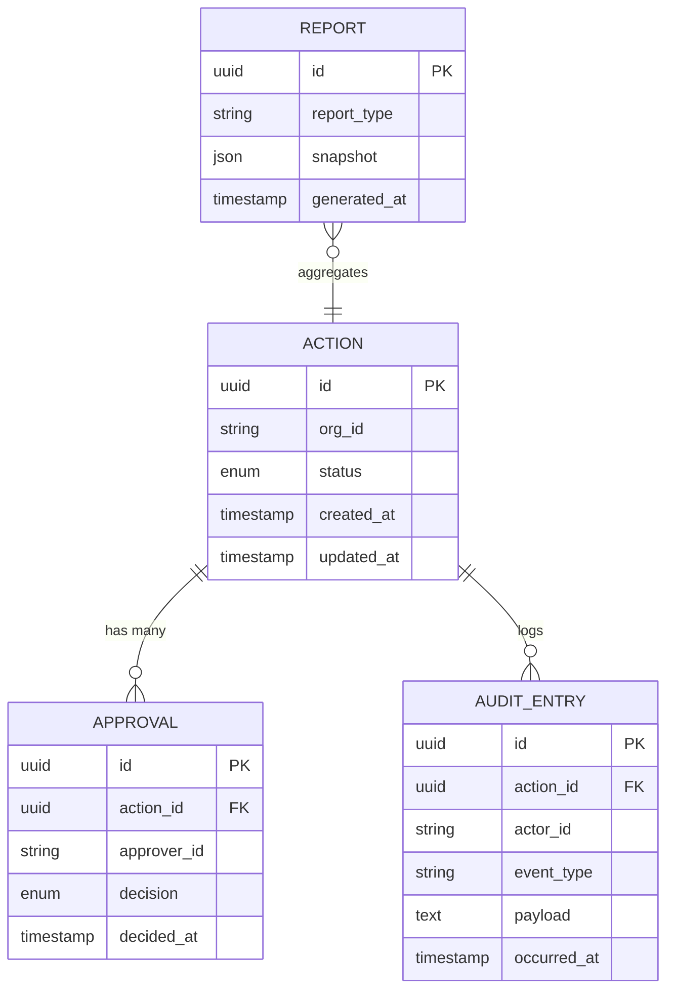
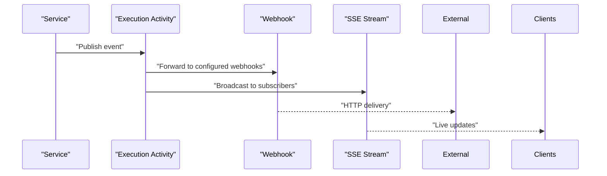
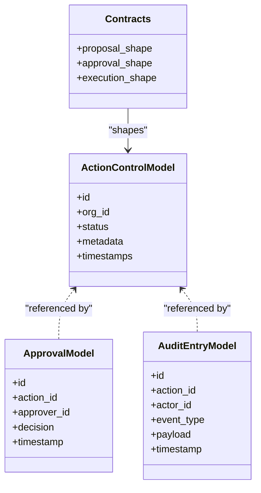
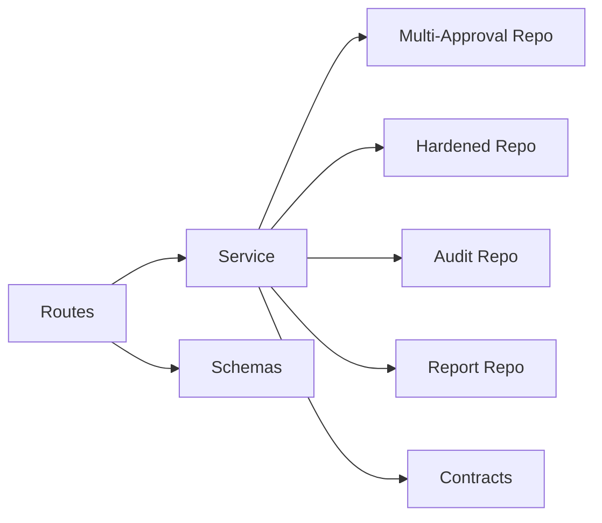

# Action Control API

<cite>
**Referenced Files in This Document**
- [GOVERNED_ACTION_CONTROL_PLANE.md](file://docs/GOVERNED_ACTION_CONTROL_PLANE.md)
- [action_control_routes.py](file://app/api/action_control_routes.py)
- [action_control_dependencies.py](file://app/api/action_control_dependencies.py)
- [action_control_service.py](file://app/services/action_control_service.py)
- [action_control_repository.py](file://app/repositories/action_control_repository.py)
- [action_control_models.py](file://app/db/action_control_models.py)
- [action_control.py](file://app/schemas/action_control.py)
- [multi_approval_agent_action_repository.py](file://app/repositories/multi_approval_agent_action_repository.py)
- [hardened_agent_action_repository.py](file://app/repositories/hardened_agent_action_repository.py)
- [agent_action_service.py](file://app/services/agent_action_service.py)
- [audit_repository.py](file://app/repositories/audit_repository.py)
- [report_repository.py](file://app/repositories/report_repository.py)
- [action_execution_activity.py](file://app/services/action_execution_activity.py)
- [action_contracts.py](file://app/agent/action_contracts.py)
- [action_control_contracts.py](file://app/agent/action_control_contracts.py)
- [test_multi_approval_and_rollback.py](file://tests/test_multi_approval_and_rollback.py)
- [test_action_control_contract.py](file://tests/test_action_control_contract.py)
- [test_action_control_events.py](file://tests/test_action_control_events.py)
</cite>

## Table of Contents
1. [Introduction](#introduction)
2. [Project Structure](#project-structure)
3. [Core Components](#core-components)
4. [Architecture Overview](#architecture-overview)
5. [Detailed Component Analysis](#detailed-component-analysis)
6. [Dependency Analysis](#dependency-analysis)
7. [Performance Considerations](#performance-considerations)
8. [Troubleshooting Guide](#troubleshooting-guide)
9. [Conclusion](#conclusion)
10. [Appendices](#appendices)

## Introduction
This document describes the Action Control Plane API that governs AI actions across organizations. It covers governance workflows, multi-level approvals, conditional approvals, rollback mechanisms, and audit trails. It also documents event-driven patterns, webhook integrations, and real-time approval notifications. The goal is to provide a comprehensive reference for building clients and integrations that propose, review, approve, execute, and audit AI actions with strong compliance guarantees.

## Project Structure
The Action Control Plane spans API routes, services, repositories, schemas, models, and tests. High-level organization:
- API layer exposes REST endpoints for proposals, approvals, rollbacks, and audits.
- Service layer implements business logic for lifecycle transitions, policy checks, and orchestration.
- Repository layer persists state and queries history and reports.
- Schemas define request/response contracts.
- Models represent database entities for governed actions and audit records.
- Tests validate contracts, events, and complex flows like multi-approval and rollback.

**Diagram sources**
- [action_control_routes.py](file://app/api/action_control_routes.py)
- [action_control_dependencies.py](file://app/api/action_control_dependencies.py)
- [action_control_service.py](file://app/services/action_control_service.py)
- [action_control_repository.py](file://app/repositories/action_control_repository.py)
- [multi_approval_agent_action_repository.py](file://app/repositories/multi_approval_agent_action_repository.py)
- [hardened_agent_action_repository.py](file://app/repositories/hardened_agent_action_repository.py)
- [audit_repository.py](file://app/repositories/audit_repository.py)
- [report_repository.py](file://app/repositories/report_repository.py)
- [action_control_models.py](file://app/db/action_control_models.py)
- [action_control_contracts.py](file://app/agent/action_control_contracts.py)
- [action_execution_activity.py](file://app/services/action_execution_activity.py)
- [action_control.py](file://app/schemas/action_control.py)

**Section sources**
- [GOVERNED_ACTION_CONTROL_PLANE.md](file://docs/GOVERNED_ACTION_CONTROL_PLANE.md)

## Core Components
- API Routes: Define endpoints for creating action proposals, reviewing/approving them, executing or rolling back, and querying audit/history and reports.
- Dependencies: Provide authorization, context, and shared utilities used by routes.
- Service: Implements governance workflows, including proposal creation, multi-level approvals, conditional approvals, execution gating, and rollback orchestration.
- Repositories: Persist and query governed actions, approvals, and audit records; specialized repos support hardened and multi-approval behaviors.
- Schemas: Validate and describe request/response payloads for proposals, approvals, rollbacks, and audit queries.
- Models: Represent persisted entities for actions, approvals, and audit logs.
- Contracts: Define internal interfaces and data shapes used across agent and control plane components.
- Execution Activity: Emits activity events and integrates with event-driven systems (e.g., webhooks/SSE).

Key responsibilities:
- Proposal lifecycle: create, review, approve/deny, execute, rollback.
- Multi-level approvals: configurable chains and thresholds.
- Conditional approvals: policy-based gates before execution.
- Rollback: inverse actions and idempotency controls.
- Audit trail: immutable history, compliance reporting, forensic analysis.
- Eventing: publish lifecycle events for real-time notifications and downstream integrations.

**Section sources**
- [action_control_routes.py](file://app/api/action_control_routes.py)
- [action_control_dependencies.py](file://app/api/action_control_dependencies.py)
- [action_control_service.py](file://app/services/action_control_service.py)
- [action_control_repository.py](file://app/repositories/action_control_repository.py)
- [multi_approval_agent_action_repository.py](file://app/repositories/multi_approval_agent_action_repository.py)
- [hardened_agent_action_repository.py](file://app/repositories/hardened_agent_action_repository.py)
- [audit_repository.py](file://app/repositories/audit_repository.py)
- [report_repository.py](file://app/repositories/report_repository.py)
- [action_control_models.py](file://app/db/action_control_models.py)
- [action_control.py](file://app/schemas/action_control.py)
- [action_control_contracts.py](file://app/agent/action_control_contracts.py)
- [action_execution_activity.py](file://app/services/action_execution_activity.py)

## Architecture Overview
The Action Control Plane follows a layered architecture with clear separation between HTTP boundaries, service logic, and persistence. It supports event-driven integration via activity emissions and can integrate with external webhooks or SSE streams for real-time updates.

**Diagram sources**
- [action_control_routes.py](file://app/api/action_control_routes.py)
- [action_control_service.py](file://app/services/action_control_service.py)
- [action_control_repository.py](file://app/repositories/action_control_repository.py)
- [audit_repository.py](file://app/repositories/audit_repository.py)
- [action_execution_activity.py](file://app/services/action_execution_activity.py)

## Detailed Component Analysis

### API Endpoints: Proposals, Approvals, Rollbacks, Audits
- Proposal endpoints: Create, list, get details, update metadata, submit for review.
- Approval endpoints: Approve/deny, add reviewers, enforce multi-level thresholds, conditional approvals based on policies.
- Execution endpoints: Execute approved proposals, handle failures, trigger rollbacks.
- Rollback endpoints: Initiate inverse actions, confirm completion, reconcile state.
- Audit endpoints: Query history, filter by actor/time/resource, export for compliance, forensic search.
- Reports endpoints: Aggregate metrics, compliance summaries, risk indicators.

Request/response contracts are defined in schemas and validated at the route layer. Authorization and context are injected via dependencies.

**Section sources**
- [action_control_routes.py](file://app/api/action_control_routes.py)
- [action_control_dependencies.py](file://app/api/action_control_dependencies.py)
- [action_control.py](file://app/schemas/action_control.py)

### Governance Workflow Engine
The service orchestrates the full lifecycle:
- Proposal creation validates inputs and initializes state.
- Review workflow enforces reviewer assignment and due dates.
- Multi-level approvals require sequential or parallel approvals per policy.
- Conditional approvals evaluate preconditions (resource state, permissions, risk score).
- Execution gating ensures all approvals satisfied and preconditions met.
- Rollback triggers inverse actions and verifies idempotency.

**Diagram sources**
- [action_control_service.py](file://app/services/action_control_service.py)
- [multi_approval_agent_action_repository.py](file://app/repositories/multi_approval_agent_action_repository.py)
- [hardened_agent_action_repository.py](file://app/repositories/hardened_agent_action_repository.py)

**Section sources**
- [action_control_service.py](file://app/services/action_control_service.py)
- [multi_approval_agent_action_repository.py](file://app/repositories/multi_approval_agent_action_repository.py)
- [hardened_agent_action_repository.py](file://app/repositories/hardened_agent_action_repository.py)

### Multi-Level Approval Workflows
- Configurable approval chains: sequential or parallel.
- Thresholds: majority, supermajority, or unanimous.
- Delegation and substitution rules.
- Timeouts and escalations.
- Policy-based conditions: resource availability, user roles, risk thresholds.

**Diagram sources**
- [multi_approval_agent_action_repository.py](file://app/repositories/multi_approval_agent_action_repository.py)
- [action_control_service.py](file://app/services/action_control_service.py)

**Section sources**
- [multi_approval_agent_action_repository.py](file://app/repositories/multi_approval_agent_action_repository.py)
- [action_control_service.py](file://app/services/action_control_service.py)

### Conditional Approvals and Execution Gating
- Pre-execution checks: resource preconditions, permission scopes, organizational constraints.
- Risk scoring and dynamic policy evaluation.
- Fallback paths when conditions fail (deny or request additional approvals).

**Diagram sources**
- [action_control_service.py](file://app/services/action_control_service.py)
- [hardened_agent_action_repository.py](file://app/repositories/hardened_agent_action_repository.py)

**Section sources**
- [action_control_service.py](file://app/services/action_control_service.py)
- [hardened_agent_action_repository.py](file://app/repositories/hardened_agent_action_repository.py)

### Rollback Mechanisms
- Inverse action definitions paired with original proposals.
- Idempotent rollback operations with verification steps.
- Reconciliation to ensure system state consistency post-rollback.
- Audit logging of all rollback attempts and outcomes.

**Diagram sources**
- [action_control_service.py](file://app/services/action_control_service.py)
- [hardened_agent_action_repository.py](file://app/repositories/hardened_agent_action_repository.py)
- [audit_repository.py](file://app/repositories/audit_repository.py)
- [action_execution_activity.py](file://app/services/action_execution_activity.py)

**Section sources**
- [action_control_service.py](file://app/services/action_control_service.py)
- [hardened_agent_action_repository.py](file://app/repositories/hardened_agent_action_repository.py)
- [audit_repository.py](file://app/repositories/audit_repository.py)
- [action_execution_activity.py](file://app/services/action_execution_activity.py)

### Audit Trail and Compliance Reporting
- Immutable audit entries for every lifecycle transition.
- Filters by action ID, actor, time range, resource, and decision type.
- Exportable reports for compliance and forensic analysis.
- Aggregated metrics for SLAs, bottlenecks, and risk trends.

**Diagram sources**
- [action_control_models.py](file://app/db/action_control_models.py)
- [audit_repository.py](file://app/repositories/audit_repository.py)
- [report_repository.py](file://app/repositories/report_repository.py)

**Section sources**
- [action_control_models.py](file://app/db/action_control_models.py)
- [audit_repository.py](file://app/repositories/audit_repository.py)
- [report_repository.py](file://app/repositories/report_repository.py)

### Event-Driven Patterns and Real-Time Notifications
- Events emitted for proposal creation, approvals, denials, execution, and rollback.
- Integration points for webhooks and Server-Sent Events (SSE).
- Clients subscribe to real-time updates for approval centers and dashboards.

**Diagram sources**
- [action_execution_activity.py](file://app/services/action_execution_activity.py)
- [action_control_service.py](file://app/services/action_control_service.py)

**Section sources**
- [action_execution_activity.py](file://app/services/action_execution_activity.py)
- [action_control_service.py](file://app/services/action_control_service.py)

### Data Models and Contracts
- Models capture action state, approvals, and audit entries.
- Contracts define internal interfaces for agents and control plane interactions.
- Schemas validate API payloads and responses.

**Diagram sources**
- [action_control_models.py](file://app/db/action_control_models.py)
- [action_control_contracts.py](file://app/agent/action_control_contracts.py)
- [action_control.py](file://app/schemas/action_control.py)

**Section sources**
- [action_control_models.py](file://app/db/action_control_models.py)
- [action_control_contracts.py](file://app/agent/action_control_contracts.py)
- [action_control.py](file://app/schemas/action_control.py)

## Dependency Analysis
The control plane depends on:
- API routes for HTTP boundaries.
- Service layer for business logic.
- Specialized repositories for multi-approval and hardened behaviors.
- Audit and report repositories for compliance.
- Contracts and schemas for consistent interfaces.

**Diagram sources**
- [action_control_routes.py](file://app/api/action_control_routes.py)
- [action_control_service.py](file://app/services/action_control_service.py)
- [multi_approval_agent_action_repository.py](file://app/repositories/multi_approval_agent_action_repository.py)
- [hardened_agent_action_repository.py](file://app/repositories/hardened_agent_action_repository.py)
- [audit_repository.py](file://app/repositories/audit_repository.py)
- [report_repository.py](file://app/repositories/report_repository.py)
- [action_control_contracts.py](file://app/agent/action_control_contracts.py)
- [action_control.py](file://app/schemas/action_control.py)

**Section sources**
- [action_control_routes.py](file://app/api/action_control_routes.py)
- [action_control_service.py](file://app/services/action_control_service.py)
- [multi_approval_agent_action_repository.py](file://app/repositories/multi_approval_agent_action_repository.py)
- [hardened_agent_action_repository.py](file://app/repositories/hardened_agent_action_repository.py)
- [audit_repository.py](file://app/repositories/audit_repository.py)
- [report_repository.py](file://app/repositories/report_repository.py)
- [action_control_contracts.py](file://app/agent/action_control_contracts.py)
- [action_control.py](file://app/schemas/action_control.py)

## Performance Considerations
- Batch operations for bulk approvals and audit exports.
- Indexing strategies on frequently queried fields (action IDs, timestamps, actors).
- Pagination and filtering for large histories and reports.
- Idempotency keys to prevent duplicate executions and rollbacks.
- Asynchronous event emission to avoid blocking request-response cycles.

[No sources needed since this section provides general guidance]

## Troubleshooting Guide
Common issues and resolutions:
- Approval timeouts: configure escalation rules and monitor pending approvals.
- Conditional policy failures: inspect policy rules and resource preconditions; adjust thresholds or permissions.
- Rollback conflicts: verify idempotency keys and reconciliation results; re-run reconciliation if necessary.
- Audit gaps: ensure audit entries are written for all transitions; investigate event pipeline health.
- Webhook/SSE delivery failures: retry policies, dead-letter queues, and client subscription validation.

**Section sources**
- [action_control_service.py](file://app/services/action_control_service.py)
- [audit_repository.py](file://app/repositories/audit_repository.py)
- [action_execution_activity.py](file://app/services/action_execution_activity.py)

## Conclusion
The Action Control API provides a robust foundation for governing AI actions through structured workflows, multi-level approvals, conditional gates, and comprehensive auditability. Its event-driven design enables real-time collaboration and integrations, while specialized repositories ensure hardened and scalable behavior. Use the documented endpoints, contracts, and diagrams to build compliant, auditable, and responsive systems around AI-driven operations.

[No sources needed since this section summarizes without analyzing specific files]

## Appendices

### Contract Validation and Test Coverage
- Contract tests validate API shapes and lifecycle transitions.
- Event tests ensure correct emission and ordering.
- Multi-approval and rollback tests exercise complex scenarios and edge cases.

**Section sources**
- [test_action_control_contract.py](file://tests/test_action_control_contract.py)
- [test_action_control_events.py](file://tests/test_action_control_events.py)
- [test_multi_approval_and_rollback.py](file://tests/test_multi_approval_and_rollback.py)