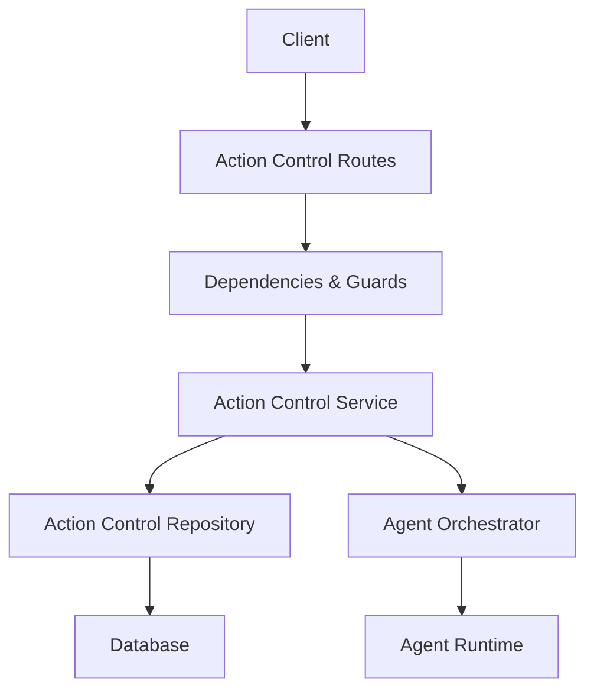
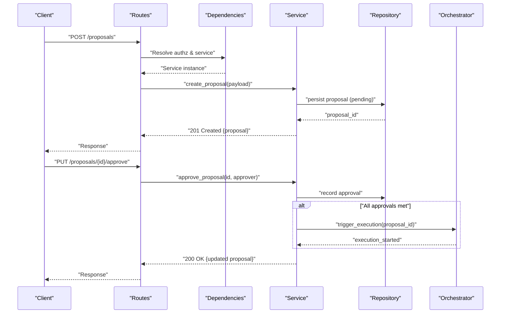
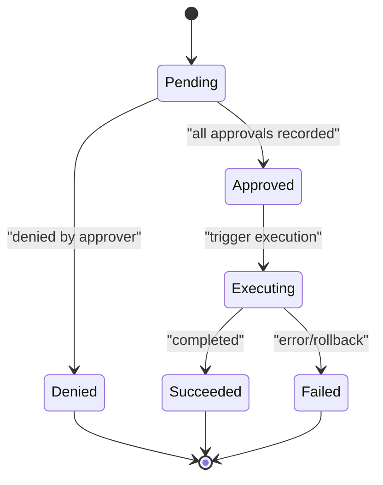
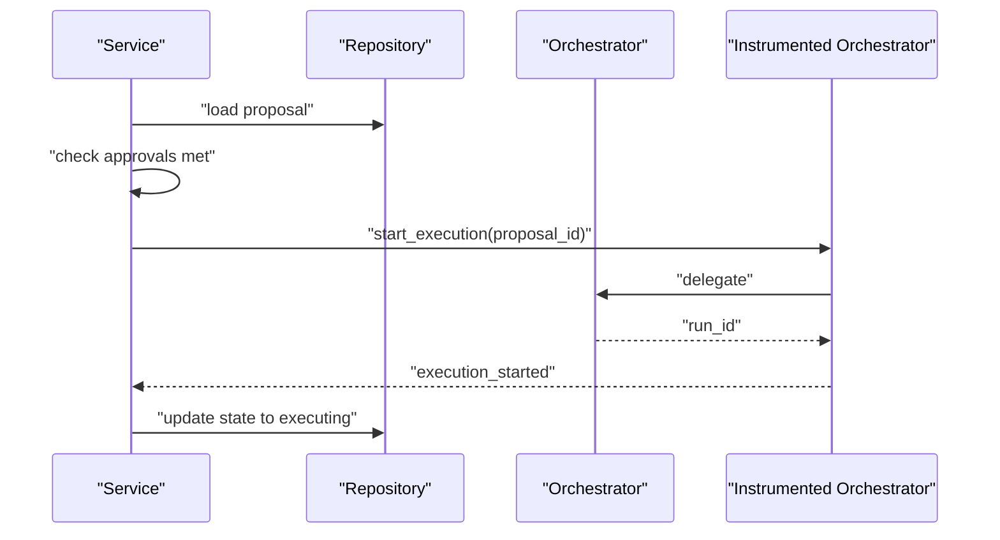
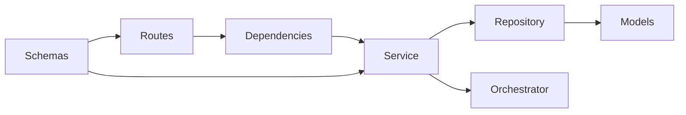

# Action Proposal API

<cite>
**Referenced Files in This Document**
- [action_control_routes.py](file://app/api/action_control_routes.py)
- [action_control_dependencies.py](file://app/api/action_control_dependencies.py)
- [action_control_service.py](file://app/services/action_control_service.py)
- [action_control_models.py](file://app/db/action_control_models.py)
- [action_control_repository.py](file://app/repositories/action_control_repository.py)
- [multi_approval_agent_action_repository.py](file://app/repositories/multi_approval_agent_action_repository.py)
- [hardened_agent_action_repository.py](file://app/repositories/hardened_agent_action_repository.py)
- [action_control.py](file://app/schemas/action_control.py)
- [agent_actions.py](file://app/schemas/agent_actions.py)
- [orchestrator.py](file://app/agent/orchestrator.py)
- [instrumented_orchestrator.py](file://app/agent/instrumented_orchestrator.py)
- [action_state.py](file://app/agent/action_state.py)
- [action_errors.py](file://app/agent/action_errors.py)
- [action_contracts.py](file://app/agent/action_contracts.py)
- [action_control_contracts.py](file://app/agent/action_control_contracts.py)
- [test_phase6_contract.py](file://tests/test_phase6_contract.py)
- [test_multi_approval_and_rollback.py](file://tests/test_multi_approval_and_rollback.py)
- [test_proposal_authorization_order.py](file://tests/test_proposal_authorization_order.py)
- [GOVERNED_ACTION_CONTROL_PLANE.md](file://docs/GOVERNED_ACTION_CONTROL_PLANE.md)
</cite>

## Table of Contents
1. [Introduction](#introduction)
2. [Project Structure](#project-structure)
3. [Core Components](#core-components)
4. [Architecture Overview](#architecture-overview)
5. [Detailed Component Analysis](#detailed-component-analysis)
6. [Dependency Analysis](#dependency-analysis)
7. [Performance Considerations](#performance-considerations)
8. [Troubleshooting Guide](#troubleshooting-guide)
9. [Conclusion](#conclusion)
10. [Appendices](#appendices)

## Introduction
This document provides detailed API documentation for action proposal endpoints that enable creating, updating, and managing AI action proposals within a governed control plane. It covers HTTP methods, URL patterns, request/response schemas, validation rules, business constraints, lifecycle states, conditional approval workflows, multi-level authorization requirements, and integration with the agent orchestration system. Concrete examples illustrate creation flows, validation errors, and state transitions.

## Project Structure
The action proposal feature spans API routes, services, repositories, domain models, and contracts:
- API layer exposes REST endpoints for proposal operations and approvals.
- Service layer enforces business logic, policy checks, and orchestrates downstream actions.
- Repository layer persists proposal state and approval records.
- Contracts and schemas define wire formats and validation rules.
- Agent orchestration integration triggers execution after approvals.

**Diagram sources**
- [action_control_routes.py](file://app/api/action_control_routes.py)
- [action_control_dependencies.py](file://app/api/action_control_dependencies.py)
- [action_control_service.py](file://app/services/action_control_service.py)
- [action_control_repository.py](file://app/repositories/action_control_repository.py)
- [orchestrator.py](file://app/agent/orchestrator.py)

**Section sources**
- [action_control_routes.py](file://app/api/action_control_routes.py)
- [action_control_service.py](file://app/services/action_control_service.py)
- [action_control_repository.py](file://app/repositories/action_control_repository.py)
- [action_control_models.py](file://app/db/action_control_models.py)
- [action_control.py](file://app/schemas/action_control.py)
- [agent_actions.py](file://app/schemas/agent_actions.py)
- [orchestrator.py](file://app/agent/orchestrator.py)
- [instrumented_orchestrator.py](file://app/agent/instrumented_orchestrator.py)
- [action_state.py](file://app/agent/action_state.py)
- [action_errors.py](file://app/agent/action_errors.py)
- [action_contracts.py](file://app/agent/action_contracts.py)
- [action_control_contracts.py](file://app/agent/action_control_contracts.py)
- [GOVERNED_ACTION_CONTROL_PLANE.md](file://docs/GOVERNED_ACTION_CONTROL_PLANE.md)

## Core Components
- API Routes: Define endpoints for creating proposals, listing/querying, approving/denying, and retrieving details.
- Dependencies: Provide authentication, authorization, and repository/service injection.
- Service: Implements proposal lifecycle transitions, policy enforcement, and orchestration triggers.
- Repositories: Persist proposals, approvals, and audit events; enforce concurrency and consistency.
- Schemas/Contracts: Validate payloads and define response shapes.
- Orchestration Integration: Triggers execution when all required approvals are satisfied.

Key responsibilities:
- Create proposal with validated action definition and parameters.
- Enforce preconditions and authorization before allowing transitions.
- Manage multi-level approvals and conditional workflows.
- Emit events and update state atomically.
- Trigger execution via orchestrator upon full approval.

**Section sources**
- [action_control_routes.py](file://app/api/action_control_routes.py)
- [action_control_dependencies.py](file://app/api/action_control_dependencies.py)
- [action_control_service.py](file://app/services/action_control_service.py)
- [action_control_repository.py](file://app/repositories/action_control_repository.py)
- [action_control.py](file://app/schemas/action_control.py)
- [agent_actions.py](file://app/schemas/agent_actions.py)
- [action_control_contracts.py](file://app/agent/action_control_contracts.py)

## Architecture Overview
The control plane coordinates proposal creation, review, and execution:

**Diagram sources**
- [action_control_routes.py](file://app/api/action_control_routes.py)
- [action_control_service.py](file://app/services/action_control_service.py)
- [action_control_repository.py](file://app/repositories/action_control_repository.py)
- [orchestrator.py](file://app/agent/orchestrator.py)

## Detailed Component Analysis

### Endpoints Reference
- Create Proposal
  - Method: POST
  - Path: /proposals
  - Request Body: ProposalCreateSchema (see Schemas section)
  - Response: 201 Created with ProposalDetailSchema
  - Errors: 400 Validation, 401 Unauthorized, 403 Forbidden, 409 Conflict (duplicate or invalid precondition), 422 Unprocessable Entity

- Get Proposal
  - Method: GET
  - Path: /proposals/{proposal_id}
  - Response: 200 OK with ProposalDetailSchema
  - Errors: 404 Not Found

- Update Proposal
  - Method: PUT
  - Path: /proposals/{proposal_id}
  - Request Body: ProposalUpdateSchema (partial fields allowed)
  - Response: 200 OK with updated ProposalDetailSchema
  - Constraints: Only allowed transitions; requires appropriate permissions

- Approve Proposal
  - Method: PUT
  - Path: /proposals/{proposal_id}/approve
  - Request Body: ApprovalRequestSchema (approver identity, optional comment)
  - Response: 200 OK with updated ProposalDetailSchema
  - Behavior: Records approval; if all required approvals are satisfied, triggers execution via orchestrator

- Deny Proposal
  - Method: PUT
  - Path: /proposals/{proposal_id}/deny
  - Request Body: DenialRequestSchema (reason)
  - Response: 200 OK with updated ProposalDetailSchema

- List Proposals
  - Method: GET
  - Path: /proposals
  - Query Params: status, actor_id, created_after, limit, offset
  - Response: 200 OK with PaginatedProposalListSchema

Notes:
- All mutating endpoints require authentication and authorization based on role and resource context.
- Conditional approval workflows may require multiple approvers in a defined order.

**Section sources**
- [action_control_routes.py](file://app/api/action_control_routes.py)
- [action_control_dependencies.py](file://app/api/action_control_dependencies.py)
- [action_control_service.py](file://app/services/action_control_service.py)
- [action_control.py](file://app/schemas/action_control.py)
- [agent_actions.py](file://app/schemas/agent_actions.py)

### Schemas and Validation Rules
- ProposalCreateSchema
  - Fields: action_type, parameters, metadata, requested_by
  - Validation: action_type must be registered; parameters must match action schema; metadata is optional; requested_by is derived from authenticated user unless explicitly provided by admin flow
- ProposalUpdateSchema
  - Fields: partial fields allowed; only mutable while in pending state
- ApprovalRequestSchema
  - Fields: approver_id, comment (optional)
  - Validation: approver must have permission to approve this proposal type
- DenialRequestSchema
  - Fields: reason (required)
- ProposalDetailSchema
  - Fields: id, action_type, parameters, state, approvals[], denials[], metadata, timestamps, error_info (if any)
- PaginatedProposalListSchema
  - Fields: items[], total, has_more

Constraints:
- Parameters must satisfy action-specific JSON Schema definitions.
- State transitions are enforced by service layer; invalid transitions return 409 Conflict.
- Multi-level approvals require sequential or parallel approvers depending on policy.

**Section sources**
- [action_control.py](file://app/schemas/action_control.py)
- [agent_actions.py](file://app/schemas/agent_actions.py)
- [action_control_service.py](file://app/services/action_control_service.py)

### Lifecycle States and Transitions
States:
- pending: Initial state after creation; awaiting approvals
- approved: All required approvals recorded; ready for execution
- executing: Execution triggered; running in agent runtime
- succeeded: Execution completed successfully
- failed: Execution failed or was aborted
- denied: Explicitly denied by an authorized approver

Transitions:
- pending -> approved: When all required approvals are recorded
- pending -> denied: On explicit denial
- approved -> executing: On trigger after final approval
- executing -> succeeded: On successful completion
- executing -> failed: On error or rollback
- Any terminal state cannot transition back to pending

**Diagram sources**
- [action_state.py](file://app/agent/action_state.py)
- [action_control_service.py](file://app/services/action_control_service.py)

**Section sources**
- [action_state.py](file://app/agent/action_state.py)
- [action_control_service.py](file://app/services/action_control_service.py)

### Authorization and Multi-Level Approvals
- Role-based access control determines who can create, approve, deny, and execute proposals.
- Policy-driven approval chains support:
  - Sequential approvals (order enforced)
  - Parallel approvals (any subset meets threshold)
  - Threshold-based approvals (N out of M required)
- Pre-execution checks validate:
  - Resource preconditions
  - Actor permissions
  - Policy compliance

Integration points:
- Permission service validates roles and scopes.
- Repository ensures atomic recording of approvals and prevents race conditions.

**Section sources**
- [action_control_dependencies.py](file://app/api/action_control_dependencies.py)
- [action_control_service.py](file://app/services/action_control_service.py)
- [multi_approval_agent_action_repository.py](file://app/repositories/multi_approval_agent_action_repository.py)
- [hardened_agent_action_repository.py](file://app/repositories/hardened_agent_action_repository.py)

### Business Logic and Conditional Workflows
- Conditional approvals: Certain actions require additional approvals based on risk level or parameter thresholds.
- Rollbacks: If execution fails, inverse actions may be triggered where supported.
- Auditability: All transitions and approvals are persisted with timestamps and actor identities.

**Section sources**
- [action_control_service.py](file://app/services/action_control_service.py)
- [action_control_repository.py](file://app/repositories/action_control_repository.py)

### Integration with Agent Orchestration System
- Upon reaching approved state, service invokes orchestrator to start execution.
- Orchestrator manages run lifecycle, emits events, and updates proposal state accordingly.
- Instrumentation captures metrics and traces for observability.

**Diagram sources**
- [action_control_service.py](file://app/services/action_control_service.py)
- [orchestrator.py](file://app/agent/orchestrator.py)
- [instrumented_orchestrator.py](file://app/agent/instrumented_orchestrator.py)

**Section sources**
- [orchestrator.py](file://app/agent/orchestrator.py)
- [instrumented_orchestrator.py](file://app/agent/instrumented_orchestrator.py)
- [action_control_service.py](file://app/services/action_control_service.py)

### Error Handling and Validation Examples
Common errors:
- 400 Bad Request: Malformed payload or missing required fields
- 401 Unauthorized: Missing or invalid authentication token
- 403 Forbidden: Insufficient permissions for action or approval
- 404 Not Found: Proposal does not exist
- 409 Conflict: Invalid state transition or duplicate operation
- 422 Unprocessable Entity: Parameter validation failure against action schema

Examples:
- Creation with invalid parameters returns 422 with field-level errors.
- Approving without required role returns 403.
- Transitioning from succeeded to pending returns 409.

**Section sources**
- [action_errors.py](file://app/agent/action_errors.py)
- [action_control_service.py](file://app/services/action_control_service.py)
- [action_control.py](file://app/schemas/action_control.py)

### Concrete Examples

- Creating a Proposal
  - Request: POST /proposals with ProposalCreateSchema
  - Success: 201 Created with ProposalDetailSchema
  - Failure: 422 with validation errors for parameters

- Approving a Proposal
  - Request: PUT /proposals/{id}/approve with ApprovalRequestSchema
  - Success: 200 OK with updated ProposalDetailSchema; if all approvals met, state becomes executing

- Denying a Proposal
  - Request: PUT /proposals/{id}/deny with DenialRequestSchema
  - Success: 200 OK with updated ProposalDetailSchema; state becomes denied

- Listing Proposals
  - Request: GET /proposals?status=pending&limit=20
  - Success: 200 OK with PaginatedProposalListSchema

**Section sources**
- [action_control_routes.py](file://app/api/action_control_routes.py)
- [action_control.py](file://app/schemas/action_control.py)
- [agent_actions.py](file://app/schemas/agent_actions.py)

## Dependency Analysis
Component relationships:
- Routes depend on dependencies for authz and service resolution.
- Service depends on repositories for persistence and orchestrator for execution.
- Repositories encapsulate database interactions and concurrency controls.
- Schemas/contracts ensure consistent wire formats and validation.

**Diagram sources**
- [action_control_routes.py](file://app/api/action_control_routes.py)
- [action_control_dependencies.py](file://app/api/action_control_dependencies.py)
- [action_control_service.py](file://app/services/action_control_service.py)
- [action_control_repository.py](file://app/repositories/action_control_repository.py)
- [action_control_models.py](file://app/db/action_control_models.py)
- [action_control.py](file://app/schemas/action_control.py)

**Section sources**
- [action_control_routes.py](file://app/api/action_control_routes.py)
- [action_control_dependencies.py](file://app/api/action_control_dependencies.py)
- [action_control_service.py](file://app/services/action_control_service.py)
- [action_control_repository.py](file://app/repositories/action_control_repository.py)
- [action_control_models.py](file://app/db/action_control_models.py)
- [action_control.py](file://app/schemas/action_control.py)

## Performance Considerations
- Use pagination for list endpoints to avoid large payloads.
- Record approvals atomically to prevent race conditions under high concurrency.
- Cache frequently read proposal summaries where appropriate, with invalidation on state changes.
- Stream execution events via SSE for real-time UI updates.

[No sources needed since this section provides general guidance]

## Troubleshooting Guide
- Validation failures: Check parameter schemas and action definitions; inspect 422 error details for field-level issues.
- Authorization errors: Verify user roles and scopes; ensure approver has permission for the specific action type.
- State conflicts: Confirm current proposal state before attempting transitions; use GET to refresh state.
- Execution issues: Review orchestrator logs and instrumentation traces; check resource preconditions and actor permissions.

**Section sources**
- [action_errors.py](file://app/agent/action_errors.py)
- [action_control_service.py](file://app/services/action_control_service.py)
- [instrumented_orchestrator.py](file://app/agent/instrumented_orchestrator.py)

## Conclusion
The action proposal API provides a robust, policy-driven control plane for managing AI actions through structured proposals, multi-level approvals, and safe execution via the agent orchestration system. Clear schemas, strict validation, and comprehensive lifecycle management ensure reliability and auditability.

[No sources needed since this section summarizes without analyzing specific files]

## Appendices

### API Contract References
- Governed Action Control Plane overview and policies
- Phase 6 contract tests validating behavior and edge cases
- Multi-approval and rollback scenarios

**Section sources**
- [GOVERNED_ACTION_CONTROL_PLANE.md](file://docs/GOVERNED_ACTION_CONTROL_PLANE.md)
- [test_phase6_contract.py](file://tests/test_phase6_contract.py)
- [test_multi_approval_and_rollback.py](file://tests/test_multi_approval_and_rollback.py)
- [test_proposal_authorization_order.py](file://tests/test_proposal_authorization_order.py)