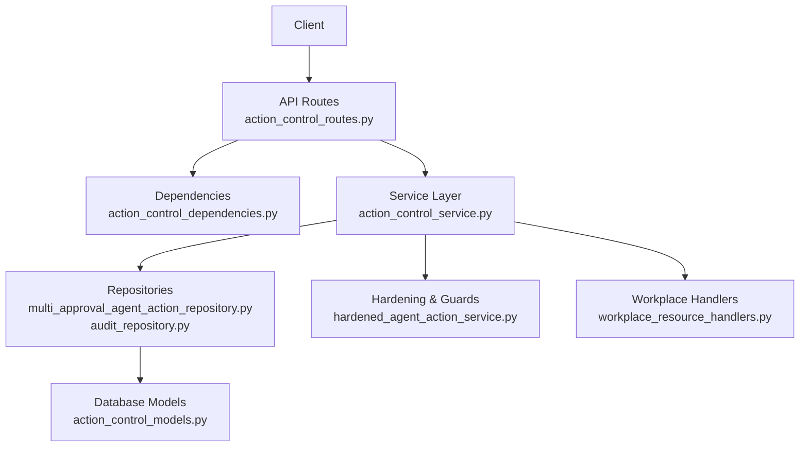
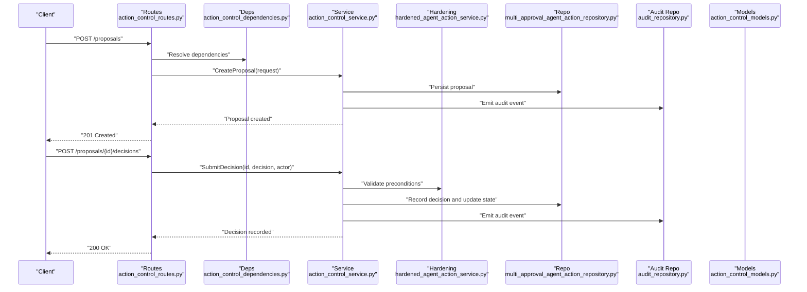
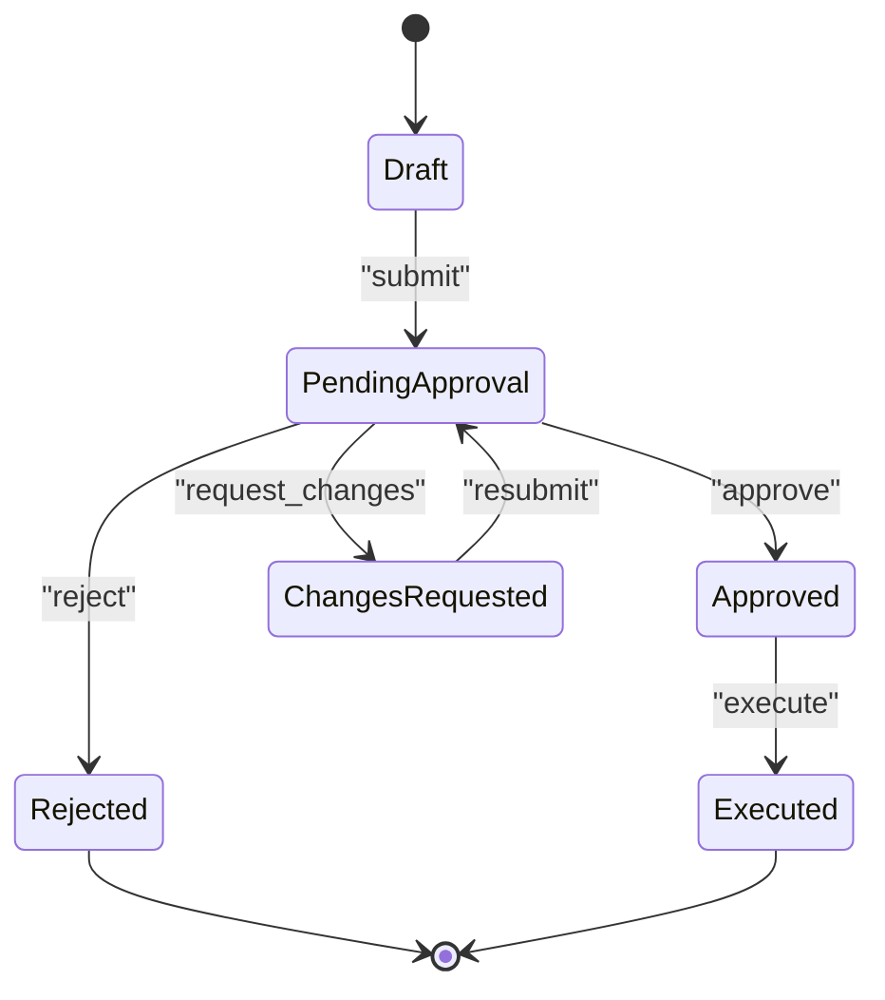
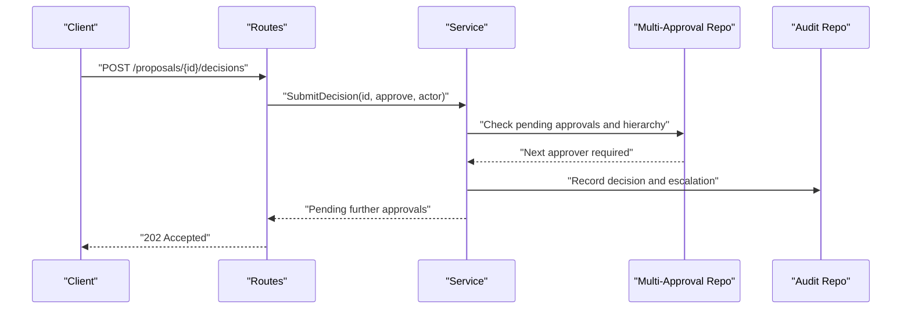
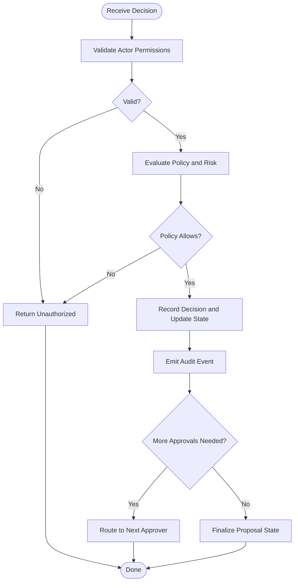
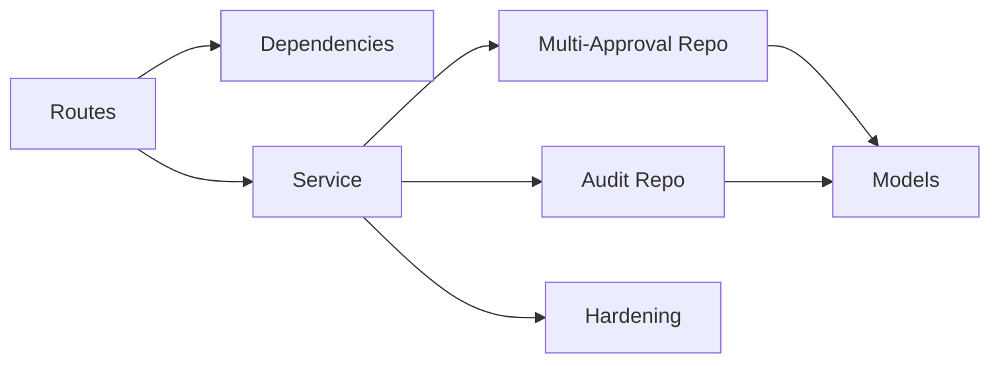

# Approval Workflow API

<cite>
**Referenced Files in This Document**
- [action_control_routes.py](file://app/api/action_control_routes.py)
- [action_control_dependencies.py](file://app/api/action_control_dependencies.py)
- [action_control_service.py](file://app/services/action_control_service.py)
- [multi_approval_agent_action_repository.py](file://app/repositories/multi_approval_agent_action_repository.py)
- [action_control_models.py](file://app/db/action_control_models.py)
- [audit_repository.py](file://app/repositories/audit_repository.py)
- [hardened_agent_action_service.py](file://app/services/hardened_agent_action_service.py)
- [workplace_resource_handlers.py](file://app/agent/workplace_resource_handlers.py)
- [WORKPLACE_WORKFLOWS.md](file://docs/WORKPLACE_WORKFLOWS.md)
- [GOVERNED_ACTION_CONTROL_PLANE.md](file://docs/GOVERNED_ACTION_CONTROL_PLANE.md)
- [test_multi_approval_and_rollback.py](file://tests/test_multi_approval_and_rollback.py)
- [test_phase6_contract.py](file://tests/test_phase6_contract.py)
</cite>

## Table of Contents
1. [Introduction](#introduction)
2. [Project Structure](#project-structure)
3. [Core Components](#core-components)
4. [Architecture Overview](#architecture-overview)
5. [Detailed Component Analysis](#detailed-component-analysis)
6. [Dependency Analysis](#dependency-analysis)
7. [Performance Considerations](#performance-considerations)
8. [Troubleshooting Guide](#troubleshooting-guide)
9. [Conclusion](#conclusion)
10. [Appendices](#appendices)

## Introduction
This document provides comprehensive API documentation for the approval workflow endpoints that govern multi-level approvals, conditional approvals, and delegation patterns within the governed action control plane. It covers decision endpoints (approve, reject, request changes), routing rules, escalation mechanisms, batch operations, history tracking, audit trails, conflict resolution, timeout handling, and automatic fallback procedures. It also includes examples of complex approval chains, conditional routing based on risk levels, and delegation scenarios.

## Project Structure
The approval workflow is implemented across API routes, services, repositories, and domain models:
- API layer exposes HTTP endpoints for proposal submission, approval decisions, and queries.
- Service layer orchestrates policy evaluation, state transitions, and side effects.
- Repository layer persists approval states, decisions, and audit records.
- Domain models define entities such as proposals, approvals, and audit events.

**Diagram sources**
- [action_control_routes.py](file://app/api/action_control_routes.py)
- [action_control_dependencies.py](file://app/api/action_control_dependencies.py)
- [action_control_service.py](file://app/services/action_control_service.py)
- [multi_approval_agent_action_repository.py](file://app/repositories/multi_approval_agent_action_repository.py)
- [audit_repository.py](file://app/repositories/audit_repository.py)
- [action_control_models.py](file://app/db/action_control_models.py)
- [hardened_agent_action_service.py](file://app/services/hardened_agent_action_service.py)
- [workplace_resource_handlers.py](file://app/agent/workplace_resource_handlers.py)

**Section sources**
- [action_control_routes.py](file://app/api/action_control_routes.py)
- [action_control_service.py](file://app/services/action_control_service.py)
- [action_control_models.py](file://app/db/action_control_models.py)

## Core Components
- Proposal Submission: Creates a new governed action proposal with metadata, target resource, and requested operation.
- Decision Endpoints: Approve, Reject, Request Changes with optional comments and delegation context.
- Query Endpoints: Retrieve proposal status, pending approvals, and decision history.
- Batch Operations: Submit multiple decisions or query batches of proposals.
- Audit Trail: Immutable records of all actions, decisions, and state transitions.
- Escalation and Delegation: Route approvals to alternate approvers when primary is unavailable or by policy.
- Risk-Based Routing: Conditional routing based on action risk level and organizational policies.

Key responsibilities:
- API routes validate requests and delegate to services.
- Services enforce policies, orchestrate state transitions, and emit audit events.
- Repositories persist data and ensure consistency.
- Hardening service applies safety checks before execution.

**Section sources**
- [action_control_routes.py](file://app/api/action_control_routes.py)
- [action_control_service.py](file://app/services/action_control_service.py)
- [hardened_agent_action_service.py](file://app/services/hardened_agent_action_service.py)

## Architecture Overview
The approval workflow follows a layered architecture with clear separation between presentation, orchestration, persistence, and enforcement.

**Diagram sources**
- [action_control_routes.py](file://app/api/action_control_routes.py)
- [action_control_dependencies.py](file://app/api/action_control_dependencies.py)
- [action_control_service.py](file://app/services/action_control_service.py)
- [hardened_agent_action_service.py](file://app/services/hardened_agent_action_service.py)
- [multi_approval_agent_action_repository.py](file://app/repositories/multi_approval_agent_action_repository.py)
- [audit_repository.py](file://app/repositories/audit_repository.py)
- [action_control_models.py](file://app/db/action_control_models.py)

## Detailed Component Analysis

### Proposal Lifecycle and State Machine
Proposals transition through states such as Draft, PendingApproval, Approved, Rejected, ChangesRequested, and Executed. Transitions are guarded by policy checks and require appropriate permissions.

**Diagram sources**
- [action_control_models.py](file://app/db/action_control_models.py)
- [action_control_service.py](file://app/services/action_control_service.py)

**Section sources**
- [action_control_models.py](file://app/db/action_control_models.py)
- [action_control_service.py](file://app/services/action_control_service.py)

### Decision Endpoints
- Approve: Records an approval decision from an authorized actor; may be part of multi-level hierarchy.
- Reject: Records a rejection decision; finalizes the proposal unless overridden by higher authority.
- Request Changes: Returns the proposal to the proposer with feedback; allows resubmission.

Routing rules:
- Multi-level hierarchies require sequential or parallel approvals depending on policy.
- Conditional approvals can be enforced by risk level, resource sensitivity, or operator role.
- Delegation allows temporary reassignment to alternate approvers.

Escalation mechanisms:
- If primary approver is inactive or times out, escalate to secondary approver per policy.
- Automatic fallback ensures progress when approvals stall beyond configured thresholds.

Batch operations:
- Submit multiple decisions in one call for efficiency.
- Batch queries retrieve statuses and histories for multiple proposals.

**Section sources**
- [action_control_routes.py](file://app/api/action_control_routes.py)
- [action_control_service.py](file://app/services/action_control_service.py)
- [multi_approval_agent_action_repository.py](file://app/repositories/multi_approval_agent_action_repository.py)

### Approval History and Audit Trail
Every decision and state change is recorded immutably:
- Actor identity, timestamp, decision type, and rationale.
- Chain of custody for delegated approvals.
- Correlation IDs linking decisions to specific proposals and runs.

Querying history:
- Retrieve full decision timeline for a proposal.
- Filter by actor, decision type, or time range.

**Section sources**
- [audit_repository.py](file://app/repositories/audit_repository.py)
- [action_control_service.py](file://app/services/action_control_service.py)

### Conflict Resolution
Conflicts arise when multiple actors attempt concurrent decisions or when policies disagree:
- Optimistic concurrency control prevents overwriting newer decisions.
- Policy arbitration selects the authoritative decision path.
- Rollback procedures restore consistent state if necessary.

**Section sources**
- [multi_approval_agent_action_repository.py](file://app/repositories/multi_approval_agent_action_repository.py)
- [hardened_agent_action_service.py](file://app/services/hardened_agent_action_service.py)

### Timeout Handling and Automatic Fallback
Timeouts are enforced at each approval stage:
- Configurable thresholds determine when an approver is considered inactive.
- Escalation triggers automatically route to next approver in hierarchy.
- Fallback procedures ensure proposals do not remain stuck indefinitely.

**Section sources**
- [action_control_service.py](file://app/services/action_control_service.py)
- [hardened_agent_action_service.py](file://app/services/hardened_agent_action_service.py)

### Risk-Based Conditional Routing
Risk assessment influences routing:
- High-risk actions require additional approvals or stricter conditions.
- Low-risk actions may proceed with fewer approvals or automated checks.
- Policies evaluate resource attributes, operator roles, and historical behavior.

**Section sources**
- [workplace_resource_handlers.py](file://app/agent/workplace_resource_handlers.py)
- [action_control_service.py](file://app/services/action_control_service.py)

### Delegation Patterns
Delegation supports continuity:
- Primary approver delegates to alternate approver for a defined period.
- Delegation scope can be limited to specific proposals or resources.
- Audit trail captures delegation context and expiration.

**Section sources**
- [action_control_service.py](file://app/services/action_control_service.py)
- [audit_repository.py](file://app/repositories/audit_repository.py)

### Complex Approval Chains
Examples:
- Sequential approvals: Manager → Director → VP for high-risk changes.
- Parallel approvals: Security + Compliance must both approve independently.
- Conditional branches: If risk > threshold, add Legal review; else skip.

These patterns are modeled via policy definitions and enforced by the service layer.

**Section sources**
- [action_control_service.py](file://app/services/action_control_service.py)
- [multi_approval_agent_action_repository.py](file://app/repositories/multi_approval_agent_action_repository.py)

### Sequence Diagram: Multi-Level Approval Flow

**Diagram sources**
- [action_control_routes.py](file://app/api/action_control_routes.py)
- [action_control_service.py](file://app/services/action_control_service.py)
- [multi_approval_agent_action_repository.py](file://app/repositories/multi_approval_agent_action_repository.py)
- [audit_repository.py](file://app/repositories/audit_repository.py)

### Flowchart: Decision Evaluation Logic

**Diagram sources**
- [action_control_service.py](file://app/services/action_control_service.py)
- [hardened_agent_action_service.py](file://app/services/hardened_agent_action_service.py)

## Dependency Analysis
The approval workflow depends on several modules:
- API routes depend on dependency injection for services and repositories.
- Services depend on repositories for persistence and hardening for safety checks.
- Repositories depend on database models and ORM sessions.
- Audit repository integrates with centralized logging and compliance systems.

**Diagram sources**
- [action_control_routes.py](file://app/api/action_control_routes.py)
- [action_control_dependencies.py](file://app/api/action_control_dependencies.py)
- [action_control_service.py](file://app/services/action_control_service.py)
- [multi_approval_agent_action_repository.py](file://app/repositories/multi_approval_agent_action_repository.py)
- [audit_repository.py](file://app/repositories/audit_repository.py)
- [action_control_models.py](file://app/db/action_control_models.py)
- [hardened_agent_action_service.py](file://app/services/hardened_agent_action_service.py)

**Section sources**
- [action_control_routes.py](file://app/api/action_control_routes.py)
- [action_control_dependencies.py](file://app/api/action_control_dependencies.py)
- [action_control_service.py](file://app/services/action_control_service.py)
- [multi_approval_agent_action_repository.py](file://app/repositories/multi_approval_agent_action_repository.py)
- [audit_repository.py](file://app/repositories/audit_repository.py)
- [action_control_models.py](file://app/db/action_control_models.py)
- [hardened_agent_action_service.py](file://app/services/hardened_agent_action_service.py)

## Performance Considerations
- Use batch endpoints to reduce network overhead for bulk decisions.
- Leverage optimistic concurrency to minimize locking contention.
- Cache frequently accessed policy results where safe.
- Stream audit events asynchronously to avoid blocking decision paths.

[No sources needed since this section provides general guidance]

## Troubleshooting Guide
Common issues and resolutions:
- Unauthorized decisions: Verify actor permissions and delegation scope.
- Stalled approvals: Check timeouts and escalation configuration.
- Conflicting decisions: Inspect concurrency controls and rollback logs.
- Missing audit entries: Ensure audit repository integration is healthy.

**Section sources**
- [hardened_agent_action_service.py](file://app/services/hardened_agent_action_service.py)
- [audit_repository.py](file://app/repositories/audit_repository.py)

## Conclusion
The approval workflow API provides robust support for multi-level approvals, conditional routing, delegation, and comprehensive auditing. Its layered design ensures clarity, maintainability, and extensibility while enforcing safety and compliance through hardening and policy checks.

[No sources needed since this section summarizes without analyzing specific files]

## Appendices

### References and Contracts
- Workplace workflows overview and requirements.
- Governed action control plane contracts and semantics.

**Section sources**
- [WORKPLACE_WORKFLOWS.md](file://docs/WORKPLACE_WORKFLOWS.md)
- [GOVERNED_ACTION_CONTROL_PLANE.md](file://docs/GOVERNED_ACTION_CONTROL_PLANE.md)

### Test Coverage Highlights
- Multi-approval and rollback scenarios validated end-to-end.
- Phase 6 contract tests confirm API behaviors and state transitions.

**Section sources**
- [test_multi_approval_and_rollback.py](file://tests/test_multi_approval_and_rollback.py)
- [test_phase6_contract.py](file://tests/test_phase6_contract.py)