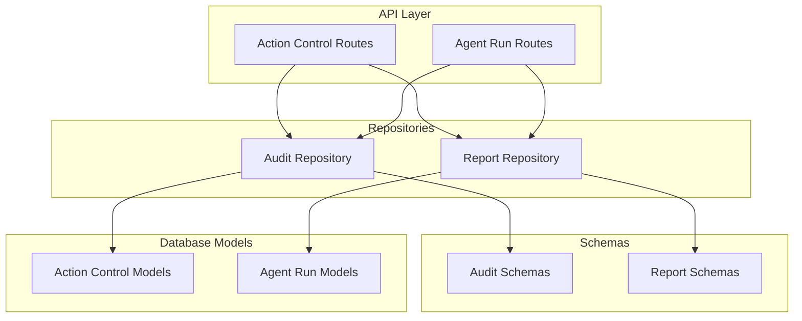
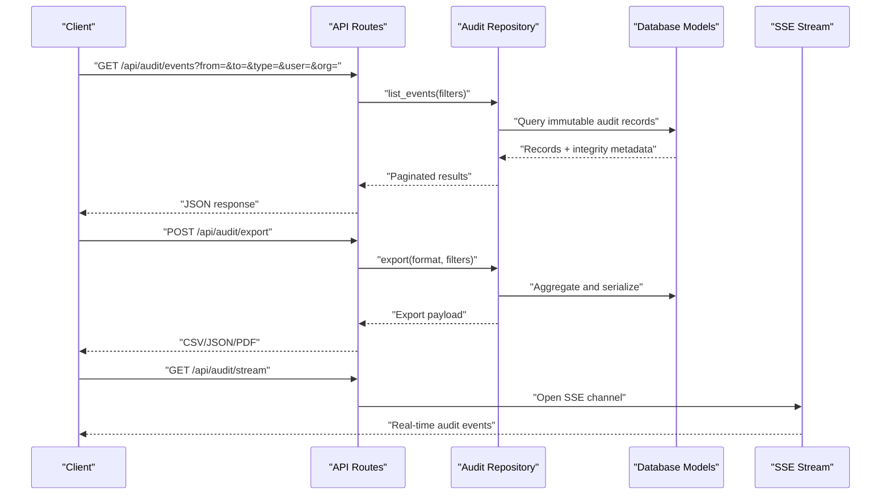
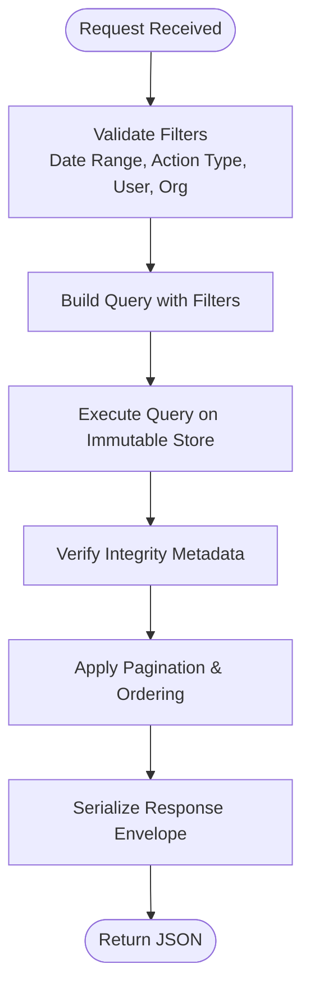
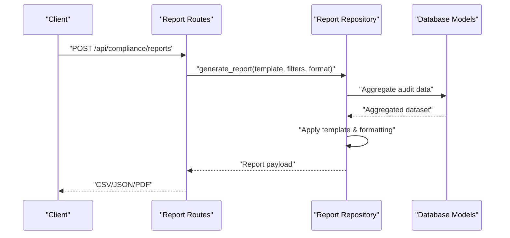
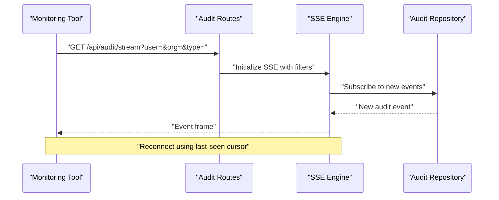
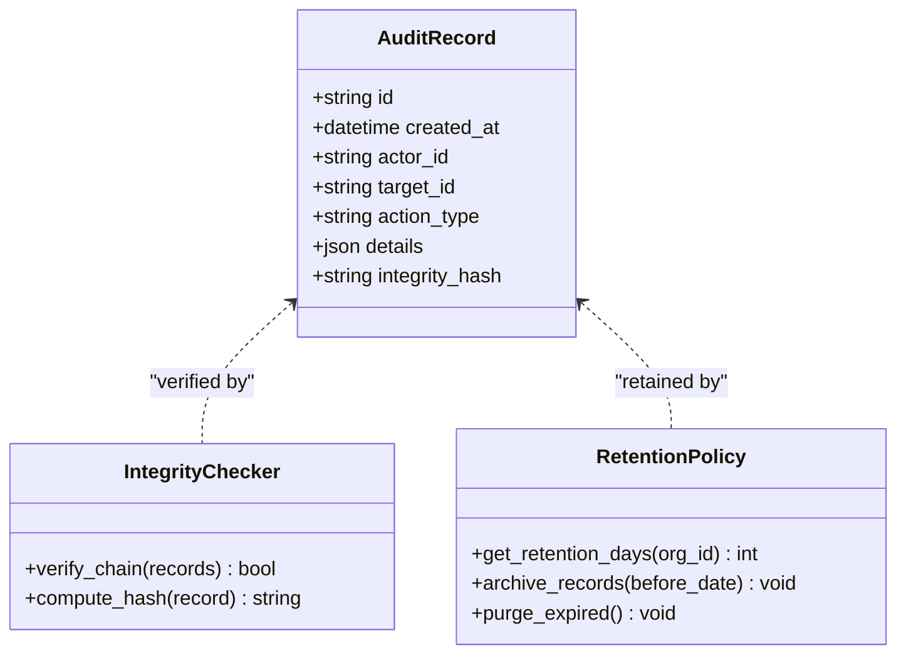
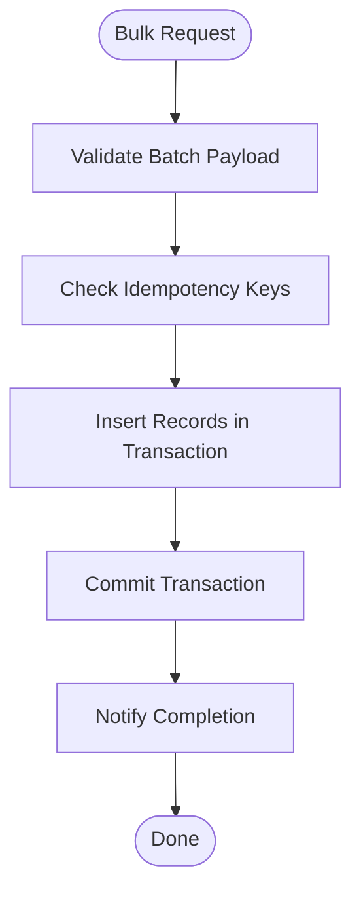
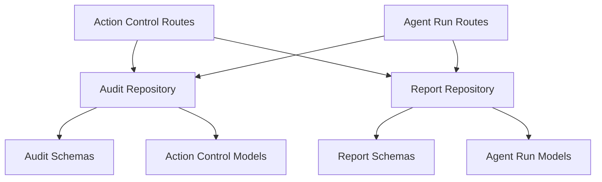

# Audit Trail API

<cite>
**Referenced Files in This Document**
- [audit_repository.py](file://app/repositories/audit_repository.py)
- [report_repository.py](file://app/repositories/report_repository.py)
- [audit.py](file://app/schemas/audit.py)
- [report.py](file://app/schemas/report.py)
- [action_control_routes.py](file://app/api/action_control_routes.py)
- [agent_run_routes.py](file://app/api/agent_run_routes.py)
- [action_control_models.py](file://app/db/action_control_models.py)
- [agent_run_models.py](file://app/db/agent_run_models.py)
- [test_audit.py](file://tests/test_audit.py)
- [test_reports.py](file://tests/test_reports.py)
</cite>

## Table of Contents
1. [Introduction](#introduction)
2. [Project Structure](#project-structure)
3. [Core Components](#core-components)
4. [Architecture Overview](#architecture-overview)
5. [Detailed Component Analysis](#detailed-component-analysis)
6. [Dependency Analysis](#dependency-analysis)
7. [Performance Considerations](#performance-considerations)
8. [Troubleshooting Guide](#troubleshooting-guide)
9. [Conclusion](#conclusion)
10. [Appendices](#appendices)

## Introduction
This document provides detailed API documentation for audit trail and compliance reporting endpoints. It covers action history queries, forensic analysis tools, and compliance report generation. The scope includes filtering by date ranges, action types, users, and organizations; immutable audit logging with tamper detection; data retention policies; export formats; bulk operations; real-time audit event streaming; example workflows; and integration points with external audit systems and regulatory frameworks.

## Project Structure
The audit and compliance features are implemented across repositories, schemas, API routes, and database models:
- Repositories encapsulate query logic for audit events and reports.
- Schemas define request/response contracts for audit and report APIs.
- API routes expose HTTP endpoints for querying, exporting, and streaming.
- Database models represent the underlying entities for actions, runs, and audit records.
- Tests validate behavior, including filtering, immutability, and export formats.

**Diagram sources**
- [action_control_routes.py](file://app/api/action_control_routes.py)
- [agent_run_routes.py](file://app/api/agent_run_routes.py)
- [audit_repository.py](file://app/repositories/audit_repository.py)
- [report_repository.py](file://app/repositories/report_repository.py)
- [audit.py](file://app/schemas/audit.py)
- [report.py](file://app/schemas/report.py)
- [action_control_models.py](file://app/db/action_control_models.py)
- [agent_run_models.py](file://app/db/agent_run_models.py)

**Section sources**
- [audit_repository.py](file://app/repositories/audit_repository.py)
- [report_repository.py](file://app/repositories/report_repository.py)
- [audit.py](file://app/schemas/audit.py)
- [report.py](file://app/schemas/report.py)
- [action_control_routes.py](file://app/api/action_control_routes.py)
- [agent_run_routes.py](file://app/api/agent_run_routes.py)
- [action_control_models.py](file://app/db/action_control_models.py)
- [agent_run_models.py](file://app/db/agent_run_models.py)

## Core Components
- Audit Repository: Provides methods to query immutable audit events with filters (date range, action type, user, organization), pagination, and ordering. It also supports integrity checks and export helpers.
- Report Repository: Generates compliance reports, aggregates metrics, and exports results in multiple formats.
- Audit Schemas: Define request parameters (filters, pagination) and response envelopes for audit queries.
- Report Schemas: Define report templates, output formats, and payload structures for compliance artifacts.
- API Routes: Expose endpoints for listing audit events, generating reports, exporting data, and streaming real-time audit events.
- Database Models: Represent core entities such as actions, agent runs, and audit records used by repositories.

Key responsibilities:
- Immutable logging: Append-only writes with integrity metadata.
- Tamper detection: Integrity verification using cryptographic hashes or checksums.
- Filtering: Date ranges, action types, users, organizations.
- Export: CSV, JSON, and PDF where applicable.
- Streaming: Server-sent events for real-time audit event ingestion.
- Bulk operations: Batch creation and batch export.

**Section sources**
- [audit_repository.py](file://app/repositories/audit_repository.py)
- [report_repository.py](file://app/repositories/report_repository.py)
- [audit.py](file://app/schemas/audit.py)
- [report.py](file://app/schemas/report.py)
- [action_control_routes.py](file://app/api/action_control_routes.py)
- [agent_run_routes.py](file://app/api/agent_run_routes.py)
- [action_control_models.py](file://app/db/action_control_models.py)
- [agent_run_models.py](file://app/db/agent_run_models.py)

## Architecture Overview
The audit trail system follows a layered architecture:
- API layer exposes REST endpoints and SSE streams.
- Repository layer implements domain-specific queries and export logic.
- Schema layer validates inputs and serializes outputs.
- Data layer persists immutable records and supports integrity checks.

**Diagram sources**
- [action_control_routes.py](file://app/api/action_control_routes.py)
- [agent_run_routes.py](file://app/api/agent_run_routes.py)
- [audit_repository.py](file://app/repositories/audit_repository.py)
- [agent_run_models.py](file://app/db/agent_run_models.py)

## Detailed Component Analysis

### Audit Events Query Endpoint
- Purpose: Retrieve immutable audit events with comprehensive filtering and pagination.
- Filters:
  - Date range: from, to
  - Action type: create, update, delete, approve, revoke, etc.
  - User: user_id or username
  - Organization: org_id or org_name
  - Pagination: page, page_size
  - Ordering: created_at desc/asc
- Response: Paginated list of audit events with metadata (id, timestamp, actor, target, details, integrity hash).

**Diagram sources**
- [audit_repository.py](file://app/repositories/audit_repository.py)
- [audit.py](file://app/schemas/audit.py)
- [action_control_routes.py](file://app/api/action_control_routes.py)

**Section sources**
- [audit_repository.py](file://app/repositories/audit_repository.py)
- [audit.py](file://app/schemas/audit.py)
- [action_control_routes.py](file://app/api/action_control_routes.py)

### Compliance Report Generation Endpoint
- Purpose: Generate compliance reports based on audit data and organizational policies.
- Inputs:
  - Report template identifier
  - Filters (same as audit events)
  - Output format (CSV, JSON, PDF)
  - Optional aggregation options (by user, org, action type)
- Outputs:
  - Structured report payload
  - Summary statistics
  - Attachments (PDF) when requested

**Diagram sources**
- [report_repository.py](file://app/repositories/report_repository.py)
- [report.py](file://app/schemas/report.py)
- [agent_run_routes.py](file://app/api/agent_run_routes.py)

**Section sources**
- [report_repository.py](file://app/repositories/report_repository.py)
- [report.py](file://app/schemas/report.py)
- [agent_run_routes.py](file://app/api/agent_run_routes.py)

### Real-Time Audit Event Streaming (SSE)
- Purpose: Provide a live stream of audit events for monitoring and alerting.
- Features:
  - Persistent connection via Server-Sent Events
  - Filtered streams by user, org, action type
  - Reconnection support with last-seen cursor
- Usage:
  - Subscribe to /api/audit/stream with optional query parameters
  - Receive incremental events as they occur

**Diagram sources**
- [action_control_routes.py](file://app/api/action_control_routes.py)
- [audit_repository.py](file://app/repositories/audit_repository.py)

**Section sources**
- [action_control_routes.py](file://app/api/action_control_routes.py)
- [audit_repository.py](file://app/repositories/audit_repository.py)

### Immutable Audit Logging and Tamper Detection
- Immutable logging:
  - Append-only writes to audit store
  - No updates or deletes after initial write
- Tamper detection:
  - Each record includes integrity metadata (hash/checksum)
  - Verification endpoint to validate chain integrity
- Data retention:
  - Configurable retention periods per organization
  - Archival and purge jobs based on policy

**Diagram sources**
- [audit_repository.py](file://app/repositories/audit_repository.py)
- [action_control_models.py](file://app/db/action_control_models.py)

**Section sources**
- [audit_repository.py](file://app/repositories/audit_repository.py)
- [action_control_models.py](file://app/db/action_control_models.py)

### Bulk Audit Operations
- Bulk creation:
  - Batch insert of audit events with transactional guarantees
  - Idempotency keys to prevent duplicates
- Bulk export:
  - Asynchronous export job for large datasets
  - Progress tracking and completion notifications

**Diagram sources**
- [audit_repository.py](file://app/repositories/audit_repository.py)

**Section sources**
- [audit_repository.py](file://app/repositories/audit_repository.py)

### Example Compliance Queries and Workflows
- Example queries:
  - List all approval actions by a specific user within a date range
  - Aggregate failed actions by organization for the last quarter
  - Export audit logs for a specific org in CSV format
- Forensic investigation workflow:
  - Identify suspicious activity via filtered queries
  - Verify integrity of relevant audit chain
  - Export evidence package for review
  - Archive findings according to retention policy

**Section sources**
- [test_audit.py](file://tests/test_audit.py)
- [test_reports.py](file://tests/test_reports.py)

### Integration with External Audit Systems and Regulatory Frameworks
- Webhook delivery:
  - Push audit events to external SIEM or compliance systems
  - Retry and dead-letter queue for reliability
- Standardized formats:
  - Support for common compliance schemas (e.g., JSON-LD, OpenAPI-based contracts)
- Regulatory alignment:
  - Mapping of internal action types to regulatory categories
  - Audit trails suitable for SOX, GDPR, HIPAA, PCI-DSS requirements

[No sources needed since this section provides general guidance]

## Dependency Analysis
The audit and compliance components depend on repositories, schemas, and models as shown below.

**Diagram sources**
- [action_control_routes.py](file://app/api/action_control_routes.py)
- [agent_run_routes.py](file://app/api/agent_run_routes.py)
- [audit_repository.py](file://app/repositories/audit_repository.py)
- [report_repository.py](file://app/repositories/report_repository.py)
- [audit.py](file://app/schemas/audit.py)
- [report.py](file://app/schemas/report.py)
- [action_control_models.py](file://app/db/action_control_models.py)
- [agent_run_models.py](file://app/db/agent_run_models.py)

**Section sources**
- [action_control_routes.py](file://app/api/action_control_routes.py)
- [agent_run_routes.py](file://app/api/agent_run_routes.py)
- [audit_repository.py](file://app/repositories/audit_repository.py)
- [report_repository.py](file://app/repositories/report_repository.py)
- [audit.py](file://app/schemas/audit.py)
- [report.py](file://app/schemas/report.py)
- [action_control_models.py](file://app/db/action_control_models.py)
- [agent_run_models.py](file://app/db/agent_run_models.py)

## Performance Considerations
- Indexing: Ensure indexes on frequently filtered fields (created_at, actor_id, target_id, org_id).
- Pagination: Use cursor-based pagination for large result sets.
- Streaming: Implement backpressure and buffering strategies for SSE.
- Export: Offload heavy exports to background jobs with progress tracking.
- Integrity checks: Cache integrity metadata to reduce computation overhead.

[No sources needed since this section provides general guidance]

## Troubleshooting Guide
Common issues and resolutions:
- Missing filters: Validate required parameters before executing queries.
- Integrity failures: Recompute hashes and verify chain consistency.
- Export timeouts: Use asynchronous jobs and provide status endpoints.
- SSE disconnections: Implement reconnection with last-seen cursor.

**Section sources**
- [test_audit.py](file://tests/test_audit.py)
- [test_reports.py](file://tests/test_reports.py)

## Conclusion
The audit trail and compliance reporting system provides robust capabilities for immutable logging, tamper detection, filtering, export, and real-time streaming. It supports bulk operations and integrates with external systems to meet regulatory requirements. Proper indexing, pagination, and background processing ensure scalability and reliability.

[No sources needed since this section summarizes without analyzing specific files]

## Appendices

### API Endpoints Summary
- GET /api/audit/events: List audit events with filters and pagination.
- POST /api/audit/export: Export audit data in specified format.
- GET /api/audit/stream: Subscribe to real-time audit events via SSE.
- POST /api/compliance/reports: Generate compliance reports with templates and filters.

[No sources needed since this section provides general guidance]