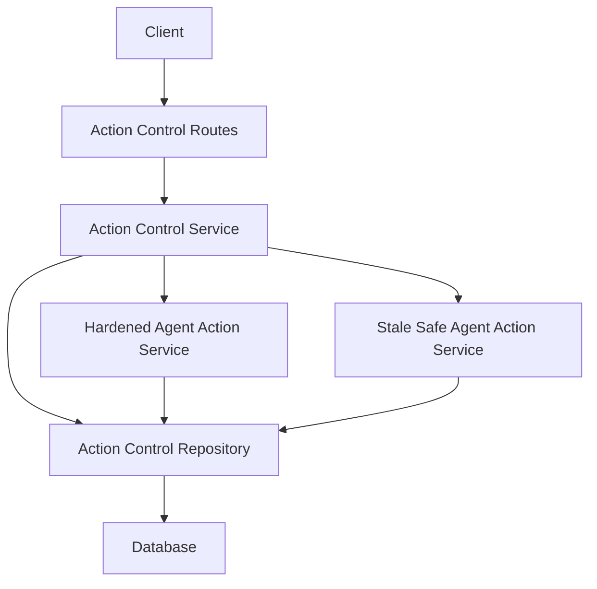
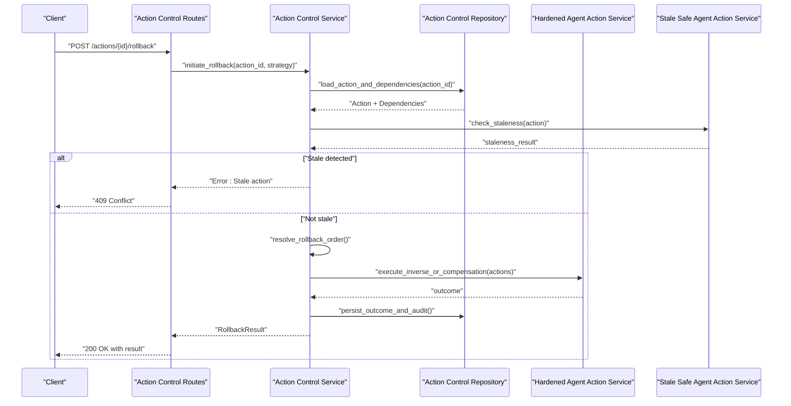
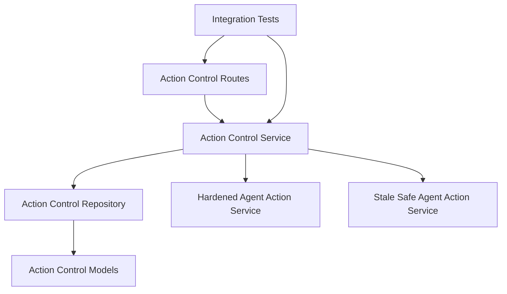

# Rollback & Compensation API

<cite>
**Referenced Files in This Document**
- [action_control_routes.py](file://app/api/action_control_routes.py)
- [action_control_service.py](file://app/services/action_control_service.py)
- [action_control_models.py](file://app/db/action_control_models.py)
- [action_control_repository.py](file://app/repositories/action_control_repository.py)
- [action_contracts.py](file://app/agent/action_contracts.py)
- [action_errors.py](file://app/agent/action_errors.py)
- [stale_safe_agent_action_service.py](file://app/services/stale_safe_agent_action_service.py)
- [hardened_agent_action_service.py](file://app/services/hardened_agent_action_service.py)
- [multi_approval_agent_action_repository.py](file://app/repositories/multi_approval_agent_action_repository.py)
- [test_multi_approval_and_rollback.py](file://tests/test_multi_approval_and_rollback.py)
- [test_inverse_operational_actions.py](file://tests/test_inverse_operational_actions.py)
- [test_inverse_action_staleness.py](file://tests/test_inverse_action_staleness.py)
</cite>

## Table of Contents
1. [Introduction](#introduction)
2. [Project Structure](#project-structure)
3. [Core Components](#core-components)
4. [Architecture Overview](#architecture-overview)
5. [Detailed Component Analysis](#detailed-component-analysis)
6. [Dependency Analysis](#dependency-analysis)
7. [Performance Considerations](#performance-considerations)
8. [Troubleshooting Guide](#troubleshooting-guide)
9. [Conclusion](#conclusion)
10. [Appendices](#appendices)

## Introduction
This document provides comprehensive API documentation for rollback and compensation mechanisms within the governed action control plane. It covers:
- Action reversal endpoints and their semantics
- Compensation action creation and lifecycle
- Rollback strategy selection (automatic vs manual)
- Idempotent rollback operations and partial rollback support
- Dependency resolution for complex action chains
- Stale action detection and automatic compensation triggers
- Manual intervention points and safety checks
- Preconditions validation and failure recovery procedures
- Examples of automated rollback scenarios, manual compensation actions, and mixed strategies across different action types

The goal is to enable both automated systems and human operators to reliably reverse or compensate for actions while preserving consistency and auditability.

## Project Structure
Rollback and compensation capabilities are implemented across API routes, services, repositories, domain models, and tests. The key areas include:
- API layer: HTTP endpoints for initiating rollbacks and querying status
- Service layer: Orchestration of rollback logic, dependency resolution, and compensation creation
- Repository layer: Persistence of action states, inverse actions, and outcomes
- Domain models: State machines, contracts, and error definitions
- Tests: End-to-end coverage for multi-approval, inverse operational actions, and staleness handling

**Diagram sources**
- [action_control_routes.py](file://app/api/action_control_routes.py)
- [action_control_service.py](file://app/services/action_control_service.py)
- [action_control_repository.py](file://app/repositories/action_control_repository.py)
- [hardened_agent_action_service.py](file://app/services/hardened_agent_action_service.py)
- [stale_safe_agent_action_service.py](file://app/services/stale_safe_agent_action_service.py)

**Section sources**
- [action_control_routes.py](file://app/api/action_control_routes.py)
- [action_control_service.py](file://app/services/action_control_service.py)
- [action_control_repository.py](file://app/repositories/action_control_repository.py)
- [action_control_models.py](file://app/db/action_control_models.py)

## Core Components
- Action Control Routes: Expose endpoints to initiate rollbacks, query action state, and manage compensation actions.
- Action Control Service: Implements rollback orchestration, including dependency resolution, idempotency, partial rollback, and compensation creation.
- Repositories: Persist action states, inverse actions, and outcomes; enforce constraints and provide queries for stale detection.
- Hardened Agent Action Service: Adds robustness guarantees around execution and rollback transitions.
- Stale Safe Agent Action Service: Provides staleness-aware operations to prevent unsafe rollbacks on outdated actions.
- Contracts and Errors: Define action contracts, inverse action semantics, and error codes used by rollback flows.

Key responsibilities:
- Validate preconditions before rollback
- Resolve dependencies among actions to determine safe rollback order
- Create compensation actions when direct inverse actions are not available
- Ensure idempotency for repeated rollback requests
- Support partial rollback for large or dependent chains
- Detect stale actions and block unsafe operations

**Section sources**
- [action_control_routes.py](file://app/api/action_control_routes.py)
- [action_control_service.py](file://app/services/action_control_service.py)
- [action_control_repository.py](file://app/repositories/action_control_repository.py)
- [hardened_agent_action_service.py](file://app/services/hardened_agent_action_service.py)
- [stale_safe_agent_action_service.py](file://app/services/stale_safe_agent_action_service.py)
- [action_contracts.py](file://app/agent/action_contracts.py)
- [action_errors.py](file://app/agent/action_errors.py)

## Architecture Overview
The rollback architecture follows a layered approach with clear separation between API, service, repository, and domain concerns. Rollback requests flow through routes into the service, which coordinates with repositories and specialized services to perform safe reversals or create compensations.

**Diagram sources**
- [action_control_routes.py](file://app/api/action_control_routes.py)
- [action_control_service.py](file://app/services/action_control_service.py)
- [action_control_repository.py](file://app/repositories/action_control_repository.py)
- [hardened_agent_action_service.py](file://app/services/hardened_agent_action_service.py)
- [stale_safe_agent_action_service.py](file://app/services/stale_safe_agent_action_service.py)

## Detailed Component Analysis

### Action Reversal Endpoints
Endpoints exposed by the action control routes allow clients to:
- Initiate a rollback for a specific action
- Query current action state and rollback progress
- List pending compensation actions related to an action chain
- Trigger manual compensation when automatic rollback is not possible

Behavior highlights:
- Idempotency: Repeated calls with the same request context produce consistent results without side effects
- Partial rollback: When full rollback is blocked by dependencies, the system performs the largest safe subset
- Strategy selection: Automatic rollback uses inverse actions where available; otherwise, it creates compensation actions
- Safety checks: Precondition validation and staleness detection prevent unsafe operations

Typical client workflow:
- Submit rollback request with action ID and optional strategy hint
- Receive immediate acknowledgment if accepted
- Poll status endpoint until completion or failure
- Review outcome and any created compensation actions

**Section sources**
- [action_control_routes.py](file://app/api/action_control_routes.py)
- [action_control_service.py](file://app/services/action_control_service.py)

### Compensation Action Creation
When a direct inverse action is unavailable or insufficient, the service creates a compensation action to restore desired state. Compensation actions:
- Are persisted with explicit linkage to the original action
- Include metadata describing intent, scope, and expected effect
- Follow the same lifecycle and approval workflows as regular actions
- Can be executed automatically or manually based on policy

Creation process:
- Analyze original action’s effects and dependencies
- Determine whether inverse action exists and is applicable
- If not, synthesize a compensation plan
- Persist compensation action(s) and schedule execution per strategy

Idempotent behavior ensures that duplicate compensation creation attempts do not lead to duplicated work.

**Section sources**
- [action_control_service.py](file://app/services/action_control_service.py)
- [action_control_repository.py](file://app/repositories/action_control_repository.py)
- [action_contracts.py](file://app/agent/action_contracts.py)

### Rollback Strategy Selection
Strategies determine how rollback proceeds:
- Automatic: Prefer inverse actions; fall back to compensation if necessary
- Manual: Require operator confirmation before proceeding
- Mixed: Combine automatic and manual steps depending on risk level and policy

Selection criteria:
- Action type and associated policies
- Availability of inverse actions
- Dependency graph complexity
- Staleness and precondition status
- Approval requirements from multi-approval workflows

The service resolves the optimal strategy and may adapt at runtime if conditions change.

**Section sources**
- [action_control_service.py](file://app/services/action_control_service.py)
- [multi_approval_agent_action_repository.py](file://app/repositories/multi_approval_agent_action_repository.py)

### Idempotent Rollback Operations
Rollback endpoints are designed to be idempotent:
- Duplicate requests are recognized via request identifiers or stable parameters
- In-flight rollbacks can be safely retried without duplication
- Outcomes are deterministic given the same initial state

Implementation considerations:
- Track rollback initiation IDs
- Guard against concurrent modifications
- Return consistent responses for retries

**Section sources**
- [action_control_service.py](file://app/services/action_control_service.py)
- [action_control_repository.py](file://app/repositories/action_control_repository.py)

### Partial Rollback Support
For complex action chains, full rollback may be blocked by unresolved dependencies or external constraints. The system supports partial rollback:
- Identify the maximal safe subset of actions to reverse
- Execute those actions first
- Report remaining blockers and suggested next steps
- Allow retry after remediation

Partial rollback results include:
- List of successfully reversed actions
- Remaining actions requiring attention
- Reasons for blocking (e.g., missing approvals, stale state)

**Section sources**
- [action_control_service.py](file://app/services/action_control_service.py)
- [action_control_repository.py](file://app/repositories/action_control_repository.py)

### Dependency Resolution for Complex Action Chains
Rollback must respect dependency relationships:
- Build a dependency graph from action metadata
- Compute a safe rollback order (reverse topological sort)
- Validate each step’s preconditions before execution
- Handle failures gracefully by stopping at the earliest unsafe point

The service integrates with repositories to fetch dependencies and with hardened services to execute steps safely.

**Section sources**
- [action_control_service.py](file://app/services/action_control_service.py)
- [action_control_repository.py](file://app/repositories/action_control_repository.py)
- [hardened_agent_action_service.py](file://app/services/hardened_agent_action_service.py)

### Stale Action Detection and Automatic Compensation Triggers
Stale actions are those whose state has changed since the rollback decision was made. The system:
- Checks staleness before executing rollback steps
- Blocks rollback if staleness is detected
- Optionally triggers automatic compensation if a safe path exists
- Returns detailed errors indicating required manual intervention

Automatic compensation triggers occur when:
- An inverse action cannot be applied due to state drift
- A compensation action is pre-approved and safe to execute
- Policy allows automated mitigation

**Section sources**
- [stale_safe_agent_action_service.py](file://app/services/stale_safe_agent_action_service.py)
- [action_control_service.py](file://app/services/action_control_service.py)

### Manual Intervention Points
Manual intervention is supported for high-risk or ambiguous situations:
- Approve or reject compensation actions
- Override preconditions with documented justification
- Provide additional context for failed rollbacks
- Resume or abort partial rollbacks

Operators interact via dedicated endpoints and UI surfaces integrated with the action control plane.

**Section sources**
- [action_control_routes.py](file://app/api/action_control_routes.py)
- [multi_approval_agent_action_repository.py](file://app/repositories/multi_approval_agent_action_repository.py)

### Rollback Safety Checks and Preconditions Validation
Before any rollback step executes:
- Verify actor permissions and organizational boundaries
- Confirm resource availability and lock status
- Validate preconditions defined by action contracts
- Ensure no conflicting in-flight operations

Failures during validation halt the rollback and return actionable errors.

**Section sources**
- [action_control_service.py](file://app/services/action_control_service.py)
- [action_contracts.py](file://app/agent/action_contracts.py)
- [action_errors.py](file://app/agent/action_errors.py)

### Failure Recovery Procedures
If a rollback fails mid-execution:
- Capture precise failure point and context
- Persist audit trail and intermediate state
- Offer retry with adjusted strategy (e.g., switch to compensation)
- Provide guidance for manual remediation

Recovery options include:
- Retry with exponential backoff for transient errors
- Escalate to manual review for persistent issues
- Generate targeted compensation actions for unhandled cases

**Section sources**
- [action_control_service.py](file://app/services/action_control_service.py)
- [action_errors.py](file://app/agent/action_errors.py)

### Automated Rollback Scenarios
Examples of automated rollback flows:
- Single-action rollback using inverse action
- Multi-step rollback respecting dependency order
- Automatic compensation when inverse action is unavailable
- Partial rollback with clear reporting of remaining tasks

These scenarios are validated by integration tests covering success paths, concurrency, and error conditions.

**Section sources**
- [test_multi_approval_and_rollback.py](file://tests/test_multi_approval_and_rollback.py)
- [test_inverse_operational_actions.py](file://tests/test_inverse_operational_actions.py)

### Manual Compensation Actions
Manual compensation actions are created when automation cannot safely proceed:
- Operator reviews proposed compensation details
- Approves or modifies compensation plan
- Executes compensation under controlled conditions
- Records outcome and updates action state

This pathway ensures governance and traceability for sensitive operations.

**Section sources**
- [action_control_service.py](file://app/services/action_control_service.py)
- [multi_approval_agent_action_repository.py](file://app/repositories/multi_approval_agent_action_repository.py)

### Mixed Rollback Strategies for Different Action Types
Mixed strategies combine automatic and manual steps:
- Low-risk actions auto-rollback via inverse actions
- Medium-risk actions auto-compensate with post-approval
- High-risk actions require manual approval before any reversal

Policy-driven selection ensures appropriate safeguards per action type and context.

**Section sources**
- [action_control_service.py](file://app/services/action_control_service.py)
- [action_contracts.py](file://app/agent/action_contracts.py)

## Dependency Analysis
The rollback subsystem depends on several components:
- Routes depend on the service for business logic
- Service depends on repositories for persistence and queries
- Service integrates with hardened and stale-safe services for robustness
- Tests validate cross-cutting behaviors like multi-approval and staleness

**Diagram sources**
- [action_control_routes.py](file://app/api/action_control_routes.py)
- [action_control_service.py](file://app/services/action_control_service.py)
- [action_control_repository.py](file://app/repositories/action_control_repository.py)
- [action_control_models.py](file://app/db/action_control_models.py)
- [test_multi_approval_and_rollback.py](file://tests/test_multi_approval_and_rollback.py)

**Section sources**
- [action_control_routes.py](file://app/api/action_control_routes.py)
- [action_control_service.py](file://app/services/action_control_service.py)
- [action_control_repository.py](file://app/repositories/action_control_repository.py)
- [action_control_models.py](file://app/db/action_control_models.py)
- [test_multi_approval_and_rollback.py](file://tests/test_multi_approval_and_rollback.py)

## Performance Considerations
- Batch dependency resolution to minimize database round-trips
- Cache stale-check results for short-lived windows to reduce overhead
- Use optimistic locking to detect conflicts early
- Stream partial rollback outcomes to avoid long-running transactions
- Limit compensation action synthesis complexity with policy thresholds

[No sources needed since this section provides general guidance]

## Troubleshooting Guide
Common issues and resolutions:
- Stale action errors: Refresh state and reattempt rollback; consider manual compensation
- Permission denied: Verify actor roles and organizational boundaries
- Dependency deadlock: Break cycles by scheduling manual interventions
- Partial rollback incomplete: Address reported blockers and retry
- Compensation not created: Check policy configuration and inverse action availability

Diagnostic resources:
- Audit logs for rollback attempts and outcomes
- Action state snapshots for pre/post comparisons
- Error codes and messages for precise failure identification

**Section sources**
- [action_errors.py](file://app/agent/action_errors.py)
- [action_control_service.py](file://app/services/action_control_service.py)
- [test_inverse_action_staleness.py](file://tests/test_inverse_action_staleness.py)

## Conclusion
The rollback and compensation API provides robust, policy-driven mechanisms to reverse or mitigate actions safely. By combining automatic strategies with manual oversight, the system ensures reliability, auditability, and compliance across diverse action types and operational contexts.

[No sources needed since this section summarizes without analyzing specific files]

## Appendices

### API Endpoints Summary
- Initiate rollback: POST /actions/{id}/rollback
- Query rollback status: GET /actions/{id}/rollback/status
- List compensation actions: GET /actions/{id}/compensations
- Approve compensation: POST /compensations/{id}/approve
- Reject compensation: POST /compensations/{id}/reject

Note: Endpoint paths are illustrative; consult the route implementations for exact contracts.

**Section sources**
- [action_control_routes.py](file://app/api/action_control_routes.py)

### Data Models Overview
- Action: Represents an executed operation with state and metadata
- Inverse Action: Encapsulates reversal logic for an action
- Compensation Action: Created to restore state when inverse is unavailable
- Rollback Result: Outcome of a rollback attempt including partial successes

**Section sources**
- [action_control_models.py](file://app/db/action_control_models.py)
- [action_contracts.py](file://app/agent/action_contracts.py)