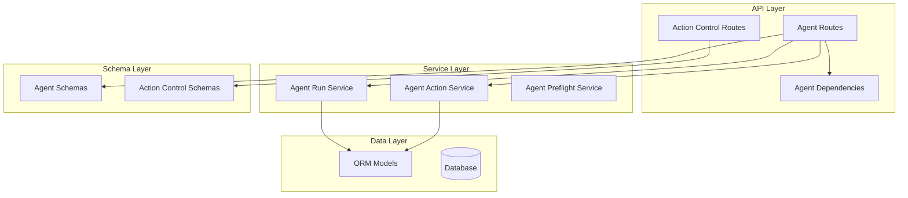
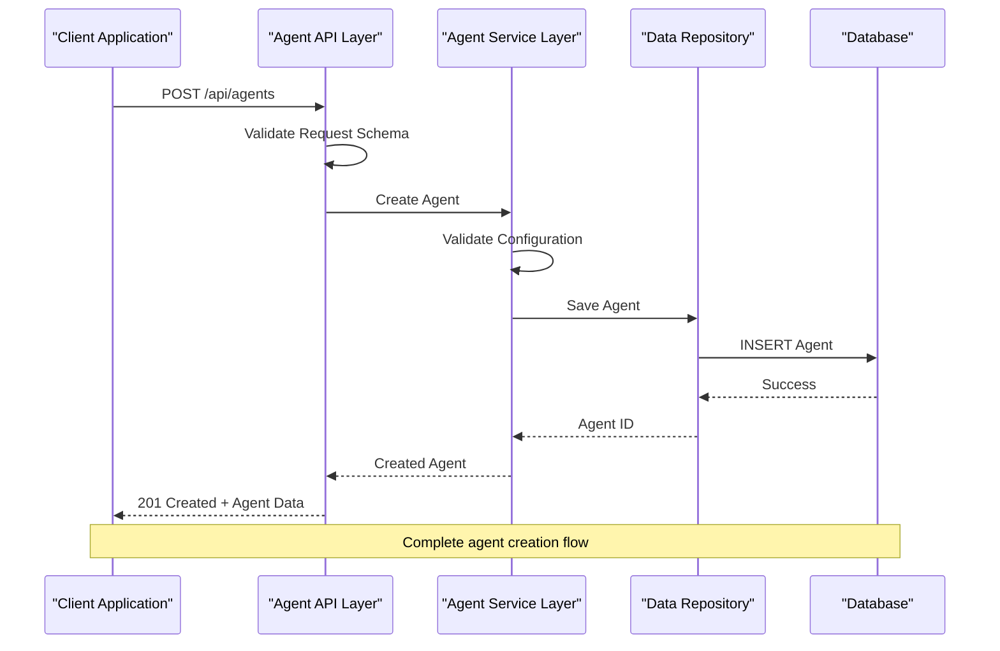
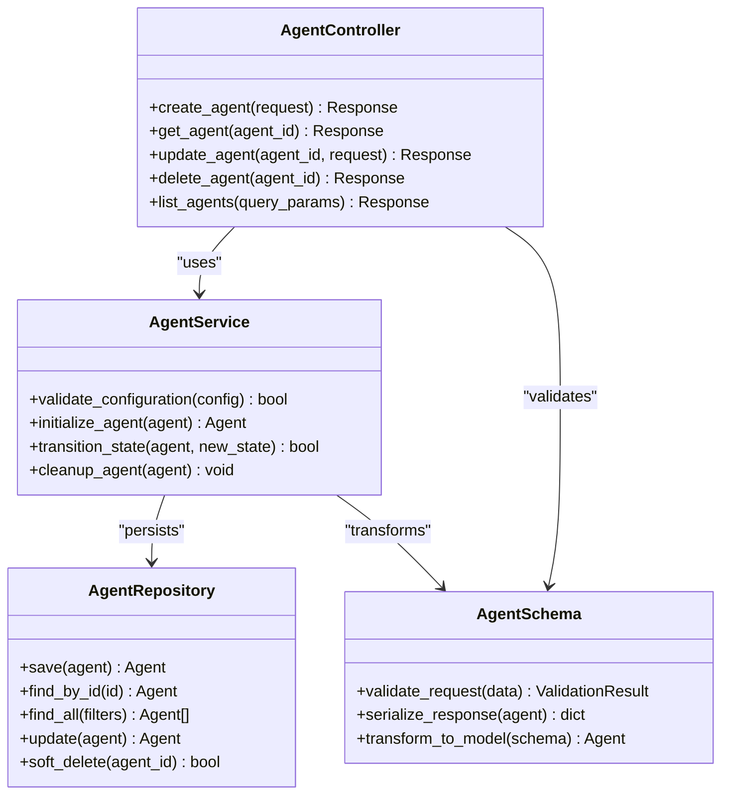

# Agent CRUD Operations

<cite>
**Referenced Files in This Document**
- [agent_routes.py](file://app/api/agent_routes.py)
- [agent.py](file://app/schemas/agent.py)
- [orm_models.py](file://app/db/orm_models.py)
- [agent_run_service.py](file://app/services/agent_run_service.py)
- [agent_dependencies.py](file://app/api/agent_dependencies.py)
- [action_control_routes.py](file://app/api/action_control_routes.py)
</cite>

## Table of Contents
1. [Introduction](#introduction)
2. [Project Structure](#project-structure)
3. [Core Components](#core-components)
4. [Architecture Overview](#architecture-overview)
5. [Detailed Component Analysis](#detailed-component-analysis)
6. [Dependency Analysis](#dependency-analysis)
7. [Performance Considerations](#performance-considerations)
8. [Troubleshooting Guide](#troubleshooting-guide)
9. [Conclusion](#conclusion)
10. [Appendices](#appendices)

## Introduction
This document provides comprehensive API documentation for agent CRUD operations within the system. It covers endpoints for creating, reading, updating, and deleting agents, including configuration schemas, validation rules, error responses, lifecycle states, initialization parameters, capability definitions, authentication requirements, rate limiting, and best practices for agent management.

## Project Structure
The agent functionality is organized across multiple layers following a clean architecture pattern:



**Diagram sources**
- [agent_routes.py](file://app/api/agent_routes.py)
- [agent_run_service.py](file://app/services/agent_run_service.py)
- [orm_models.py](file://app/db/orm_models.py)
- [agent.py](file://app/schemas/agent.py)

**Section sources**
- [agent_routes.py](file://app/api/agent_routes.py)
- [agent_run_service.py](file://app/services/agent_run_service.py)
- [orm_models.py](file://app/db/orm_models.py)
- [agent.py](file://app/schemas/agent.py)

## Core Components

### Agent Schema Definition
The agent schema defines the structure and validation rules for agent configurations. Key fields include:

- **Identifier**: Unique agent identifier
- **Name**: Human-readable agent name
- **Description**: Detailed description of agent capabilities
- **Configuration**: JSON-based configuration object
- **Capabilities**: Array of supported capabilities
- **Lifecycle State**: Current state in agent lifecycle
- **Metadata**: Additional contextual information

### Agent Lifecycle States
Agents transition through several well-defined states:

1. **Created**: Initial state after creation
2. **Validating**: Configuration validation in progress
3. **Active**: Agent is fully operational
4. **Paused**: Agent temporarily suspended
5. **Error**: Agent encountered an error condition
6. **Deleted**: Agent marked for deletion

### Capability Definitions
Agents declare their capabilities through a structured capability model:

- **Tool Access**: Available external tools and APIs
- **Permission Scope**: Authorized operations and resources
- **Context Window**: Maximum context size for processing
- **Rate Limits**: Request throttling parameters
- **Timeout Settings**: Operation timeout configurations

**Section sources**
- [agent.py](file://app/schemas/agent.py)
- [orm_models.py](file://app/db/orm_models.py)

## Architecture Overview

The agent CRUD operations follow a layered architecture with clear separation of concerns:



**Diagram sources**
- [agent_routes.py](file://app/api/agent_routes.py)
- [agent_run_service.py](file://app/services/agent_run_service.py)
- [orm_models.py](file://app/db/orm_models.py)

## Detailed Component Analysis

### Agent Creation Endpoint

#### HTTP Method: POST
#### Path: /api/agents

**Request Body Schema:**
```json
{
  "name": "string (required)",
  "description": "string (optional)", 
  "configuration": {
    "model": "string (required)",
    "temperature": "number (0.0-2.0)",
    "max_tokens": "integer",
    "capabilities": ["array of strings"]
  },
  "metadata": {
    "version": "string",
    "tags": ["array of strings"],
    "owner": "string"
  }
}
```

**Validation Rules:**
- Name must be unique within organization
- Configuration.model must be a supported model
- Temperature must be between 0.0 and 2.0
- Capabilities must be declared in agent registry
- Metadata.owner must have create permissions

**Success Response (201 Created):**
```json
{
  "id": "uuid",
  "name": "string",
  "status": "created",
  "created_at": "timestamp",
  "updated_at": "timestamp"
}
```

**Error Responses:**
- 400 Bad Request: Invalid schema or validation failure
- 401 Unauthorized: Missing or invalid authentication
- 403 Forbidden: Insufficient permissions
- 409 Conflict: Duplicate agent name
- 422 Unprocessable Entity: Semantic validation errors

### Agent Retrieval Endpoints

#### GET /api/agents/{agent_id}
Retrieves a specific agent by ID with full details.

#### GET /api/agents
Lists agents with pagination and filtering support.

**Query Parameters:**
- `page`: Page number (default: 1)
- `limit`: Items per page (default: 20, max: 100)
- `status`: Filter by lifecycle status
- `search`: Text search across name and description
- `sort`: Sort field (name, created_at, updated_at)
- `order`: Sort order (asc, desc)

### Agent Update Endpoint

#### HTTP Method: PATCH
#### Path: /api/agents/{agent_id}

**Partial Update Support:**
Only provided fields are updated; omitted fields retain current values.

**Updateable Fields:**
- name
- description  
- configuration.capabilities
- configuration.parameters
- metadata.tags
- metadata.version

**Optimistic Locking:**
Requires `If-Match` header with current ETag to prevent concurrent modification conflicts.

### Agent Deletion Endpoint

#### HTTP Method: DELETE
#### Path: /api/agents/{agent_id}

**Soft Delete Behavior:**
Agents are marked as deleted rather than permanently removed. Deleted agents remain queryable but are excluded from default listings.

**Cascade Operations:**
- Associated runs are archived
- Audit logs are preserved
- Related permissions are revoked

## Dependency Analysis



**Diagram sources**
- [agent_routes.py](file://app/api/agent_routes.py)
- [agent_run_service.py](file://app/services/agent_run_service.py)
- [agent.py](file://app/schemas/agent.py)
- [orm_models.py](file://app/db/orm_models.py)

**Section sources**
- [agent_routes.py](file://app/api/agent_routes.py)
- [agent_run_service.py](file://app/services/agent_run_service.py)
- [agent.py](file://app/schemas/agent.py)
- [orm_models.py](file://app/db/orm_models.py)

## Performance Considerations

### Caching Strategy
- Agent configurations are cached with TTL of 5 minutes
- Read-heavy operations benefit from Redis caching layer
- ETag-based conditional requests reduce bandwidth usage

### Database Optimization
- Composite indexes on (organization_id, status, created_at)
- Pagination prevents large result sets
- Soft delete avoids expensive cascade operations

### Rate Limiting
- Default: 100 requests per minute per organization
- Burst allowance: 20 additional requests
- Custom limits configurable per tenant

## Troubleshooting Guide

### Common Error Scenarios

**Configuration Validation Failures:**
- Verify model compatibility with declared capabilities
- Check parameter ranges and data types
- Ensure all required fields are present

**Concurrency Conflicts:**
- Implement retry logic with exponential backoff
- Use optimistic locking with proper ETag handling
- Monitor for lock contention patterns

**Authentication Issues:**
- Validate JWT token expiration and scope
- Check organization-level permissions
- Verify agent ownership and access controls

### Monitoring and Logging
- Structured logging with correlation IDs
- Performance metrics collection
- Error tracking and alerting integration

## Conclusion

The agent CRUD operations provide a robust foundation for managing AI agents within the platform. The implementation follows industry best practices for API design, security, and performance optimization. The modular architecture enables easy extension and maintenance while ensuring data consistency and operational reliability.

## Appendices

### Authentication Requirements
- Bearer token authentication required for all endpoints
- Organization-scoped access control
- Role-based permissions for agent management

### Best Practices
- Always validate client-side before sending requests
- Implement proper error handling and retry logic
- Use pagination for bulk operations
- Cache frequently accessed agent configurations
- Monitor agent health and performance metrics

### Migration Notes
- Backward compatibility maintained for existing clients
- Deprecation warnings for legacy endpoints
- Gradual rollout of new features with feature flags