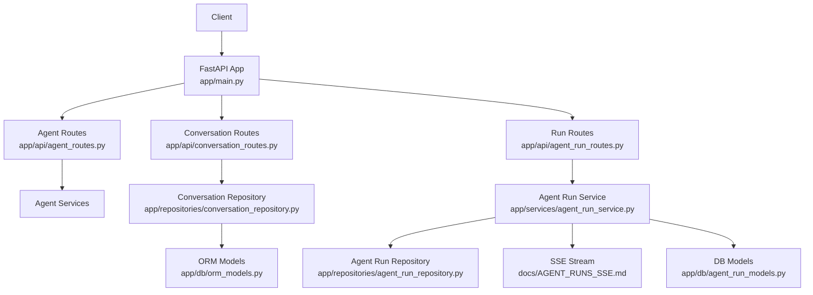
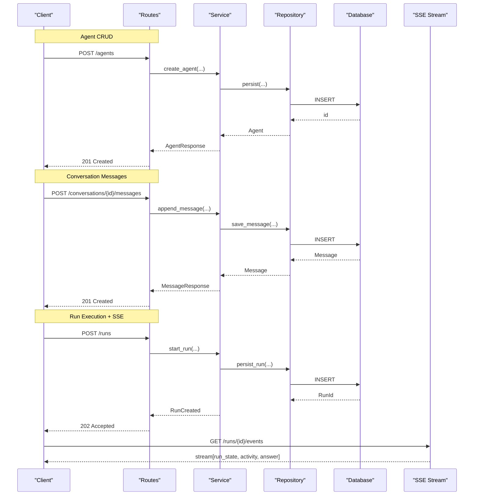
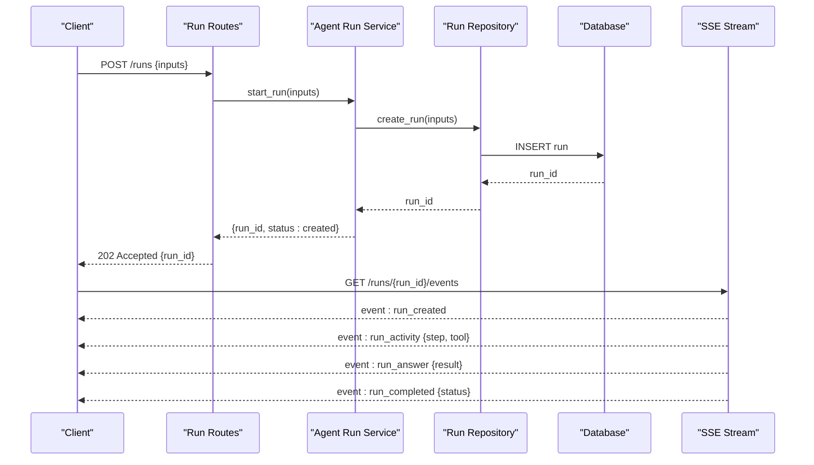
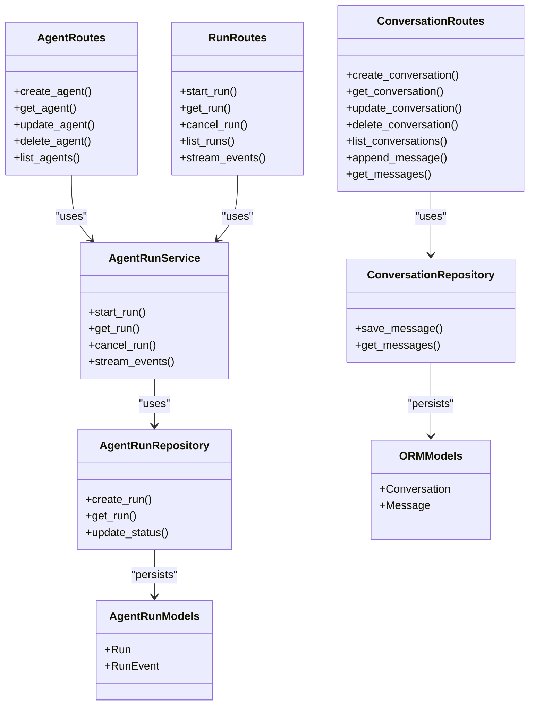

# Agent Management API

<cite>
**Referenced Files in This Document**
- [app/main.py](file://app/main.py)
- [app/api/agent_routes.py](file://app/api/agent_routes.py)
- [app/api/conversation_routes.py](file://app/api/conversation_routes.py)
- [app/api/agent_run_routes.py](file://app/api/agent_run_routes.py)
- [app/schemas/agent.py](file://app/schemas/agent.py)
- [app/schemas/conversation.py](file://app/schemas/conversation.py)
- [app/schemas/agent_run.py](file://app/schemas/agent_run.py)
- [app/services/agent_run_service.py](file://app/services/agent_run_service.py)
- [app/repositories/conversation_repository.py](file://app/repositories/conversation_repository.py)
- [app/repositories/agent_run_repository.py](file://app/repositories/agent_run_repository.py)
- [app/db/orm_models.py](file://app/db/orm_models.py)
- [app/db/agent_run_models.py](file://app/db/agent_run_models.py)
- [app/core/errors.py](file://app/core/errors.py)
- [app/core/security.py](file://app/core/security.py)
- [docs/AGENT_RUNS_SSE.md](file://docs/AGENT_RUNS_SSE.md)
</cite>

## Table of Contents
1. [Introduction](#introduction)
2. [Project Structure](#project-structure)
3. [Core Components](#core-components)
4. [Architecture Overview](#architecture-overview)
5. [Detailed Component Analysis](#detailed-component-analysis)
6. [Dependency Analysis](#dependency-analysis)
7. [Performance Considerations](#performance-considerations)
8. [Troubleshooting Guide](#troubleshooting-guide)
9. [Conclusion](#conclusion)
10. [Appendices](#appendices)

## Introduction
This document provides a comprehensive API reference for agent management, covering:
- Agents: creation, configuration, and status monitoring
- Conversations: multi-turn interactions, message history, and context management
- Runs: execution control, progress tracking, and result retrieval
It also documents request/response schemas, pagination patterns, filtering options, and real-time updates via Server-Sent Events (SSE).

## Project Structure
The backend exposes REST endpoints under the app/api layer, with Pydantic schemas in app/schemas, services in app/services, repositories in app/repositories, and database models in app/db. The application entry point registers routers and middleware.

**Diagram sources**
- [app/main.py](file://app/main.py)
- [app/api/agent_routes.py](file://app/api/agent_routes.py)
- [app/api/conversation_routes.py](file://app/api/conversation_routes.py)
- [app/api/agent_run_routes.py](file://app/api/agent_run_routes.py)
- [app/services/agent_run_service.py](file://app/services/agent_run_service.py)
- [app/repositories/conversation_repository.py](file://app/repositories/conversation_repository.py)
- [app/repositories/agent_run_repository.py](file://app/repositories/agent_run_repository.py)
- [app/db/agent_run_models.py](file://app/db/agent_run_models.py)
- [app/db/orm_models.py](file://app/db/orm_models.py)
- [docs/AGENT_RUNS_SSE.md](file://docs/AGENT_RUNS_SSE.md)

**Section sources**
- [app/main.py](file://app/main.py)
- [app/api/agent_routes.py](file://app/api/agent_routes.py)
- [app/api/conversation_routes.py](file://app/api/conversation_routes.py)
- [app/api/agent_run_routes.py](file://app/api/agent_run_routes.py)

## Core Components
- Schemas define request/response contracts for agents, conversations, and runs.
- Routes expose HTTP endpoints and handle validation, authorization, and error mapping.
- Services orchestrate business logic and coordinate repositories.
- Repositories implement persistence and query operations against ORM models.
- SSE enables real-time run progress and events.

Key responsibilities:
- app/schemas/*: Pydantic models for input/output validation and serialization
- app/api/*_routes.py: Endpoint definitions and dependency injection
- app/services/*: Business logic and cross-cutting concerns
- app/repositories/*: Data access abstractions
- app/db/*: SQLAlchemy models and session management
- docs/AGENT_RUNS_SSE.md: SSE event contract and usage

**Section sources**
- [app/schemas/agent.py](file://app/schemas/agent.py)
- [app/schemas/conversation.py](file://app/schemas/conversation.py)
- [app/schemas/agent_run.py](file://app/schemas/agent_run.py)
- [app/api/agent_routes.py](file://app/api/agent_routes.py)
- [app/api/conversation_routes.py](file://app/api/conversation_routes.py)
- [app/api/agent_run_routes.py](file://app/api/agent_run_routes.py)
- [app/services/agent_run_service.py](file://app/services/agent_run_service.py)
- [app/repositories/conversation_repository.py](file://app/repositories/conversation_repository.py)
- [app/repositories/agent_run_repository.py](file://app/repositories/agent_run_repository.py)
- [app/db/orm_models.py](file://app/db/orm_models.py)
- [app/db/agent_run_models.py](file://app/db/agent_run_models.py)
- [docs/AGENT_RUNS_SSE.md](file://docs/AGENT_RUNS_SSE.md)

## Architecture Overview
High-level flow for agent lifecycle, conversation management, and run execution:

**Diagram sources**
- [app/api/agent_routes.py](file://app/api/agent_routes.py)
- [app/api/conversation_routes.py](file://app/api/conversation_routes.py)
- [app/api/agent_run_routes.py](file://app/api/agent_run_routes.py)
- [app/services/agent_run_service.py](file://app/services/agent_run_service.py)
- [app/repositories/agent_run_repository.py](file://app/repositories/agent_run_repository.py)
- [app/repositories/conversation_repository.py](file://app/repositories/conversation_repository.py)
- [app/db/agent_run_models.py](file://app/db/agent_run_models.py)
- [docs/AGENT_RUNS_SSE.md](file://docs/AGENT_RUNS_SSE.md)

## Detailed Component Analysis

### Agents API
Endpoints:
- Create agent
- Read agent by ID
- Update agent configuration
- Delete agent
- List agents (pagination/filtering)

Request/Response:
- Use schemas from app/schemas/agent.py for request bodies and responses.
- Typical fields include identifiers, metadata, configuration flags, timestamps, and status.

Pagination and Filtering:
- Query parameters: page, page_size, sort, filter fields (e.g., status, tags).
- Response includes items array and pagination metadata (total, has_next, has_prev).

Status Monitoring:
- Status field indicates lifecycle state (e.g., active, inactive, pending).
- GET returns current status; PATCH updates configuration or toggles status.

Error Handling:
- Validation errors return 422 with details.
- Not found returns 404.
- Authorization failures return 403.

Security:
- Endpoints are protected using auth dependencies defined in app/core/security.py.

**Section sources**
- [app/api/agent_routes.py](file://app/api/agent_routes.py)
- [app/schemas/agent.py](file://app/schemas/agent.py)
- [app/core/security.py](file://app/core/security.py)
- [app/core/errors.py](file://app/core/errors.py)

### Conversations API
Endpoints:
- Create conversation
- Get conversation by ID
- Update conversation metadata
- Delete conversation
- List conversations (pagination/filtering)
- Append message to conversation
- Get messages (pagination/filtering)
- Clear conversation context

Request/Response:
- Use schemas from app/schemas/conversation.py for request bodies and responses.
- Message objects include content, role, timestamp, and optional attachments/metadata.

Multi-turn Interactions:
- POST /conversations/{id}/messages adds a user message and triggers orchestration if configured.
- Responses may include assistant reply or acknowledgment depending on sync/async mode.

Message History:
- GET /conversations/{id}/messages supports pagination and optional filters (role, after/before timestamps).

Context Management:
- Context can be updated via PATCH /conversations/{id} with context payload.
- Clear context endpoint resets conversation memory.

Persistence:
- Conversation and message persistence handled by repository in app/repositories/conversation_repository.py backed by ORM models in app/db/orm_models.py.

**Section sources**
- [app/api/conversation_routes.py](file://app/api/conversation_routes.py)
- [app/schemas/conversation.py](file://app/schemas/conversation.py)
- [app/repositories/conversation_repository.py](file://app/repositories/conversation_repository.py)
- [app/db/orm_models.py](file://app/db/orm_models.py)

### Runs API
Endpoints:
- Start run
- Get run by ID
- Cancel run
- List runs (pagination/filtering)
- Stream run events via SSE

Request/Response:
- Use schemas from app/schemas/agent_run.py for request bodies and responses.
- Run objects include identifiers, status, inputs, outputs, timestamps, and links to related resources.

Execution Control:
- POST /runs starts an asynchronous execution.
- GET /runs/{id} retrieves current run state.
- DELETE /runs/{id} cancels an in-progress run when supported.

Progress Tracking:
- SSE stream at /runs/{id}/events emits incremental updates:
  - State transitions (created, running, succeeded, failed, cancelled)
  - Activity events (tool calls, steps)
  - Final answer/result payload

Result Retrieval:
- After completion, GET /runs/{id} returns final output and artifacts.

Real-time Updates via SSE:
- Clients connect to SSE endpoint and process typed events.
- See docs/AGENT_RUNS_SSE.md for event schema and connection guidelines.

Services and Repositories:
- Orchestration and persistence coordinated by service in app/services/agent_run_service.py and repository in app/repositories/agent_run_repository.py.
- Database models defined in app/db/agent_run_models.py.

**Section sources**
- [app/api/agent_run_routes.py](file://app/api/agent_run_routes.py)
- [app/schemas/agent_run.py](file://app/schemas/agent_run.py)
- [app/services/agent_run_service.py](file://app/services/agent_run_service.py)
- [app/repositories/agent_run_repository.py](file://app/repositories/agent_run_repository.py)
- [app/db/agent_run_models.py](file://app/db/agent_run_models.py)
- [docs/AGENT_RUNS_SSE.md](file://docs/AGENT_RUNS_SSE.md)

### SSE Event Flow
Sequence diagram for run streaming:

**Diagram sources**
- [app/api/agent_run_routes.py](file://app/api/agent_run_routes.py)
- [app/services/agent_run_service.py](file://app/services/agent_run_service.py)
- [app/repositories/agent_run_repository.py](file://app/repositories/agent_run_repository.py)
- [app/db/agent_run_models.py](file://app/db/agent_run_models.py)
- [docs/AGENT_RUNS_SSE.md](file://docs/AGENT_RUNS_SSE.md)

### Request/Response Schemas Overview
- Agents:
  - Create/Update: identifier, name, description, configuration object, tags, enabled flag
  - Response: persisted fields, timestamps, status
- Conversations:
  - Create/Update: title, metadata, context payload
  - Messages: role, content, attachments, timestamp
- Runs:
  - Start: agent_id, inputs, options
  - Response: run_id, status, links to events and results
  - Events: type, payload, timestamp

Validation and Errors:
- All requests validated against Pydantic schemas.
- Errors follow standard HTTP codes and structured error payloads.

**Section sources**
- [app/schemas/agent.py](file://app/schemas/agent.py)
- [app/schemas/conversation.py](file://app/schemas/conversation.py)
- [app/schemas/agent_run.py](file://app/schemas/agent_run.py)
- [app/core/errors.py](file://app/core/errors.py)

### Pagination and Filtering Patterns
Common query parameters:
- page: integer, default 1
- page_size: integer, default 20, max N
- sort: field name, optional direction suffix
- filter: key=value pairs (e.g., status=active, tag=finance)
- after/before: ISO timestamps for cursor-style pagination where applicable

Response envelope:
- items: list of entities
- total: count
- has_next: boolean
- has_prev: boolean

**Section sources**
- [app/api/agent_routes.py](file://app/api/agent_routes.py)
- [app/api/conversation_routes.py](file://app/api/conversation_routes.py)
- [app/api/agent_run_routes.py](file://app/api/agent_run_routes.py)

### Security and Authorization
- Authentication required for all endpoints.
- Authorization checks enforced via dependencies in app/core/security.py.
- Role-based access controls restrict mutation endpoints.

**Section sources**
- [app/core/security.py](file://app/core/security.py)
- [app/api/agent_routes.py](file://app/api/agent_routes.py)
- [app/api/conversation_routes.py](file://app/api/conversation_routes.py)
- [app/api/agent_run_routes.py](file://app/api/agent_run_routes.py)

## Dependency Analysis
Component relationships and data flow:

**Diagram sources**
- [app/api/agent_routes.py](file://app/api/agent_routes.py)
- [app/api/conversation_routes.py](file://app/api/conversation_routes.py)
- [app/api/agent_run_routes.py](file://app/api/agent_run_routes.py)
- [app/services/agent_run_service.py](file://app/services/agent_run_service.py)
- [app/repositories/conversation_repository.py](file://app/repositories/conversation_repository.py)
- [app/repositories/agent_run_repository.py](file://app/repositories/agent_run_repository.py)
- [app/db/agent_run_models.py](file://app/db/agent_run_models.py)
- [app/db/orm_models.py](file://app/db/orm_models.py)

**Section sources**
- [app/api/agent_routes.py](file://app/api/agent_routes.py)
- [app/api/conversation_routes.py](file://app/api/conversation_routes.py)
- [app/api/agent_run_routes.py](file://app/api/agent_run_routes.py)
- [app/services/agent_run_service.py](file://app/services/agent_run_service.py)
- [app/repositories/conversation_repository.py](file://app/repositories/conversation_repository.py)
- [app/repositories/agent_run_repository.py](file://app/repositories/agent_run_repository.py)
- [app/db/agent_run_models.py](file://app/db/agent_run_models.py)
- [app/db/orm_models.py](file://app/db/orm_models.py)

## Performance Considerations
- Use pagination and filtering to limit payload sizes.
- Prefer cursor-based pagination for large datasets.
- Cache frequently accessed read-only data where appropriate.
- Offload long-running tasks to background workers and use SSE for progress updates.
- Index database columns used in common filters and sorts.

## Troubleshooting Guide
Common issues and resolutions:
- Validation errors (422): Check request body against schema fields and types.
- Not found (404): Verify resource IDs and existence.
- Unauthorized (401/403): Ensure valid authentication token and sufficient permissions.
- SSE disconnections: Implement reconnection with exponential backoff and last-event-id handling.
- Run not progressing: Inspect run status and activity events; check external provider health.

**Section sources**
- [app/core/errors.py](file://app/core/errors.py)
- [docs/AGENT_RUNS_SSE.md](file://docs/AGENT_RUNS_SSE.md)

## Conclusion
The Agent Management API provides robust CRUD operations for agents, conversations, and runs, with strong validation, security, and real-time updates via SSE. By following the documented schemas, pagination patterns, and filtering options, clients can build reliable integrations for multi-turn interactions and durable run execution.

## Appendices

### SSE Event Contract Summary
- Connection: GET /runs/{id}/events
- Events:
  - run_created: initial state
  - run_activity: intermediate steps and tool calls
  - run_answer: partial or final answer payload
  - run_completed: terminal state with result link
- Reconnection: support Last-Event-ID and retry headers per spec.

**Section sources**
- [docs/AGENT_RUNS_SSE.md](file://docs/AGENT_RUNS_SSE.md)