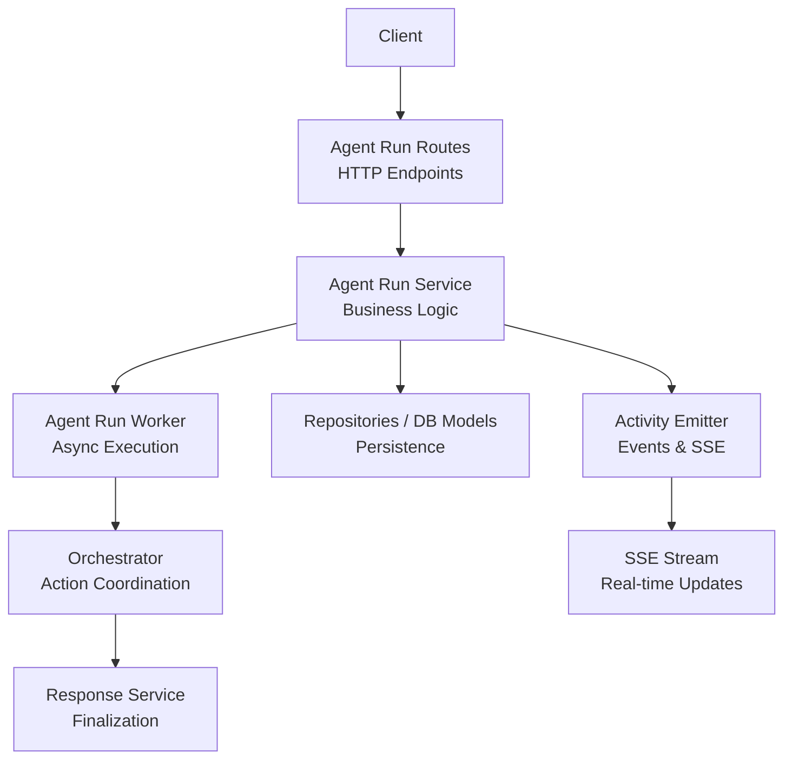
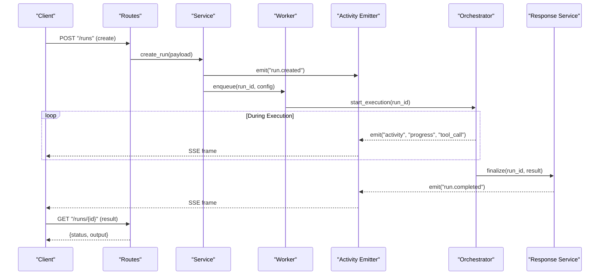
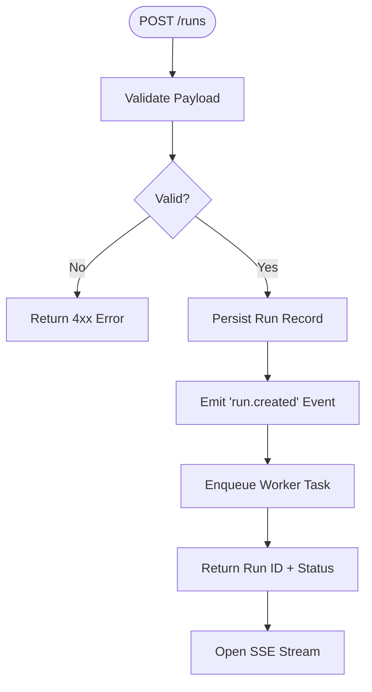
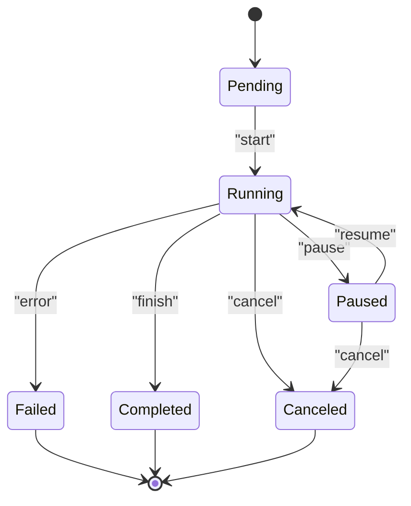
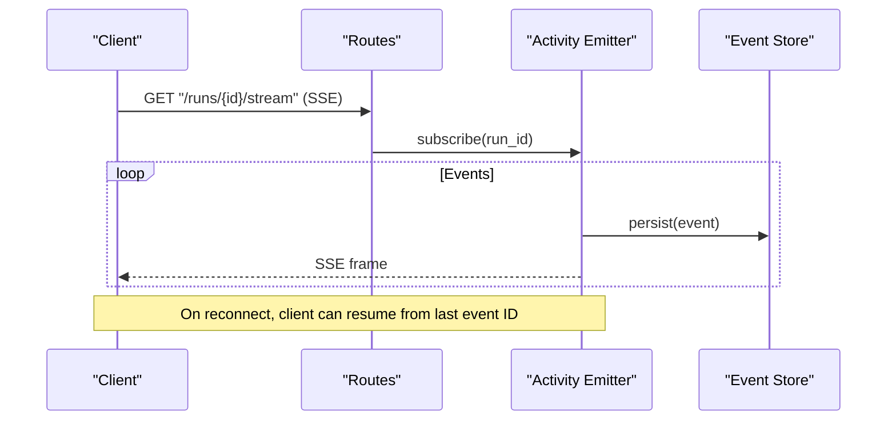
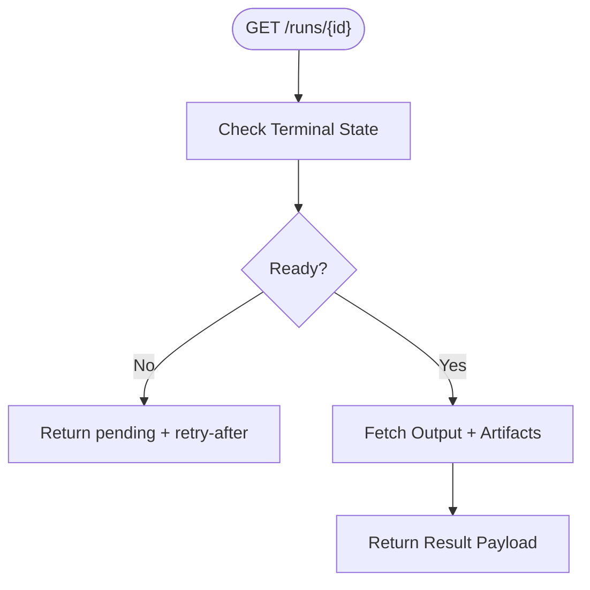
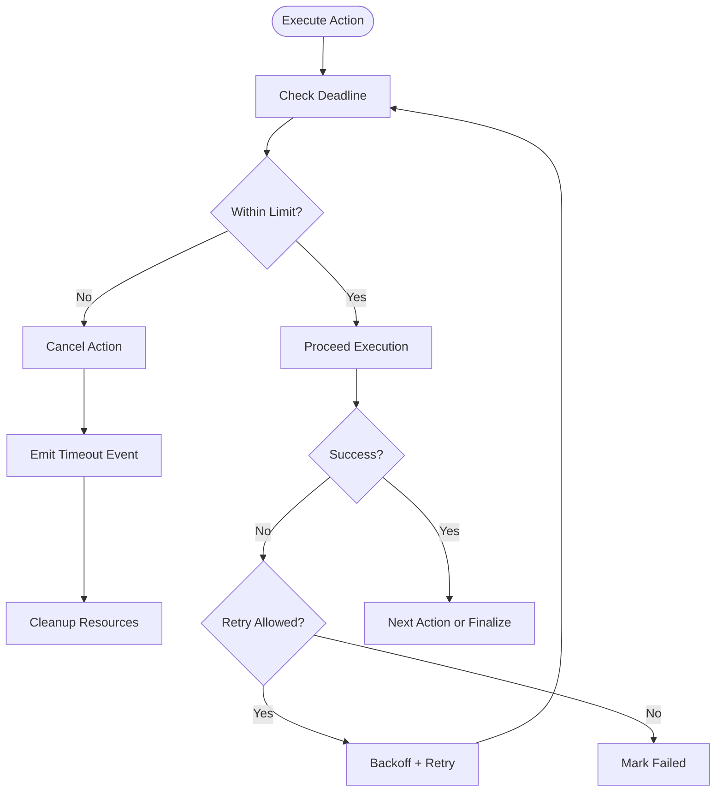
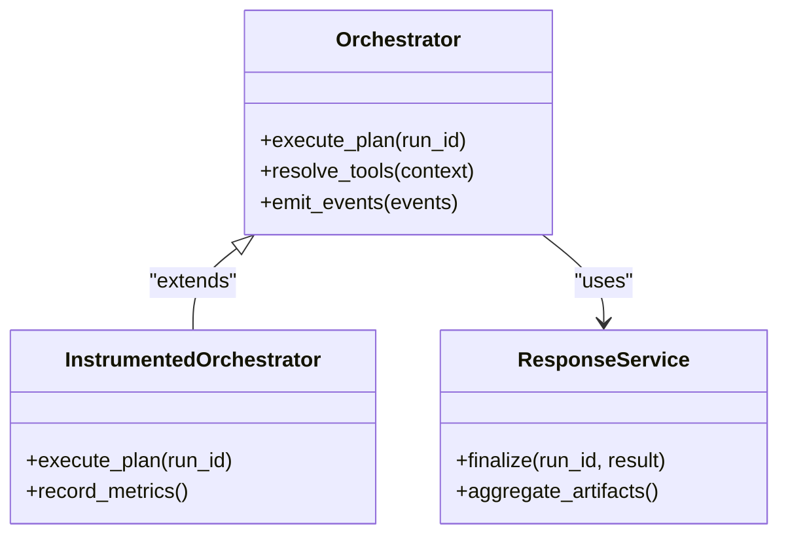
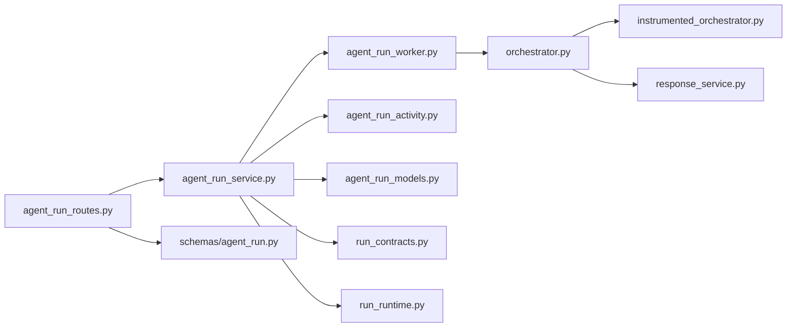

# Agent Run Control API

<cite>
**Referenced Files in This Document**
- [agent_run_routes.py](file://app/api/agent_run_routes.py)
- [agent_run_dependencies.py](file://app/api/agent_run_dependencies.py)
- [agent_run_service.py](file://app/services/agent_run_service.py)
- [agent_run_worker.py](file://app/services/agent_run_worker.py)
- [agent_run_models.py](file://app/db/agent_run_models.py)
- [agent_run_activity.py](file://app/services/agent_run_activity.py)
- [run_contracts.py](file://app/agent/run_contracts.py)
- [run_runtime.py](file://app/agent/run_runtime.py)
- [orchestrator.py](file://app/agent/orchestrator.py)
- [instrumented_orchestrator.py](file://app/agent/instrumented_orchestrator.py)
- [response_service.py](file://app/agent/response_service.py)
- [schemas/agent_run.py](file://app/schemas/agent_run.py)
- [AGENT_RUNS_SSE.md](file://docs/AGENT_RUNS_SSE.md)
- [phase5_durable_agent_runs_sse.py](file://apply_phase5_durable_agent_runs_sse.py)
</cite>

## Table of Contents
1. [Introduction](#introduction)
2. [Project Structure](#project-structure)
3. [Core Components](#core-components)
4. [Architecture Overview](#architecture-overview)
5. [Detailed Component Analysis](#detailed-component-analysis)
6. [Dependency Analysis](#dependency-analysis)
7. [Performance Considerations](#performance-considerations)
8. [Troubleshooting Guide](#troubleshooting-guide)
9. [Conclusion](#conclusion)
10. [Appendices](#appendices)

## Introduction
This document provides comprehensive API documentation for agent run control endpoints. It covers run creation, execution control, progress tracking, and result retrieval. It also details the run lifecycle states, status monitoring, cancellation mechanisms, real-time progress updates via Server-Sent Events (SSE), activity streaming, event-driven communication patterns, configuration options, resource allocation, timeout handling, and error recovery strategies.

## Project Structure
The agent run control functionality is implemented across API routes, services, workers, models, schemas, and orchestrators:
- API layer exposes HTTP endpoints for run management and SSE streams
- Services implement business logic for run orchestration and state transitions
- Workers execute long-running tasks asynchronously
- Models define persistent schema for runs and events
- Schemas define request/response contracts
- Orchestrators coordinate agent actions and responses
- Documentation describes SSE behavior and durable run semantics

**Diagram sources**
- [agent_run_routes.py](file://app/api/agent_run_routes.py)
- [agent_run_service.py](file://app/services/agent_run_service.py)
- [agent_run_worker.py](file://app/services/agent_run_worker.py)
- [agent_run_models.py](file://app/db/agent_run_models.py)
- [agent_run_activity.py](file://app/services/agent_run_activity.py)
- [orchestrator.py](file://app/agent/orchestrator.py)
- [response_service.py](file://app/agent/response_service.py)

**Section sources**
- [agent_run_routes.py](file://app/api/agent_run_routes.py)
- [agent_run_service.py](file://app/services/agent_run_service.py)
- [agent_run_worker.py](file://app/services/agent_run_worker.py)
- [agent_run_models.py](file://app/db/agent_run_models.py)
- [agent_run_activity.py](file://app/services/agent_run_activity.py)
- [orchestrator.py](file://app/agent/orchestrator.py)
- [response_service.py](file://app/agent/response_service.py)
- [AGENT_RUNS_SSE.md](file://docs/AGENT_RUNS_SSE.md)

## Core Components
- Agent Run Routes: Define HTTP endpoints for creating, listing, retrieving, canceling, and streaming runs; expose SSE endpoints for real-time progress and activities.
- Agent Run Service: Implements run lifecycle operations, validation, persistence, and coordination with workers and activity emitter.
- Agent Run Worker: Executes runs asynchronously, manages timeouts, retries, and cancellation signals.
- Activity Emitter: Publishes run events and activities to SSE channels and persists them for durability.
- Orchestrator: Coordinates agent actions, tool calls, and response synthesis during run execution.
- Response Service: Finalizes outputs, aggregates results, and emits completion events.
- Schemas: Define request/response payloads for run creation, updates, and SSE frames.
- Models: Define database tables for runs, events, and related metadata.

Key responsibilities:
- Run creation validates inputs, allocates resources, initializes state, and enqueues work.
- Execution control supports pause/resume/cancel with idempotency and safety checks.
- Progress tracking uses SSE for live updates and persisted events for replay.
- Result retrieval returns final outputs and associated artifacts.

**Section sources**
- [agent_run_routes.py](file://app/api/agent_run_routes.py)
- [agent_run_service.py](file://app/services/agent_run_service.py)
- [agent_run_worker.py](file://app/services/agent_run_worker.py)
- [agent_run_activity.py](file://app/services/agent_run_activity.py)
- [orchestrator.py](file://app/agent/orchestrator.py)
- [response_service.py](file://app/agent/response_service.py)
- [schemas/agent_run.py](file://app/schemas/agent_run.py)
- [agent_run_models.py](file://app/db/agent_run_models.py)

## Architecture Overview
The run control architecture separates concerns between HTTP interfaces, service orchestration, background execution, and real-time streaming.

**Diagram sources**
- [agent_run_routes.py](file://app/api/agent_run_routes.py)
- [agent_run_service.py](file://app/services/agent_run_service.py)
- [agent_run_worker.py](file://app/services/agent_run_worker.py)
- [agent_run_activity.py](file://app/services/agent_run_activity.py)
- [orchestrator.py](file://app/agent/orchestrator.py)
- [response_service.py](file://app/agent/response_service.py)

## Detailed Component Analysis

### Run Creation Endpoint
- Purpose: Create a new agent run with configuration and optional resource constraints.
- Request: JSON payload including prompt/context, tools selection, timeouts, concurrency limits, and environment overrides.
- Response: Run identifier and initial status; SSE stream available for real-time updates.
- Validation: Enforces required fields, schema compliance, and permission checks.
- Side Effects: Persists run record, emits created event, enqueues worker task.

**Diagram sources**
- [agent_run_routes.py](file://app/api/agent_run_routes.py)
- [agent_run_service.py](file://app/services/agent_run_service.py)
- [agent_run_activity.py](file://app/services/agent_run_activity.py)
- [schemas/agent_run.py](file://app/schemas/agent_run.py)

**Section sources**
- [agent_run_routes.py](file://app/api/agent_run_routes.py)
- [agent_run_service.py](file://app/services/agent_run_service.py)
- [schemas/agent_run.py](file://app/schemas/agent_run.py)

### Execution Control Endpoints
- Pause/Resume: Temporarily halt or continue execution; preserves state and allows safe interruption points.
- Cancel: Requests termination; worker acknowledges and performs cleanup; final state set to canceled.
- Idempotency: Repeated requests are safely handled without duplicate side effects.
- Safety Checks: Ensure transitions are valid based on current run state.

**Diagram sources**
- [agent_run_service.py](file://app/services/agent_run_service.py)
- [agent_run_worker.py](file://app/services/agent_run_worker.py)
- [agent_run_models.py](file://app/db/agent_run_models.py)

**Section sources**
- [agent_run_service.py](file://app/services/agent_run_service.py)
- [agent_run_worker.py](file://app/services/agent_run_worker.py)
- [agent_run_models.py](file://app/db/agent_run_models.py)

### Progress Tracking and SSE Streaming
- Real-time updates: SSE endpoint streams structured frames for progress, activities, and lifecycle events.
- Frame types: Includes run state changes, tool call logs, intermediate outputs, and errors.
- Durability: Events are persisted to support replay after reconnects.
- Backpressure: Clients should handle rate limiting and buffering.

**Diagram sources**
- [agent_run_routes.py](file://app/api/agent_run_routes.py)
- [agent_run_activity.py](file://app/services/agent_run_activity.py)
- [agent_run_models.py](file://app/db/agent_run_models.py)
- [AGENT_RUNS_SSE.md](file://docs/AGENT_RUNS_SSE.md)

**Section sources**
- [agent_run_routes.py](file://app/api/agent_run_routes.py)
- [agent_run_activity.py](file://app/services/agent_run_activity.py)
- [AGENT_RUNS_SSE.md](file://docs/AGENT_RUNS_SSE.md)

### Result Retrieval Endpoint
- Purpose: Retrieve final run results and artifacts.
- Behavior: Returns aggregated outputs, summaries, and links to artifacts when available.
- Availability: Results are available once run reaches terminal state (completed, failed, canceled).

**Diagram sources**
- [agent_run_routes.py](file://app/api/agent_run_routes.py)
- [agent_run_service.py](file://app/services/agent_run_service.py)
- [response_service.py](file://app/agent/response_service.py)

**Section sources**
- [agent_run_routes.py](file://app/api/agent_run_routes.py)
- [agent_run_service.py](file://app/services/agent_run_service.py)
- [response_service.py](file://app/agent/response_service.py)

### Configuration Options and Resource Allocation
- Timeouts: Global and per-action timeouts; enforceable by worker and orchestrator.
- Concurrency: Limits parallel tool calls and action executions.
- Memory/CPU: Optional resource hints for worker scheduling.
- Tool Selection: Whitelist/blacklist of tools; context-aware resolution.
- Environment Overrides: Per-run environment variables and feature flags.

**Section sources**
- [schemas/agent_run.py](file://app/schemas/agent_run.py)
- [agent_run_worker.py](file://app/services/agent_run_worker.py)
- [orchestrator.py](file://app/agent/orchestrator.py)

### Timeout Handling and Error Recovery
- Timeout Enforcement: Worker monitors deadlines; cancels long-running actions; emits timeout events.
- Retry Policies: Configurable retries for transient failures with exponential backoff.
- Partial Results: Intermediate outputs preserved even on failure; clients can resume or inspect partial data.
- Cleanup: Cancellation triggers resource release and log aggregation.

**Diagram sources**
- [agent_run_worker.py](file://app/services/agent_run_worker.py)
- [orchestrator.py](file://app/agent/orchestrator.py)
- [agent_run_activity.py](file://app/services/agent_run_activity.py)

**Section sources**
- [agent_run_worker.py](file://app/services/agent_run_worker.py)
- [orchestrator.py](file://app/agent/orchestrator.py)
- [agent_run_activity.py](file://app/services/agent_run_activity.py)

### Event-Driven Communication Patterns
- Event Types: Lifecycle events (created, running, paused, completed, failed, canceled), activity events (tool calls, progress), and UI-oriented updates.
- Delivery Guarantees: Durable storage ensures events survive restarts; clients can reconnect and resume.
- Ordering: Events are ordered per run; cross-run ordering is best-effort.
- Schema Compliance: Frames adhere to defined schemas for robust parsing.

**Section sources**
- [agent_run_activity.py](file://app/services/agent_run_activity.py)
- [schemas/agent_run.py](file://app/schemas/agent_run.py)
- [AGENT_RUNS_SSE.md](file://docs/AGENT_RUNS_SSE.md)

### Orchestration and Response Finalization
- Orchestrator coordinates multi-step actions, resolves tools, and manages context.
- Instrumentation adds observability hooks for metrics and tracing.
- Response Service consolidates outputs, applies post-processing, and emits final events.

**Diagram sources**
- [orchestrator.py](file://app/agent/orchestrator.py)
- [instrumented_orchestrator.py](file://app/agent/instrumented_orchestrator.py)
- [response_service.py](file://app/agent/response_service.py)

**Section sources**
- [orchestrator.py](file://app/agent/orchestrator.py)
- [instrumented_orchestrator.py](file://app/agent/instrumented_orchestrator.py)
- [response_service.py](file://app/agent/response_service.py)

## Dependency Analysis
High-level dependencies among core components:

**Diagram sources**
- [agent_run_routes.py](file://app/api/agent_run_routes.py)
- [agent_run_service.py](file://app/services/agent_run_service.py)
- [agent_run_worker.py](file://app/services/agent_run_worker.py)
- [agent_run_activity.py](file://app/services/agent_run_activity.py)
- [agent_run_models.py](file://app/db/agent_run_models.py)
- [orchestrator.py](file://app/agent/orchestrator.py)
- [instrumented_orchestrator.py](file://app/agent/instrumented_orchestrator.py)
- [response_service.py](file://app/agent/response_service.py)
- [run_contracts.py](file://app/agent/run_contracts.py)
- [run_runtime.py](file://app/agent/run_runtime.py)
- [schemas/agent_run.py](file://app/schemas/agent_run.py)

**Section sources**
- [agent_run_routes.py](file://app/api/agent_run_routes.py)
- [agent_run_service.py](file://app/services/agent_run_service.py)
- [agent_run_worker.py](file://app/services/agent_run_worker.py)
- [agent_run_activity.py](file://app/services/agent_run_activity.py)
- [agent_run_models.py](file://app/db/agent_run_models.py)
- [orchestrator.py](file://app/agent/orchestrator.py)
- [instrumented_orchestrator.py](file://app/agent/instrumented_orchestrator.py)
- [response_service.py](file://app/agent/response_service.py)
- [run_contracts.py](file://app/agent/run_contracts.py)
- [run_runtime.py](file://app/agent/run_runtime.py)
- [schemas/agent_run.py](file://app/schemas/agent_run.py)

## Performance Considerations
- Batch Events: Coalesce frequent activity updates to reduce SSE overhead.
- Pagination: For large artifact sets, provide paginated retrieval.
- Connection Pooling: Use connection pooling for DB and external tool calls.
- Backpressure: Implement client-side buffering and server-side throttling.
- Observability: Leverage instrumentation for latency and throughput metrics.

## Troubleshooting Guide
Common issues and resolutions:
- SSE Disconnections: Reconnect with last event ID; ensure durable event store.
- Stale Runs: Verify terminal state before polling results; use SSE for updates.
- Timeouts: Adjust global/action timeouts; check resource contention.
- Cancellations: Confirm cleanup completed; review emitted cancellation events.
- Errors: Inspect error events and logs; validate schema compliance for payloads.

**Section sources**
- [agent_run_activity.py](file://app/services/agent_run_activity.py)
- [agent_run_worker.py](file://app/services/agent_run_worker.py)
- [agent_run_service.py](file://app/services/agent_run_service.py)

## Conclusion
The Agent Run Control API provides a robust, event-driven interface for managing agent runs with real-time visibility via SSE. It supports flexible configuration, resilient execution, and clear lifecycle management. By adhering to the documented contracts and leveraging durable events, clients can build responsive and reliable integrations.

## Appendices

### SSE Frame Schema Overview
- Frame structure includes event type, run identifier, timestamp, and payload.
- Event types cover lifecycle transitions, activity logs, and UI updates.
- Clients should parse frames according to schema and handle unknown events gracefully.

**Section sources**
- [schemas/agent_run.py](file://app/schemas/agent_run.py)
- [AGENT_RUNS_SSE.md](file://docs/AGENT_RUNS_SSE.md)

### Migration and Feature Flags
- Phase 5 durable runs and SSE features are applied via migration scripts.
- Feature flags may gate advanced capabilities; verify runtime configuration.

**Section sources**
- [phase5_durable_agent_runs_sse.py](file://apply_phase5_durable_agent_runs_sse.py)