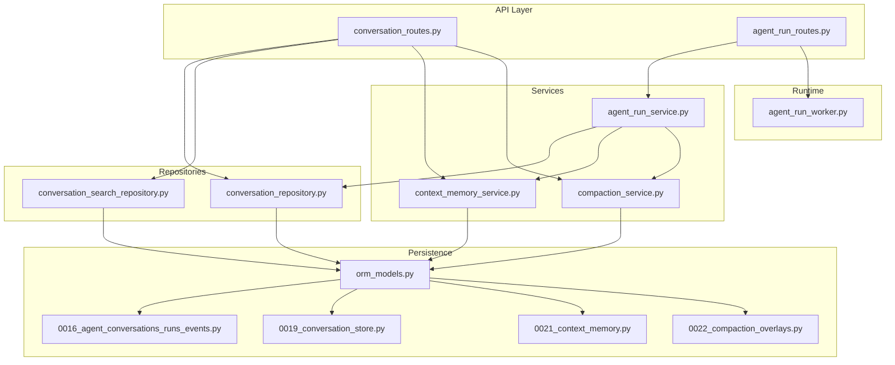
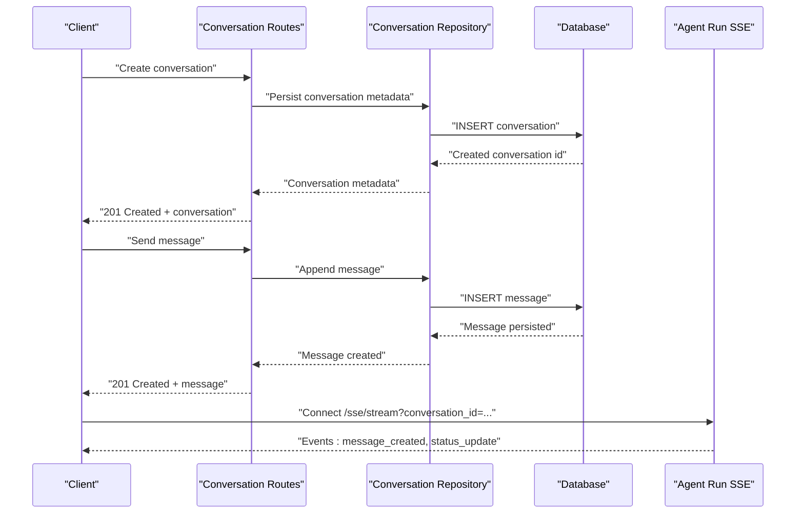
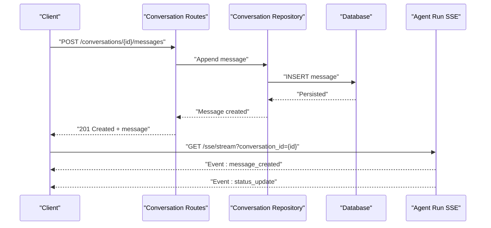
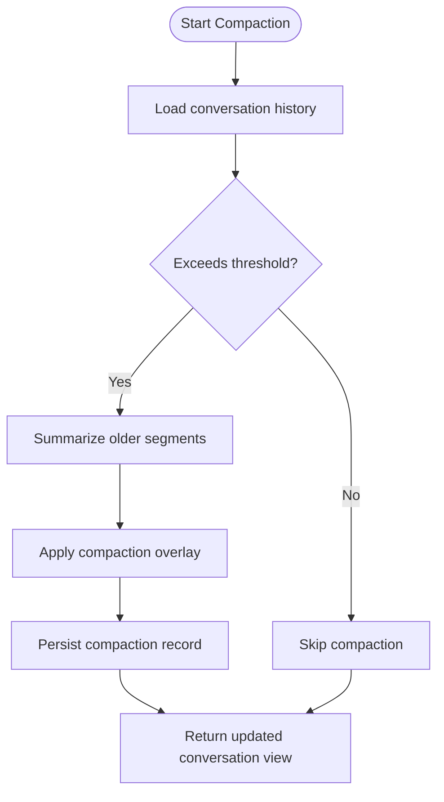
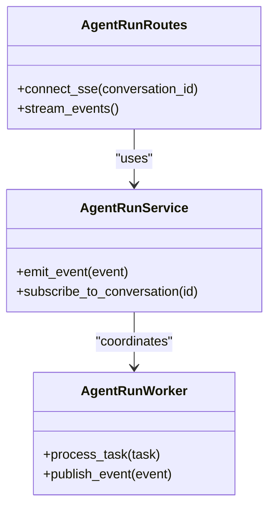
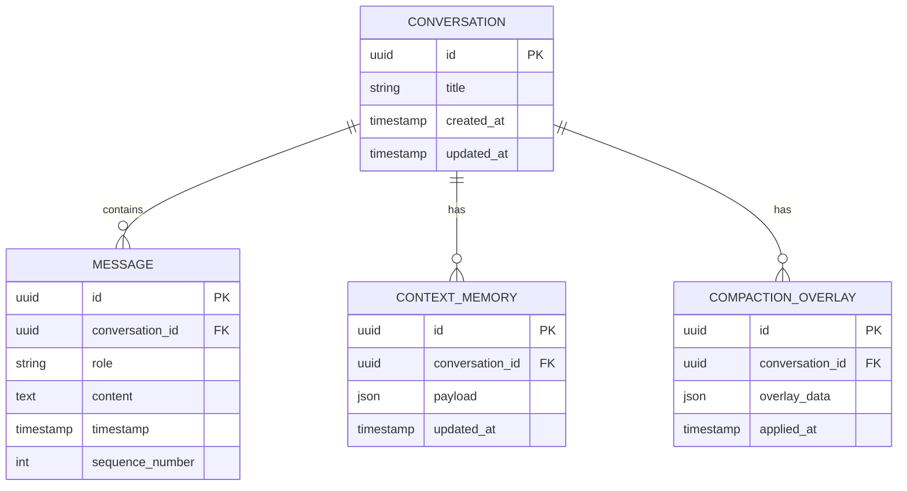
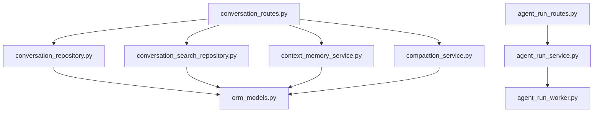

# Conversation Management API

<cite>
**Referenced Files in This Document**
- [conversation_routes.py](file://app/api/conversation_routes.py)
- [conversation_repository.py](file://app/repositories/conversation_repository.py)
- [conversation_search_repository.py](file://app/repositories/conversation_search_repository.py)
- [conversation.py](file://app/schemas/conversation.py)
- [orm_models.py](file://app/db/orm_models.py)
- [0016_agent_conversations_runs_events.py](file://alembic/versions/0016_agent_conversations_runs_events.py)
- [0019_conversation_store.py](file://alembic/versions/0019_conversation_store.py)
- [0021_context_memory.py](file://alembic/versions/0021_context_memory.py)
- [0022_compaction_overlays.py](file://alembic/versions/0022_compaction_overlays.py)
- [context_memory_service.py](file://app/services/context_memory_service.py)
- [compaction_service.py](file://app/services/compaction_service.py)
- [agent_run_routes.py](file://app/api/agent_run_routes.py)
- [agent_run_dependencies.py](file://app/api/agent_run_dependencies.py)
- [agent_run_service.py](file://app/services/agent_run_service.py)
- [agent_run_worker.py](file://app/agent_run_worker.py)
- [test_conversation_store.py](file://tests/test_conversation_store.py)
</cite>

## Table of Contents
1. [Introduction](#introduction)
2. [Project Structure](#project-structure)
3. [Core Components](#core-components)
4. [Architecture Overview](#architecture-overview)
5. [Detailed Component Analysis](#detailed-component-analysis)
6. [Dependency Analysis](#dependency-analysis)
7. [Performance Considerations](#performance-considerations)
8. [Troubleshooting Guide](#troubleshooting-guide)
9. [Conclusion](#conclusion)
10. [Appendices](#appendices)

## Introduction
This document provides detailed API documentation for conversation management endpoints, focusing on multi-turn conversation creation, message sending, history retrieval, and context management. It covers conversation state persistence, message ordering, real-time updates via Server-Sent Events (SSE), request/response schemas, pagination patterns, lifecycle and cleanup policies, and performance considerations for large conversations.

## Project Structure
The conversation management feature spans API routes, repositories, domain schemas, database models/migrations, services for context memory and compaction, and SSE integration for agent runs. The key files are:
- API routes for conversations and agent-run SSE
- Repositories for conversation persistence and search
- Schemas defining request/response shapes
- Database models and migrations for conversation storage and context overlays
- Services for context memory and compaction
- Worker and service layers for durable agent runs with SSE

**Diagram sources**
- [conversation_routes.py](file://app/api/conversation_routes.py)
- [agent_run_routes.py](file://app/api/agent_run_routes.py)
- [context_memory_service.py](file://app/services/context_memory_service.py)
- [compaction_service.py](file://app/services/compaction_service.py)
- [conversation_repository.py](file://app/repositories/conversation_repository.py)
- [conversation_search_repository.py](file://app/repositories/conversation_search_repository.py)
- [orm_models.py](file://app/db/orm_models.py)
- [0016_agent_conversations_runs_events.py](file://alembic/versions/0016_agent_conversations_runs_events.py)
- [0019_conversation_store.py](file://alembic/versions/0019_conversation_store.py)
- [0021_context_memory.py](file://alembic/versions/0021_context_memory.py)
- [0022_compaction_overlays.py](file://alembic/versions/0022_compaction_overlays.py)
- [agent_run_service.py](file://app/services/agent_run_service.py)
- [agent_run_worker.py](file://app/agent_run_worker.py)

**Section sources**
- [conversation_routes.py](file://app/api/conversation_routes.py)
- [agent_run_routes.py](file://app/api/agent_run_routes.py)
- [conversation_repository.py](file://app/repositories/conversation_repository.py)
- [conversation_search_repository.py](file://app/repositories/conversation_search_repository.py)
- [conversation.py](file://app/schemas/conversation.py)
- [orm_models.py](file://app/db/orm_models.py)
- [0016_agent_conversations_runs_events.py](file://alembic/versions/0016_agent_conversations_runs_events.py)
- [0019_conversation_store.py](file://alembic/versions/0019_conversation_store.py)
- [0021_context_memory.py](file://alembic/versions/0021_context_memory.py)
- [0022_compaction_overlays.py](file://alembic/versions/0022_compaction_overlays.py)
- [context_memory_service.py](file://app/services/context_memory_service.py)
- [compaction_service.py](file://app/services/compaction_service.py)
- [agent_run_service.py](file://app/services/agent_run_service.py)
- [agent_run_worker.py](file://app/agent_run_worker.py)

## Core Components
- Conversation API routes: define endpoints for creating conversations, listing, retrieving metadata, sending messages, and fetching history.
- Conversation repositories: implement persistence operations for conversations, messages, and search capabilities.
- Context memory service: manages contextual overlays and memory across turns.
- Compaction service: applies compaction overlays to reduce conversation size while preserving semantics.
- Agent run SSE: integrates with agent-run routes and worker to stream events back to clients.
- Schemas: define request/response structures for conversations and messages.
- Database models and migrations: define the schema for conversations, messages, context memory, and compaction overlays.

**Section sources**
- [conversation_routes.py](file://app/api/conversation_routes.py)
- [conversation_repository.py](file://app/repositories/conversation_repository.py)
- [conversation_search_repository.py](file://app/repositories/conversation_search_repository.py)
- [conversation.py](file://app/schemas/conversation.py)
- [context_memory_service.py](file://app/services/context_memory_service.py)
- [compaction_service.py](file://app/services/compaction_service.py)
- [agent_run_routes.py](file://app/api/agent_run_routes.py)
- [agent_run_service.py](file://app/services/agent_run_service.py)
- [agent_run_worker.py](file://app/agent_run_worker.py)
- [orm_models.py](file://app/db/orm_models.py)
- [0016_agent_conversations_runs_events.py](file://alembic/versions/0016_agent_conversations_runs_events.py)
- [0019_conversation_store.py](file://alembic/versions/0019_conversation_store.py)
- [0021_context_memory.py](file://alembic/versions/0021_context_memory.py)
- [0022_compaction_overlays.py](file://alembic/versions/0022_compaction_overlays.py)

## Architecture Overview
The conversation management system follows a layered architecture:
- API layer exposes REST endpoints for conversation CRUD and messaging.
- Service layer orchestrates business logic including context memory and compaction.
- Repository layer abstracts persistence to the database.
- Database layer stores conversations, messages, context memory, and compaction overlays.
- SSE layer streams agent-run events to clients for real-time updates.

**Diagram sources**
- [conversation_routes.py](file://app/api/conversation_routes.py)
- [conversation_repository.py](file://app/repositories/conversation_repository.py)
- [agent_run_routes.py](file://app/api/agent_run_routes.py)
- [agent_run_service.py](file://app/services/agent_run_service.py)
- [agent_run_worker.py](file://app/agent_run_worker.py)
- [orm_models.py](file://app/db/orm_models.py)

## Detailed Component Analysis

### Conversation Endpoints
Endpoints typically include:
- Create conversation: initializes a new conversation with metadata.
- List conversations: paginated list with filters.
- Get conversation: retrieve metadata by ID.
- Send message: append a user message to a conversation.
- Get history: retrieve ordered messages with pagination.

Request/response schemas:
- Conversation metadata includes identifiers, timestamps, and optional attributes such as title or tags.
- Message objects include content, role, timestamp, and ordering fields.
- Pagination uses cursor-based or offset/limit parameters; responses include next_cursor or total counts.

Ordering guarantees:
- Messages are ordered by ascending timestamp or explicit sequence number.
- History retrieval returns consistent ordering based on these fields.

Real-time updates:
- Clients connect to an SSE endpoint tied to a conversation to receive live events like message_created or status changes.

Cleanup and lifecycle:
- Conversations may be archived or deleted after retention periods.
- Compaction overlays can be applied to reduce payload sizes while retaining essential context.

**Section sources**
- [conversation_routes.py](file://app/api/conversation_routes.py)
- [conversation.py](file://app/schemas/conversation.py)
- [conversation_repository.py](file://app/repositories/conversation_repository.py)
- [conversation_search_repository.py](file://app/repositories/conversation_search_repository.py)
- [0016_agent_conversations_runs_events.py](file://alembic/versions/0016_agent_conversations_runs_events.py)
- [0019_conversation_store.py](file://alembic/versions/0019_conversation_store.py)
- [0022_compaction_overlays.py](file://alembic/versions/0022_compaction_overlays.py)

#### Sequence Diagram: Sending a Message and Streaming Updates

**Diagram sources**
- [conversation_routes.py](file://app/api/conversation_routes.py)
- [conversation_repository.py](file://app/repositories/conversation_repository.py)
- [agent_run_routes.py](file://app/api/agent_run_routes.py)
- [agent_run_service.py](file://app/services/agent_run_service.py)
- [agent_run_worker.py](file://app/agent_run_worker.py)

### Context Memory and Compaction
Context memory service:
- Manages contextual overlays that augment conversation state across turns.
- Persists context snapshots and merges them into subsequent interactions.

Compaction service:
- Applies compaction overlays to summarize or compress older messages.
- Ensures semantic fidelity while reducing payload size.

These services interact with repositories and database models to store and retrieve context and compaction data.

**Section sources**
- [context_memory_service.py](file://app/services/context_memory_service.py)
- [compaction_service.py](file://app/services/compaction_service.py)
- [conversation_repository.py](file://app/repositories/conversation_repository.py)
- [0021_context_memory.py](file://alembic/versions/0021_context_memory.py)
- [0022_compaction_overlays.py](file://alembic/versions/0022_compaction_overlays.py)

#### Flowchart: Compaction Overlay Application

**Diagram sources**
- [compaction_service.py](file://app/services/compaction_service.py)
- [conversation_repository.py](file://app/repositories/conversation_repository.py)
- [0022_compaction_overlays.py](file://alembic/versions/0022_compaction_overlays.py)

### SSE Integration for Real-Time Updates
Agent-run SSE endpoints provide streaming events related to conversation activity:
- Connect to SSE stream with conversation identifier.
- Receive events such as message_created, status_update, and completion signals.
- Clients should handle reconnection and event ordering.

Integration points:
- Agent run routes expose SSE endpoints.
- Agent run service coordinates event emission.
- Worker processes background tasks and emits events.

**Section sources**
- [agent_run_routes.py](file://app/api/agent_run_routes.py)
- [agent_run_service.py](file://app/services/agent_run_service.py)
- [agent_run_worker.py](file://app/agent_run_worker.py)

#### Class Diagram: SSE Event Flow Components

**Diagram sources**
- [agent_run_routes.py](file://app/api/agent_run_routes.py)
- [agent_run_service.py](file://app/services/agent_run_service.py)
- [agent_run_worker.py](file://app/agent_run_worker.py)

### Data Models and Persistence
Database models define conversations, messages, context memory, and compaction overlays. Migrations establish schema evolution:
- Initial conversation and run/event tables.
- Conversation store enhancements.
- Context memory and compaction overlays.

Key model relationships:
- Conversations contain many messages.
- Context memory records associate with conversations.
- Compaction overlays reference conversation segments.

**Section sources**
- [orm_models.py](file://app/db/orm_models.py)
- [0016_agent_conversations_runs_events.py](file://alembic/versions/0016_agent_conversations_runs_events.py)
- [0019_conversation_store.py](file://alembic/versions/0019_conversation_store.py)
- [0021_context_memory.py](file://alembic/versions/0021_context_memory.py)
- [0022_compaction_overlays.py](file://alembic/versions/0022_compaction_overlays.py)

#### ER Diagram: Conversation Data Model

**Diagram sources**
- [orm_models.py](file://app/db/orm_models.py)
- [0016_agent_conversations_runs_events.py](file://alembic/versions/0016_agent_conversations_runs_events.py)
- [0019_conversation_store.py](file://alembic/versions/0019_conversation_store.py)
- [0021_context_memory.py](file://alembic/versions/0021_context_memory.py)
- [0022_compaction_overlays.py](file://alembic/versions/0022_compaction_overlays.py)

### Request/Response Schemas
- Conversation metadata: identifiers, timestamps, optional attributes.
- Message object: content, role, timestamp, sequence/ordering field.
- Pagination: cursor or offset/limit with next token or total count.
- SSE events: typed events with payloads indicating state changes.

Clients should validate responses against these schemas and handle missing fields gracefully.

**Section sources**
- [conversation.py](file://app/schemas/conversation.py)
- [conversation_routes.py](file://app/api/conversation_routes.py)
- [agent_run_routes.py](file://app/api/agent_run_routes.py)

### Lifecycle and Cleanup Policies
- Creation: initialize conversation metadata and default context.
- Active phase: append messages, update context memory, apply compaction when thresholds are exceeded.
- Archival/deletion: enforce retention policies; optionally purge old messages and overlays.
- Compaction: maintain semantic integrity while reducing size.

**Section sources**
- [compaction_service.py](file://app/services/compaction_service.py)
- [context_memory_service.py](file://app/services/context_memory_service.py)
- [conversation_repository.py](file://app/repositories/conversation_repository.py)
- [0022_compaction_overlays.py](file://alembic/versions/0022_compaction_overlays.py)

## Dependency Analysis
The conversation subsystem depends on:
- API routes for exposing endpoints.
- Repositories for persistence and search.
- Services for context memory and compaction.
- Database models and migrations for schema.
- SSE components for real-time updates.

**Diagram sources**
- [conversation_routes.py](file://app/api/conversation_routes.py)
- [conversation_repository.py](file://app/repositories/conversation_repository.py)
- [conversation_search_repository.py](file://app/repositories/conversation_search_repository.py)
- [context_memory_service.py](file://app/services/context_memory_service.py)
- [compaction_service.py](file://app/services/compaction_service.py)
- [agent_run_routes.py](file://app/api/agent_run_routes.py)
- [agent_run_service.py](file://app/services/agent_run_service.py)
- [agent_run_worker.py](file://app/agent_run_worker.py)
- [orm_models.py](file://app/db/orm_models.py)

**Section sources**
- [conversation_routes.py](file://app/api/conversation_routes.py)
- [conversation_repository.py](file://app/repositories/conversation_repository.py)
- [conversation_search_repository.py](file://app/repositories/conversation_search_repository.py)
- [context_memory_service.py](file://app/services/context_memory_service.py)
- [compaction_service.py](file://app/services/compaction_service.py)
- [agent_run_routes.py](file://app/api/agent_run_routes.py)
- [agent_run_service.py](file://app/services/agent_run_service.py)
- [agent_run_worker.py](file://app/agent_run_worker.py)
- [orm_models.py](file://app/db/orm_models.py)

## Performance Considerations
- Pagination: prefer cursor-based pagination for large histories to avoid expensive OFFSET queries.
- Compaction: apply compaction overlays to reduce payload sizes and improve retrieval times.
- Indexing: ensure indexes on conversation_id, timestamps, and sequence_number for efficient ordering and filtering.
- SSE efficiency: batch events where possible and avoid flooding clients with high-frequency updates.
- Context memory: cache frequently accessed context to reduce database load.

[No sources needed since this section provides general guidance]

## Troubleshooting Guide
Common issues and resolutions:
- SSE disconnections: implement exponential backoff and reconnection logic; verify server-side event queue capacity.
- Ordering anomalies: confirm sequence_number or timestamp consistency; check for concurrent writes.
- Large payloads: enable compaction and review thresholds; consider client-side summarization.
- Search performance: use dedicated search repository and appropriate query filters.

Validation references:
- Tests cover conversation store behavior and edge cases.

**Section sources**
- [test_conversation_store.py](file://tests/test_conversation_store.py)
- [conversation_repository.py](file://app/repositories/conversation_repository.py)
- [conversation_search_repository.py](file://app/repositories/conversation_search_repository.py)
- [agent_run_routes.py](file://app/api/agent_run_routes.py)

## Conclusion
The conversation management API provides robust endpoints for multi-turn conversations, message handling, history retrieval, and real-time updates via SSE. Context memory and compaction services enhance scalability and performance for large conversations. Proper indexing, pagination, and cleanup policies ensure reliable operation under load.

[No sources needed since this section summarizes without analyzing specific files]

## Appendices
- Example usage flows: create conversation, send messages, subscribe to SSE, fetch paginated history.
- Error contracts: standard error responses and codes for invalid requests and internal failures.
- Migration notes: schema evolution steps for conversations, context memory, and compaction overlays.

[No sources needed since this section provides general guidance]