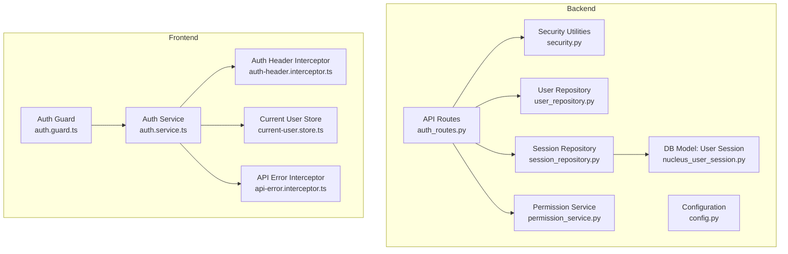
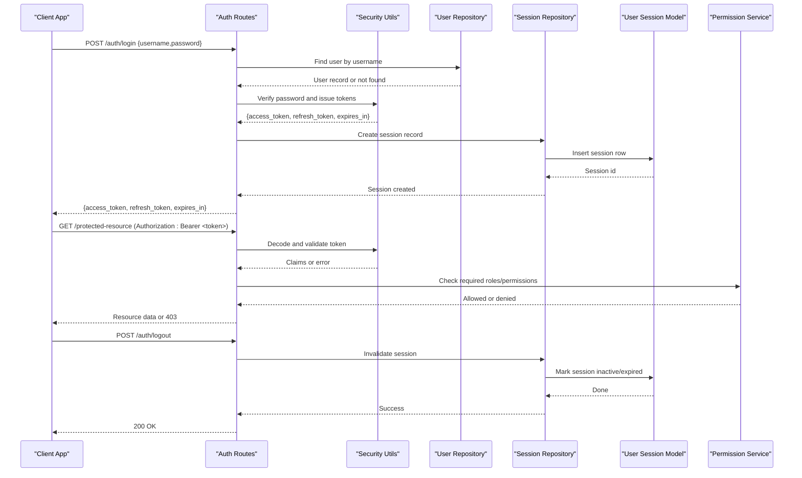
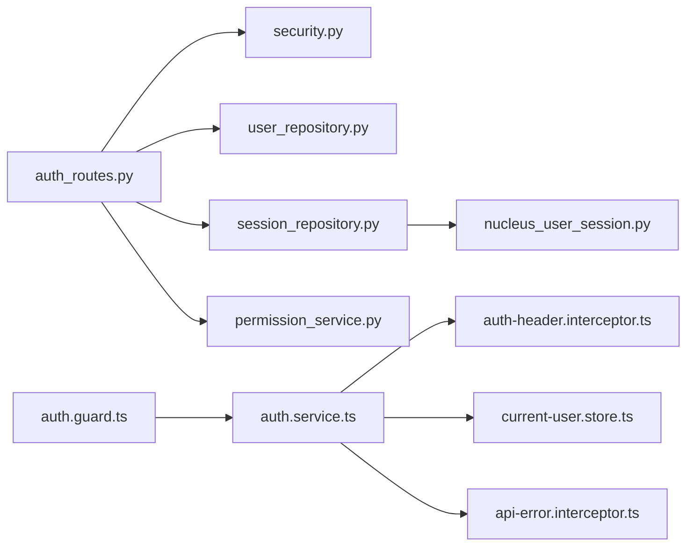

# Authentication API

<cite>
**Referenced Files in This Document**
- [auth_routes.py](file://app/api/auth_routes.py)
- [security.py](file://app/core/security.py)
- [config.py](file://app/core/config.py)
- [user_repository.py](file://app/repositories/user_repository.py)
- [session_repository.py](file://app/repositories/session_repository.py)
- [nucleus_user_session.py](file://app/db/nucleus_user_session.py)
- [permission_service.py](file://app/permissions/permission_service.py)
- [auth.service.ts](file://frontend/src/app/core/auth/auth.service.ts)
- [auth-header.interceptor.ts](file://frontend/src/app/core/auth/auth-header.interceptor.ts)
- [current-user.store.ts](file://frontend/src/app/core/auth/current-user.store.ts)
- [api-error.interceptor.ts](file://frontend/src/app/core/api/api-error.interceptor.ts)
- [auth.guard.ts](file://frontend/src/app/core/routing/auth.guard.ts)
- [test_login.py](file://.gemini/antigravity-ide/brain/7f382974-45b6-464b-9290-91e38672d11b/scratch/test_login.py)
</cite>

## Table of Contents
1. [Introduction](#introduction)
2. [Project Structure](#project-structure)
3. [Core Components](#core-components)
4. [Architecture Overview](#architecture-overview)
5. [Detailed Component Analysis](#detailed-component-analysis)
6. [Dependency Analysis](#dependency-analysis)
7. [Performance Considerations](#performance-considerations)
8. [Troubleshooting Guide](#troubleshooting-guide)
9. [Conclusion](#conclusion)
10. [Appendices](#appendices)

## Introduction
This document provides comprehensive authentication API documentation for the system, covering login and logout endpoints, JWT token handling, session management, middleware configuration, token validation, security headers, client-side integration patterns, error handling strategies, token refresh mechanisms, and role-based access control (RBAC) with permission checks. It is intended for both backend and frontend developers integrating with the authentication subsystem.

## Project Structure
Authentication-related functionality spans backend routes, core security utilities, repositories for user and session persistence, database models, permissions service, and frontend services and interceptors that manage tokens and guard routes.

**Diagram sources**
- [auth_routes.py](file://app/api/auth_routes.py)
- [security.py](file://app/core/security.py)
- [config.py](file://app/core/config.py)
- [user_repository.py](file://app/repositories/user_repository.py)
- [session_repository.py](file://app/repositories/session_repository.py)
- [nucleus_user_session.py](file://app/db/nucleus_user_session.py)
- [permission_service.py](file://app/permissions/permission_service.py)
- [auth.service.ts](file://frontend/src/app/core/auth/auth.service.ts)
- [auth-header.interceptor.ts](file://frontend/src/app/core/auth/auth-header.interceptor.ts)
- [current-user.store.ts](file://frontend/src/app/core/auth/current-user.store.ts)
- [api-error.interceptor.ts](file://frontend/src/app/core/api/api-error.interceptor.ts)
- [auth.guard.ts](file://frontend/src/app/core/routing/auth.guard.ts)

**Section sources**
- [auth_routes.py](file://app/api/auth_routes.py)
- [security.py](file://app/core/security.py)
- [config.py](file://app/core/config.py)
- [user_repository.py](file://app/repositories/user_repository.py)
- [session_repository.py](file://app/repositories/session_repository.py)
- [nucleus_user_session.py](file://app/db/nucleus_user_session.py)
- [permission_service.py](file://app/permissions/permission_service.py)
- [auth.service.ts](file://frontend/src/app/core/auth/auth.service.ts)
- [auth-header.interceptor.ts](file://frontend/src/app/core/auth/auth-header.interceptor.ts)
- [current-user.store.ts](file://frontend/src/app/core/auth/current-user.store.ts)
- [api-error.interceptor.ts](file://frontend/src/app/core/api/api-error.interceptor.ts)
- [auth.guard.ts](file://frontend/src/app/core/routing/auth.guard.ts)

## Core Components
- Authentication routes: Define login and logout endpoints, request/response schemas, and integrate with security utilities and repositories.
- Security utilities: Provide JWT creation, decoding, verification, and helper functions for token extraction and validation.
- Configuration: Centralizes secrets, token lifetimes, and security settings used by the security layer.
- Repositories: Persist and query users and sessions; handle session lifecycle and cleanup.
- Database model: Defines the user session schema and constraints.
- Permission service: Provides RBAC capabilities and permission checking helpers.
- Frontend auth service: Encapsulates login/logout calls, token storage, and current user state.
- Interceptors: Automatically attach Authorization headers to requests and normalize API errors.
- Auth guard: Protects routes based on authentication state.

**Section sources**
- [auth_routes.py](file://app/api/auth_routes.py)
- [security.py](file://app/core/security.py)
- [config.py](file://app/core/config.py)
- [user_repository.py](file://app/repositories/user_repository.py)
- [session_repository.py](file://app/repositories/session_repository.py)
- [nucleus_user_session.py](file://app/db/nucleus_user_session.py)
- [permission_service.py](file://app/permissions/permission_service.py)
- [auth.service.ts](file://frontend/src/app/core/auth/auth.service.ts)
- [auth-header.interceptor.ts](file://frontend/src/app/core/auth/auth-header.interceptor.ts)
- [current-user.store.ts](file://frontend/src/app/core/auth/current-user.store.ts)
- [api-error.interceptor.ts](file://frontend/src/app/core/api/api-error.interceptor.ts)
- [auth.guard.ts](file://frontend/src/app/core/routing/auth.guard.ts)

## Architecture Overview
The authentication flow uses HTTP-based login/logout endpoints backed by JWTs and persistent sessions. The frontend stores tokens securely, attaches them via an interceptor, and guards protected routes. RBAC is enforced through a permission service integrated into route handlers or dependencies.

**Diagram sources**
- [auth_routes.py](file://app/api/auth_routes.py)
- [security.py](file://app/core/security.py)
- [user_repository.py](file://app/repositories/user_repository.py)
- [session_repository.py](file://app/repositories/session_repository.py)
- [nucleus_user_session.py](file://app/db/nucleus_user_session.py)
- [permission_service.py](file://app/permissions/permission_service.py)

## Detailed Component Analysis

### Authentication Endpoints
- Login
  - Purpose: Authenticate credentials and return JWTs along with session metadata.
  - Request body fields: username, password.
  - Response fields: access_token, refresh_token, expires_in, optional user profile summary.
  - Status codes: 200 on success, 401 for invalid credentials, 400 for malformed input.
- Logout
  - Purpose: Terminate the current session and invalidate tokens server-side.
  - Request: Requires valid Authorization header.
  - Response: 200 on success, 401 if unauthenticated, 404 if session not found.
- Token Refresh (recommended pattern)
  - Purpose: Obtain a new access token using a valid refresh token without re-authentication.
  - Request body fields: refresh_token.
  - Response fields: new access_token and optionally updated refresh_token and expires_in.
  - Status codes: 200 on success, 401 if refresh token invalid/expired.

Notes:
- All responses follow a consistent envelope with status, message, and data fields.
- Errors include standardized error codes and messages for client handling.

**Section sources**
- [auth_routes.py](file://app/api/auth_routes.py)

### JWT Token Handling
- Creation: Tokens are issued upon successful login with claims including user identity and roles.
- Validation: Middleware decodes and verifies signatures, checks expiration, and extracts claims.
- Storage: Access tokens are short-lived; refresh tokens are longer-lived and tied to sessions.
- Rotation: On refresh, consider rotating refresh tokens and expiring previous ones.

Security considerations:
- Use strong signing algorithms and rotate secrets periodically.
- Enforce minimum token lifetimes and maximum durations.
- Bind tokens to device or IP where feasible.

**Section sources**
- [security.py](file://app/core/security.py)
- [config.py](file://app/core/config.py)

### Session Management
- Persistence: Sessions are stored in the database with fields such as session_id, user_id, created_at, expires_at, and active flag.
- Lifecycle: Created on login, refreshed on activity, invalidated on logout or expiry.
- Cleanup: Background jobs or lazy checks remove expired sessions.

Data model highlights:
- Primary key: session_id
- Foreign keys: user_id
- Indexes: user_id, expires_at for efficient queries

**Section sources**
- [session_repository.py](file://app/repositories/session_repository.py)
- [nucleus_user_session.py](file://app/db/nucleus_user_session.py)

### Authentication Middleware and Security Headers
- Middleware responsibilities:
  - Extract Authorization header.
  - Validate JWT signature and claims.
  - Attach current user context to request scope.
  - Reject unauthorized requests early.
- Security headers:
  - Set appropriate CORS policies.
  - Include standard security headers (e.g., HSTS, X-Content-Type-Options).
  - Configure rate limiting for auth endpoints.

**Section sources**
- [security.py](file://app/core/security.py)
- [config.py](file://app/core/config.py)

### Role-Based Access Control (RBAC) and Permissions
- Roles and permissions are embedded in JWT claims and/or resolved via the permission service.
- Permission checks can be applied at route level or within handlers.
- Patterns:
  - Require specific roles for sensitive endpoints.
  - Scope permissions to organizations or resources.
  - Deny-by-default with explicit allow lists.

Integration points:
- Route dependencies inject current user and roles.
- Permission service validates requested actions against policy.

**Section sources**
- [permission_service.py](file://app/permissions/permission_service.py)
- [auth_routes.py](file://app/api/auth_routes.py)

### Client-Side Authentication Flow
- Login:
  - Collect credentials and call login endpoint.
  - Store access_token and refresh_token securely (e.g., httpOnly cookies or secure storage).
  - Update current user store with profile and roles.
- Auto-attach headers:
  - Interceptor adds Authorization header to all outbound requests.
- Error handling:
  - Normalize API errors and display user-friendly messages.
  - Handle 401 by attempting silent refresh or redirecting to login.
- Route protection:
  - Guard prevents navigation to protected routes when unauthenticated.

Token refresh strategy:
- Before each request, check token expiry; if near-expiry, refresh proactively.
- On 401 response, attempt one-time refresh; if still failing, clear tokens and redirect.

**Section sources**
- [auth.service.ts](file://frontend/src/app/core/auth/auth.service.ts)
- [auth-header.interceptor.ts](file://frontend/src/app/core/auth/auth-header.interceptor.ts)
- [current-user.store.ts](file://frontend/src/app/core/auth/current-user.store.ts)
- [api-error.interceptor.ts](file://frontend/src/app/core/api/api-error.interceptor.ts)
- [auth.guard.ts](file://frontend/src/app/core/routing/auth.guard.ts)

### Practical Examples and Schemas
- Login request example:
  - Method: POST
  - Path: /auth/login
  - Body: { "username": "string", "password": "string" }
  - Response: { "access_token": "string", "refresh_token": "string", "expires_in": "number" }
- Logout request example:
  - Method: POST
  - Path: /auth/logout
  - Headers: Authorization: Bearer <access_token>
  - Response: { "message": "Logged out" }
- Token refresh request example:
  - Method: POST
  - Path: /auth/refresh
  - Body: { "refresh_token": "string" }
  - Response: { "access_token": "string", "expires_in": "number" }

Error response example:
- { "error_code": "INVALID_CREDENTIALS", "message": "Invalid username or password" }

**Section sources**
- [auth_routes.py](file://app/api/auth_routes.py)
- [api-error.interceptor.ts](file://frontend/src/app/core/api/api-error.interceptor.ts)

### Error Handling Strategies
- Backend:
  - Return consistent error envelopes with codes and messages.
  - Log security events (failed logins, token failures) without sensitive details.
- Frontend:
  - Centralized error interceptor normalizes responses and exceptions.
  - Show actionable messages and guide users to retry or re-authenticate.
  - Implement retry logic for transient network errors but not for auth failures.

**Section sources**
- [api-error.interceptor.ts](file://frontend/src/app/core/api/api-error.interceptor.ts)
- [auth.service.ts](file://frontend/src/app/core/auth/auth.service.ts)

### Token Refresh Mechanisms
- Server-side:
  - Validate refresh token against session store.
  - Issue new access token and optionally rotate refresh token.
  - Revoke old refresh token to prevent replay attacks.
- Client-side:
  - Intercept 401 responses and attempt refresh once.
  - If refresh fails, clear local state and redirect to login.
  - Proactively refresh tokens before expiry to minimize interruptions.

**Section sources**
- [auth_routes.py](file://app/api/auth_routes.py)
- [session_repository.py](file://app/repositories/session_repository.py)
- [auth.service.ts](file://frontend/src/app/core/auth/auth.service.ts)

### RBAC Integration and Permission Checking Patterns
- Role propagation:
  - Include roles in JWT claims and verify on each request.
- Permission checks:
  - Use decorators or dependency injection to enforce permissions per route.
  - Scope permissions to organization or resource identifiers.
- Policy evaluation:
  - Centralize policy rules in the permission service for consistency.

**Section sources**
- [permission_service.py](file://app/permissions/permission_service.py)
- [auth_routes.py](file://app/api/auth_routes.py)

## Dependency Analysis
The following diagram shows how components depend on each other during authentication operations.

**Diagram sources**
- [auth_routes.py](file://app/api/auth_routes.py)
- [security.py](file://app/core/security.py)
- [user_repository.py](file://app/repositories/user_repository.py)
- [session_repository.py](file://app/repositories/session_repository.py)
- [nucleus_user_session.py](file://app/db/nucleus_user_session.py)
- [permission_service.py](file://app/permissions/permission_service.py)
- [auth.service.ts](file://frontend/src/app/core/auth/auth.service.ts)
- [auth-header.interceptor.ts](file://frontend/src/app/core/auth/auth-header.interceptor.ts)
- [current-user.store.ts](file://frontend/src/app/core/auth/current-user.store.ts)
- [api-error.interceptor.ts](file://frontend/src/app/core/api/api-error.interceptor.ts)
- [auth.guard.ts](file://frontend/src/app/core/routing/auth.guard.ts)

**Section sources**
- [auth_routes.py](file://app/api/auth_routes.py)
- [security.py](file://app/core/security.py)
- [user_repository.py](file://app/repositories/user_repository.py)
- [session_repository.py](file://app/repositories/session_repository.py)
- [nucleus_user_session.py](file://app/db/nucleus_user_session.py)
- [permission_service.py](file://app/permissions/permission_service.py)
- [auth.service.ts](file://frontend/src/app/core/auth/auth.service.ts)
- [auth-header.interceptor.ts](file://frontend/src/app/core/auth/auth-header.interceptor.ts)
- [current-user.store.ts](file://frontend/src/app/core/auth/current-user.store.ts)
- [api-error.interceptor.ts](file://frontend/src/app/core/api/api-error.interceptor.ts)
- [auth.guard.ts](file://frontend/src/app/core/routing/auth.guard.ts)

## Performance Considerations
- Minimize payload sizes by returning only necessary user fields in responses.
- Cache frequently accessed user profiles behind short TTL caches when safe.
- Use connection pooling and indexes on session tables for fast lookups.
- Rate-limit login and refresh endpoints to mitigate brute-force and credential stuffing.
- Prefer asynchronous token validation and background session cleanup.

[No sources needed since this section provides general guidance]

## Troubleshooting Guide
Common issues and resolutions:
- Invalid credentials:
  - Verify username/password and ensure account is active.
  - Check backend logs for failed attempts and lockout policies.
- Unauthorized or forbidden:
  - Confirm Authorization header presence and correctness.
  - Ensure user has required roles/permissions for the resource.
- Token expired:
  - Implement refresh flow; ensure refresh token is valid and not revoked.
- Session not found:
  - Confirm session exists and is active; check cleanup jobs.
- CORS or security header errors:
  - Review server CORS configuration and security headers.

Validation aids:
- Use provided test scripts to exercise login flows and assert expected responses.

**Section sources**
- [test_login.py](file://.gemini/antigravity-ide/brain/7f382974-45b6-464b-9290-91e38672d11b/scratch/test_login.py)
- [auth.service.ts](file://frontend/src/app/core/auth/auth.service.ts)
- [api-error.interceptor.ts](file://frontend/src/app/core/api/api-error.interceptor.ts)

## Conclusion
The authentication subsystem combines robust JWT handling, persistent session management, and RBAC enforcement to provide secure, scalable access control. By following the documented endpoints, token strategies, and client-side patterns, teams can implement reliable authentication flows with clear error handling and strong security posture.

[No sources needed since this section summarizes without analyzing specific files]

## Appendices

### Appendix A: Endpoint Reference Summary
- POST /auth/login
  - Request: { username, password }
  - Response: { access_token, refresh_token, expires_in }
  - Errors: 400, 401
- POST /auth/logout
  - Headers: Authorization: Bearer <access_token>
  - Response: { message }
  - Errors: 401, 404
- POST /auth/refresh
  - Request: { refresh_token }
  - Response: { access_token, expires_in }
  - Errors: 401

**Section sources**
- [auth_routes.py](file://app/api/auth_routes.py)

### Appendix B: Security Checklist
- Use HTTPS everywhere.
- Rotate signing secrets regularly.
- Enforce short-lived access tokens and secure refresh rotation.
- Apply least-privilege roles and scope permissions to resources.
- Enable rate limiting and monitoring for auth endpoints.

[No sources needed since this section provides general guidance]