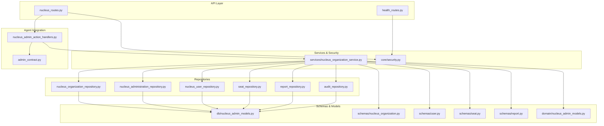
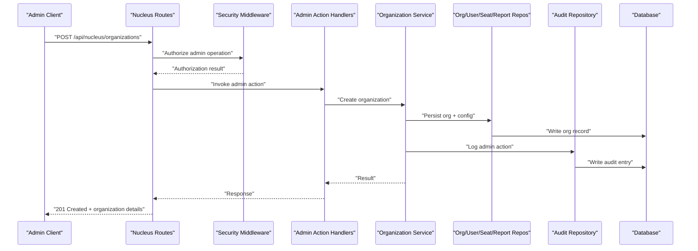
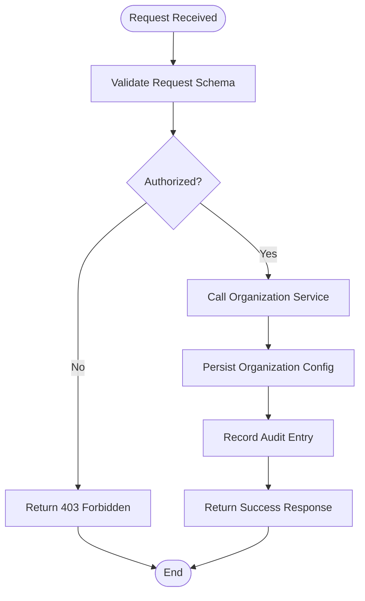
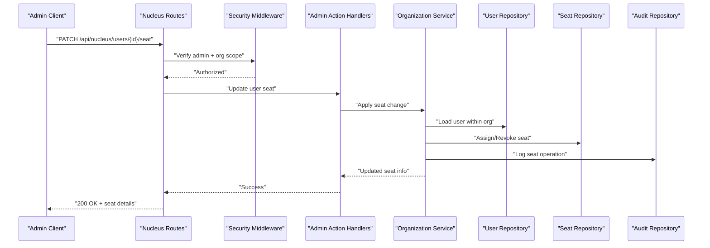
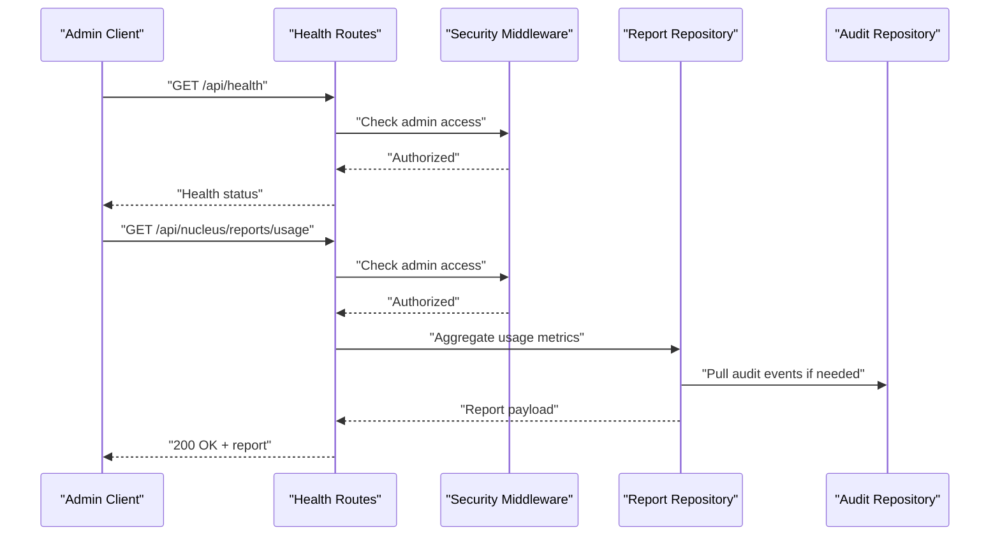
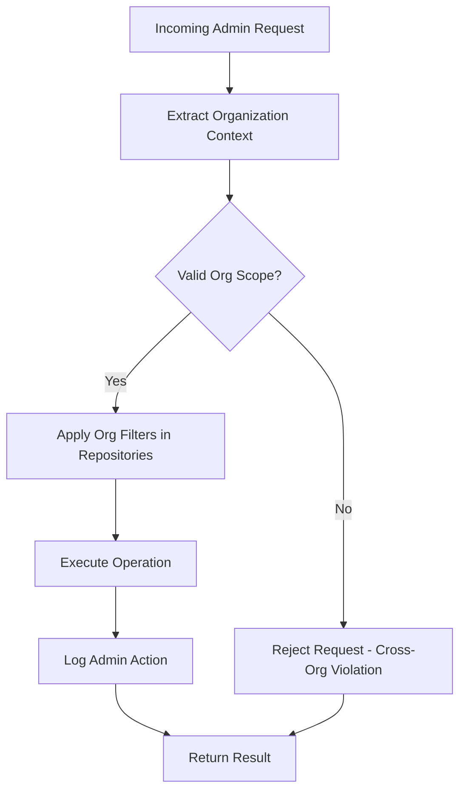
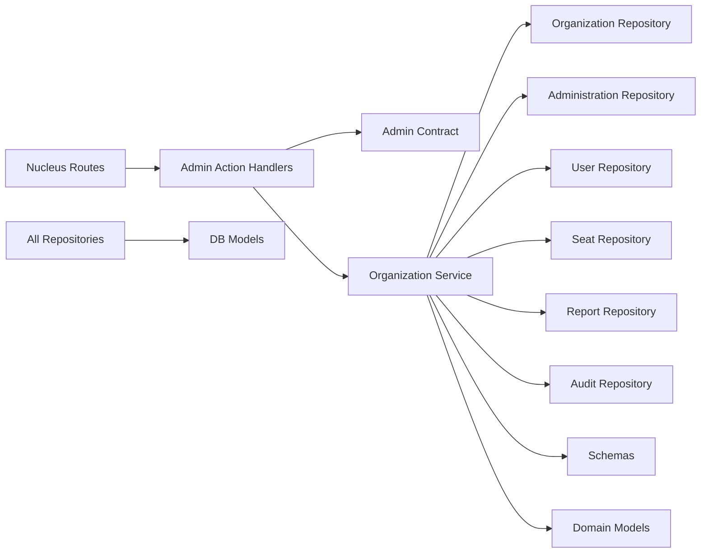

# Nucleus Admin API

<cite>
**Referenced Files in This Document**
- [app/api/nucleus_routes.py](file://app/api/nucleus_routes.py)
- [app/agent/nucleus_admin_action_handlers.py](file://app/agent/nucleus_admin_action_handlers.py)
- [app/adapters/nucleus/admin_contract.py](file://app/adapters/nucleus/admin_contract.py)
- [app/repositories/nucleus_administration_repository.py](file://app/repositories/nucleus_administration_repository.py)
- [app/repositories/nucleus_organization_repository.py](file://app/repositories/nucleus_organization_repository.py)
- [app/repositories/nucleus_user_repository.py](file://app/repositories/nucleus_user_repository.py)
- [app/repositories/seat_repository.py](file://app/repositories/seat_repository.py)
- [app/repositories/report_repository.py](file://app/repositories/report_repository.py)
- [app/schemas/nucleus_organization.py](file://app/schemas/nucleus_organization.py)
- [app/schemas/user.py](file://app/schemas/user.py)
- [app/schemas/seat.py](file://app/schemas/seat.py)
- [app/schemas/report.py](file://app/schemas/report.py)
- [app/db/nucleus_admin_models.py](file://app/db/nucleus_admin_models.py)
- [app/domain/nucleus_admin_models.py](file://app/domain/nucleus_admin_models.py)
- [app/services/nucleus_organization_service.py](file://app/services/nucleus_organization_service.py)
- [app/core/security.py](file://app/core/security.py)
- [app/api/health_routes.py](file://app/api/health_routes.py)
- [app/repositories/audit_repository.py](file://app/repositories/audit_repository.py)
- [tests/test_nucleus_admin_control.py](file://tests/test_nucleus_admin_control.py)
- [tests/test_nucleus_organization_api.py](file://tests/test_nucleus_organization_api.py)
- [tests/test_users_seats.py](file://tests/test_users_seats.py)
- [tests/test_reports.py](file://tests/test_reports.py)
</cite>

## Table of Contents
1. [Introduction](#introduction)
2. [Project Structure](#project-structure)
3. [Core Components](#core-components)
4. [Architecture Overview](#architecture-overview)
5. [Detailed Component Analysis](#detailed-component-analysis)
6. [Dependency Analysis](#dependency-analysis)
7. [Performance Considerations](#performance-considerations)
8. [Troubleshooting Guide](#troubleshooting-guide)
9. [Conclusion](#conclusion)

## Introduction
This document describes the Nucleus administration API surface for multi-organization management, user administration, and system oversight. It covers:
- Organization lifecycle endpoints (create, configure, monitor)
- User administration (seats, roles, access control)
- System health monitoring, performance metrics, and administrative reporting
- Cross-organization query prevention and data isolation enforcement
- Audit logging for administrative actions

The documentation is organized to help both implementers and operators understand how the admin APIs are exposed, how they enforce boundaries, and how to operate them safely at scale.

## Project Structure
Nucleus admin functionality is implemented as a layered service with clear separation between HTTP routes, action handlers, adapters, repositories, schemas, and domain models. The key layers relevant to this document include:
- API layer: HTTP route definitions for admin operations
- Agent integration: Action handlers that bridge admin operations into the agent/control plane
- Adapters: Contracts used by the agent to call nucleus admin capabilities
- Repositories: Data access for organizations, users, seats, reports, and audit logs
- Schemas: Request/response validation models
- Domain models: Core entities and policies
- Services: Business logic orchestration for organization management
- Security: Authorization and policy enforcement
- Health: System health endpoints

**Diagram sources**
- [app/api/nucleus_routes.py](file://app/api/nucleus_routes.py)
- [app/api/health_routes.py](file://app/api/health_routes.py)
- [app/agent/nucleus_admin_action_handlers.py](file://app/agent/nucleus_admin_action_handlers.py)
- [app/adapters/nucleus/admin_contract.py](file://app/adapters/nucleus/admin_contract.py)
- [app/services/nucleus_organization_service.py](file://app/services/nucleus_organization_service.py)
- [app/repositories/nucleus_organization_repository.py](file://app/repositories/nucleus_organization_repository.py)
- [app/repositories/nucleus_administration_repository.py](file://app/repositories/nucleus_administration_repository.py)
- [app/repositories/nucleus_user_repository.py](file://app/repositories/nucleus_user_repository.py)
- [app/repositories/seat_repository.py](file://app/repositories/seat_repository.py)
- [app/repositories/report_repository.py](file://app/repositories/report_repository.py)
- [app/repositories/audit_repository.py](file://app/repositories/audit_repository.py)
- [app/schemas/nucleus_organization.py](file://app/schemas/nucleus_organization.py)
- [app/schemas/user.py](file://app/schemas/user.py)
- [app/schemas/seat.py](file://app/schemas/seat.py)
- [app/schemas/report.py](file://app/schemas/report.py)
- [app/domain/nucleus_admin_models.py](file://app/domain/nucleus_admin_models.py)
- [app/db/nucleus_admin_models.py](file://app/db/nucleus_admin_models.py)
- [app/core/security.py](file://app/core/security.py)

**Section sources**
- [app/api/nucleus_routes.py](file://app/api/nucleus_routes.py)
- [app/api/health_routes.py](file://app/api/health_routes.py)
- [app/agent/nucleus_admin_action_handlers.py](file://app/agent/nucleus_admin_action_handlers.py)
- [app/adapters/nucleus/admin_contract.py](file://app/adapters/nucleus/admin_contract.py)
- [app/services/nucleus_organization_service.py](file://app/services/nucleus_organization_service.py)
- [app/repositories/nucleus_organization_repository.py](file://app/repositories/nucleus_organization_repository.py)
- [app/repositories/nucleus_administration_repository.py](file://app/repositories/nucleus_administration_repository.py)
- [app/repositories/nucleus_user_repository.py](file://app/repositories/nucleus_user_repository.py)
- [app/repositories/seat_repository.py](file://app/repositories/seat_repository.py)
- [app/repositories/report_repository.py](file://app/repositories/report_repository.py)
- [app/repositories/audit_repository.py](file://app/repositories/audit_repository.py)
- [app/schemas/nucleus_organization.py](file://app/schemas/nucleus_organization.py)
- [app/schemas/user.py](file://app/schemas/user.py)
- [app/schemas/seat.py](file://app/schemas/seat.py)
- [app/schemas/report.py](file://app/schemas/report.py)
- [app/domain/nucleus_admin_models.py](file://app/domain/nucleus_admin_models.py)
- [app/db/nucleus_admin_models.py](file://app/db/nucleus_admin_models.py)
- [app/core/security.py](file://app/core/security.py)

## Core Components
- Nucleus Admin Routes: Define HTTP endpoints for tenant organization management, user seat operations, and administrative reporting. These routes integrate with security middleware to enforce authorization and scope.
- Nucleus Admin Action Handlers: Bridge admin operations into the agent/control plane using typed contracts, enabling consistent execution and observability.
- Administration Repository: Provides cross-cutting admin queries and projections across organizations while enforcing isolation.
- Organization Repository: Manages tenant organization records and configuration.
- User and Seat Repositories: Manage user identities, seat allocations, and role assignments within an organization context.
- Report Repository: Aggregates administrative metrics and operational reports.
- Audit Repository: Records administrative actions for compliance and troubleshooting.
- Schemas: Validate request payloads and define response shapes for all admin endpoints.
- Domain Models: Encapsulate core entities and policies such as organization state, user roles, and seat entitlements.
- Services: Orchestrate business logic for organization lifecycle and related operations.
- Security: Centralized authorization checks, including cross-organization boundary enforcement.

**Section sources**
- [app/api/nucleus_routes.py](file://app/api/nucleus_routes.py)
- [app/agent/nucleus_admin_action_handlers.py](file://app/agent/nucleus_admin_action_handlers.py)
- [app/adapters/nucleus/admin_contract.py](file://app/adapters/nucleus/admin_contract.py)
- [app/repositories/nucleus_administration_repository.py](file://app/repositories/nucleus_administration_repository.py)
- [app/repositories/nucleus_organization_repository.py](file://app/repositories/nucleus_organization_repository.py)
- [app/repositories/nucleus_user_repository.py](file://app/repositories/nucleus_user_repository.py)
- [app/repositories/seat_repository.py](file://app/repositories/seat_repository.py)
- [app/repositories/report_repository.py](file://app/repositories/report_repository.py)
- [app/repositories/audit_repository.py](file://app/repositories/audit_repository.py)
- [app/schemas/nucleus_organization.py](file://app/schemas/nucleus_organization.py)
- [app/schemas/user.py](file://app/schemas/user.py)
- [app/schemas/seat.py](file://app/schemas/seat.py)
- [app/schemas/report.py](file://app/schemas/report.py)
- [app/domain/nucleus_admin_models.py](file://app/domain/nucleus_admin_models.py)
- [app/services/nucleus_organization_service.py](file://app/services/nucleus_organization_service.py)
- [app/core/security.py](file://app/core/security.py)

## Architecture Overview
The Nucleus Admin API follows a layered architecture:
- HTTP routes receive requests, validate inputs via schemas, and enforce security policies.
- Action handlers translate admin intents into typed contract calls for the agent/control plane.
- Services coordinate repository interactions and apply business rules.
- Repositories enforce data isolation and perform persistence operations.
- Domain models represent core entities and constraints.
- Audit logs capture administrative actions for traceability.

**Diagram sources**
- [app/api/nucleus_routes.py](file://app/api/nucleus_routes.py)
- [app/agent/nucleus_admin_action_handlers.py](file://app/agent/nucleus_admin_action_handlers.py)
- [app/adapters/nucleus/admin_contract.py](file://app/adapters/nucleus/admin_contract.py)
- [app/services/nucleus_organization_service.py](file://app/services/nucleus_organization_service.py)
- [app/repositories/nucleus_organization_repository.py](file://app/repositories/nucleus_organization_repository.py)
- [app/repositories/audit_repository.py](file://app/repositories/audit_repository.py)
- [app/core/security.py](file://app/core/security.py)

## Detailed Component Analysis

### Organization Management Endpoints
Purpose: Create, configure, and monitor tenant organizations.

Key responsibilities:
- Validate organization creation requests using schemas.
- Enforce authorization and ensure caller has permission to create tenants.
- Persist organization metadata and configuration via repositories.
- Record administrative actions in audit logs.
- Provide read-only monitoring endpoints for organization status and configuration.

Operational flow:
- Route receives request and validates schema.
- Security middleware checks admin privileges and scopes.
- Action handler invokes organization service.
- Service orchestrates repository writes and audit logging.
- Response includes created or updated organization details.

**Diagram sources**
- [app/api/nucleus_routes.py](file://app/api/nucleus_routes.py)
- [app/services/nucleus_organization_service.py](file://app/services/nucleus_organization_service.py)
- [app/repositories/nucleus_organization_repository.py](file://app/repositories/nucleus_organization_repository.py)
- [app/repositories/audit_repository.py](file://app/repositories/audit_repository.py)
- [app/schemas/nucleus_organization.py](file://app/schemas/nucleus_organization.py)
- [app/core/security.py](file://app/core/security.py)

**Section sources**
- [app/api/nucleus_routes.py](file://app/api/nucleus_routes.py)
- [app/services/nucleus_organization_service.py](file://app/services/nucleus_organization_service.py)
- [app/repositories/nucleus_organization_repository.py](file://app/repositories/nucleus_organization_repository.py)
- [app/repositories/audit_repository.py](file://app/repositories/audit_repository.py)
- [app/schemas/nucleus_organization.py](file://app/schemas/nucleus_organization.py)
- [app/core/security.py](file://app/core/security.py)

### User Administration Endpoints
Purpose: Manage user seats, assign roles, and control access within an organization.

Key responsibilities:
- Validate user and seat operations via schemas.
- Enforce per-organization scoping to prevent cross-tenant access.
- Update user roles and seat entitlements through repositories.
- Log seat changes and role assignments for auditability.

Common operations:
- Assign or revoke seats for users within an organization.
- Grant or remove roles scoped to the organization context.
- Query user membership and seat utilization for reporting.

**Diagram sources**
- [app/api/nucleus_routes.py](file://app/api/nucleus_routes.py)
- [app/agent/nucleus_admin_action_handlers.py](file://app/agent/nucleus_admin_action_handlers.py)
- [app/services/nucleus_organization_service.py](file://app/services/nucleus_organization_service.py)
- [app/repositories/nucleus_user_repository.py](file://app/repositories/nucleus_user_repository.py)
- [app/repositories/seat_repository.py](file://app/repositories/seat_repository.py)
- [app/repositories/audit_repository.py](file://app/repositories/audit_repository.py)
- [app/schemas/user.py](file://app/schemas/user.py)
- [app/schemas/seat.py](file://app/schemas/seat.py)
- [app/core/security.py](file://app/core/security.py)

**Section sources**
- [app/api/nucleus_routes.py](file://app/api/nucleus_routes.py)
- [app/agent/nucleus_admin_action_handlers.py](file://app/agent/nucleus_admin_action_handlers.py)
- [app/services/nucleus_organization_service.py](file://app/services/nucleus_organization_service.py)
- [app/repositories/nucleus_user_repository.py](file://app/repositories/nucleus_user_repository.py)
- [app/repositories/seat_repository.py](file://app/repositories/seat_repository.py)
- [app/repositories/audit_repository.py](file://app/repositories/audit_repository.py)
- [app/schemas/user.py](file://app/schemas/user.py)
- [app/schemas/seat.py](file://app/schemas/seat.py)
- [app/core/security.py](file://app/core/security.py)

### System Oversight Endpoints
Purpose: Provide health checks, performance metrics, and administrative reporting.

Capabilities:
- Health endpoint: Returns system readiness and dependency status.
- Metrics: Expose aggregated performance indicators for admin operations.
- Reports: Generate summaries of organization usage, seat utilization, and audit events.

**Diagram sources**
- [app/api/health_routes.py](file://app/api/health_routes.py)
- [app/repositories/report_repository.py](file://app/repositories/report_repository.py)
- [app/repositories/audit_repository.py](file://app/repositories/audit_repository.py)
- [app/schemas/report.py](file://app/schemas/report.py)
- [app/core/security.py](file://app/core/security.py)

**Section sources**
- [app/api/health_routes.py](file://app/api/health_routes.py)
- [app/repositories/report_repository.py](file://app/repositories/report_repository.py)
- [app/repositories/audit_repository.py](file://app/repositories/audit_repository.py)
- [app/schemas/report.py](file://app/schemas/report.py)
- [app/core/security.py](file://app/core/security.py)

### Cross-Organization Query Prevention and Data Isolation
Mechanisms:
- Scope enforcement: All admin operations require explicit organization context; cross-org references are rejected.
- Repository-level guards: Queries automatically filter by organization ID to prevent leakage.
- Security middleware: Validates caller permissions and ensures tenant boundaries.

**Diagram sources**
- [app/core/security.py](file://app/core/security.py)
- [app/repositories/nucleus_administration_repository.py](file://app/repositories/nucleus_administration_repository.py)
- [app/repositories/nucleus_organization_repository.py](file://app/repositories/nucleus_organization_repository.py)
- [app/repositories/nucleus_user_repository.py](file://app/repositories/nucleus_user_repository.py)
- [app/repositories/seat_repository.py](file://app/repositories/seat_repository.py)
- [app/repositories/report_repository.py](file://app/repositories/report_repository.py)
- [app/repositories/audit_repository.py](file://app/repositories/audit_repository.py)

**Section sources**
- [app/core/security.py](file://app/core/security.py)
- [app/repositories/nucleus_administration_repository.py](file://app/repositories/nucleus_administration_repository.py)
- [app/repositories/nucleus_organization_repository.py](file://app/repositories/nucleus_organization_repository.py)
- [app/repositories/nucleus_user_repository.py](file://app/repositories/nucleus_user_repository.py)
- [app/repositories/seat_repository.py](file://app/repositories/seat_repository.py)
- [app/repositories/report_repository.py](file://app/repositories/report_repository.py)
- [app/repositories/audit_repository.py](file://app/repositories/audit_repository.py)

### Audit Logging for Administrative Actions
Requirements:
- Every administrative action (create/update/delete) must be recorded with actor identity, timestamp, target entity, and outcome.
- Audit entries are persisted separately from operational data to support compliance and incident response.

Implementation highlights:
- Services invoke audit repository after successful operations.
- Audit entries include structured metadata for filtering and analysis.
- Reporting endpoints can aggregate audit events for oversight dashboards.

**Section sources**
- [app/repositories/audit_repository.py](file://app/repositories/audit_repository.py)
- [app/services/nucleus_organization_service.py](file://app/services/nucleus_organization_service.py)
- [app/repositories/report_repository.py](file://app/repositories/report_repository.py)

## Dependency Analysis
The admin subsystem depends on well-defined contracts and repositories to maintain cohesion and minimize coupling.

**Diagram sources**
- [app/api/nucleus_routes.py](file://app/api/nucleus_routes.py)
- [app/agent/nucleus_admin_action_handlers.py](file://app/agent/nucleus_admin_action_handlers.py)
- [app/adapters/nucleus/admin_contract.py](file://app/adapters/nucleus/admin_contract.py)
- [app/services/nucleus_organization_service.py](file://app/services/nucleus_organization_service.py)
- [app/repositories/nucleus_organization_repository.py](file://app/repositories/nucleus_organization_repository.py)
- [app/repositories/nucleus_administration_repository.py](file://app/repositories/nucleus_administration_repository.py)
- [app/repositories/nucleus_user_repository.py](file://app/repositories/nucleus_user_repository.py)
- [app/repositories/seat_repository.py](file://app/repositories/seat_repository.py)
- [app/repositories/report_repository.py](file://app/repositories/report_repository.py)
- [app/repositories/audit_repository.py](file://app/repositories/audit_repository.py)
- [app/schemas/nucleus_organization.py](file://app/schemas/nucleus_organization.py)
- [app/schemas/user.py](file://app/schemas/user.py)
- [app/schemas/seat.py](file://app/schemas/seat.py)
- [app/schemas/report.py](file://app/schemas/report.py)
- [app/domain/nucleus_admin_models.py](file://app/domain/nucleus_admin_models.py)
- [app/db/nucleus_admin_models.py](file://app/db/nucleus_admin_models.py)

**Section sources**
- [app/api/nucleus_routes.py](file://app/api/nucleus_routes.py)
- [app/agent/nucleus_admin_action_handlers.py](file://app/agent/nucleus_admin_action_handlers.py)
- [app/adapters/nucleus/admin_contract.py](file://app/adapters/nucleus/admin_contract.py)
- [app/services/nucleus_organization_service.py](file://app/services/nucleus_organization_service.py)
- [app/repositories/nucleus_organization_repository.py](file://app/repositories/nucleus_organization_repository.py)
- [app/repositories/nucleus_administration_repository.py](file://app/repositories/nucleus_administration_repository.py)
- [app/repositories/nucleus_user_repository.py](file://app/repositories/nucleus_user_repository.py)
- [app/repositories/seat_repository.py](file://app/repositories/seat_repository.py)
- [app/repositories/report_repository.py](file://app/repositories/report_repository.py)
- [app/repositories/audit_repository.py](file://app/repositories/audit_repository.py)
- [app/schemas/nucleus_organization.py](file://app/schemas/nucleus_organization.py)
- [app/schemas/user.py](file://app/schemas/user.py)
- [app/schemas/seat.py](file://app/schemas/seat.py)
- [app/schemas/report.py](file://app/schemas/report.py)
- [app/domain/nucleus_admin_models.py](file://app/domain/nucleus_admin_models.py)
- [app/db/nucleus_admin_models.py](file://app/db/nucleus_admin_models.py)

## Performance Considerations
- Batch operations: Prefer batched updates for seat and role changes to reduce round-trips.
- Pagination: Use pagination for large report queries to avoid memory pressure.
- Caching: Cache frequently accessed organization metadata where appropriate, with invalidation on mutations.
- Indexing: Ensure database indexes exist on organization-scoped foreign keys and audit timestamps.
- Concurrency: Use optimistic locking or idempotency keys for concurrent admin operations.

[No sources needed since this section provides general guidance]

## Troubleshooting Guide
Common issues and resolutions:
- Authorization failures: Verify admin privileges and correct organization context in requests.
- Cross-organization violations: Ensure all queries include valid org filters; check security middleware configuration.
- Seat assignment errors: Confirm user exists within the specified organization and seat capacity limits are respected.
- Audit gaps: Inspect audit repository write paths and transaction boundaries to ensure logging occurs on success.

Diagnostic steps:
- Check health endpoint for dependency status.
- Review audit logs for recent admin actions and outcomes.
- Validate schema constraints for request payloads.
- Inspect repository filters and domain model constraints for isolation enforcement.

**Section sources**
- [app/api/health_routes.py](file://app/api/health_routes.py)
- [app/repositories/audit_repository.py](file://app/repositories/audit_repository.py)
- [app/core/security.py](file://app/core/security.py)
- [app/schemas/nucleus_organization.py](file://app/schemas/nucleus_organization.py)
- [app/schemas/user.py](file://app/schemas/user.py)
- [app/schemas/seat.py](file://app/schemas/seat.py)

## Conclusion
The Nucleus Admin API provides a robust, secure, and auditable interface for managing multiple organizations, administering users and seats, and overseeing system health and performance. Its layered design enforces strict data isolation, prevents cross-organization queries, and maintains comprehensive audit trails. Operators should leverage health and reporting endpoints for ongoing oversight and rely on audit logs for compliance and incident response.

[No sources needed since this section summarizes without analyzing specific files]