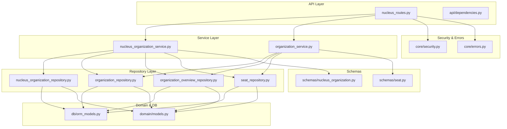
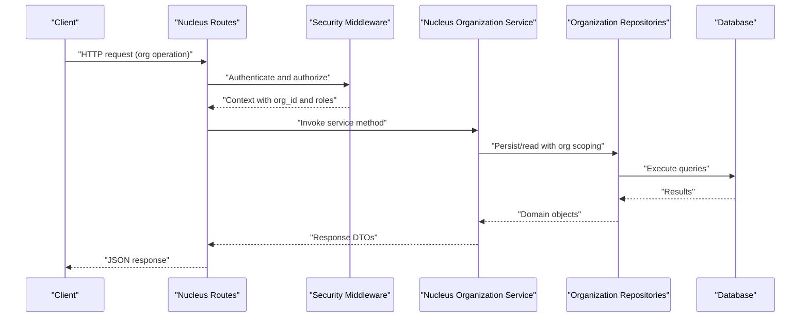
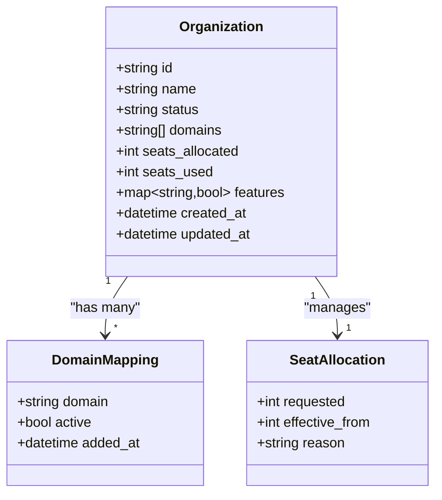
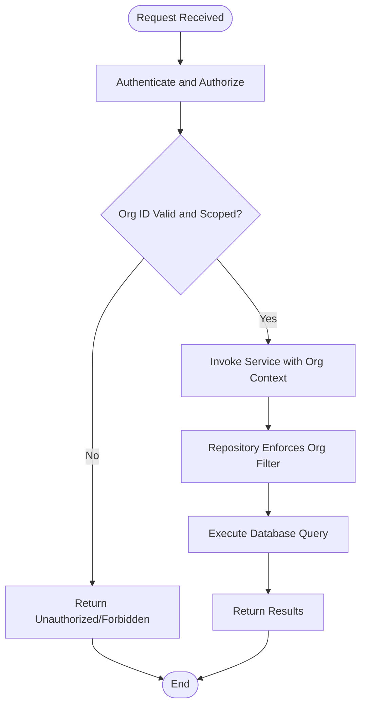
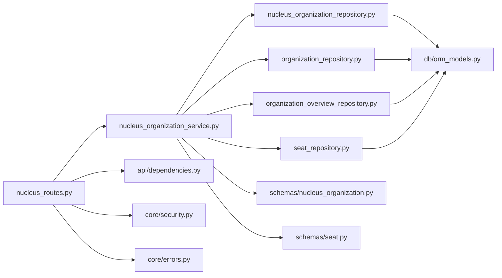

# Organization Management

<cite>
**Referenced Files in This Document**
- [app/api/nucleus_routes.py](file://app/api/nucleus_routes.py)
- [app/services/nucleus_organization_service.py](file://app/services/nucleus_organization_service.py)
- [app/repositories/nucleus_organization_repository.py](file://app/repositories/nucleus_organization_repository.py)
- [app/schemas/nucleus_organization.py](file://app/schemas/nucleus_organization.py)
- [app/db/orm_models.py](file://app/db/orm_models.py)
- [app/core/security.py](file://app/core/security.py)
- [app/core/errors.py](file://app/core/errors.py)
- [app/domain/models.py](file://app/domain/models.py)
- [app/adapters/organization/contract.py](file://app/adapters/organization/contract.py)
- [app/adapters/organization/mock_adapter.py](file://app/adapters/organization/mock_adapter.py)
- [app/repositories/seat_repository.py](file://app/repositories/seat_repository.py)
- [app/schemas/seat.py](file://app/schemas/seat.py)
- [app/repositories/organization_overview_repository.py](file://app/repositories/organization_overview_repository.py)
- [app/repositories/organization_repository.py](file://app/repositories/organization_repository.py)
- [app/services/organization_service.py](file://app/services/organization_service.py)
- [app/api/dependencies.py](file://app/api/dependencies.py)
- [tests/test_nucleus_organization_api.py](file://tests/test_nucleus_organization_api.py)
- [tests/test_organization_boundaries.py](file://tests/test_organization_boundaries.py)
- [tests/test_users_seats.py](file://tests/test_users_seats.py)
</cite>

## Table of Contents
1. [Introduction](#introduction)
2. [Project Structure](#project-structure)
3. [Core Components](#core-components)
4. [Architecture Overview](#architecture-overview)
5. [Detailed Component Analysis](#detailed-component-analysis)
6. [Dependency Analysis](#dependency-analysis)
7. [Performance Considerations](#performance-considerations)
8. [Troubleshooting Guide](#troubleshooting-guide)
9. [Conclusion](#conclusion)
10. [Appendices](#appendices)

## Introduction
This document provides detailed API documentation for organization management endpoints, focusing on tenant organizations within the Nucleus subsystem. It covers:
- CRUD operations for creating, updating, and deleting tenant organizations
- Organization configuration endpoints including domain mapping, seat allocation, and feature toggles
- Lifecycle management including activation, deactivation, and archival processes
- Isolation enforcement, cross-organization query prevention, and data boundary validation
- Request/response schemas, authentication requirements, and error handling patterns

The goal is to enable developers and integrators to implement secure, correct, and efficient client code that interacts with organization management APIs while respecting multi-tenant boundaries.

## Project Structure
Organization management spans multiple layers:
- API layer exposes HTTP routes for organization operations
- Service layer encapsulates business logic and orchestration
- Repository layer persists and retrieves organization-related data
- Schemas define request/response contracts
- Domain models and ORM models represent core entities
- Security and errors provide authentication and standardized error responses
- Tests validate behavior, isolation, and boundaries

**Diagram sources**
- [app/api/nucleus_routes.py](file://app/api/nucleus_routes.py)
- [app/services/nucleus_organization_service.py](file://app/services/nucleus_organization_service.py)
- [app/repositories/nucleus_organization_repository.py](file://app/repositories/nucleus_organization_repository.py)
- [app/repositories/organization_repository.py](file://app/repositories/organization_repository.py)
- [app/repositories/organization_overview_repository.py](file://app/repositories/organization_overview_repository.py)
- [app/repositories/seat_repository.py](file://app/repositories/seat_repository.py)
- [app/schemas/nucleus_organization.py](file://app/schemas/nucleus_organization.py)
- [app/schemas/seat.py](file://app/schemas/seat.py)
- [app/domain/models.py](file://app/domain/models.py)
- [app/db/orm_models.py](file://app/db/orm_models.py)
- [app/core/security.py](file://app/core/security.py)
- [app/core/errors.py](file://app/core/errors.py)

**Section sources**
- [app/api/nucleus_routes.py](file://app/api/nucleus_routes.py)
- [app/services/nucleus_organization_service.py](file://app/services/nucleus_organization_service.py)
- [app/repositories/nucleus_organization_repository.py](file://app/repositories/nucleus_organization_repository.py)
- [app/repositories/organization_repository.py](file://app/repositories/organization_repository.py)
- [app/repositories/organization_overview_repository.py](file://app/repositories/organization_overview_repository.py)
- [app/repositories/seat_repository.py](file://app/repositories/seat_repository.py)
- [app/schemas/nucleus_organization.py](file://app/schemas/nucleus_organization.py)
- [app/schemas/seat.py](file://app/schemas/seat.py)
- [app/domain/models.py](file://app/domain/models.py)
- [app/db/orm_models.py](file://app/db/orm_models.py)
- [app/core/security.py](file://app/core/security.py)
- [app/core/errors.py](file://app/core/errors.py)

## Core Components
- API Routes: Expose endpoints for organization lifecycle and configuration under a dedicated namespace.
- Services: Implement business rules for organization creation, updates, deletion, activation/deactivation/archival, domain mapping, seat allocation, and feature toggles.
- Repositories: Provide persistence operations scoped by organization context and enforce read/write boundaries.
- Schemas: Define strict request/response shapes for all endpoints.
- Security: Enforce authentication and authorization checks before invoking services.
- Errors: Standardize error responses across organization operations.

Key responsibilities:
- Create organization: Validate inputs, persist entity, initialize defaults (e.g., seats, features).
- Update organization: Apply partial updates safely; validate constraints.
- Delete organization: Soft-delete or archive depending on policy; cascade cleanup where applicable.
- Activate/Deactivate/Archive: Transition state transitions with auditability and guardrails.
- Domain mapping: Add/remove domains bound to an organization; prevent conflicts.
- Seat allocation: Allocate, adjust, and revoke seats per organization; enforce limits.
- Feature toggles: Enable/disable features per organization; validate allowed sets.

**Section sources**
- [app/api/nucleus_routes.py](file://app/api/nucleus_routes.py)
- [app/services/nucleus_organization_service.py](file://app/services/nucleus_organization_service.py)
- [app/repositories/nucleus_organization_repository.py](file://app/repositories/nucleus_organization_repository.py)
- [app/repositories/organization_repository.py](file://app/repositories/organization_repository.py)
- [app/repositories/organization_overview_repository.py](file://app/repositories/organization_overview_repository.py)
- [app/repositories/seat_repository.py](file://app/repositories/seat_repository.py)
- [app/schemas/nucleus_organization.py](file://app/schemas/nucleus_organization.py)
- [app/schemas/seat.py](file://app/schemas/seat.py)
- [app/core/security.py](file://app/core/security.py)
- [app/core/errors.py](file://app/core/errors.py)

## Architecture Overview
The organization management architecture follows a layered design with clear separation of concerns and strong multi-tenant isolation enforced at service and repository levels.

**Diagram sources**
- [app/api/nucleus_routes.py](file://app/api/nucleus_routes.py)
- [app/core/security.py](file://app/core/security.py)
- [app/services/nucleus_organization_service.py](file://app/services/nucleus_organization_service.py)
- [app/repositories/nucleus_organization_repository.py](file://app/repositories/nucleus_organization_repository.py)
- [app/repositories/organization_repository.py](file://app/repositories/organization_repository.py)
- [app/repositories/organization_overview_repository.py](file://app/repositories/organization_overview_repository.py)
- [app/repositories/seat_repository.py](file://app/repositories/seat_repository.py)

## Detailed Component Analysis

### API Endpoints: Organization Lifecycle
Endpoints exposed under the Nucleus API namespace cover the full lifecycle of tenant organizations.

- Create Organization
  - Method: POST
  - Path: /api/nucleus/organizations
  - Authentication: Required (admin or platform role)
  - Request Schema: See [schemas/nucleus_organization.py](file://app/schemas/nucleus_organization.py)
  - Response Schema: See [schemas/nucleus_organization.py](file://app/schemas/nucleus_organization.py)
  - Behavior: Validates input, creates organization, initializes default seats and feature toggles, returns created resource.

- Get Organization
  - Method: GET
  - Path: /api/nucleus/organizations/{id}
  - Authentication: Required (scoped to target organization)
  - Response Schema: See [schemas/nucleus_organization.py](file://app/schemas/nucleus_organization.py)
  - Behavior: Returns organization details if caller has access.

- Update Organization
  - Method: PATCH
  - Path: /api/nucleus/organizations/{id}
  - Authentication: Required (admin or owner role)
  - Request Schema: Partial update fields from [schemas/nucleus_organization.py](file://app/schemas/nucleus_organization.py)
  - Response Schema: Updated organization object
  - Behavior: Applies safe partial updates; validates constraints.

- Delete Organization
  - Method: DELETE
  - Path: /api/nucleus/organizations/{id}
  - Authentication: Required (admin or platform role)
  - Response: Success status or error
  - Behavior: Archives or soft-deletes based on policy; ensures no active dependencies remain.

- Activate Organization
  - Method: POST
  - Path: /api/nucleus/organizations/{id}/activate
  - Authentication: Required (admin or platform role)
  - Response: Updated organization state
  - Behavior: Transitions to active; validates prerequisites.

- Deactivate Organization
  - Method: POST
  - Path: /api/nucleus/organizations/{id}/deactivate
  - Authentication: Required (admin or platform role)
  - Response: Updated organization state
  - Behavior: Transitions to inactive; prevents new writes until reactivated.

- Archive Organization
  - Method: POST
  - Path: /api/nucleus/organizations/{id}/archive
  - Authentication: Required (admin or platform role)
  - Response: Updated organization state
  - Behavior: Marks as archived; enforces read-only mode.

Error Handling Patterns:
- Validation errors return structured error payloads defined in [core/errors.py](file://app/core/errors.py).
- Authorization failures return appropriate status codes and messages.
- Conflict errors for duplicate domains or invalid state transitions.

**Section sources**
- [app/api/nucleus_routes.py](file://app/api/nucleus_routes.py)
- [app/schemas/nucleus_organization.py](file://app/schemas/nucleus_organization.py)
- [app/core/errors.py](file://app/core/errors.py)
- [tests/test_nucleus_organization_api.py](file://tests/test_nucleus_organization_api.py)

### API Endpoints: Organization Configuration
Configuration endpoints manage domain mappings, seat allocations, and feature toggles.

- Domain Mapping
  - Add Domain
    - Method: POST
    - Path: /api/nucleus/organizations/{id}/domains
    - Authentication: Required (admin or owner role)
    - Request Schema: Domain identifier(s)
    - Response: Updated domain list
    - Behavior: Adds domain binding; prevents duplicates and conflicts.
  - Remove Domain
    - Method: DELETE
    - Path: /api/nucleus/organizations/{id}/domains/{domain}
    - Authentication: Required (admin or owner role)
    - Response: Updated domain list
    - Behavior: Removes domain binding; ensures no active sessions depend on it.

- Seat Allocation
  - Allocate Seats
    - Method: POST
    - Path: /api/nucleus/organizations/{id}/seats
    - Authentication: Required (admin or platform role)
    - Request Schema: See [schemas/seat.py](file://app/schemas/seat.py)
    - Response: Updated seat count and usage
    - Behavior: Increases allocated seats; validates against limits.
  - Revoke Seats
    - Method: DELETE
    - Path: /api/nucleus/organizations/{id}/seats
    - Authentication: Required (admin or platform role)
    - Request Schema: Seat reduction parameters
    - Response: Updated seat count and usage
    - Behavior: Decreases allocated seats; ensures no negative counts.

- Feature Toggles
  - Update Features
    - Method: PATCH
    - Path: /api/nucleus/organizations/{id}/features
    - Authentication: Required (admin or platform role)
    - Request Schema: Feature flags map
    - Response: Updated feature set
    - Behavior: Enables/disables features; validates allowed feature set.

**Section sources**
- [app/api/nucleus_routes.py](file://app/api/nucleus_routes.py)
- [app/schemas/seat.py](file://app/schemas/seat.py)
- [app/repositories/seat_repository.py](file://app/repositories/seat_repository.py)
- [tests/test_users_seats.py](file://tests/test_users_seats.py)

### API Endpoints: Organization Overview and Read Operations
Read-focused endpoints provide aggregated views and listing capabilities.

- List Organizations
  - Method: GET
  - Path: /api/nucleus/organizations
  - Authentication: Required (admin or platform role)
  - Query Parameters: Pagination, filters
  - Response: Paginated list of organizations
  - Behavior: Enforces scope and visibility rules.

- Get Organization Overview
  - Method: GET
  - Path: /api/nucleus/organizations/{id}/overview
  - Authentication: Required (scoped to target organization)
  - Response: Aggregated overview data
  - Behavior: Reads across related resources without violating boundaries.

**Section sources**
- [app/api/nucleus_routes.py](file://app/api/nucleus_routes.py)
- [app/repositories/organization_overview_repository.py](file://app/repositories/organization_overview_repository.py)
- [app/repositories/organization_repository.py](file://app/repositories/organization_repository.py)

### Data Models and Schemas
Organization-related data models and schemas ensure consistent contracts across the system.

- Domain Model
  - Represents core organization attributes and relationships.
  - Used by repositories and services for business logic.

- ORM Model
  - Maps to database tables; includes constraints and indexes.
  - Ensures referential integrity and performance.

- Request/Response Schemas
  - Strictly typed structures for API payloads.
  - Include validation rules and field descriptions.

**Diagram sources**
- [app/domain/models.py](file://app/domain/models.py)
- [app/db/orm_models.py](file://app/db/orm_models.py)
- [app/schemas/nucleus_organization.py](file://app/schemas/nucleus_organization.py)
- [app/schemas/seat.py](file://app/schemas/seat.py)

**Section sources**
- [app/domain/models.py](file://app/domain/models.py)
- [app/db/orm_models.py](file://app/db/orm_models.py)
- [app/schemas/nucleus_organization.py](file://app/schemas/nucleus_organization.py)
- [app/schemas/seat.py](file://app/schemas/seat.py)

### Isolation Enforcement and Boundary Validation
Multi-tenant isolation is enforced at multiple layers:

- Authentication and Authorization
  - All endpoints require valid credentials and sufficient privileges.
  - Context propagation ensures requests are scoped to the correct organization.

- Service-Level Scoping
  - Services accept and validate organization identifiers.
  - Business rules prevent cross-organization mutations.

- Repository-Level Guards
  - Repositories append organization filters to all queries.
  - Write operations enforce ownership and state constraints.

- Cross-Organization Query Prevention
  - Queries include mandatory organization predicates.
  - Aggregate reads use projection repositories to avoid leakage.

**Diagram sources**
- [app/core/security.py](file://app/core/security.py)
- [app/services/nucleus_organization_service.py](file://app/services/nucleus_organization_service.py)
- [app/repositories/nucleus_organization_repository.py](file://app/repositories/nucleus_organization_repository.py)
- [app/repositories/organization_repository.py](file://app/repositories/organization_repository.py)
- [app/repositories/organization_overview_repository.py](file://app/repositories/organization_overview_repository.py)

**Section sources**
- [app/core/security.py](file://app/core/security.py)
- [app/services/nucleus_organization_service.py](file://app/services/nucleus_organization_service.py)
- [app/repositories/nucleus_organization_repository.py](file://app/repositories/nucleus_organization_repository.py)
- [app/repositories/organization_repository.py](file://app/repositories/organization_repository.py)
- [app/repositories/organization_overview_repository.py](file://app/repositories/organization_overview_repository.py)
- [tests/test_organization_boundaries.py](file://tests/test_organization_boundaries.py)

### Adapter Contracts and Mocking
Adapter contracts abstract external dependencies and allow mocking for tests.

- Contract Definition
  - Defines interfaces for organization-related external calls.
  - Ensures consistent integration points.

- Mock Implementation
  - Provides test doubles for isolated unit testing.
  - Simulates edge cases and failure modes.

**Section sources**
- [app/adapters/organization/contract.py](file://app/adapters/organization/contract.py)
- [app/adapters/organization/mock_adapter.py](file://app/adapters/organization/mock_adapter.py)

## Dependency Analysis
The following diagram illustrates key dependencies between components involved in organization management.

**Diagram sources**
- [app/api/nucleus_routes.py](file://app/api/nucleus_routes.py)
- [app/api/dependencies.py](file://app/api/dependencies.py)
- [app/services/nucleus_organization_service.py](file://app/services/nucleus_organization_service.py)
- [app/repositories/nucleus_organization_repository.py](file://app/repositories/nucleus_organization_repository.py)
- [app/repositories/organization_repository.py](file://app/repositories/organization_repository.py)
- [app/repositories/organization_overview_repository.py](file://app/repositories/organization_overview_repository.py)
- [app/repositories/seat_repository.py](file://app/repositories/seat_repository.py)
- [app/db/orm_models.py](file://app/db/orm_models.py)
- [app/schemas/nucleus_organization.py](file://app/schemas/nucleus_organization.py)
- [app/schemas/seat.py](file://app/schemas/seat.py)
- [app/core/security.py](file://app/core/security.py)
- [app/core/errors.py](file://app/core/errors.py)

**Section sources**
- [app/api/nucleus_routes.py](file://app/api/nucleus_routes.py)
- [app/api/dependencies.py](file://app/api/dependencies.py)
- [app/services/nucleus_organization_service.py](file://app/services/nucleus_organization_service.py)
- [app/repositories/nucleus_organization_repository.py](file://app/repositories/nucleus_organization_repository.py)
- [app/repositories/organization_repository.py](file://app/repositories/organization_repository.py)
- [app/repositories/organization_overview_repository.py](file://app/repositories/organization_overview_repository.py)
- [app/repositories/seat_repository.py](file://app/repositories/seat_repository.py)
- [app/db/orm_models.py](file://app/db/orm_models.py)
- [app/schemas/nucleus_organization.py](file://app/schemas/nucleus_organization.py)
- [app/schemas/seat.py](file://app/schemas/seat.py)
- [app/core/security.py](file://app/core/security.py)
- [app/core/errors.py](file://app/core/errors.py)

## Performance Considerations
- Indexing: Ensure database indexes exist on frequently filtered columns such as organization identifiers and status fields.
- Pagination: Use pagination for list endpoints to limit payload sizes and reduce memory pressure.
- Caching: Consider caching read-heavy overview data with appropriate invalidation strategies.
- Batch Operations: For bulk seat adjustments, prefer batched updates to minimize round trips.
- Connection Pooling: Configure connection pools appropriately for high concurrency scenarios.

[No sources needed since this section provides general guidance]

## Troubleshooting Guide
Common issues and resolutions:
- Authentication Failures: Verify token validity and required scopes. Check security middleware configuration.
- Authorization Errors: Confirm user roles and permissions for the target organization.
- Validation Errors: Inspect request payloads against schema definitions; correct missing or invalid fields.
- State Transition Errors: Ensure current organization state allows the requested transition.
- Boundary Violations: Review logs for cross-organization access attempts; verify scoping in service calls.

**Section sources**
- [app/core/errors.py](file://app/core/errors.py)
- [app/core/security.py](file://app/core/security.py)
- [tests/test_nucleus_organization_api.py](file://tests/test_nucleus_organization_api.py)
- [tests/test_organization_boundaries.py](file://tests/test_organization_boundaries.py)

## Conclusion
Organization management endpoints provide comprehensive control over tenant organizations, including lifecycle transitions, configuration management, and strict multi-tenant isolation. By adhering to the documented schemas, authentication requirements, and error handling patterns, clients can reliably integrate with the system while maintaining data boundaries and operational safety.

[No sources needed since this section summarizes without analyzing specific files]

## Appendices

### Request/Response Schemas Summary
- Organization Schemas: Defined in [schemas/nucleus_organization.py](file://app/schemas/nucleus_organization.py)
- Seat Schemas: Defined in [schemas/seat.py](file://app/schemas/seat.py)
- Error Schemas: Defined in [core/errors.py](file://app/core/errors.py)

### Authentication Requirements
- All endpoints require authenticated requests.
- Admin/platform roles required for administrative operations.
- Scoped access enforced for organization-specific operations.

**Section sources**
- [app/schemas/nucleus_organization.py](file://app/schemas/nucleus_organization.py)
- [app/schemas/seat.py](file://app/schemas/seat.py)
- [app/core/errors.py](file://app/core/errors.py)
- [app/core/security.py](file://app/core/security.py)