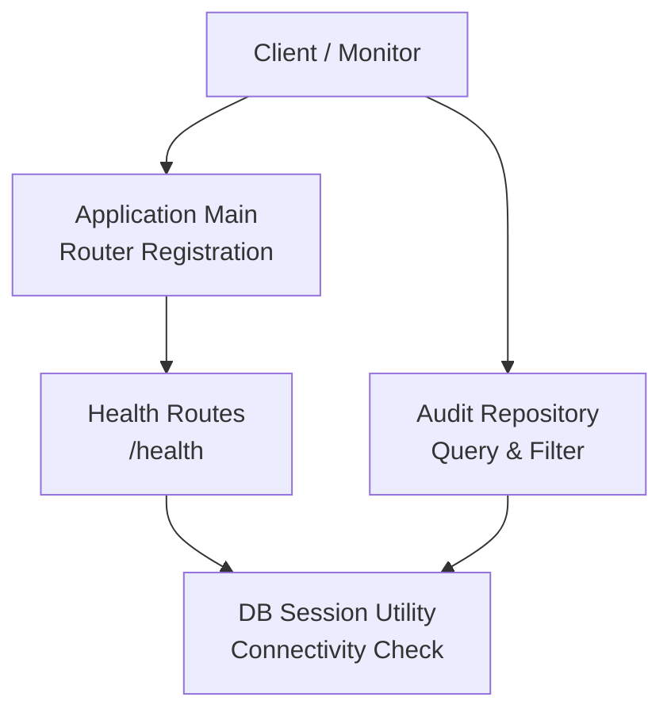
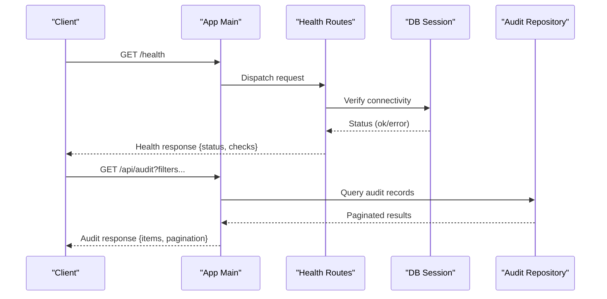
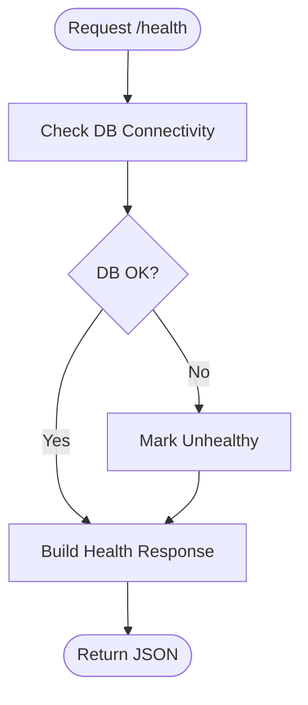
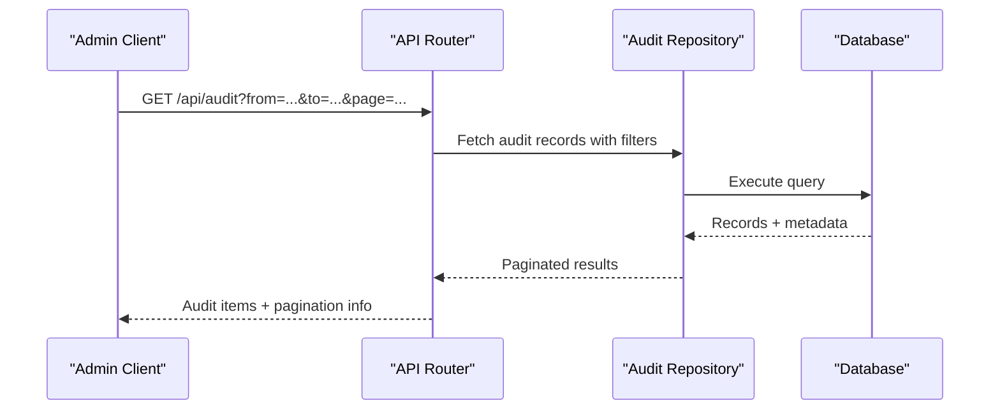
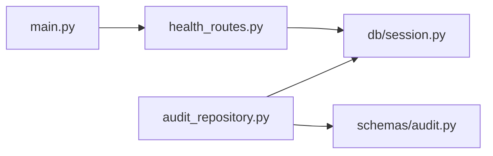

# System Monitoring & Health

<cite>
**Referenced Files in This Document**
- [health_routes.py](file://app/api/health_routes.py)
- [main.py](file://app/main.py)
- [session.py](file://app/db/session.py)
- [audit_repository.py](file://app/repositories/audit_repository.py)
- [audit.py](file://app/schemas/audit.py)
- [test_health.py](file://tests/test_health.py)
</cite>

## Table of Contents
1. [Introduction](#introduction)
2. [Project Structure](#project-structure)
3. [Core Components](#core-components)
4. [Architecture Overview](#architecture-overview)
5. [Detailed Component Analysis](#detailed-component-analysis)
6. [Dependency Analysis](#dependency-analysis)
7. [Performance Considerations](#performance-considerations)
8. [Troubleshooting Guide](#troubleshooting-guide)
9. [Conclusion](#conclusion)
10. [Appendices](#appendices)

## Introduction
This document describes the system monitoring and health capabilities exposed by the application, focusing on:
- Health endpoint for application status, database connectivity, and service dependencies
- Performance metrics collection and operational statistics
- Audit log retrieval endpoints for administrative oversight and compliance reporting
- System diagnostics and debugging information access
- Guidance for integrating with monitoring dashboards, alerting thresholds, and notification systems

The goal is to provide operators and administrators with a clear understanding of available endpoints, their behavior, and how to integrate them into production observability stacks.

## Project Structure
The monitoring and health features are implemented as API routes and supporting modules within the backend application. The primary entry points include:
- Health route definitions
- Application startup and router registration
- Database session utilities used for connectivity checks
- Audit repository and schemas for audit data retrieval

**Diagram sources**
- [main.py](file://app/main.py)
- [health_routes.py](file://app/api/health_routes.py)
- [session.py](file://app/db/session.py)
- [audit_repository.py](file://app/repositories/audit_repository.py)

**Section sources**
- [main.py](file://app/main.py)
- [health_routes.py](file://app/api/health_routes.py)
- [session.py](file://app/db/session.py)
- [audit_repository.py](file://app/repositories/audit_repository.py)

## Core Components
- Health endpoint: Provides liveness/readiness signals, including database connectivity verification and dependency status.
- Database connectivity check: Uses the database session layer to validate reachability and basic operations.
- Audit retrieval: Exposes endpoints backed by an audit repository and schemas for filtering and returning audit records.
- Operational statistics: Aggregates counts and statuses from core repositories to inform dashboards and alerts.

These components are wired into the application’s router during startup and can be consumed by external monitoring tools or internal dashboards.

**Section sources**
- [health_routes.py](file://app/api/health_routes.py)
- [session.py](file://app/db/session.py)
- [audit_repository.py](file://app/repositories/audit_repository.py)
- [audit.py](file://app/schemas/audit.py)

## Architecture Overview
The monitoring architecture centers around lightweight HTTP endpoints that query internal services and persistence layers. The health endpoint performs minimal work to avoid impacting availability, while audit endpoints provide filtered access to historical events for compliance and troubleshooting.

**Diagram sources**
- [main.py](file://app/main.py)
- [health_routes.py](file://app/api/health_routes.py)
- [session.py](file://app/db/session.py)
- [audit_repository.py](file://app/repositories/audit_repository.py)

## Detailed Component Analysis

### Health Endpoint
Purpose:
- Provide a single endpoint to verify application liveness and readiness.
- Include database connectivity status and other critical dependency checks.
- Return structured responses suitable for probes and dashboards.

Behavior:
- On request, the handler invokes database connectivity checks via the session utility.
- Returns a status object indicating overall health and per-check details.
- Designed to be fast and idempotent; avoids heavy computations.

Operational guidance:
- Use this endpoint for liveness probes at the orchestrator level.
- For readiness, ensure all required dependencies report ok before marking ready.

**Section sources**
- [health_routes.py](file://app/api/health_routes.py)
- [session.py](file://app/db/session.py)
- [test_health.py](file://tests/test_health.py)

#### Health Flow

**Diagram sources**
- [health_routes.py](file://app/api/health_routes.py)
- [session.py](file://app/db/session.py)

### Database Connectivity Check
Purpose:
- Validate that the database is reachable and responsive.
- Surface errors early to prevent serving requests when the datastore is unavailable.

Implementation notes:
- Uses the database session layer to perform a lightweight operation.
- Errors are captured and reflected in the health response without crashing the process.

**Section sources**
- [session.py](file://app/db/session.py)
- [health_routes.py](file://app/api/health_routes.py)

### Audit Log Retrieval
Purpose:
- Provide administrative access to audit logs for oversight and compliance reporting.
- Support filtering and pagination to enable efficient querying.

Key aspects:
- Backed by an audit repository that abstracts persistence queries.
- Schemas define the shape of audit records returned to clients.
- Intended for authenticated administrative consumers.

Operational guidance:
- Apply time-range filters to reduce payload size.
- Use pagination for large datasets.
- Combine with downstream SIEM or logging pipelines for long-term retention.

**Section sources**
- [audit_repository.py](file://app/repositories/audit_repository.py)
- [audit.py](file://app/schemas/audit.py)

#### Audit Retrieval Flow

**Diagram sources**
- [audit_repository.py](file://app/repositories/audit_repository.py)
- [audit.py](file://app/schemas/audit.py)

### Operational Statistics
Purpose:
- Provide counts and statuses useful for dashboards and alerting.
- Examples include total runs, pending approvals, and recent activity volumes.

Integration tips:
- Aggregate these statistics periodically for trend analysis.
- Use them to drive threshold-based alerts (e.g., high pending actions).

[No sources needed since this section provides general guidance]

## Dependency Analysis
The monitoring stack depends on:
- Application router wiring to expose endpoints
- Database session for connectivity validation
- Audit repository for data retrieval

**Diagram sources**
- [main.py](file://app/main.py)
- [health_routes.py](file://app/api/health_routes.py)
- [session.py](file://app/db/session.py)
- [audit_repository.py](file://app/repositories/audit_repository.py)
- [audit.py](file://app/schemas/audit.py)

**Section sources**
- [main.py](file://app/main.py)
- [health_routes.py](file://app/api/health_routes.py)
- [session.py](file://app/db/session.py)
- [audit_repository.py](file://app/repositories/audit_repository.py)
- [audit.py](file://app/schemas/audit.py)

## Performance Considerations
- Keep health checks lightweight to minimize overhead and avoid false negatives.
- Prefer read-only, low-latency queries for audit retrieval; apply filters and pagination.
- Cache frequently accessed operational statistics if appropriate, with invalidation strategies tied to state changes.
- Avoid synchronous blocking calls in health handlers; use timeouts and circuit breakers where applicable.

[No sources needed since this section provides general guidance]

## Troubleshooting Guide
Common issues and resolutions:
- Health endpoint reports unhealthy due to database errors:
  - Verify database credentials, network reachability, and connection limits.
  - Inspect error messages in the health response for specifics.
- Audit retrieval returns empty or partial results:
  - Confirm filter parameters (time ranges, scopes) are correct.
  - Ensure pagination parameters are set appropriately for large datasets.
- High latency on audit queries:
  - Add or refine indexes based on filter fields.
  - Reduce result sets using stricter filters and smaller page sizes.

**Section sources**
- [health_routes.py](file://app/api/health_routes.py)
- [audit_repository.py](file://app/repositories/audit_repository.py)

## Conclusion
The application exposes essential monitoring and observability endpoints:
- A concise health endpoint for liveness/readiness and dependency checks
- Audit retrieval for compliance and troubleshooting
- Operational statistics to support dashboards and alerting

Adopting the recommended integration patterns will help maintain system reliability, accelerate incident response, and satisfy compliance requirements.

[No sources needed since this section summarizes without analyzing specific files]

## Appendices

### Integration with Monitoring Dashboards
- Poll the health endpoint at regular intervals to compute uptime and failure rates.
- Visualize audit trends over time using time-bucketed queries.
- Correlate operational statistics with resource utilization metrics from your platform.

[No sources needed since this section provides general guidance]

### Alerting Thresholds and Notifications
- Define thresholds for:
  - Health failures (immediate alert)
  - Elevated audit event volumes (investigation trigger)
  - Stagnant operational statistics (process stall detection)
- Route alerts to notification channels (email, chat, paging) based on severity.

[No sources needed since this section provides general guidance]