# User Administration

<cite>
**Referenced Files in This Document**
- [app/api/auth_routes.py](file://app/api/auth_routes.py)
- [app/api/nucleus_routes.py](file://app/api/nucleus_routes.py)
- [app/adapters/user/provider.py](file://app/adapters/user/provider.py)
- [app/adapters/user/contract.py](file://app/adapters/user/contract.py)
- [app/repositories/nucleus_user_repository.py](file://app/repositories/nucleus_user_repository.py)
- [app/repositories/seat_repository.py](file://app/repositories/seat_repository.py)
- [app/schemas/user.py](file://app/schemas/user.py)
- [app/schemas/seat.py](file://app/schemas/seat.py)
- [app/db/nucleus_models.py](file://app/db/nucleus_models.py)
- [app/db/nucleus_admin_models.py](file://app/db/nucleus_admin_models.py)
- [app/core/security.py](file://app/core/security.py)
- [app/permissions/permission_service.py](file://app/permissions/permission_service.py)
- [app/repositories/audit_repository.py](file://app/repositories/audit_repository.py)
- [app/schemas/audit.py](file://app/schemas/audit.py)
- [app/repositories/session_repository.py](file://app/repositories/session_repository.py)
- [app/db/nucleus_user_session.py](file://app/db/nucleus_user_session.py)
- [app/domain/enums.py](file://app/domain/enums.py)
- [app/domain/models.py](file://app/domain/models.py)
- [app/services/nucleus_organization_service.py](file://app/services/nucleus_organization_service.py)
- [app/repositories/nucleus_organization_repository.py](file://app/repositories/nucleus_organization_repository.py)
- [tests/test_users_seats.py](file://tests/test_users_seats.py)
- [tests/test_permissions.py](file://tests/test_permissions.py)
- [tests/test_nucleus_admin_control.py](file://tests/test_nucleus_admin_control.py)
</cite>

## Table of Contents
1. [Introduction](#introduction)
2. [Project Structure](#project-structure)
3. [Core Components](#core-components)
4. [Architecture Overview](#architecture-overview)
5. [Detailed Component Analysis](#detailed-component-analysis)
6. [Dependency Analysis](#dependency-analysis)
7. [Performance Considerations](#performance-considerations)
8. [Troubleshooting Guide](#troubleshooting-guide)
9. [Conclusion](#conclusion)
10. [Appendices](#appendices)

## Introduction
This document provides comprehensive user administration API documentation for managing users within organizations. It covers the full user lifecycle (creation, modification, deletion), role-based access control (RBAC), seat management for license allocation and capacity planning, permission assignment, role hierarchy management, access policy enforcement, search and filtering, bulk operations, audit logging, session management, authentication integration, and security considerations for administrative operations.

The system is organized around a clear separation between API routes, adapters to external identity providers, repositories for persistence, domain models, schemas for validation, and services for orchestration. RBAC and policies are enforced at the service layer with audit trails recorded for all user changes.

## Project Structure
User administration spans multiple layers:
- API routes expose endpoints for user and seat management under organization-scoped paths.
- Adapters abstract interactions with external user directories and identity providers.
- Repositories implement data access for users, seats, sessions, and audit events.
- Domain models define core entities such as User, Seat, Role, Permission, Organization, and Session.
- Schemas validate request/response payloads.
- Services coordinate business logic, enforce permissions, and emit audit events.
- Security utilities handle token verification and authorization checks.

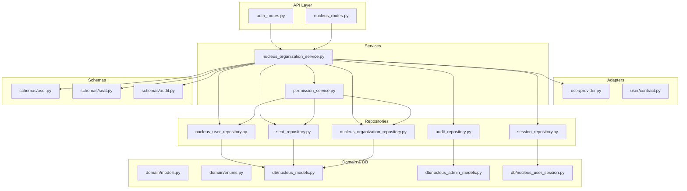

**Diagram sources**
- [app/api/auth_routes.py](file://app/api/auth_routes.py)
- [app/api/nucleus_routes.py](file://app/api/nucleus_routes.py)
- [app/adapters/user/provider.py](file://app/adapters/user/provider.py)
- [app/adapters/user/contract.py](file://app/adapters/user/contract.py)
- [app/services/nucleus_organization_service.py](file://app/services/nucleus_organization_service.py)
- [app/permissions/permission_service.py](file://app/permissions/permission_service.py)
- [app/repositories/nucleus_user_repository.py](file://app/repositories/nucleus_user_repository.py)
- [app/repositories/seat_repository.py](file://app/repositories/seat_repository.py)
- [app/repositories/nucleus_organization_repository.py](file://app/repositories/nucleus_organization_repository.py)
- [app/repositories/audit_repository.py](file://app/repositories/audit_repository.py)
- [app/repositories/session_repository.py](file://app/repositories/session_repository.py)
- [app/domain/models.py](file://app/domain/models.py)
- [app/domain/enums.py](file://app/domain/enums.py)
- [app/db/nucleus_models.py](file://app/db/nucleus_models.py)
- [app/db/nucleus_admin_models.py](file://app/db/nucleus_admin_models.py)
- [app/db/nucleus_user_session.py](file://app/db/nucleus_user_session.py)
- [app/schemas/user.py](file://app/schemas/user.py)
- [app/schemas/seat.py](file://app/schemas/seat.py)
- [app/schemas/audit.py](file://app/schemas/audit.py)

**Section sources**
- [app/api/auth_routes.py](file://app/api/auth_routes.py)
- [app/api/nucleus_routes.py](file://app/api/nucleus_routes.py)
- [app/adapters/user/provider.py](file://app/adapters/user/provider.py)
- [app/adapters/user/contract.py](file://app/adapters/user/contract.py)
- [app/services/nucleus_organization_service.py](file://app/services/nucleus_organization_service.py)
- [app/permissions/permission_service.py](file://app/permissions/permission_service.py)
- [app/repositories/nucleus_user_repository.py](file://app/repositories/nucleus_user_repository.py)
- [app/repositories/seat_repository.py](file://app/repositories/seat_repository.py)
- [app/repositories/nucleus_organization_repository.py](file://app/repositories/nucleus_organization_repository.py)
- [app/repositories/audit_repository.py](file://app/repositories/audit_repository.py)
- [app/repositories/session_repository.py](file://app/repositories/session_repository.py)
- [app/domain/models.py](file://app/domain/models.py)
- [app/domain/enums.py](file://app/domain/enums.py)
- [app/db/nucleus_models.py](file://app/db/nucleus_models.py)
- [app/db/nucleus_admin_models.py](file://app/db/nucleus_admin_models.py)
- [app/db/nucleus_user_session.py](file://app/db/nucleus_user_session.py)
- [app/schemas/user.py](file://app/schemas/user.py)
- [app/schemas/seat.py](file://app/schemas/seat.py)
- [app/schemas/audit.py](file://app/schemas/audit.py)

## Core Components
- Authentication and Authorization
  - Token verification and current-user resolution are provided by security utilities.
  - Route-level guards ensure only authenticated administrators can access admin endpoints.
- User Directory Adapter
  - Abstracts external user store interactions via a contract and provider implementation.
- User Repository
  - Persists and queries users, roles, and memberships within an organization context.
- Seat Repository
  - Manages license seats per organization, including allocation, assignment, and capacity tracking.
- Permission Service
  - Enforces RBAC and policy decisions based on roles and permissions.
- Audit Repository and Schema
  - Records immutable audit events for user and seat changes.
- Session Repository and Model
  - Tracks active sessions for users and supports logout and revocation.
- Schemas
  - Validate requests and responses for users, seats, and audit events.

**Section sources**
- [app/core/security.py](file://app/core/security.py)
- [app/adapters/user/contract.py](file://app/adapters/user/contract.py)
- [app/adapters/user/provider.py](file://app/adapters/user/provider.py)
- [app/repositories/nucleus_user_repository.py](file://app/repositories/nucleus_user_repository.py)
- [app/repositories/seat_repository.py](file://app/repositories/seat_repository.py)
- [app/permissions/permission_service.py](file://app/permissions/permission_service.py)
- [app/repositories/audit_repository.py](file://app/repositories/audit_repository.py)
- [app/schemas/audit.py](file://app/schemas/audit.py)
- [app/repositories/session_repository.py](file://app/repositories/session_repository.py)
- [app/db/nucleus_user_session.py](file://app/db/nucleus_user_session.py)
- [app/schemas/user.py](file://app/schemas/user.py)
- [app/schemas/seat.py](file://app/schemas/seat.py)

## Architecture Overview
The user administration architecture follows a layered design:
- API routes accept requests scoped to an organization.
- Services orchestrate business logic, enforce RBAC, and interact with repositories.
- Repositories persist data to database models.
- Adapters integrate with external user directories.
- Audit events are emitted for all user and seat mutations.

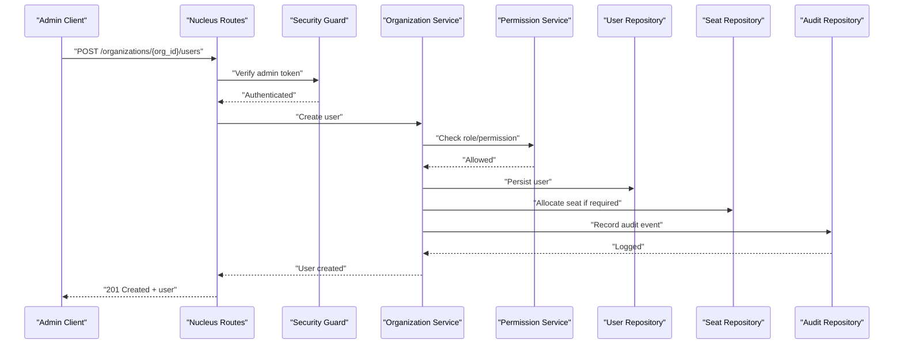

**Diagram sources**
- [app/api/nucleus_routes.py](file://app/api/nucleus_routes.py)
- [app/core/security.py](file://app/core/security.py)
- [app/services/nucleus_organization_service.py](file://app/services/nucleus_organization_service.py)
- [app/permissions/permission_service.py](file://app/permissions/permission_service.py)
- [app/repositories/nucleus_user_repository.py](file://app/repositories/nucleus_user_repository.py)
- [app/repositories/seat_repository.py](file://app/repositories/seat_repository.py)
- [app/repositories/audit_repository.py](file://app/repositories/audit_repository.py)

## Detailed Component Analysis

### User Lifecycle Management
Endpoints for creating, updating, and deleting users within an organization.

- Create User
  - Validates payload using user schema.
  - Checks admin privileges and seat availability.
  - Persists user and emits audit event.
- Update User
  - Supports modifying profile attributes, roles, and membership status.
  - Enforces RBAC and records audit event.
- Delete User
  - Removes user from organization; may require seat release.
  - Emits audit event.

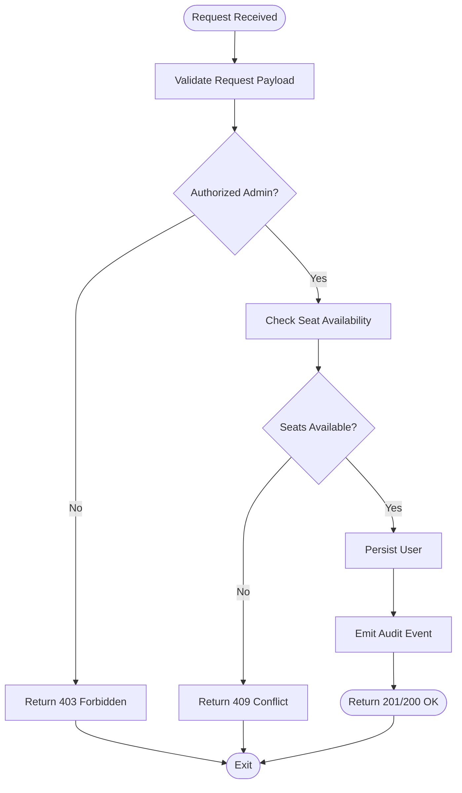

**Diagram sources**
- [app/api/nucleus_routes.py](file://app/api/nucleus_routes.py)
- [app/core/security.py](file://app/core/security.py)
- [app/services/nucleus_organization_service.py](file://app/services/nucleus_organization_service.py)
- [app/permissions/permission_service.py](file://app/permissions/permission_service.py)
- [app/repositories/nucleus_user_repository.py](file://app/repositories/nucleus_user_repository.py)
- [app/repositories/seat_repository.py](file://app/repositories/seat_repository.py)
- [app/repositories/audit_repository.py](file://app/repositories/audit_repository.py)

**Section sources**
- [app/api/nucleus_routes.py](file://app/api/nucleus_routes.py)
- [app/schemas/user.py](file://app/schemas/user.py)
- [app/repositories/nucleus_user_repository.py](file://app/repositories/nucleus_user_repository.py)
- [app/repositories/seat_repository.py](file://app/repositories/seat_repository.py)
- [app/repositories/audit_repository.py](file://app/repositories/audit_repository.py)
- [tests/test_users_seats.py](file://tests/test_users_seats.py)

### Seat Management and Capacity Planning
Seat APIs manage licenses per organization, enabling allocation, assignment, and capacity monitoring.

- Allocate Seats
  - Increases available seats for an organization.
  - Requires admin privileges.
- Assign Seat to User
  - Links a seat to a specific user within the organization.
  - Ensures user exists and has not exceeded limits.
- Release Seat
  - Frees a seat when a user is deactivated or removed.
- Query Capacity
  - Returns total, allocated, and available seats.

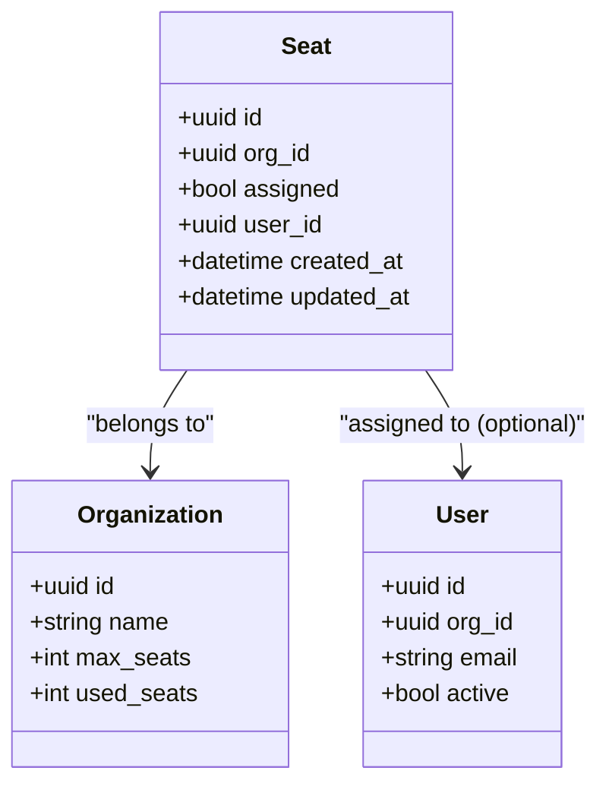

**Diagram sources**
- [app/db/nucleus_models.py](file://app/db/nucleus_models.py)
- [app/schemas/seat.py](file://app/schemas/seat.py)

**Section sources**
- [app/api/nucleus_routes.py](file://app/api/nucleus_routes.py)
- [app/repositories/seat_repository.py](file://app/repositories/seat_repository.py)
- [app/schemas/seat.py](file://app/schemas/seat.py)
- [app/repositories/nucleus_organization_repository.py](file://app/repositories/nucleus_organization_repository.py)
- [tests/test_users_seats.py](file://tests/test_users_seats.py)

### Permission Assignment and Role Hierarchy
Role-based access control governs who can perform administrative actions.

- Roles and Permissions
  - Roles encapsulate sets of permissions.
  - Users inherit permissions through their assigned roles.
- Role Hierarchy
  - Higher-level roles include lower-level permissions.
- Policy Enforcement
  - Permission service evaluates policies before executing mutations.

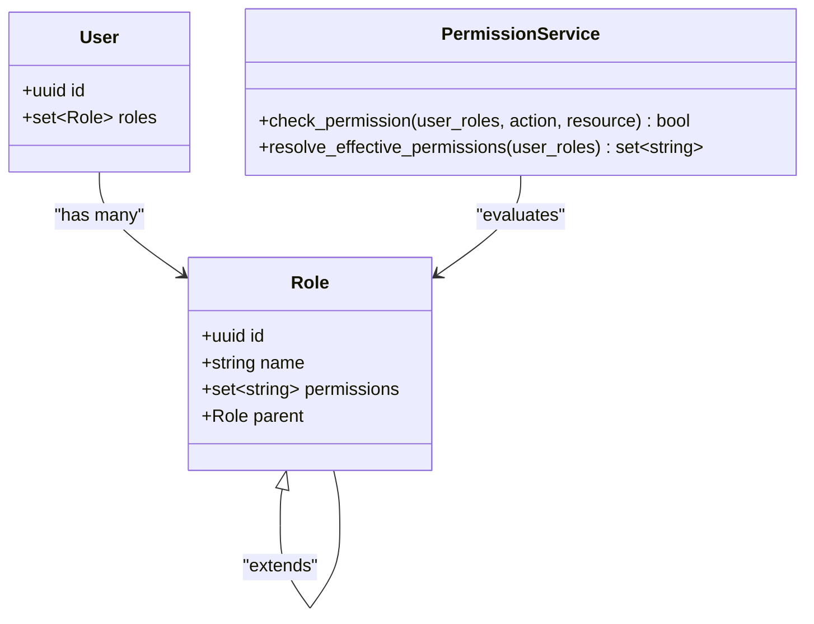

**Diagram sources**
- [app/permissions/permission_service.py](file://app/permissions/permission_service.py)
- [app/domain/enums.py](file://app/domain/enums.py)
- [app/domain/models.py](file://app/domain/models.py)

**Section sources**
- [app/permissions/permission_service.py](file://app/permissions/permission_service.py)
- [app/domain/enums.py](file://app/domain/enums.py)
- [app/domain/models.py](file://app/domain/models.py)
- [tests/test_permissions.py](file://tests/test_permissions.py)

### Access Policy Enforcement
Access policies determine whether an operation is allowed based on context (organization, actor, resource).

- Policy Evaluation
  - Combines RBAC with contextual constraints (e.g., org boundaries).
- Decision Flow
  - If any policy denies, the request is rejected.
- Audit Trail
  - All policy decisions are logged for compliance.

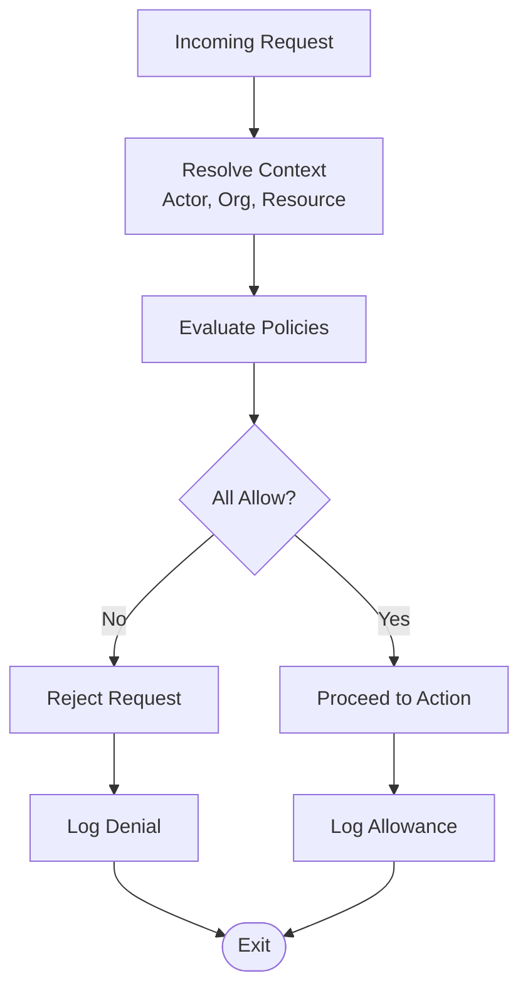

**Diagram sources**
- [app/permissions/permission_service.py](file://app/permissions/permission_service.py)
- [app/repositories/audit_repository.py](file://app/repositories/audit_repository.py)

**Section sources**
- [app/permissions/permission_service.py](file://app/permissions/permission_service.py)
- [app/repositories/audit_repository.py](file://app/repositories/audit_repository.py)

### User Search and Filtering
Search endpoints allow listing and filtering users within an organization.

- Filters
  - Name/email substring match.
  - Role membership.
  - Active/inactive status.
  - Seat assignment status.
- Pagination
  - Supports page size and cursor-based pagination.

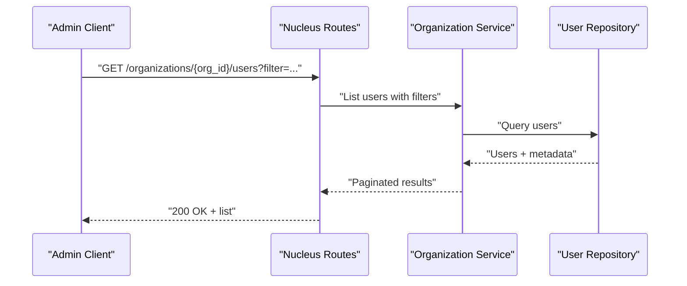

**Diagram sources**
- [app/api/nucleus_routes.py](file://app/api/nucleus_routes.py)
- [app/services/nucleus_organization_service.py](file://app/services/nucleus_organization_service.py)
- [app/repositories/nucleus_user_repository.py](file://app/repositories/nucleus_user_repository.py)

**Section sources**
- [app/api/nucleus_routes.py](file://app/api/nucleus_routes.py)
- [app/repositories/nucleus_user_repository.py](file://app/repositories/nucleus_user_repository.py)

### Bulk Operations
Bulk endpoints support batch creation, updates, and deletions.

- Bulk Create Users
  - Validates each entry and enforces seat capacity.
  - Partial failures return detailed errors without rolling back successful entries.
- Bulk Update Attributes
  - Applies attribute changes across selected users.
- Bulk Delete Users
  - Removes users and releases associated seats.

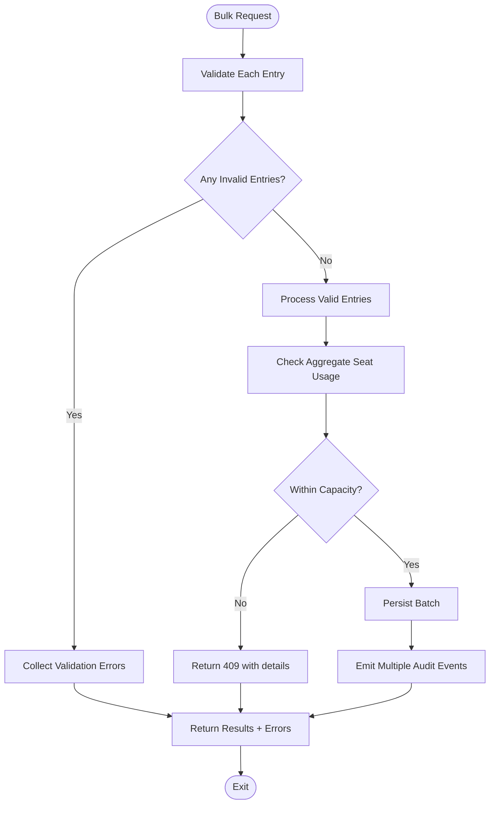

**Diagram sources**
- [app/api/nucleus_routes.py](file://app/api/nucleus_routes.py)
- [app/services/nucleus_organization_service.py](file://app/services/nucleus_organization_service.py)
- [app/repositories/nucleus_user_repository.py](file://app/repositories/nucleus_user_repository.py)
- [app/repositories/seat_repository.py](file://app/repositories/seat_repository.py)
- [app/repositories/audit_repository.py](file://app/repositories/audit_repository.py)

**Section sources**
- [app/api/nucleus_routes.py](file://app/api/nucleus_routes.py)
- [app/services/nucleus_organization_service.py](file://app/services/nucleus_organization_service.py)
- [app/repositories/nucleus_user_repository.py](file://app/repositories/nucleus_user_repository.py)
- [app/repositories/seat_repository.py](file://app/repositories/seat_repository.py)
- [app/repositories/audit_repository.py](file://app/repositories/audit_repository.py)

### Audit Logging for User Changes
All user and seat mutations are recorded as immutable audit events.

- Event Types
  - User created, updated, deleted.
  - Seat allocated, assigned, released.
- Fields
  - Actor, target entity, change details, timestamp, organization context.
- Querying
  - Filter by entity type, actor, time range, and organization.

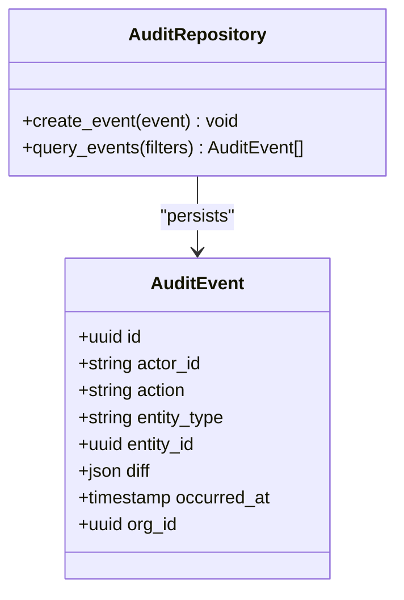

**Diagram sources**
- [app/repositories/audit_repository.py](file://app/repositories/audit_repository.py)
- [app/schemas/audit.py](file://app/schemas/audit.py)
- [app/db/nucleus_admin_models.py](file://app/db/nucleus_admin_models.py)

**Section sources**
- [app/repositories/audit_repository.py](file://app/repositories/audit_repository.py)
- [app/schemas/audit.py](file://app/schemas/audit.py)
- [app/db/nucleus_admin_models.py](file://app/db/nucleus_admin_models.py)

### Session Management
Session APIs track active sessions and support logout and revocation.

- Create Session
  - Issued upon successful authentication.
- Revoke Session
  - Invalidates a session immediately.
- List Sessions
  - Shows active sessions for auditing and management.

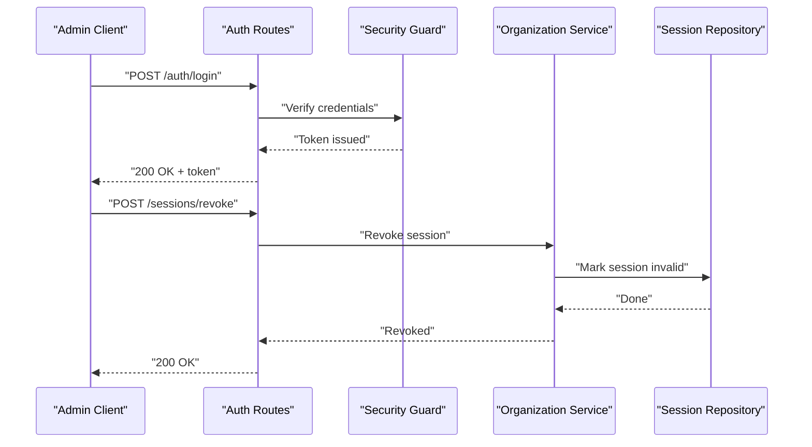

**Diagram sources**
- [app/api/auth_routes.py](file://app/api/auth_routes.py)
- [app/core/security.py](file://app/core/security.py)
- [app/repositories/session_repository.py](file://app/repositories/session_repository.py)
- [app/db/nucleus_user_session.py](file://app/db/nucleus_user_session.py)

**Section sources**
- [app/api/auth_routes.py](file://app/api/auth_routes.py)
- [app/core/security.py](file://app/core/security.py)
- [app/repositories/session_repository.py](file://app/repositories/session_repository.py)
- [app/db/nucleus_user_session.py](file://app/db/nucleus_user_session.py)

### Authentication Integration
Authentication integrates with external identity providers via the user adapter contract.

- Login Flow
  - Credentials validated against external provider.
  - Token issued for subsequent API calls.
- Token Verification
  - Security guard validates tokens and resolves current user.

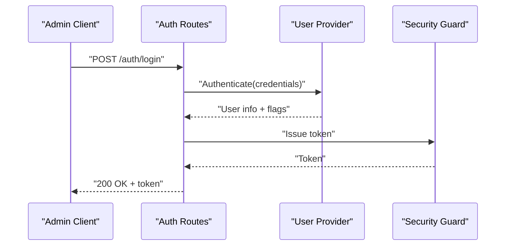

**Diagram sources**
- [app/api/auth_routes.py](file://app/api/auth_routes.py)
- [app/adapters/user/provider.py](file://app/adapters/user/provider.py)
- [app/adapters/user/contract.py](file://app/adapters/user/contract.py)
- [app/core/security.py](file://app/core/security.py)

**Section sources**
- [app/api/auth_routes.py](file://app/api/auth_routes.py)
- [app/adapters/user/provider.py](file://app/adapters/user/provider.py)
- [app/adapters/user/contract.py](file://app/adapters/user/contract.py)
- [app/core/security.py](file://app/core/security.py)

### Security Considerations for Administrative Operations
- Least Privilege
  - Only users with explicit admin roles can perform user and seat mutations.
- Input Validation
  - Strict schema validation prevents malformed or malicious inputs.
- Rate Limiting and Throttling
  - Protect endpoints from abuse and brute-force attempts.
- Secure Tokens
  - Short-lived tokens with refresh mechanisms; verify signatures and expiry.
- Auditability
  - Immutable logs capture all administrative actions for compliance.

[No sources needed since this section provides general guidance]

## Dependency Analysis
The following diagram shows key dependencies among components involved in user administration.

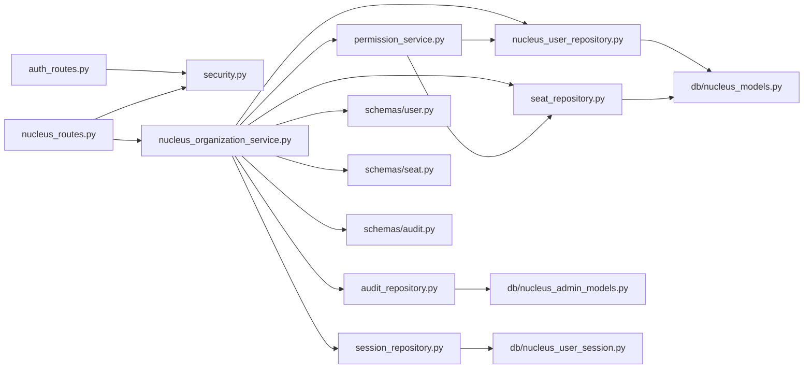

**Diagram sources**
- [app/api/auth_routes.py](file://app/api/auth_routes.py)
- [app/api/nucleus_routes.py](file://app/api/nucleus_routes.py)
- [app/core/security.py](file://app/core/security.py)
- [app/services/nucleus_organization_service.py](file://app/services/nucleus_organization_service.py)
- [app/permissions/permission_service.py](file://app/permissions/permission_service.py)
- [app/repositories/nucleus_user_repository.py](file://app/repositories/nucleus_user_repository.py)
- [app/repositories/seat_repository.py](file://app/repositories/seat_repository.py)
- [app/repositories/audit_repository.py](file://app/repositories/audit_repository.py)
- [app/repositories/session_repository.py](file://app/repositories/session_repository.py)
- [app/db/nucleus_models.py](file://app/db/nucleus_models.py)
- [app/db/nucleus_admin_models.py](file://app/db/nucleus_admin_models.py)
- [app/db/nucleus_user_session.py](file://app/db/nucleus_user_session.py)
- [app/schemas/user.py](file://app/schemas/user.py)
- [app/schemas/seat.py](file://app/schemas/seat.py)
- [app/schemas/audit.py](file://app/schemas/audit.py)

**Section sources**
- [app/api/auth_routes.py](file://app/api/auth_routes.py)
- [app/api/nucleus_routes.py](file://app/api/nucleus_routes.py)
- [app/core/security.py](file://app/core/security.py)
- [app/services/nucleus_organization_service.py](file://app/services/nucleus_organization_service.py)
- [app/permissions/permission_service.py](file://app/permissions/permission_service.py)
- [app/repositories/nucleus_user_repository.py](file://app/repositories/nucleus_user_repository.py)
- [app/repositories/seat_repository.py](file://app/repositories/seat_repository.py)
- [app/repositories/audit_repository.py](file://app/repositories/audit_repository.py)
- [app/repositories/session_repository.py](file://app/repositories/session_repository.py)
- [app/db/nucleus_models.py](file://app/db/nucleus_models.py)
- [app/db/nucleus_admin_models.py](file://app/db/nucleus_admin_models.py)
- [app/db/nucleus_user_session.py](file://app/db/nucleus_user_session.py)
- [app/schemas/user.py](file://app/schemas/user.py)
- [app/schemas/seat.py](file://app/schemas/seat.py)
- [app/schemas/audit.py](file://app/schemas/audit.py)

## Performance Considerations
- Indexing
  - Ensure indexes on frequently filtered fields (email, org_id, role membership).
- Pagination
  - Use cursor-based pagination for large user lists to avoid deep offset scans.
- Caching
  - Cache role-permission mappings and seat capacity summaries where appropriate.
- Batching
  - Prefer bulk operations to reduce round trips and transaction overhead.
- Concurrency
  - Apply optimistic locking or row-level locks for seat allocation to prevent overcommitment.

[No sources needed since this section provides general guidance]

## Troubleshooting Guide
Common issues and resolutions:
- Unauthorized Access
  - Verify admin token validity and role assignments.
  - Check permission service decisions and policy outcomes.
- Seat Capacity Exceeded
  - Increase organization seat quota or release unused seats.
- Duplicate User Creation
  - Ensure unique constraints on email or username within organization scope.
- Audit Gaps
  - Confirm audit repository writes succeed and are committed.
- Session Revocation Failures
  - Validate session ID and ensure repository marks session as revoked.

**Section sources**
- [app/permissions/permission_service.py](file://app/permissions/permission_service.py)
- [app/repositories/seat_repository.py](file://app/repositories/seat_repository.py)
- [app/repositories/nucleus_user_repository.py](file://app/repositories/nucleus_user_repository.py)
- [app/repositories/audit_repository.py](file://app/repositories/audit_repository.py)
- [app/repositories/session_repository.py](file://app/repositories/session_repository.py)

## Conclusion
The user administration system provides robust capabilities for managing users and seats within organizations, backed by strong RBAC, policy enforcement, and comprehensive audit logging. The layered architecture ensures clear responsibilities, maintainability, and extensibility. By adhering to best practices in validation, concurrency, and performance, the system supports secure and efficient administrative operations.

[No sources needed since this section summarizes without analyzing specific files]

## Appendices

### API Endpoints Summary
- Authentication
  - POST /auth/login
- User Management
  - POST /organizations/{org_id}/users
  - PATCH /organizations/{org_id}/users/{user_id}
  - DELETE /organizations/{org_id}/users/{user_id}
  - GET /organizations/{org_id}/users
- Seat Management
  - POST /organizations/{org_id}/seats/allocate
  - POST /organizations/{org_id}/seats/assign
  - POST /organizations/{org_id}/seats/release
  - GET /organizations/{org_id}/seats/capacity
- Session Management
  - POST /sessions/revoke
  - GET /sessions/list

[No sources needed since this section provides general guidance]