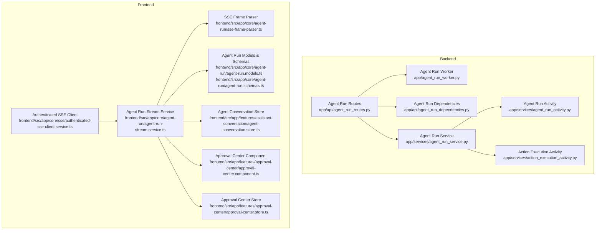
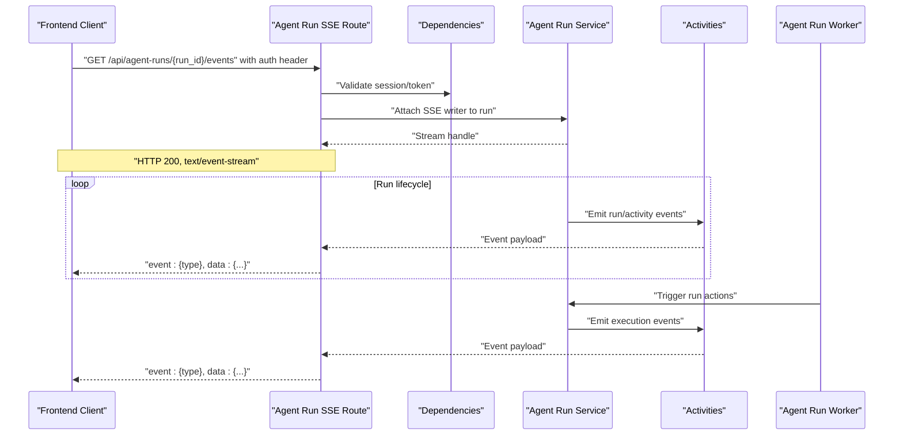
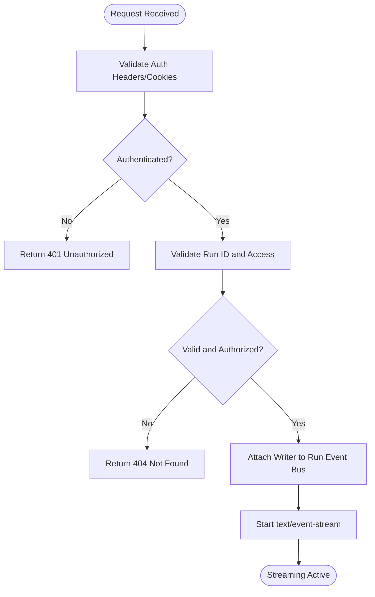
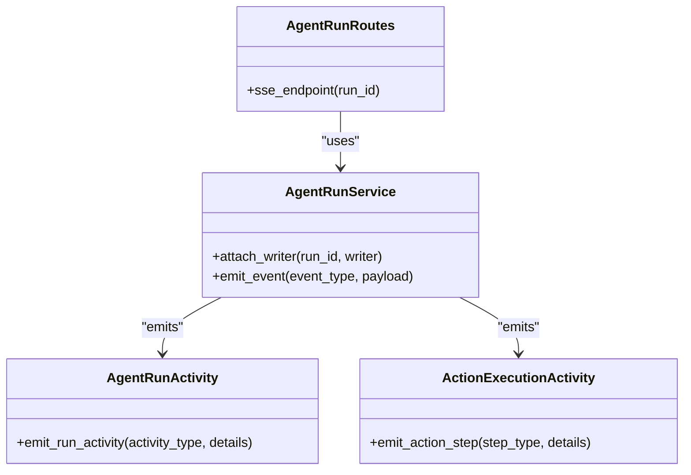
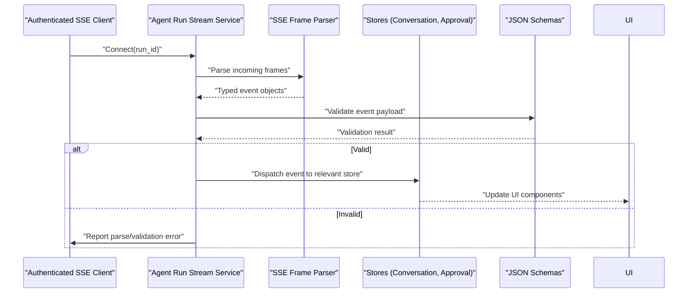
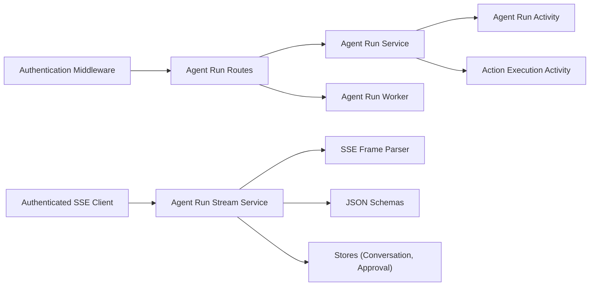

# Real-time SSE API

<cite>
**Referenced Files in This Document**
- [AGENT_RUNS_SSE.md](file://docs/AGENT_RUNS_SSE.md)
- [agent_run_worker.py](file://app/agent_run_worker.py)
- [agent_run_routes.py](file://app/api/agent_run_routes.py)
- [agent_run_dependencies.py](file://app/api/agent_run_dependencies.py)
- [agent_run_service.py](file://app/services/agent_run_service.py)
- [agent_run_activity.py](file://app/services/agent_run_activity.py)
- [action_execution_activity.py](file://app/services/action_execution_activity.py)
- [agent-run-stream.service.ts](file://frontend/src/app/core/agent-run/agent-run-stream.service.ts)
- [sse-frame-parser.ts](file://frontend/src/app/core/agent-run/sse-frame-parser.ts)
- [authenticated-sse-client.service.ts](file://frontend/src/app/core/sse/authenticated-sse-client.service.ts)
- [agent-run-event.schema.json](file://frontend/contracts/agent-run-event.schema.json)
- [ui-event.schema.json](file://frontend/contracts/ui-event.schema.json)
- [api-manifest.json](file://frontend/contracts/api-manifest.json)
- [agent-run.models.ts](file://frontend/src/app/core/agent-run/agent-run.models.ts)
- [agent-run.schemas.ts](file://frontend/src/app/core/agent-run/agent-run.schemas.ts)
- [agent-conversation.store.ts](file://frontend/src/app/features/assistant-conversation/agent-conversation.store.ts)
- [approval-center.component.ts](file://frontend/src/app/features/approval-center/approval-center.component.ts)
- [approval-center.store.ts](file://frontend/src/app/features/approval-center/approval-center.store.ts)
- [test_agent_runs.py](file://tests/test_agent_runs.py)
</cite>

## Table of Contents
1. [Introduction](#introduction)
2. [Project Structure](#project-structure)
3. [Core Components](#core-components)
4. [Architecture Overview](#architecture-overview)
5. [Detailed Component Analysis](#detailed-component-analysis)
6. [Dependency Analysis](#dependency-analysis)
7. [Performance Considerations](#performance-considerations)
8. [Troubleshooting Guide](#troubleshooting-guide)
9. [Conclusion](#conclusion)
10. [Appendices](#appendices)

## Introduction
This document describes the Server-Sent Events (SSE) API used for real-time communication between the backend and frontend. It covers connection establishment, authentication for SSE streams, automatic reconnection handling, event types, schemas, ordering guarantees, error handling strategies, client implementation examples, performance optimization tips, and debugging techniques. The goal is to provide a comprehensive reference for building robust real-time features such as agent run progress, UI updates, approval notifications, and system events.

## Project Structure
The SSE feature spans both backend and frontend:
- Backend exposes an SSE endpoint for agent runs and emits events via services and activity modules.
- Frontend implements an authenticated SSE client with frame parsing, schema validation, and stores that react to events.

**Diagram sources**
- [agent_run_worker.py](file://app/agent_run_worker.py)
- [agent_run_routes.py](file://app/api/agent_run_routes.py)
- [agent_run_dependencies.py](file://app/api/agent_run_dependencies.py)
- [agent_run_service.py](file://app/services/agent_run_service.py)
- [agent_run_activity.py](file://app/services/agent_run_activity.py)
- [action_execution_activity.py](file://app/services/action_execution_activity.py)
- [authenticated-sse-client.service.ts](file://frontend/src/app/core/sse/authenticated-sse-client.service.ts)
- [agent-run-stream.service.ts](file://frontend/src/app/core/agent-run/agent-run-stream.service.ts)
- [sse-frame-parser.ts](file://frontend/src/app/core/agent-run/sse-frame-parser.ts)
- [agent-run.models.ts](file://frontend/src/app/core/agent-run/agent-run.models.ts)
- [agent-run.schemas.ts](file://frontend/src/app/core/agent-run/agent-run.schemas.ts)
- [agent-conversation.store.ts](file://frontend/src/app/features/assistant-conversation/agent-conversation.store.ts)
- [approval-center.component.ts](file://frontend/src/app/features/approval-center/approval-center.component.ts)
- [approval-center.store.ts](file://frontend/src/app/features/approval-center/approval-center.store.ts)

**Section sources**
- [AGENT_RUNS_SSE.md](file://docs/AGENT_RUNS_SSE.md)
- [agent_run_worker.py](file://app/agent_run_worker.py)
- [agent_run_routes.py](file://app/api/agent_run_routes.py)
- [agent_run_dependencies.py](file://app/api/agent_run_dependencies.py)
- [agent_run_service.py](file://app/services/agent_run_service.py)
- [agent_run_activity.py](file://app/services/agent_run_activity.py)
- [action_execution_activity.py](file://app/services/action_execution_activity.py)
- [authenticated-sse-client.service.ts](file://frontend/src/app/core/sse/authenticated-sse-client.service.ts)
- [agent-run-stream.service.ts](file://frontend/src/app/core/agent-run/agent-run-stream.service.ts)
- [sse-frame-parser.ts](file://frontend/src/app/core/agent-run/sse-frame-parser.ts)
- [agent-run.models.ts](file://frontend/src/app/core/agent-run/agent-run.models.ts)
- [agent-run.schemas.ts](file://frontend/src/app/core/agent-run/agent-run.schemas.ts)
- [agent-conversation.store.ts](file://frontend/src/app/features/assistant-conversation/agent-conversation.store.ts)
- [approval-center.component.ts](file://frontend/src/app/features/approval-center/approval-center.component.ts)
- [approval-center.store.ts](file://frontend/src/app/features/approval-center/approval-center.store.ts)

## Core Components
- Agent Run SSE Endpoint: Exposes an SSE stream for a given agent run, authenticates the request, and attaches a writer to the run’s event bus.
- Agent Run Service: Orchestrates run lifecycle and publishes domain events into the streaming pipeline.
- Activities: Emit granular events for agent run activities and action execution steps.
- Authenticated SSE Client: Manages connection lifecycle, headers, reconnection, and backoff.
- Stream Service and Parser: Parse SSE frames, validate against JSON schemas, and dispatch typed events to stores.
- Stores and UI: React to events to update conversation state, approval center, and UI components.

Key responsibilities:
- Connection establishment and authentication
- Event emission and ordering
- Schema validation and type safety on the client
- Reconnection and resilience
- Error propagation and user feedback

**Section sources**
- [agent_run_routes.py](file://app/api/agent_run_routes.py)
- [agent_run_dependencies.py](file://app/api/agent_run_dependencies.py)
- [agent_run_service.py](file://app/services/agent_run_service.py)
- [agent_run_activity.py](file://app/services/agent_run_activity.py)
- [action_execution_activity.py](file://app/services/action_execution_activity.py)
- [authenticated-sse-client.service.ts](file://frontend/src/app/core/sse/authenticated-sse-client.service.ts)
- [agent-run-stream.service.ts](file://frontend/src/app/core/agent-run/agent-run-stream.service.ts)
- [sse-frame-parser.ts](file://frontend/src/app/core/agent-run/sse-frame-parser.ts)
- [agent-run.models.ts](file://frontend/src/app/core/agent-run/agent-run.models.ts)
- [agent-run.schemas.ts](file://frontend/src/app/core/agent-run/agent-run.schemas.ts)
- [agent-conversation.store.ts](file://frontend/src/app/features/assistant-conversation/agent-conversation.store.ts)
- [approval-center.component.ts](file://frontend/src/app/features/approval-center/approval-center.component.ts)
- [approval-center.store.ts](file://frontend/src/app/features/approval-center/approval-center.store.ts)

## Architecture Overview
The SSE architecture connects the backend worker and routes to the frontend client through a persistent HTTP stream. Authentication is enforced at the route level, and events are emitted by services and activities. The frontend parses frames, validates payloads, and updates application state.

**Diagram sources**
- [agent_run_routes.py](file://app/api/agent_run_routes.py)
- [agent_run_dependencies.py](file://app/api/agent_run_dependencies.py)
- [agent_run_service.py](file://app/services/agent_run_service.py)
- [agent_run_activity.py](file://app/services/agent_run_activity.py)
- [action_execution_activity.py](file://app/services/action_execution_activity.py)
- [agent_run_worker.py](file://app/agent_run_worker.py)

## Detailed Component Analysis

### SSE Endpoint and Authentication
- The SSE endpoint accepts a run identifier and requires authentication via standard headers or cookies.
- On successful authentication, the route attaches a writer to the run’s event bus and returns a streaming response.
- Errors during authentication or invalid run IDs result in non-streaming responses with appropriate status codes.

**Diagram sources**
- [agent_run_routes.py](file://app/api/agent_run_routes.py)
- [agent_run_dependencies.py](file://app/api/agent_run_dependencies.py)

**Section sources**
- [agent_run_routes.py](file://app/api/agent_run_routes.py)
- [agent_run_dependencies.py](file://app/api/agent_run_dependencies.py)

### Event Emission Pipeline
- Services orchestrate run logic and emit high-level events (e.g., run created, updated, completed).
- Activities emit fine-grained events for UI updates and execution steps.
- The route forwards these events to connected clients in order.

**Diagram sources**
- [agent_run_service.py](file://app/services/agent_run_service.py)
- [agent_run_activity.py](file://app/services/agent_run_activity.py)
- [action_execution_activity.py](file://app/services/action_execution_activity.py)
- [agent_run_routes.py](file://app/api/agent_run_routes.py)

**Section sources**
- [agent_run_service.py](file://app/services/agent_run_service.py)
- [agent_run_activity.py](file://app/services/agent_run_activity.py)
- [action_execution_activity.py](file://app/services/action_execution_activity.py)

### Frontend SSE Client and Parser
- Authenticated SSE Client manages connection setup, headers, reconnection, and exponential backoff.
- Stream Service subscribes to the SSE endpoint, delegates frame parsing, and dispatches typed events.
- Frame Parser splits raw SSE frames into structured messages and extracts event names and data.
- Models and Schemas define event shapes and perform runtime validation.

**Diagram sources**
- [authenticated-sse-client.service.ts](file://frontend/src/app/core/sse/authenticated-sse-client.service.ts)
- [agent-run-stream.service.ts](file://frontend/src/app/core/agent-run/agent-run-stream.service.ts)
- [sse-frame-parser.ts](file://frontend/src/app/core/agent-run/sse-frame-parser.ts)
- [agent-run.models.ts](file://frontend/src/app/core/agent-run/agent-run.models.ts)
- [agent-run.schemas.ts](file://frontend/src/app/core/agent-run/agent-run.schemas.ts)
- [agent-conversation.store.ts](file://frontend/src/app/features/assistant-conversation/agent-conversation.store.ts)
- [approval-center.store.ts](file://frontend/src/app/features/approval-center/approval-center.store.ts)

**Section sources**
- [authenticated-sse-client.service.ts](file://frontend/src/app/core/sse/authenticated-sse-client.service.ts)
- [agent-run-stream.service.ts](file://frontend/src/app/core/agent-run/agent-run-stream.service.ts)
- [sse-frame-parser.ts](file://frontend/src/app/core/agent-run/sse-frame-parser.ts)
- [agent-run.models.ts](file://frontend/src/app/core/agent-run/agent-run.models.ts)
- [agent-run.schemas.ts](file://frontend/src/app/core/agent-run/agent-run.schemas.ts)
- [agent-conversation.store.ts](file://frontend/src/app/features/assistant-conversation/agent-conversation.store.ts)
- [approval-center.store.ts](file://frontend/src/app/features/approval-center/approval-center.store.ts)

### Event Types and Schemas
- Agent Run Events: Represent lifecycle changes and progress updates for a run.
- UI Events: Provide lightweight updates for UI rendering and state synchronization.
- Approval Notifications: Indicate pending approvals, approvals granted, or rollbacks.
- System Events: Cover health checks, warnings, and operational notices.

Schemas are defined centrally and validated on the client:
- Agent run event schema
- UI event schema
- API manifest describing endpoints and event contracts

Clients should rely on schema validation to ensure robustness against malformed or unexpected payloads.

**Section sources**
- [agent-run-event.schema.json](file://frontend/contracts/agent-run-event.schema.json)
- [ui-event.schema.json](file://frontend/contracts/ui-event.schema.json)
- [api-manifest.json](file://frontend/contracts/api-manifest.json)
- [agent-run.schemas.ts](file://frontend/src/app/core/agent-run/agent-run.schemas.ts)

### Ordering Guarantees
- Within a single SSE connection, events are delivered in the order they are emitted by the server.
- For multi-client scenarios, each client receives its own ordered stream; cross-client ordering is not guaranteed.
- Clients should treat events as append-only and avoid assuming global ordering across connections.

[No sources needed since this section provides general guidance]

### Error Handling Strategies
- Authentication failures return non-streaming responses with clear status codes.
- Network interruptions trigger automatic reconnection with exponential backoff and jitter.
- Schema validation errors are logged and surfaced to users without crashing the stream.
- Server-side errors during event emission are captured and may terminate the stream gracefully.

**Section sources**
- [agent_run_routes.py](file://app/api/agent_run_routes.py)
- [agent_run_dependencies.py](file://app/api/agent_run_dependencies.py)
- [authenticated-sse-client.service.ts](file://frontend/src/app/core/sse/authenticated-sse-client.service.ts)
- [agent-run-stream.service.ts](file://frontend/src/app/core/agent-run/agent-run-stream.service.ts)
- [sse-frame-parser.ts](file://frontend/src/app/core/agent-run/sse-frame-parser.ts)

### Client Implementation Examples
- Establishing a connection: Use the authenticated SSE client with the run ID and required headers.
- Subscribing to events: Register handlers for specific event types and update stores accordingly.
- Handling reconnection: Implement backoff and retry logic; resume from last known state if possible.
- Validating payloads: Apply JSON schema validation before processing events.

For concrete usage patterns, refer to:
- Stream service initialization and subscription
- Frame parser configuration and error handling
- Store integration for conversation and approval flows

**Section sources**
- [agent-run-stream.service.ts](file://frontend/src/app/core/agent-run/agent-run-stream.service.ts)
- [sse-frame-parser.ts](file://frontend/src/app/core/agent-run/sse-frame-parser.ts)
- [agent-conversation.store.ts](file://frontend/src/app/features/assistant-conversation/agent-conversation.store.ts)
- [approval-center.component.ts](file://frontend/src/app/features/approval-center/approval-center.component.ts)
- [approval-center.store.ts](file://frontend/src/app/features/approval-center/approval-center.store.ts)

### Performance Optimization Tips
- Minimize payload size by emitting only necessary fields.
- Batch UI updates where feasible to reduce render churn.
- Debounce frequent UI events to prevent excessive DOM updates.
- Use efficient parsers and avoid heavy computations on the main thread.
- Monitor memory usage and close streams when components are destroyed.

[No sources needed since this section provides general guidance]

### Debugging Techniques
- Inspect network requests and SSE frames using browser developer tools.
- Log parsed events and validation results to diagnose schema mismatches.
- Add correlation IDs to events for tracing across backend and frontend.
- Reproduce issues with recorded event sequences and unit tests.

**Section sources**
- [agent-run-stream.service.ts](file://frontend/src/app/core/agent-run/agent-run-stream.service.ts)
- [sse-frame-parser.ts](file://frontend/src/app/core/agent-run/sse-frame-parser.ts)
- [test_agent_runs.py](file://tests/test_agent_runs.py)

## Dependency Analysis
The SSE feature depends on authentication, routing, services, activities, and frontend utilities. The following diagram highlights key dependencies and interactions.

**Diagram sources**
- [agent_run_routes.py](file://app/api/agent_run_routes.py)
- [agent_run_dependencies.py](file://app/api/agent_run_dependencies.py)
- [agent_run_service.py](file://app/services/agent_run_service.py)
- [agent_run_activity.py](file://app/services/agent_run_activity.py)
- [action_execution_activity.py](file://app/services/action_execution_activity.py)
- [agent_run_worker.py](file://app/agent_run_worker.py)
- [authenticated-sse-client.service.ts](file://frontend/src/app/core/sse/authenticated-sse-client.service.ts)
- [agent-run-stream.service.ts](file://frontend/src/app/core/agent-run/agent-run-stream.service.ts)
- [sse-frame-parser.ts](file://frontend/src/app/core/agent-run/sse-frame-parser.ts)
- [agent-run.schemas.ts](file://frontend/src/app/core/agent-run/agent-run.schemas.ts)
- [agent-conversation.store.ts](file://frontend/src/app/features/assistant-conversation/agent-conversation.store.ts)
- [approval-center.store.ts](file://frontend/src/app/features/approval-center/approval-center.store.ts)

**Section sources**
- [agent_run_routes.py](file://app/api/agent_run_routes.py)
- [agent_run_dependencies.py](file://app/api/agent_run_dependencies.py)
- [agent_run_service.py](file://app/services/agent_run_service.py)
- [agent_run_activity.py](file://app/services/agent_run_activity.py)
- [action_execution_activity.py](file://app/services/action_execution_activity.py)
- [agent_run_worker.py](file://app/agent_run_worker.py)
- [authenticated-sse-client.service.ts](file://frontend/src/app/core/sse/authenticated-sse-client.service.ts)
- [agent-run-stream.service.ts](file://frontend/src/app/core/agent-run/agent-run-stream.service.ts)
- [sse-frame-parser.ts](file://frontend/src/app/core/agent-run/sse-frame-parser.ts)
- [agent-run.schemas.ts](file://frontend/src/app/core/agent-run/agent-run.schemas.ts)
- [agent-conversation.store.ts](file://frontend/src/app/features/assistant-conversation/agent-conversation.store.ts)
- [approval-center.store.ts](file://frontend/src/app/features/approval-center/approval-center.store.ts)

## Performance Considerations
- Keep event payloads small and focused on what the UI needs.
- Avoid blocking operations in event handlers; offload heavy work to background tasks.
- Use efficient data structures and minimize object allocations in hot paths.
- Monitor latency and throughput metrics for SSE endpoints and adjust batching strategies accordingly.

[No sources needed since this section provides general guidance]

## Troubleshooting Guide
Common issues and resolutions:
- Authentication failures: Verify headers/cookies and token validity.
- Stream termination: Check server logs for exceptions during event emission.
- Parsing errors: Ensure schema definitions match server payloads; add logging around parse/validation.
- Reconnection loops: Tune backoff parameters and ensure idempotent event processing.

**Section sources**
- [agent_run_routes.py](file://app/api/agent_run_routes.py)
- [agent_run_dependencies.py](file://app/api/agent_run_dependencies.py)
- [authenticated-sse-client.service.ts](file://frontend/src/app/core/sse/authenticated-sse-client.service.ts)
- [agent-run-stream.service.ts](file://frontend/src/app/core/agent-run/agent-run-stream.service.ts)
- [sse-frame-parser.ts](file://frontend/src/app/core/agent-run/sse-frame-parser.ts)
- [test_agent_runs.py](file://tests/test_agent_runs.py)

## Conclusion
The SSE API provides a reliable, ordered, and authenticated real-time channel for agent run activities, UI updates, approvals, and system events. By adhering to schema validation, implementing resilient reconnection, and optimizing event payloads, teams can build responsive and maintainable real-time features.

[No sources needed since this section summarizes without analyzing specific files]

## Appendices

### API Manifest Reference
- Endpoint definitions and event contracts are documented in the API manifest.
- Use the manifest to align client implementations with server behavior.

**Section sources**
- [api-manifest.json](file://frontend/contracts/api-manifest.json)

### Contracts and Examples
- Example payloads for agent runs, UI updates, and approvals are available in the contracts directory.
- Refer to example files to understand expected shapes and field semantics.

**Section sources**
- [agent-run-event.schema.json](file://frontend/contracts/agent-run-event.schema.json)
- [ui-event.schema.json](file://frontend/contracts/ui-event.schema.json)