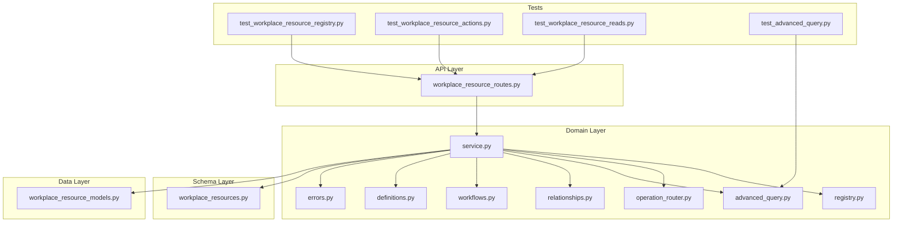
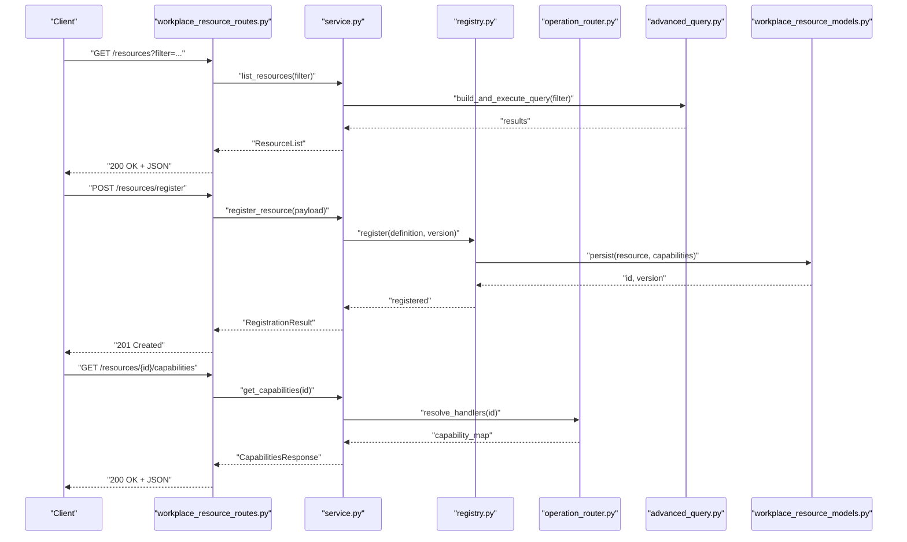
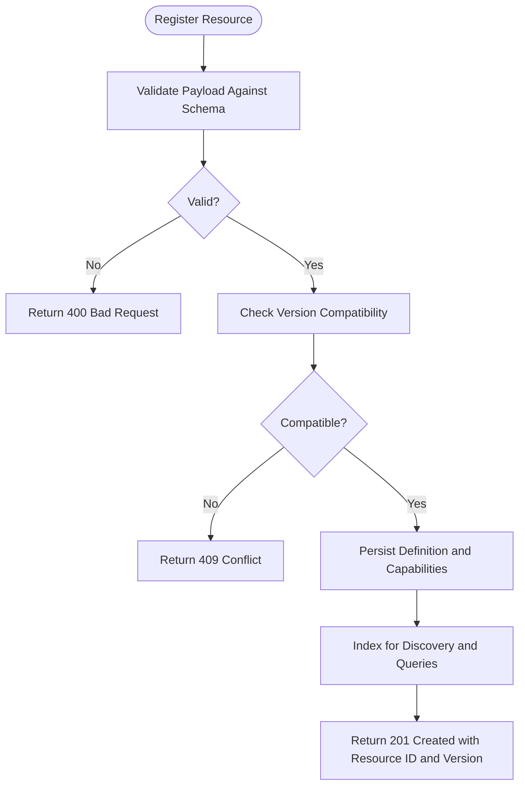
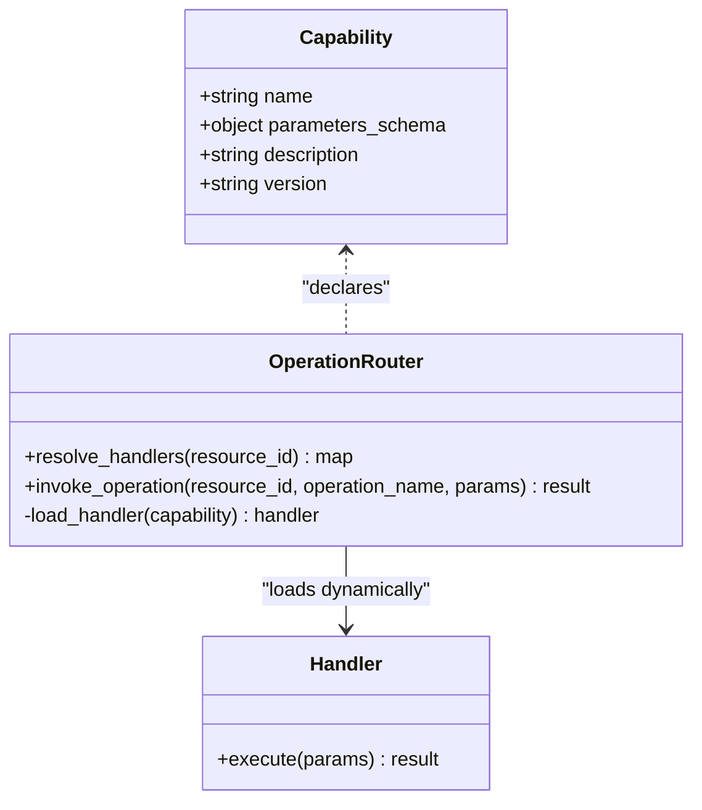
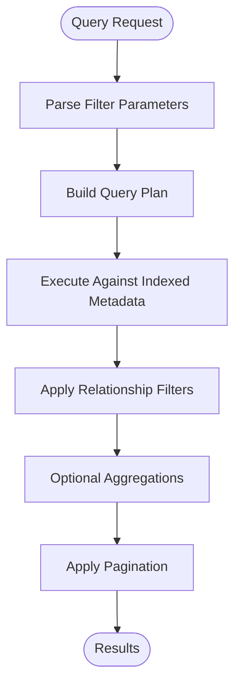
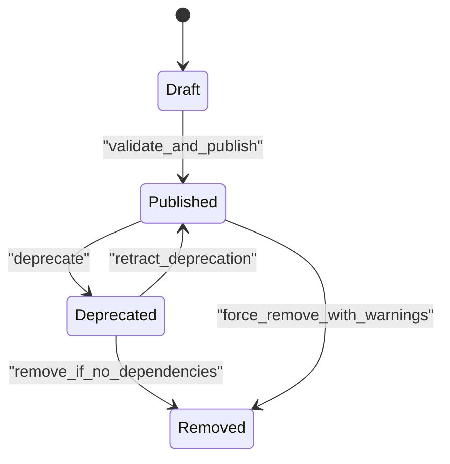
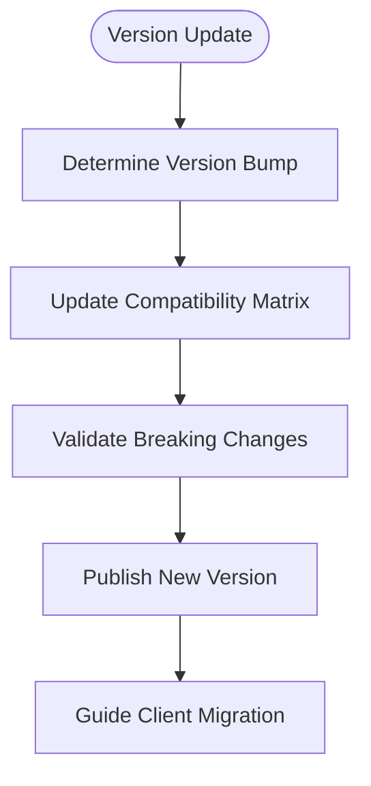
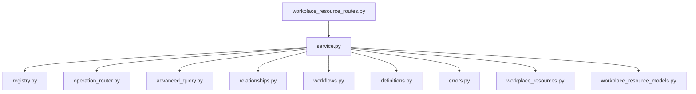

# Resource Registry API

<cite>
**Referenced Files in This Document**
- [workplace_resource_routes.py](file://app/api/workplace_resource_routes.py)
- [workplace_resource_models.py](file://app/db/workplace_resource_models.py)
- [workplace_resources.py](file://app/schemas/workplace_resources.py)
- [registry.py](file://app/workplace_resources/registry.py)
- [service.py](file://app/workplace_resources/service.py)
- [operation_router.py](file://app/workplace_resources/operation_router.py)
- [advanced_query.py](file://app/workplace_resources/advanced_query.py)
- [relationships.py](file://app/workplace_resources/relationships.py)
- [workflows.py](file://app/workplace_resources/workflows.py)
- [errors.py](file://app/workplace_resources/errors.py)
- [definitions.py](file://app/workplace_resources/definitions.py)
- [test_workplace_resource_registry.py](file://tests/test_workplace_resource_registry.py)
- [test_workplace_resource_actions.py](file://tests/test_workplace_resource_actions.py)
- [test_workplace_resource_reads.py](file://tests/test_workplace_resource_reads.py)
- [test_advanced_query.py](file://tests/test_advanced_query.py)
</cite>

## Table of Contents
1. [Introduction](#introduction)
2. [Project Structure](#project-structure)
3. [Core Components](#core-components)
4. [Architecture Overview](#architecture-overview)
5. [Detailed Component Analysis](#detailed-component-analysis)
6. [Dependency Analysis](#dependency-analysis)
7. [Performance Considerations](#performance-considerations)
8. [Troubleshooting Guide](#troubleshooting-guide)
9. [Conclusion](#conclusion)
10. [Appendices](#appendices)

## Introduction
This document provides comprehensive API documentation for the workplace resource registry system. It covers endpoints for discovering available workplace resources, their capabilities, and metadata; resource registration; discovery queries; capability introspection; schema validation; dynamic loading mechanisms; lifecycle management; versioning strategies; compatibility checks; and practical integration examples across different resource types. The goal is to enable developers to integrate with the registry effectively and reliably.

## Project Structure
The workplace resource registry spans multiple layers:
- API layer: HTTP routes exposing registry operations
- Schema layer: Pydantic models defining request/response contracts
- Domain layer: Core logic for registry operations, relationships, workflows, and advanced queries
- Data layer: Database models and persistence
- Tests: End-to-end and unit tests validating behavior

**Diagram sources**
- [workplace_resource_routes.py](file://app/api/workplace_resource_routes.py)
- [service.py](file://app/workplace_resources/service.py)
- [registry.py](file://app/workplace_resources/registry.py)
- [operation_router.py](file://app/workplace_resources/operation_router.py)
- [advanced_query.py](file://app/workplace_resources/advanced_query.py)
- [relationships.py](file://app/workplace_resources/relationships.py)
- [workflows.py](file://app/workplace_resources/workflows.py)
- [definitions.py](file://app/workplace_resources/definitions.py)
- [errors.py](file://app/workplace_resources/errors.py)
- [workplace_resources.py](file://app/schemas/workplace_resources.py)
- [workplace_resource_models.py](file://app/db/workplace_resource_models.py)
- [test_workplace_resource_registry.py](file://tests/test_workplace_resource_registry.py)
- [test_workplace_resource_actions.py](file://tests/test_workplace_resource_actions.py)
- [test_workplace_resource_reads.py](file://tests/test_workplace_resource_reads.py)
- [test_advanced_query.py](file://tests/test_advanced_query.py)

**Section sources**
- [workplace_resource_routes.py](file://app/api/workplace_resource_routes.py)
- [service.py](file://app/workplace_resources/service.py)
- [registry.py](file://app/workplace_resources/registry.py)
- [operation_router.py](file://app/workplace_resources/operation_router.py)
- [advanced_query.py](file://app/workplace_resources/advanced_query.py)
- [relationships.py](file://app/workplace_resources/relationships.py)
- [workflows.py](file://app/workplace_resources/workflows.py)
- [definitions.py](file://app/workplace_resources/definitions.py)
- [errors.py](file://app/workplace_resources/errors.py)
- [workplace_resources.py](file://app/schemas/workplace_resources.py)
- [workplace_resource_models.py](file://app/db/workplace_resource_models.py)
- [test_workplace_resource_registry.py](file://tests/test_workplace_resource_registry.py)
- [test_workplace_resource_actions.py](file://tests/test_workplace_resource_actions.py)
- [test_workplace_resource_reads.py](file://tests/test_workplace_resource_reads.py)
- [test_advanced_query.py](file://tests/test_advanced_query.py)

## Core Components
- API Routes: Expose endpoints for listing, registering, querying, and managing resources and their capabilities.
- Service Layer: Orchestrates business logic, including registration, discovery, capability introspection, and workflow execution.
- Registry: Manages resource definitions, versions, and runtime availability.
- Operation Router: Dispatches resource-specific operations based on declared capabilities.
- Advanced Query Engine: Supports rich filtering and search over resource metadata and relationships.
- Relationships: Models associations between resources (e.g., owner, dependency).
- Workflows: Encapsulates multi-step processes such as provisioning or deprovisioning.
- Definitions: Centralizes resource type schemas and capability shapes.
- Errors: Standardized error types and codes for consistent client handling.
- Schemas: Pydantic models for request/response validation and serialization.
- Database Models: Persistent representation of resources, capabilities, and relationships.

**Section sources**
- [workplace_resource_routes.py](file://app/api/workplace_resource_routes.py)
- [service.py](file://app/workplace_resources/service.py)
- [registry.py](file://app/workplace_resources/registry.py)
- [operation_router.py](file://app/workplace_resources/operation_router.py)
- [advanced_query.py](file://app/workplace_resources/advanced_query.py)
- [relationships.py](file://app/workplace_resources/relationships.py)
- [workflows.py](file://app/workplace_resources/workflows.py)
- [definitions.py](file://app/workplace_resources/definitions.py)
- [errors.py](file://app/workplace_resources/errors.py)
- [workplace_resources.py](file://app/schemas/workplace_resources.py)
- [workplace_resource_models.py](file://app/db/workplace_resource_models.py)

## Architecture Overview
The registry follows a layered architecture:
- Clients call API routes to perform operations.
- Routes validate inputs using schemas and delegate to service methods.
- Services coordinate registry operations, query engines, relationship resolution, and workflow orchestration.
- Registry persists and serves resource definitions and runtime state.
- Operation router resolves concrete handlers by capability.
- Advanced query engine executes complex filters and aggregations.
- Database models persist entities and relationships.

**Diagram sources**
- [workplace_resource_routes.py](file://app/api/workplace_resource_routes.py)
- [service.py](file://app/workplace_resources/service.py)
- [registry.py](file://app/workplace_resources/registry.py)
- [operation_router.py](file://app/workplace_resources/operation_router.py)
- [advanced_query.py](file://app/workplace_resources/advanced_query.py)
- [workplace_resource_models.py](file://app/db/workplace_resource_models.py)

## Detailed Component Analysis

### API Endpoints
- List Resources
  - Purpose: Discover available resources with optional filters and pagination.
  - Input: Query parameters for filtering by type, tags, effective period, and relationships.
  - Output: Paginated list of resource summaries and metadata.
  - Status Codes: 200 OK, 400 Bad Request, 401 Unauthorized, 403 Forbidden.
- Register Resource
  - Purpose: Register a new resource definition with capabilities and metadata.
  - Input: Resource definition payload including name, type, version, capabilities, and schema.
  - Output: Registration result with resource ID and version.
  - Status Codes: 201 Created, 400 Bad Request, 409 Conflict (duplicate), 401 Unauthorized, 403 Forbidden.
- Get Capabilities
  - Purpose: Introspect capabilities and supported operations for a specific resource.
  - Input: Resource identifier.
  - Output: Capability map describing operations, parameters, and constraints.
  - Status Codes: 200 OK, 404 Not Found, 401 Unauthorized, 403 Forbidden.
- Update Resource Definition
  - Purpose: Versioned update of resource definition while preserving runtime instances.
  - Input: Updated definition with incremented version and compatibility notes.
  - Output: Updated resource metadata and new version.
  - Status Codes: 200 OK, 400 Bad Request, 409 Conflict, 401 Unauthorized, 403 Forbidden.
- Delete Resource Definition
  - Purpose: Remove a resource definition if no active instances depend on it.
  - Input: Resource identifier.
  - Output: Deletion confirmation.
  - Status Codes: 200 OK, 404 Not Found, 409 Conflict (dependencies exist), 401 Unauthorized, 403 Forbidden.
- Execute Operation
  - Purpose: Invoke a capability operation on a resource instance.
  - Input: Resource identifier, operation name, and parameters validated against capability schema.
  - Output: Operation result or error details.
  - Status Codes: 200 OK, 400 Bad Request, 404 Not Found, 409 Conflict (incompatible version), 401 Unauthorized, 403 Forbidden.

Notes:
- All endpoints enforce authentication and authorization.
- Responses are validated against Pydantic schemas before serialization.
- Error responses include standardized error codes and messages.

**Section sources**
- [workplace_resource_routes.py](file://app/api/workplace_resource_routes.py)
- [workplace_resources.py](file://app/schemas/workplace_resources.py)
- [errors.py](file://app/workplace_resources/errors.py)

### Resource Registration Flow

**Diagram sources**
- [service.py](file://app/workplace_resources/service.py)
- [registry.py](file://app/workplace_resources/registry.py)
- [workplace_resources.py](file://app/schemas/workplace_resources.py)
- [workplace_resource_models.py](file://app/db/workplace_resource_models.py)

**Section sources**
- [service.py](file://app/workplace_resources/service.py)
- [registry.py](file://app/workplace_resources/registry.py)
- [workplace_resources.py](file://app/schemas/workplace_resources.py)
- [workplace_resource_models.py](file://app/db/workplace_resource_models.py)

### Capability Introspection and Dynamic Loading
- Capability Map: Each resource declares a set of operations with parameter schemas and constraints.
- Operation Router: Resolves concrete handlers at runtime based on capability declarations.
- Dynamic Loading: Handlers are loaded dynamically when capabilities are resolved, enabling hot-swapping without restarts.
- Compatibility Checks: Before invoking an operation, the router verifies that the handler’s expected version matches the resource’s current version.

**Diagram sources**
- [operation_router.py](file://app/workplace_resources/operation_router.py)
- [definitions.py](file://app/workplace_resources/definitions.py)

**Section sources**
- [operation_router.py](file://app/workplace_resources/operation_router.py)
- [definitions.py](file://app/workplace_resources/definitions.py)

### Advanced Query Engine
- Filtering: Supports equality, range, and containment filters on metadata fields.
- Relationship Filters: Allows querying by owner, dependencies, and related resources.
- Aggregations: Provides counts and grouping by type, tags, and status.
- Pagination: Supports offset and limit parameters for large result sets.

**Diagram sources**
- [advanced_query.py](file://app/workplace_resources/advanced_query.py)
- [relationships.py](file://app/workplace_resources/relationships.py)

**Section sources**
- [advanced_query.py](file://app/workplace_resources/advanced_query.py)
- [relationships.py](file://app/workplace_resources/relationships.py)

### Resource Lifecycle Management
- States: Draft, Published, Deprecated, Removed.
- Transitions: Controlled via registry services with validation rules.
- Effective Period: Resources can be time-bound to ensure correct availability windows.
- Deprecation Strategy: Announce deprecations with migration guidance and fallback versions.

**Diagram sources**
- [service.py](file://app/workplace_resources/service.py)
- [workflows.py](file://app/workplace_resources/workflows.py)

**Section sources**
- [service.py](file://app/workplace_resources/service.py)
- [workflows.py](file://app/workplace_resources/workflows.py)

### Versioning Strategies and Compatibility Checks
- Semantic Versioning: Major, minor, patch increments indicate breaking changes, enhancements, and fixes.
- Compatibility Matrix: Declares which handler versions support which resource versions.
- Backward Compatibility: Minor and patch updates must remain compatible with existing clients.
- Forward Compatibility: Clients should tolerate unknown fields in capability schemas.

**Diagram sources**
- [registry.py](file://app/workplace_resources/registry.py)
- [definitions.py](file://app/workplace_resources/definitions.py)

**Section sources**
- [registry.py](file://app/workplace_resources/registry.py)
- [definitions.py](file://app/workplace_resources/definitions.py)

### Practical Integration Examples
- Listing Resources: Use filter parameters to discover resources by type and tags.
- Registering a Resource: Submit a complete definition with capabilities and schema.
- Executing Operations: Call capability operations with validated parameters.
- Handling Errors: Implement retries and fallbacks based on standardized error codes.
- Version Awareness: Always check resource version and capability compatibility before invocation.

[No sources needed since this section provides general guidance]

## Dependency Analysis
The following diagram shows key dependencies among components:

**Diagram sources**
- [workplace_resource_routes.py](file://app/api/workplace_resource_routes.py)
- [service.py](file://app/workplace_resources/service.py)
- [registry.py](file://app/workplace_resources/registry.py)
- [operation_router.py](file://app/workplace_resources/operation_router.py)
- [advanced_query.py](file://app/workplace_resources/advanced_query.py)
- [relationships.py](file://app/workplace_resources/relationships.py)
- [workflows.py](file://app/workplace_resources/workflows.py)
- [definitions.py](file://app/workplace_resources/definitions.py)
- [errors.py](file://app/workplace_resources/errors.py)
- [workplace_resources.py](file://app/schemas/workplace_resources.py)
- [workplace_resource_models.py](file://app/db/workplace_resource_models.py)

**Section sources**
- [workplace_resource_routes.py](file://app/api/workplace_resource_routes.py)
- [service.py](file://app/workplace_resources/service.py)
- [registry.py](file://app/workplace_resources/registry.py)
- [operation_router.py](file://app/workplace_resources/operation_router.py)
- [advanced_query.py](file://app/workplace_resources/advanced_query.py)
- [relationships.py](file://app/workplace_resources/relationships.py)
- [workflows.py](file://app/workplace_resources/workflows.py)
- [definitions.py](file://app/workplace_resources/definitions.py)
- [errors.py](file://app/workplace_resources/errors.py)
- [workplace_resources.py](file://app/schemas/workplace_resources.py)
- [workplace_resource_models.py](file://app/db/workplace_resource_models.py)

## Performance Considerations
- Indexing: Ensure metadata fields used in frequent filters are indexed to optimize query performance.
- Caching: Cache capability maps and resource summaries where appropriate to reduce database load.
- Pagination: Always use pagination for list endpoints to avoid large payloads.
- Connection Pooling: Configure database connection pools to handle concurrent requests efficiently.
- Lazy Loading: Load heavy capability handlers only when invoked to minimize startup overhead.

[No sources needed since this section provides general guidance]

## Troubleshooting Guide
Common issues and resolutions:
- Validation Errors: Check request payloads against schema definitions and correct field types.
- Version Conflicts: Review compatibility matrix and migrate to supported versions.
- Missing Dependencies: Resolve relationship constraints before deleting or updating resources.
- Authorization Failures: Verify user permissions and organization boundaries.
- Operational Timeouts: Inspect handler logs and adjust timeouts or retry policies.

**Section sources**
- [errors.py](file://app/workplace_resources/errors.py)
- [workplace_resources.py](file://app/schemas/workplace_resources.py)

## Conclusion
The workplace resource registry provides a robust foundation for discovering, registering, and operating on workplace resources through well-defined APIs. Its layered architecture, strong schema validation, dynamic capability loading, and comprehensive lifecycle management enable scalable and maintainable integrations. By adhering to versioning strategies and compatibility checks, clients can evolve independently while ensuring reliable operations.

[No sources needed since this section summarizes without analyzing specific files]

## Appendices

### Test Coverage Overview
- Registry Tests: Validate registration, versioning, and conflict handling.
- Action Tests: Confirm capability invocation and error propagation.
- Read Tests: Ensure accurate discovery and filtering results.
- Advanced Query Tests: Verify complex filters and aggregations.

**Section sources**
- [test_workplace_resource_registry.py](file://tests/test_workplace_resource_registry.py)
- [test_workplace_resource_actions.py](file://tests/test_workplace_resource_actions.py)
- [test_workplace_resource_reads.py](file://tests/test_workplace_resource_reads.py)
- [test_advanced_query.py](file://tests/test_advanced_query.py)