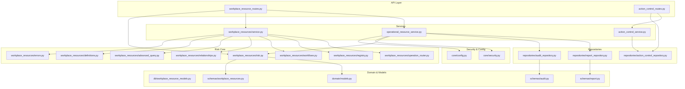
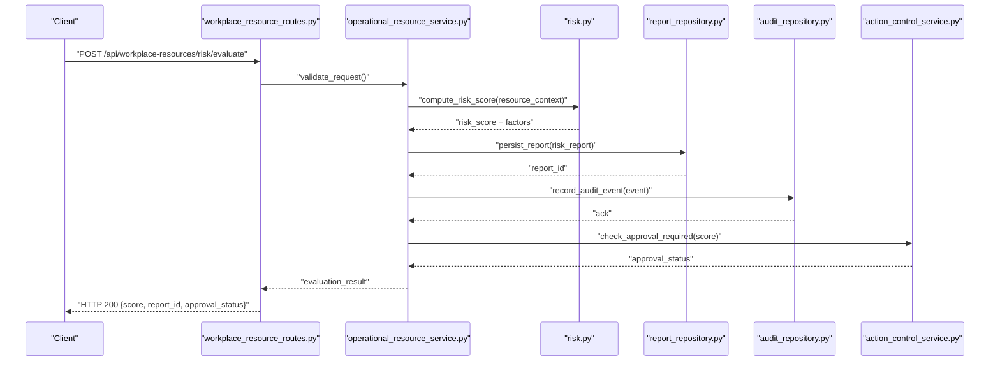
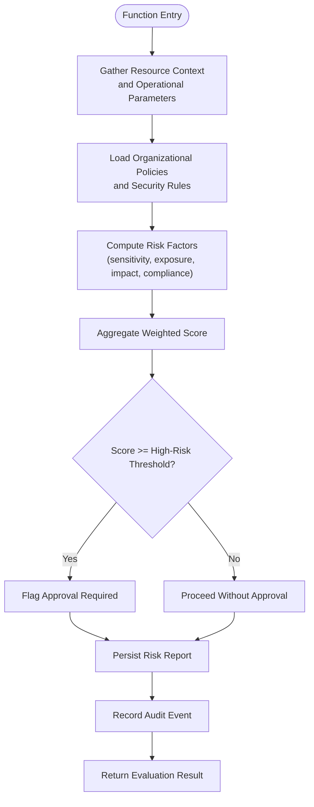
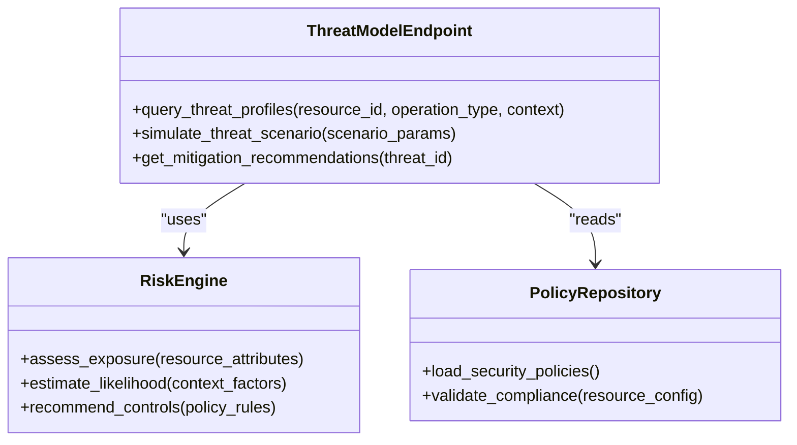
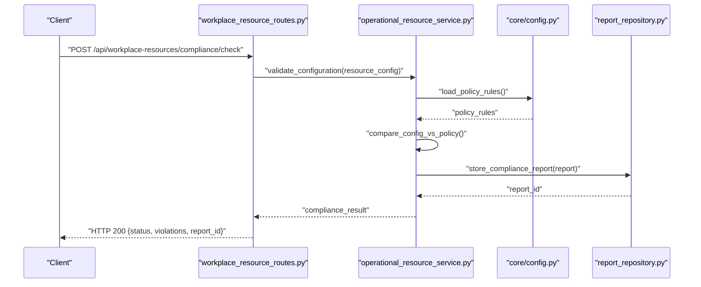
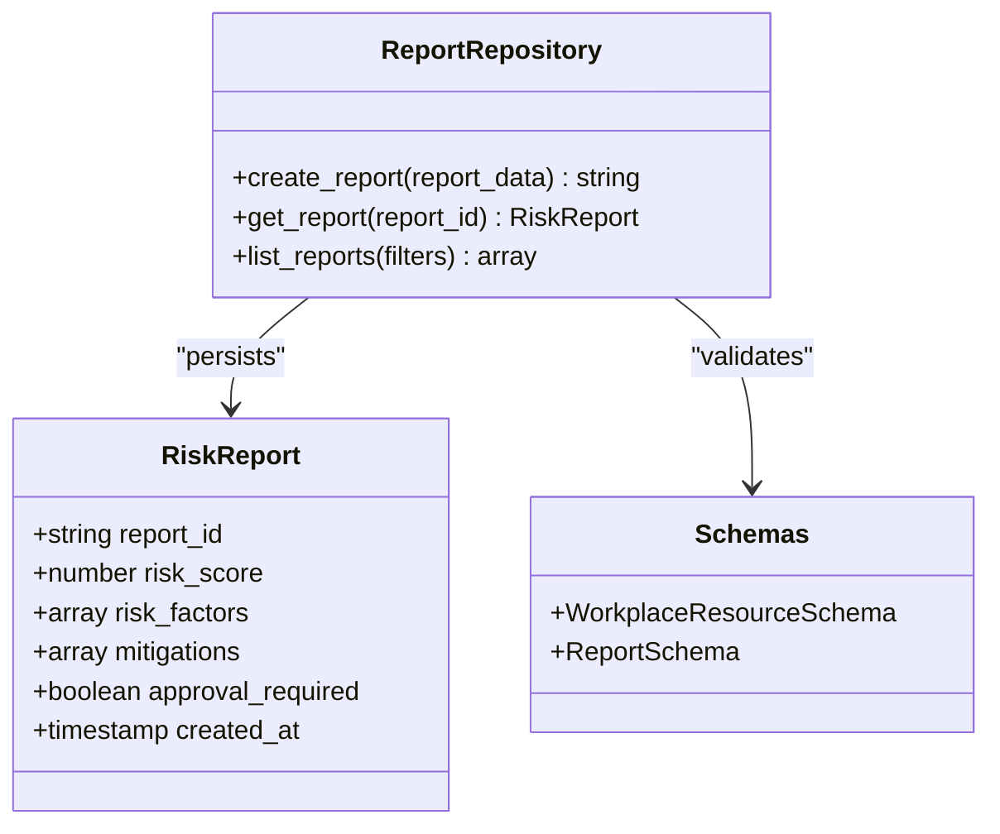
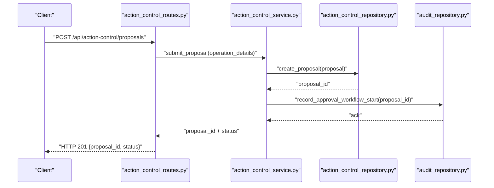
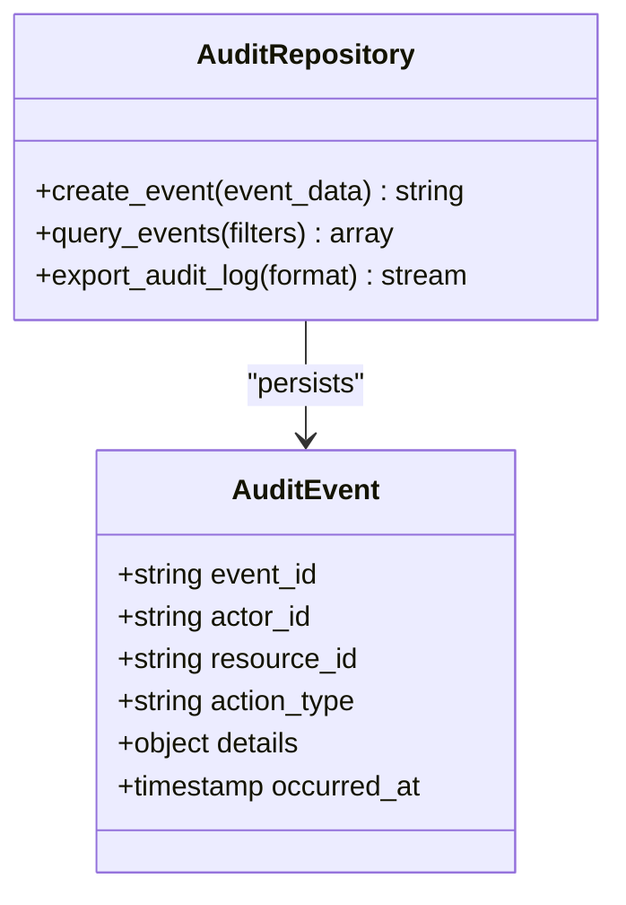
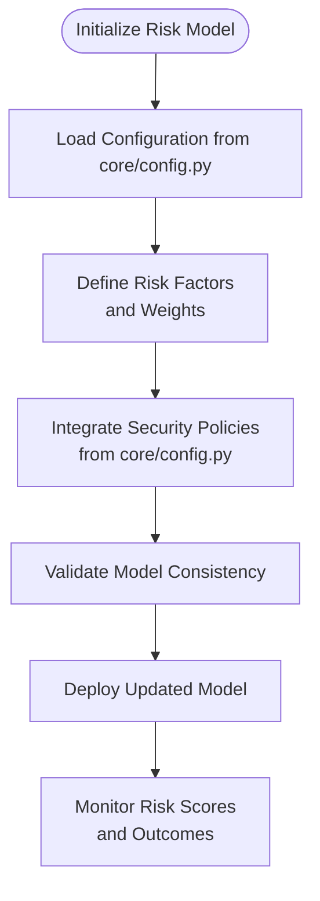
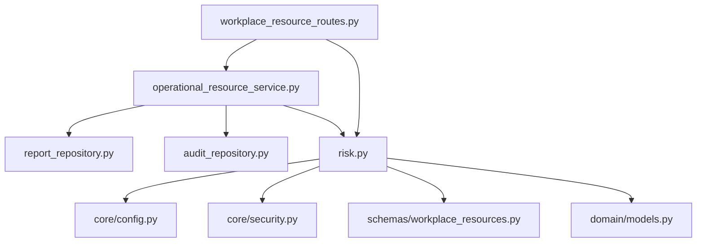

# Risk Assessment API

<cite>
**Referenced Files in This Document**
- [app/workplace_resources/risk.py](file://app/workplace_resources/risk.py)
- [app/api/workplace_resource_routes.py](file://app/api/workplace_resource_routes.py)
- [app/services/operational_resource_service.py](file://app/services/operational_resource_service.py)
- [app/schemas/workplace_resources.py](file://app/schemas/workplace_resources.py)
- [app/db/workplace_resource_models.py](file://app/db/workplace_resource_models.py)
- [app/domain/models.py](file://app/domain/models.py)
- [app/repositories/report_repository.py](file://app/repositories/report_repository.py)
- [app/schemas/report.py](file://app/schemas/report.py)
- [app/api/action_control_routes.py](file://app/api/action_control_routes.py)
- [app/services/action_control_service.py](file://app/services/action_control_service.py)
- [app/repositories/action_control_repository.py](file://app/repositories/action_control_repository.py)
- [app/repositories/audit_repository.py](file://app/repositories/audit_repository.py)
- [app/schemas/audit.py](file://app/schemas/audit.py)
- [app/core/security.py](file://app/core/security.py)
- [app/core/config.py](file://app/core/config.py)
- [app/workplace_resources/service.py](file://app/workplace_resources/service.py)
- [app/workplace_resources/operation_router.py](file://app/workplace_resources/operation_router.py)
- [app/workplace_resources/registry.py](file://app/workplace_resources/registry.py)
- [app/workplace_resources/workflows.py](file://app/workplace_resources/workflows.py)
- [app/workplace_resources/relationships.py](file://app/workplace_resources/relationships.py)
- [app/workplace_resources/advanced_query.py](file://app/workplace_resources/advanced_query.py)
- [app/workplace_resources/definitions.py](file://app/workplace_resources/definitions.py)
- [app/workplace_resources/errors.py](file://app/workplace_resources/errors.py)
</cite>

## Table of Contents
1. [Introduction](#introduction)
2. [Project Structure](#project-structure)
3. [Core Components](#core-components)
4. [Architecture Overview](#architecture-overview)
5. [Detailed Component Analysis](#detailed-component-analysis)
6. [Dependency Analysis](#dependency-analysis)
7. [Performance Considerations](#performance-considerations)
8. [Troubleshooting Guide](#troubleshooting-guide)
9. [Conclusion](#conclusion)
10. [Appendices](#appendices)

## Introduction
This document provides comprehensive API documentation for resource risk assessment and evaluation systems within the application. It covers risk scoring algorithms, threat modeling endpoints, compliance checking interfaces, risk mitigation strategies, approval workflows for high-risk operations, audit trail generation, and guidance on customizing risk models and integrating with organizational security policies. The goal is to enable developers and operators to configure risk parameters, evaluate resource safety, generate risk reports, and integrate these capabilities into broader governance and security workflows.

## Project Structure
The risk assessment functionality spans several modules:
- Risk scoring and policy evaluation logic
- REST endpoints for risk queries and reporting
- Operational resource service integration
- Data models and schemas for risk artifacts
- Audit and action control integrations for approvals and compliance

**Diagram sources**
- [app/api/workplace_resource_routes.py](file://app/api/workplace_resource_routes.py)
- [app/services/operational_resource_service.py](file://app/services/operational_resource_service.py)
- [app/workplace_resources/risk.py](file://app/workplace_resources/risk.py)
- [app/workplace_resources/service.py](file://app/workplace_resources/service.py)
- [app/workplace_resources/operation_router.py](file://app/workplace_resources/operation_router.py)
- [app/workplace_resources/registry.py](file://app/workplace_resources/registry.py)
- [app/workplace_resources/workflows.py](file://app/workplace_resources/workflows.py)
- [app/workplace_resources/relationships.py](file://app/workplace_resources/relationships.py)
- [app/workplace_resources/advanced_query.py](file://app/workplace_resources/advanced_query.py)
- [app/workplace_resources/definitions.py](file://app/workplace_resources/definitions.py)
- [app/workplace_resources/errors.py](file://app/workplace_resources/errors.py)
- [app/db/workplace_resource_models.py](file://app/db/workplace_resource_models.py)
- [app/domain/models.py](file://app/domain/models.py)
- [app/schemas/workplace_resources.py](file://app/schemas/workplace_resources.py)
- [app/schemas/report.py](file://app/schemas/report.py)
- [app/schemas/audit.py](file://app/schemas/audit.py)
- [app/repositories/report_repository.py](file://app/repositories/report_repository.py)
- [app/repositories/audit_repository.py](file://app/repositories/audit_repository.py)
- [app/repositories/action_control_repository.py](file://app/repositories/action_control_repository.py)
- [app/core/security.py](file://app/core/security.py)
- [app/core/config.py](file://app/core/config.py)

**Section sources**
- [app/api/workplace_resource_routes.py](file://app/api/workplace_resource_routes.py)
- [app/services/operational_resource_service.py](file://app/services/operational_resource_service.py)
- [app/workplace_resources/risk.py](file://app/workplace_resources/risk.py)
- [app/workplace_resources/service.py](file://app/workplace_resources/service.py)
- [app/workplace_resources/operation_router.py](file://app/workplace_resources/operation_router.py)
- [app/workplace_resources/registry.py](file://app/workplace_resources/registry.py)
- [app/workplace_resources/workflows.py](file://app/workplace_resources/workflows.py)
- [app/workplace_resources/relationships.py](file://app/workplace_resources/relationships.py)
- [app/workplace_resources/advanced_query.py](file://app/workplace_resources/advanced_query.py)
- [app/workplace_resources/definitions.py](file://app/workplace_resources/definitions.py)
- [app/workplace_resources/errors.py](file://app/workplace_resources/errors.py)
- [app/db/workplace_resource_models.py](file://app/db/workplace_resource_models.py)
- [app/domain/models.py](file://app/domain/models.py)
- [app/schemas/workplace_resources.py](file://app/schemas/workplace_resources.py)
- [app/schemas/report.py](file://app/schemas/report.py)
- [app/schemas/audit.py](file://app/schemas/audit.py)
- [app/repositories/report_repository.py](file://app/repositories/report_repository.py)
- [app/repositories/audit_repository.py](file://app/repositories/audit_repository.py)
- [app/repositories/action_control_repository.py](file://app/repositories/action_control_repository.py)
- [app/core/security.py](file://app/core/security.py)
- [app/core/config.py](file://app/core/config.py)

## Core Components
- Risk Scoring Engine: Implements algorithms to compute risk scores based on resource attributes, operational context, and policy constraints.
- Threat Modeling Endpoints: Expose APIs to query threat profiles and model potential risks for resources and operations.
- Compliance Checking Interfaces: Validate resource configurations against organizational policies and standards.
- Risk Reporting: Generate structured risk reports summarizing findings, mitigations, and recommendations.
- Approval Workflows: Integrate with action control to enforce multi-step approvals for high-risk operations.
- Audit Trail: Record risk assessments, decisions, and actions for compliance and traceability.

Key responsibilities:
- Compute risk scores deterministically and consistently across environments.
- Provide clear inputs and outputs for risk evaluation and reporting.
- Enforce security and authorization checks before exposing sensitive data.
- Support customization of risk models and policy rules.

**Section sources**
- [app/workplace_resources/risk.py](file://app/workplace_resources/risk.py)
- [app/api/workplace_resource_routes.py](file://app/api/workplace_resource_routes.py)
- [app/services/operational_resource_service.py](file://app/services/operational_resource_service.py)
- [app/schemas/workplace_resources.py](file://app/schemas/workplace_resources.py)
- [app/schemas/report.py](file://app/schemas/report.py)
- [app/schemas/audit.py](file://app/schemas/audit.py)
- [app/repositories/report_repository.py](file://app/repositories/report_repository.py)
- [app/repositories/audit_repository.py](file://app/repositories/audit_repository.py)
- [app/repositories/action_control_repository.py](file://app/repositories/action_control_repository.py)
- [app/core/security.py](file://app/core/security.py)
- [app/core/config.py](file://app/core/config.py)

## Architecture Overview
The risk assessment system integrates with workplace resources and action control to provide a cohesive governance layer.

**Diagram sources**
- [app/api/workplace_resource_routes.py](file://app/api/workplace_resource_routes.py)
- [app/services/operational_resource_service.py](file://app/services/operational_resource_service.py)
- [app/workplace_resources/risk.py](file://app/workplace_resources/risk.py)
- [app/repositories/report_repository.py](file://app/repositories/report_repository.py)
- [app/repositories/audit_repository.py](file://app/repositories/audit_repository.py)
- [app/services/action_control_service.py](file://app/services/action_control_service.py)

## Detailed Component Analysis

### Risk Scoring Algorithm
The risk scoring algorithm evaluates multiple dimensions such as resource sensitivity, exposure, operational impact, and policy violations. It aggregates weighted factors to produce a composite score and associated risk factors.

**Diagram sources**
- [app/workplace_resources/risk.py](file://app/workplace_resources/risk.py)
- [app/core/config.py](file://app/core/config.py)
- [app/schemas/workplace_resources.py](file://app/schemas/workplace_resources.py)

**Section sources**
- [app/workplace_resources/risk.py](file://app/workplace_resources/risk.py)
- [app/core/config.py](file://app/core/config.py)
- [app/schemas/workplace_resources.py](file://app/schemas/workplace_resources.py)

### Threat Modeling Endpoints
Endpoints expose threat profiles and allow clients to simulate threats against resources. Inputs include resource identifiers, operation types, and contextual parameters. Outputs include threat vectors, likelihood estimates, and recommended mitigations.

**Diagram sources**
- [app/api/workplace_resource_routes.py](file://app/api/workplace_resource_routes.py)
- [app/workplace_resources/risk.py](file://app/workplace_resources/risk.py)
- [app/core/config.py](file://app/core/config.py)

**Section sources**
- [app/api/workplace_resource_routes.py](file://app/api/workplace_resource_routes.py)
- [app/workplace_resources/risk.py](file://app/workplace_resources/risk.py)
- [app/core/config.py](file://app/core/config.py)

### Compliance Checking Interfaces
Compliance checking validates resource configurations against organizational policies and standards. It returns pass/fail results with detailed violation information and remediation steps.

**Diagram sources**
- [app/api/workplace_resource_routes.py](file://app/api/workplace_resource_routes.py)
- [app/services/operational_resource_service.py](file://app/services/operational_resource_service.py)
- [app/core/config.py](file://app/core/config.py)
- [app/repositories/report_repository.py](file://app/repositories/report_repository.py)

**Section sources**
- [app/api/workplace_resource_routes.py](file://app/api/workplace_resource_routes.py)
- [app/services/operational_resource_service.py](file://app/services/operational_resource_service.py)
- [app/core/config.py](file://app/core/config.py)
- [app/repositories/report_repository.py](file://app/repositories/report_repository.py)

### Risk Reporting
Risk reports summarize assessment outcomes, including scores, factors, mitigations, and compliance status. Reports are persisted and retrievable via API.

**Diagram sources**
- [app/repositories/report_repository.py](file://app/repositories/report_repository.py)
- [app/schemas/report.py](file://app/schemas/report.py)
- [app/schemas/workplace_resources.py](file://app/schemas/workplace_resources.py)

**Section sources**
- [app/repositories/report_repository.py](file://app/repositories/report_repository.py)
- [app/schemas/report.py](file://app/schemas/report.py)
- [app/schemas/workplace_resources.py](file://app/schemas/workplace_resources.py)

### Approval Workflows for High-Risk Operations
High-risk operations require multi-step approvals. The system integrates with action control to enforce approval gates and track decision history.

**Diagram sources**
- [app/api/action_control_routes.py](file://app/api/action_control_routes.py)
- [app/services/action_control_service.py](file://app/services/action_control_service.py)
- [app/repositories/action_control_repository.py](file://app/repositories/action_control_repository.py)
- [app/repositories/audit_repository.py](file://app/repositories/audit_repository.py)

**Section sources**
- [app/api/action_control_routes.py](file://app/api/action_control_routes.py)
- [app/services/action_control_service.py](file://app/services/action_control_service.py)
- [app/repositories/action_control_repository.py](file://app/repositories/action_control_repository.py)
- [app/repositories/audit_repository.py](file://app/repositories/audit_repository.py)

### Audit Trail Generation
Audit events capture risk assessments, compliance checks, and approval decisions. They provide traceability for audits and investigations.

**Diagram sources**
- [app/repositories/audit_repository.py](file://app/repositories/audit_repository.py)
- [app/schemas/audit.py](file://app/schemas/audit.py)

**Section sources**
- [app/repositories/audit_repository.py](file://app/repositories/audit_repository.py)
- [app/schemas/audit.py](file://app/schemas/audit.py)

### Customizing Risk Models and Integrating Security Policies
Customization involves extending risk factors, adjusting weights, and integrating organizational security policies. Configuration is centralized and validated at runtime.

**Diagram sources**
- [app/core/config.py](file://app/core/config.py)
- [app/workplace_resources/risk.py](file://app/workplace_resources/risk.py)

**Section sources**
- [app/core/config.py](file://app/core/config.py)
- [app/workplace_resources/risk.py](file://app/workplace_resources/risk.py)

## Dependency Analysis
The risk assessment system depends on configuration, security, repositories, and schemas. Proper decoupling ensures maintainability and testability.

**Diagram sources**
- [app/workplace_resources/risk.py](file://app/workplace_resources/risk.py)
- [app/core/config.py](file://app/core/config.py)
- [app/core/security.py](file://app/core/security.py)
- [app/schemas/workplace_resources.py](file://app/schemas/workplace_resources.py)
- [app/domain/models.py](file://app/domain/models.py)
- [app/services/operational_resource_service.py](file://app/services/operational_resource_service.py)
- [app/repositories/report_repository.py](file://app/repositories/report_repository.py)
- [app/repositories/audit_repository.py](file://app/repositories/audit_repository.py)
- [app/api/workplace_resource_routes.py](file://app/api/workplace_resource_routes.py)

**Section sources**
- [app/workplace_resources/risk.py](file://app/workplace_resources/risk.py)
- [app/core/config.py](file://app/core/config.py)
- [app/core/security.py](file://app/core/security.py)
- [app/schemas/workplace_resources.py](file://app/schemas/workplace_resources.py)
- [app/domain/models.py](file://app/domain/models.py)
- [app/services/operational_resource_service.py](file://app/services/operational_resource_service.py)
- [app/repositories/report_repository.py](file://app/repositories/report_repository.py)
- [app/repositories/audit_repository.py](file://app/repositories/audit_repository.py)
- [app/api/workplace_resource_routes.py](file://app/api/workplace_resource_routes.py)

## Performance Considerations
- Cache frequently accessed policy rules and risk factor definitions to reduce latency.
- Use batch processing for bulk risk evaluations when possible.
- Implement pagination and filtering for large report datasets.
- Optimize database queries in repositories to avoid N+1 problems.
- Monitor and profile risk scoring computations to identify bottlenecks.

## Troubleshooting Guide
Common issues and resolutions:
- Invalid risk parameters: Validate input schemas and ensure required fields are present.
- Policy conflicts: Review configuration and resolve conflicting rules.
- Approval failures: Check action control state and user permissions.
- Audit gaps: Verify audit event creation and persistence.

**Section sources**
- [app/workplace_resources/errors.py](file://app/workplace_resources/errors.py)
- [app/core/security.py](file://app/core/security.py)
- [app/repositories/audit_repository.py](file://app/repositories/audit_repository.py)

## Conclusion
The risk assessment API provides robust capabilities for evaluating resource safety, modeling threats, ensuring compliance, and generating actionable reports. By integrating with approval workflows and audit trails, it supports secure and governed operations. Customization options allow organizations to tailor risk models to their specific security policies and operational needs.

## Appendices

### Example: Configuring Risk Parameters
- Set risk thresholds and weights in configuration.
- Define custom risk factors and validation rules.
- Integrate organizational security policies.

**Section sources**
- [app/core/config.py](file://app/core/config.py)
- [app/workplace_resources/risk.py](file://app/workplace_resources/risk.py)

### Example: Evaluating Resource Safety
- Submit resource context and operational parameters to the evaluation endpoint.
- Receive risk score, factors, and approval requirements.
- Persist report and record audit event.

**Section sources**
- [app/api/workplace_resource_routes.py](file://app/api/workplace_resource_routes.py)
- [app/services/operational_resource_service.py](file://app/services/operational_resource_service.py)
- [app/workplace_resources/risk.py](file://app/workplace_resources/risk.py)

### Example: Generating Risk Reports
- Query existing reports by ID or filters.
- Export reports in supported formats.
- Include mitigations and compliance status.

**Section sources**
- [app/repositories/report_repository.py](file://app/repositories/report_repository.py)
- [app/schemas/report.py](file://app/schemas/report.py)

### Example: Approval Workflow for High-Risk Operations
- Submit proposal with operation details.
- Track approval status and decisions.
- Record audit events for each step.

**Section sources**
- [app/api/action_control_routes.py](file://app/api/action_control_routes.py)
- [app/services/action_control_service.py](file://app/services/action_control_service.py)
- [app/repositories/action_control_repository.py](file://app/repositories/action_control_repository.py)
- [app/repositories/audit_repository.py](file://app/repositories/audit_repository.py)