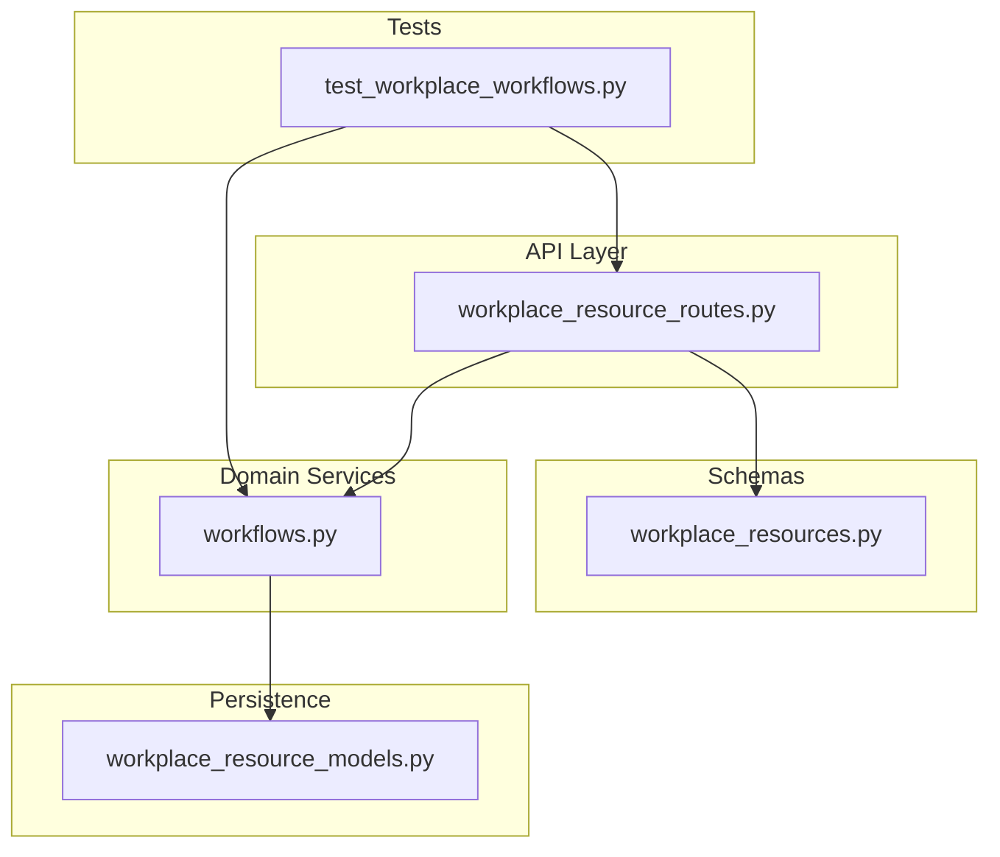
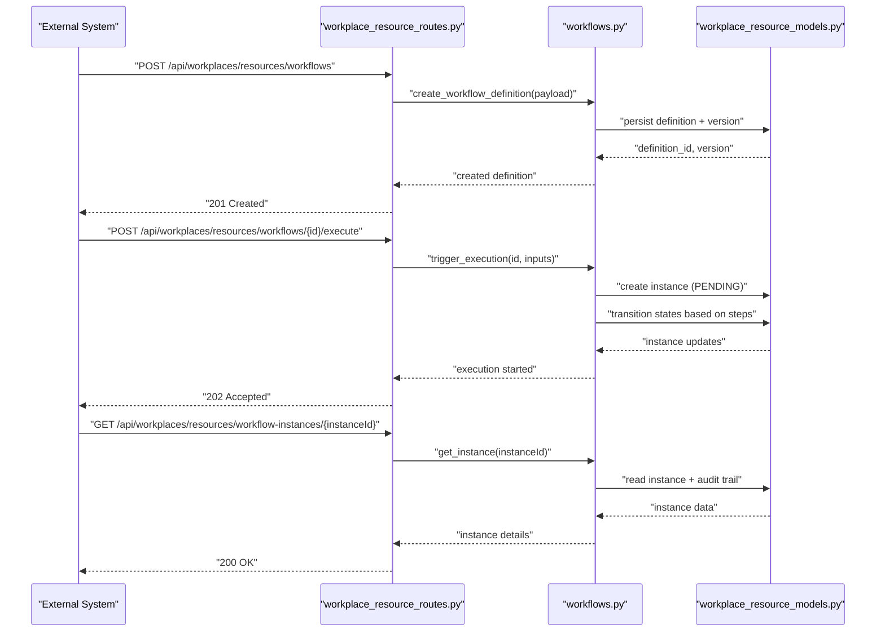
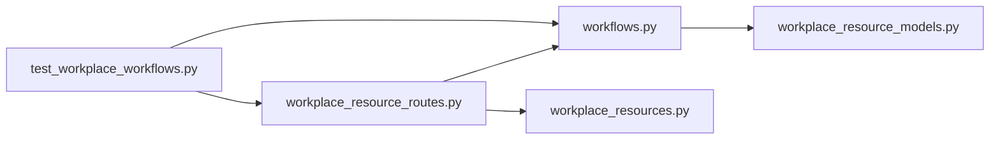

# Workflow Management API

<cite>
**Referenced Files in This Document**
- [workflows.py](file://app/workplace_resources/workflows.py)
- [workplace_resource_routes.py](file://app/api/workplace_resource_routes.py)
- [workplace_resource_models.py](file://app/db/workplace_resource_models.py)
- [workplace_resources.py](file://app/schemas/workplace_resources.py)
- [WORKPLACE_WORKFLOWS.md](file://docs/WORKPLACE_WORKFLOWS.md)
- [test_workplace_workflows.py](file://tests/test_workplace_workflows.py)
</cite>

## Table of Contents
1. [Introduction](#introduction)
2. [Project Structure](#project-structure)
3. [Core Components](#core-components)
4. [Architecture Overview](#architecture-overview)
5. [Detailed Component Analysis](#detailed-component-analysis)
6. [Dependency Analysis](#dependency-analysis)
7. [Performance Considerations](#performance-considerations)
8. [Troubleshooting Guide](#troubleshooting-guide)
9. [Conclusion](#conclusion)
10. [Appendices](#appendices)

## Introduction
This document provides comprehensive API documentation for workflow definition, execution, and monitoring within the Workplace Resources subsystem. It covers:
- Creating and managing workflow definitions and instances
- State management and execution control
- Triggers, conditional logic, and error handling
- Monitoring execution status and audit logging
- Versioning and rollback capabilities
- Integration patterns for external triggers and callbacks

The content is derived from the backend implementation and associated tests to ensure accuracy and practical guidance.

## Project Structure
Workflows are implemented as a Workplace Resource type with dedicated routes, schemas, models, and services. The key areas include:
- API routes under workplace resource routes
- Schemas defining request/response shapes
- Database models for persistence
- Service layer implementing workflow lifecycle operations
- Tests validating behavior and contracts

**Diagram sources**
- [workplace_resource_routes.py](file://app/api/workplace_resource_routes.py)
- [workplace_resources.py](file://app/schemas/workplace_resources.py)
- [workflows.py](file://app/workplace_resources/workflows.py)
- [workplace_resource_models.py](file://app/db/workplace_resource_models.py)
- [test_workplace_workflows.py](file://tests/test_workplace_workflows.py)

**Section sources**
- [workplace_resource_routes.py](file://app/api/workplace_resource_routes.py)
- [workplace_resources.py](file://app/schemas/workplace_resources.py)
- [workflows.py](file://app/workplace_resources/workflows.py)
- [workplace_resource_models.py](file://app/db/workplace_resource_models.py)
- [test_workplace_workflows.py](file://tests/test_workplace_workflows.py)

## Core Components
- Workflow Definition Schema: Defines the structure for creating and updating workflows, including metadata, steps, conditions, and versioning fields.
- Workflow Instance Schema: Represents an active or historical execution of a workflow definition, including state, inputs, outputs, and timestamps.
- Workflow Service: Implements creation, validation, execution, state transitions, and querying of workflows and instances.
- Routes: Expose REST endpoints for CRUD on definitions, triggering executions, and monitoring instance status.
- Models: Persist definitions and instances with versioning and audit fields.

Key responsibilities:
- Validate workflow definitions against schema constraints
- Enforce idempotency and concurrency controls during execution
- Record audit events for lifecycle changes
- Provide query filters for monitoring and reporting

**Section sources**
- [workflows.py](file://app/workplace_resources/workflows.py)
- [workplace_resources.py](file://app/schemas/workplace_resources.py)
- [workplace_resource_models.py](file://app/db/workplace_resource_models.py)

## Architecture Overview
The workflow system follows a layered architecture:
- API routes receive requests and delegate to service methods
- Service orchestrates business logic, interacts with repositories/models, and emits audit events
- Persistence stores definitions, instances, and audit logs
- Tests validate end-to-end flows and edge cases

**Diagram sources**
- [workplace_resource_routes.py](file://app/api/workplace_resource_routes.py)
- [workflows.py](file://app/workplace_resources/workflows.py)
- [workplace_resource_models.py](file://app/db/workplace_resource_models.py)

## Detailed Component Analysis

### Workflow Definitions API
Endpoints:
- Create workflow definition
- Get workflow definition by ID
- List workflow definitions with filters
- Update workflow definition (versioned)
- Delete workflow definition (soft delete if supported)

Request/Response:
- Request bodies conform to the workflow definition schema
- Responses include definition metadata, version, and links to instances

Versioning:
- Each update increments version
- Previous versions remain queryable for rollback scenarios

Conditional Logic:
- Conditions can be defined per step or branch
- Evaluation occurs at runtime based on inputs and context

Error Handling:
- Validation errors return structured responses
- Conflicts detected for concurrent updates

Monitoring:
- Audit entries recorded for create/update/delete actions
- Query endpoints support filtering by version and status

Integration Patterns:
- External systems trigger new definitions via POST
- Webhooks/callbacks can be configured in definition metadata

**Section sources**
- [workplace_resource_routes.py](file://app/api/workplace_resource_routes.py)
- [workplace_resources.py](file://app/schemas/workplace_resources.py)
- [workflows.py](file://app/workplace_resources/workflows.py)
- [workplace_resource_models.py](file://app/db/workplace_resource_models.py)

### Workflow Instances API
Endpoints:
- Execute workflow definition (create instance)
- Get instance status and details
- List instances with filters (by definition, status, time range)
- Cancel or pause running instances (if supported)
- Retry failed steps (if supported)

State Management:
- States include PENDING, RUNNING, COMPLETED, FAILED, CANCELLED
- Transitions enforced by service layer
- Idempotency keys prevent duplicate executions

Execution Control:
- Inputs validated before execution
- Step-level retries and timeouts configurable
- Conditional branches evaluated at runtime

Monitoring:
- Real-time status retrieval
- Audit trail includes state transitions and actor information
- Error details captured per step

Rollback:
- Rollback to previous definition version creates a new instance using older schema
- Data migration handled by service logic

**Section sources**
- [workplace_resource_routes.py](file://app/api/workplace_resource_routes.py)
- [workflows.py](file://app/workplace_resources/workflows.py)
- [workplace_resource_models.py](file://app/db/workplace_resource_models.py)

### Triggers and Callbacks
Triggers:
- Manual invocation via API
- Scheduled triggers (if enabled)
- Event-driven triggers from external systems

Callbacks:
- Outbound webhook notifications on state changes
- Retry policies and backoff strategies
- Signature verification for callback security

Error Handling:
- Non-retryable vs retryable errors distinguished
- Dead-letter queue for persistent failures

**Section sources**
- [workflows.py](file://app/workplace_resources/workflows.py)
- [test_workplace_workflows.py](file://tests/test_workplace_workflows.py)

### Audit Logging and Compliance
Audit Events:
- Creation, updates, deletions of definitions
- Execution start, completion, failure, cancellation
- State transitions and actor attribution

Retention:
- Configurable retention periods
- Export capabilities for compliance

Integrity:
- Immutable audit records
- Tamper-evident design where applicable

**Section sources**
- [workplace_resource_models.py](file://app/db/workplace_resource_models.py)
- [workflows.py](file://app/workplace_resources/workflows.py)

### Versioning and Rollback
Versioning:
- Incremental version numbers
- Snapshot of definition at each version
- Compatibility checks on update

Rollback:
- Select previous version for new executions
- Migration strategy for schema changes
- Backward compatibility considerations

**Section sources**
- [workplace_resources.py](file://app/schemas/workplace_resources.py)
- [workflows.py](file://app/workplace_resources/workflows.py)

### Testing and Contracts
End-to-end tests cover:
- Definition lifecycle
- Execution flows and state transitions
- Error scenarios and retries
- Concurrency and idempotency

Contract validation ensures:
- Schema conformance
- Stable API surfaces
- Predictable error responses

**Section sources**
- [test_workplace_workflows.py](file://tests/test_workplace_workflows.py)

## Dependency Analysis
The workflow subsystem depends on:
- API routes for exposure
- Schemas for validation
- Service layer for orchestration
- Models for persistence
- Tests for behavioral guarantees

**Diagram sources**
- [workplace_resource_routes.py](file://app/api/workplace_resource_routes.py)
- [workflows.py](file://app/workplace_resources/workflows.py)
- [workplace_resources.py](file://app/schemas/workplace_resources.py)
- [workplace_resource_models.py](file://app/db/workplace_resource_models.py)
- [test_workplace_workflows.py](file://tests/test_workplace_workflows.py)

**Section sources**
- [workplace_resource_routes.py](file://app/api/workplace_resource_routes.py)
- [workflows.py](file://app/workplace_resources/workflows.py)
- [workplace_resources.py](file://app/schemas/workplace_resources.py)
- [workplace_resource_models.py](file://app/db/workplace_resource_models.py)
- [test_workplace_workflows.py](file://tests/test_workplace_workflows.py)

## Performance Considerations
- Use pagination and filters for listing definitions and instances
- Index frequently queried fields (status, timestamps, definition IDs)
- Batch operations where possible to reduce round trips
- Implement caching for read-heavy queries with appropriate invalidation
- Monitor long-running executions and set timeouts to avoid resource exhaustion

[No sources needed since this section provides general guidance]

## Troubleshooting Guide
Common issues:
- Validation errors: Check payload against schema constraints
- Conflict errors: Ensure idempotency keys and handle concurrent updates
- Timeout errors: Review step durations and adjust thresholds
- Callback failures: Inspect webhook delivery logs and retry policies

Diagnostic steps:
- Retrieve instance details and audit trail
- Filter instances by status and time range
- Reproduce with minimal inputs to isolate conditions
- Verify permissions and authorization contexts

**Section sources**
- [workflows.py](file://app/workplace_resources/workflows.py)
- [test_workplace_workflows.py](file://tests/test_workplace_workflows.py)

## Conclusion
The Workflow Management API provides robust capabilities for defining, executing, and monitoring workflows with strong versioning, auditability, and integration patterns. By adhering to the documented endpoints, schemas, and best practices, external systems can reliably automate processes and maintain operational visibility.

[No sources needed since this section summarizes without analyzing specific files]

## Appendices

### Reference Documents
- Workplace Workflows Requirements and Design Notes

**Section sources**
- [WORKPLACE_WORKFLOWS.md](file://docs/WORKPLACE_WORKFLOWS.md)