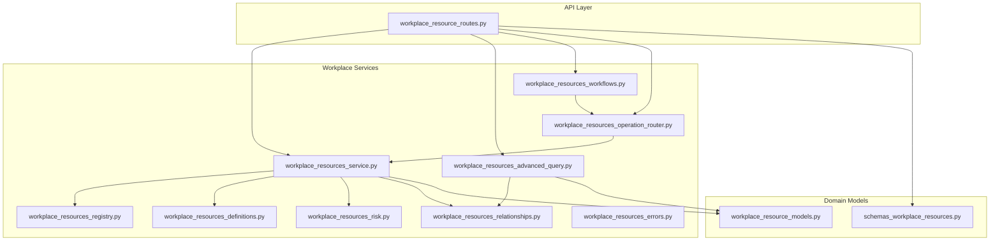
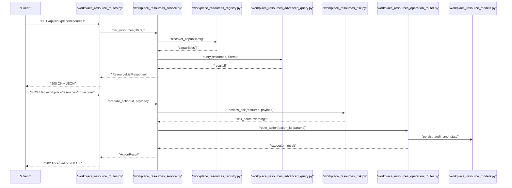
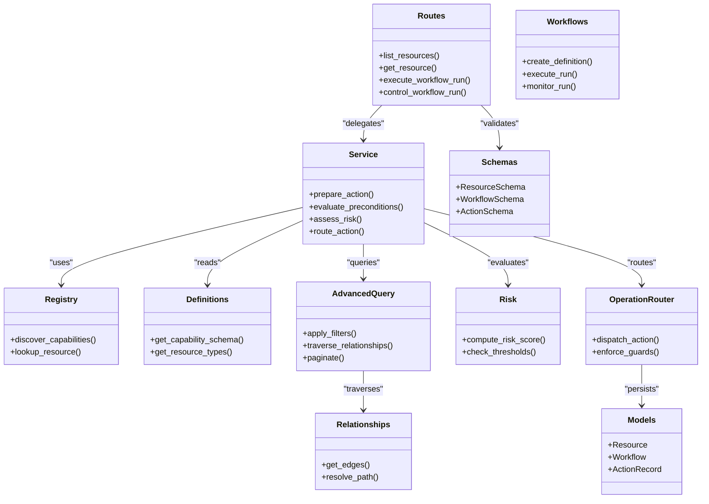

# Workplace Resources API

<cite>
**Referenced Files in This Document**
- [workplace_resource_routes.py](file://app/api/workplace_resource_routes.py)
- [workplace_resource_models.py](file://app/db/workplace_resource_models.py)
- [workplace_resources_definitions.py](file://app/workplace_resources/definitions.py)
- [workplace_resources_registry.py](file://app/workplace_resources/registry.py)
- [workplace_resources_service.py](file://app/workplace_resources/service.py)
- [workplace_resources_advanced_query.py](file://app/workplace_resources/advanced_query.py)
- [workplace_resources_relationships.py](file://app/workplace_resources/relationships.py)
- [workplace_resources_risk.py](file://app/workplace_resources/risk.py)
- [workplace_resources_workflows.py](file://app/workplace_resources/workflows.py)
- [workplace_resources_operation_router.py](file://app/workplace_resources/operation_router.py)
- [workplace_resources_errors.py](file://app/workplace_resources/errors.py)
- [schemas_workplace_resources.py](file://app/schemas/workplace_resources.py)
- [test_workplace_resource_registry.py](file://tests/test_workplace_resource_registry.py)
- [test_workplace_resource_reads.py](file://tests/test_workplace_resource_reads.py)
- [test_workplace_resource_actions.py](file://tests/test_workplace_resource_actions.py)
- [test_workplace_workflows.py](file://tests/test_workplace_workflows.py)
- [test_advanced_query.py](file://tests/test_advanced_query.py)
</cite>

## Table of Contents
1. [Introduction](#introduction)
2. [Project Structure](#project-structure)
3. [Core Components](#core-components)
4. [Architecture Overview](#architecture-overview)
5. [Detailed Component Analysis](#detailed-component-analysis)
6. [Dependency Analysis](#dependency-analysis)
7. [Performance Considerations](#performance-considerations)
8. [Troubleshooting Guide](#troubleshooting-guide)
9. [Conclusion](#conclusion)

## Introduction
This document provides comprehensive API documentation for the Workplace Resources subsystem, focusing on dynamic resource discovery, management, and workflow automation. It covers:
- Resource registry endpoints for discovering available workplace resources and their capabilities
- Advanced query APIs with filtering, relationship traversal, and performance optimization
- Workflow management endpoints for defining, executing, and monitoring automated workflows
- Resource risk assessment, preconditions validation, and operational action controls

The goal is to enable clients to discover resources, evaluate risks and preconditions, traverse relationships, and orchestrate safe, auditable operations through well-defined workflows.

## Project Structure
The Workplace Resources feature spans multiple layers:
- API routes expose HTTP endpoints for discovery, queries, actions, and workflows
- Domain models define persistent entities and lifecycle states
- Service layer implements business logic, including risk assessment and preconditions
- Registry and definitions provide capability metadata and runtime registration
- Advanced query engine supports filtering and relationship traversal
- Workflows define declarative automation with execution and monitoring

**Diagram sources**
- [workplace_resource_routes.py](file://app/api/workplace_resource_routes.py)
- [workplace_resource_models.py](file://app/db/workplace_resource_models.py)
- [workplace_resources_definitions.py](file://app/workplace_resources/definitions.py)
- [workplace_resources_registry.py](file://app/workplace_resources/registry.py)
- [workplace_resources_service.py](file://app/workplace_resources/service.py)
- [workplace_resources_advanced_query.py](file://app/workplace_resources/advanced_query.py)
- [workplace_resources_relationships.py](file://app/workplace_resources/relationships.py)
- [workplace_resources_risk.py](file://app/workplace_resources/risk.py)
- [workplace_resources_workflows.py](file://app/workplace_resources/workflows.py)
- [workplace_resources_operation_router.py](file://app/workplace_resources/operation_router.py)
- [workplace_resources_errors.py](file://app/workplace_resources/errors.py)
- [schemas_workplace_resources.py](file://app/schemas/workplace_resources.py)

**Section sources**
- [workplace_resource_routes.py](file://app/api/workplace_resource_routes.py)
- [workplace_resource_models.py](file://app/db/workplace_resource_models.py)
- [workplace_resources_definitions.py](file://app/workplace_resources/definitions.py)
- [workplace_resources_registry.py](file://app/workplace_resources/registry.py)
- [workplace_resources_service.py](file://app/workplace_resources/service.py)
- [workplace_resources_advanced_query.py](file://app/workplace_resources/advanced_query.py)
- [workplace_resources_relationships.py](file://app/workplace_resources/relationships.py)
- [workplace_resources_risk.py](file://app/workplace_resources/risk.py)
- [workplace_resources_workflows.py](file://app/workplace_resources/workflows.py)
- [workplace_resources_operation_router.py](file://app/workplace_resources/operation_router.py)
- [workplace_resources_errors.py](file://app/workplace_resources/errors.py)
- [schemas_workplace_resources.py](file://app/schemas/workplace_resources.py)

## Core Components
- Resource Registry: Central catalog of discovered resources and their declared capabilities. Clients can list, filter, and inspect capabilities.
- Definitions: Static and dynamic metadata describing resource types, attributes, and supported operations.
- Service Layer: Orchestrates discovery, querying, risk assessment, preconditions validation, and operation routing.
- Advanced Query Engine: Supports rich filtering, projection, sorting, pagination, and relationship traversal.
- Relationships: Graph-like navigation between resources (e.g., owner, dependency, containment).
- Risk Assessment: Evaluates operational risk based on resource state, context, and policy.
- Workflows: Declarative automation definitions with execution, monitoring, and control.
- Operation Router: Dispatches operational actions safely, enforcing preconditions and risk thresholds.
- Errors: Standardized error contracts for client handling.

**Section sources**
- [workplace_resources_registry.py](file://app/workplace_resources/registry.py)
- [workplace_resources_definitions.py](file://app/workplace_resources/definitions.py)
- [workplace_resources_service.py](file://app/workplace_resources/service.py)
- [workplace_resources_advanced_query.py](file://app/workplace_resources/advanced_query.py)
- [workplace_resources_relationships.py](file://app/workplace_resources/relationships.py)
- [workplace_resources_risk.py](file://app/workplace_resources/risk.py)
- [workplace_resources_workflows.py](file://app/workplace_resources/workflows.py)
- [workplace_resources_operation_router.py](file://app/workplace_resources/operation_router.py)
- [workplace_resources_errors.py](file://app/workplace_resources/errors.py)

## Architecture Overview
The API exposes RESTful endpoints that route to service functions. The service composes registry lookups, advanced queries, risk evaluation, and workflow orchestration. Operations are routed through a controlled router that enforces preconditions and risk policies before execution.

**Diagram sources**
- [workplace_resource_routes.py](file://app/api/workplace_resource_routes.py)
- [workplace_resources_service.py](file://app/workplace_resources/service.py)
- [workplace_resources_registry.py](file://app/workplace_resources/registry.py)
- [workplace_resources_advanced_query.py](file://app/workplace_resources/advanced_query.py)
- [workplace_resources_risk.py](file://app/workplace_resources/risk.py)
- [workplace_resources_operation_router.py](file://app/workplace_resources/operation_router.py)
- [workplace_resource_models.py](file://app/db/workplace_resource_models.py)

## Detailed Component Analysis

### Resource Registry Endpoints
Purpose: Discover available workplace resources and their capabilities.

Key endpoints:
- GET /api/workplace/resources
  - Purpose: List resources with optional filters (type, status, tags, ownership).
  - Query parameters: type, status, tag, owner, limit, offset, sort_by, order.
  - Response: Paginated list of resources with minimal metadata.
- GET /api/workplace/resources/{id}
  - Purpose: Retrieve detailed resource by ID.
  - Response: Full resource model including attributes and capabilities.
- GET /api/workplace/resources/capabilities
  - Purpose: Enumerate registered capabilities across all resources.
  - Response: Capability descriptors (names, inputs, outputs, constraints).

Behavior:
- Filtering uses the advanced query engine under the hood.
- Capabilities are sourced from the registry and definitions.
- Responses conform to schemas defined in the schemas module.

**Section sources**
- [workplace_resource_routes.py](file://app/api/workplace_resource_routes.py)
- [workplace_resources_registry.py](file://app/workplace_resources/registry.py)
- [workplace_resources_definitions.py](file://app/workplace_resources/definitions.py)
- [workplace_resources_advanced_query.py](file://app/workplace_resources/advanced_query.py)
- [schemas_workplace_resources.py](file://app/schemas/workplace_resources.py)

### Advanced Query API
Purpose: Provide powerful filtering, projection, sorting, pagination, and relationship traversal.

Capabilities:
- Filters: equality, inequality, range, contains, exists, composite conditions.
- Sorting: multi-field, ascending/descending.
- Pagination: cursor-based or offset/limit.
- Relationship traversal: follow edges like owner, dependencies, children.
- Projection: select fields to reduce payload size.

Example usage patterns:
- Find all active databases owned by team X with tag "production".
- Traverse dependencies of a service and return only reachable nodes within depth N.
- Sort results by last_updated descending with pagination.

Performance considerations:
- Use projections to minimize data transfer.
- Prefer cursor-based pagination for large datasets.
- Leverage indexes on frequently filtered fields.

**Section sources**
- [workplace_resources_advanced_query.py](file://app/workplace_resources/advanced_query.py)
- [workplace_resources_relationships.py](file://app/workplace_resources/relationships.py)
- [workplace_resource_models.py](file://app/db/workplace_resource_models.py)

### Workflow Management Endpoints
Purpose: Define, execute, and monitor automated workflows operating on workplace resources.

Endpoints:
- POST /api/workplace/workflows
  - Purpose: Create a new workflow definition.
  - Body: Workflow schema (steps, triggers, guards, approvals).
  - Response: Workflow id and version.
- GET /api/workplace/workflows/{id}
  - Purpose: Retrieve workflow definition and metadata.
- POST /api/workplace/workflows/{id}/runs
  - Purpose: Execute a workflow run with input parameters.
  - Response: Run id and initial state.
- GET /api/workplace/workflows/{id}/runs/{runId}
  - Purpose: Monitor run status, steps, and outcomes.
- PATCH /api/workplace/workflows/{id}/runs/{runId}
  - Purpose: Control run (pause, resume, cancel).
- DELETE /api/workplace/workflows/{id}
  - Purpose: Remove workflow definition (if not referenced).

Execution flow:
- Validation: Precondition checks and risk assessment per step.
- Execution: Step-by-step orchestration with retries and rollbacks where applicable.
- Monitoring: Real-time status updates via polling or SSE if enabled.

**Section sources**
- [workplace_resources_workflows.py](file://app/workplace_resources/workflows.py)
- [workplace_resources_service.py](file://app/workplace_resources/service.py)
- [workplace_resources_risk.py](file://app/workplace_resources/risk.py)
- [workplace_resources_operation_router.py](file://app/workplace_resources/operation_router.py)

### Operational Action Controls
Purpose: Safely perform actions on resources with preconditions and risk controls.

Controls:
- Preconditions: Validate resource state, permissions, and environment.
- Risk Assessment: Compute risk score and warnings; enforce thresholds.
- Routing: Dispatch to appropriate handlers with audit trail.
- Idempotency: Ensure safe retries without side effects.

Flow:
- Client submits action request with parameters.
- Service validates preconditions and assesses risk.
- Router executes action and persists audit events.
- Response includes result and any warnings.

**Section sources**
- [workplace_resources_operation_router.py](file://app/workplace_resources/operation_router.py)
- [workplace_resources_risk.py](file://app/workplace_resources/risk.py)
- [workplace_resources_service.py](file://app/workplace_resources/service.py)

### Data Models and Schemas
Purpose: Define persistent structures and wire formats for resources, workflows, and actions.

Highlights:
- Resource entity with attributes, capabilities, and lifecycle state.
- Workflow definition with steps, guards, and approvals.
- Action execution records with audit details.
- Schemas ensure consistent serialization and validation.

**Section sources**
- [workplace_resource_models.py](file://app/db/workplace_resource_models.py)
- [schemas_workplace_resources.py](file://app/schemas/workplace_resources.py)

### Error Handling
Purpose: Provide standardized error responses for clients.

Categories:
- Validation errors: Malformed requests or invalid parameters.
- Authorization errors: Insufficient permissions.
- Business errors: Preconditions failed, risk exceeded.
- System errors: Internal failures with trace IDs.

Clients should handle these consistently and present actionable messages.

**Section sources**
- [workplace_resources_errors.py](file://app/workplace_resources/errors.py)

## Dependency Analysis
The following diagram shows key dependencies among components:

**Diagram sources**
- [workplace_resource_routes.py](file://app/api/workplace_resource_routes.py)
- [workplace_resources_service.py](file://app/workplace_resources/service.py)
- [workplace_resources_registry.py](file://app/workplace_resources/registry.py)
- [workplace_resources_definitions.py](file://app/workplace_resources/definitions.py)
- [workplace_resources_advanced_query.py](file://app/workplace_resources/advanced_query.py)
- [workplace_resources_relationships.py](file://app/workplace_resources/relationships.py)
- [workplace_resources_risk.py](file://app/workplace_resources/risk.py)
- [workplace_resources_workflows.py](file://app/workplace_resources/workflows.py)
- [workplace_resources_operation_router.py](file://app/workplace_resources/operation_router.py)
- [workplace_resource_models.py](file://app/db/workplace_resource_models.py)
- [schemas_workplace_resources.py](file://app/schemas/workplace_resources.py)

**Section sources**
- [workplace_resource_routes.py](file://app/api/workplace_resource_routes.py)
- [workplace_resources_service.py](file://app/workplace_resources/service.py)
- [workplace_resources_registry.py](file://app/workplace_resources/registry.py)
- [workplace_resources_definitions.py](file://app/workplace_resources/definitions.py)
- [workplace_resources_advanced_query.py](file://app/workplace_resources/advanced_query.py)
- [workplace_resources_relationships.py](file://app/workplace_resources/relationships.py)
- [workplace_resources_risk.py](file://app/workplace_resources/risk.py)
- [workplace_resources_workflows.py](file://app/workplace_resources/workflows.py)
- [workplace_resources_operation_router.py](file://app/workplace_resources/operation_router.py)
- [workplace_resource_models.py](file://app/db/workplace_resource_models.py)
- [schemas_workplace_resources.py](file://app/schemas/workplace_resources.py)

## Performance Considerations
- Use projections in advanced queries to reduce payload sizes.
- Apply cursor-based pagination for large lists.
- Cache capability metadata when stable to avoid repeated registry calls.
- Index commonly filtered fields (type, status, owner, tags).
- Batch relationship traversals to avoid N+1 queries.
- Enforce timeouts and circuit breakers for external integrations invoked by actions.

[No sources needed since this section provides general guidance]

## Troubleshooting Guide
Common issues and resolutions:
- Validation errors: Check request body against schemas; ensure required fields are present.
- Authorization errors: Verify user roles and resource-level permissions.
- Preconditions failed: Review resource state and environment configuration; adjust inputs accordingly.
- Risk exceeded: Lower impact scope or obtain additional approvals; consult risk thresholds.
- Workflow runs stuck: Inspect run logs and step statuses; retry or cancel as appropriate.

Use standardized error codes and messages returned by the API to guide remediation.

**Section sources**
- [workplace_resources_errors.py](file://app/workplace_resources/errors.py)

## Conclusion
The Workplace Resources API provides a robust foundation for discovering resources, evaluating risks and preconditions, navigating relationships, and automating operations through workflows. By leveraging advanced queries, strict operational controls, and clear error contracts, clients can build reliable, safe, and efficient automation at scale.

[No sources needed since this section summarizes without analyzing specific files]