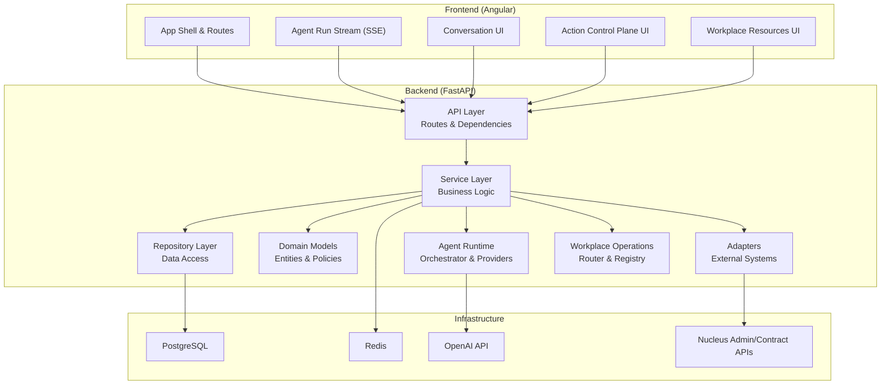
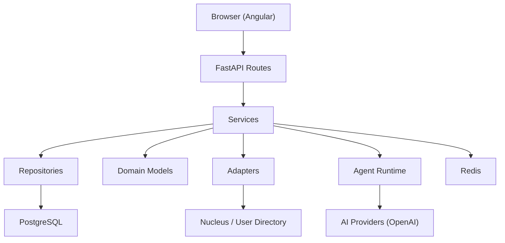
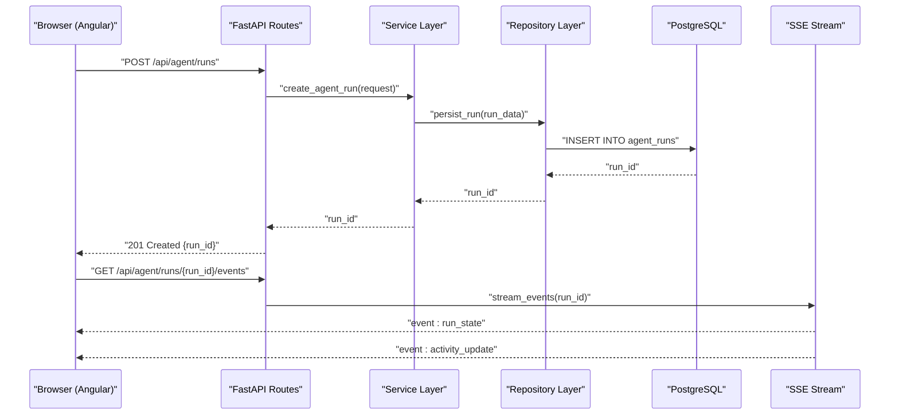
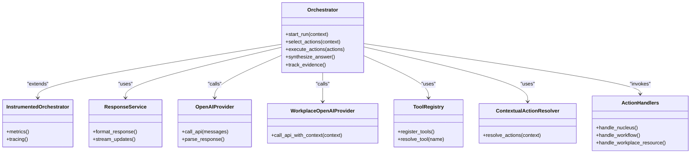
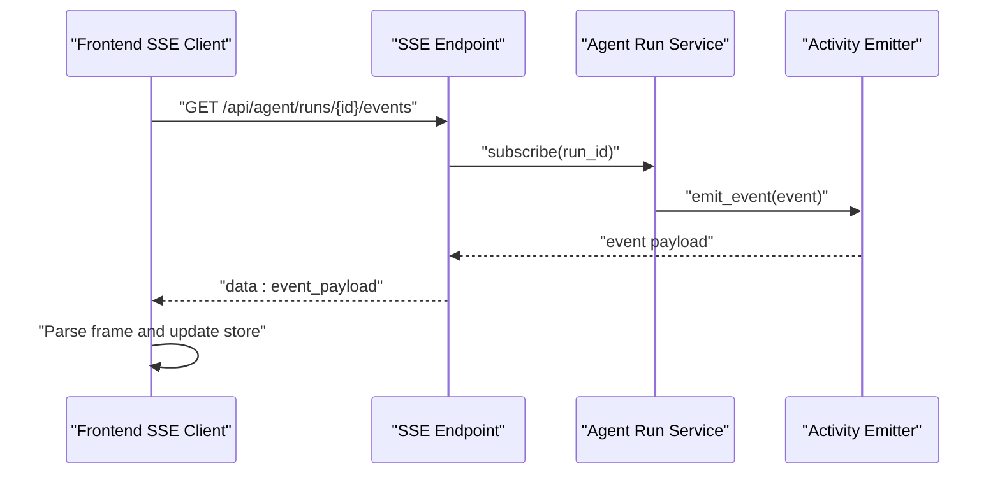
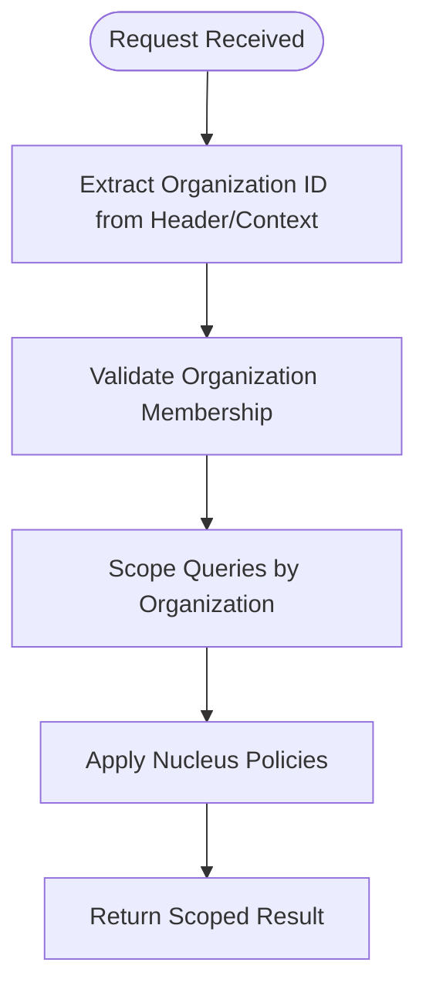
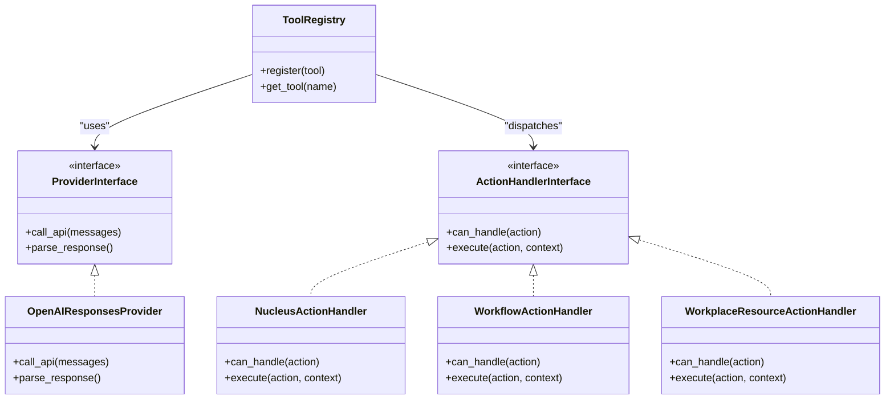
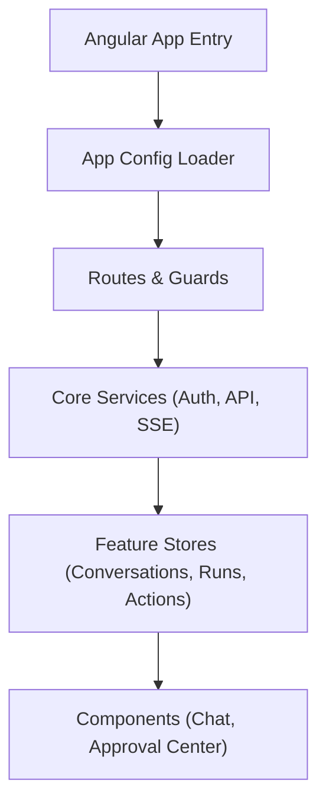
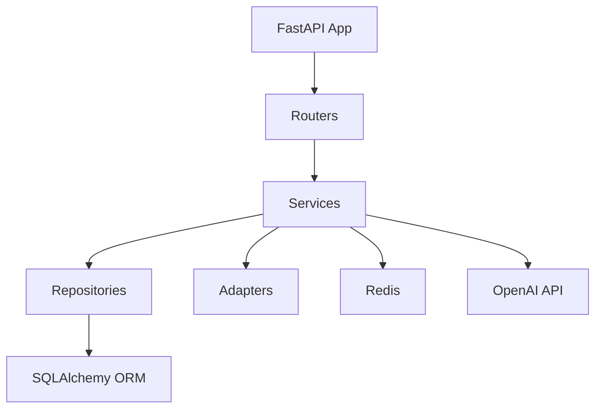

# Architecture Overview

<cite>
**Referenced Files in This Document**
- [main.py](file://app/main.py)
- [config.py](file://app/core/config.py)
- [security.py](file://app/core/security.py)
- [agent_routes.py](file://app/api/agent_routes.py)
- [conversation_routes.py](file://app/api/conversation_routes.py)
- [action_control_routes.py](file://app/api/action_control_routes.py)
- [workplace_resource_routes.py](file://app/api/workplace_resource_routes.py)
- [auth_routes.py](file://app/api/auth_routes.py)
- [health_routes.py](file://app/api/health_routes.py)
- [dependencies.py](file://app/api/dependencies.py)
- [agent_dependencies.py](file://app/api/agent_dependencies.py)
- [agent_run_routes.py](file://app/api/agent_run_routes.py)
- [orchestrator.py](file://app/agent/orchestrator.py)
- [instrumented_orchestrator.py](file://app/agent/instrumented_orchestrator.py)
- [response_service.py](file://app/agent/response_service.py)
- [openai_responses.py](file://app/agent/providers/openai_responses.py)
- [workplace_openai_responses.py](file://app/agent/providers/workplace_openai_responses.py)
- [action_handlers.py](file://app/agent/action_handlers.py)
- [nucleus_action_handlers.py](file://app/agent/nucleus_action_handlers.py)
- [workflow_action_handlers.py](file://app/agent/workflow_action_handlers.py)
- [workplace_resource_handlers.py](file://app/agent/workplace_resource_handlers.py)
- [tool_registry.py](file://app/agent/tool_registry.py)
- [contextual_action_resolver.py](file://app/agent/contextual_action_resolver.py)
- [action_selection.py](file://app/agent/action_selection.py)
- [run_runtime.py](file://app/agent/run_runtime.py)
- [synthesis.py](file://app/agent/synthesis.py)
- [evidence.py](file://app/agent/evidence.py)
- [contracts.py](file://app/agent/contracts.py)
- [answer_contracts.py](file://app/agent/answer_contracts.py)
- [run_contracts.py](file://app/agent/run_contracts.py)
- [action_contracts.py](file://app/agent/action_contracts.py)
- [action_control_contracts.py](file://app/agent/action_control_contracts.py)
- [action_errors.py](file://app/agent/action_errors.py)
- [errors.py](file://app/agent/errors.py)
- [base.py](file://app/db/base.py)
- [session.py](file://app/db/session.py)
- [orm_models.py](file://app/db/orm_models.py)
- [action_models.py](file://app/db/action_models.py)
- [agent_run_models.py](file://app/db/agent_run_models.py)
- [action_control_models.py](file://app/db/action_control_models.py)
- [nucleus_models.py](file://app/db/nucleus_models.py)
- [nucleus_admin_models.py](file://app/db/nucleus_admin_models.py)
- [nucleus_user_session.py](file://app/db/nucleus_user_session.py)
- [workplace_resource_models.py](file://app/db/workplace_resource_models.py)
- [models.py](file://app/domain/models.py)
- [nucleus_models.py](file://app/domain/nucleus_models.py)
- [nucleus_admin_models.py](file://app/domain/nucleus_admin_models.py)
- [nucleus_policy.py](file://app/domain/nucleus_policy.py)
- [effective_period.py](file://app/domain/effective_period.py)
- [enums.py](file://app/domain/enums.py)
- [organization_repository.py](file://app/repositories/organization_repository.py)
- [nucleus_organization_repository.py](file://app/repositories/nucleus_organization_repository.py)
- [nucleus_administration_repository.py](file://app/repositories/nucleus_administration_repository.py)
- [nucleus_actor_mapping_repository.py](file://app/repositories/nucleus_actor_mapping_repository.py)
- [nucleus_administration_projection_repository.py](file://app/repositories/nucleus_administration_projection_repository.py)
- [organization_overview_repository.py](file://app/repositories/organization_overview_repository.py)
- [user_repository.py](file://app/repositories/user_repository.py)
- [session_repository.py](file://app/repositories/session_repository.py)
- [seat_repository.py](file://app/repositories/seat_repository.py)
- [conversation_repository.py](file://app/repositories/conversation_repository.py)
- [conversation_search_repository.py](file://app/repositories/conversation_search_repository.py)
- [agent_action_repository.py](file://app/repositories/agent_action_repository.py)
- [hardened_agent_action_repository.py](file://app/repositories/hardened_agent_action_repository.py)
- [multi_approval_agent_action_repository.py](file://app/repositories/multi_approval_agent_action_repository.py)
- [agent_run_repository.py](file://app/repositories/agent_run_repository.py)
- [audit_repository.py](file://app/repositories/audit_repository.py)
- [report_repository.py](file://app/repositories/report_repository.py)
- [action_control_repository.py](file://app/repositories/action_control_repository.py)
- [organization_service.py](file://app/services/organization_service.py)
- [nucleus_organization_service.py](file://app/services/nucleus_organization_service.py)
- [agent_run_service.py](file://app/services/agent_run_service.py)
- [agent_run_worker.py](file://app/services/agent_run_worker.py)
- [agent_action_service.py](file://app/services/agent_action_service.py)
- [hardened_agent_action_service.py](file://app/services/hardened_agent_action_service.py)
- [release_ready_agent_action_service.py](file://app/services/release_ready_agent_action_service.py)
- [stale_safe_agent_action_service.py](file://app/services/stale_safe_agent_action_service.py)
- [action_control_service.py](file://app/services/action_control_service.py)
- [compaction_service.py](file://app/services/compaction_service.py)
- [context_memory_service.py](file://app/services/context_memory_service.py)
- [operational_resource_service.py](file://app/services/operational_resource_service.py)
- [agent_run_activity.py](file://app/services/agent_run_activity.py)
- [action_execution_activity.py](file://app/services/action_execution_activity.py)
- [agent_action_reconciliation_service.py](file://app/services/agent_action_reconciliation_service.py)
- [agent_preflight_service.py](file://app/services/agent_preflight_service.py)
- [permission_service.py](file://app/permissions/permission_service.py)
- [service.py](file://app/workplace_resources/service.py)
- [operation_router.py](file://app/workplace_resources/operation_router.py)
- [registry.py](file://app/workplace_resources/registry.py)
- [definitions.py](file://app/workplace_resources/definitions.py)
- [relationships.py](file://app/workplace_resources/relationships.py)
- [risk.py](file://app/workplace_resources/risk.py)
- [workflows.py](file://app/workplace_resources/workflows.py)
- [advanced_query.py](file://app/workplace_resources/advanced_query.py)
- [errors.py](file://app/workplace_resources/errors.py)
- [__init__.py](file://app/adapters/__init__.py)
- [contract.py](file://app/adapters/organization/contract.py)
- [mock_adapter.py](file://app/adapters/organization/mock_adapter.py)
- [provider.py](file://app/adapters/user/provider.py)
- [sandbox_adapter.py](file://app/adapters/user/sandbox_adapter.py)
- [admin_contract.py](file://app/adapters/nucleus/admin_contract.py)
- [contract.py](file://app/adapters/nucleus/contract.py)
- [schemas/agent.py](file://app/schemas/agent.py)
- [schemas/agent_actions.py](file://app/schemas/agent_actions.py)
- [schemas/agent_run.py](file://app/schemas/agent_run.py)
- [schemas/conversation.py](file://app/schemas/conversation.py)
- [schemas/organization.py](file://app/schemas/organization.py)
- [schemas/nucleus_organization.py](file://app/schemas/nucleus_organization.py)
- [schemas/user.py](file://app/schemas/user.py)
- [schemas/permission.py](file://app/schemas/permission.py)
- [schemas/seat.py](file://app/schemas/seat.py)
- [schemas/audit.py](file://app/schemas/audit.py)
- [schemas/report.py](file://app/schemas/report.py)
- [schemas/workplace_resources.py](file://app/schemas/workplace_resources.py)
- [schemas/action_control.py](file://app/schemas/action_control.py)
- [frontend/src/app/core/api/wire.schemas.ts](file://frontend/src/app/core/api/wire.schemas.ts)
- [frontend/src/app/core/api/wire.models.ts](file://frontend/src/app/core/api/wire.models.ts)
- [frontend/src/app/core/api/validated-http.service.ts](file://frontend/src/app/core/api/validated-http.service.ts)
- [frontend/src/app/core/api/request-id.interceptor.ts](file://frontend/src/app/core/api/request-id.interceptor.ts)
- [frontend/src/app/core/api/api-error.interceptor.ts](file://frontend/src/app/core/api/api-error.interceptor.ts)
- [frontend/src/app/core/api/workplace-agent-api.service.ts](file://frontend/src/app/core/api/workplace-agent-api.service.ts)
- [frontend/src/app/core/agent-run/agent-run-stream.service.ts](file://frontend/src/app/core/agent-run/agent-run-stream.service.ts)
- [frontend/src/app/core/agent-run/sse-frame-parser.ts](file://frontend/src/app/core/agent-run/sse-frame-parser.ts)
- [frontend/src/app/core/agent-run/agent-run-api.service.ts](file://frontend/src/app/core/agent-run/agent-run-api.service.ts)
- [frontend/src/app/core/conversation/conversation-api.service.ts](file://frontend/src/app/core/conversation/conversation-api.service.ts)
- [frontend/src/app/core/auth/auth.service.ts](file://frontend/src/app/core/auth/auth.service.ts)
- [frontend/src/app/core/auth/current-user.store.ts](file://frontend/src/app/core/auth/current-user.store.ts)
- [frontend/src/app/features/assistant-conversation/agent-conversation.store.ts](file://frontend/src/app/features/assistant-conversation/agent-conversation.store.ts)
- [frontend/src/app/features/assistant-conversation/agent-response.mapper.ts](file://frontend/src/app/features/assistant-conversation/agent-response.mapper.ts)
- [frontend/src/app/features/assistant-conversation/agent-activity.model.ts](file://frontend/src/app/features/assistant-conversation/agent-activity.model.ts)
- [frontend/src/app/features/assistant-conversation/agent-conversation.model.ts](file://frontend/src/app/features/assistant-conversation/agent-conversation.model.ts)
- [frontend/src/app/features/approval-center/proposal-control.facade.ts](file://frontend/src/app/core/action-control/proposal-control.facade.ts)
- [frontend/src/app/core/action-control/action-execution-stream.service.ts](file://frontend/src/app/core/action-control/action-execution-stream.service.ts)
- [frontend/src/app/core/action-control/action-control-api.service.ts](file://frontend/src/app/core/action-control/action-control-api.service.ts)
- [frontend/src/app/core/action-control/action-control.models.ts](file://frontend/src/app/core/action-control/action-control.models.ts)
- [frontend/src/app/core/action-control/action-control.schemas.ts](file://frontend/src/app/core/action-control/action-control.schemas.ts)
- [frontend/src/app/core/routing/organization-route.service.ts](file://frontend/src/app/core/routing/organization-route.service.ts)
- [frontend/src/app/layout/workspace/organization-workspace.component.ts](file://frontend/src/app/layout/workspace/organization-workspace.component.ts)
- [frontend/src/app/layout/workspace/chat-view.component.ts](file://frontend/src/app/layout/workspace/chat-view.component.ts)
- [frontend/src/app/layout/shell/shell-state.service.ts](file://frontend/src/app/layout/shell/shell-state.service.ts)
- [frontend/src/app/app.routes.ts](file://frontend/src/app/app.routes.ts)
- [frontend/src/app/app.config.ts](file://frontend/src/app/app.config.ts)
- [frontend/src/main.ts](file://frontend/src/main.ts)
- [frontend/public/config/app-config.json](file://frontend/public/config/app-config.json)
- [frontend/contracts/api-manifest.json](file://frontend/contracts/api-manifest.json)
- [frontend/contracts/agent-run-event.schema.json](file://frontend/contracts/agent-run-event.schema.json)
- [frontend/contracts/ui-event.schema.json](file://frontend/contracts/ui-event.schema.json)
- [docs/AGENT_RUNS_SSE.md](file://docs/AGENT_RUNS_SSE.md)
- [docs/ARCHITECTURE.md](file://docs/ARCHITECTURE.md)
- [docs/GOVERNED_ACTION_CONTROL_PLANE.md](file://docs/GOVERNED_ACTION_CONTROL_PLANE.md)
- [docs/WORKPLACE_WORKFLOWS.md](file://docs/WORKPLACE_WORKFLOWS.md)
- [docs/AGENT_NATIVE_RESOURCES.md](file://docs/AGENT_NATIVE_RESOURCES.md)
- [docs/ORGANIZATION_API_CONTRACTS.md](file://docs/ORGANIZATION_API_CONTRACTS.md)
- [docs/SECURITY_MODEL.md](file://docs/SECURITY_MODEL.md)
- [pyproject.toml](file://pyproject.toml)
</cite>

## Table of Contents
1. [Introduction](#introduction)
2. [Project Structure](#project-structure)
3. [Core Components](#core-components)
4. [Architecture Overview](#architecture-overview)
5. [Detailed Component Analysis](#detailed-component-analysis)
6. [Dependency Analysis](#dependency-analysis)
7. [Performance Considerations](#performance-considerations)
8. [Troubleshooting Guide](#troubleshooting-guide)
9. [Conclusion](#conclusion)
10. [Appendices](#appendices)

## Introduction
This document presents the architectural overview of the AI Agent Platform, focusing on its layered design (API, service, repository, domain), technology stack choices (FastAPI backend, Angular 17+ frontend, PostgreSQL persistence, Redis caching, OpenAI integration), event-driven real-time communication via Server-Sent Events (SSE), multi-organization tenant isolation, plugin architecture for extensible AI providers and action handlers, scalability considerations, deployment topology, and infrastructure requirements. The goal is to provide a comprehensive yet accessible guide for both technical and non-technical stakeholders.

## Project Structure
The platform follows a modular, feature-oriented structure with clear separation between API routes, services, repositories, domain models, adapters, and plugins:
- Backend (Python/FastAPI): app/ contains API routes, orchestration logic, agent runtime, services, repositories, domain models, database ORM, and adapters.
- Frontend (Angular 17+): frontend/src/ implements UI features, core services, SSE streaming, authentication, routing, and shared components.
- Contracts and Schemas: frontend/contracts/ defines JSON schemas and API manifests; app/schemas/ defines Pydantic request/response models.
- Documentation: docs/ provides detailed architecture and contract references.

**Diagram sources**
- [main.py:1-200](file://app/main.py#L1-L200)
- [agent_routes.py:1-200](file://app/api/agent_routes.py#L1-L200)
- [conversation_routes.py:1-200](file://app/api/conversation_routes.py#L1-L200)
- [action_control_routes.py:1-200](file://app/api/action_control_routes.py#L1-L200)
- [workplace_resource_routes.py:1-200](file://app/api/workplace_resource_routes.py#L1-L200)
- [orchestrator.py:1-200](file://app/agent/orchestrator.py#L1-L200)
- [openai_responses.py:1-200](file://app/agent/providers/openai_responses.py#L1-L200)
- [service.py:1-200](file://app/workplace_resources/service.py#L1-L200)
- [session.py:1-200](file://app/db/session.py#L1-L200)

**Section sources**
- [main.py:1-200](file://app/main.py#L1-L200)
- [config.py:1-200](file://app/core/config.py#L1-L200)
- [agent_routes.py:1-200](file://app/api/agent_routes.py#L1-L200)
- [conversation_routes.py:1-200](file://app/api/conversation_routes.py#L1-L200)
- [action_control_routes.py:1-200](file://app/api/action_control_routes.py#L1-L200)
- [workplace_resource_routes.py:1-200](file://app/api/workplace_resource_routes.py#L1-L200)
- [auth_routes.py:1-200](file://app/api/auth_routes.py#L1-L200)
- [health_routes.py:1-200](file://app/api/health_routes.py#L1-L200)
- [dependencies.py:1-200](file://app/api/dependencies.py#L1-L200)
- [agent_dependencies.py:1-200](file://app/api/agent_dependencies.py#L1-L200)
- [agent_run_routes.py:1-200](file://app/api/agent_run_routes.py#L1-L200)
- [orchestrator.py:1-200](file://app/agent/orchestrator.py#L1-L200)
- [instrumented_orchestrator.py:1-200](file://app/agent/instrumented_orchestrator.py#L1-L200)
- [response_service.py:1-200](file://app/agent/response_service.py#L1-L200)
- [openai_responses.py:1-200](file://app/agent/providers/openai_responses.py#L1-L200)
- [workplace_openai_responses.py:1-200](file://app/agent/providers/workplace_openai_responses.py#L1-L200)
- [action_handlers.py:1-200](file://app/agent/action_handlers.py#L1-L200)
- [nucleus_action_handlers.py:1-200](file://app/agent/nucleus_action_handlers.py#L1-L200)
- [workflow_action_handlers.py:1-200](file://app/agent/workflow_action_handlers.py#L1-L200)
- [workplace_resource_handlers.py:1-200](file://app/agent/workplace_resource_handlers.py#L1-L200)
- [tool_registry.py:1-200](file://app/agent/tool_registry.py#L1-L200)
- [contextual_action_resolver.py:1-200](file://app/agent/contextual_action_resolver.py#L1-L200)
- [action_selection.py:1-200](file://app/agent/action_selection.py#L1-L200)
- [run_runtime.py:1-200](file://app/agent/run_runtime.py#L1-L200)
- [synthesis.py:1-200](file://app/agent/synthesis.py#L1-L200)
- [evidence.py:1-200](file://app/agent/evidence.py#L1-L200)
- [contracts.py:1-200](file://app/agent/contracts.py#L1-L200)
- [answer_contracts.py:1-200](file://app/agent/answer_contracts.py#L1-L200)
- [run_contracts.py:1-200](file://app/agent/run_contracts.py#L1-L200)
- [action_contracts.py:1-200](file://app/agent/action_contracts.py#L1-L200)
- [action_control_contracts.py:1-200](file://app/agent/action_control_contracts.py#L1-L200)
- [action_errors.py:1-200](file://app/agent/action_errors.py#L1-L200)
- [errors.py:1-200](file://app/agent/errors.py#L1-L200)
- [base.py:1-200](file://app/db/base.py#L1-L200)
- [session.py:1-200](file://app/db/session.py#L1-L200)
- [orm_models.py:1-200](file://app/db/orm_models.py#L1-L200)
- [action_models.py:1-200](file://app/db/action_models.py#L1-L200)
- [agent_run_models.py:1-200](file://app/db/agent_run_models.py#L1-L200)
- [action_control_models.py:1-200](file://app/db/action_control_models.py#L1-L200)
- [nucleus_models.py:1-200](file://app/db/nucleus_models.py#L1-L200)
- [nucleus_admin_models.py:1-200](file://app/db/nucleus_admin_models.py#L1-L200)
- [nucleus_user_session.py:1-200](file://app/db/nucleus_user_session.py#L1-L200)
- [workplace_resource_models.py:1-200](file://app/db/workplace_resource_models.py#L1-L200)
- [models.py:1-200](file://app/domain/models.py#L1-L200)
- [nucleus_models.py:1-200](file://app/domain/nucleus_models.py#L1-L200)
- [nucleus_admin_models.py:1-200](file://app/domain/nucleus_admin_models.py#L1-L200)
- [nucleus_policy.py:1-200](file://app/domain/nucleus_policy.py#L1-L200)
- [effective_period.py:1-200](file://app/domain/effective_period.py#L1-L200)
- [enums.py:1-200](file://app/domain/enums.py#L1-L200)
- [organization_repository.py:1-200](file://app/repositories/organization_repository.py#L1-L200)
- [nucleus_organization_repository.py:1-200](file://app/repositories/nucleus_organization_repository.py#L1-L200)
- [nucleus_administration_repository.py:1-200](file://app/repositories/nucleus_administration_repository.py#L1-L200)
- [nucleus_actor_mapping_repository.py:1-200](file://app/repositories/nucleus_actor_mapping_repository.py#L1-L200)
- [nucleus_administration_projection_repository.py:1-200](file://app/repositories/nucleus_administration_projection_repository.py#L1-L200)
- [organization_overview_repository.py:1-200](file://app/repositories/organization_overview_repository.py#L1-L200)
- [user_repository.py:1-200](file://app/repositories/user_repository.py#L1-L200)
- [session_repository.py:1-200](file://app/repositories/session_repository.py#L1-L200)
- [seat_repository.py:1-200](file://app/repositories/seat_repository.py#L1-L200)
- [conversation_repository.py:1-200](file://app/repositories/conversation_repository.py#L1-L200)
- [conversation_search_repository.py:1-200](file://app/repositories/conversation_search_repository.py#L1-L200)
- [agent_action_repository.py:1-200](file://app/repositories/agent_action_repository.py#L1-L200)
- [hardened_agent_action_repository.py:1-200](file://app/repositories/hardened_agent_action_repository.py#L1-L200)
- [multi_approval_agent_action_repository.py:1-200](file://app/repositories/multi_approval_agent_action_repository.py#L1-L200)
- [agent_run_repository.py:1-200](file://app/repositories/agent_run_repository.py#L1-L200)
- [audit_repository.py:1-200](file://app/repositories/audit_repository.py#L1-L200)
- [report_repository.py:1-200](file://app/repositories/report_repository.py#L1-L200)
- [action_control_repository.py:1-200](file://app/repositories/action_control_repository.py#L1-L200)
- [organization_service.py:1-200](file://app/services/organization_service.py#L1-L200)
- [nucleus_organization_service.py:1-200](file://app/services/nucleus_organization_service.py#L1-L200)
- [agent_run_service.py:1-200](file://app/services/agent_run_service.py#L1-L200)
- [agent_run_worker.py:1-200](file://app/services/agent_run_worker.py#L1-L200)
- [agent_action_service.py:1-200](file://app/services/agent_action_service.py#L1-L200)
- [hardened_agent_action_service.py:1-200](file://app/services/hardened_agent_action_service.py#L1-L200)
- [release_ready_agent_action_service.py:1-200](file://app/services/release_ready_agent_action_service.py#L1-L200)
- [stale_safe_agent_action_service.py:1-200](file://app/services/stale_safe_agent_action_service.py#L1-L200)
- [action_control_service.py:1-200](file://app/services/action_control_service.py#L1-L200)
- [compaction_service.py:1-200](file://app/services/compaction_service.py#L1-L200)
- [context_memory_service.py:1-200](file://app/services/context_memory_service.py#L1-L200)
- [operational_resource_service.py:1-200](file://app/services/operational_resource_service.py#L1-L200)
- [agent_run_activity.py:1-200](file://app/services/agent_run_activity.py#L1-L200)
- [action_execution_activity.py:1-200](file://app/services/action_execution_activity.py#L1-L200)
- [agent_action_reconciliation_service.py:1-200](file://app/services/agent_action_reconciliation_service.py#L1-L200)
- [agent_preflight_service.py:1-200](file://app/services/agent_preflight_service.py#L1-L200)
- [permission_service.py:1-200](file://app/permissions/permission_service.py#L1-L200)
- [service.py:1-200](file://app/workplace_resources/service.py#L1-L200)
- [operation_router.py:1-200](file://app/workplace_resources/operation_router.py#L1-L200)
- [registry.py:1-200](file://app/workplace_resources/registry.py#L1-L200)
- [definitions.py:1-200](file://app/workplace_resources/definitions.py#L1-L200)
- [relationships.py:1-200](file://app/workplace_resources/relationships.py#L1-L200)
- [risk.py:1-200](file://app/workplace_resources/risk.py#L1-L200)
- [workflows.py:1-200](file://app/workplace_resources/workflows.py#L1-L200)
- [advanced_query.py:1-200](file://app/workplace_resources/advanced_query.py#L1-L200)
- [errors.py:1-200](file://app/workplace_resources/errors.py#L1-L200)
- [__init__.py:1-200](file://app/adapters/__init__.py#L1-L200)
- [contract.py:1-200](file://app/adapters/organization/contract.py#L1-L200)
- [mock_adapter.py:1-200](file://app/adapters/organization/mock_adapter.py#L1-L200)
- [provider.py:1-200](file://app/adapters/user/provider.py#L1-L200)
- [sandbox_adapter.py:1-200](file://app/adapters/user/sandbox_adapter.py#L1-L200)
- [admin_contract.py:1-200](file://app/adapters/nucleus/admin_contract.py#L1-L200)
- [contract.py:1-200](file://app/adapters/nucleus/contract.py#L1-L200)
- [schemas/agent.py:1-200](file://app/schemas/agent.py#L1-L200)
- [schemas/agent_actions.py:1-200](file://app/schemas/agent_actions.py#L1-L200)
- [schemas/agent_run.py:1-200](file://app/schemas/agent_run.py#L1-L200)
- [schemas/conversation.py:1-200](file://app/schemas/conversation.py#L1-L200)
- [schemas/organization.py:1-200](file://app/schemas/organization.py#L1-L200)
- [schemas/nucleus_organization.py:1-200](file://app/schemas/nucleus_organization.py#L1-L200)
- [schemas/user.py:1-200](file://app/schemas/user.py#L1-L200)
- [schemas/permission.py:1-200](file://app/schemas/permission.py#L1-L200)
- [schemas/seat.py:1-200](file://app/schemas/seat.py#L1-L200)
- [schemas/audit.py:1-200](file://app/schemas/audit.py#L1-L200)
- [schemas/report.py:1-200](file://app/schemas/report.py#L1-L200)
- [schemas/workplace_resources.py:1-200](file://app/schemas/workplace_resources.py#L1-L200)
- [schemas/action_control.py:1-200](file://app/schemas/action_control.py#L1-L200)
- [frontend/src/app/core/api/wire.schemas.ts:1-200](file://frontend/src/app/core/api/wire.schemas.ts#L1-L200)
- [frontend/src/app/core/api/wire.models.ts:1-200](file://frontend/src/app/core/api/wire.models.ts#L1-L200)
- [frontend/src/app/core/api/validated-http.service.ts:1-200](file://frontend/src/app/core/api/validated-http.service.ts#L1-L200)
- [frontend/src/app/core/api/request-id.interceptor.ts:1-200](file://frontend/src/app/core/api/request-id.interceptor.ts#L1-L200)
- [frontend/src/app/core/api/api-error.interceptor.ts:1-200](file://frontend/src/app/core/api/api-error.interceptor.ts#L1-L200)
- [frontend/src/app/core/api/workplace-agent-api.service.ts:1-200](file://frontend/src/app/core/api/workplace-agent-api.service.ts#L1-L200)
- [frontend/src/app/core/agent-run/agent-run-stream.service.ts:1-200](file://frontend/src/app/core/agent-run/agent-run-stream.service.ts#L1-L200)
- [frontend/src/app/core/agent-run/sse-frame-parser.ts:1-200](file://frontend/src/app/core/agent-run/sse-frame-parser.ts#L1-L200)
- [frontend/src/app/core/agent-run/agent-run-api.service.ts:1-200](file://frontend/src/app/core/agent-run/agent-run-api.service.ts#L1-L200)
- [frontend/src/app/core/conversation/conversation-api.service.ts:1-200](file://frontend/src/app/core/conversation/conversation-api.service.ts#L1-L200)
- [frontend/src/app/core/auth/auth.service.ts:1-200](file://frontend/src/app/core/auth/auth.service.ts#L1-L200)
- [frontend/src/app/core/auth/current-user.store.ts:1-200](file://frontend/src/app/core/auth/current-user.store.ts#L1-L200)
- [frontend/src/app/features/assistant-conversation/agent-conversation.store.ts:1-200](file://frontend/src/app/features/assistant-conversation/agent-conversation.store.ts#L1-L200)
- [frontend/src/app/features/assistant-conversation/agent-response.mapper.ts:1-200](file://frontend/src/app/features/assistant-conversation/agent-response.mapper.ts#L1-L200)
- [frontend/src/app/features/assistant-conversation/agent-activity.model.ts:1-200](file://frontend/src/app/features/assistant-conversation/agent-activity.model.ts#L1-L200)
- [frontend/src/app/features/assistant-conversation/agent-conversation.model.ts:1-200](file://frontend/src/app/features/assistant-conversation/agent-conversation.model.ts#L1-L200)
- [frontend/src/app/core/action-control/proposal-control.facade.ts:1-200](file://frontend/src/app/core/action-control/proposal-control.facade.ts#L1-L200)
- [frontend/src/app/core/action-control/action-execution-stream.service.ts:1-200](file://frontend/src/app/core/action-control/action-execution-stream.service.ts#L1-L200)
- [frontend/src/app/core/action-control/action-control-api.service.ts:1-200](file://frontend/src/app/core/action-control/action-control-api.service.ts#L1-L200)
- [frontend/src/app/core/action-control/action-control.models.ts:1-200](file://frontend/src/app/core/action-control/action-control.models.ts#L1-L200)
- [frontend/src/app/core/action-control/action-control.schemas.ts:1-200](file://frontend/src/app/core/action-control/action-control.schemas.ts#L1-L200)
- [frontend/src/app/core/routing/organization-route.service.ts:1-200](file://frontend/src/app/core/routing/organization-route.service.ts#L1-L200)
- [frontend/src/app/layout/workspace/organization-workspace.component.ts:1-200](file://frontend/src/app/layout/workspace/organization-workspace.component.ts#L1-L200)
- [frontend/src/app/layout/workspace/chat-view.component.ts:1-200](file://frontend/src/app/layout/workspace/chat-view.component.ts#L1-L200)
- [frontend/src/app/layout/shell/shell-state.service.ts:1-200](file://frontend/src/app/layout/shell/shell-state.service.ts#L1-L200)
- [frontend/src/app/app.routes.ts:1-200](file://frontend/src/app/app.routes.ts#L1-L200)
- [frontend/src/app/app.config.ts:1-200](file://frontend/src/app/app.config.ts#L1-L200)
- [frontend/src/main.ts:1-200](file://frontend/src/main.ts#L1-L200)
- [frontend/public/config/app-config.json:1-200](file://frontend/public/config/app-config.json#L1-L200)
- [frontend/contracts/api-manifest.json:1-200](file://frontend/contracts/api-manifest.json#L1-L200)
- [frontend/contracts/agent-run-event.schema.json:1-200](file://frontend/contracts/agent-run-event.schema.json#L1-L200)
- [frontend/contracts/ui-event.schema.json:1-200](file://frontend/contracts/ui-event.schema.json#L1-L200)
- [docs/AGENT_RUNS_SSE.md:1-200](file://docs/AGENT_RUNS_SSE.md#L1-L200)
- [docs/ARCHITECTURE.md:1-200](file://docs/ARCHITECTURE.md#L1-L200)
- [docs/GOVERNED_ACTION_CONTROL_PLANE.md:1-200](file://docs/GOVERNED_ACTION_CONTROL_PLANE.md#L1-L200)
- [docs/WORKPLACE_WORKFLOWS.md:1-200](file://docs/WORKPLACE_WORKFLOWS.md#L1-L200)
- [docs/AGENT_NATIVE_RESOURCES.md:1-200](file://docs/AGENT_NATIVE_RESOURCES.md#L1-L200)
- [docs/ORGANIZATION_API_CONTRACTS.md:1-200](file://docs/ORGANIZATION_API_CONTRACTS.md#L1-L200)
- [docs/SECURITY_MODEL.md:1-200](file://docs/SECURITY_MODEL.md#L1-L200)
- [pyproject.toml:1-200](file://pyproject.toml#L1-L200)

## Core Components
- API Layer: FastAPI routes expose REST endpoints for agents, conversations, actions, workplace resources, auth, health, and run control. Route dependencies inject services, repositories, and configuration.
- Service Layer: Business logic orchestrates agent runs, action control, organization management, permissions, compaction, context memory, and operational resources.
- Repository Layer: Data access abstractions over PostgreSQL using SQLAlchemy ORM models, including specialized repositories for hardened actions, multi-approval workflows, audit, reports, and search.
- Domain Models: Pure Python entities and policies encapsulating business rules, effective periods, enums, and nucleus-specific models.
- Agent Runtime: Orchestrator coordinates provider calls (OpenAI), tool registry, contextual action resolution, synthesis, evidence tracking, and answer contracts.
- Workplace Operations: Router and registry manage resource definitions, relationships, risk assessment, workflows, and advanced queries.
- Adapters: Pluggable integrations for external systems like Nucleus admin APIs and user directories.

Key responsibilities:
- Real-time updates via SSE for agent runs and action execution events.
- Multi-tenant isolation by organization context propagated through requests and enforced at service/repository boundaries.
- Extensibility via plugin registries for AI providers and action handlers.

**Section sources**
- [agent_routes.py:1-200](file://app/api/agent_routes.py#L1-L200)
- [conversation_routes.py:1-200](file://app/api/conversation_routes.py#L1-L200)
- [action_control_routes.py:1-200](file://app/api/action_control_routes.py#L1-L200)
- [workplace_resource_routes.py:1-200](file://app/api/workplace_resource_routes.py#L1-L200)
- [auth_routes.py:1-200](file://app/api/auth_routes.py#L1-L200)
- [health_routes.py:1-200](file://app/api/health_routes.py#L1-L200)
- [dependencies.py:1-200](file://app/api/dependencies.py#L1-L200)
- [agent_dependencies.py:1-200](file://app/api/agent_dependencies.py#L1-L200)
- [agent_run_routes.py:1-200](file://app/api/agent_run_routes.py#L1-L200)
- [orchestrator.py:1-200](file://app/agent/orchestrator.py#L1-L200)
- [instrumented_orchestrator.py:1-200](file://app/agent/instrumented_orchestrator.py#L1-L200)
- [response_service.py:1-200](file://app/agent/response_service.py#L1-L200)
- [openai_responses.py:1-200](file://app/agent/providers/openai_responses.py#L1-L200)
- [workplace_openai_responses.py:1-200](file://app/agent/providers/workplace_openai_responses.py#L1-L200)
- [action_handlers.py:1-200](file://app/agent/action_handlers.py#L1-L200)
- [nucleus_action_handlers.py:1-200](file://app/agent/nucleus_action_handlers.py#L1-L200)
- [workflow_action_handlers.py:1-200](file://app/agent/workflow_action_handlers.py#L1-L200)
- [workplace_resource_handlers.py:1-200](file://app/agent/workplace_resource_handlers.py#L1-L200)
- [tool_registry.py:1-200](file://app/agent/tool_registry.py#L1-L200)
- [contextual_action_resolver.py:1-200](file://app/agent/contextual_action_resolver.py#L1-L200)
- [action_selection.py:1-200](file://app/agent/action_selection.py#L1-L200)
- [run_runtime.py:1-200](file://app/agent/run_runtime.py#L1-L200)
- [synthesis.py:1-200](file://app/agent/synthesis.py#L1-L200)
- [evidence.py:1-200](file://app/agent/evidence.py#L1-L200)
- [contracts.py:1-200](file://app/agent/contracts.py#L1-L200)
- [answer_contracts.py:1-200](file://app/agent/answer_contracts.py#L1-L200)
- [run_contracts.py:1-200](file://app/agent/run_contracts.py#L1-L200)
- [action_contracts.py:1-200](file://app/agent/action_contracts.py#L1-L200)
- [action_control_contracts.py:1-200](file://app/agent/action_control_contracts.py#L1-L200)
- [action_errors.py:1-200](file://app/agent/action_errors.py#L1-L200)
- [errors.py:1-200](file://app/agent/errors.py#L1-L200)
- [service.py:1-200](file://app/workplace_resources/service.py#L1-L200)
- [operation_router.py:1-200](file://app/workplace_resources/operation_router.py#L1-L200)
- [registry.py:1-200](file://app/workplace_resources/registry.py#L1-L200)
- [definitions.py:1-200](file://app/workplace_resources/definitions.py#L1-L200)
- [relationships.py:1-200](file://app/workplace_resources/relationships.py#L1-L200)
- [risk.py:1-200](file://app/workplace_resources/risk.py#L1-L200)
- [workflows.py:1-200](file://app/workplace_resources/workflows.py#L1-L200)
- [advanced_query.py:1-200](file://app/workplace_resources/advanced_query.py#L1-L200)
- [errors.py:1-200](file://app/workplace_resources/errors.py#L1-L200)
- [organization_service.py:1-200](file://app/services/organization_service.py#L1-L200)
- [nucleus_organization_service.py:1-200](file://app/services/nucleus_organization_service.py#L1-L200)
- [agent_run_service.py:1-200](file://app/services/agent_run_service.py#L1-L200)
- [agent_run_worker.py:1-200](file://app/services/agent_run_worker.py#L1-L200)
- [agent_action_service.py:1-200](file://app/services/agent_action_service.py#L1-L200)
- [hardened_agent_action_service.py:1-200](file://app/services/hardened_agent_action_service.py#L1-L200)
- [release_ready_agent_action_service.py:1-200](file://app/services/release_ready_agent_action_service.py#L1-L200)
- [stale_safe_agent_action_service.py:1-200](file://app/services/stale_safe_agent_action_service.py#L1-L200)
- [action_control_service.py:1-200](file://app/services/action_control_service.py#L1-L200)
- [compaction_service.py:1-200](file://app/services/compaction_service.py#L1-L200)
- [context_memory_service.py:1-200](file://app/services/context_memory_service.py#L1-L200)
- [operational_resource_service.py:1-200](file://app/services/operational_resource_service.py#L1-L200)
- [agent_run_activity.py:1-200](file://app/services/agent_run_activity.py#L1-L200)
- [action_execution_activity.py:1-200](file://app/services/action_execution_activity.py#L1-L200)
- [agent_action_reconciliation_service.py:1-200](file://app/services/agent_action_reconciliation_service.py#L1-L200)
- [agent_preflight_service.py:1-200](file://app/services/agent_preflight_service.py#L1-L200)
- [permission_service.py:1-200](file://app/permissions/permission_service.py#L1-L200)
- [organization_repository.py:1-200](file://app/repositories/organization_repository.py#L1-L200)
- [nucleus_organization_repository.py:1-200](file://app/repositories/nucleus_organization_repository.py#L1-L200)
- [nucleus_administration_repository.py:1-200](file://app/repositories/nucleus_administration_repository.py#L1-L200)
- [nucleus_actor_mapping_repository.py:1-200](file://app/repositories/nucleus_actor_mapping_repository.py#L1-L200)
- [nucleus_administration_projection_repository.py:1-200](file://app/repositories/nucleus_administration_projection_repository.py#L1-L200)
- [organization_overview_repository.py:1-200](file://app/repositories/organization_overview_repository.py#L1-L200)
- [user_repository.py:1-200](file://app/repositories/user_repository.py#L1-L200)
- [session_repository.py:1-200](file://app/repositories/session_repository.py#L1-L200)
- [seat_repository.py:1-200](file://app/repositories/seat_repository.py#L1-L200)
- [conversation_repository.py:1-200](file://app/repositories/conversation_repository.py#L1-L200)
- [conversation_search_repository.py:1-200](file://app/repositories/conversation_search_repository.py#L1-L200)
- [agent_action_repository.py:1-200](file://app/repositories/agent_action_repository.py#L1-L200)
- [hardened_agent_action_repository.py:1-200](file://app/repositories/hardened_agent_action_repository.py#L1-L200)
- [multi_approval_agent_action_repository.py:1-200](file://app/repositories/multi_approval_agent_action_repository.py#L1-L200)
- [agent_run_repository.py:1-200](file://app/repositories/agent_run_repository.py#L1-L200)
- [audit_repository.py:1-200](file://app/repositories/audit_repository.py#L1-L200)
- [report_repository.py:1-200](file://app/repositories/report_repository.py#L1-L200)
- [action_control_repository.py:1-200](file://app/repositories/action_control_repository.py#L1-L200)
- [models.py:1-200](file://app/domain/models.py#L1-L200)
- [nucleus_models.py:1-200](file://app/domain/nucleus_models.py#L1-L200)
- [nucleus_admin_models.py:1-200](file://app/domain/nucleus_admin_models.py#L1-L200)
- [nucleus_policy.py:1-200](file://app/domain/nucleus_policy.py#L1-L200)
- [effective_period.py:1-200](file://app/domain/effective_period.py#L1-L200)
- [enums.py:1-200](file://app/domain/enums.py#L1-L200)

## Architecture Overview
The system employs a layered architecture with clear separation of concerns:
- API layer exposes HTTP endpoints and manages request lifecycle, validation, and dependency injection.
- Service layer encapsulates business logic, orchestrating agent runs, action control, and organizational operations.
- Repository layer abstracts data access to PostgreSQL, providing typed queries and transactional boundaries.
- Domain layer holds pure business entities and policies, ensuring consistency across layers.
- Agent runtime integrates with external AI providers (OpenAI) and supports pluggable providers and action handlers.
- Workplace operations define resource-centric capabilities with workflow support and risk assessment.

**Diagram sources**
- [main.py:1-200](file://app/main.py#L1-L200)
- [agent_routes.py:1-200](file://app/api/agent_routes.py#L1-L200)
- [conversation_routes.py:1-200](file://app/api/conversation_routes.py#L1-L200)
- [action_control_routes.py:1-200](file://app/api/action_control_routes.py#L1-L200)
- [workplace_resource_routes.py:1-200](file://app/api/workplace_resource_routes.py#L1-L200)
- [auth_routes.py:1-200](file://app/api/auth_routes.py#L1-L200)
- [health_routes.py:1-200](file://app/api/health_routes.py#L1-L200)
- [dependencies.py:1-200](file://app/api/dependencies.py#L1-L200)
- [agent_dependencies.py:1-200](file://app/api/agent_dependencies.py#L1-L200)
- [agent_run_routes.py:1-200](file://app/api/agent_run_routes.py#L1-L200)
- [orchestrator.py:1-200](file://app/agent/orchestrator.py#L1-L200)
- [instrumented_orchestrator.py:1-200](file://app/agent/instrumented_orchestrator.py#L1-L200)
- [response_service.py:1-200](file://app/agent/response_service.py#L1-L200)
- [openai_responses.py:1-200](file://app/agent/providers/openai_responses.py#L1-L200)
- [workplace_openai_responses.py:1-200](file://app/agent/providers/workplace_openai_responses.py#L1-L200)
- [service.py:1-200](file://app/workplace_resources/service.py#L1-L200)
- [operation_router.py:1-200](file://app/workplace_resources/operation_router.py#L1-L200)
- [registry.py:1-200](file://app/workplace_resources/registry.py#L1-L200)
- [definitions.py:1-200](file://app/workplace_resources/definitions.py#L1-L200)
- [relationships.py:1-200](file://app/workplace_resources/relationships.py#L1-L200)
- [risk.py:1-200](file://app/workplace_resources/risk.py#L1-L200)
- [workflows.py:1-200](file://app/workplace_resources/workflows.py#L1-L200)
- [advanced_query.py:1-200](file://app/workplace_resources/advanced_query.py#L1-L200)
- [errors.py:1-200](file://app/workplace_resources/errors.py#L1-L200)
- [organization_service.py:1-200](file://app/services/organization_service.py#L1-L200)
- [nucleus_organization_service.py:1-200](file://app/services/nucleus_organization_service.py#L1-L200)
- [agent_run_service.py:1-200](file://app/services/agent_run_service.py#L1-L200)
- [agent_run_worker.py:1-200](file://app/services/agent_run_worker.py#L1-L200)
- [agent_action_service.py:1-200](file://app/services/agent_action_service.py#L1-L200)
- [hardened_agent_action_service.py:1-200](file://app/services/hardened_agent_action_service.py#L1-L200)
- [release_ready_agent_action_service.py:1-200](file://app/services/release_ready_agent_action_service.py#L1-L200)
- [stale_safe_agent_action_service.py:1-200](file://app/services/stale_safe_agent_action_service.py#L1-L200)
- [action_control_service.py:1-200](file://app/services/action_control_service.py#L1-L200)
- [compaction_service.py:1-200](file://app/services/compaction_service.py#L1-L200)
- [context_memory_service.py:1-200](file://app/services/context_memory_service.py#L1-L200)
- [operational_resource_service.py:1-200](file://app/services/operational_resource_service.py#L1-L200)
- [agent_run_activity.py:1-200](file://app/services/agent_run_activity.py#L1-L200)
- [action_execution_activity.py:1-200](file://app/services/action_execution_activity.py#L1-L200)
- [agent_action_reconciliation_service.py:1-200](file://app/services/agent_action_reconciliation_service.py#L1-L200)
- [agent_preflight_service.py:1-200](file://app/services/agent_preflight_service.py#L1-L200)
- [permission_service.py:1-200](file://app/permissions/permission_service.py#L1-L200)
- [organization_repository.py:1-200](file://app/repositories/organization_repository.py#L1-L200)
- [nucleus_organization_repository.py:1-200](file://app/repositories/nucleus_organization_repository.py#L1-L200)
- [nucleus_administration_repository.py:1-200](file://app/repositories/nucleus_administration_repository.py#L1-L200)
- [nucleus_actor_mapping_repository.py:1-200](file://app/repositories/nucleus_actor_mapping_repository.py#L1-L200)
- [nucleus_administration_projection_repository.py:1-200](file://app/repositories/nucleus_administration_projection_repository.py#L1-L200)
- [organization_overview_repository.py:1-200](file://app/repositories/organization_overview_repository.py#L1-L200)
- [user_repository.py:1-200](file://app/repositories/user_repository.py#L1-L200)
- [session_repository.py:1-200](file://app/repositories/session_repository.py#L1-L200)
- [seat_repository.py:1-200](file://app/repositories/seat_repository.py#L1-L200)
- [conversation_repository.py:1-200](file://app/repositories/conversation_repository.py#L1-L200)
- [conversation_search_repository.py:1-200](file://app/repositories/conversation_search_repository.py#L1-L200)
- [agent_action_repository.py:1-200](file://app/repositories/agent_action_repository.py#L1-L200)
- [hardened_agent_action_repository.py:1-200](file://app/repositories/hardened_agent_action_repository.py#L1-L200)
- [multi_approval_agent_action_repository.py:1-200](file://app/repositories/multi_approval_agent_action_repository.py#L1-L200)
- [agent_run_repository.py:1-200](file://app/repositories/agent_run_repository.py#L1-L200)
- [audit_repository.py:1-200](file://app/repositories/audit_repository.py#L1-L200)
- [report_repository.py:1-200](file://app/repositories/report_repository.py#L1-L200)
- [action_control_repository.py:1-200](file://app/repositories/action_control_repository.py#L1-L200)
- [models.py:1-200](file://app/domain/models.py#L1-L200)
- [nucleus_models.py:1-200](file://app/domain/nucleus_models.py#L1-L200)
- [nucleus_admin_models.py:1-200](file://app/domain/nucleus_admin_models.py#L1-L200)
- [nucleus_policy.py:1-200](file://app/domain/nucleus_policy.py#L1-L200)
- [effective_period.py:1-200](file://app/domain/effective_period.py#L1-L200)
- [enums.py:1-200](file://app/domain/enums.py#L1-L200)

## Detailed Component Analysis

### API Layer and Request Flow
The API layer uses FastAPI routers to handle HTTP requests, validate payloads with Pydantic schemas, and inject dependencies such as services, repositories, and configuration. Authentication and authorization are applied via middleware and route-level guards. SSE endpoints stream real-time events for agent runs and action control.

**Diagram sources**
- [agent_run_routes.py:1-200](file://app/api/agent_run_routes.py#L1-L200)
- [agent_run_service.py:1-200](file://app/services/agent_run_service.py#L1-L200)
- [agent_run_repository.py:1-200](file://app/repositories/agent_run_repository.py#L1-L200)
- [agent_run_models.py:1-200](file://app/db/agent_run_models.py#L1-L200)
- [agent_run_activity.py:1-200](file://app/services/agent_run_activity.py#L1-L200)

**Section sources**
- [agent_routes.py:1-200](file://app/api/agent_routes.py#L1-L200)
- [conversation_routes.py:1-200](file://app/api/conversation_routes.py#L1-L200)
- [action_control_routes.py:1-200](file://app/api/action_control_routes.py#L1-L200)
- [workplace_resource_routes.py:1-200](file://app/api/workplace_resource_routes.py#L1-L200)
- [auth_routes.py:1-200](file://app/api/auth_routes.py#L1-L200)
- [health_routes.py:1-200](file://app/api/health_routes.py#L1-L200)
- [dependencies.py:1-200](file://app/api/dependencies.py#L1-L200)
- [agent_dependencies.py:1-200](file://app/api/agent_dependencies.py#L1-L200)
- [agent_run_routes.py:1-200](file://app/api/agent_run_routes.py#L1-L200)

### Agent Orchestration and Provider Plugins
The agent orchestrator coordinates conversation flows, selects tools/actions, synthesizes answers, and tracks evidence. It integrates with pluggable AI providers (OpenAI responses) and supports workplace-specific providers. Action handlers implement specific behaviors for nucleus, workflows, and workplace resources.

**Diagram sources**
- [orchestrator.py:1-200](file://app/agent/orchestrator.py#L1-L200)
- [instrumented_orchestrator.py:1-200](file://app/agent/instrumented_orchestrator.py#L1-L200)
- [response_service.py:1-200](file://app/agent/response_service.py#L1-L200)
- [openai_responses.py:1-200](file://app/agent/providers/openai_responses.py#L1-L200)
- [workplace_openai_responses.py:1-200](file://app/agent/providers/workplace_openai_responses.py#L1-L200)
- [tool_registry.py:1-200](file://app/agent/tool_registry.py#L1-L200)
- [contextual_action_resolver.py:1-200](file://app/agent/contextual_action_resolver.py#L1-L200)
- [action_handlers.py:1-200](file://app/agent/action_handlers.py#L1-L200)
- [nucleus_action_handlers.py:1-200](file://app/agent/nucleus_action_handlers.py#L1-L200)
- [workflow_action_handlers.py:1-200](file://app/agent/workflow_action_handlers.py#L1-L200)
- [workplace_resource_handlers.py:1-200](file://app/agent/workplace_resource_handlers.py#L1-L200)

**Section sources**
- [orchestrator.py:1-200](file://app/agent/orchestrator.py#L1-L200)
- [instrumented_orchestrator.py:1-200](file://app/agent/instrumented_orchestrator.py#L1-L200)
- [response_service.py:1-200](file://app/agent/response_service.py#L1-L200)
- [openai_responses.py:1-200](file://app/agent/providers/openai_responses.py#L1-L200)
- [workplace_openai_responses.py:1-200](file://app/agent/providers/workplace_openai_responses.py#L1-L200)
- [tool_registry.py:1-200](file://app/agent/tool_registry.py#L1-L200)
- [contextual_action_resolver.py:1-200](file://app/agent/contextual_action_resolver.py#L1-L200)
- [action_handlers.py:1-200](file://app/agent/action_handlers.py#L1-L200)
- [nucleus_action_handlers.py:1-200](file://app/agent/nucleus_action_handlers.py#L1-L200)
- [workflow_action_handlers.py:1-200](file://app/agent/workflow_action_handlers.py#L1-L200)
- [workplace_resource_handlers.py:1-200](file://app/agent/workplace_resource_handlers.py#L1-L200)

### Event-Driven Real-Time Communication (SSE)
Server-Sent Events enable real-time updates from backend to frontend for agent runs and action control. The frontend parses SSE frames and maps them to UI state changes.

**Diagram sources**
- [agent_run_stream.service.ts:1-200](file://frontend/src/app/core/agent-run/agent-run-stream.service.ts#L1-L200)
- [sse-frame-parser.ts:1-200](file://frontend/src/app/core/agent-run/sse-frame-parser.ts#L1-L200)
- [agent_run_activity.py:1-200](file://app/services/agent_run_activity.py#L1-L200)
- [agent_run_routes.py:1-200](file://app/api/agent_run_routes.py#L1-L200)

**Section sources**
- [agent_run_stream.service.ts:1-200](file://frontend/src/app/core/agent-run/agent-run-stream.service.ts#L1-L200)
- [sse-frame-parser.ts:1-200](file://frontend/src/app/core/agent-run/sse-frame-parser.ts#L1-L200)
- [agent_run_activity.py:1-200](file://app/services/agent_run_activity.py#L1-L200)
- [agent_run_routes.py:1-200](file://app/api/agent_run_routes.py#L1-L200)

### Multi-Organization Tenant Isolation
Tenant isolation is enforced by propagating organization context through requests and applying it at service and repository boundaries. Organization repositories and services ensure data scoping and policy enforcement.

**Diagram sources**
- [organization_repository.py:1-200](file://app/repositories/organization_repository.py#L1-L200)
- [nucleus_organization_repository.py:1-200](file://app/repositories/nucleus_organization_repository.py#L1-L200)
- [nucleus_administration_repository.py:1-200](file://app/repositories/nucleus_administration_repository.py#L1-L200)
- [nucleus_actor_mapping_repository.py:1-200](file://app/repositories/nucleus_actor_mapping_repository.py#L1-L200)
- [nucleus_administration_projection_repository.py:1-200](file://app/repositories/nucleus_administration_projection_repository.py#L1-L200)
- [organization_overview_repository.py:1-200](file://app/repositories/organization_overview_repository.py#L1-L200)
- [organization_service.py:1-200](file://app/services/organization_service.py#L1-L200)
- [nucleus_organization_service.py:1-200](file://app/services/nucleus_organization_service.py#L1-L200)
- [nucleus_policy.py:1-200](file://app/domain/nucleus_policy.py#L1-L200)

**Section sources**
- [organization_repository.py:1-200](file://app/repositories/organization_repository.py#L1-L200)
- [nucleus_organization_repository.py:1-200](file://app/repositories/nucleus_organization_repository.py#L1-L200)
- [nucleus_administration_repository.py:1-200](file://app/repositories/nucleus_administration_repository.py#L1-L200)
- [nucleus_actor_mapping_repository.py:1-200](file://app/repositories/nucleus_actor_mapping_repository.py#L1-L200)
- [nucleus_administration_projection_repository.py:1-200](file://app/repositories/nucleus_administration_projection_repository.py#L1-L200)
- [organization_overview_repository.py:1-200](file://app/repositories/organization_overview_repository.py#L1-L200)
- [organization_service.py:1-200](file://app/services/organization_service.py#L1-L200)
- [nucleus_organization_service.py:1-200](file://app/services/nucleus_organization_service.py#L1-L200)
- [nucleus_policy.py:1-200](file://app/domain/nucleus_policy.py#L1-L200)

### Plugin Architecture for AI Providers and Action Handlers
Extensibility is achieved through registries and contracts:
- AI Providers: Implement standardized interfaces to integrate new LLM backends.
- Action Handlers: Register handlers for nucleus, workflows, and workplace resources.
- Tool Registry: Centralized discovery and invocation of tools.

**Diagram sources**
- [openai_responses.py:1-200](file://app/agent/providers/openai_responses.py#L1-L200)
- [workplace_openai_responses.py:1-200](file://app/agent/providers/workplace_openai_responses.py#L1-L200)
- [nucleus_action_handlers.py:1-200](file://app/agent/nucleus_action_handlers.py#L1-L200)
- [workflow_action_handlers.py:1-200](file://app/agent/workflow_action_handlers.py#L1-L200)
- [workplace_resource_handlers.py:1-200](file://app/agent/workplace_resource_handlers.py#L1-L200)
- [tool_registry.py:1-200](file://app/agent/tool_registry.py#L1-L200)

**Section sources**
- [openai_responses.py:1-200](file://app/agent/providers/openai_responses.py#L1-L200)
- [workplace_openai_responses.py:1-200](file://app/agent/providers/workplace_openai_responses.py#L1-L200)
- [nucleus_action_handlers.py:1-200](file://app/agent/nucleus_action_handlers.py#L1-L200)
- [workflow_action_handlers.py:1-200](file://app/agent/workflow_action_handlers.py#L1-L200)
- [workplace_resource_handlers.py:1-200](file://app/agent/workplace_resource_handlers.py#L1-L200)
- [tool_registry.py:1-200](file://app/agent/tool_registry.py#L1-L200)

### Frontend Integration and State Management
The Angular frontend consumes REST APIs and SSE streams, maintaining local state stores for conversations, agent runs, and action control. Interceptors handle authentication headers, request IDs, and error normalization.

**Diagram sources**
- [main.ts:1-200](file://frontend/src/main.ts#L1-L200)
- [app.config.ts:1-200](file://frontend/src/app/app.config.ts#L1-L200)
- [app.routes.ts:1-200](file://frontend/src/app/app.routes.ts#L1-L200)
- [auth.service.ts:1-200](file://frontend/src/app/core/auth/auth.service.ts#L1-L200)
- [current-user.store.ts:1-200](file://frontend/src/app/core/auth/current-user.store.ts#L1-L200)
- [workplace-agent-api.service.ts:1-200](file://frontend/src/app/core/api/workplace-agent-api.service.ts#L1-L200)
- [agent-run-stream.service.ts:1-200](file://frontend/src/app/core/agent-run/agent-run-stream.service.ts#L1-L200)
- [agent-conversation.store.ts:1-200](file://frontend/src/app/features/assistant-conversation/agent-conversation.store.ts#L1-L200)
- [proposal-control.facade.ts:1-200](file://frontend/src/app/core/action-control/proposal-control.facade.ts#L1-L200)

**Section sources**
- [main.ts:1-200](file://frontend/src/main.ts#L1-L200)
- [app.config.ts:1-200](file://frontend/src/app/app.config.ts#L1-L200)
- [app.routes.ts:1-200](file://frontend/src/app/app.routes.ts#L1-L200)
- [auth.service.ts:1-200](file://frontend/src/app/core/auth/auth.service.ts#L1-L200)
- [current-user.store.ts:1-200](file://frontend/src/app/core/auth/current-user.store.ts#L1-L200)
- [workplace-agent-api.service.ts:1-200](file://frontend/src/app/core/api/workplace-agent-api.service.ts#L1-L200)
- [agent-run-stream.service.ts:1-200](file://frontend/src/app/core/agent-run/agent-run-stream.service.ts#L1-L200)
- [agent-conversation.store.ts:1-200](file://frontend/src/app/features/assistant-conversation/agent-conversation.store.ts#L1-L200)
- [proposal-control.facade.ts:1-200](file://frontend/src/app/core/action-control/proposal-control.facade.ts#L1-L200)

## Dependency Analysis
The backend exhibits low coupling between layers due to explicit interfaces and dependency injection. Key dependencies include:
- FastAPI application initialization and router registration.
- SQLAlchemy session management and ORM models.
- Pydantic schemas for request/response validation.
- External integrations via adapters (Nucleus, user directory).
- Redis for caching and potential rate limiting.
- OpenAI API for LLM interactions.

**Diagram sources**
- [main.py:1-200](file://app/main.py#L1-L200)
- [session.py:1-200](file://app/db/session.py#L1-L200)
- [orm_models.py:1-200](file://app/db/orm_models.py#L1-L200)
- [dependencies.py:1-200](file://app/api/dependencies.py#L1-L200)
- [agent_dependencies.py:1-200](file://app/api/agent_dependencies.py#L1-L200)

**Section sources**
- [main.py:1-200](file://app/main.py#L1-L200)
- [session.py:1-200](file://app/db/session.py#L1-L200)
- [orm_models.py:1-200](file://app/db/orm_models.py#L1-L200)
- [dependencies.py:1-200](file://app/api/dependencies.py#L1-L200)
- [agent_dependencies.py:1-200](file://app/api/agent_dependencies.py#L1-L200)

## Performance Considerations
- Connection pooling for PostgreSQL to handle concurrent requests efficiently.
- Caching strategies using Redis for frequently accessed organization and user data.
- SSE streaming reduces polling overhead and improves real-time responsiveness.
- Asynchronous worker processes for long-running agent runs and background tasks.
- Schema validation at API boundaries minimizes processing errors and improves throughput.

[No sources needed since this section provides general guidance]

## Troubleshooting Guide
Common issues and diagnostics:
- Authentication failures: Verify JWT tokens and header interceptors.
- SSE connection drops: Check network stability and server-side event emission.
- Database constraints: Review migration logs and constraint violations.
- External API errors: Inspect adapter logs and retry policies.
- Permission denials: Audit permission service and policy enforcement.

**Section sources**
- [auth.service.ts:1-200](file://frontend/src/app/core/auth/auth.service.ts#L1-L200)
- [api-error.interceptor.ts:1-200](file://frontend/src/app/core/api/api-error.interceptor.ts#L1-L200)
- [request-id.interceptor.ts:1-200](file://frontend/src/app/core/api/request-id.interceptor.ts#L1-L200)
- [agent_run_activity.py:1-200](file://app/services/agent_run_activity.py#L1-L200)
- [permission_service.py:1-200](file://app/permissions/permission_service.py#L1-L200)

## Conclusion
The AI Agent Platform adopts a robust layered architecture with clear separation of concerns, enabling extensibility, scalability, and maintainability. The use of FastAPI, Angular, PostgreSQL, Redis, and OpenAI provides a modern, high-performance stack. Event-driven communication via SSE ensures real-time user experiences, while multi-organization tenant isolation guarantees data security and compliance. The plugin architecture supports future growth by allowing new AI providers and action handlers to be integrated seamlessly.

[No sources needed since this section summarizes without analyzing specific files]

## Appendices
- Technology Stack Summary:
  - Backend: FastAPI, SQLAlchemy, Pydantic
  - Frontend: Angular 17+, TypeScript, RxJS
  - Database: PostgreSQL
  - Cache: Redis
  - AI Provider: OpenAI Responses API
  - Real-time: Server-Sent Events (SSE)

- Deployment Topology:
  - Reverse proxy (NGINX/Traefik) for routing and TLS termination
  - Multiple FastAPI workers behind a process manager (Uvicorn/Gunicorn)
  - Separate worker processes for background tasks
  - Standalone PostgreSQL and Redis instances or managed services

- Infrastructure Requirements:
  - Horizontal scaling for API and worker nodes
  - Load balancer for traffic distribution
  - Monitoring and logging (Prometheus, Grafana, ELK)
  - Secrets management and environment configuration

[No sources needed since this section provides general guidance]