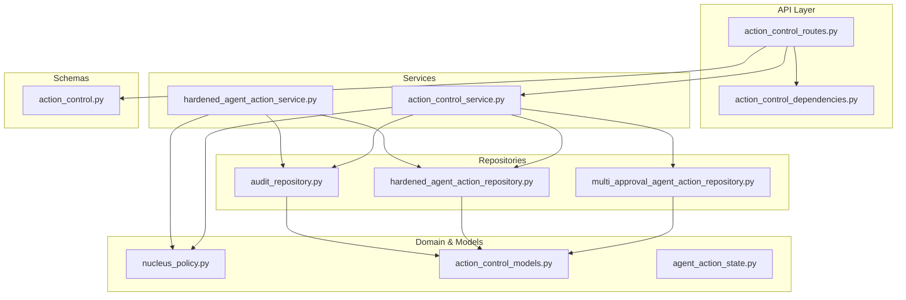
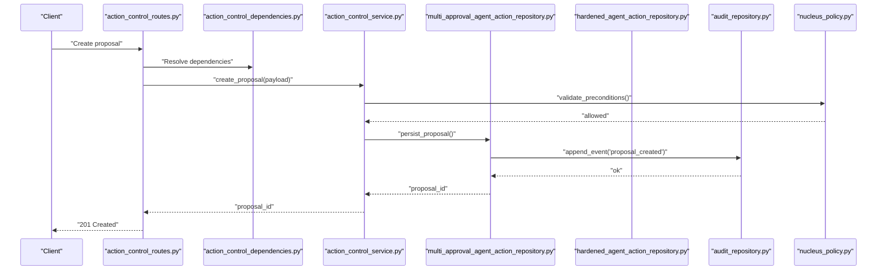
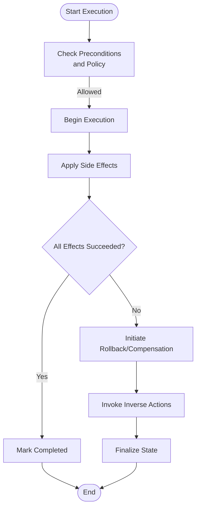
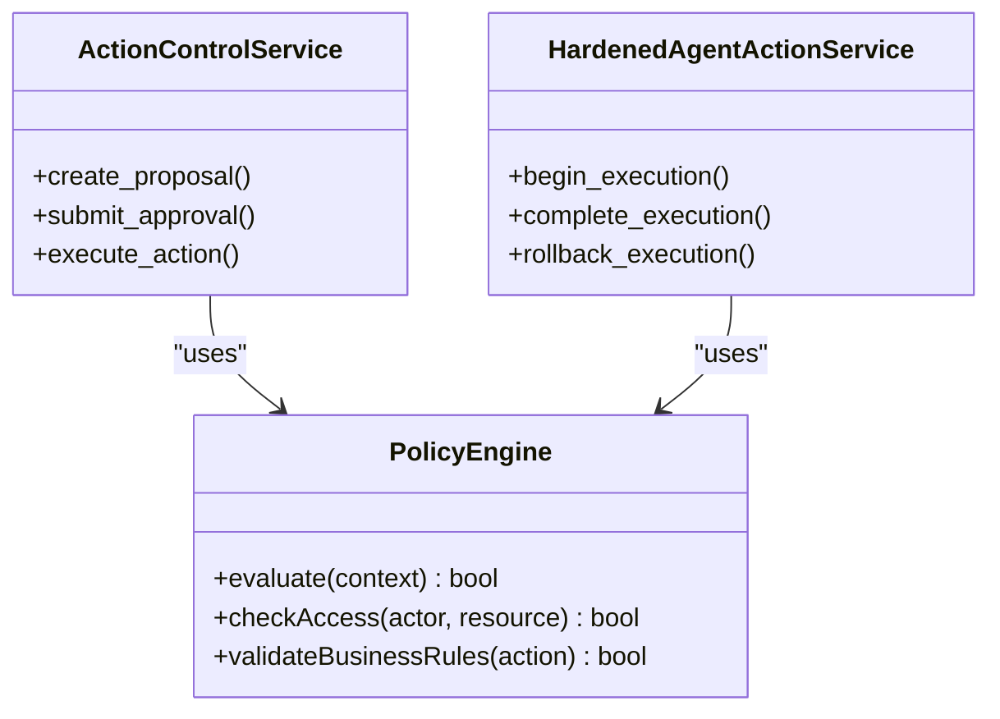
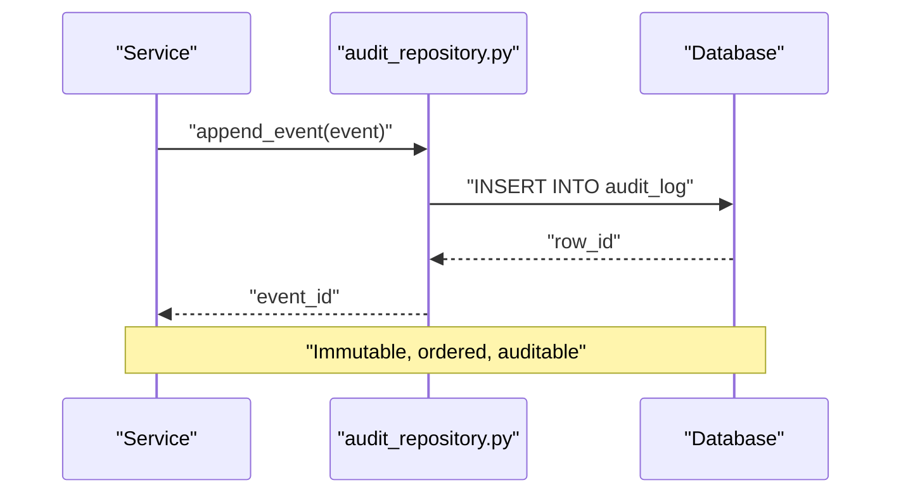
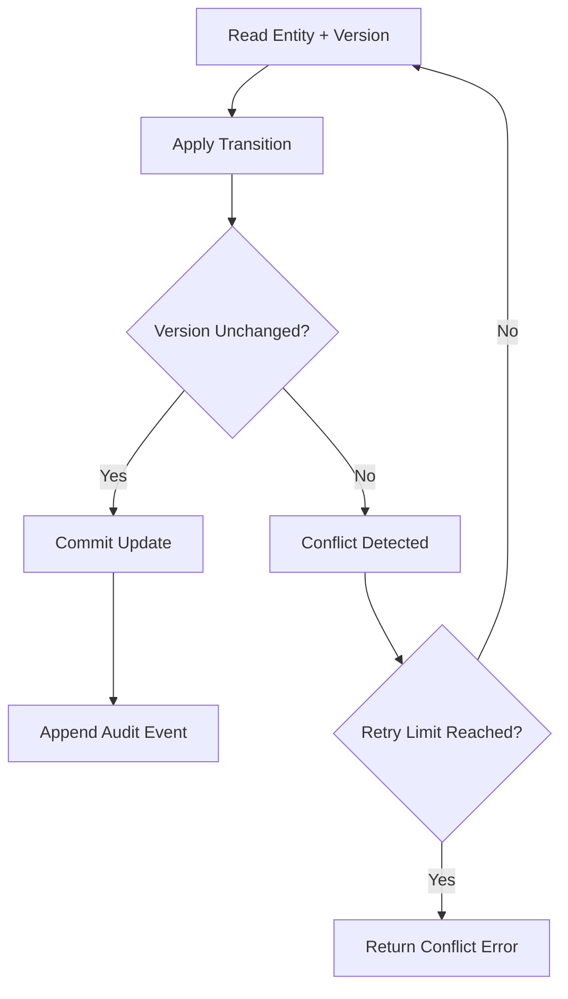
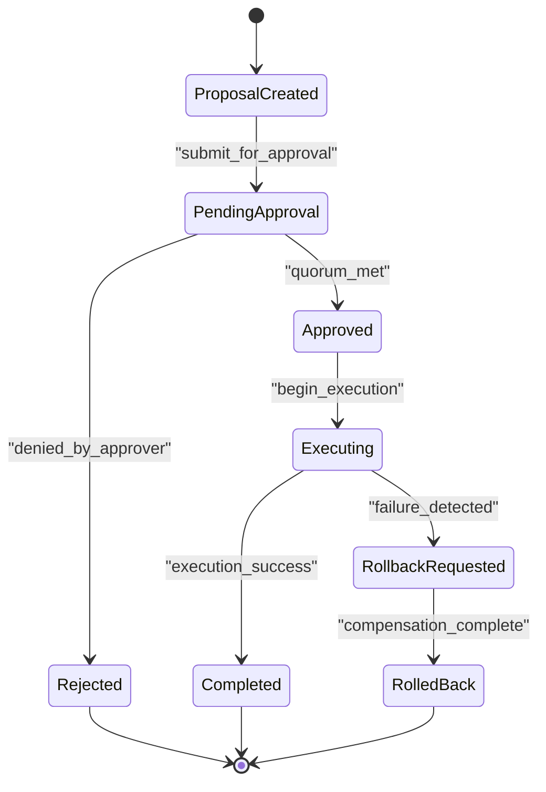
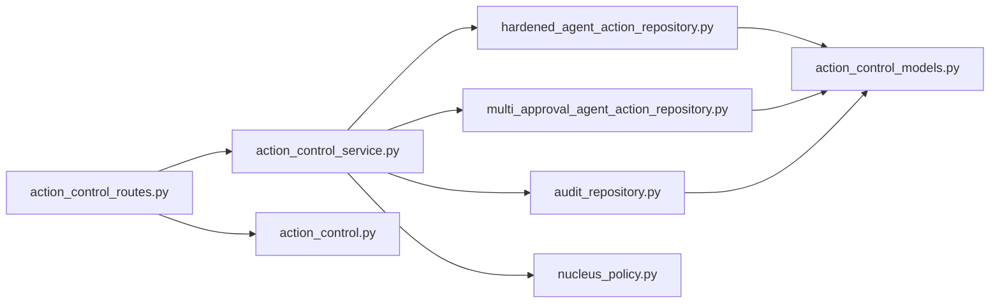

# Action Control Plane

<cite>
**Referenced Files in This Document**
- [GOVERNED_ACTION_CONTROL_PLANE.md](file://docs/GOVERNED_ACTION_CONTROL_PLANE.md)
- [action_control_service.py](file://app/services/action_control_service.py)
- [hardened_agent_action_service.py](file://app/services/hardened_agent_action_service.py)
- [multi_approval_agent_action_repository.py](file://app/repositories/multi_approval_agent_action_repository.py)
- [hardened_agent_action_repository.py](file://app/repositories/hardened_agent_action_repository.py)
- [audit_repository.py](file://app/repositories/audit_repository.py)
- [action_control_models.py](file://app/db/action_control_models.py)
- [action_control_routes.py](file://app/api/action_control_routes.py)
- [action_control_dependencies.py](file://app/api/action_control_dependencies.py)
- [action_control.py](file://app/schemas/action_control.py)
- [nucleus_policy.py](file://app/domain/nucleus_policy.py)
- [agent_action_state.py](file://app/agent/action_state.py)
- [test_multi_approval_and_rollback.py](file://tests/test_multi_approval_and_rollback.py)
- [test_agent_action_concurrency.py](file://tests/test_agent_action_concurrency.py)
- [test_audit.py](file://tests/test_audit.py)
</cite>

## Table of Contents
1. [Introduction](#introduction)
2. [Project Structure](#project-structure)
3. [Core Components](#core-components)
4. [Architecture Overview](#architecture-overview)
5. [Detailed Component Analysis](#detailed-component-analysis)
6. [Dependency Analysis](#dependency-analysis)
7. [Performance Considerations](#performance-considerations)
8. [Troubleshooting Guide](#troubleshooting-guide)
9. [Conclusion](#conclusion)

## Introduction
This document describes the action control plane subsystem that provides governance, secure execution, and compliance for AI-driven actions across organizational boundaries. It covers:
- Governance framework with approval workflows, audit trails, and policy enforcement
- Hardened action service with rollback and compensation capabilities
- Policy engine enforcing business rules and access controls
- Immutable audit repository with full traceability
- Concurrency handling, optimistic locking, and conflict resolution strategies
- Relationships between action states, approval hierarchies, and organizational policies

The goal is to make the system’s design accessible to both technical and non-technical readers while providing concrete references to the codebase.

## Project Structure
The action control plane spans services, repositories, schemas, API routes, domain models, and tests. Key areas include:
- Services: orchestration of proposals, approvals, execution, rollbacks, and compensation
- Repositories: persistence, multi-level approvals, hardened lifecycle, and immutable audit logs
- Schemas: request/response contracts for proposals, approvals, and execution tracking
- API routes: endpoints for creating proposals, submitting approvals, and querying status
- Domain: policy definitions and state enums
- Tests: coverage for concurrency, multi-approval, rollback, and audit integrity

**Diagram sources**
- [action_control_routes.py](file://app/api/action_control_routes.py)
- [action_control_dependencies.py](file://app/api/action_control_dependencies.py)
- [action_control_service.py](file://app/services/action_control_service.py)
- [hardened_agent_action_service.py](file://app/services/hardened_agent_action_service.py)
- [multi_approval_agent_action_repository.py](file://app/repositories/multi_approval_agent_action_repository.py)
- [hardened_agent_action_repository.py](file://app/repositories/hardened_agent_action_repository.py)
- [audit_repository.py](file://app/repositories/audit_repository.py)
- [action_control_models.py](file://app/db/action_control_models.py)
- [nucleus_policy.py](file://app/domain/nucleus_policy.py)
- [agent_action_state.py](file://app/agent/action_state.py)
- [action_control.py](file://app/schemas/action_control.py)

**Section sources**
- [GOVERNED_ACTION_CONTROL_PLANE.md](file://docs/GOVERNED_ACTION_CONTROL_PLANE.md)

## Core Components
- Action Control Service: orchestrates proposal creation, approval routing, execution gating, and outcome tracking.
- Hardened Agent Action Service: enforces a strict lifecycle, ensures idempotency, and coordinates rollback/compensation.
- Multi-Approval Repository: implements hierarchical approvals (e.g., manager + compliance), ordering constraints, and quorum checks.
- Hardened Repository: applies optimistic locking, versioning, and state transitions with preconditions.
- Audit Repository: appends immutable events for every state change, decision, and side effect.
- Policy Engine: evaluates organizational policies and access controls before allowing transitions or executions.
- Schemas and Routes: define typed contracts and expose controlled endpoints for proposals, approvals, and execution queries.

**Section sources**
- [action_control_service.py](file://app/services/action_control_service.py)
- [hardened_agent_action_service.py](file://app/services/hardened_agent_action_service.py)
- [multi_approval_agent_action_repository.py](file://app/repositories/multi_approval_agent_action_repository.py)
- [hardened_agent_action_repository.py](file://app/repositories/hardened_agent_action_repository.py)
- [audit_repository.py](file://app/repositories/audit_repository.py)
- [nucleus_policy.py](file://app/domain/nucleus_policy.py)
- [action_control.py](file://app/schemas/action_control.py)
- [action_control_routes.py](file://app/api/action_control_routes.py)

## Architecture Overview
The control plane follows a layered architecture:
- API layer exposes endpoints for proposals, approvals, and execution status.
- Service layer composes use cases and enforces cross-cutting concerns (policy checks, audit logging).
- Repository layer persists data with strong consistency guarantees and immutability for audit events.
- Domain layer defines policies, state machines, and shared models.

**Diagram sources**
- [action_control_routes.py](file://app/api/action_control_routes.py)
- [action_control_dependencies.py](file://app/api/action_control_dependencies.py)
- [action_control_service.py](file://app/services/action_control_service.py)
- [multi_approval_agent_action_repository.py](file://app/repositories/multi_approval_agent_action_repository.py)
- [hardened_agent_action_repository.py](file://app/repositories/hardened_agent_action_repository.py)
- [audit_repository.py](file://app/repositories/audit_repository.py)
- [nucleus_policy.py](file://app/domain/nucleus_policy.py)

## Detailed Component Analysis

### Governance Framework: Approval Workflows, Audit Trails, Compliance
- Approval workflows support multi-level hierarchies and ordered approvals. The repository enforces quorum and ordering constraints, ensuring that all required approvers have consented before transitioning to “approved.”
- Audit trails are appended immutably for each significant event (proposal created, approvals submitted, execution started/completed/failed, rollback initiated).
- Compliance checks are performed via the policy engine prior to transitions and execution, including organizational boundary validation and role-based access control.

Concrete examples from tests:
- Multi-level approvals and rollback scenarios validate quorum, ordering, and compensation behavior.
- Audit tests assert that every transition produces an immutable log entry with full context.

**Section sources**
- [multi_approval_agent_action_repository.py](file://app/repositories/multi_approval_agent_action_repository.py)
- [audit_repository.py](file://app/repositories/audit_repository.py)
- [nucleus_policy.py](file://app/domain/nucleus_policy.py)
- [test_multi_approval_and_rollback.py](file://tests/test_multi_approval_and_rollback.py)
- [test_audit.py](file://tests/test_audit.py)

### Hardened Action Service: Secure Execution, Rollback, Compensation
- Enforces a strict lifecycle with preconditions and postconditions for each transition.
- Provides idempotent operations to prevent duplicate effects under retries.
- Coordinates rollback by invoking inverse actions and compensation handlers when failures occur after partial progress.
- Integrates with the hardened repository to apply optimistic locking and version checks.

**Diagram sources**
- [hardened_agent_action_service.py](file://app/services/hardened_agent_action_service.py)
- [hardened_agent_action_repository.py](file://app/repositories/hardened_agent_action_repository.py)
- [audit_repository.py](file://app/repositories/audit_repository.py)

**Section sources**
- [hardened_agent_action_service.py](file://app/services/hardened_agent_action_service.py)
- [hardened_agent_action_repository.py](file://app/repositories/hardened_agent_action_repository.py)
- [test_multi_approval_and_rollback.py](file://tests/test_multi_approval_and_rollback.py)

### Policy Engine: Business Rules and Access Controls Across Organizational Boundaries
- Evaluates policies before allowing proposal creation, approval submission, and execution.
- Enforces organizational boundaries so that actors can only act within permitted scopes.
- Supports dynamic rule evaluation based on user roles, resource attributes, and contextual metadata.

**Diagram sources**
- [nucleus_policy.py](file://app/domain/nucleus_policy.py)
- [action_control_service.py](file://app/services/action_control_service.py)
- [hardened_agent_action_service.py](file://app/services/hardened_agent_action_service.py)

**Section sources**
- [nucleus_policy.py](file://app/domain/nucleus_policy.py)
- [action_control_service.py](file://app/services/action_control_service.py)
- [hardened_agent_action_service.py](file://app/services/hardened_agent_action_service.py)

### Immutable Audit Repository: Full Traceability
- Appends append-only events for every state change, decision, and side effect.
- Ensures chronological ordering and tamper-evidence through database constraints and transactional writes.
- Exposes query APIs for inspection and compliance reporting.

**Diagram sources**
- [audit_repository.py](file://app/repositories/audit_repository.py)

**Section sources**
- [audit_repository.py](file://app/repositories/audit_repository.py)
- [test_audit.py](file://tests/test_audit.py)

### Concurrency Handling, Optimistic Locking, Conflict Resolution
- Uses optimistic locking with version fields to detect concurrent modifications.
- Retries on conflict with backoff; fails fast if max retries exceeded.
- Ensures atomic transitions by combining version checks and conditional updates.

**Diagram sources**
- [hardened_agent_action_repository.py](file://app/repositories/hardened_agent_action_repository.py)
- [test_agent_action_concurrency.py](file://tests/test_agent_action_concurrency.py)

**Section sources**
- [hardened_agent_action_repository.py](file://app/repositories/hardened_agent_action_repository.py)
- [test_agent_action_concurrency.py](file://tests/test_agent_action_concurrency.py)

### Action States, Approval Hierarchies, and Organizational Policies
- Action states model the lifecycle from proposal to completion or rollback.
- Approval hierarchies enforce ordered approvals and quorum requirements.
- Organizational policies gate transitions and execution based on actor permissions and resource scope.

**Diagram sources**
- [agent_action_state.py](file://app/agent/action_state.py)
- [multi_approval_agent_action_repository.py](file://app/repositories/multi_approval_agent_action_repository.py)
- [nucleus_policy.py](file://app/domain/nucleus_policy.py)

**Section sources**
- [agent_action_state.py](file://app/agent/action_state.py)
- [multi_approval_agent_action_repository.py](file://app/repositories/multi_approval_agent_action_repository.py)
- [nucleus_policy.py](file://app/domain/nucleus_policy.py)

### Concrete Examples from Codebase
- Action proposal creation:
  - API route accepts a proposal payload, validates schema, delegates to service, and returns a proposal identifier.
  - Service performs policy checks, persists the proposal, and emits an audit event.
- Multi-level approval processes:
  - Approvals are recorded per approver with ordering constraints; quorum must be met before transitioning to approved.
- Execution tracking:
  - Execution begins only after approval; lifecycle transitions are persisted with audit entries for each step.

References:
- [action_control_routes.py](file://app/api/action_control_routes.py)
- [action_control_service.py](file://app/services/action_control_service.py)
- [multi_approval_agent_action_repository.py](file://app/repositories/multi_approval_agent_action_repository.py)
- [action_control.py](file://app/schemas/action_control.py)
- [test_multi_approval_and_rollback.py](file://tests/test_multi_approval_and_rollback.py)

**Section sources**
- [action_control_routes.py](file://app/api/action_control_routes.py)
- [action_control_service.py](file://app/services/action_control_service.py)
- [multi_approval_agent_action_repository.py](file://app/repositories/multi_approval_agent_action_repository.py)
- [action_control.py](file://app/schemas/action_control.py)
- [test_multi_approval_and_rollback.py](file://tests/test_multi_approval_and_rollback.py)

## Dependency Analysis
The control plane exhibits clear separation of concerns:
- API depends on services and schemas.
- Services depend on repositories and policy engine.
- Repositories depend on domain models and database constraints.
- Tests exercise cross-layer interactions to ensure correctness.

**Diagram sources**
- [action_control_routes.py](file://app/api/action_control_routes.py)
- [action_control_service.py](file://app/services/action_control_service.py)
- [multi_approval_agent_action_repository.py](file://app/repositories/multi_approval_agent_action_repository.py)
- [hardened_agent_action_repository.py](file://app/repositories/hardened_agent_action_repository.py)
- [audit_repository.py](file://app/repositories/audit_repository.py)
- [action_control_models.py](file://app/db/action_control_models.py)
- [nucleus_policy.py](file://app/domain/nucleus_policy.py)
- [action_control.py](file://app/schemas/action_control.py)

**Section sources**
- [action_control_routes.py](file://app/api/action_control_routes.py)
- [action_control_service.py](file://app/services/action_control_service.py)
- [multi_approval_agent_action_repository.py](file://app/repositories/multi_approval_agent_action_repository.py)
- [hardened_agent_action_repository.py](file://app/repositories/hardened_agent_action_repository.py)
- [audit_repository.py](file://app/repositories/audit_repository.py)
- [action_control_models.py](file://app/db/action_control_models.py)
- [nucleus_policy.py](file://app/domain/nucleus_policy.py)
- [action_control.py](file://app/schemas/action_control.py)

## Performance Considerations
- Prefer batched audit appends where feasible to reduce write amplification.
- Use read replicas for audit queries to offload heavy reporting workloads.
- Tune retry/backoff parameters for optimistic lock conflicts to balance throughput and latency.
- Cache policy decisions for frequently accessed resources when safe and consistent.

[No sources needed since this section provides general guidance]

## Troubleshooting Guide
Common issues and diagnostics:
- Approval stuck in pending: verify quorum and ordering constraints; check audit trail for missing approvals.
- Execution failed mid-way: inspect rollback/compensation logs; ensure inverse actions are idempotent.
- Concurrent modification errors: confirm version field usage and retry logic; review conflict resolution paths.
- Policy denial: examine policy evaluation inputs and organizational boundary checks.

**Section sources**
- [test_multi_approval_and_rollback.py](file://tests/test_multi_approval_and_rollback.py)
- [test_agent_action_concurrency.py](file://tests/test_agent_action_concurrency.py)
- [audit_repository.py](file://app/repositories/audit_repository.py)

## Conclusion
The action control plane delivers robust governance for AI actions through structured approval workflows, immutable audit trails, and policy-driven enforcement. The hardened service ensures secure execution with reliable rollback and compensation. Strong concurrency controls and optimistic locking protect data integrity, while comprehensive tests validate critical behaviors. Together, these components provide a trustworthy foundation for operating AI actions across organizational boundaries.