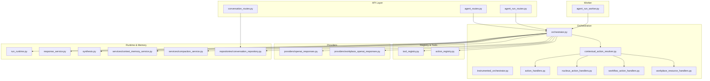
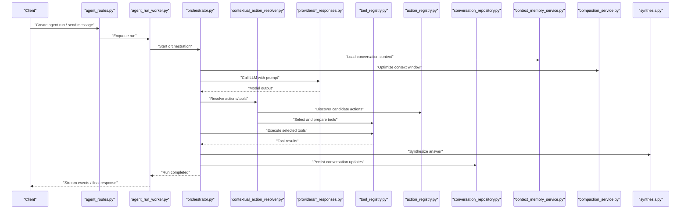
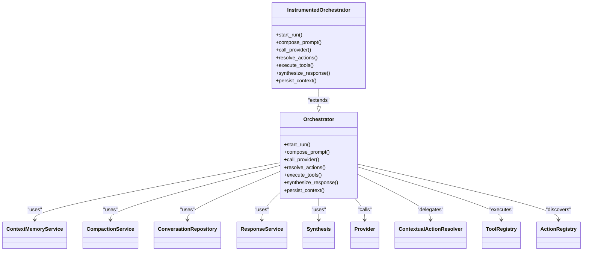
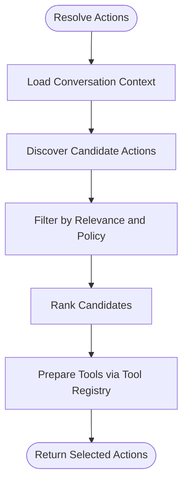
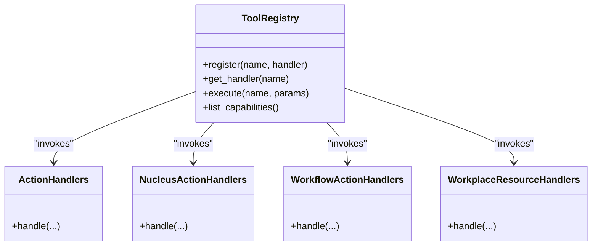
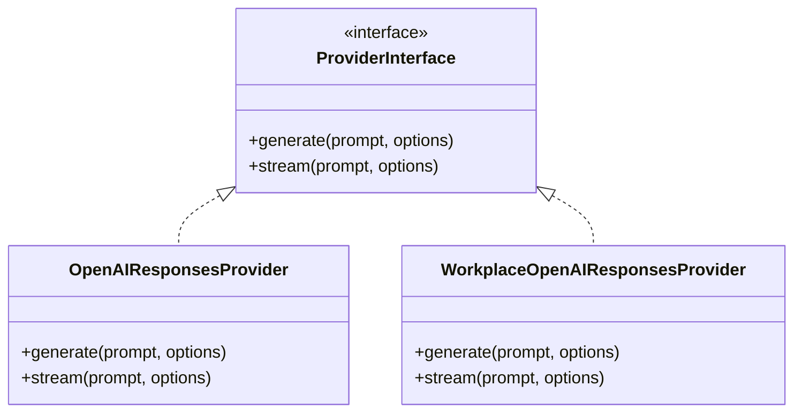
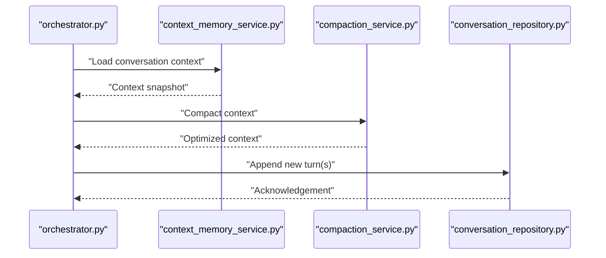
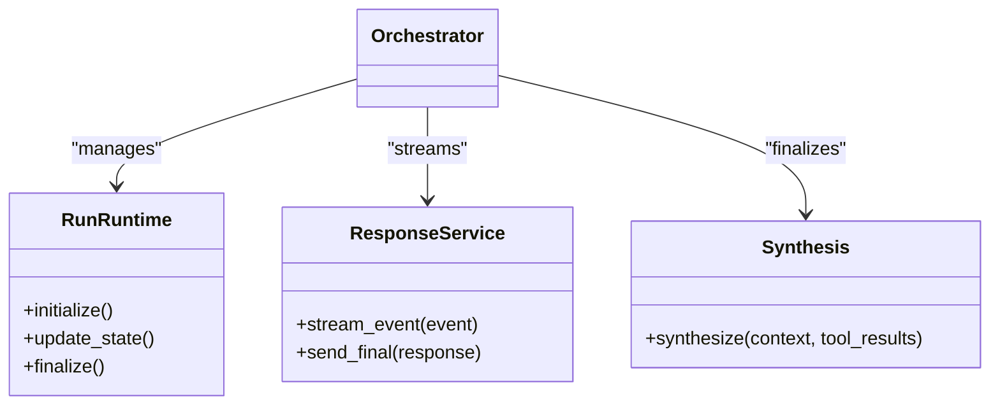
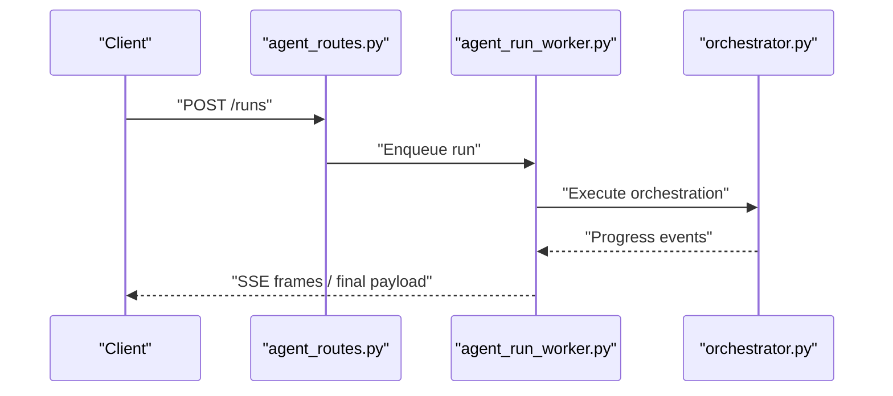
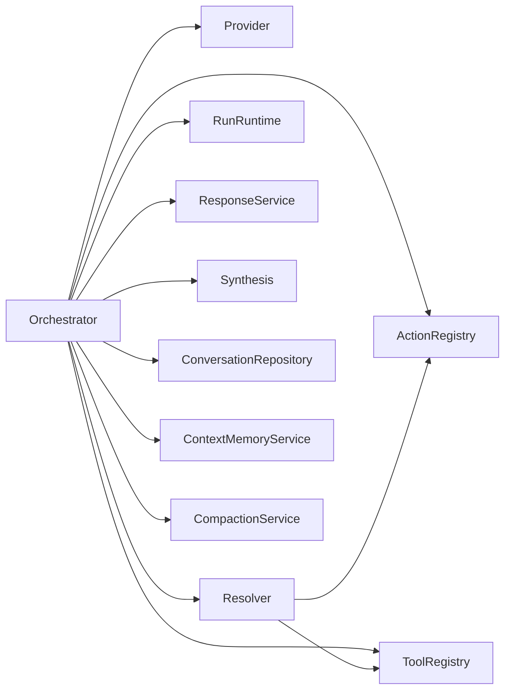

# Agent Orchestration

<cite>
**Referenced Files in This Document**
- [orchestrator.py](file://app/agent/orchestrator.py)
- [instrumented_orchestrator.py](file://app/agent/instrumented_orchestrator.py)
- [contextual_action_resolver.py](file://app/agent/contextual_action_resolver.py)
- [action_registry.py](file://app/agent/action_registry.py)
- [tool_registry.py](file://app/agent/tool_registry.py)
- [action_handlers.py](file://app/agent/action_handlers.py)
- [nucleus_action_handlers.py](file://app/agent/nucleus_action_handlers.py)
- [workflow_action_handlers.py](file://app/agent/workflow_action_handlers.py)
- [workplace_resource_handlers.py](file://app/agent/workplace_resource_handlers.py)
- [openai_responses.py](file://app/agent/providers/openai_responses.py)
- [workplace_openai_responses.py](file://app/agent/providers/workplace_openai_responses.py)
- [response_service.py](file://app/agent/response_service.py)
- [synthesis.py](file://app/agent/synthesis.py)
- [run_runtime.py](file://app/agent/run_runtime.py)
- [conversation_repository.py](file://app/repositories/conversation_repository.py)
- [compaction_service.py](file://app/services/compaction_service.py)
- [context_memory_service.py](file://app/services/context_memory_service.py)
- [agent_run_worker.py](file://app/agent_run_worker.py)
- [agent_routes.py](file://app/api/agent_routes.py)
- [agent_dependencies.py](file://app/api/agent_dependencies.py)
- [agent_run_routes.py](file://app/api/agent_run_routes.py)
- [agent_run_dependencies.py](file://app/api/agent_run_dependencies.py)
- [conversation_routes.py](file://app/api/conversation_routes.py)
- [test_agent_orchestrator.py](file://tests/test_agent_orchestrator.py)
</cite>

## Table of Contents
1. [Introduction](#introduction)
2. [Project Structure](#project-structure)
3. [Core Components](#core-components)
4. [Architecture Overview](#architecture-overview)
5. [Detailed Component Analysis](#detailed-component-analysis)
6. [Dependency Analysis](#dependency-analysis)
7. [Performance Considerations](#performance-considerations)
8. [Troubleshooting Guide](#troubleshooting-guide)
9. [Conclusion](#conclusion)

## Introduction
This document explains the agent orchestration subsystem responsible for AI agent lifecycle management, conversation context handling, and tool execution coordination. It covers:
- The central orchestrator that drives agent runs end-to-end
- The tool registry pattern enabling plugin-based capability discovery and execution
- The contextual action resolver that selects appropriate tools based on conversation context and user intent
- Pluggable AI provider architecture supporting multiple model integrations
- Conversation state management, memory persistence, and context window optimization
- Error handling patterns, retry mechanisms, and fallback strategies for external service failures
- Concrete examples from the codebase showing agent creation, message processing, and response generation flows

## Project Structure
The orchestration layer is implemented under app/agent with supporting services, repositories, and API routes. Key areas include:
- Orchestrator and instrumentation
- Action selection and resolution
- Tool and action registries
- Provider implementations for LLMs
- Response synthesis and runtime helpers
- Conversation and memory services
- API entry points and worker integration

**Diagram sources**
- [orchestrator.py](file://app/agent/orchestrator.py)
- [instrumented_orchestrator.py](file://app/agent/instrumented_orchestrator.py)
- [contextual_action_resolver.py](file://app/agent/contextual_action_resolver.py)
- [action_registry.py](file://app/agent/action_registry.py)
- [tool_registry.py](file://app/agent/tool_registry.py)
- [action_handlers.py](file://app/agent/action_handlers.py)
- [nucleus_action_handlers.py](file://app/agent/nucleus_action_handlers.py)
- [workflow_action_handlers.py](file://app/agent/workflow_action_handlers.py)
- [workplace_resource_handlers.py](file://app/agent/workplace_resource_handlers.py)
- [openai_responses.py](file://app/agent/providers/openai_responses.py)
- [workplace_openai_responses.py](file://app/agent/providers/workplace_openai_responses.py)
- [response_service.py](file://app/agent/response_service.py)
- [synthesis.py](file://app/agent/synthesis.py)
- [run_runtime.py](file://app/agent/run_runtime.py)
- [conversation_repository.py](file://app/repositories/conversation_repository.py)
- [compaction_service.py](file://app/services/compaction_service.py)
- [context_memory_service.py](file://app/services/context_memory_service.py)
- [agent_run_worker.py](file://app/agent_run_worker.py)
- [agent_routes.py](file://app/api/agent_routes.py)
- [agent_run_routes.py](file://app/api/agent_run_routes.py)
- [conversation_routes.py](file://app/api/conversation_routes.py)

**Section sources**
- [orchestrator.py](file://app/agent/orchestrator.py)
- [instrumented_orchestrator.py](file://app/agent/instrumented_orchestrator.py)
- [contextual_action_resolver.py](file://app/agent/contextual_action_resolver.py)
- [action_registry.py](file://app/agent/action_registry.py)
- [tool_registry.py](file://app/agent/tool_registry.py)
- [openai_responses.py](file://app/agent/providers/openai_responses.py)
- [workplace_openai_responses.py](file://app/agent/providers/workplace_openai_responses.py)
- [response_service.py](file://app/agent/response_service.py)
- [synthesis.py](file://app/agent/synthesis.py)
- [run_runtime.py](file://app/agent/run_runtime.py)
- [conversation_repository.py](file://app/repositories/conversation_repository.py)
- [compaction_service.py](file://app/services/compaction_service.py)
- [context_memory_service.py](file://app/services/context_memory_service.py)
- [agent_run_worker.py](file://app/agent_run_worker.py)
- [agent_routes.py](file://app/api/agent_routes.py)
- [agent_run_routes.py](file://app/api/agent_run_routes.py)
- [conversation_routes.py](file://app/api/conversation_routes.py)

## Core Components
- Central Orchestrator: Coordinates agent run lifecycle, including prompt assembly, provider calls, action selection, tool execution, and response synthesis.
- Instrumented Orchestrator: Adds observability hooks around orchestration steps (metrics, tracing).
- Contextual Action Resolver: Determines which actions/tools are relevant given conversation context and user intent.
- Tool Registry: Plugin-style registry for discovering and executing tools dynamically.
- Action Handlers: Domain-specific handlers for nucleus, workflow, and workplace resource operations.
- Providers: Pluggable LLM adapters (OpenAI Responses and Workplace OpenAI Responses).
- Runtime and Synthesis: Utilities to manage run state, stream responses, and synthesize final answers.
- Conversation and Memory: Repositories and services for storing conversations, managing context windows, and compaction.

**Section sources**
- [orchestrator.py](file://app/agent/orchestrator.py)
- [instrumented_orchestrator.py](file://app/agent/instrumented_orchestrator.py)
- [contextual_action_resolver.py](file://app/agent/contextual_action_resolver.py)
- [tool_registry.py](file://app/agent/tool_registry.py)
- [action_handlers.py](file://app/agent/action_handlers.py)
- [nucleus_action_handlers.py](file://app/agent/nucleus_action_handlers.py)
- [workflow_action_handlers.py](file://app/agent/workflow_action_handlers.py)
- [workplace_resource_handlers.py](file://app/agent/workplace_resource_handlers.py)
- [openai_responses.py](file://app/agent/providers/openai_responses.py)
- [workplace_openai_responses.py](file://app/agent/providers/workplace_openai_responses.py)
- [response_service.py](file://app/agent/response_service.py)
- [synthesis.py](file://app/agent/synthesis.py)
- [run_runtime.py](file://app/agent/run_runtime.py)
- [conversation_repository.py](file://app/repositories/conversation_repository.py)
- [compaction_service.py](file://app/services/compaction_service.py)
- [context_memory_service.py](file://app/services/context_memory_service.py)

## Architecture Overview
The orchestration flow begins at API endpoints, delegates to the orchestrator, which composes prompts, queries providers, resolves actions, executes tools via registries, and synthesizes responses. Conversation state and memory are persisted and optimized through dedicated services.

**Diagram sources**
- [agent_routes.py](file://app/api/agent_routes.py)
- [agent_run_worker.py](file://app/agent_run_worker.py)
- [orchestrator.py](file://app/agent/orchestrator.py)
- [contextual_action_resolver.py](file://app/agent/contextual_action_resolver.py)
- [openai_responses.py](file://app/agent/providers/openai_responses.py)
- [workplace_openai_responses.py](file://app/agent/providers/workplace_openai_responses.py)
- [tool_registry.py](file://app/agent/tool_registry.py)
- [action_registry.py](file://app/agent/action_registry.py)
- [conversation_repository.py](file://app/repositories/conversation_repository.py)
- [context_memory_service.py](file://app/services/context_memory_service.py)
- [compaction_service.py](file://app/services/compaction_service.py)
- [synthesis.py](file://app/agent/synthesis.py)

## Detailed Component Analysis

### Central Orchestrator
Responsibilities:
- Lifecycle management: initialize run, assemble context, call provider, handle tool loops, finalize response
- Coordination: integrates action resolver, tool registry, runtime, synthesis, and persistence
- Error handling: wraps provider/tool calls with retries and fallbacks where applicable
- Observability: exposes hooks for metrics and tracing (via instrumented variant)

Key interactions:
- Loads and optimizes conversation context via memory and compaction services
- Invokes pluggable providers to generate model outputs
- Delegates action selection to contextual action resolver
- Executes tools via tool registry and aggregates results
- Synthesizes final answer and persists conversation updates

**Diagram sources**
- [orchestrator.py](file://app/agent/orchestrator.py)
- [instrumented_orchestrator.py](file://app/agent/instrumented_orchestrator.py)
- [context_memory_service.py](file://app/services/context_memory_service.py)
- [compaction_service.py](file://app/services/compaction_service.py)
- [conversation_repository.py](file://app/repositories/conversation_repository.py)
- [response_service.py](file://app/agent/response_service.py)
- [synthesis.py](file://app/agent/synthesis.py)
- [openai_responses.py](file://app/agent/providers/openai_responses.py)
- [workplace_openai_responses.py](file://app/agent/providers/workplace_openai_responses.py)
- [contextual_action_resolver.py](file://app/agent/contextual_action_resolver.py)
- [tool_registry.py](file://app/agent/tool_registry.py)
- [action_registry.py](file://app/agent/action_registry.py)

**Section sources**
- [orchestrator.py](file://app/agent/orchestrator.py)
- [instrumented_orchestrator.py](file://app/agent/instrumented_orchestrator.py)

### Contextual Action Resolver
Purpose:
- Selects appropriate actions/tools based on conversation context and user intent
- Uses action registry to discover candidates and filters them by relevance
- Produces a prioritized list of actionable steps for the orchestrator

Behavior highlights:
- Analyzes recent messages and system context
- Applies heuristics or policy rules to rank candidates
- Integrates with tool registry to ensure executable capabilities exist

**Diagram sources**
- [contextual_action_resolver.py](file://app/agent/contextual_action_resolver.py)
- [action_registry.py](file://app/agent/action_registry.py)
- [tool_registry.py](file://app/agent/tool_registry.py)

**Section sources**
- [contextual_action_resolver.py](file://app/agent/contextual_action_resolver.py)
- [action_registry.py](file://app/agent/action_registry.py)

### Tool Registry Pattern
Pattern overview:
- Plugin-based registration of tools and actions
- Dynamic discovery and invocation during orchestration
- Decouples domain logic from execution mechanics

Key responsibilities:
- Register/unregister tools and actions
- Resolve tool names to handlers
- Execute tools with validated inputs and capture outputs
- Provide metadata for action selection (capabilities, preconditions)

**Diagram sources**
- [tool_registry.py](file://app/agent/tool_registry.py)
- [action_handlers.py](file://app/agent/action_handlers.py)
- [nucleus_action_handlers.py](file://app/agent/nucleus_action_handlers.py)
- [workflow_action_handlers.py](file://app/agent/workflow_action_handlers.py)
- [workplace_resource_handlers.py](file://app/agent/workplace_resource_handlers.py)

**Section sources**
- [tool_registry.py](file://app/agent/tool_registry.py)
- [action_handlers.py](file://app/agent/action_handlers.py)
- [nucleus_action_handlers.py](file://app/agent/nucleus_action_handlers.py)
- [workflow_action_handlers.py](file://app/agent/workflow_action_handlers.py)
- [workplace_resource_handlers.py](file://app/agent/workplace_resource_handlers.py)

### Pluggable AI Provider Architecture
Design:
- Abstraction over LLM backends
- Multiple concrete providers implement the same interface
- Orchestrator remains agnostic to specific provider details

Providers:
- OpenAI Responses provider
- Workplace OpenAI Responses provider (domain-scoped configuration)

**Diagram sources**
- [openai_responses.py](file://app/agent/providers/openai_responses.py)
- [workplace_openai_responses.py](file://app/agent/providers/workplace_openai_responses.py)

**Section sources**
- [openai_responses.py](file://app/agent/providers/openai_responses.py)
- [workplace_openai_responses.py](file://app/agent/providers/workplace_openai_responses.py)

### Conversation State Management and Memory Persistence
Components:
- Conversation repository for durable storage
- Context memory service for loading and updating conversation state
- Compaction service for optimizing context windows

Flow:
- Load prior messages and summaries
- Apply compaction to fit within provider constraints
- Persist new turns and synthesized outcomes

**Diagram sources**
- [conversation_repository.py](file://app/repositories/conversation_repository.py)
- [context_memory_service.py](file://app/services/context_memory_service.py)
- [compaction_service.py](file://app/services/compaction_service.py)

**Section sources**
- [conversation_repository.py](file://app/repositories/conversation_repository.py)
- [context_memory_service.py](file://app/services/context_memory_service.py)
- [compaction_service.py](file://app/services/compaction_service.py)

### Runtime Helpers and Response Synthesis
- Run runtime manages per-run state and streaming
- Response service formats and streams responses to clients
- Synthesis consolidates tool results and model outputs into coherent answers

**Diagram sources**
- [run_runtime.py](file://app/agent/run_runtime.py)
- [response_service.py](file://app/agent/response_service.py)
- [synthesis.py](file://app/agent/synthesis.py)

**Section sources**
- [run_runtime.py](file://app/agent/run_runtime.py)
- [response_service.py](file://app/agent/response_service.py)
- [synthesis.py](file://app/agent/synthesis.py)

### API Entry Points and Worker Integration
- API routes accept agent run requests and delegate to workers
- Workers execute orchestration asynchronously and stream events back to clients

**Diagram sources**
- [agent_routes.py](file://app/api/agent_routes.py)
- [agent_run_worker.py](file://app/agent_run_worker.py)
- [orchestrator.py](file://app/agent/orchestrator.py)

**Section sources**
- [agent_routes.py](file://app/api/agent_routes.py)
- [agent_run_worker.py](file://app/agent_run_worker.py)

### Concrete Examples from Codebase
- Agent creation and run initiation: see API route definitions and dependencies for constructing runs and invoking the orchestrator.
- Message processing: orchestration flow composing prompts, calling providers, resolving actions, and executing tools.
- Response generation: synthesis and response service formatting streamed events to clients.
- Tests demonstrating orchestration behavior: unit tests validate orchestrator workflows and provider interactions.

**Section sources**
- [agent_routes.py](file://app/api/agent_routes.py)
- [agent_run_routes.py](file://app/api/agent_run_routes.py)
- [agent_dependencies.py](file://app/api/agent_dependencies.py)
- [agent_run_dependencies.py](file://app/api/agent_run_dependencies.py)
- [conversation_routes.py](file://app/api/conversation_routes.py)
- [test_agent_orchestrator.py](file://tests/test_agent_orchestrator.py)

## Dependency Analysis
High-level dependency relationships:
- Orchestrator depends on provider abstractions, action resolver, tool registry, runtime, synthesis, and persistence/memory services
- Contextual action resolver depends on action registry and tool registry
- Providers are independent modules implementing a common interface
- API routes depend on orchestrator and worker for async execution

**Diagram sources**
- [orchestrator.py](file://app/agent/orchestrator.py)
- [contextual_action_resolver.py](file://app/agent/contextual_action_resolver.py)
- [tool_registry.py](file://app/agent/tool_registry.py)
- [action_registry.py](file://app/agent/action_registry.py)
- [run_runtime.py](file://app/agent/run_runtime.py)
- [response_service.py](file://app/agent/response_service.py)
- [synthesis.py](file://app/agent/synthesis.py)
- [conversation_repository.py](file://app/repositories/conversation_repository.py)
- [context_memory_service.py](file://app/services/context_memory_service.py)
- [compaction_service.py](file://app/services/compaction_service.py)

**Section sources**
- [orchestrator.py](file://app/agent/orchestrator.py)
- [contextual_action_resolver.py](file://app/agent/contextual_action_resolver.py)
- [tool_registry.py](file://app/agent/tool_registry.py)
- [action_registry.py](file://app/agent/action_registry.py)
- [run_runtime.py](file://app/agent/run_runtime.py)
- [response_service.py](file://app/agent/response_service.py)
- [synthesis.py](file://app/agent/synthesis.py)
- [conversation_repository.py](file://app/repositories/conversation_repository.py)
- [context_memory_service.py](file://app/services/context_memory_service.py)
- [compaction_service.py](file://app/services/compaction_service.py)

## Performance Considerations
- Context window optimization: use compaction to reduce token usage and improve latency
- Streaming responses: leverage response service to deliver incremental updates
- Provider selection: choose providers aligned with performance and cost requirements
- Batched tool execution: minimize round-trips by grouping independent tool calls when safe
- Caching and memoization: consider caching frequent tool outputs or summaries where appropriate

[No sources needed since this section provides general guidance]

## Troubleshooting Guide
Common issues and patterns:
- Provider failures: implement retries with exponential backoff and fallback providers
- Tool execution errors: wrap tool calls with error boundaries and return structured errors
- Context overflow: detect oversized contexts and trigger compaction before provider calls
- Orchestration timeouts: enforce timeouts at API and worker layers; surface partial progress via SSE
- Observability: use instrumented orchestrator to trace slow steps and identify bottlenecks

Error handling recommendations:
- Normalize errors across providers and tools
- Distinguish transient vs permanent failures for retry decisions
- Log detailed context snapshots for debugging without exposing sensitive data

**Section sources**
- [instrumented_orchestrator.py](file://app/agent/instrumented_orchestrator.py)
- [orchestrator.py](file://app/agent/orchestrator.py)
- [response_service.py](file://app/agent/response_service.py)
- [synthesis.py](file://app/agent/synthesis.py)

## Conclusion
The agent orchestration subsystem provides a robust, extensible foundation for AI-driven workflows. Its modular design separates concerns across orchestration, action resolution, tool execution, provider abstraction, and memory management. By leveraging the tool registry pattern and contextual action resolver, the system adapts to diverse domains while maintaining clear boundaries and strong observability. With conversation state management and context optimization, it scales efficiently across long-running sessions and high-throughput workloads.