# Backend Architecture

<cite>
**Referenced Files in This Document**
- [main.py](file://app/main.py)
- [config.py](file://app/core/config.py)
- [security.py](file://app/core/security.py)
- [errors.py](file://app/core/errors.py)
- [dependencies.py](file://app/api/dependencies.py)
- [agent_dependencies.py](file://app/api/agent_dependencies.py)
- [action_control_dependencies.py](file://app/api/action_control_dependencies.py)
- [agent_routes.py](file://app/api/agent_routes.py)
- [action_control_routes.py](file://app/api/action_control_routes.py)
- [conversation_routes.py](file://app/api/conversation_routes.py)
- [health_routes.py](file://app/api/health_routes.py)
- [orchestrator.py](file://app/agent/orchestrator.py)
- [instrumented_orchestrator.py](file://app/agent/instrumented_orchestrator.py)
- [tool_registry.py](file://app/agent/tool_registry.py)
- [run_runtime.py](file://app/agent/run_runtime.py)
- [response_service.py](file://app/agent/response_service.py)
- [action_handlers.py](file://app/agent/action_handlers.py)
- [nucleus_action_handlers.py](file://app/agent/nucleus_action_handlers.py)
- [workplace_resource_handlers.py](file://app/agent/workplace_resource_handlers.py)
- [workflow_action_handlers.py](file://app/agent/workflow_action_handlers.py)
- [contextual_action_resolver.py](file://app/agent/contextual_action_resolver.py)
- [action_contracts.py](file://app/agent/action_contracts.py)
- [action_control_contracts.py](file://app/agent/action_control_contracts.py)
- [action_state.py](file://app/agent/action_state.py)
- [evidence.py](file://app/agent/evidence.py)
- [synthesis.py](file://app/agent/synthesis.py)
- [agent_run_worker.py](file://app/agent_run_worker.py)
- [services/action_control_service.py](file://app/services/action_control_service.py)
- [services/agent_action_service.py](file://app/services/agent_action_service.py)
- [services/agent_run_service.py](file://app/services/agent_run_service.py)
- [services/hardened_agent_action_service.py](file://app/services/hardened_agent_action_service.py)
- [services/release_ready_agent_action_service.py](file://app/services/release_ready_agent_action_service.py)
- [services/stale_safe_agent_action_service.py](file://app/services/stale_safe_agent_action_service.py)
- [repositories/action_control_repository.py](file://app/repositories/action_control_repository.py)
- [repositories/agent_action_repository.py](file://app/repositories/agent_action_repository.py)
- [repositories/agent_run_repository.py](file://app/repositories/agent_run_repository.py)
- [repositories/audit_repository.py](file://app/repositories/audit_repository.py)
- [db/session.py](file://app/db/session.py)
- [db/base.py](file://app/db/base.py)
- [db/orm_models.py](file://app/db/orm_models.py)
- [schemas/action_control.py](file://app/schemas/action_control.py)
- [schemas/agent.py](file://app/schemas/agent.py)
- [schemas/agent_actions.py](file://app/schemas/agent_actions.py)
- [schemas/agent_run.py](file://app/schemas/agent_run.py)
- [schemas/audit.py](file://app/schemas/audit.py)
</cite>

## Table of Contents
1. [Introduction](#introduction)
2. [Project Structure](#project-structure)
3. [Core Components](#core-components)
4. [Architecture Overview](#architecture-overview)
5. [Detailed Component Analysis](#detailed-component-analysis)
6. [Dependency Analysis](#dependency-analysis)
7. [Performance Considerations](#performance-considerations)
8. [Troubleshooting Guide](#troubleshooting-guide)
9. [Conclusion](#conclusion)
10. [Appendices](#appendices)

## Introduction
This document describes the backend architecture of a FastAPI-based system that powers an AI agent platform with governed action control, durable runs, and background job processing. It explains the application structure, middleware stack, dependency injection patterns, request/response pipeline, service layer separation, agent orchestration framework, action control plane, worker system, error handling, logging, and monitoring approaches. The goal is to provide both high-level understanding and code-level traceability for developers and operators.

## Project Structure
The backend follows a layered architecture:
- API layer: FastAPI routes and dependencies for HTTP endpoints
- Service layer: Business logic and orchestration coordination
- Repository layer: Data access abstractions over ORM models
- Domain layer: Core business entities and policies
- Agent layer: Orchestrator, tool registry, runtime, and handlers
- Database layer: SQLAlchemy models, sessions, and migrations
- Schemas: Pydantic models for validation and serialization
- Adapters: External integrations (e.g., Nucleus, Organization, User providers)
- Workplaces: Resource definitions, operations, and workflows

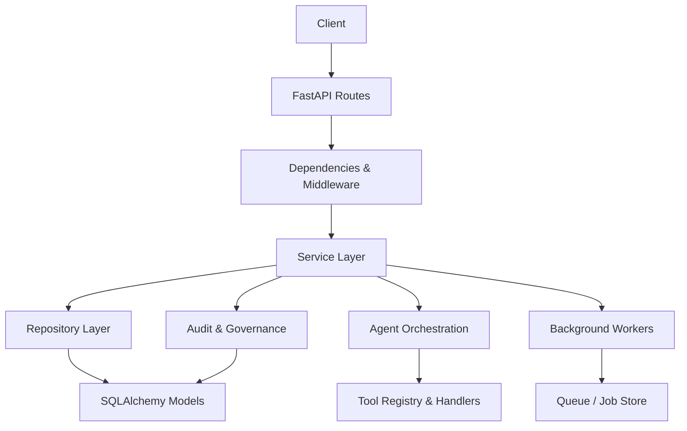

**Diagram sources**
- [main.py:1-100](file://app/main.py#L1-L100)
- [dependencies.py:1-100](file://app/api/dependencies.py#L1-L100)
- [services/action_control_service.py:1-100](file://app/services/action_control_service.py#L1-L100)
- [repositories/action_control_repository.py:1-100](file://app/repositories/action_control_repository.py#L1-L100)
- [db/orm_models.py:1-100](file://app/db/orm_models.py#L1-L100)
- [agent/orchestrator.py:1-100](file://app/agent/orchestrator.py#L1-L100)
- [agent/tool_registry.py:1-100](file://app/agent/tool_registry.py#L1-L100)
- [agent_run_worker.py:1-100](file://app/agent_run_worker.py#L1-L100)

**Section sources**
- [main.py:1-100](file://app/main.py#L1-L100)
- [config.py:1-100](file://app/core/config.py#L1-L100)

## Core Components
Key components include:
- FastAPI application entry point and middleware configuration
- Dependency injection for services, repositories, and external adapters
- Agent orchestrator with lifecycle management and context handling
- Tool registry for dynamic capability discovery and invocation
- Action control plane for approvals, audit trails, and governance
- Worker system for durable background jobs and event streaming
- Error handling and logging strategies across layers

**Section sources**
- [main.py:1-100](file://app/main.py#L1-L100)
- [dependencies.py:1-100](file://app/api/dependencies.py#L1-L100)
- [agent/orchestrator.py:1-100](file://app/agent/orchestrator.py#L1-L100)
- [agent/tool_registry.py:1-100](file://app/agent/tool_registry.py#L1-L100)
- [services/action_control_service.py:1-100](file://app/services/action_control_service.py#L1-L100)
- [agent_run_worker.py:1-100](file://app/agent_run_worker.py#L1-L100)

## Architecture Overview
The system uses a clear separation between HTTP endpoints, business services, data repositories, and agent orchestration. Requests flow through FastAPI routes into dependency-injected services, which coordinate with repositories and the agent orchestrator. Background workers process long-running tasks and emit events via SSE or queues.

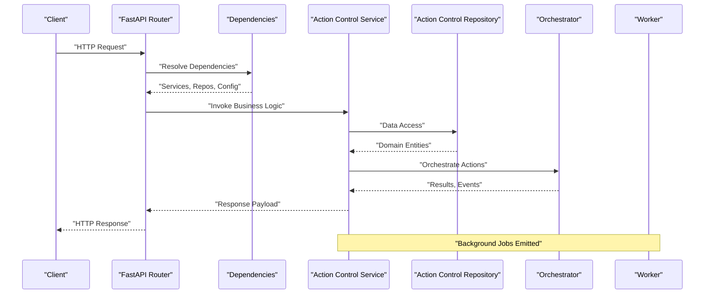

**Diagram sources**
- [agent_routes.py:1-100](file://app/api/agent_routes.py#L1-L100)
- [action_control_routes.py:1-100](file://app/api/action_control_routes.py#L1-L100)
- [dependencies.py:1-100](file://app/api/dependencies.py#L1-L100)
- [services/action_control_service.py:1-100](file://app/services/action_control_service.py#L1-L100)
- [repositories/action_control_repository.py:1-100](file://app/repositories/action_control_repository.py#L1-L100)
- [agent/orchestrator.py:1-100](file://app/agent/orchestrator.py#L1-L100)
- [agent_run_worker.py:1-100](file://app/agent_run_worker.py#L1-L100)

## Detailed Component Analysis

### FastAPI Application and Middleware Stack
The FastAPI application initializes core configuration, security, CORS, and custom middleware. It registers routers for agents, actions, conversations, health checks, and workplace resources. Dependency injection is configured at startup to provide services, repositories, and external adapters throughout the request lifecycle.

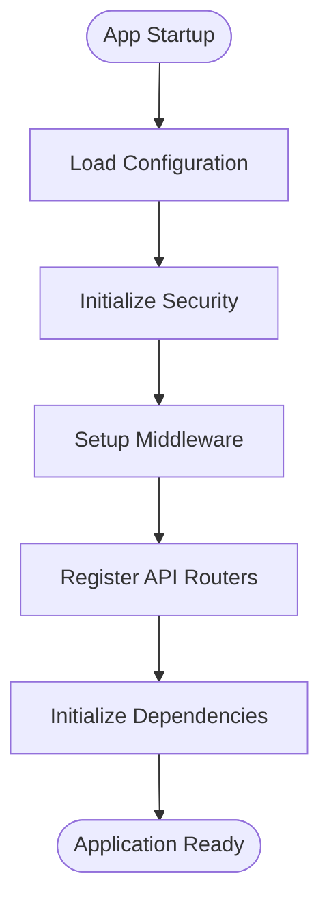

**Diagram sources**
- [main.py:1-100](file://app/main.py#L1-L100)
- [config.py:1-100](file://app/core/config.py#L1-L100)
- [security.py:1-100](file://app/core/security.py#L1-L100)

**Section sources**
- [main.py:1-100](file://app/main.py#L1-L100)
- [config.py:1-100](file://app/core/config.py#L1-L100)
- [security.py:1-100](file://app/core/security.py#L1-L100)

### Dependency Injection and Request Processing Pipeline
FastAPI dependencies resolve services, repositories, and external adapters per request. The pipeline includes authentication, authorization, validation, and response transformation. Custom dependencies ensure consistent access to database sessions, configuration, and contextual information.

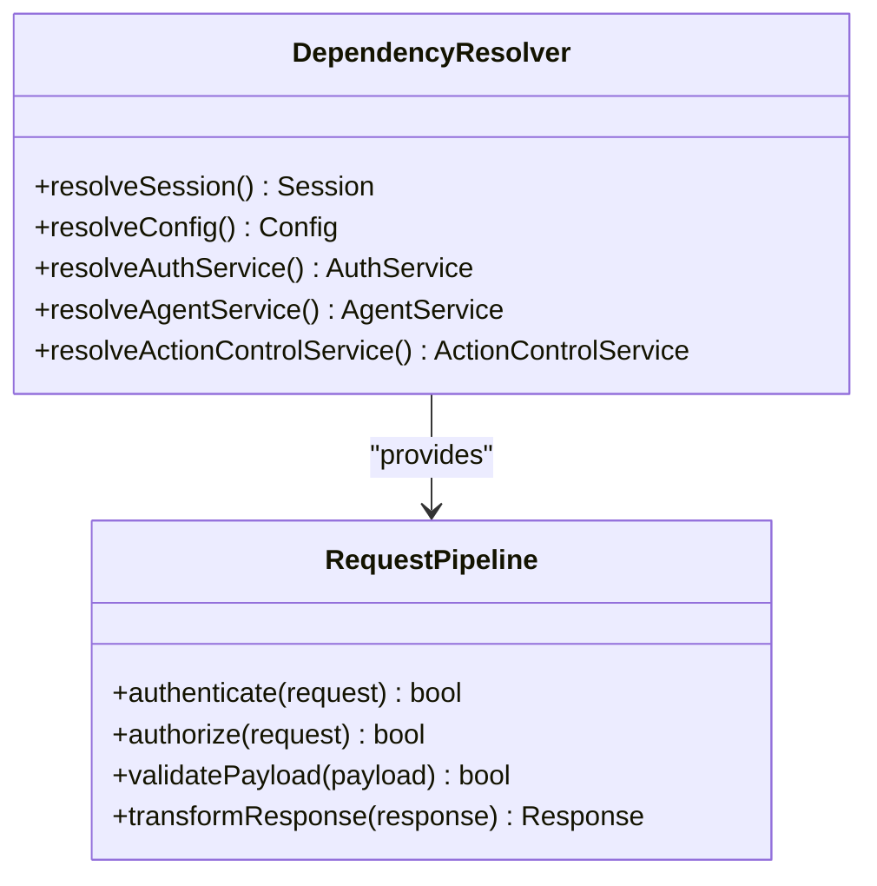

**Diagram sources**
- [dependencies.py:1-100](file://app/api/dependencies.py#L1-L100)
- [agent_dependencies.py:1-100](file://app/api/agent_dependencies.py#L1-L100)
- [action_control_dependencies.py:1-100](file://app/api/action_control_dependencies.py#L1-L100)

**Section sources**
- [dependencies.py:1-100](file://app/api/dependencies.py#L1-L100)
- [agent_dependencies.py:1-100](file://app/api/agent_dependencies.py#L1-L100)
- [action_control_dependencies.py:1-100](file://app/api/action_control_dependencies.py#L1-L100)

### Agent Orchestration Framework
The agent orchestrator manages the lifecycle of AI-driven actions, including context handling, tool selection, and execution coordination. It integrates with various providers (OpenAI, Workplace) and maintains state through run contexts. The orchestrator coordinates with action handlers and evidence collection for auditability.

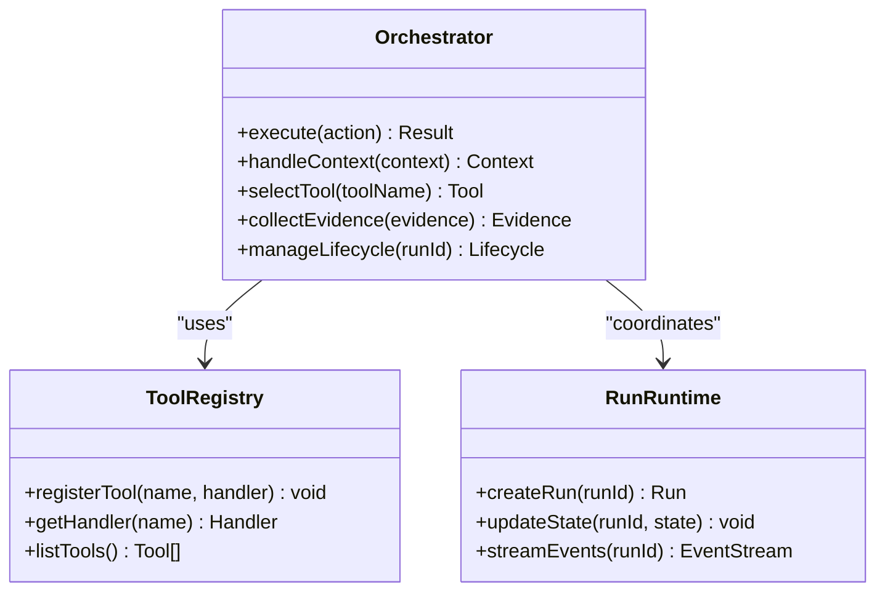

**Diagram sources**
- [agent/orchestrator.py:1-100](file://app/agent/orchestrator.py#L1-L100)
- [agent/instrumented_orchestrator.py:1-100](file://app/agent/instrumented_orchestrator.py#L1-L100)
- [agent/tool_registry.py:1-100](file://app/agent/tool_registry.py#L1-L100)
- [agent/run_runtime.py:1-100](file://app/agent/run_runtime.py#L1-L100)

**Section sources**
- [agent/orchestrator.py:1-100](file://app/agent/orchestrator.py#L1-L100)
- [agent/instrumented_orchestrator.py:1-100](file://app/agent/instrumented_orchestrator.py#L1-L100)
- [agent/tool_registry.py:1-100](file://app/agent/tool_registry.py#L1-L100)
- [agent/run_runtime.py:1-100](file://app/agent/run_runtime.py#L1-L100)

### Action Control Plane
The action control plane provides approval workflows, audit trails, and governance mechanisms for agent actions. It enforces policies, tracks state transitions, and ensures compliance through multi-approval processes and rollback capabilities.

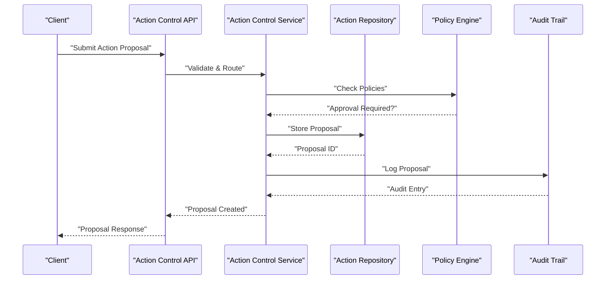

**Diagram sources**
- [action_control_routes.py:1-100](file://app/api/action_control_routes.py#L1-L100)
- [services/action_control_service.py:1-100](file://app/services/action_control_service.py#L1-L100)
- [repositories/action_control_repository.py:1-100](file://app/repositories/action_control_repository.py#L1-L100)
- [action_control_contracts.py:1-100](file://app/agent/action_control_contracts.py#L1-L100)

**Section sources**
- [action_control_routes.py:1-100](file://app/api/action_control_routes.py#L1-L100)
- [services/action_control_service.py:1-100](file://app/services/action_control_service.py#L1-L100)
- [repositories/action_control_repository.py:1-100](file://app/repositories/action_control_repository.py#L1-L100)
- [action_control_contracts.py:1-100](file://app/agent/action_control_contracts.py#L1-L100)

### Service Layer Architecture
The service layer implements business logic with clear separation of concerns:
- Agent action services handle proposal creation, validation, and execution
- Action control services manage approval workflows and governance
- Hardened services enforce additional safety constraints
- Release-ready services prepare actions for production deployment

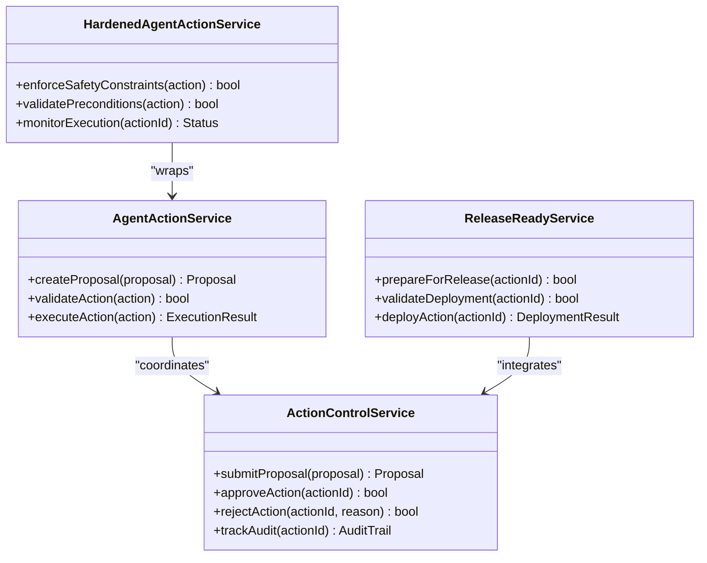

**Diagram sources**
- [services/agent_action_service.py:1-100](file://app/services/agent_action_service.py#L1-L100)
- [services/action_control_service.py:1-100](file://app/services/action_control_service.py#L1-L100)
- [services/hardened_agent_action_service.py:1-100](file://app/services/hardened_agent_action_service.py#L1-L100)
- [services/release_ready_agent_action_service.py:1-100](file://app/services/release_ready_agent_action_service.py#L1-L100)

**Section sources**
- [services/agent_action_service.py:1-100](file://app/services/agent_action_service.py#L1-L100)
- [services/action_control_service.py:1-100](file://app/services/action_control_service.py#L1-L100)
- [services/hardened_agent_action_service.py:1-100](file://app/services/hardened_agent_action_service.py#L1-L100)
- [services/release_ready_agent_action_service.py:1-100](file://app/services/release_ready_agent_action_service.py#L1-L100)

### Repository Layer and Data Access
Repositories abstract database operations and provide clean interfaces for services. They handle CRUD operations, complex queries, and transaction management while maintaining separation from business logic.

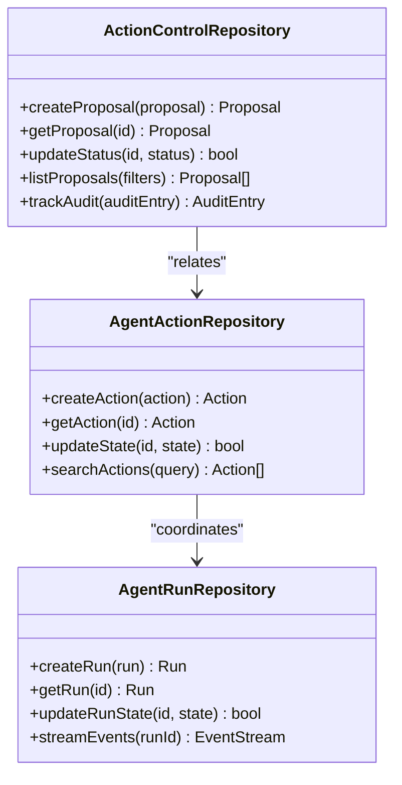

**Diagram sources**
- [repositories/action_control_repository.py:1-100](file://app/repositories/action_control_repository.py#L1-L100)
- [repositories/agent_action_repository.py:1-100](file://app/repositories/agent_action_repository.py#L1-L100)
- [repositories/agent_run_repository.py:1-100](file://app/repositories/agent_run_repository.py#L1-L100)

**Section sources**
- [repositories/action_control_repository.py:1-100](file://app/repositories/action_control_repository.py#L1-L100)
- [repositories/agent_action_repository.py:1-100](file://app/repositories/agent_action_repository.py#L1-L100)
- [repositories/agent_run_repository.py:1-100](file://app/repositories/agent_run_repository.py#L1-L100)

### Worker System and Background Job Processing
The worker system handles long-running tasks, event processing, and background job execution. It supports durable job storage, retry mechanisms, and real-time event streaming for progress updates.

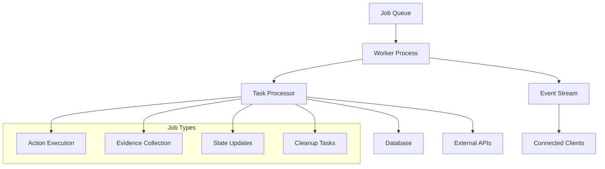

**Diagram sources**
- [agent_run_worker.py:1-100](file://app/agent_run_worker.py#L1-L100)
- [services/agent_run_service.py:1-100](file://app/services/agent_run_service.py#L1-L100)

**Section sources**
- [agent_run_worker.py:1-100](file://app/agent_run_worker.py#L1-L100)
- [services/agent_run_service.py:1-100](file://app/services/agent_run_service.py#L1-L100)

### Action Handlers and Tool Registry
Action handlers implement specific business operations for different domains (Nucleus, Workplace, Workflows). The tool registry provides dynamic discovery and invocation of these handlers based on action types and contexts.

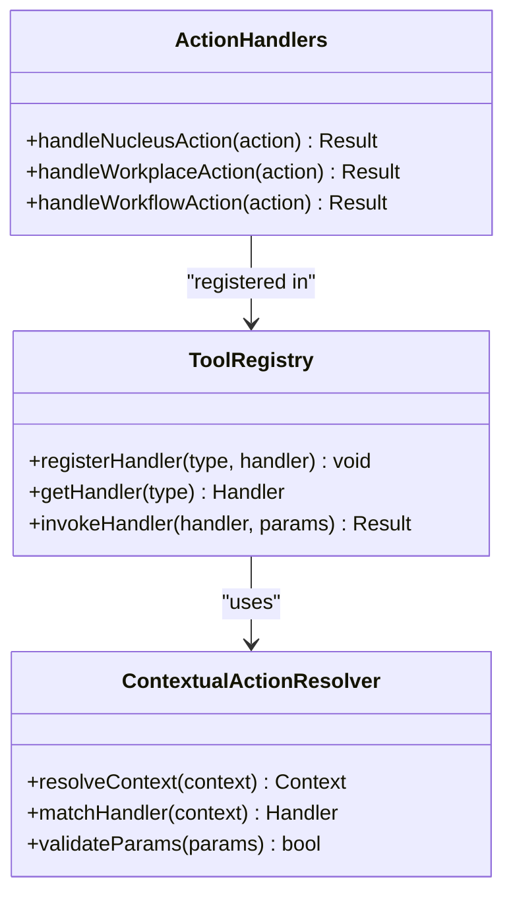

**Diagram sources**
- [agent/action_handlers.py:1-100](file://app/agent/action_handlers.py#L1-L100)
- [agent/nucleus_action_handlers.py:1-100](file://app/agent/nucleus_action_handlers.py#L1-L100)
- [agent/workplace_resource_handlers.py:1-100](file://app/agent/workplace_resource_handlers.py#L1-L100)
- [agent/workflow_action_handlers.py:1-100](file://app/agent/workflow_action_handlers.py#L1-L100)
- [agent/tool_registry.py:1-100](file://app/agent/tool_registry.py#L1-L100)
- [agent/contextual_action_resolver.py:1-100](file://app/agent/contextual_action_resolver.py#L1-L100)

**Section sources**
- [agent/action_handlers.py:1-100](file://app/agent/action_handlers.py#L1-L100)
- [agent/nucleus_action_handlers.py:1-100](file://app/agent/nucleus_action_handlers.py#L1-L100)
- [agent/workplace_resource_handlers.py:1-100](file://app/agent/workplace_resource_handlers.py#L1-L100)
- [agent/workflow_action_handlers.py:1-100](file://app/agent/workflow_action_handlers.py#L1-L100)
- [agent/tool_registry.py:1-100](file://app/agent/tool_registry.py#L1-L100)
- [agent/contextual_action_resolver.py:1-100](file://app/agent/contextual_action_resolver.py#L1-L100)

## Dependency Analysis
The system exhibits clear dependency boundaries with minimal coupling between layers. Services depend on repositories and external adapters, while the agent layer remains independent of HTTP concerns.

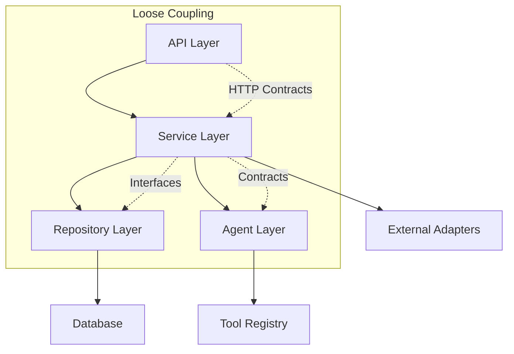

**Diagram sources**
- [dependencies.py:1-100](file://app/api/dependencies.py#L1-L100)
- [services/action_control_service.py:1-100](file://app/services/action_control_service.py#L1-L100)
- [repositories/action_control_repository.py:1-100](file://app/repositories/action_control_repository.py#L1-L100)

**Section sources**
- [dependencies.py:1-100](file://app/api/dependencies.py#L1-L100)
- [services/action_control_service.py:1-100](file://app/services/action_control_service.py#L1-L100)
- [repositories/action_control_repository.py:1-100](file://app/repositories/action_control_repository.py#L1-L100)

## Performance Considerations
- Database connection pooling for concurrent request handling
- Asynchronous processing for long-running agent operations
- Caching strategies for frequently accessed data
- Efficient query optimization in repository layer
- Streaming responses for real-time updates
- Memory management for large payloads and event streams

[No sources needed since this section provides general guidance]

## Troubleshooting Guide
Common issues and their resolution strategies:
- Authentication failures: Verify token validation and security configuration
- Database connectivity: Check session management and connection pooling
- Agent execution errors: Review tool registry and handler implementations
- Approval workflow blocks: Examine policy engine and governance rules
- Worker queue congestion: Monitor job processing and scaling parameters

**Section sources**
- [errors.py:1-100](file://app/core/errors.py#L1-L100)
- [security.py:1-100](file://app/core/security.py#L1-L100)
- [agent/errors.py:1-100](file://app/agent/errors.py#L1-L100)

## Conclusion
The backend architecture provides a robust foundation for AI agent operations with comprehensive governance, secure authentication, and scalable background processing. The clear separation of concerns, dependency injection patterns, and modular design enable maintainability and extensibility. The action control plane ensures compliance and auditability, while the worker system supports reliable background job processing.

[No sources needed since this section summarizes without analyzing specific files]

## Appendices

### API Endpoints Overview
The system exposes RESTful endpoints for agent operations, action control, conversations, and administrative functions. Each endpoint follows consistent patterns for request validation, response formatting, and error handling.

**Section sources**
- [agent_routes.py:1-100](file://app/api/agent_routes.py#L1-L100)
- [action_control_routes.py:1-100](file://app/api/action_control_routes.py#L1-L100)
- [conversation_routes.py:1-100](file://app/api/conversation_routes.py#L1-L100)
- [health_routes.py:1-100](file://app/api/health_routes.py#L1-L100)

### Data Models and Schemas
Pydantic schemas define the contract between API endpoints and internal data structures. SQLAlchemy models represent the persistent data layer with proper relationships and constraints.

**Section sources**
- [schemas/action_control.py:1-100](file://app/schemas/action_control.py#L1-L100)
- [schemas/agent.py:1-100](file://app/schemas/agent.py#L1-L100)
- [schemas/agent_actions.py:1-100](file://app/schemas/agent_actions.py#L1-L100)
- [schemas/agent_run.py:1-100](file://app/schemas/agent_run.py#L1-L100)
- [db/orm_models.py:1-100](file://app/db/orm_models.py#L1-L100)