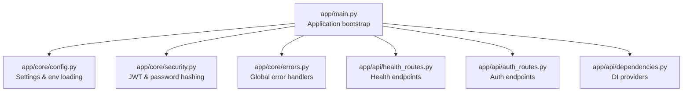
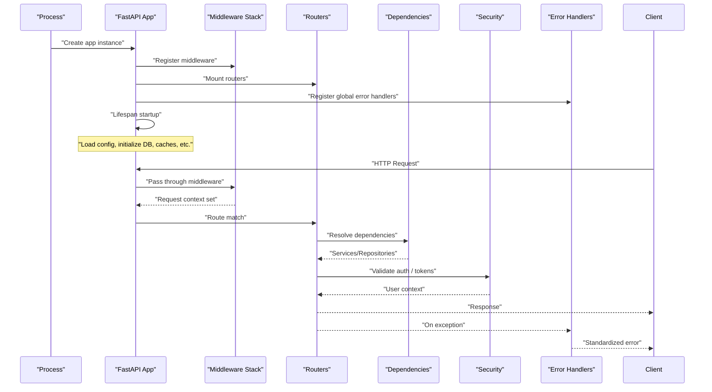
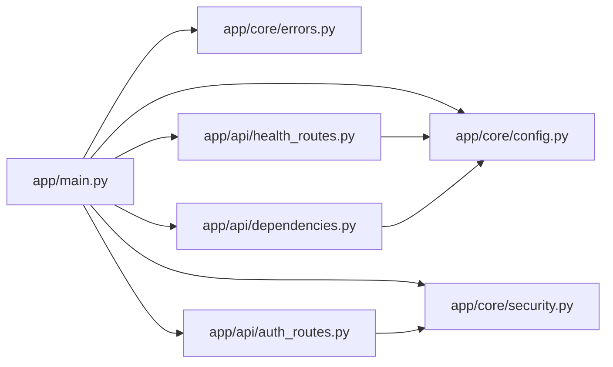

# Core Framework

<cite>
**Referenced Files in This Document**
- [main.py](file://app/main.py)
- [config.py](file://app/core/config.py)
- [security.py](file://app/core/security.py)
- [errors.py](file://app/core/errors.py)
- [health_routes.py](file://app/api/health_routes.py)
- [auth_routes.py](file://app/api/auth_routes.py)
- [dependencies.py](file://app/api/dependencies.py)
</cite>

## Table of Contents
1. [Introduction](#introduction)
2. [Project Structure](#project-structure)
3. [Core Components](#core-components)
4. [Architecture Overview](#architecture-overview)
5. [Detailed Component Analysis](#detailed-component-analysis)
6. [Dependency Analysis](#dependency-analysis)
7. [Performance Considerations](#performance-considerations)
8. [Troubleshooting Guide](#troubleshooting-guide)
9. [Conclusion](#conclusion)

## Introduction
This document explains the core framework for the FastAPI application, focusing on bootstrap and configuration. It covers application initialization, middleware stack, dependency injection setup, global error handling, configuration management (environment variables and settings hierarchy), security implementation (JWT authentication, password hashing, request validation), logging, performance monitoring, and health check endpoints. Practical examples are provided via file references to guide implementation and customization.

## Project Structure
The core framework is organized into focused modules:
- Application entrypoint and startup/shutdown lifecycle
- Configuration management with environment-driven settings
- Security utilities for JWT and password hashing
- Global error handling and custom exceptions
- API routes including health checks and authentication
- Dependency injection providers for services and resources

**Diagram sources**
- [main.py](file://app/main.py)
- [config.py](file://app/core/config.py)
- [security.py](file://app/core/security.py)
- [errors.py](file://app/core/errors.py)
- [health_routes.py](file://app/api/health_routes.py)
- [auth_routes.py](file://app/api/auth_routes.py)
- [dependencies.py](file://app/api/dependencies.py)

**Section sources**
- [main.py](file://app/main.py)
- [config.py](file://app/core/config.py)
- [security.py](file://app/core/security.py)
- [errors.py](file://app/core/errors.py)
- [health_routes.py](file://app/api/health_routes.py)
- [auth_routes.py](file://app/api/auth_routes.py)
- [dependencies.py](file://app/api/dependencies.py)

## Core Components
- Application bootstrap: Creates the FastAPI app, registers middleware, mounts routers, configures lifespan events, and sets up global error handlers.
- Configuration management: Loads settings from environment variables with a clear hierarchy and defaults; exposes typed settings to the rest of the app.
- Security: Implements JWT token creation/validation, password hashing, and request validation helpers used by routes and dependencies.
- Error handling: Defines custom exceptions and global exception handlers to standardize responses and logging.
- Health checks: Provides readiness/liveness endpoints for orchestration and monitoring.
- Dependency injection: Centralized providers for database sessions, repositories, and services consumed by route handlers.

**Section sources**
- [main.py](file://app/main.py)
- [config.py](file://app/core/config.py)
- [security.py](file://app/core/security.py)
- [errors.py](file://app/core/errors.py)
- [health_routes.py](file://app/api/health_routes.py)
- [auth_routes.py](file://app/api/auth_routes.py)
- [dependencies.py](file://app/api/dependencies.py)

## Architecture Overview
High-level flow of application startup and request processing:

**Diagram sources**
- [main.py](file://app/main.py)
- [health_routes.py](file://app/api/health_routes.py)
- [auth_routes.py](file://app/api/auth_routes.py)
- [dependencies.py](file://app/api/dependencies.py)
- [security.py](file://app/core/security.py)
- [errors.py](file://app/core/errors.py)

## Detailed Component Analysis

### Application Bootstrap and Lifecycle
- Creates the FastAPI application instance.
- Registers middleware (CORS, request ID, timing, etc.).
- Mounts API routers for different domains.
- Configures lifespan startup/shutdown hooks for resource initialization and cleanup.
- Attaches global exception handlers for consistent error responses.

Practical example references:
- Middleware registration and router mounting: [main.py](file://app/main.py)
- Lifespan startup/shutdown: [main.py](file://app/main.py)
- Global error handler attachment: [main.py](file://app/main.py)

**Section sources**
- [main.py](file://app/main.py)

### Configuration Management
- Settings hierarchy: explicit environment variables override defaults; optional .env or external config sources can be layered.
- Typed settings object exposed to the app and services.
- Runtime loading: settings are loaded once at startup and cached for the process lifetime.

Key responsibilities:
- Parse and validate environment variables.
- Provide safe accessors with defaults.
- Expose configuration to dependency providers.

Practical example references:
- Settings model and loader: [config.py](file://app/core/config.py)

**Section sources**
- [config.py](file://app/core/config.py)

### Security Implementation
- JWT authentication: token issuance, verification, and extraction into request context.
- Password hashing: secure hashing and verification utilities.
- Request validation: Pydantic models and validators ensure input correctness before business logic.

Typical usage:
- Protect routes by requiring valid JWT.
- Hash passwords during user registration/update.
- Validate payloads using Pydantic schemas in route parameters and bodies.

Practical example references:
- JWT helpers and decorators: [security.py](file://app/core/security.py)
- Auth endpoints (login/token): [auth_routes.py](file://app/api/auth_routes.py)

**Section sources**
- [security.py](file://app/core/security.py)
- [auth_routes.py](file://app/api/auth_routes.py)

### Global Error Handling
- Custom exceptions define domain-specific error types.
- Global exception handlers convert exceptions into standardized JSON responses and attach structured logs.
- Validation errors are normalized for consistent client feedback.

Practical example references:
- Custom exceptions and handlers: [errors.py](file://app/core/errors.py)
- Registration of handlers in bootstrap: [main.py](file://app/main.py)

**Section sources**
- [errors.py](file://app/core/errors.py)
- [main.py](file://app/main.py)

### Dependency Injection Setup
- Centralized providers create and cache long-lived resources (e.g., database sessions).
- Route handlers depend on these providers via FastAPI’s dependency system.
- Providers encapsulate cross-cutting concerns like transaction boundaries and retries.

Practical example references:
- Provider functions and factories: [dependencies.py](file://app/api/dependencies.py)

**Section sources**
- [dependencies.py](file://app/api/dependencies.py)

### Health Check Endpoints
- Readiness and liveness endpoints return service status and basic diagnostics.
- Useful for orchestrators, load balancers, and observability pipelines.

Practical example references:
- Health routes: [health_routes.py](file://app/api/health_routes.py)

**Section sources**
- [health_routes.py](file://app/api/health_routes.py)

### Logging and Performance Monitoring
- Structured logging configured at startup for consistent traceability across requests.
- Optional metrics/timing middleware to capture latency and throughput.
- Request IDs propagated through middleware and logged with each event.

Implementation pointers:
- Configure logging and request ID middleware in bootstrap: [main.py](file://app/main.py)
- Add metrics collection hooks in lifespan startup: [main.py](file://app/main.py)

**Section sources**
- [main.py](file://app/main.py)

## Dependency Analysis
Relationships between core components:

**Diagram sources**
- [main.py](file://app/main.py)
- [config.py](file://app/core/config.py)
- [security.py](file://app/core/security.py)
- [errors.py](file://app/core/errors.py)
- [dependencies.py](file://app/api/dependencies.py)
- [health_routes.py](file://app/api/health_routes.py)
- [auth_routes.py](file://app/api/auth_routes.py)

**Section sources**
- [main.py](file://app/main.py)
- [config.py](file://app/core/config.py)
- [security.py](file://app/core/security.py)
- [errors.py](file://app/core/errors.py)
- [dependencies.py](file://app/api/dependencies.py)
- [health_routes.py](file://app/api/health_routes.py)
- [auth_routes.py](file://app/api/auth_routes.py)

## Performance Considerations
- Use connection pooling for databases and reuse connections via dependency providers.
- Enable compression and caching where appropriate.
- Keep middleware lightweight; avoid heavy I/O in middleware.
- Profile hot paths and add targeted metrics for critical endpoints.
- Prefer async I/O for external calls and streaming responses when applicable.

[No sources needed since this section provides general guidance]

## Troubleshooting Guide
Common issues and resolutions:
- Missing environment variables: Ensure all required settings are present; verify precedence and defaults.
- Authentication failures: Validate secret keys, token expiration, and algorithm settings.
- Validation errors: Inspect normalized error responses and adjust Pydantic schemas accordingly.
- Health endpoint failures: Check internal dependencies (DB, caches) and log diagnostics.

Reference locations:
- Settings and env loading: [config.py](file://app/core/config.py)
- Security and token handling: [security.py](file://app/core/security.py)
- Error normalization and handlers: [errors.py](file://app/core/errors.py)
- Health endpoints: [health_routes.py](file://app/api/health_routes.py)

**Section sources**
- [config.py](file://app/core/config.py)
- [security.py](file://app/core/security.py)
- [errors.py](file://app/core/errors.py)
- [health_routes.py](file://app/api/health_routes.py)

## Conclusion
The core framework establishes a robust foundation for the FastAPI application: a clean bootstrap process, layered configuration, strong security primitives, centralized dependency injection, and comprehensive error handling. Health checks and logging/monitoring hooks enable operational reliability. Use the referenced files as practical guides to extend middleware, customize error behavior, and integrate additional security and observability features.