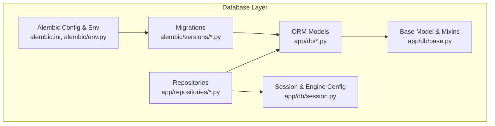
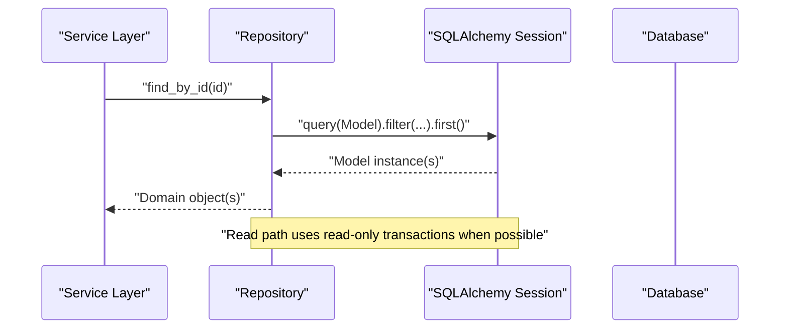
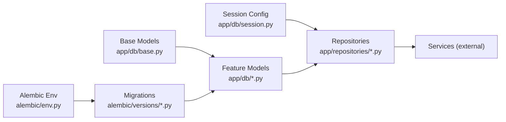

# Database Layer

<cite>
**Referenced Files in This Document**
- [alembic.ini](file://alembic.ini)
- [alembic/env.py](file://alembic/env.py)
- [alembic/script.py.mako](file://alembic/script.py.mako)
- [alembic/versions/0001_initial.py](file://alembic/versions/0001_initial.py)
- [alembic/versions/0022_compaction_overlays.py](file://alembic/versions/0022_compaction_overlays.py)
- [app/db/base.py](file://app/db/base.py)
- [app/db/session.py](file://app/db/session.py)
- [app/db/orm_models.py](file://app/db/orm_models.py)
- [app/db/action_models.py](file://app/db/action_models.py)
- [app/db/agent_run_models.py](file://app/db/agent_run_models.py)
- [app/db/nucleus_models.py](file://app/db/nucleus_models.py)
- [app/db/nucleus_admin_models.py](file://app/db/nucleus_admin_models.py)
- [app/db/workplace_resource_models.py](file://app/db/workplace_resource_models.py)
- [app/db/action_control_models.py](file://app/db/action_control_models.py)
- [app/db/nucleus_user_session.py](file://app/db/nucleus_user_session.py)
- [app/repositories/agent_action_repository.py](file://app/repositories/agent_action_repository.py)
- [app/repositories/agent_run_repository.py](file://app/repositories/agent_run_repository.py)
- [app/repositories/conversation_repository.py](file://app/repositories/conversation_repository.py)
- [app/repositories/conversation_search_repository.py](file://app/repositories/conversation_search_repository.py)
- [app/repositories/multi_approval_agent_action_repository.py](file://app/repositories/multi_approval_agent_action_repository.py)
- [app/repositories/hardened_agent_action_repository.py](file://app/repositories/hardened_agent_action_repository.py)
- [app/repositories/organization_repository.py](file://app/repositories/organization_repository.py)
- [app/repositories/user_repository.py](file://app/repositories/user_repository.py)
- [app/repositories/audit_repository.py](file://app/repositories/audit_repository.py)
- [tests/test_migrations.py](file://tests/test_migrations.py)
- [tests/test_database_constraints.py](file://tests/test_database_constraints.py)
</cite>

## Table of Contents
1. [Introduction](#introduction)
2. [Project Structure](#project-structure)
3. [Core Components](#core-components)
4. [Architecture Overview](#architecture-overview)
5. [Detailed Component Analysis](#detailed-component-analysis)
6. [Dependency Analysis](#dependency-analysis)
7. [Performance Considerations](#performance-considerations)
8. [Troubleshooting Guide](#troubleshooting-guide)
9. [Conclusion](#conclusion)
10. [Appendices](#appendices)

## Introduction
This document explains the database layer architecture, focusing on SQLAlchemy ORM configuration, connection pooling, session management, base model patterns, Alembic migrations, repository pattern implementation, constraints and indexing strategies, transaction management, health monitoring, backup/restore procedures, data integrity validation, migration testing, and development database setup. The goal is to provide a comprehensive guide for developers working with or extending the persistence layer.

## Project Structure
The database layer is organized into clear concerns:
- Configuration and engine/session lifecycle are centralized under app/db.
- Domain-specific models live in feature-scoped modules within app/db.
- Data access abstractions (repositories) encapsulate queries and mutations in app/repositories.
- Migrations are managed by Alembic under alembic with versioned scripts in alembic/versions.
- Tests validate migrations and constraints under tests.

**Diagram sources**
- [app/db/base.py](file://app/db/base.py)
- [app/db/session.py](file://app/db/session.py)
- [app/db/orm_models.py](file://app/db/orm_models.py)
- [alembic/env.py](file://alembic/env.py)
- [alembic/versions/0001_initial.py](file://alembic/versions/0001_initial.py)

**Section sources**
- [app/db/base.py](file://app/db/base.py)
- [app/db/session.py](file://app/db/session.py)
- [app/db/orm_models.py](file://app/db/orm_models.py)
- [alembic.ini](file://alembic.ini)
- [alembic/env.py](file://alembic/env.py)

## Core Components
- Base model classes and mixins define common columns, timestamps, soft deletes, and shared behaviors used across all models.
- Session and engine configuration centralize connection pooling, URL resolution, and scoped session factories.
- ORM models group domain entities per feature area and declare relationships, indexes, and constraints.
- Repository layer provides clean interfaces over SQLAlchemy sessions, hiding query details from services.

Key responsibilities:
- Centralized session factory and dependency injection points for request-scoped sessions.
- Consistent base behavior via inheritance from base classes.
- Version-controlled schema evolution through Alembic.
- Encapsulated read/write operations behind repository methods.

**Section sources**
- [app/db/base.py](file://app/db/base.py)
- [app/db/session.py](file://app/db/session.py)
- [app/db/orm_models.py](file://app/db/orm_models.py)
- [app/repositories/agent_action_repository.py](file://app/repositories/agent_action_repository.py)

## Architecture Overview
The database layer follows a layered approach:
- API/Services call repositories.
- Repositories use SQLAlchemy sessions to interact with models.
- Models inherit from base classes for shared functionality.
- Alembic manages schema changes and data migrations.

**Diagram sources**
- [app/repositories/agent_action_repository.py](file://app/repositories/agent_action_repository.py)
- [app/db/session.py](file://app/db/session.py)
- [app/db/orm_models.py](file://app/db/orm_models.py)

## Detailed Component Analysis

### SQLAlchemy ORM Configuration and Connection Pooling
- Engine and pool settings are configured centrally to control connection reuse, timeouts, and scaling characteristics.
- The session factory creates scoped sessions aligned with request lifetimes or background tasks.
- Eager/lazy loading policies and relationship options can be tuned at the session level.

Best practices:
- Use connection pool size appropriate for concurrency and database capacity.
- Enable pool pre-ping or equivalent health checks to avoid stale connections.
- Configure statement timeout and idle timeouts to prevent resource leaks.

**Section sources**
- [app/db/session.py](file://app/db/session.py)

### Session Management Strategies
- Sessions are created per-request or per-task to ensure isolation and thread safety.
- Commit/rollback boundaries are handled explicitly in repositories or services.
- Read-heavy paths may use read-only sessions or transactions to reduce contention.

Operational notes:
- Ensure sessions are closed even on exceptions to release connections back to the pool.
- Avoid long-lived sessions that hold locks beyond necessary.

**Section sources**
- [app/db/session.py](file://app/db/session.py)

### Base Model Classes and Inheritance Patterns
- Base classes provide common fields such as identifiers, timestamps, and audit metadata.
- Mixins add reusable behaviors like soft deletes, versioning, or JSON payload handling.
- All domain models inherit from these bases to enforce consistency.

Design benefits:
- Uniform column naming and types.
- Shared query filters (e.g., active records only).
- Centralized validation hooks and event listeners.

**Section sources**
- [app/db/base.py](file://app/db/base.py)

### ORM Models and Relationships
Models are grouped by feature area:
- Actions and action control: [app/db/action_models.py](file://app/db/action_models.py), [app/db/action_control_models.py](file://app/db/action_control_models.py)
- Agent runs and conversations: [app/db/agent_run_models.py](file://app/db/agent_run_models.py)
- Nucleus domain: [app/db/nucleus_models.py](file://app/db/nucleus_models.py), [app/db/nucleus_admin_models.py](file://app/db/nucleus_admin_models.py), [app/db/nucleus_user_session.py](file://app/db/nucleus_user_session.py)
- Workplace resources: [app/db/workplace_resource_models.py](file://app/db/workplace_resource_models.py)
- Aggregated registry: [app/db/orm_models.py](file://app/db/orm_models.py)

Relationships:
- One-to-many and many-to-many associations are declared using SQLAlchemy relationships.
- Foreign keys and unique constraints enforce referential integrity.
- Indexes are defined on frequently filtered or joined columns.

Example references:
- Action model definitions and relationships: [app/db/action_models.py](file://app/db/action_models.py)
- Action control plane models: [app/db/action_control_models.py](file://app/db/action_control_models.py)
- Agent run and conversation models: [app/db/agent_run_models.py](file://app/db/agent_run_models.py)
- Nucleus organization and admin models: [app/db/nucleus_models.py](file://app/db/nucleus_models.py), [app/db/nucleus_admin_models.py](file://app/db/nucleus_admin_models.py)
- Workplace resource models: [app/db/workplace_resource_models.py](file://app/db/workplace_resource_models.py)

**Section sources**
- [app/db/action_models.py](file://app/db/action_models.py)
- [app/db/action_control_models.py](file://app/db/action_control_models.py)
- [app/db/agent_run_models.py](file://app/db/agent_run_models.py)
- [app/db/nucleus_models.py](file://app/db/nucleus_models.py)
- [app/db/nucleus_admin_models.py](file://app/db/nucleus_admin_models.py)
- [app/db/workplace_resource_models.py](file://app/db/workplace_resource_models.py)
- [app/db/orm_models.py](file://app/db/orm_models.py)

### Repository Pattern Implementation
Repositories abstract SQLAlchemy usage behind clean interfaces:
- Provide methods for CRUD, complex queries, and domain-specific operations.
- Encapsulate transaction boundaries and error translation.
- Allow swapping implementations for testing or different storage backends.

Representative repositories:
- Agent actions: [app/repositories/agent_action_repository.py](file://app/repositories/agent_action_repository.py)
- Hardened agent actions: [app/repositories/hardened_agent_action_repository.py](file://app/repositories/hardened_agent_action_repository.py)
- Multi-approval agent actions: [app/repositories/multi_approval_agent_action_repository.py](file://app/repositories/multi_approval_agent_action_repository.py)
- Agent runs: [app/repositories/agent_run_repository.py](file://app/repositories/agent_run_repository.py)
- Conversations and search: [app/repositories/conversation_repository.py](file://app/repositories/conversation_repository.py), [app/repositories/conversation_search_repository.py](file://app/repositories/conversation_search_repository.py)
- Organization and user: [app/repositories/organization_repository.py](file://app/repositories/organization_repository.py), [app/repositories/user_repository.py](file://app/repositories/user_repository.py)
- Audit: [app/repositories/audit_repository.py](file://app/repositories/audit_repository.py)

Query patterns:
- Filtered reads with pagination and sorting.
- Bulk inserts/updates for performance.
- Explicit joins and eager loading to avoid N+1 queries.

**Section sources**
- [app/repositories/agent_action_repository.py](file://app/repositories/agent_action_repository.py)
- [app/repositories/hardened_agent_action_repository.py](file://app/repositories/hardened_agent_action_repository.py)
- [app/repositories/multi_approval_agent_action_repository.py](file://app/repositories/multi_approval_agent_action_repository.py)
- [app/repositories/agent_run_repository.py](file://app/repositories/agent_run_repository.py)
- [app/repositories/conversation_repository.py](file://app/repositories/conversation_repository.py)
- [app/repositories/conversation_search_repository.py](file://app/repositories/conversation_search_repository.py)
- [app/repositories/organization_repository.py](file://app/repositories/organization_repository.py)
- [app/repositories/user_repository.py](file://app/repositories/user_repository.py)
- [app/repositories/audit_repository.py](file://app/repositories/audit_repository.py)

### Alembic Migration System
Alembic controls schema evolution:
- Configuration resides in [alembic.ini](file://alembic.ini) and [alembic/env.py](file://alembic/env.py).
- Versioned migration scripts live under [alembic/versions](file://alembic/versions).
- Initial schema and subsequent changes are tracked incrementally.

Migration workflow:
- Generate a new migration based on model changes.
- Review and edit downgrades for safe rollbacks.
- Apply migrations in target environments consistently.

Examples:
- Initial migration: [alembic/versions/0001_initial.py](file://alembic/versions/0001_initial.py)
- Latest migration: [alembic/versions/0022_compaction_overlays.py](file://alembic/versions/0022_compaction_overlays.py)

Rollback procedures:
- Use downgrade steps to revert schema changes safely.
- Validate data transformations during rollback to maintain integrity.

**Section sources**
- [alembic.ini](file://alembic.ini)
- [alembic/env.py](file://alembic/env.py)
- [alembic/versions/0001_initial.py](file://alembic/versions/0001_initial.py)
- [alembic/versions/0022_compaction_overlays.py](file://alembic/versions/0022_compaction_overlays.py)

### Data Integrity Validation and Constraints
- Declarative constraints (unique, check, foreign key) are defined in models to enforce business rules at the database level.
- Indexes improve query performance and support constraint enforcement.
- Tests verify constraints and expected failures.

Validation strategy:
- Prefer database-level constraints for hard guarantees.
- Add application-level validations for UX and early failure.
- Use tests to assert constraint behavior.

**Section sources**
- [app/db/action_models.py](file://app/db/action_models.py)
- [app/db/agent_run_models.py](file://app/db/agent_run_models.py)
- [app/db/nucleus_models.py](file://app/db/nucleus_models.py)
- [tests/test_database_constraints.py](file://tests/test_database_constraints.py)

### Transaction Management
- Transactions are managed explicitly around repository operations.
- Services orchestrate multi-step workflows within a single transaction where needed.
- Rollbacks occur automatically on exceptions; commit is invoked upon success.

Guidelines:
- Keep transactions short to minimize lock duration.
- Use savepoints for nested operations if supported by your workflow.
- Log transaction boundaries for observability.

**Section sources**
- [app/repositories/agent_action_repository.py](file://app/repositories/agent_action_repository.py)
- [app/repositories/agent_run_repository.py](file://app/repositories/agent_run_repository.py)

### Connection Health Monitoring
- Implement periodic health checks against the database to detect connectivity issues.
- Use pool pre-ping or equivalent mechanisms to refresh stale connections.
- Expose health endpoints for orchestrators and load balancers.

**Section sources**
- [app/db/session.py](file://app/db/session.py)

### Backup and Restore Procedures
- Backups should capture full schema and data snapshots consistent with migration state.
- Restore processes must align with the target environment’s migration history.
- Validate restored databases with integration tests before promotion.

[No sources needed since this section provides general guidance]

### Development Database Setup
- Use isolated databases per developer or per test suite.
- Seed initial data via dedicated scripts or fixtures.
- Automate migration application during local setup.

**Section sources**
- [alembic/env.py](file://alembic/env.py)

## Dependency Analysis
The following diagram shows how components depend on each other:

**Diagram sources**
- [app/db/base.py](file://app/db/base.py)
- [app/db/session.py](file://app/db/session.py)
- [app/db/orm_models.py](file://app/db/orm_models.py)
- [alembic/env.py](file://alembic/env.py)
- [alembic/versions/0001_initial.py](file://alembic/versions/0001_initial.py)

**Section sources**
- [app/db/base.py](file://app/db/base.py)
- [app/db/session.py](file://app/db/session.py)
- [app/db/orm_models.py](file://app/db/orm_models.py)
- [alembic/env.py](file://alembic/env.py)
- [alembic/versions/0001_initial.py](file://alembic/versions/0001_initial.py)

## Performance Considerations
- Indexing: Add targeted indexes on high-cardinality filter/join columns; review slow queries and add composite indexes where appropriate.
- Query optimization: Use explicit joins and eager loading to avoid N+1 problems; paginate large result sets.
- Connection pooling: Tune pool size and timeouts based on workload and database capacity.
- Bulk operations: Prefer bulk insert/update/delete for batch processing.
- Read replicas: Route read-heavy queries to replicas if available.

[No sources needed since this section provides general guidance]

## Troubleshooting Guide
Common issues and resolutions:
- Stale connections: Enable pool pre-ping and monitor health endpoints.
- Deadlocks/timeouts: Shorten transactions, optimize queries, and adjust isolation levels.
- Migration conflicts: Align local models with applied migrations; regenerate and review diffs.
- Constraint violations: Inspect logs for failing inserts/updates; fix upstream data or logic.

Relevant tests:
- Migration tests: [tests/test_migrations.py](file://tests/test_migrations.py)
- Constraint tests: [tests/test_database_constraints.py](file://tests/test_database_constraints.py)

**Section sources**
- [tests/test_migrations.py](file://tests/test_migrations.py)
- [tests/test_database_constraints.py](file://tests/test_database_constraints.py)

## Conclusion
The database layer combines robust SQLAlchemy configuration, disciplined session management, well-structured models, and a repository abstraction to deliver maintainable and performant data access. Alembic ensures controlled schema evolution with verifiable rollbacks. By adhering to the patterns and guidelines outlined here, teams can extend the system confidently while preserving data integrity and performance.

[No sources needed since this section summarizes without analyzing specific files]

## Appendices

### Example References for Model Definitions and Relationships
- Action models and relationships: [app/db/action_models.py](file://app/db/action_models.py)
- Action control models: [app/db/action_control_models.py](file://app/db/action_control_models.py)
- Agent run and conversation models: [app/db/agent_run_models.py](file://app/db/agent_run_models.py)
- Nucleus models and admin models: [app/db/nucleus_models.py](file://app/db/nucleus_models.py), [app/db/nucleus_admin_models.py](file://app/db/nucleus_admin_models.py)
- Workplace resource models: [app/db/workplace_resource_models.py](file://app/db/workplace_resource_models.py)
- Aggregated model registry: [app/db/orm_models.py](file://app/db/orm_models.py)

### Example References for Repository Queries
- Agent action repository: [app/repositories/agent_action_repository.py](file://app/repositories/agent_action_repository.py)
- Hardened agent action repository: [app/repositories/hardened_agent_action_repository.py](file://app/repositories/hardened_agent_action_repository.py)
- Multi-approval agent action repository: [app/repositories/multi_approval_agent_action_repository.py](file://app/repositories/multi_approval_agent_action_repository.py)
- Agent run repository: [app/repositories/agent_run_repository.py](file://app/repositories/agent_run_repository.py)
- Conversation repository and search: [app/repositories/conversation_repository.py](file://app/repositories/conversation_repository.py), [app/repositories/conversation_search_repository.py](file://app/repositories/conversation_search_repository.py)
- Organization and user repositories: [app/repositories/organization_repository.py](file://app/repositories/organization_repository.py), [app/repositories/user_repository.py](file://app/repositories/user_repository.py)
- Audit repository: [app/repositories/audit_repository.py](file://app/repositories/audit_repository.py)

### Migration Examples
- Initial migration: [alembic/versions/0001_initial.py](file://alembic/versions/0001_initial.py)
- Latest migration: [alembic/versions/0022_compaction_overlays.py](file://alembic/versions/0022_compaction_overlays.py)