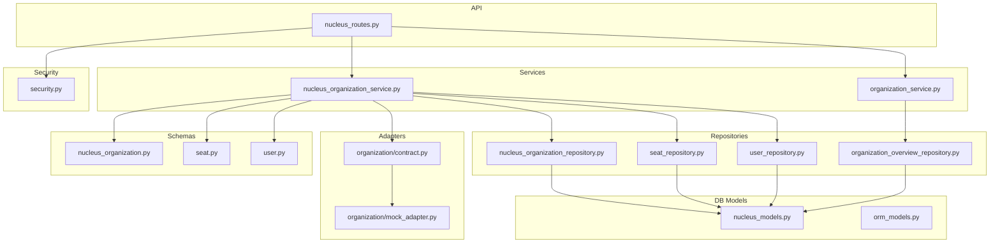
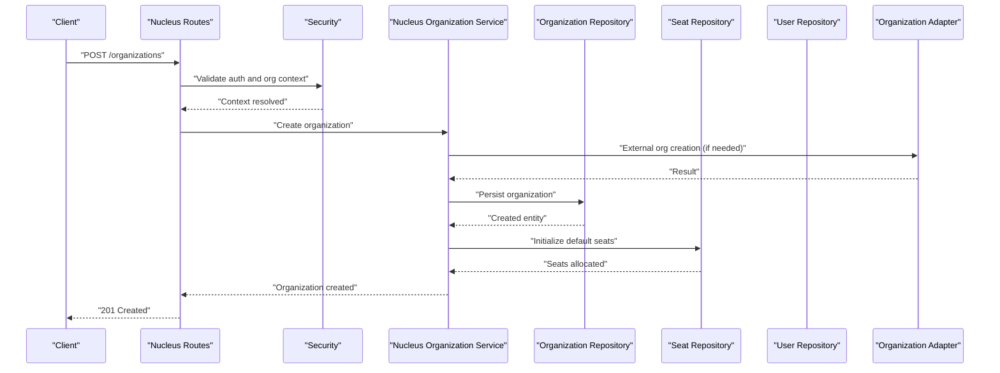
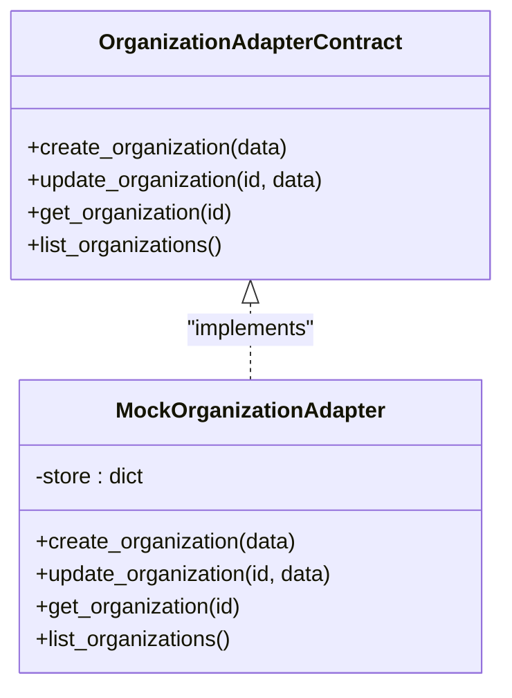
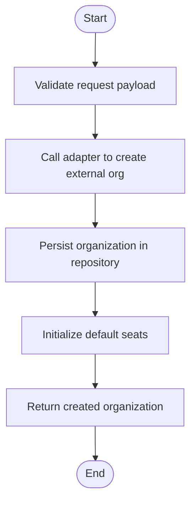
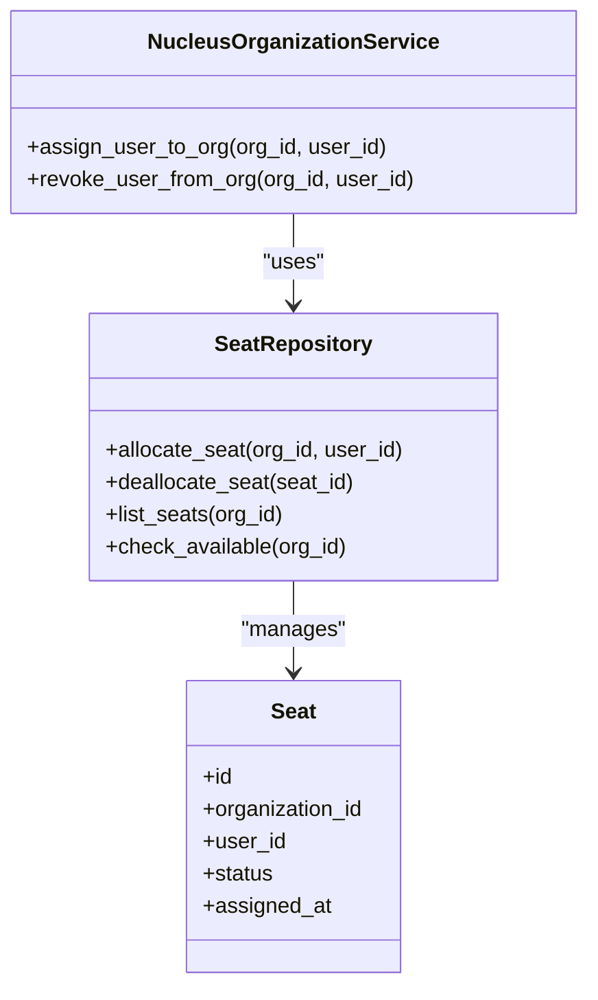
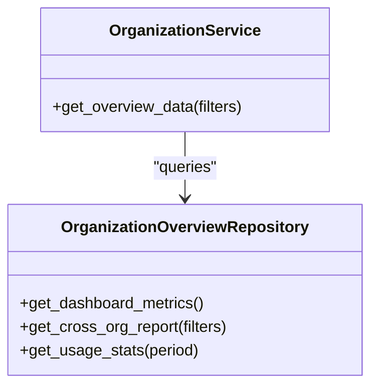
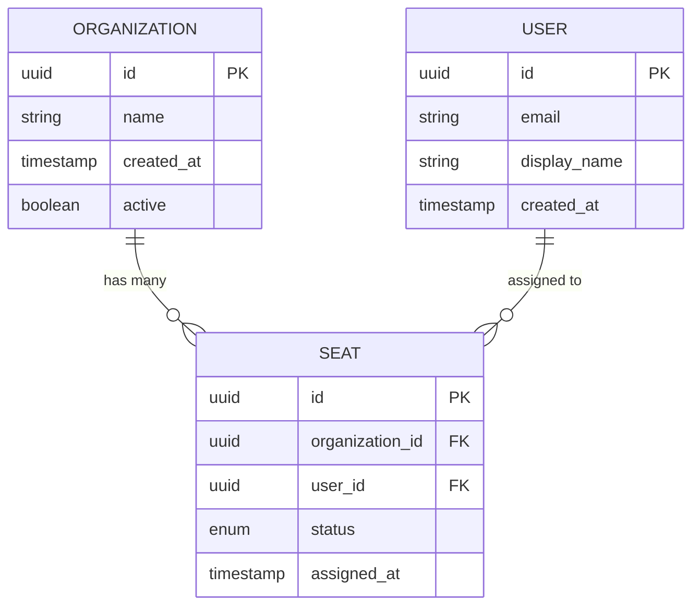
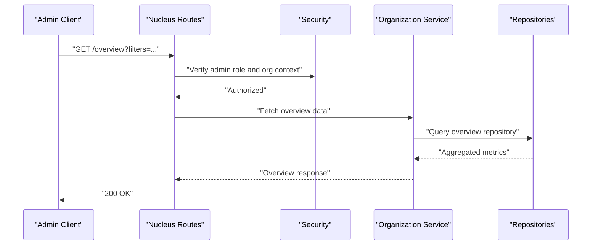
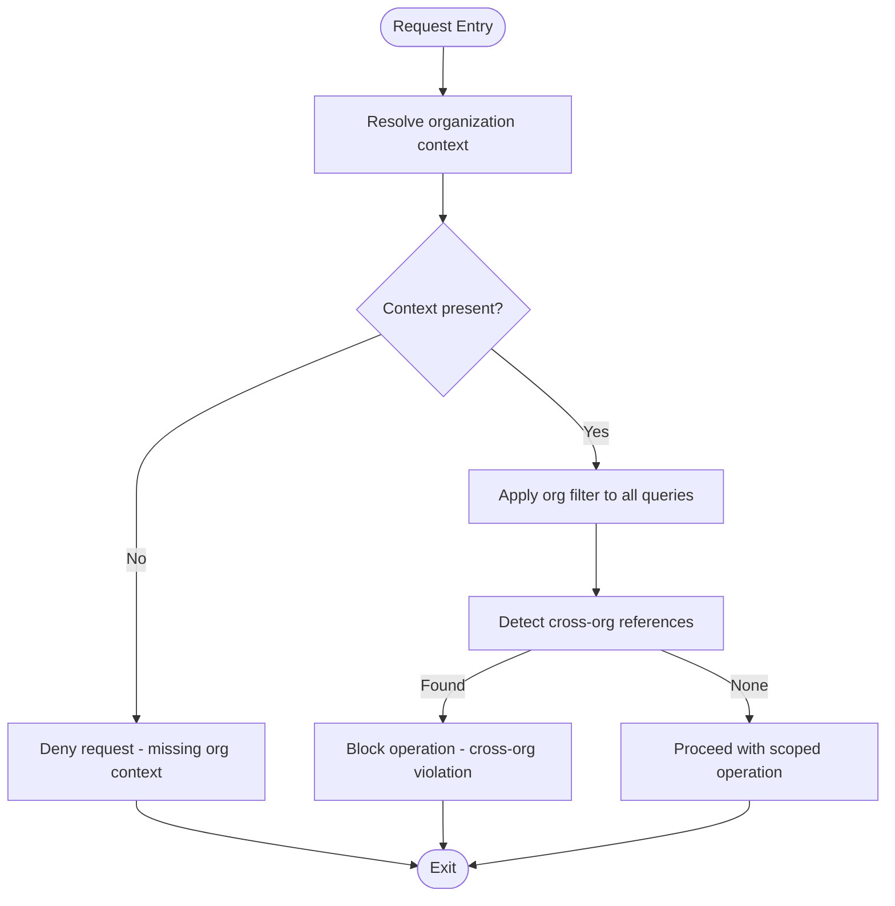
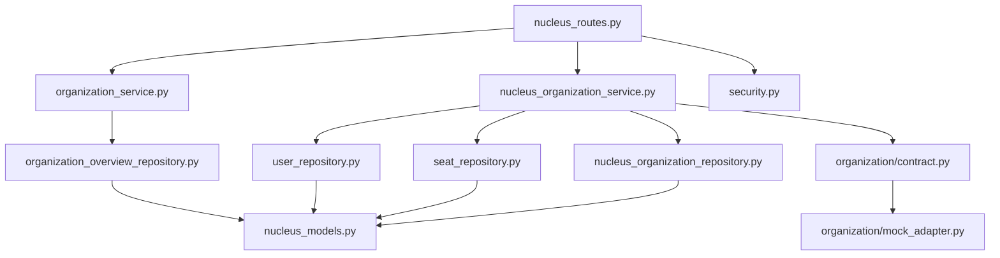

# Multi-Organization Support

<cite>
**Referenced Files in This Document**
- [app/adapters/organization/__init__.py](file://app/adapters/organization/__init__.py)
- [app/adapters/organization/contract.py](file://app/adapters/organization/contract.py)
- [app/adapters/organization/mock_adapter.py](file://app/adapters/organization/mock_adapter.py)
- [app/repositories/nucleus_organization_repository.py](file://app/repositories/nucleus_organization_repository.py)
- [app/repositories/seat_repository.py](file://app/repositories/seat_repository.py)
- [app/repositories/user_repository.py](file://app/repositories/user_repository.py)
- [app/repositories/organization_overview_repository.py](file://app/repositories/organization_overview_repository.py)
- [app/services/nucleus_organization_service.py](file://app/services/nucleus_organization_service.py)
- [app/services/organization_service.py](file://app/services/organization_service.py)
- [app/schemas/nucleus_organization.py](file://app/schemas/nucleus_organization.py)
- [app/schemas/seat.py](file://app/schemas/seat.py)
- [app/schemas/user.py](file://app/schemas/user.py)
- [app/db/nucleus_models.py](file://app/db/nucleus_models.py)
- [app/db/orm_models.py](file://app/db/orm_models.py)
- [app/api/nucleus_routes.py](file://app/api/nucleus_routes.py)
- [app/core/security.py](file://app/core/security.py)
- [tests/test_nucleus_organization_api.py](file://tests/test_nucleus_organization_api.py)
- [tests/test_users_seats.py](file://tests/test_users_seats.py)
- [tests/test_organization_boundaries.py](file://tests/test_organization_boundaries.py)
- [tests/test_organization_overview.py](file://tests/test_organization_overview.py)
</cite>

## Table of Contents
1. [Introduction](#introduction)
2. [Project Structure](#project-structure)
3. [Core Components](#core-components)
4. [Architecture Overview](#architecture-overview)
5. [Detailed Component Analysis](#detailed-component-analysis)
6. [Dependency Analysis](#dependency-analysis)
7. [Performance Considerations](#performance-considerations)
8. [Troubleshooting Guide](#troubleshooting-guide)
9. [Conclusion](#conclusion)

## Introduction
This document explains the multi-organization support subsystem, focusing on tenant isolation, seat management, and organization overview capabilities. It details how organizations are created and managed, how users are provisioned with seats, and how access boundaries are enforced to prevent cross-organization data leakage. The design uses an adapter pattern for external organization services and a contract-based approach to define service boundaries. Cross-organization query prevention, performance considerations for multi-tenant queries, and data synchronization strategies are also covered.

## Project Structure
The multi-organization subsystem spans adapters, repositories, services, schemas, database models, API routes, and tests:
- Adapters encapsulate external organization services behind contracts
- Repositories implement persistence and projection logic for organizations, seats, and users
- Services orchestrate business logic and enforce boundaries
- Schemas define request/response shapes
- Database models represent entities and relationships
- API routes expose administrative endpoints
- Tests validate behavior including boundaries and seat management

**Diagram sources**
- [app/adapters/organization/contract.py](file://app/adapters/organization/contract.py)
- [app/adapters/organization/mock_adapter.py](file://app/adapters/organization/mock_adapter.py)
- [app/repositories/nucleus_organization_repository.py](file://app/repositories/nucleus_organization_repository.py)
- [app/repositories/seat_repository.py](file://app/repositories/seat_repository.py)
- [app/repositories/user_repository.py](file://app/repositories/user_repository.py)
- [app/repositories/organization_overview_repository.py](file://app/repositories/organization_overview_repository.py)
- [app/services/nucleus_organization_service.py](file://app/services/nucleus_organization_service.py)
- [app/services/organization_service.py](file://app/services/organization_service.py)
- [app/schemas/nucleus_organization.py](file://app/schemas/nucleus_organization.py)
- [app/schemas/seat.py](file://app/schemas/seat.py)
- [app/schemas/user.py](file://app/schemas/user.py)
- [app/db/nucleus_models.py](file://app/db/nucleus_models.py)
- [app/db/orm_models.py](file://app/db/orm_models.py)
- [app/api/nucleus_routes.py](file://app/api/nucleus_routes.py)
- [app/core/security.py](file://app/core/security.py)

**Section sources**
- [app/adapters/organization/contract.py](file://app/adapters/organization/contract.py)
- [app/adapters/organization/mock_adapter.py](file://app/adapters/organization/mock_adapter.py)
- [app/repositories/nucleus_organization_repository.py](file://app/repositories/nucleus_organization_repository.py)
- [app/repositories/seat_repository.py](file://app/repositories/seat_repository.py)
- [app/repositories/user_repository.py](file://app/repositories/user_repository.py)
- [app/repositories/organization_overview_repository.py](file://app/repositories/organization_overview_repository.py)
- [app/services/nucleus_organization_service.py](file://app/services/nucleus_organization_service.py)
- [app/services/organization_service.py](file://app/services/organization_service.py)
- [app/schemas/nucleus_organization.py](file://app/schemas/nucleus_organization.py)
- [app/schemas/seat.py](file://app/schemas/seat.py)
- [app/schemas/user.py](file://app/schemas/user.py)
- [app/db/nucleus_models.py](file://app/db/nucleus_models.py)
- [app/db/orm_models.py](file://app/db/orm_models.py)
- [app/api/nucleus_routes.py](file://app/api/nucleus_routes.py)
- [app/core/security.py](file://app/core/security.py)

## Core Components
- Adapter Contract and Implementation: Defines the interface for external organization services and provides a mock implementation for testing.
- Organization Repository: Persists and retrieves organization entities and projections.
- Seat Repository: Manages license allocation and user-seat assignments.
- User Repository: Handles user provisioning and membership within organizations.
- Organization Overview Repository: Provides aggregated views for administrative dashboards and cross-organization reporting.
- Services: Orchestrate operations such as creating organizations, assigning seats, and enforcing boundaries.
- Schemas: Define typed request/response structures for APIs.
- DB Models: Represent core entities and relationships.
- Security: Enforces authentication and authorization checks at API boundaries.

Key responsibilities:
- Tenant isolation: All reads/writes must be scoped to a specific organization context.
- Seat management: Track available licenses and enforce assignment limits.
- Access control: Ensure users can only access resources within their assigned organization.
- Cross-org prevention: Reject or sanitize queries that attempt to span multiple organizations.

**Section sources**
- [app/adapters/organization/contract.py](file://app/adapters/organization/contract.py)
- [app/adapters/organization/mock_adapter.py](file://app/adapters/organization/mock_adapter.py)
- [app/repositories/nucleus_organization_repository.py](file://app/repositories/nucleus_organization_repository.py)
- [app/repositories/seat_repository.py](file://app/repositories/seat_repository.py)
- [app/repositories/user_repository.py](file://app/repositories/user_repository.py)
- [app/repositories/organization_overview_repository.py](file://app/repositories/organization_overview_repository.py)
- [app/services/nucleus_organization_service.py](file://app/services/nucleus_organization_service.py)
- [app/services/organization_service.py](file://app/services/organization_service.py)
- [app/schemas/nucleus_organization.py](file://app/schemas/nucleus_organization.py)
- [app/schemas/seat.py](file://app/schemas/seat.py)
- [app/schemas/user.py](file://app/schemas/user.py)
- [app/db/nucleus_models.py](file://app/db/nucleus_models.py)
- [app/db/orm_models.py](file://app/db/orm_models.py)
- [app/core/security.py](file://app/core/security.py)

## Architecture Overview
The subsystem follows layered architecture with clear boundaries:
- API layer exposes endpoints for organization administration and seat management.
- Service layer enforces business rules, tenant scoping, and cross-org prevention.
- Repository layer persists data and builds projections for dashboards.
- Adapter layer abstracts external organization services via contracts.
- Security middleware validates requests and injects organization context.

**Diagram sources**
- [app/api/nucleus_routes.py](file://app/api/nucleus_routes.py)
- [app/core/security.py](file://app/core/security.py)
- [app/services/nucleus_organization_service.py](file://app/services/nucleus_organization_service.py)
- [app/repositories/nucleus_organization_repository.py](file://app/repositories/nucleus_organization_repository.py)
- [app/repositories/seat_repository.py](file://app/repositories/seat_repository.py)
- [app/adapters/organization/contract.py](file://app/adapters/organization/contract.py)

## Detailed Component Analysis

### Adapter Pattern for External Organization Services
The adapter defines a contract for interacting with external organization services and includes a mock implementation for testing. This decouples internal logic from external dependencies and enables consistent behavior across environments.

**Diagram sources**
- [app/adapters/organization/contract.py](file://app/adapters/organization/contract.py)
- [app/adapters/organization/mock_adapter.py](file://app/adapters/organization/mock_adapter.py)

**Section sources**
- [app/adapters/organization/contract.py](file://app/adapters/organization/contract.py)
- [app/adapters/organization/mock_adapter.py](file://app/adapters/organization/mock_adapter.py)

### Organization Creation Flow
Creating an organization involves validating input, invoking external services if required, persisting the organization, and initializing seat allocations.

**Diagram sources**
- [app/services/nucleus_organization_service.py](file://app/services/nucleus_organization_service.py)
- [app/repositories/nucleus_organization_repository.py](file://app/repositories/nucleus_organization_repository.py)
- [app/repositories/seat_repository.py](file://app/repositories/seat_repository.py)
- [app/adapters/organization/contract.py](file://app/adapters/organization/contract.py)

**Section sources**
- [app/services/nucleus_organization_service.py](file://app/services/nucleus_organization_service.py)
- [app/repositories/nucleus_organization_repository.py](file://app/repositories/nucleus_organization_repository.py)
- [app/repositories/seat_repository.py](file://app/repositories/seat_repository.py)
- [app/adapters/organization/contract.py](file://app/adapters/organization/contract.py)

### Seat Management System
Seat management tracks license allocation and user provisioning. Seats are tied to organizations and users, ensuring access boundaries and preventing over-allocation.

**Diagram sources**
- [app/repositories/seat_repository.py](file://app/repositories/seat_repository.py)
- [app/services/nucleus_organization_service.py](file://app/services/nucleus_organization_service.py)

**Section sources**
- [app/repositories/seat_repository.py](file://app/repositories/seat_repository.py)
- [app/services/nucleus_organization_service.py](file://app/services/nucleus_organization_service.py)

### Organization Overview Repository
The overview repository aggregates data for administrative dashboards and cross-organization reporting. It provides read-only projections optimized for analytics and summaries.

**Diagram sources**
- [app/repositories/organization_overview_repository.py](file://app/repositories/organization_overview_repository.py)
- [app/services/organization_service.py](file://app/services/organization_service.py)

**Section sources**
- [app/repositories/organization_overview_repository.py](file://app/repositories/organization_overview_repository.py)
- [app/services/organization_service.py](file://app/services/organization_service.py)

### Data Models and Relationships
Organizations, seats, and users form the core data model. Relationships ensure referential integrity and enforce tenant scoping.

**Diagram sources**
- [app/db/nucleus_models.py](file://app/db/nucleus_models.py)
- [app/db/orm_models.py](file://app/db/orm_models.py)

**Section sources**
- [app/db/nucleus_models.py](file://app/db/nucleus_models.py)
- [app/db/orm_models.py](file://app/db/orm_models.py)

### API Endpoints for Multi-Organization Operations
Administrative endpoints allow creating organizations, managing seats, and retrieving overview data. Requests are authenticated and scoped to the current organization context.

**Diagram sources**
- [app/api/nucleus_routes.py](file://app/api/nucleus_routes.py)
- [app/core/security.py](file://app/core/security.py)
- [app/services/organization_service.py](file://app/services/organization_service.py)
- [app/repositories/organization_overview_repository.py](file://app/repositories/organization_overview_repository.py)

**Section sources**
- [app/api/nucleus_routes.py](file://app/api/nucleus_routes.py)
- [app/core/security.py](file://app/core/security.py)
- [app/services/organization_service.py](file://app/services/organization_service.py)
- [app/repositories/organization_overview_repository.py](file://app/repositories/organization_overview_repository.py)

### Boundary Enforcement and Cross-Organization Query Prevention
Boundary enforcement ensures all queries include organization scoping. Cross-organization attempts are rejected early in the pipeline.

**Diagram sources**
- [app/core/security.py](file://app/core/security.py)
- [app/repositories/nucleus_organization_repository.py](file://app/repositories/nucleus_organization_repository.py)
- [app/repositories/seat_repository.py](file://app/repositories/seat_repository.py)
- [app/repositories/user_repository.py](file://app/repositories/user_repository.py)

**Section sources**
- [app/core/security.py](file://app/core/security.py)
- [app/repositories/nucleus_organization_repository.py](file://app/repositories/nucleus_organization_repository.py)
- [app/repositories/seat_repository.py](file://app/repositories/seat_repository.py)
- [app/repositories/user_repository.py](file://app/repositories/user_repository.py)

### Concrete Examples from Codebase
- Organization creation: See test cases demonstrating POST flows and validation.
- User assignment: See tests covering seat allocation and user provisioning.
- Boundary enforcement: See tests asserting cross-org query prevention.

**Section sources**
- [tests/test_nucleus_organization_api.py](file://tests/test_nucleus_organization_api.py)
- [tests/test_users_seats.py](file://tests/test_users_seats.py)
- [tests/test_organization_boundaries.py](file://tests/test_organization_boundaries.py)

## Dependency Analysis
The subsystem exhibits low coupling between layers and strong cohesion within components. Dependencies flow downward: API -> Services -> Repositories -> DB Models. Adapters are isolated behind contracts, minimizing external impact.

**Diagram sources**
- [app/api/nucleus_routes.py](file://app/api/nucleus_routes.py)
- [app/services/nucleus_organization_service.py](file://app/services/nucleus_organization_service.py)
- [app/services/organization_service.py](file://app/services/organization_service.py)
- [app/repositories/nucleus_organization_repository.py](file://app/repositories/nucleus_organization_repository.py)
- [app/repositories/seat_repository.py](file://app/repositories/seat_repository.py)
- [app/repositories/user_repository.py](file://app/repositories/user_repository.py)
- [app/repositories/organization_overview_repository.py](file://app/repositories/organization_overview_repository.py)
- [app/db/nucleus_models.py](file://app/db/nucleus_models.py)
- [app/adapters/organization/contract.py](file://app/adapters/organization/contract.py)
- [app/adapters/organization/mock_adapter.py](file://app/adapters/organization/mock_adapter.py)
- [app/core/security.py](file://app/core/security.py)

**Section sources**
- [app/api/nucleus_routes.py](file://app/api/nucleus_routes.py)
- [app/services/nucleus_organization_service.py](file://app/services/nucleus_organization_service.py)
- [app/services/organization_service.py](file://app/services/organization_service.py)
- [app/repositories/nucleus_organization_repository.py](file://app/repositories/nucleus_organization_repository.py)
- [app/repositories/seat_repository.py](file://app/repositories/seat_repository.py)
- [app/repositories/user_repository.py](file://app/repositories/user_repository.py)
- [app/repositories/organization_overview_repository.py](file://app/repositories/organization_overview_repository.py)
- [app/db/nucleus_models.py](file://app/db/nucleus_models.py)
- [app/adapters/organization/contract.py](file://app/adapters/organization/contract.py)
- [app/adapters/organization/mock_adapter.py](file://app/adapters/organization/mock_adapter.py)
- [app/core/security.py](file://app/core/security.py)

## Performance Considerations
- Indexing: Ensure indexes on organization-scoped foreign keys (e.g., organization_id, user_id) to optimize lookups and joins.
- Projection Queries: Use dedicated overview queries to avoid heavy aggregations on transactional tables.
- Caching: Cache frequently accessed organization metadata and seat availability where appropriate.
- Pagination: Implement pagination for list endpoints to reduce payload sizes.
- Batch Operations: Prefer batch inserts/updates for seat provisioning to minimize round trips.

[No sources needed since this section provides general guidance]

## Troubleshooting Guide
Common issues and resolutions:
- Missing organization context: Verify security middleware resolves org context before processing requests.
- Cross-org violations: Inspect logs for boundary enforcement rejections; ensure filters are applied consistently.
- Seat allocation failures: Check seat availability and constraints; review repository error handling.
- Overview data inconsistencies: Validate projection updates and synchronization jobs.

**Section sources**
- [app/core/security.py](file://app/core/security.py)
- [app/repositories/seat_repository.py](file://app/repositories/seat_repository.py)
- [app/repositories/organization_overview_repository.py](file://app/repositories/organization_overview_repository.py)

## Conclusion
The multi-organization support subsystem provides robust tenant isolation, seat management, and administrative reporting through a layered architecture with clear boundaries. The adapter pattern and contract-based approach enable flexible integration with external services while maintaining consistency. Cross-organization query prevention and performance optimizations ensure secure and efficient operations across organizations.

[No sources needed since this section summarizes without analyzing specific files]