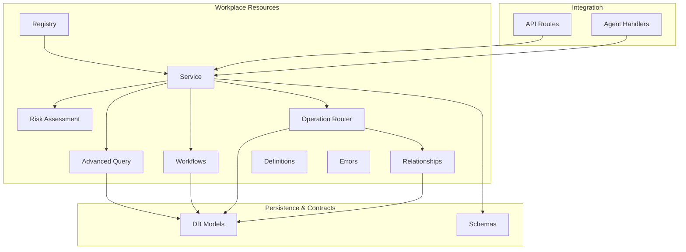
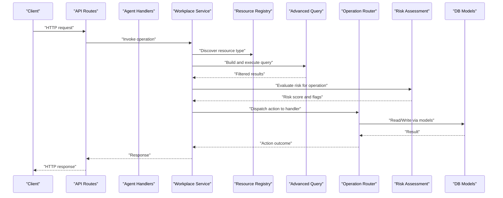
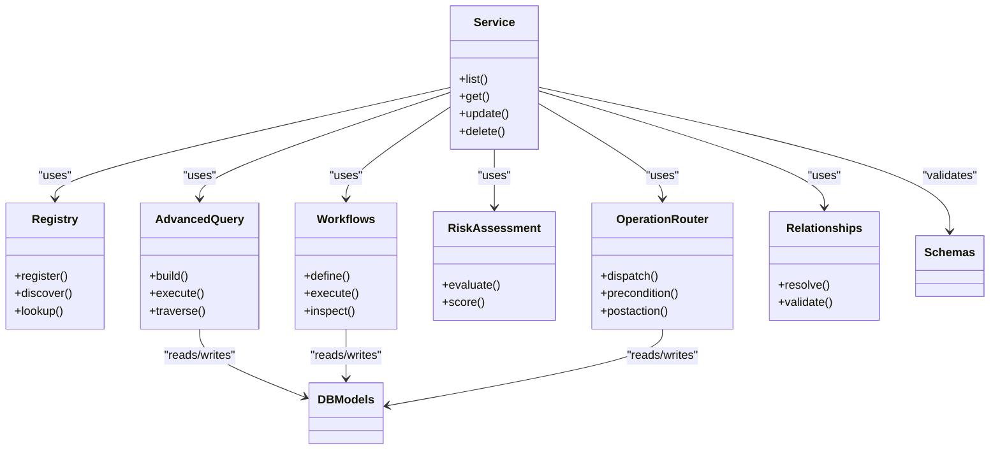

# Workplace Intelligence

<cite>
**Referenced Files in This Document**
- [workplace_resources/__init__.py](file://app/workplace_resources/__init__.py)
- [workplace_resources/registry.py](file://app/workplace_resources/registry.py)
- [workplace_resources/service.py](file://app/workplace_resources/service.py)
- [workplace_resources/advanced_query.py](file://app/workplace_resources/advanced_query.py)
- [workplace_resources/workflows.py](file://app/workplace_resources/workflows.py)
- [workplace_resources/risk.py](file://app/workplace_resources/risk.py)
- [workplace_resources/operation_router.py](file://app/workplace_resources/operation_router.py)
- [workplace_resources/relationships.py](file://app/workplace_resources/relationships.py)
- [workplace_resources/definitions.py](file://app/workplace_resources/definitions.py)
- [workplace_resources/errors.py](file://app/workplace_resources/errors.py)
- [db/workplace_resource_models.py](file://app/db/workplace_resource_models.py)
- [schemas/workplace_resources.py](file://app/schemas/workplace_resources.py)
- [api/workplace_resource_routes.py](file://app/api/workplace_resource_routes.py)
- [agent/workplace_resource_handlers.py](file://app/agent/workplace_resource_handlers.py)
- [tests/test_workplace_intelligence.py](file://tests/test_workplace_intelligence.py)
- [tests/test_workplace_resource_registry.py](file://tests/test_workplace_resource_registry.py)
- [tests/test_advanced_query.py](file://tests/test_advanced_query.py)
- [tests/test_workplace_workflows.py](file://tests/test_workplace_workflows.py)
- [tests/test_workplace_operation_router.py](file://tests/test_workplace_operation_router.py)
</cite>

## Table of Contents
1. [Introduction](#introduction)
2. [Project Structure](#project-structure)
3. [Core Components](#core-components)
4. [Architecture Overview](#architecture-overview)
5. [Detailed Component Analysis](#detailed-component-analysis)
6. [Dependency Analysis](#dependency-analysis)
7. [Performance Considerations](#performance-considerations)
8. [Troubleshooting Guide](#troubleshooting-guide)
9. [Conclusion](#conclusion)

## Introduction
This document describes the workplace intelligence subsystem that powers dynamic resource discovery, declarative workflow execution, advanced querying, risk assessment, operation routing, and relationship management for workplace resources. It explains how resources are registered and discovered at runtime, how workflows are defined and executed automatically, how complex queries are constructed and optimized, and how operations are routed to resource-specific handlers with safety checks and caching strategies.

## Project Structure
The workplace intelligence subsystem is implemented under app/workplace_resources and integrates with database models, schemas, API routes, agent handlers, and tests. The key modules include:
- Resource registry and service for dynamic registration and lifecycle management
- Advanced query engine for filtering and traversal
- Workflow engine for declarative definitions and automated execution
- Risk assessment framework for evaluating operational impact
- Operation router for dispatching actions to resource-specific handlers
- Relationships manager for entity connections
- Definitions and errors for shared contracts and exceptions
- Database models and schemas for persistence and validation
- API routes and agent handlers for external access

**Diagram sources**
- [workplace_resources/registry.py](file://app/workplace_resources/registry.py)
- [workplace_resources/service.py](file://app/workplace_resources/service.py)
- [workplace_resources/advanced_query.py](file://app/workplace_resources/advanced_query.py)
- [workplace_resources/workflows.py](file://app/workplace_resources/workflows.py)
- [workplace_resources/risk.py](file://app/workplace_resources/risk.py)
- [workplace_resources/operation_router.py](file://app/workplace_resources/operation_router.py)
- [workplace_resources/relationships.py](file://app/workplace_resources/relationships.py)
- [workplace_resources/definitions.py](file://app/workplace_resources/definitions.py)
- [workplace_resources/errors.py](file://app/workplace_resources/errors.py)
- [db/workplace_resource_models.py](file://app/db/workplace_resource_models.py)
- [schemas/workplace_resources.py](file://app/schemas/workplace_resources.py)
- [api/workplace_resource_routes.py](file://app/api/workplace_resource_routes.py)
- [agent/workplace_resource_handlers.py](file://app/agent/workplace_resource_handlers.py)

**Section sources**
- [workplace_resources/__init__.py](file://app/workplace_resources/__init__.py)
- [workplace_resources/registry.py](file://app/workplace_resources/registry.py)
- [workplace_resources/service.py](file://app/workplace_resources/service.py)
- [workplace_resources/advanced_query.py](file://app/workplace_resources/advanced_query.py)
- [workplace_resources/workflows.py](file://app/workplace_resources/workflows.py)
- [workplace_resources/risk.py](file://app/workplace_resources/risk.py)
- [workplace_resources/operation_router.py](file://app/workplace_resources/operation_router.py)
- [workplace_resources/relationships.py](file://app/workplace_resources/relationships.py)
- [workplace_resources/definitions.py](file://app/workplace_resources/definitions.py)
- [workplace_resources/errors.py](file://app/workplace_resources/errors.py)
- [db/workplace_resource_models.py](file://app/db/workplace_resource_models.py)
- [schemas/workplace_resources.py](file://app/schemas/workplace_resources.py)
- [api/workplace_resource_routes.py](file://app/api/workplace_resource_routes.py)
- [agent/workplace_resource_handlers.py](file://app/agent/workplace_resource_handlers.py)

## Core Components
- Resource Registry: Provides dynamic registration, lookup, and lifecycle management for resource types and instances. It exposes APIs for registering new resource kinds, discovering available resources, and retrieving metadata.
- Service Layer: Orchestrates interactions between registry, query engine, workflows, risk assessment, and routers. It enforces consistency and provides higher-level operations such as listing, reading, updating, and deleting resources.
- Advanced Query Engine: Supports complex filtering, sorting, pagination, and relationship traversal across resource datasets. It translates high-level query specifications into efficient data access patterns.
- Workflow Engine: Enables declarative workflow definitions with steps, conditions, and transitions. It executes workflows automatically based on triggers or explicit invocation, ensuring idempotency and auditability.
- Risk Assessment Framework: Evaluates potential impacts of resource operations using predefined rules and context. It returns risk scores and recommendations to gate or adjust operations.
- Operation Router: Dispatches resource-specific actions to appropriate handlers based on resource type and action name. It supports preconditions, authorization checks, and post-execution hooks.
- Relationships Manager: Maintains entity connections (e.g., belongs-to, has-many) and provides traversal utilities for building related views and enforcing referential integrity.
- Definitions and Errors: Centralized contracts for resource schemas, workflow shapes, and error types used across the subsystem.

**Section sources**
- [workplace_resources/registry.py](file://app/workplace_resources/registry.py)
- [workplace_resources/service.py](file://app/workplace_resources/service.py)
- [workplace_resources/advanced_query.py](file://app/workplace_resources/advanced_query.py)
- [workplace_resources/workflows.py](file://app/workplace_resources/workflows.py)
- [workplace_resources/risk.py](file://app/workplace_resources/risk.py)
- [workplace_resources/operation_router.py](file://app/workplace_resources/operation_router.py)
- [workplace_resources/relationships.py](file://app/workplace_resources/relationships.py)
- [workplace_resources/definitions.py](file://app/workplace_resources/definitions.py)
- [workplace_resources/errors.py](file://app/workplace_resources/errors.py)

## Architecture Overview
The subsystem follows a layered architecture:
- API and Agent layers call into the Service layer.
- Service coordinates Registry, Query, Workflows, Risk, Router, and Relationships.
- Data access uses ORM models and validated schemas.
- Tests validate behavior across components.

**Diagram sources**
- [api/workplace_resource_routes.py](file://app/api/workplace_resource_routes.py)
- [agent/workplace_resource_handlers.py](file://app/agent/workplace_resource_handlers.py)
- [workplace_resources/service.py](file://app/workplace_resources/service.py)
- [workplace_resources/registry.py](file://app/workplace_resources/registry.py)
- [workplace_resources/advanced_query.py](file://app/workplace_resources/advanced_query.py)
- [workplace_resources/operation_router.py](file://app/workplace_resources/operation_router.py)
- [workplace_resources/risk.py](file://app/workplace_resources/risk.py)
- [db/workplace_resource_models.py](file://app/db/workplace_resource_models.py)

## Detailed Component Analysis

### Resource Registry
Responsibilities:
- Register resource types and their capabilities
- Provide discovery APIs for available resources
- Maintain metadata and versioning for resource definitions
- Support hot-reloading and safe updates during runtime

Key behaviors:
- Registration functions accept resource descriptors and validate against schema contracts
- Lookup methods return typed resource handles with associated handlers and policies
- Lifecycle hooks allow initialization and cleanup per resource instance

Example usage patterns:
- Register a new resource kind by providing its descriptor and handler mapping
- Discover all registered resources for UI rendering or capability introspection
- Retrieve a specific resource instance by identifier and type

**Section sources**
- [workplace_resources/registry.py](file://app/workplace_resources/registry.py)
- [workplace_resources/definitions.py](file://app/workplace_resources/definitions.py)
- [tests/test_workplace_resource_registry.py](file://tests/test_workplace_resource_registry.py)

### Service Layer
Responsibilities:
- Orchestrate cross-cutting concerns: query, risk, routing, relationships
- Provide consistent CRUD and specialized operations over resources
- Enforce transactional boundaries and error normalization

Key behaviors:
- List/read operations combine registry discovery with advanced query filters
- Update/delete operations integrate risk assessment and operation routing
- Relationship traversal utilities assist in constructing responses with related entities

Example usage patterns:
- Build a list endpoint by composing query filters and pagination parameters
- Execute an update flow that evaluates risk before delegating to the router
- Fetch a resource with its relationships resolved through the relationships manager

**Section sources**
- [workplace_resources/service.py](file://app/workplace_resources/service.py)
- [workplace_resources/relationships.py](file://app/workplace_resources/relationships.py)
- [tests/test_workplace_intelligence.py](file://tests/test_workplace_intelligence.py)

### Advanced Query System
Responsibilities:
- Translate high-level query specifications into efficient data retrieval
- Support filtering by fields, operators, and nested conditions
- Enable sorting, pagination, and projection of fields
- Optimize performance for large datasets via indexing hints and query composition

Key behaviors:
- Query builders accept structured filters and produce optimized queries
- Relationship traversal allows joining related entities without N+1 queries
- Caching strategies can be applied to repeated queries with stable inputs

Example usage patterns:
- Construct a filter that matches multiple criteria across fields and relations
- Apply pagination and sort order for UI lists
- Use projections to limit returned fields for bandwidth efficiency

**Section sources**
- [workplace_resources/advanced_query.py](file://app/workplace_resources/advanced_query.py)
- [tests/test_advanced_query.py](file://tests/test_advanced_query.py)

### Workflow Engine
Responsibilities:
- Define workflows declaratively with steps, conditions, and transitions
- Execute workflows automatically based on triggers or explicit calls
- Ensure idempotent execution and maintain audit trails

Key behaviors:
- Workflow definitions specify step sequences, guards, and side effects
- Execution engine manages state transitions and retries
- Integration points allow invoking resource operations within workflow steps

Example usage patterns:
- Define a multi-step approval workflow with conditional branches
- Trigger a workflow when a resource is created or updated
- Inspect workflow runs and outcomes for auditing and debugging

**Section sources**
- [workplace_resources/workflows.py](file://app/workplace_resources/workflows.py)
- [tests/test_workplace_workflows.py](file://tests/test_workplace_workflows.py)

### Risk Assessment Framework
Responsibilities:
- Evaluate potential impacts of resource operations using rules and context
- Return risk scores and flags to inform gating decisions
- Integrate with operation router to enforce safety policies

Key behaviors:
- Risk evaluators analyze operation type, target resource attributes, and environment
- Scoring thresholds determine whether to allow, warn, or block operations
- Results can influence routing decisions and user feedback

Example usage patterns:
- Assess risk for delete operations on critical resources
- Combine risk evaluation with authorization checks before executing actions
- Log risk assessments for compliance and observability

**Section sources**
- [workplace_resources/risk.py](file://app/workplace_resources/risk.py)

### Operation Router
Responsibilities:
- Route resource-specific actions to appropriate handlers
- Support preconditions, authorization, and post-execution hooks
- Provide consistent error handling and result normalization

Key behaviors:
- Handler registry maps resource types and action names to implementations
- Pre-flight checks ensure prerequisites are met before execution
- Post-actions can trigger notifications or audit events

Example usage patterns:
- Dispatch a custom action on a resource type via the router
- Implement a handler that performs domain-specific logic safely
- Use router middleware to enforce common policies across actions

**Section sources**
- [workplace_resources/operation_router.py](file://app/workplace_resources/operation_router.py)
- [tests/test_workplace_operation_router.py](file://tests/test_workplace_operation_router.py)

### Relationships Manager
Responsibilities:
- Manage entity connections and provide traversal utilities
- Enforce referential integrity and support lazy loading
- Assist in building rich responses with related data

Key behaviors:
- Relationship definitions describe cardinality and constraints
- Traversal methods resolve related entities efficiently
- Integrity checks prevent orphaned references

Example usage patterns:
- Resolve a resource’s parent-child relationships for display
- Validate relationships before performing mutations
- Use traversal helpers to build hierarchical views

**Section sources**
- [workplace_resources/relationships.py](file://app/workplace_resources/relationships.py)

### Definitions and Errors
Responsibilities:
- Centralize shared contracts for resource schemas, workflow shapes, and error types
- Provide validation and documentation for API consumers

Key behaviors:
- Schema definitions ensure consistent payloads across services
- Error types standardize failure reporting and client handling

Example usage patterns:
- Reference definition constants when constructing queries or workflows
- Handle standardized errors in API responses and logs

**Section sources**
- [workplace_resources/definitions.py](file://app/workplace_resources/definitions.py)
- [workplace_resources/errors.py](file://app/workplace_resources/errors.py)

## Dependency Analysis
The subsystem exhibits clear separation of concerns:
- Service depends on Registry, Query, Workflows, Risk, Router, and Relationships
- Router depends on DB models and optional middleware
- Query and Workflows depend on DB models and schemas
- API and Agent layers depend on Service

**Diagram sources**
- [workplace_resources/service.py](file://app/workplace_resources/service.py)
- [workplace_resources/registry.py](file://app/workplace_resources/registry.py)
- [workplace_resources/advanced_query.py](file://app/workplace_resources/advanced_query.py)
- [workplace_resources/workflows.py](file://app/workplace_resources/workflows.py)
- [workplace_resources/risk.py](file://app/workplace_resources/risk.py)
- [workplace_resources/operation_router.py](file://app/workplace_resources/operation_router.py)
- [workplace_resources/relationships.py](file://app/workplace_resources/relationships.py)
- [db/workplace_resource_models.py](file://app/db/workplace_resource_models.py)
- [schemas/workplace_resources.py](file://app/schemas/workplace_resources.py)

**Section sources**
- [workplace_resources/service.py](file://app/workplace_resources/service.py)
- [workplace_resources/registry.py](file://app/workplace_resources/registry.py)
- [workplace_resources/advanced_query.py](file://app/workplace_resources/advanced_query.py)
- [workplace_resources/workflows.py](file://app/workplace_resources/workflows.py)
- [workplace_resources/risk.py](file://app/workplace_resources/risk.py)
- [workplace_resources/operation_router.py](file://app/workplace_resources/operation_router.py)
- [workplace_resources/relationships.py](file://app/workplace_resources/relationships.py)
- [db/workplace_resource_models.py](file://app/db/workplace_resource_models.py)
- [schemas/workplace_resources.py](file://app/schemas/workplace_resources.py)

## Performance Considerations
- Indexing strategies:
  - Add indexes on frequently filtered fields and join keys to reduce query latency
  - Use composite indexes for multi-field filters commonly used together
- Query optimization techniques:
  - Prefer projections to limit payload size
  - Avoid N+1 queries by leveraging relationship traversal utilities
  - Cache stable query results where appropriate
- Caching strategies:
  - Apply read-through caches for expensive lookups with low mutation frequency
  - Invalidate caches on write paths or via event-driven invalidation
- Large-scale dataset considerations:
  - Implement pagination and cursor-based navigation for lists
  - Use streaming or chunked processing for bulk operations
  - Monitor slow queries and adjust indexes accordingly

[No sources needed since this section provides general guidance]

## Troubleshooting Guide
Common issues and resolutions:
- Registration failures:
  - Verify resource descriptors match schema definitions
  - Check for duplicate registrations and handle conflicts gracefully
- Query errors:
  - Validate filter syntax and supported operators
  - Ensure required indexes exist for complex filters
- Workflow execution problems:
  - Inspect step logs and state transitions
  - Confirm precondition checks pass before execution
- Routing mismatches:
  - Confirm handler mappings for resource types and actions
  - Review preconditions and authorization policies
- Risk assessment blocks:
  - Adjust thresholds or add context to improve accuracy
  - Log detailed reasons for blocking decisions

**Section sources**
- [workplace_resources/errors.py](file://app/workplace_resources/errors.py)
- [workplace_resources/registry.py](file://app/workplace_resources/registry.py)
- [workplace_resources/advanced_query.py](file://app/workplace_resources/advanced_query.py)
- [workplace_resources/workflows.py](file://app/workplace_resources/workflows.py)
- [workplace_resources/operation_router.py](file://app/workplace_resources/operation_router.py)
- [workplace_resources/risk.py](file://app/workplace_resources/risk.py)

## Conclusion
The workplace intelligence subsystem provides a robust foundation for dynamic resource management, automated workflows, advanced querying, and safe operation routing. By combining a strong registry, expressive query engine, declarative workflows, risk-aware routing, and relationship management, it enables scalable and reliable workplace operations. Proper indexing, caching, and query optimization further ensure performance at scale.