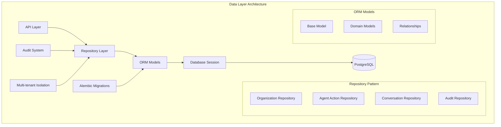
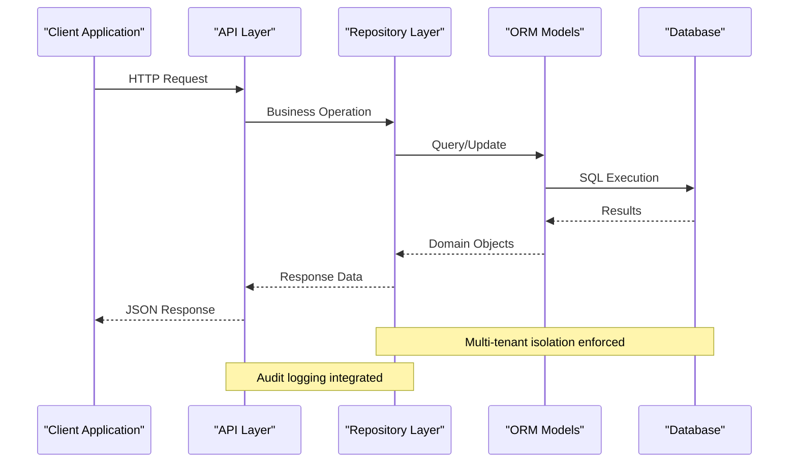
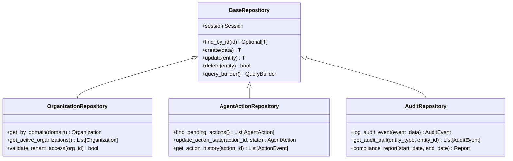
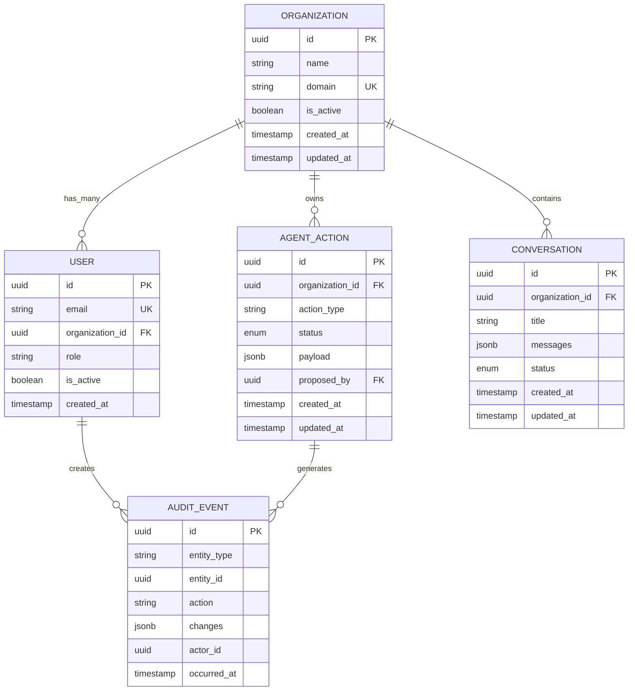
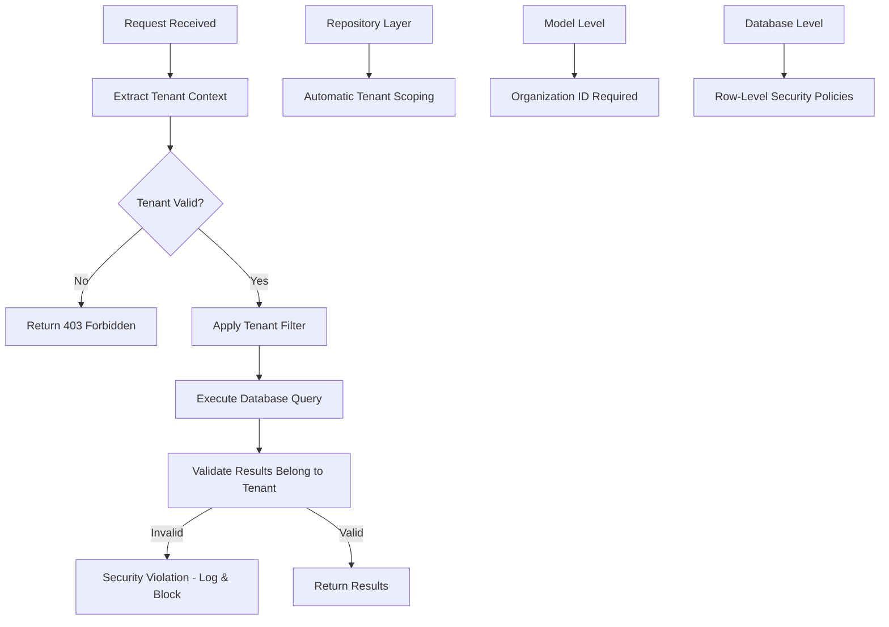
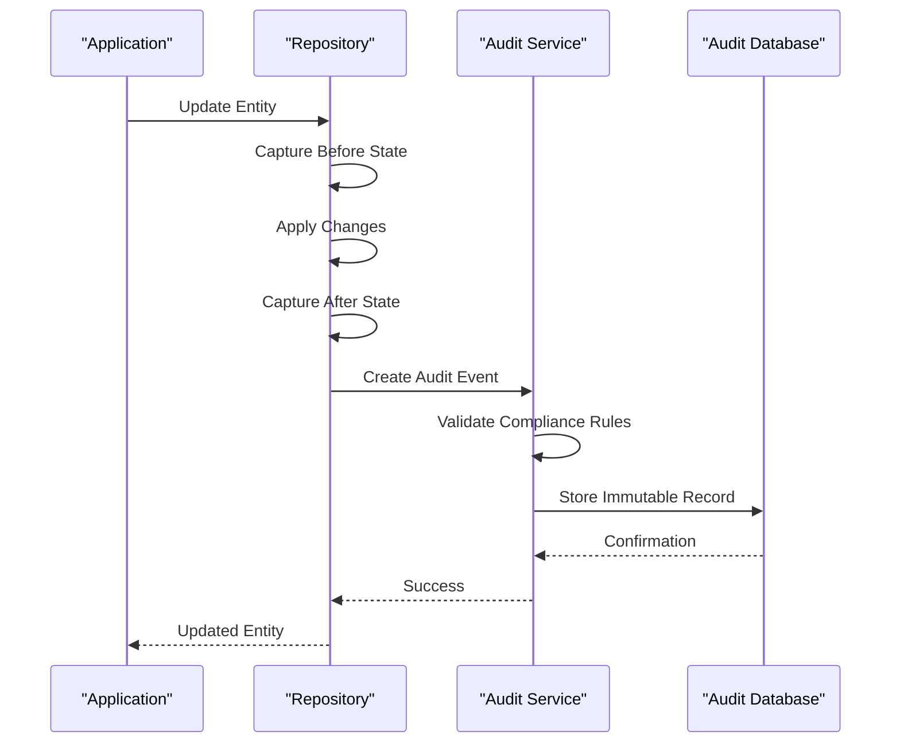
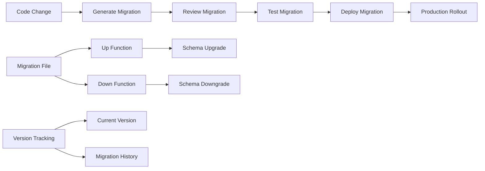
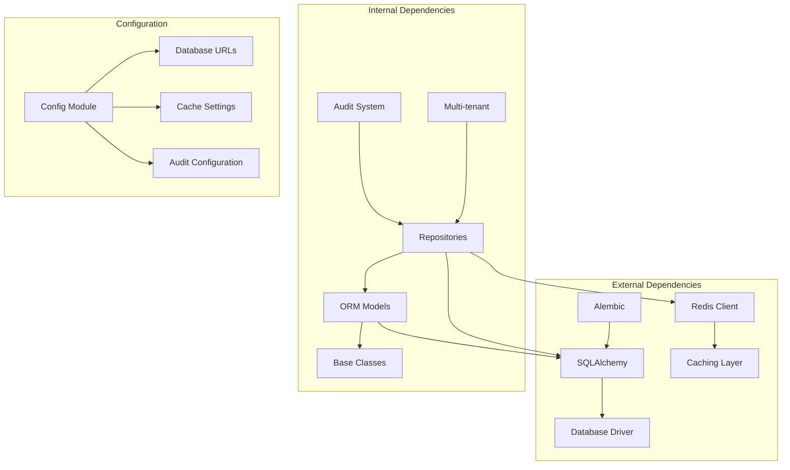
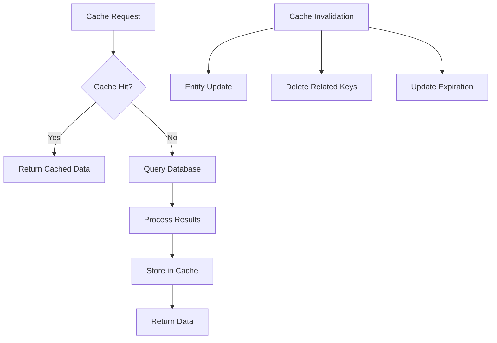

# Data Architecture & Storage

<cite>
**Referenced Files in This Document**
- [base.py](file://app/db/base.py)
- [session.py](file://app/db/session.py)
- [orm_models.py](file://app/db/orm_models.py)
- [action_models.py](file://app/db/action_models.py)
- [agent_run_models.py](file://app/db/agent_run_models.py)
- [nucleus_models.py](file://app/db/nucleus_models.py)
- [audit_repository.py](file://app/repositories/audit_repository.py)
- [organization_repository.py](file://app/repositories/organization_repository.py)
- [conversation_repository.py](file://app/repositories/conversation_repository.py)
- [env.py](file://alembic/env.py)
- [0001_initial.py](file://alembic/versions/0001_initial.py)
- [config.py](file://app/core/config.py)
</cite>

## Table of Contents
1. [Introduction](#introduction)
2. [Project Structure](#project-structure)
3. [Core Components](#core-components)
4. [Architecture Overview](#architecture-overview)
5. [Detailed Component Analysis](#detailed-component-analysis)
6. [Dependency Analysis](#dependency-analysis)
7. [Performance Considerations](#performance-considerations)
8. [Troubleshooting Guide](#troubleshooting-guide)
9. [Conclusion](#conclusion)

## Introduction

This document provides comprehensive architectural documentation for the data layer design and storage strategies implemented in the application. The system employs a modern, scalable architecture built around SQLAlchemy ORM, repository pattern implementation, multi-tenant data isolation, audit trail systems, and robust data migration management through Alembic.

The data layer is designed to support complex business requirements including agent orchestration, organizational boundaries, conversation management, and comprehensive audit logging while maintaining high performance and data integrity.

## Project Structure

The data layer follows a clean separation of concerns with distinct responsibilities:

**Diagram sources**
- [base.py](file://app/db/base.py)
- [session.py](file://app/db/session.py)
- [orm_models.py](file://app/db/orm_models.py)

**Section sources**
- [base.py](file://app/db/base.py)
- [session.py](file://app/db/session.py)
- [orm_models.py](file://app/db/orm_models.py)

## Core Components

### Database Session Management

The session management provides connection pooling, transaction handling, and tenant-aware database access. It implements proper resource cleanup and error handling patterns.

### Repository Pattern Implementation

The repository layer abstracts database operations behind clean interfaces, providing:
- Consistent CRUD operations
- Complex query composition
- Transaction boundary management
- Multi-tenant data isolation enforcement
- Audit trail integration

### ORM Model Architecture

SQLAlchemy models implement:
- Declarative base classes
- Relationship definitions
- Validation constraints
- Multi-tenant scoping
- Audit field automation

**Section sources**
- [session.py](file://app/db/session.py)
- [audit_repository.py](file://app/repositories/audit_repository.py)
- [organization_repository.py](file://app/repositories/organization_repository.py)

## Architecture Overview

The data architecture follows a layered approach with clear separation between presentation, business logic, and data persistence:

**Diagram sources**
- [session.py](file://app/db/session.py)
- [audit_repository.py](file://app/repositories/audit_repository.py)

## Detailed Component Analysis

### Repository Pattern Implementation

The repository pattern provides clean abstraction over database operations, ensuring loose coupling between business logic and data access:

**Diagram sources**
- [audit_repository.py](file://app/repositories/audit_repository.py)
- [organization_repository.py](file://app/repositories/organization_repository.py)

#### Key Repository Features:

1. **Transaction Management**: Automatic commit/rollback handling
2. **Query Composition**: Fluent API for complex queries
3. **Error Handling**: Consistent exception patterns
4. **Caching Integration**: Redis-backed query result caching
5. **Audit Trail**: Automatic event logging for all mutations

**Section sources**
- [audit_repository.py](file://app/repositories/audit_repository.py)
- [organization_repository.py](file://app/repositories/organization_repository.py)

### ORM Model Architecture

The SQLAlchemy model architecture implements comprehensive relationships, constraints, and validation:

**Diagram sources**
- [orm_models.py](file://app/db/orm_models.py)
- [action_models.py](file://app/db/action_models.py)
- [agent_run_models.py](file://app/db/agent_run_models.py)

#### Model Relationships and Constraints:

1. **Foreign Key Constraints**: Referential integrity enforcement
2. **Unique Constraints**: Email uniqueness, domain uniqueness
3. **Check Constraints**: Status validation, data format validation
4. **Cascade Operations**: Proper deletion and update propagation
5. **Indexing Strategy**: Optimized query performance

**Section sources**
- [orm_models.py](file://app/db/orm_models.py)
- [action_models.py](file://app/db/action_models.py)

### Multi-Tenant Data Isolation

The system implements strict organization boundary enforcement through multiple layers:

**Diagram sources**
- [organization_repository.py](file://app/repositories/organization_repository.py)

#### Isolation Strategies:

1. **Application Level**: Automatic organization_id filtering
2. **Repository Level**: Tenant-scoped query builders
3. **Database Level**: Row-level security policies (optional)
4. **Validation Level**: Cross-tenant access prevention

**Section sources**
- [organization_repository.py](file://app/repositories/organization_repository.py)

### Audit Trail System

The audit system provides immutable logging with compliance requirements:

**Diagram sources**
- [audit_repository.py](file://app/repositories/audit_repository.py)

#### Audit Features:

1. **Immutable Logging**: Append-only audit records
2. **Change Tracking**: Before/after state snapshots
3. **Compliance Reporting**: Regulatory requirement support
4. **Access Control**: Restricted audit log access
5. **Retention Policies**: Configurable data retention

**Section sources**
- [audit_repository.py](file://app/repositories/audit_repository.py)

### Database Schema Evolution with Alembic

The migration system manages schema evolution through versioned migrations:

**Diagram sources**
- [env.py](file://alembic/env.py)
- [0001_initial.py](file://alembic/versions/0001_initial.py)

#### Migration Best Practices:

1. **Idempotent Migrations**: Safe re-execution capability
2. **Data Preservation**: Backward-compatible schema changes
3. **Testing Strategy**: Migration testing in CI/CD pipeline
4. **Rollback Support**: Safe downgrade procedures
5. **Documentation**: Clear change descriptions

**Section sources**
- [env.py](file://alembic/env.py)
- [0001_initial.py](file://alembic/versions/0001_initial.py)

## Dependency Analysis

The data layer dependencies follow clean architecture principles:

**Diagram sources**
- [config.py](file://app/core/config.py)
- [session.py](file://app/db/session.py)

### Key Dependencies:

1. **SQLAlchemy**: ORM framework for database abstraction
2. **Alembic**: Database migration management
3. **Redis**: Caching layer for performance optimization
4. **Pydantic**: Data validation and serialization
5. **UUID**: Unique identifier generation

**Section sources**
- [config.py](file://app/core/config.py)
- [session.py](file://app/db/session.py)

## Performance Considerations

### Query Optimization Strategies

1. **Indexing Strategy**: Strategic index creation for frequently queried columns
2. **Connection Pooling**: Efficient database connection management
3. **Query Caching**: Redis-backed result caching for expensive queries
4. **Lazy Loading**: Optimal relationship loading strategies
5. **Batch Operations**: Bulk insert/update operations for better throughput

### Caching Strategy with Redis

The caching layer implements multiple cache levels:

#### Cache Levels:

1. **Query Result Cache**: Expensive query results
2. **Entity Cache**: Frequently accessed entities
3. **Computed Value Cache**: Aggregated data and statistics
4. **Session Cache**: User session data

**Section sources**
- [session.py](file://app/db/session.py)

## Troubleshooting Guide

### Common Database Issues

1. **Connection Pool Exhaustion**: Monitor pool usage and adjust settings
2. **Slow Queries**: Use query profiling and add appropriate indexes
3. **Deadlocks**: Analyze transaction patterns and optimize locking
4. **Memory Leaks**: Monitor connection lifecycle and cleanup
5. **Migration Failures**: Review migration history and rollback procedures

### Performance Monitoring

1. **Query Performance**: Slow query logging and analysis
2. **Connection Metrics**: Pool utilization and wait times
3. **Cache Hit Rates**: Cache effectiveness monitoring
4. **Audit Log Volume**: Storage growth and performance impact

### Debugging Tools

1. **SQL Logging**: Enable detailed query logging in development
2. **Audit Trail Analysis**: Investigate data changes and access patterns
3. **Migration Testing**: Comprehensive test coverage for schema changes
4. **Load Testing**: Performance validation under various workloads

## Conclusion

The data architecture provides a robust, scalable foundation supporting complex business requirements through well-defined patterns and best practices. The repository pattern ensures clean separation of concerns, while multi-tenant isolation guarantees data security and compliance. The comprehensive audit trail system meets regulatory requirements, and the migration strategy enables safe schema evolution.

Key strengths include:
- Clean abstraction through repository pattern
- Strong multi-tenant data isolation
- Comprehensive audit and compliance features
- Scalable caching strategy
- Robust migration management
- Performance optimization techniques

This architecture supports the application's growth while maintaining data integrity, security, and performance standards.