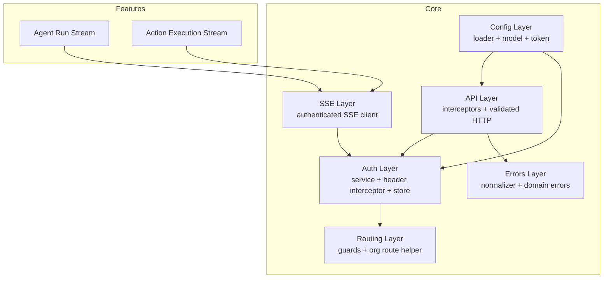
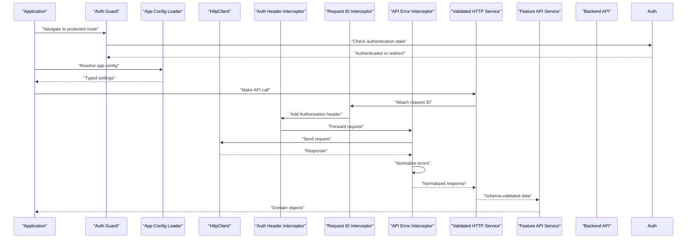
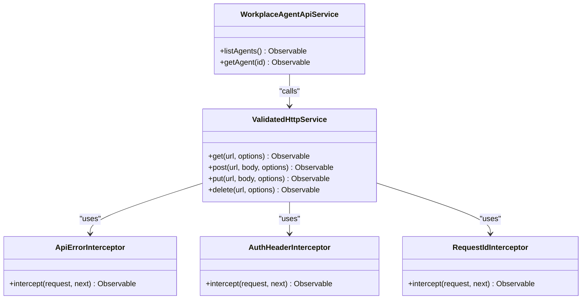
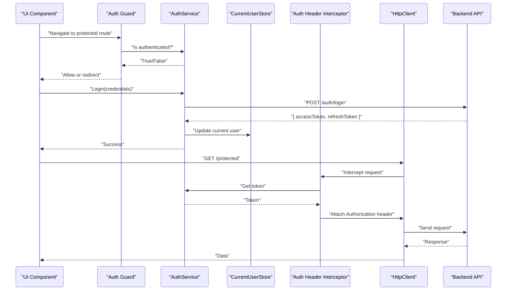
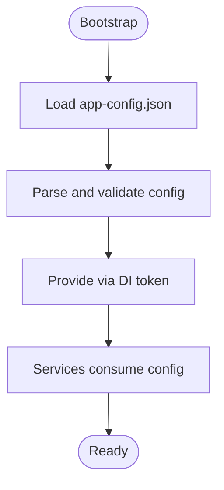
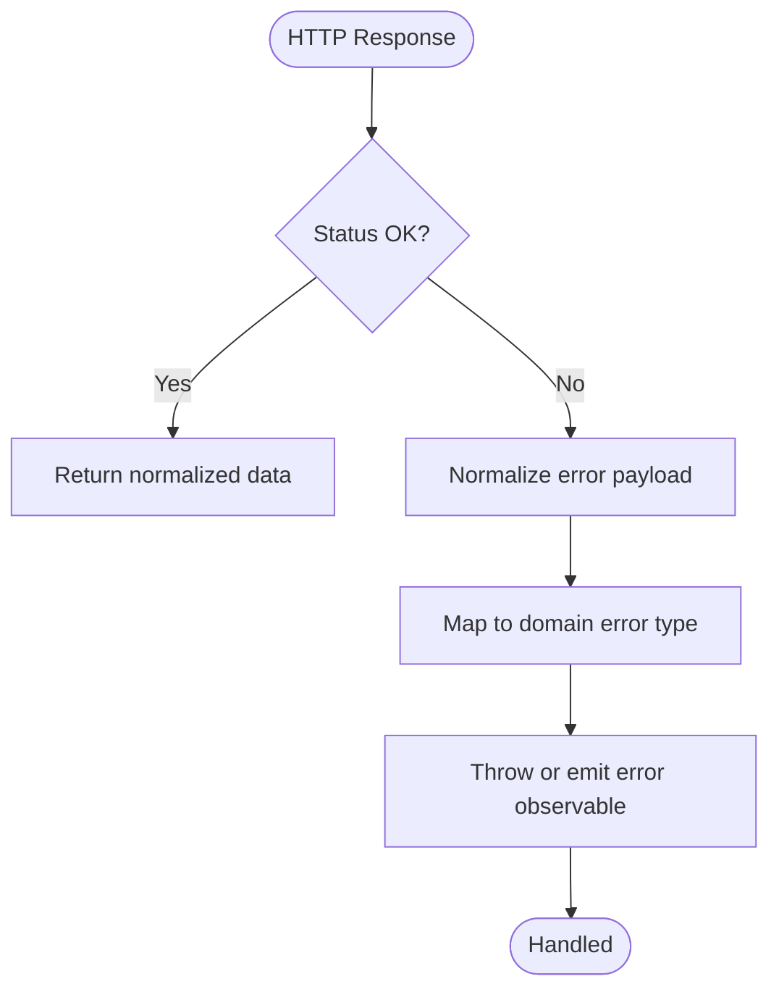
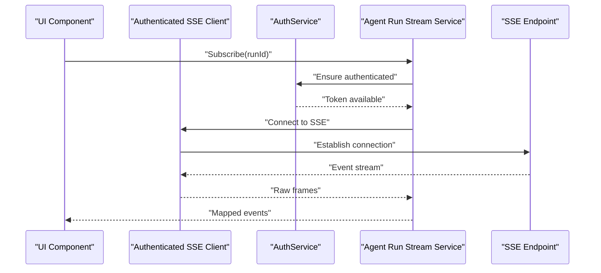
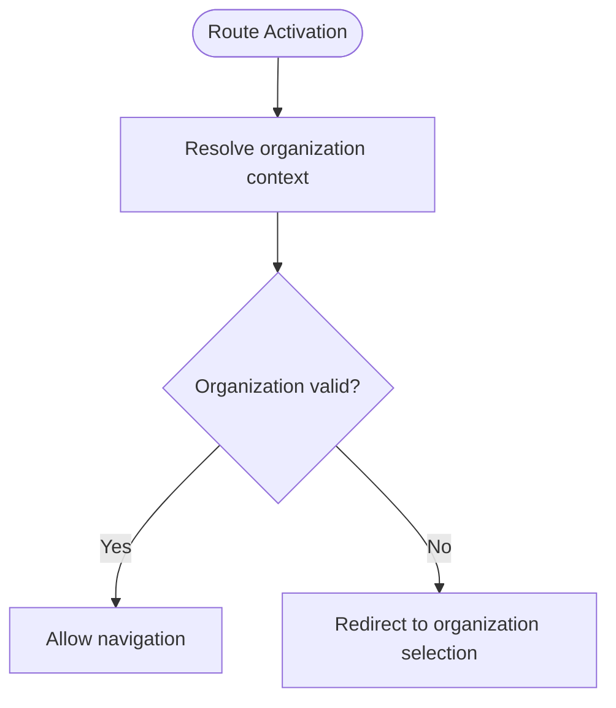
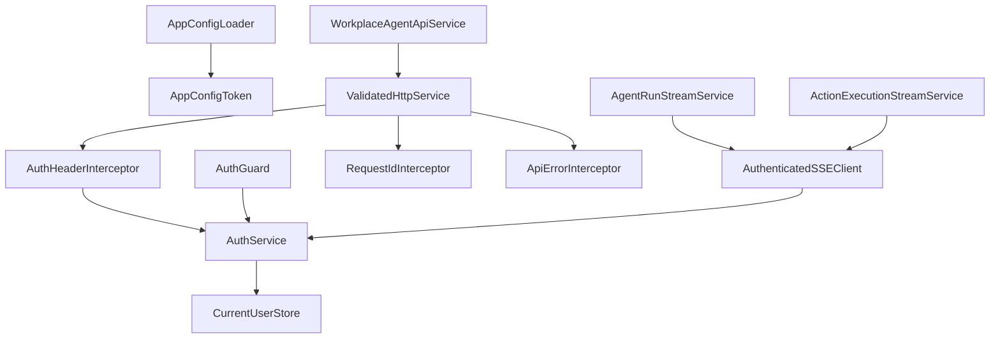

# Core Services & Infrastructure

<cite>
**Referenced Files in This Document**
- [auth.service.ts](file://frontend/src/app/core/auth/auth.service.ts)
- [auth-header.interceptor.ts](file://frontend/src/app/core/auth/auth-header.interceptor.ts)
- [api-error.interceptor.ts](file://frontend/src/app/core/api/api-error.interceptor.ts)
- [request-id.interceptor.ts](file://frontend/src/app/core/api/request-id.interceptor.ts)
- [validated-http.service.ts](file://frontend/src/app/core/api/validated-http.service.ts)
- [workplace-agent-api.service.ts](file://frontend/src/app/core/api/workplace-agent-api.service.ts)
- [current-user.store.ts](file://frontend/src/app/core/auth/current-user.store.ts)
- [auth.guard.ts](file://frontend/src/app/core/routing/auth.guard.ts)
- [organization-route.service.ts](file://frontend/src/app/core/routing/organization-route.service.ts)
- [app-config.loader.ts](file://frontend/src/app/core/config/app-config.loader.ts)
- [app-config.model.ts](file://frontend/src/app/core/config/app-config.model.ts)
- [app-config.token.ts](file://frontend/src/app/core/config/app-config.token.ts)
- [error-normalizer.ts](file://frontend/src/app/core/errors/error-normalizer.ts)
- [workplace-api.error.ts](file://frontend/src/app/core/errors/workplace-api.error.ts)
- [authenticated-sse-client.service.ts](file://frontend/src/app/core/sse/authenticated-sse-client.service.ts)
- [agent-run-stream.service.ts](file://frontend/src/app/core/agent-run/agent-run-stream.service.ts)
- [action-execution-stream.service.ts](file://frontend/src/app/core/action-control/action-execution-stream.service.ts)
- [app.config.ts](file://frontend/src/app/app.config.ts)
- [app.routes.ts](file://frontend/src/app/app.routes.ts)
</cite>

## Table of Contents
1. [Introduction](#introduction)
2. [Project Structure](#project-structure)
3. [Core Components](#core-components)
4. [Architecture Overview](#architecture-overview)
5. [Detailed Component Analysis](#detailed-component-analysis)
6. [Dependency Analysis](#dependency-analysis)
7. [Performance Considerations](#performance-considerations)
8. [Troubleshooting Guide](#troubleshooting-guide)
9. [Conclusion](#conclusion)
10. [Appendices](#appendices)

## Introduction
This document describes the Angular core services and infrastructure layer with a focus on:
- API client architecture, including HTTP interceptors, request/response processing, and validation
- Authentication service implementation with JWT token management, session handling, and route guards
- Configuration management for runtime settings and environment-specific configurations
- Global error handling and normalization patterns
- Service composition and dependency injection patterns
- Testing strategies for core services

The goal is to provide both high-level architectural understanding and code-level details to help developers extend and maintain the system effectively.

## Project Structure
The core layer resides under frontend/src/app/core and is organized by feature area:
- api: HTTP client, interceptors, and wire models
- auth: authentication service, header interceptor, current user store, login modal
- config: application configuration loader, model, and DI token
- errors: global error normalizer and domain-specific error types
- routing: route guards and organization-scoped routing helpers
- sse: authenticated Server-Sent Events client
- agent-run and action-control: streaming clients built on top of SSE

[No sources needed since this diagram shows conceptual structure]

## Core Components
- API Client Architecture
  - Interceptors add authentication headers, attach request IDs, and normalize errors
  - Validated HTTP service wraps HttpClient to enforce schema-based response validation
  - Feature APIs (e.g., workplace agent API) compose the validated HTTP client
- Authentication Service
  - Manages JWT tokens, refresh flow, and current user state
  - Auth header interceptor injects tokens into outgoing requests
  - Route guard enforces authentication before route activation
- Configuration Management
  - Loader fetches app-config.json at startup and exposes typed settings via DI token
- Error Handling
  - Centralized error normalizer converts backend responses into consistent domain errors
  - Domain-specific error classes encapsulate context for UI and logging
- Streaming Clients
  - Authenticated SSE client ensures events are only consumed when authenticated
  - Agent run and action execution streams build on top of the SSE client

**Section sources**
- [auth.service.ts](file://frontend/src/app/core/auth/auth.service.ts)
- [auth-header.interceptor.ts](file://frontend/src/app/core/auth/auth-header.interceptor.ts)
- [api-error.interceptor.ts](file://frontend/src/app/core/api/api-error.interceptor.ts)
- [request-id.interceptor.ts](file://frontend/src/app/core/api/request-id.interceptor.ts)
- [validated-http.service.ts](file://frontend/src/app/core/api/validated-http.service.ts)
- [workplace-agent-api.service.ts](file://frontend/src/app/core/api/workplace-agent-api.service.ts)
- [current-user.store.ts](file://frontend/src/app/core/auth/current-user.store.ts)
- [auth.guard.ts](file://frontend/src/app/core/routing/auth.guard.ts)
- [organization-route.service.ts](file://frontend/src/app/core/routing/organization-route.service.ts)
- [app-config.loader.ts](file://frontend/src/app/core/config/app-config.loader.ts)
- [app-config.model.ts](file://frontend/src/app/core/config/app-config.model.ts)
- [app-config.token.ts](file://frontend/src/app/core/config/app-config.token.ts)
- [error-normalizer.ts](file://frontend/src/app/core/errors/error-normalizer.ts)
- [workplace-api.error.ts](file://frontend/src/app/core/errors/workplace-api.error.ts)
- [authenticated-sse-client.service.ts](file://frontend/src/app/core/sse/authenticated-sse-client.service.ts)
- [agent-run-stream.service.ts](file://frontend/src/app/core/agent-run/agent-run-stream.service.ts)
- [action-execution-stream.service.ts](file://frontend/src/app/core/action-control/action-execution-stream.service.ts)

## Architecture Overview
The core layer composes several cross-cutting concerns around HTTP communication and security:

**Diagram sources**
- [auth.guard.ts](file://frontend/src/app/core/routing/auth.guard.ts)
- [app-config.loader.ts](file://frontend/src/app/core/config/app-config.loader.ts)
- [auth-header.interceptor.ts](file://frontend/src/app/core/auth/auth-header.interceptor.ts)
- [request-id.interceptor.ts](file://frontend/src/app/core/api/request-id.interceptor.ts)
- [api-error.interceptor.ts](file://frontend/src/app/core/api/api-error.interceptor.ts)
- [validated-http.service.ts](file://frontend/src/app/core/api/validated-http.service.ts)
- [workplace-agent-api.service.ts](file://frontend/src/app/core/api/workplace-agent-api.service.ts)

## Detailed Component Analysis

### API Client Architecture
- Interceptors
  - Auth header interceptor attaches bearer tokens from the authentication service
  - Request ID interceptor generates unique identifiers per request for tracing
  - API error interceptor centralizes error transformation and mapping to domain errors
- Validated HTTP Service
  - Wraps HttpClient to perform schema-based validation on responses
  - Provides typed methods that return strongly-typed domain models
- Feature API Services
  - Compose validated HTTP calls for specific domains (e.g., workplace agent API)
  - Encapsulate endpoint paths, query parameters, and payload shaping

**Diagram sources**
- [validated-http.service.ts](file://frontend/src/app/core/api/validated-http.service.ts)
- [api-error.interceptor.ts](file://frontend/src/app/core/api/api-error.interceptor.ts)
- [auth-header.interceptor.ts](file://frontend/src/app/core/auth/auth-header.interceptor.ts)
- [request-id.interceptor.ts](file://frontend/src/app/core/api/request-id.interceptor.ts)
- [workplace-agent-api.service.ts](file://frontend/src/app/core/api/workplace-agent-api.service.ts)

**Section sources**
- [api-error.interceptor.ts](file://frontend/src/app/core/api/api-error.interceptor.ts)
- [request-id.interceptor.ts](file://frontend/src/app/core/api/request-id.interceptor.ts)
- [auth-header.interceptor.ts](file://frontend/src/app/core/auth/auth-header.interceptor.ts)
- [validated-http.service.ts](file://frontend/src/app/core/api/validated-http.service.ts)
- [workplace-agent-api.service.ts](file://frontend/src/app/core/api/workplace-agent-api.service.ts)

### Authentication Service and Flow
- Authentication Service
  - Manages JWT token lifecycle: login, refresh, logout
  - Exposes observable current user state and token availability
- Current User Store
  - Holds current user profile and related metadata
  - Emits updates when authentication state changes
- Auth Header Interceptor
  - Reads token from the authentication service and adds Authorization header
- Route Guard
  - Prevents navigation to protected routes if not authenticated
  - Redirects to login when necessary

**Diagram sources**
- [auth.service.ts](file://frontend/src/app/core/auth/auth.service.ts)
- [current-user.store.ts](file://frontend/src/app/core/auth/current-user.store.ts)
- [auth-header.interceptor.ts](file://frontend/src/app/core/auth/auth-header.interceptor.ts)
- [auth.guard.ts](file://frontend/src/app/core/routing/auth.guard.ts)

**Section sources**
- [auth.service.ts](file://frontend/src/app/core/auth/auth.service.ts)
- [current-user.store.ts](file://frontend/src/app/core/auth/current-user.store.ts)
- [auth-header.interceptor.ts](file://frontend/src/app/core/auth/auth-header.interceptor.ts)
- [auth.guard.ts](file://frontend/src/app/core/routing/auth.guard.ts)

### Configuration Management System
- App Config Loader
  - Fetches app-config.json during application bootstrap
  - Parses and validates configuration values
- App Config Model
  - Defines typed settings for runtime behavior
- App Config Token
  - Provides DI token to inject configuration across services

**Diagram sources**
- [app-config.loader.ts](file://frontend/src/app/core/config/app-config.loader.ts)
- [app-config.model.ts](file://frontend/src/app/core/config/app-config.model.ts)
- [app-config.token.ts](file://frontend/src/app/core/config/app-config.token.ts)

**Section sources**
- [app-config.loader.ts](file://frontend/src/app/core/config/app-config.loader.ts)
- [app-config.model.ts](file://frontend/src/app/core/config/app-config.model.ts)
- [app-config.token.ts](file://frontend/src/app/core/config/app-config.token.ts)

### Global Error Handling and Normalization
- Error Normalizer
  - Converts heterogeneous backend errors into a unified shape
  - Extracts message, code, and contextual fields for UI display
- Domain Error Types
  - Encapsulates specific error categories (e.g., network, validation, authorization)
  - Enables targeted handling and analytics

**Diagram sources**
- [api-error.interceptor.ts](file://frontend/src/app/core/api/api-error.interceptor.ts)
- [error-normalizer.ts](file://frontend/src/app/core/errors/error-normalizer.ts)
- [workplace-api.error.ts](file://frontend/src/app/core/errors/workplace-api.error.ts)

**Section sources**
- [api-error.interceptor.ts](file://frontend/src/app/core/api/api-error.interceptor.ts)
- [error-normalizer.ts](file://frontend/src/app/core/errors/error-normalizer.ts)
- [workplace-api.error.ts](file://frontend/src/app/core/errors/workplace-api.error.ts)

### Streaming Clients (SSE)
- Authenticated SSE Client
  - Ensures event streams are established only when authenticated
  - Reconnects on token refresh or re-authentication
- Agent Run Stream Service
  - Consumes agent run events over SSE
  - Maps frames to domain models
- Action Execution Stream Service
  - Subscribes to action execution events
  - Integrates with action control workflows

**Diagram sources**
- [authenticated-sse-client.service.ts](file://frontend/src/app/core/sse/authenticated-sse-client.service.ts)
- [agent-run-stream.service.ts](file://frontend/src/app/core/agent-run/agent-run-stream.service.ts)
- [action-execution-stream.service.ts](file://frontend/src/app/core/action-control/action-execution-stream.service.ts)
- [auth.service.ts](file://frontend/src/app/core/auth/auth.service.ts)

**Section sources**
- [authenticated-sse-client.service.ts](file://frontend/src/app/core/sse/authenticated-sse-client.service.ts)
- [agent-run-stream.service.ts](file://frontend/src/app/core/agent-run/agent-run-stream.service.ts)
- [action-execution-stream.service.ts](file://frontend/src/app/core/action-control/action-execution-stream.service.ts)

### Organization Routing Helper
- Organization Route Service
  - Resolves organization context for routes
  - Validates organization presence and permissions

**Diagram sources**
- [organization-route.service.ts](file://frontend/src/app/core/routing/organization-route.service.ts)

**Section sources**
- [organization-route.service.ts](file://frontend/src/app/core/routing/organization-route.service.ts)

## Dependency Analysis
Core components interact through well-defined interfaces and DI tokens:

**Diagram sources**
- [auth.service.ts](file://frontend/src/app/core/auth/auth.service.ts)
- [current-user.store.ts](file://frontend/src/app/core/auth/current-user.store.ts)
- [auth-header.interceptor.ts](file://frontend/src/app/core/auth/auth-header.interceptor.ts)
- [auth.guard.ts](file://frontend/src/app/core/routing/auth.guard.ts)
- [app-config.loader.ts](file://frontend/src/app/core/config/app-config.loader.ts)
- [app-config.token.ts](file://frontend/src/app/core/config/app-config.token.ts)
- [validated-http.service.ts](file://frontend/src/app/core/api/validated-http.service.ts)
- [request-id.interceptor.ts](file://frontend/src/app/core/api/request-id.interceptor.ts)
- [api-error.interceptor.ts](file://frontend/src/app/core/api/api-error.interceptor.ts)
- [workplace-agent-api.service.ts](file://frontend/src/app/core/api/workplace-agent-api.service.ts)
- [authenticated-sse-client.service.ts](file://frontend/src/app/core/sse/authenticated-sse-client.service.ts)
- [agent-run-stream.service.ts](file://frontend/src/app/core/agent-run/agent-run-stream.service.ts)
- [action-execution-stream.service.ts](file://frontend/src/app/core/action-control/action-execution-stream.service.ts)

**Section sources**
- [auth.service.ts](file://frontend/src/app/core/auth/auth.service.ts)
- [current-user.store.ts](file://frontend/src/app/core/auth/current-user.store.ts)
- [auth-header.interceptor.ts](file://frontend/src/app/core/auth/auth-header.interceptor.ts)
- [auth.guard.ts](file://frontend/src/app/core/routing/auth.guard.ts)
- [app-config.loader.ts](file://frontend/src/app/core/config/app-config.loader.ts)
- [app-config.token.ts](file://frontend/src/app/core/config/app-config.token.ts)
- [validated-http.service.ts](file://frontend/src/app/core/api/validated-http.service.ts)
- [request-id.interceptor.ts](file://frontend/src/app/core/api/request-id.interceptor.ts)
- [api-error.interceptor.ts](file://frontend/src/app/core/api/api-error.interceptor.ts)
- [workplace-agent-api.service.ts](file://frontend/src/app/core/api/workplace-agent-api.service.ts)
- [authenticated-sse-client.service.ts](file://frontend/src/app/core/sse/authenticated-sse-client.service.ts)
- [agent-run-stream.service.ts](file://frontend/src/app/core/agent-run/agent-run-stream.service.ts)
- [action-execution-stream.service.ts](file://frontend/src/app/core/action-control/action-execution-stream.service.ts)

## Performance Considerations
- Interceptor overhead: Keep interceptors lightweight; avoid heavy computations in request/response pipelines
- Token refresh strategy: Implement backoff and deduplication to prevent multiple concurrent refresh attempts
- SSE reconnection: Use exponential backoff and jitter to reduce server load during reconnect storms
- Schema validation: Ensure validation schemas are optimized and cached where possible
- Memory management: Unsubscribe from observables and close SSE connections on component destruction

[No sources needed since this section provides general guidance]

## Troubleshooting Guide
Common issues and resolutions:
- Authentication failures
  - Verify token presence and expiration handling in the authentication service
  - Confirm the auth header interceptor is correctly attaching tokens
- Network errors
  - Inspect normalized error payloads for actionable messages
  - Check request ID logs for tracing failed requests
- Configuration problems
  - Ensure app-config.json is accessible and matches expected schema
  - Validate DI token resolution in services
- Streaming issues
  - Confirm authenticated SSE client connects only when authenticated
  - Monitor reconnection attempts and handle transient failures gracefully

**Section sources**
- [auth.service.ts](file://frontend/src/app/core/auth/auth.service.ts)
- [auth-header.interceptor.ts](file://frontend/src/app/core/auth/auth-header.interceptor.ts)
- [api-error.interceptor.ts](file://frontend/src/app/core/api/api-error.interceptor.ts)
- [error-normalizer.ts](file://frontend/src/app/core/errors/error-normalizer.ts)
- [app-config.loader.ts](file://frontend/src/app/core/config/app-config.loader.ts)
- [authenticated-sse-client.service.ts](file://frontend/src/app/core/sse/authenticated-sse-client.service.ts)

## Conclusion
The core services and infrastructure layer provides a robust foundation for secure, validated, and observable HTTP communication. By composing interceptors, centralized error handling, and typed configuration, the system achieves consistency and maintainability. The authentication service and route guards ensure access control, while streaming clients enable real-time features. Following the documented patterns will help developers extend functionality safely and efficiently.

[No sources needed since this section summarizes without analyzing specific files]

## Appendices

### Service Composition and Dependency Injection Patterns
- Use DI tokens to inject configuration across services
- Compose feature APIs using validated HTTP service for consistent request/response handling
- Leverage stores for reactive state management (e.g., current user store)

**Section sources**
- [app.config.ts](file://frontend/src/app/app.config.ts)
- [app.routes.ts](file://frontend/src/app/app.routes.ts)
- [validated-http.service.ts](file://frontend/src/app/core/api/validated-http.service.ts)
- [current-user.store.ts](file://frontend/src/app/core/auth/current-user.store.ts)

### Testing Strategies for Core Services
- Interceptors
  - Mock HttpClient and test request mutation and error normalization
- Authentication Service
  - Test token storage, refresh logic, and current user state emissions
- Configuration Loader
  - Stub file loading and assert parsed config correctness
- Streaming Clients
  - Simulate SSE events and verify mapping and reconnection behavior

**Section sources**
- [api-error.interceptor.ts](file://frontend/src/app/core/api/api-error.interceptor.ts)
- [auth.service.ts](file://frontend/src/app/core/auth/auth.service.ts)
- [app-config.loader.ts](file://frontend/src/app/core/config/app-config.loader.ts)
- [authenticated-sse-client.service.ts](file://frontend/src/app/core/sse/authenticated-sse-client.service.ts)