# Design System & UI Components

<cite>
**Referenced Files in This Document**
- [ui-theme.service.ts](file://frontend/src/app/shared/theme/ui-theme.service.ts)
- [ui-theme.model.ts](file://frontend/src/app/shared/theme/ui-theme.model.ts)
- [ui-theme-toggle.component.ts](file://frontend/src/app/shared/theme/ui-theme-toggle.component.ts)
- [ui-button.component.ts](file://frontend/src/app/shared/ui/ui-button/ui-button.component.ts)
- [ui-input.component.ts](file://frontend/src/app/shared/ui/ui-input/ui-input.component.ts)
- [ui-surface.component.ts](file://frontend/src/app/shared/ui/ui-surface/ui-surface.component.ts)
- [ui-badge.component.ts](file://frontend/src/app/shared/ui/ui-badge/ui-badge.component.ts)
- [ui-callout.component.ts](file://frontend/src/app/shared/ui/ui-callout/ui-callout.component.ts)
- [ui-icon-button.component.ts](file://frontend/src/app/shared/ui/ui-icon-button/ui-icon-button.component.ts)
- [ui-textarea.component.ts](file://frontend/src/app/shared/ui/ui-textarea/ui-textarea.component.ts)
- [ui-spinner.component.ts](file://frontend/src/app/shared/ui/ui-spinner/ui-spinner.component.ts)
- [ui-status-indicator.component.ts](file://frontend/src/app/shared/ui/ui-status-indicator/ui-status-indicator.component.ts)
- [ui-action-surface.component.ts](file://frontend/src/app/shared/ui/ui-action-surface/ui-action-surface.component.ts)
- [index.ts](file://frontend/src/app/shared/ui/index.ts)
- [_themes.scss](file://frontend/src/styles/_themes.scss)
- [_tokens.scss](file://frontend/src/styles/_tokens.scss)
- [_accessibility.scss](file://frontend/src/styles/_accessibility.scss)
- [_patterns.scss](file://frontend/src/styles/_patterns.scss)
- [app.config.ts](file://frontend/src/app/app.config.ts)
</cite>

## Table of Contents
1. [Introduction](#introduction)
2. [Project Structure](#project-structure)
3. [Core Components](#core-components)
4. [Architecture Overview](#architecture-overview)
5. [Detailed Component Analysis](#detailed-component-analysis)
6. [Theming System](#theming-system)
7. [Component API Design Patterns](#component-api-design-patterns)
8. [Accessibility Compliance](#accessibility-compliance)
9. [Styling Best Practices](#styling-best-practices)
10. [Responsive Design Patterns](#responsive-design-patterns)
11. [Component Composition Patterns](#component-composition-patterns)
12. [Integration Approaches](#integration-approaches)
13. [Creating New Components](#creating-new-components)
14. [Performance Considerations](#performance-considerations)
15. [Troubleshooting Guide](#troubleshooting-guide)
16. [Conclusion](#conclusion)

## Introduction

This document provides comprehensive documentation for the Angular design system and reusable UI components. The design system is built as a modular component library that provides consistent user interface elements, theming capabilities, and accessibility compliance across the application.

The design system follows modern Angular best practices and includes core components such as buttons, inputs, surfaces, badges, and various utility components. It implements a robust theming system using CSS custom properties and supports dynamic theme switching with full accessibility compliance.

## Project Structure

The design system is organized within the Angular frontend application under the `frontend/src/app/shared` directory. The structure follows a feature-based organization pattern with clear separation between shared utilities, theming, and UI components.

```mermaid
graph TB
subgraph "Shared Layer"
Theme[Theme System]
UI[UI Components]
Utils[Utilities]
end
subgraph "Theme System"
ThemeService[Theme Service]
ThemeModel[Theme Model]
ThemeToggle[Theme Toggle Component]
end
subgraph "UI Components"
Button[Button]
Input[Input]
Surface[Surface]
Badge[Badge]
Callout[Callout]
IconButton[Icon Button]
Textarea[Textarea]
Spinner[Spinner]
StatusIndicator[Status Indicator]
ActionSurface[Action Surface]
end
subgraph "Styles"
Themes[Theme Styles]
Tokens[Design Tokens]
Accessibility[Accessibility Styles]
Patterns[Reusable Patterns]
end
Theme --> ThemeService
Theme --> ThemeModel
Theme --> ThemeToggle
UI --> Button
UI --> Input
UI --> Surface
UI --> Badge
UI --> Callout
UI --> IconButton
UI --> Textarea
UI --> Spinner
UI --> StatusIndicator
UI --> ActionSurface
Theme --> Themes
Theme --> Tokens
Theme --> Accessibility
Theme --> Patterns
```

**Diagram sources**
- [ui-theme.service.ts:1-50](file://frontend/src/app/shared/theme/ui-theme.service.ts#L1-L50)
- [ui-button.component.ts:1-50](file://frontend/src/app/shared/ui/ui-button/ui-button.component.ts#L1-L50)
- [_themes.scss:1-50](file://frontend/src/styles/_themes.scss#L1-L50)

**Section sources**
- [ui-theme.service.ts:1-100](file://frontend/src/app/shared/theme/ui-theme.service.ts#L1-L100)
- [ui-button.component.ts:1-100](file://frontend/src/app/shared/ui/ui-button/ui-button.component.ts#L1-L100)
- [index.ts:1-50](file://frontend/src/app/shared/ui/index.ts#L1-L50)

## Core Components

The design system provides a comprehensive set of reusable UI components that follow consistent patterns and APIs. Each component is designed to be accessible, customizable, and composable.

### Primary Components

The core components include fundamental UI elements that form the building blocks of the application:

- **Button**: Primary action trigger with multiple variants and states
- **Input**: Form input field with validation and accessibility features
- **Surface**: Container component for grouping related content
- **Badge**: Status indicator and notification element
- **Callout**: Information display component for alerts and messages
- **Icon Button**: Compact button variant for icon-only actions

### Secondary Components

Additional utility components provide enhanced functionality:

- **Textarea**: Multi-line text input with character counting
- **Spinner**: Loading indicator for async operations
- **Status Indicator**: Visual status representation
- **Action Surface**: Interactive surface for complex actions

**Section sources**
- [ui-button.component.ts:1-150](file://frontend/src/app/shared/ui/ui-button/ui-button.component.ts#L1-L150)
- [ui-input.component.ts:1-150](file://frontend/src/app/shared/ui/ui-input/ui-input.component.ts#L1-L150)
- [ui-surface.component.ts:1-100](file://frontend/src/app/shared/ui/ui-surface/ui-surface.component.ts#L1-L100)
- [ui-badge.component.ts:1-100](file://frontend/src/app/shared/ui/ui-badge/ui-badge.component.ts#L1-L100)

## Architecture Overview

The design system architecture follows a layered approach with clear separation of concerns and dependency management.

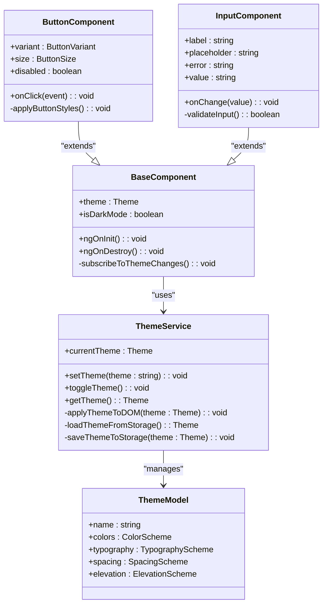

**Diagram sources**
- [ui-theme.service.ts:1-100](file://frontend/src/app/shared/theme/ui-theme.service.ts#L1-L100)
- [ui-theme.model.ts:1-100](file://frontend/src/app/shared/theme/ui-theme.model.ts#L1-L100)
- [ui-button.component.ts:1-100](file://frontend/src/app/shared/ui/ui-button/ui-button.component.ts#L1-L100)
- [ui-input.component.ts:1-100](file://frontend/src/app/shared/ui/ui-input/ui-input.component.ts#L1-L100)

## Detailed Component Analysis

### Button Component

The button component serves as the primary interaction element with multiple variants and states.

#### Component Architecture

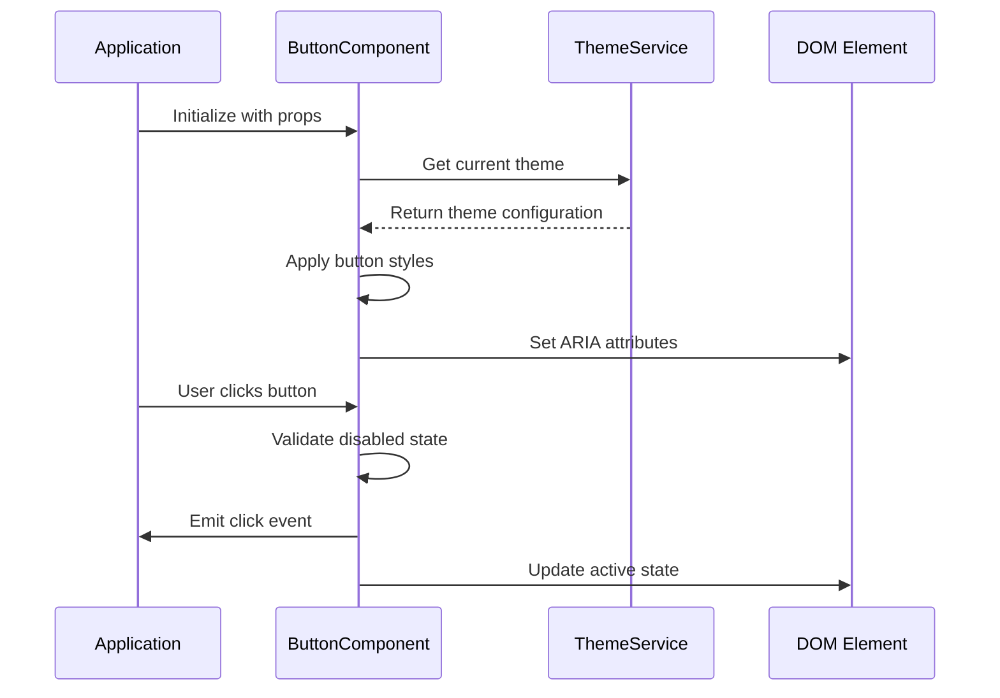

**Diagram sources**
- [ui-button.component.ts:1-200](file://frontend/src/app/shared/ui/ui-button/ui-button.component.ts#L1-L200)
- [ui-theme.service.ts:1-100](file://frontend/src/app/shared/theme/ui-theme.service.ts#L1-L100)

#### Key Features
- Multiple visual variants (primary, secondary, tertiary, danger)
- Size variations (small, medium, large)
- State management (loading, disabled, active)
- Full keyboard navigation support
- Screen reader compatibility
- Customizable through CSS custom properties

**Section sources**
- [ui-button.component.ts:1-300](file://frontend/src/app/shared/ui/ui-button/ui-button.component.ts#L1-L300)
- [ui-button.component.html:1-50](file://frontend/src/app/shared/ui/ui-button/ui-button.component.html#L1-L50)
- [ui-button.component.scss:1-100](file://frontend/src/app/shared/ui/ui-button/ui-button.component.scss#L1-L100)

### Input Component

The input component provides a comprehensive form input solution with validation and accessibility features.

#### Component Structure

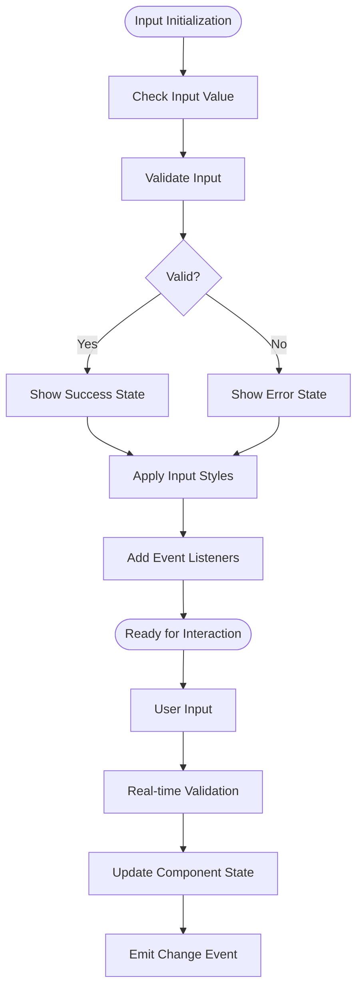

**Diagram sources**
- [ui-input.component.ts:1-250](file://frontend/src/app/shared/ui/ui-input/ui-input.component.ts#L1-L250)
- [ui-input.component.html:1-80](file://frontend/src/app/shared/ui/ui-input/ui-input.component.html#L1-L80)

#### Implementation Details
- Real-time validation with debounced updates
- Accessible error messaging and labels
- Support for various input types
- Integration with Angular forms
- Custom styling through CSS variables
- Responsive behavior across devices

**Section sources**
- [ui-input.component.ts:1-400](file://frontend/src/app/shared/ui/ui-input/ui-input.component.ts#L1-L400)
- [ui-input.component.spec.ts:1-100](file://frontend/src/app/shared/ui/ui-input/ui-input.component.spec.ts#L1-L100)

### Surface Component

The surface component provides a container for grouping related content with elevation and background styling.

#### Component Hierarchy

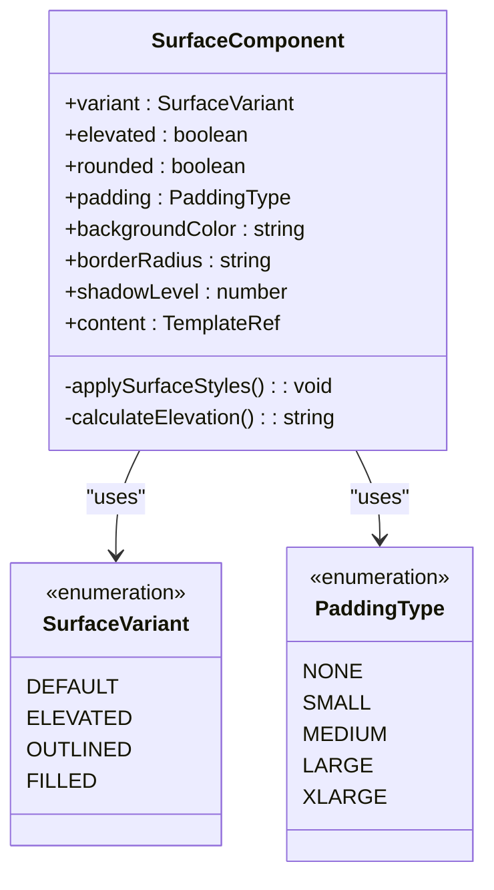

**Diagram sources**
- [ui-surface.component.ts:1-150](file://frontend/src/app/shared/ui/ui-surface/ui-surface.component.ts#L1-L150)

**Section sources**
- [ui-surface.component.ts:1-200](file://frontend/src/app/shared/ui/ui-surface/ui-surface.component.ts#L1-L200)
- [ui-surface.component.scss:1-100](file://frontend/src/app/shared/ui/ui-surface/ui-surface.component.scss#L1-L100)

### Badge Component

The badge component provides status indicators and notification elements with semantic meaning.

#### Badge Variants

```mermaid
stateDiagram-v2
[*] --> Default
Default --> Success : "success variant"
Default --> Warning : "warning variant"
Default --> Error : "error variant"
Default --> Info : "info variant"
Default --> Neutral : "neutral variant"
Success --> [*]
Warning --> [*]
Error --> [*]
Info --> [*]
Neutral --> [*]
```

**Diagram sources**
- [ui-badge.component.ts:1-100](file://frontend/src/app/shared/ui/ui-badge/ui-badge.component.ts#L1-L100)

**Section sources**
- [ui-badge.component.ts:1-150](file://frontend/src/app/shared/ui/ui-badge/ui-badge.component.ts#L1-L150)
- [ui-badge.component.scss:1-80](file://frontend/src/app/shared/ui/ui-badge/ui-badge.component.scss#L1-L80)

## Theming System

The theming system provides a flexible and extensible foundation for visual customization throughout the application.

### Theme Architecture

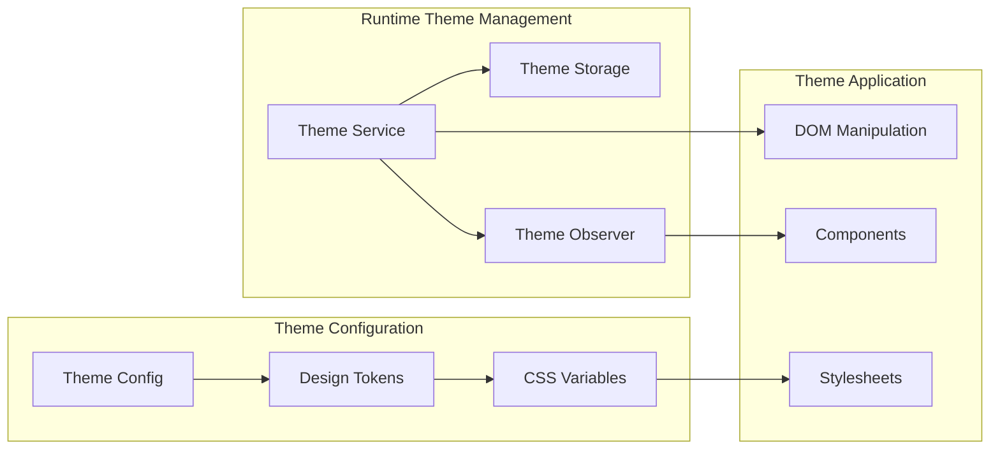

**Diagram sources**
- [ui-theme.service.ts:1-200](file://frontend/src/app/shared/theme/ui-theme.service.ts#L1-L200)
- [ui-theme.model.ts:1-150](file://frontend/src/app/shared/theme/ui-theme.model.ts#L1-L150)
- [_themes.scss:1-100](file://frontend/src/styles/_themes.scss#L1-L100)

### CSS Custom Properties

The theming system leverages CSS custom properties for runtime theme switching without requiring page reloads.

#### Theme Structure

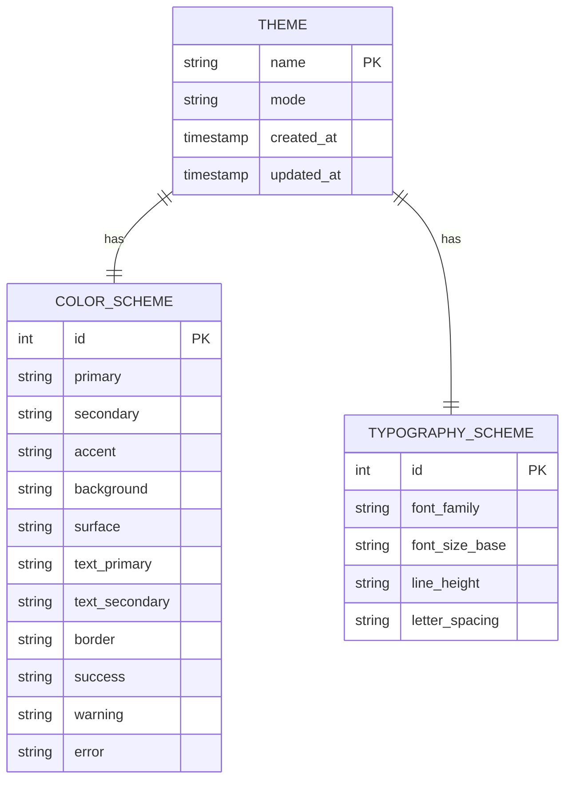

**Diagram sources**
- [ui-theme.model.ts:1-200](file://frontend/src/app/shared/theme/ui-theme.model.ts#L1-L200)

### Dynamic Theme Switching

The theme service provides methods for programmatic theme control and persistence.

#### Theme Lifecycle

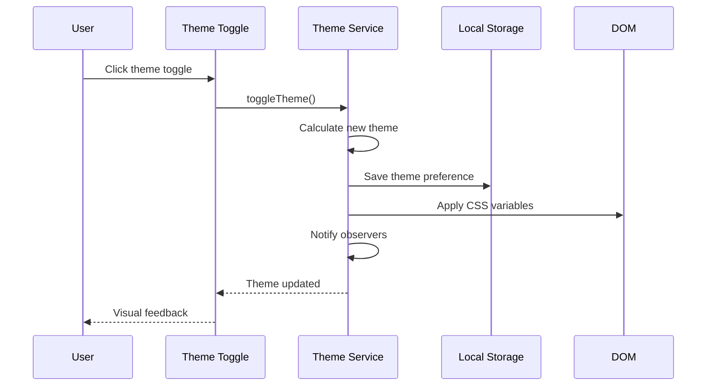

**Diagram sources**
- [ui-theme.service.ts:1-300](file://frontend/src/app/shared/theme/ui-theme.service.ts#L1-L300)
- [ui-theme-toggle.component.ts:1-100](file://frontend/src/app/shared/theme/ui-theme-toggle.component.ts#L1-L100)

**Section sources**
- [ui-theme.service.ts:1-400](file://frontend/src/app/shared/theme/ui-theme.service.ts#L1-L400)
- [ui-theme.model.ts:1-200](file://frontend/src/app/shared/theme/ui-theme.model.ts#L1-L200)
- [_themes.scss:1-200](file://frontend/src/styles/_themes.scss#L1-L200)
- [_tokens.scss:1-150](file://frontend/src/styles/_tokens.scss#L1-L150)

## Component API Design Patterns

The design system follows consistent API patterns across all components to ensure predictability and ease of use.

### Standard Component Interface

All components implement a standardized interface pattern:

#### Input Properties (@Input)

| Property | Type | Default | Description |
|----------|------|---------|-------------|
| `disabled` | `boolean` | `false` | Disables the component interaction |
| `theme` | `Theme` | `current` | Overrides the global theme |
| `ariaLabel` | `string` | `''` | Provides accessibility label |
| `id` | `string` | `auto-generated` | Unique component identifier |

#### Output Events (@Output)

| Event | Type | Description |
|-------|------|-------------|
| `click` | `EventEmitter<void>` | Emitted when component is clicked |
| `change` | `EventEmitter<any>` | Emitted when value changes |
| `focus` | `EventEmitter<void>` | Emitted when component gains focus |
| `blur` | `EventEmitter<void>` | Emitted when component loses focus |

#### Methods

| Method | Parameters | Returns | Description |
|--------|------------|---------|-------------|
| `focus()` | none | `void` | Programmatically focuses the component |
| `blur()` | none | `void` | Programmatically removes focus |
| `reset()` | none | `void` | Resets component to initial state |

### Component Composition Pattern

Components support composition through content projection and slot patterns:

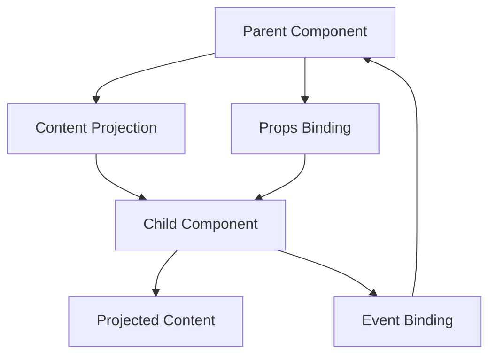

**Diagram sources**
- [ui-button.component.ts:1-200](file://frontend/src/app/shared/ui/ui-button/ui-button.component.ts#L1-L200)
- [ui-surface.component.ts:1-150](file://frontend/src/app/shared/ui/ui-surface/ui-surface.component.ts#L1-L150)

**Section sources**
- [ui-button.component.ts:1-300](file://frontend/src/app/shared/ui/ui-button/ui-button.component.ts#L1-L300)
- [ui-input.component.ts:1-400](file://frontend/src/app/shared/ui/ui-input/ui-input.component.ts#L1-L400)
- [ui-surface.component.ts:1-200](file://frontend/src/app/shared/ui/ui-surface/ui-surface.component.ts#L1-L200)

## Accessibility Compliance

The design system prioritizes accessibility following WCAG 2.1 AA guidelines and Angular accessibility best practices.

### Accessibility Features

#### Semantic HTML Structure

All components use appropriate semantic HTML elements and ARIA attributes:

- Proper heading hierarchy
- Meaningful landmark regions
- Correct button and link semantics
- Form input associations

#### Keyboard Navigation

- Full keyboard operability
- Logical tab order
- Focus management
- Skip links where applicable

#### Screen Reader Support

- Descriptive labels and descriptions
- Live regions for dynamic content
- Proper role assignments
- Announcements for state changes

#### Color Contrast

- Minimum 4.5:1 contrast ratio for normal text
- Minimum 3:1 contrast ratio for large text
- No reliance on color alone for information
- Dark mode support with maintained contrast

### Testing Strategy

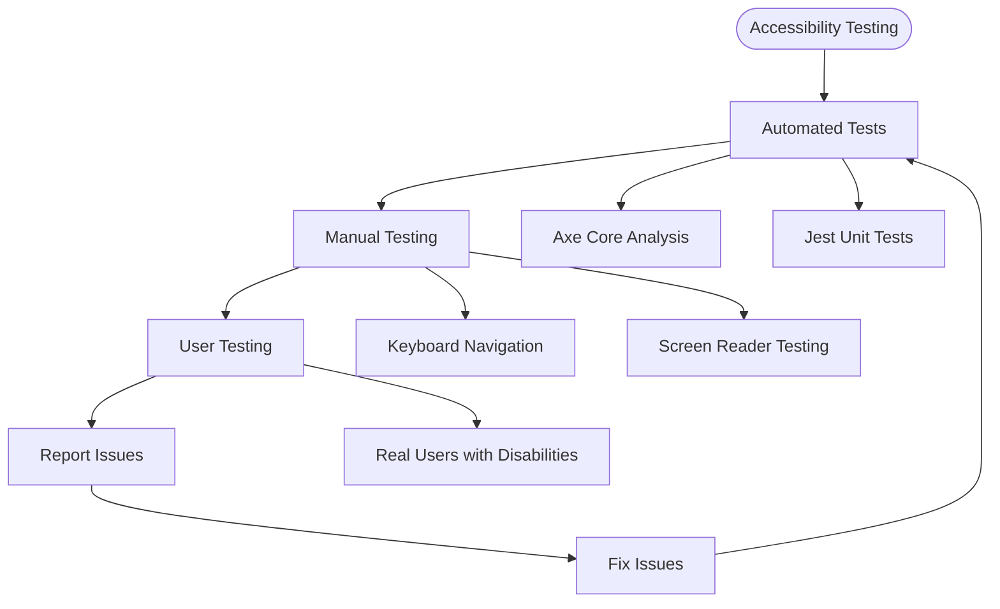

**Diagram sources**
- [_accessibility.scss:1-100](file://frontend/src/styles/_accessibility.scss#L1-L100)

**Section sources**
- [_accessibility.scss:1-200](file://frontend/src/styles/_accessibility.scss#L1-L200)
- [ui-button.component.ts:1-300](file://frontend/src/app/shared/ui/ui-button/ui-button.component.ts#L1-L300)
- [ui-input.component.ts:1-400](file://frontend/src/app/shared/ui/ui-input/ui-input.component.ts#L1-L400)

## Styling Best Practices

The design system establishes clear guidelines for consistent and maintainable styling.

### CSS Architecture

#### File Organization

```
styles/
├── _tokens.scss          # Design tokens and variables
├── _themes.scss          # Theme definitions and overrides
├── _accessibility.scss   # Accessibility-related styles
├── _patterns.scss        # Reusable style patterns
└── _reset.scss           # CSS reset and normalization
```

#### Naming Conventions

- BEM methodology for component classes
- Prefix all design system classes with `ds-`
- Use descriptive, semantic class names
- Avoid presentation-specific class names

#### CSS Custom Properties

```scss
// Token definition
$color-primary: var(--ds-color-primary);
$spacing-md: var(--ds-spacing-medium);
$typography-base: var(--ds-typography-base);

// Component usage
.ds-button {
  background-color: $color-primary;
  padding: $spacing-md;
  font-family: $typography-base;
}
```

### Responsive Design

#### Breakpoint System

```scss
$breakpoints: (
  'xs': 0,
  'sm': 576px,
  'md': 768px,
  'lg': 992px,
  'xl': 1200px,
  'xxl': 1400px
);
```

#### Mobile-First Approach

- Base styles target mobile devices
- Progressive enhancement for larger screens
- Touch-friendly interaction targets
- Flexible layouts using CSS Grid and Flexbox

**Section sources**
- [_tokens.scss:1-200](file://frontend/src/styles/_tokens.scss#L1-L200)
- [_patterns.scss:1-150](file://frontend/src/styles/_patterns.scss#L1-L150)
- [_accessibility.scss:1-200](file://frontend/src/styles/_accessibility.scss#L1-L200)

## Responsive Design Patterns

The design system implements responsive patterns that work consistently across device sizes and orientations.

### Layout Patterns

#### Fluid Typography

```scss
@use 'sass:math';

@function fluid-type($min-size, $max-size, $min-width, $max-width) {
  $slope: math.div(($max-size - $min-size), ($max-width - $min-width));
  $intercept: $min-size - ($slope * $min-width);
  @return calc(#{$intercept}px + #{$slope * 100vw});
}
```

#### Adaptive Components

Components automatically adapt their behavior and appearance based on viewport size:

- Buttons collapse to icons on small screens
- Tables become scrollable or card-based layouts
- Navigation transforms into hamburger menus
- Forms stack vertically on mobile devices

### Touch and Gesture Support

- Minimum touch target size of 44x44 pixels
- Swipe gestures for carousels and galleries
- Pinch-to-zoom for images and maps
- Long press for contextual actions

**Section sources**
- [_patterns.scss:1-200](file://frontend/src/styles/_patterns.scss#L1-L200)
- [ui-button.component.ts:1-300](file://frontend/src/app/shared/ui/ui-button/ui-button.component.ts#L1-L300)

## Component Composition Patterns

The design system promotes composition over inheritance, enabling flexible and reusable component structures.

### Composition Strategies

#### Content Projection

Components accept projected content for maximum flexibility:

```typescript
// Surface component accepts any content
@Component({
  selector: 'ds-surface',
  template: `
    <div class="ds-surface">
      <ng-content></ng-content>
    </div>
  `
})
export class SurfaceComponent {}
```

#### Slot-Based Architecture

Multiple projection slots allow for structured content composition:

```html
<ds-card>
  <ds-card-header slot="header">Title</ds-card-header>
  <ds-card-body slot="body">Content</ds-card-body>
  <ds-card-footer slot="footer">Actions</ds-card-footer>
</ds-card>
```

#### Higher-Order Components

Wrapper components enhance functionality without modifying base components:

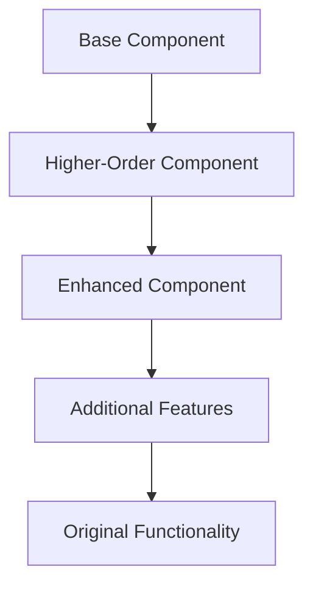

**Diagram sources**
- [ui-surface.component.ts:1-200](file://frontend/src/app/shared/ui/ui-surface/ui-surface.component.ts#L1-L200)

**Section sources**
- [ui-surface.component.ts:1-250](file://frontend/src/app/shared/ui/ui-surface/ui-surface.component.ts#L1-L250)
- [ui-action-surface.component.ts:1-200](file://frontend/src/app/shared/ui/ui-action-surface/ui-action-surface.component.ts#L1-L200)

## Integration Approaches

The design system provides multiple integration approaches to accommodate different architectural needs.

### Module-Based Integration

#### Standalone Components

Components can be used as standalone Angular components:

```typescript
import { ButtonComponent } from '@design-system/button';

@Component({
  selector: 'app-example',
  imports: [ButtonComponent],
  template: `<ds-button>Click me</ds-button>`
})
export class ExampleComponent {}
```

#### NgModule Integration

For legacy applications, components can be imported via NgModules:

```typescript
import { DesignSystemModule } from '@design-system/core';

@NgModule({
  imports: [DesignSystemModule],
  // ... other configuration
})
export class AppModule {}
```

### Dependency Injection

The design system integrates seamlessly with Angular's dependency injection:

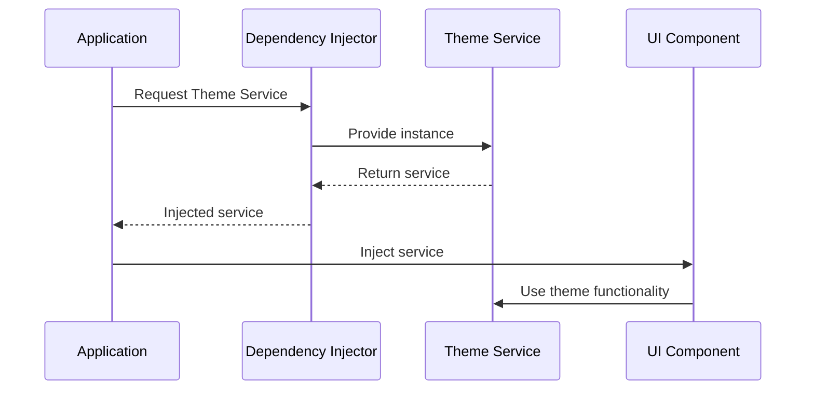

**Diagram sources**
- [ui-theme.service.ts:1-200](file://frontend/src/app/shared/theme/ui-theme.service.ts#L1-L200)
- [app.config.ts:1-100](file://frontend/src/app/app.config.ts#L1-L100)

### Configuration Options

The design system supports extensive configuration through providers and environment variables:

| Configuration | Type | Default | Description |
|---------------|------|---------|-------------|
| `defaultTheme` | `string` | `'light'` | Initial theme mode |
| `enableAnimations` | `boolean` | `true` | Enable/disable animations |
| `locale` | `string` | `'en-US'` | Localization settings |
| `prefix` | `string` | `'ds-'` | CSS class prefix |

**Section sources**
- [app.config.ts:1-150](file://frontend/src/app/app.config.ts#L1-L150)
- [ui-theme.service.ts:1-300](file://frontend/src/app/shared/theme/ui-theme.service.ts#L1-L300)

## Creating New Components

Follow these guidelines when creating new components for the design system.

### Component Development Process

#### 1. Planning Phase

- Define component purpose and requirements
- Identify existing components that can be extended
- Plan the component API and interactions
- Consider accessibility requirements

#### 2. Implementation Phase

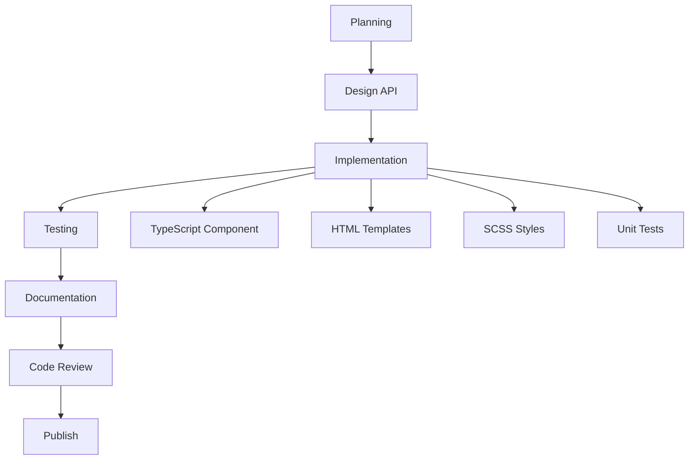

**Diagram sources**
- [ui-button.component.ts:1-100](file://frontend/src/app/shared/ui/ui-button/ui-button.component.ts#L1-L100)

#### 3. Quality Assurance

- Write comprehensive unit tests
- Perform accessibility testing
- Test across browsers and devices
- Verify performance characteristics

### Component Template Structure

Every component should follow this standard structure:

```typescript
// Component metadata
@Component({
  selector: 'ds-[component-name]',
  templateUrl: './[component-name].component.html',
  styleUrls: ['./[component-name].component.scss'],
  changeDetection: ChangeDetectionStrategy.OnPush,
  encapsulation: ViewEncapsulation.ShadowDom,
  host: {
    '[attr.role]': 'role',
    '[attr.aria-disabled]': 'disabled'
  }
})
export class ComponentNameComponent {
  // Inputs
  @Input() public disabled: boolean = false;
  
  // Outputs
  @Output() public onChange = new EventEmitter<void>();
  
  // Private state
  private _theme: Theme;
  
  // Lifecycle hooks
  ngOnInit(): void {
    this.initialize();
  }
  
  // Public methods
  public focus(): void {
    // Focus implementation
  }
  
  // Private methods
  private initialize(): void {
    // Initialization logic
  }
}
```

### Testing Requirements

Each component must include:

- Unit tests for all public methods
- Snapshot tests for templates
- Accessibility tests using axe-core
- Interaction tests for user events
- Performance regression tests

**Section sources**
- [ui-button.component.ts:1-300](file://frontend/src/app/shared/ui/ui-button/ui-button.component.ts#L1-L300)
- [ui-button.component.spec.ts:1-200](file://frontend/src/app/shared/ui/ui-button/ui-button.component.spec.ts#L1-L200)

## Performance Considerations

The design system is optimized for performance while maintaining rich functionality.

### Optimization Strategies

#### Change Detection

- Use `OnPush` change detection strategy
- Minimize property bindings
- Leverage immutable data patterns
- Utilize pure pipes for transformations

#### Bundle Optimization

- Tree-shaking enabled for unused components
- Lazy loading for feature modules
- Code splitting by component groups
- Efficient asset loading strategies

#### Memory Management

- Proper subscription cleanup
- Weak references for event listeners
- Garbage collection optimization
- Memory leak prevention

### Performance Monitoring

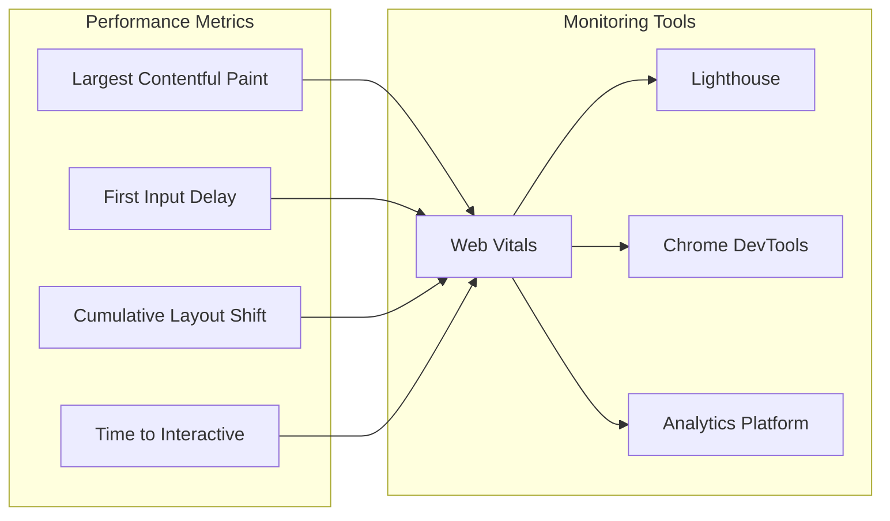

**Diagram sources**
- [ui-theme.service.ts:1-200](file://frontend/src/app/shared/theme/ui-theme.service.ts#L1-L200)

**Section sources**
- [ui-theme.service.ts:1-300](file://frontend/src/app/shared/theme/ui-theme.service.ts#L1-L300)
- [ui-button.component.ts:1-300](file://frontend/src/app/shared/ui/ui-button/ui-button.component.ts#L1-L300)

## Troubleshooting Guide

Common issues and their solutions when working with the design system.

### Common Issues

#### Theme Not Applying

**Problem**: Theme changes not reflecting in components.

**Solution**: 
- Ensure theme service is properly initialized
- Check CSS custom properties are being applied
- Verify component change detection is running

#### Component Not Found

**Problem**: Angular cannot find design system components.

**Solution**:
- Verify component imports are correct
- Check module declarations
- Ensure proper package installation

#### Styling Conflicts

**Problem**: Design system styles conflicting with application styles.

**Solution**:
- Use CSS scoping and encapsulation
- Override styles using CSS custom properties
- Check for specificity conflicts

### Debugging Techniques

#### Browser Developer Tools

- Use Elements panel to inspect computed styles
- Monitor CSS custom property values
- Check for console errors and warnings

#### Angular DevTools

- Inspect component tree and bindings
- Monitor change detection cycles
- Analyze component performance

#### Logging and Diagnostics

```typescript
// Add diagnostic logging to components
private logDiagnostic(message: string, data?: any): void {
  if (environment.debug) {
    console.log(`[DS:${this.constructor.name}] ${message}`, data);
  }
}
```

**Section sources**
- [ui-theme.service.ts:1-400](file://frontend/src/app/shared/theme/ui-theme.service.ts#L1-L400)
- [ui-button.component.ts:1-300](file://frontend/src/app/shared/ui/ui-button/ui-button.component.ts#L1-L300)

## Conclusion

The Angular design system provides a comprehensive, accessible, and performant foundation for building consistent user interfaces. Through its modular architecture, flexible theming system, and adherence to accessibility standards, it enables teams to create high-quality applications efficiently.

Key strengths of the design system include:

- **Consistency**: Unified design language across all components
- **Accessibility**: WCAG 2.1 AA compliance built into every component
- **Flexibility**: Extensive customization options through CSS custom properties
- **Performance**: Optimized for speed and memory efficiency
- **Maintainability**: Clear architecture and comprehensive documentation

The system continues to evolve with regular updates, new components, and improved accessibility features. Teams are encouraged to contribute to the design system and follow the established patterns for consistency and quality.