# Feature Modules

<cite>
**Referenced Files in This Document**
- [agent-conversation.store.ts](file://frontend/src/app/features/assistant-conversation/agent-conversation.store.ts)
- [approval-center.store.ts](file://frontend/src/app/features/approval-center/approval-center.store.ts)
- [conversation-list.store.ts](file://frontend/src/app/features/conversation-list/conversation-list.store.ts)
- [proposal-control.facade.ts](file://frontend/src/app/core/action-control/proposal-control.facade.ts)
- [agent-run-stream.service.ts](file://frontend/src/app/core/agent-run/agent-run-stream.service.ts)
- [assistant-activity.component.ts](file://frontend/src/app/features/assistant-conversation/assistant-activity/assistant-activity.component.ts)
- [assistant-composer.component.ts](file://frontend/src/app/features/assistant-conversation/assistant-composer/assistant-composer.component.ts)
- [assistant-message.component.ts](file://frontend/src/app/features/assistant-conversation/assistant-message/assistant-message.component.ts)
- [assistant-proposal-card.component.ts](file://frontend/src/app/features/assistant-conversation/assistant-proposal-card/assistant-proposal-card.component.ts)
- [approval-center.component.ts](file://frontend/src/app/features/approval-center/approval-center.component.ts)
- [conversation-list.component.ts](file://frontend/src/app/features/conversation-list/conversation-list.component.ts)
- [organization-workspace.component.ts](file://frontend/src/app/layout/workspace/organization-workspace.component.ts)
- [chat-view.component.ts](file://frontend/src/app/layout/workspace/chat-view.component.ts)
- [action-control-api.service.ts](file://frontend/src/app/core/action-control/action-control-api.service.ts)
- [conversation-api.service.ts](file://frontend/src/app/core/conversation/conversation-api.service.ts)
- [workplace-agent-api.service.ts](file://frontend/src/app/core/api/workplace-agent-api.service.ts)
- [current-user.store.ts](file://frontend/src/app/core/auth/current-user.store.ts)
- [app.config.ts](file://frontend/src/app/app.config.ts)
- [app.routes.ts](file://frontend/src/app/app.routes.ts)
</cite>

## Table of Contents
1. [Introduction](#introduction)
2. [Project Structure](#project-structure)
3. [Core Components](#core-components)
4. [Architecture Overview](#architecture-overview)
5. [Detailed Component Analysis](#detailed-component-analysis)
6. [Dependency Analysis](#dependency-analysis)
7. [Performance Considerations](#performance-considerations)
8. [Troubleshooting Guide](#troubleshooting-guide)
9. [Conclusion](#conclusion)

## Introduction

This document provides comprehensive documentation for the feature-based module architecture of the Workplace Agent application. The system implements a modern Angular frontend with a clear separation of concerns across multiple feature modules, including assistant conversations, approval workflows, workspace management, and real-time communication capabilities.

The architecture follows established patterns for state management using stores, reactive data flows through services, and component hierarchies that promote reusability and maintainability. Each feature module encapsulates its own business logic, UI components, and state management, enabling independent development and testing.

## Project Structure

The application follows a feature-based architecture where each major functionality is organized into its own module with clear boundaries:

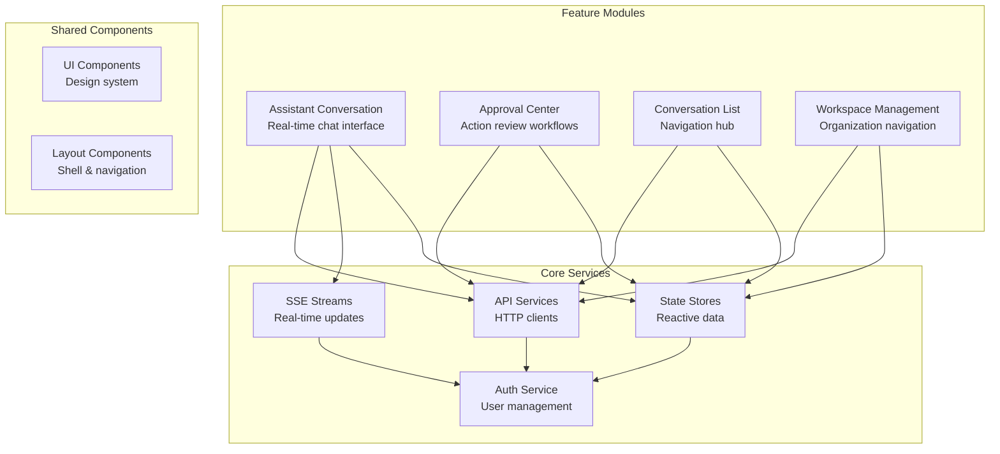

**Diagram sources**
- [app.config.ts](file://frontend/src/app/app.config.ts)
- [app.routes.ts](file://frontend/src/app/app.routes.ts)

**Section sources**
- [app.config.ts](file://frontend/src/app/app.config.ts)
- [app.routes.ts](file://frontend/src/app/app.routes.ts)

## Core Components

### State Management Architecture

The application implements a store-based state management pattern where each feature maintains its own reactive state:

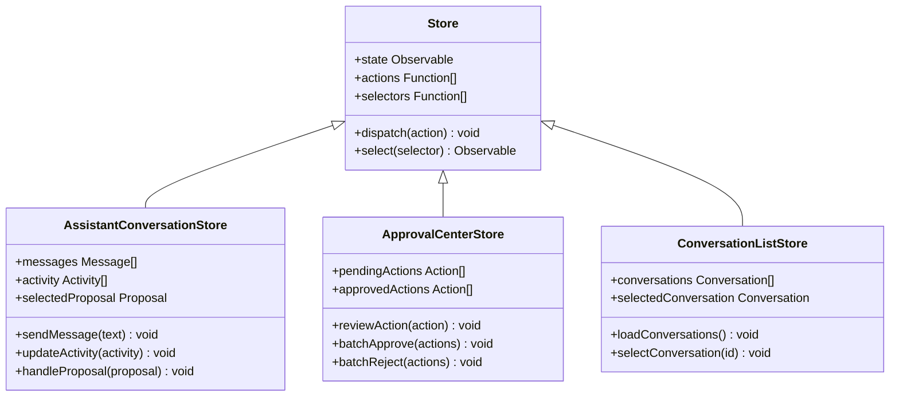

**Diagram sources**
- [agent-conversation.store.ts](file://frontend/src/app/features/assistant-conversation/agent-conversation.store.ts)
- [approval-center.store.ts](file://frontend/src/app/features/approval-center/approval-center.store.ts)
- [conversation-list.store.ts](file://frontend/src/app/features/conversation-list/conversation-list.store.ts)

### Real-time Communication Layer

The system uses Server-Sent Events (SSE) for real-time updates across all features:

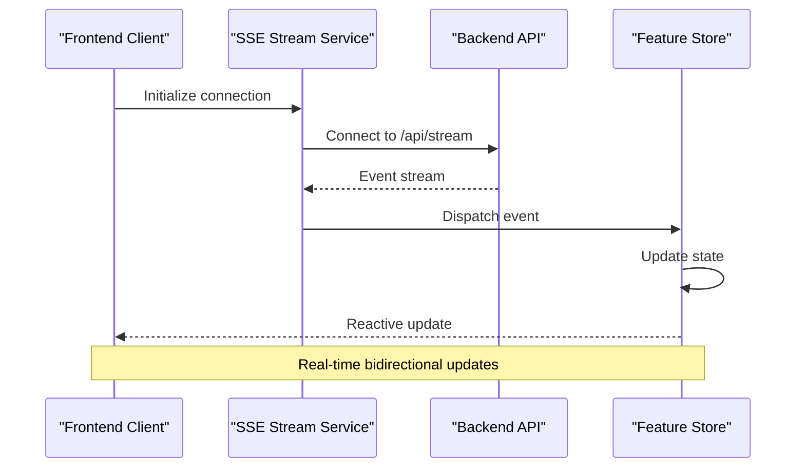

**Diagram sources**
- [agent-run-stream.service.ts](file://frontend/src/app/core/agent-run/agent-run-stream.service.ts)
- [authenticated-sse-client.service.ts](file://frontend/src/app/core/sse/authenticated-sse-client.service.ts)

**Section sources**
- [agent-conversation.store.ts](file://frontend/src/app/features/assistant-conversation/agent-conversation.store.ts)
- [approval-center.store.ts](file://frontend/src/app/features/approval-center/approval-center.store.ts)
- [conversation-list.store.ts](file://frontend/src/app/features/conversation-list/conversation-list.store.ts)
- [agent-run-stream.service.ts](file://frontend/src/app/core/agent-run/agent-run-stream.service.ts)

## Architecture Overview

The application implements a layered architecture with clear separation between presentation, business logic, and data access layers:

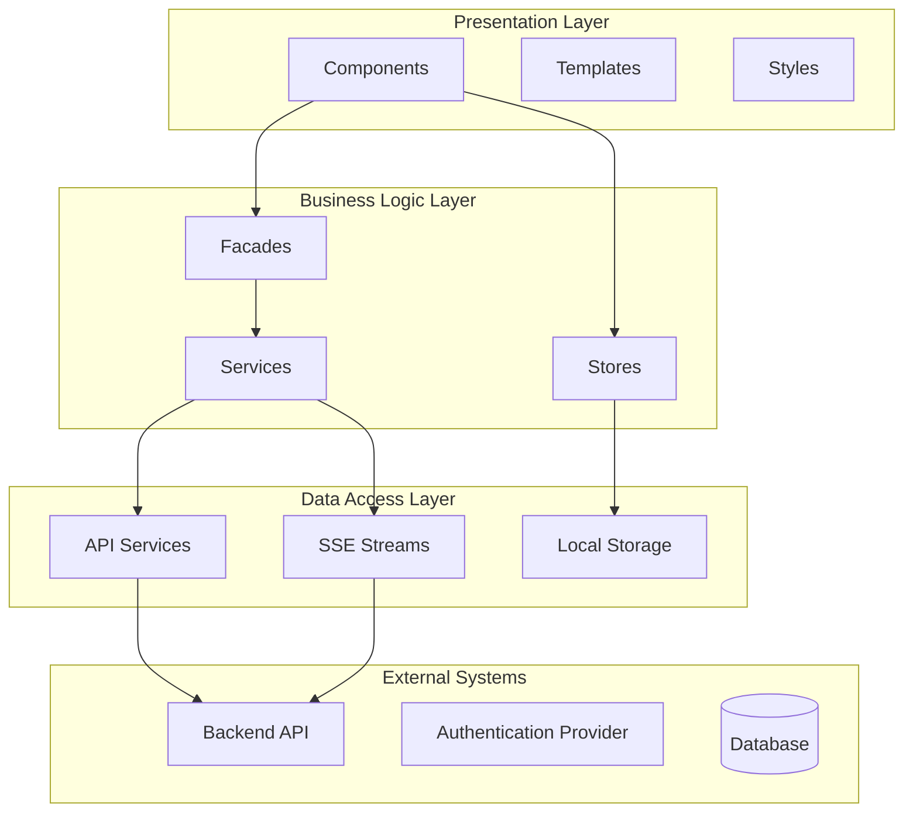

**Diagram sources**
- [app.config.ts](file://frontend/src/app/app.config.ts)
- [workplace-agent-api.service.ts](file://frontend/src/app/core/api/workplace-agent-api.service.ts)

## Detailed Component Analysis

### Assistant Conversation Feature

The assistant conversation feature provides a real-time chat interface with message handling, activity streams, and proposal cards:

#### Component Hierarchy

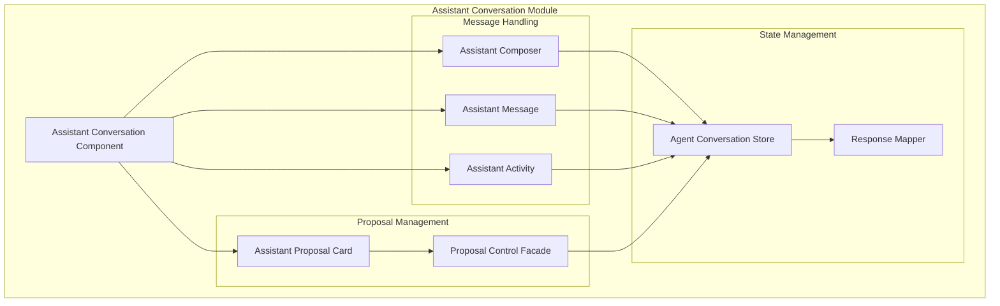

**Diagram sources**
- [assistant-activity.component.ts](file://frontend/src/app/features/assistant-conversation/assistant-activity/assistant-activity.component.ts)
- [assistant-composer.component.ts](file://frontend/src/app/features/assistant-conversation/assistant-composer/assistant-composer.component.ts)
- [assistant-message.component.ts](file://frontend/src/app/features/assistant-conversation/assistant-message/assistant-message.component.ts)
- [assistant-proposal-card.component.ts](file://frontend/src/app/features/assistant-conversation/assistant-proposal-card/assistant-proposal-card.component.ts)
- [agent-conversation.store.ts](file://frontend/src/app/features/assistant-conversation/agent-conversation.store.ts)
- [proposal-control.facade.ts](file://frontend/src/app/core/action-control/proposal-control.facade.ts)

#### Real-time Message Flow

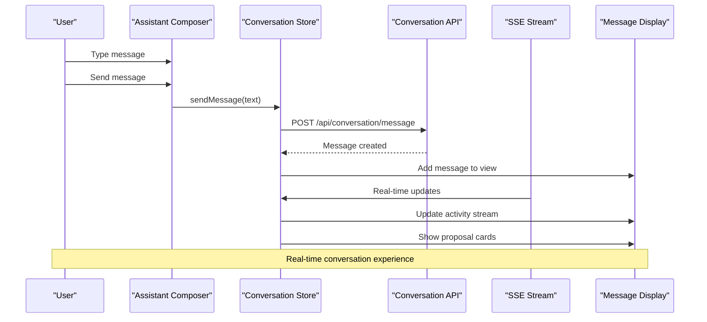

**Diagram sources**
- [assistant-composer.component.ts](file://frontend/src/app/features/assistant-conversation/assistant-composer/assistant-composer.component.ts)
- [conversation-api.service.ts](file://frontend/src/app/core/conversation/conversation-api.service.ts)
- [agent-run-stream.service.ts](file://frontend/src/app/core/agent-run/agent-run-stream.service.ts)

**Section sources**
- [assistant-activity.component.ts](file://frontend/src/app/features/assistant-conversation/assistant-activity/assistant-activity.component.ts)
- [assistant-composer.component.ts](file://frontend/src/app/features/assistant-conversation/assistant-composer/assistant-composer.component.ts)
- [assistant-message.component.ts](file://frontend/src/app/features/assistant-conversation/assistant-message/assistant-message.component.ts)
- [assistant-proposal-card.component.ts](file://frontend/src/app/features/assistant-conversation/assistant-proposal-card/assistant-proposal-card.component.ts)
- [agent-conversation.store.ts](file://frontend/src/app/features/assistant-conversation/agent-conversation.store.ts)
- [proposal-control.facade.ts](file://frontend/src/app/core/action-control/proposal-control.facade.ts)
- [conversation-api.service.ts](file://frontend/src/app/core/conversation/conversation-api.service.ts)

### Approval Center Feature

The approval center provides action review workflows with batch operations for managing agent actions:

#### Workflow Management

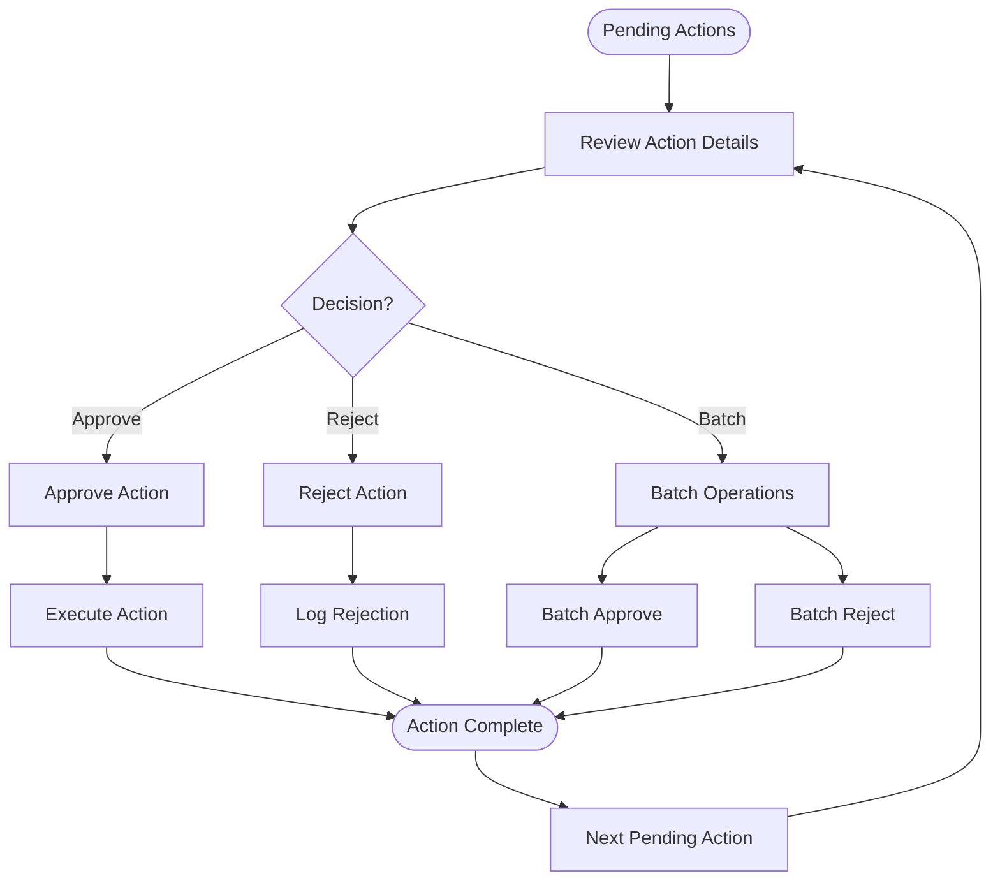

**Diagram sources**
- [approval-center.component.ts](file://frontend/src/app/features/approval-center/approval-center.component.ts)
- [approval-center.store.ts](file://frontend/src/app/features/approval-center/approval-center.store.ts)
- [action-control-api.service.ts](file://frontend/src/app/core/action-control/action-control-api.service.ts)

#### Batch Operations Pattern

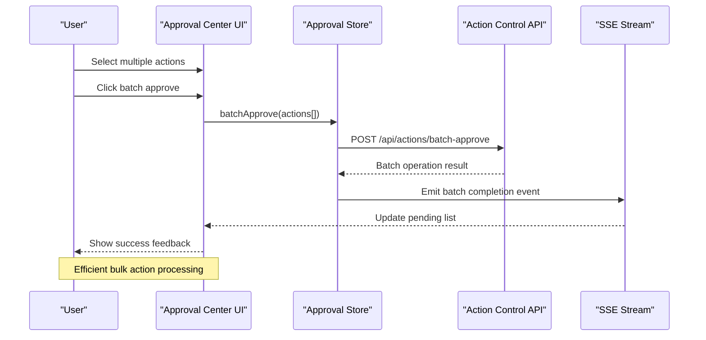

**Diagram sources**
- [approval-center.store.ts](file://frontend/src/app/features/approval-center/approval-center.store.ts)
- [action-control-api.service.ts](file://frontend/src/app/core/action-control/action-control-api.service.ts)

**Section sources**
- [approval-center.component.ts](file://frontend/src/app/features/approval-center/approval-center.component.ts)
- [approval-center.store.ts](file://frontend/src/app/features/approval-center/approval-center.store.ts)
- [action-control-api.service.ts](file://frontend/src/app/core/action-control/action-control-api.service.ts)

### Workspace Management Feature

The workspace management provides organization navigation and resource browsing capabilities:

#### Organization Navigation

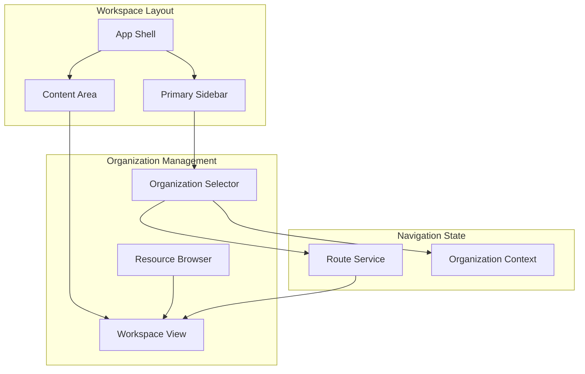

**Diagram sources**
- [organization-workspace.component.ts](file://frontend/src/app/layout/workspace/organization-workspace.component.ts)
- [chat-view.component.ts](file://frontend/src/app/layout/workspace/chat-view.component.ts)
- [primary-sidebar.component.ts](file://frontend/src/app/layout/primary-sidebar/primary-sidebar.component.ts)

#### Resource Browsing Interface

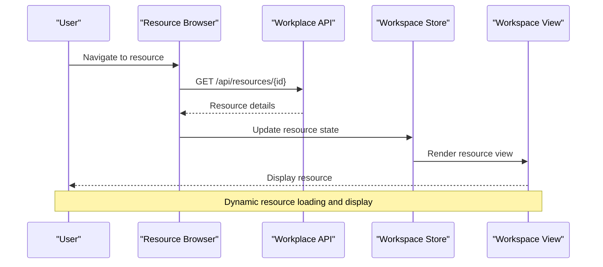

**Diagram sources**
- [organization-workspace.component.ts](file://frontend/src/app/layout/workspace/organization-workspace.component.ts)
- [workplace-agent-api.service.ts](file://frontend/src/app/core/api/workplace-agent-api.service.ts)

**Section sources**
- [organization-workspace.component.ts](file://frontend/src/app/layout/workspace/organization-workspace.component.ts)
- [chat-view.component.ts](file://frontend/src/app/layout/workspace/chat-view.component.ts)
- [workplace-agent-api.service.ts](file://frontend/src/app/core/api/workplace-agent-api.service.ts)

## Dependency Analysis

The application follows clean dependency patterns with clear separation between features and shared services:

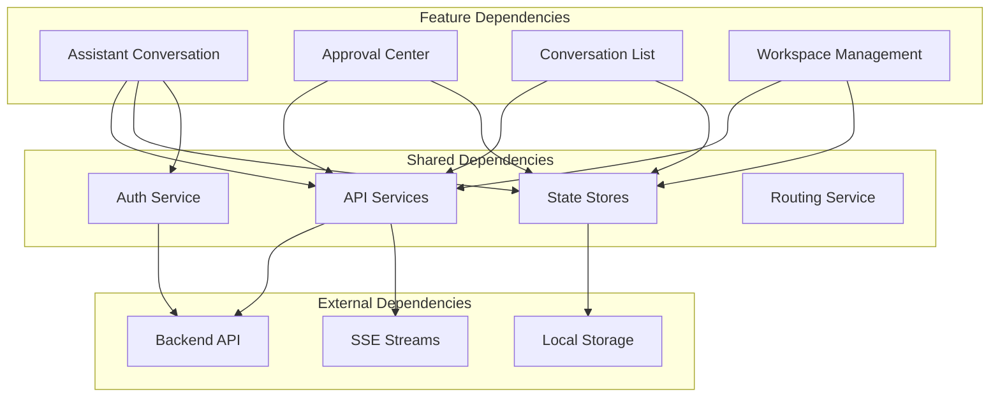

**Diagram sources**
- [app.config.ts](file://frontend/src/app/app.config.ts)
- [current-user.store.ts](file://frontend/src/app/core/auth/current-user.store.ts)

### Inter-Feature Communication

Features communicate through shared services and events rather than direct dependencies:

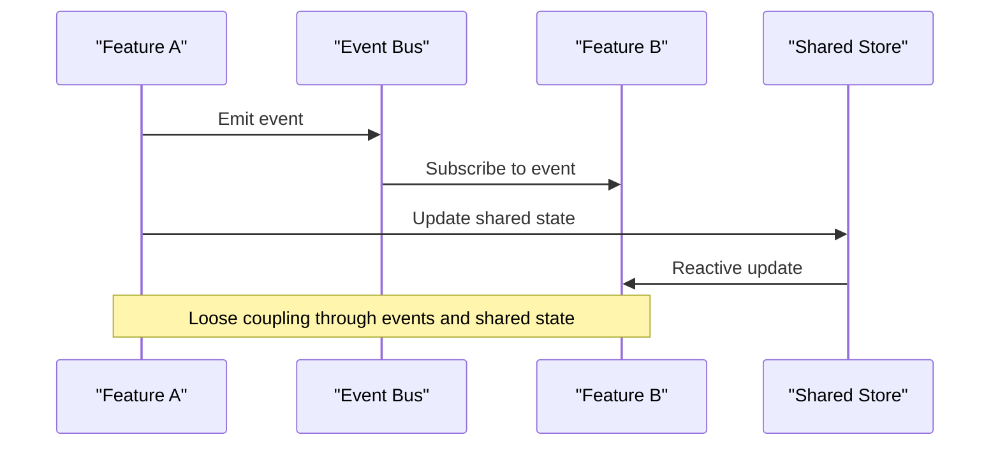

**Section sources**
- [app.config.ts](file://frontend/src/app/app.config.ts)
- [current-user.store.ts](file://frontend/src/app/core/auth/current-user.store.ts)

## Performance Considerations

### State Management Optimization

The store-based architecture implements several performance optimizations:

- **Selective Updates**: Components subscribe only to specific state slices they need
- **Change Detection Batching**: Multiple state updates are batched to minimize re-renders
- **Lazy Loading**: Feature modules are loaded on-demand to reduce initial bundle size
- **Caching Strategy**: API responses are cached locally to reduce network requests

### Real-time Communication Efficiency

The SSE implementation includes:

- **Connection Pooling**: Multiple streams share a single connection when possible
- **Event Filtering**: Clients receive only relevant events based on their current context
- **Backpressure Handling**: Slow consumers don't block fast producers
- **Automatic Reconnection**: Failed connections are automatically retried with exponential backoff

## Troubleshooting Guide

### Common Issues and Solutions

#### Connection Problems
- **Symptom**: Real-time updates not working
- **Solution**: Check authentication token validity and SSE connection status
- **Debug**: Monitor network tab for SSE connection errors

#### State Synchronization Issues
- **Symptom**: UI shows stale data
- **Solution**: Verify store subscriptions and check for race conditions
- **Debug**: Enable debug logging in stores to track state changes

#### Performance Degradation
- **Symptom**: Application becomes slow with large datasets
- **Solution**: Implement virtual scrolling and pagination for large lists
- **Debug**: Use browser performance profiling to identify bottlenecks

**Section sources**
- [agent-run-stream.service.ts](file://frontend/src/app/core/agent-run/agent-run-stream.service.ts)
- [agent-conversation.store.ts](file://frontend/src/app/features/assistant-conversation/agent-conversation.store.ts)
- [approval-center.store.ts](file://frontend/src/app/features/approval-center/approval-center.store.ts)

## Conclusion

The feature-based module architecture provides a scalable and maintainable foundation for the Workplace Agent application. The clear separation of concerns, robust state management, and efficient real-time communication patterns enable rapid development while ensuring high performance and excellent user experience.

Key architectural strengths include:

- **Modular Design**: Each feature operates independently with well-defined interfaces
- **Reactive State Management**: Stores provide predictable state updates with minimal boilerplate
- **Real-time Capabilities**: SSE streams enable seamless live updates across all features
- **Clean Dependencies**: Features communicate through shared services rather than direct coupling
- **Performance Optimizations**: Caching, lazy loading, and efficient change detection ensure smooth user interactions

This architecture supports future growth by allowing new features to be added without disrupting existing functionality, while maintaining consistent patterns for state management and user interaction.