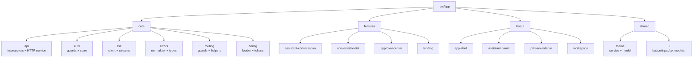
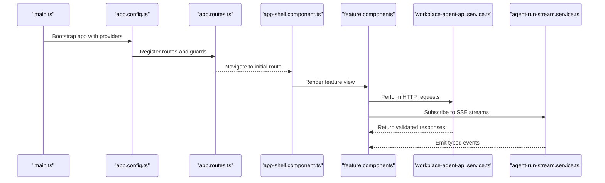
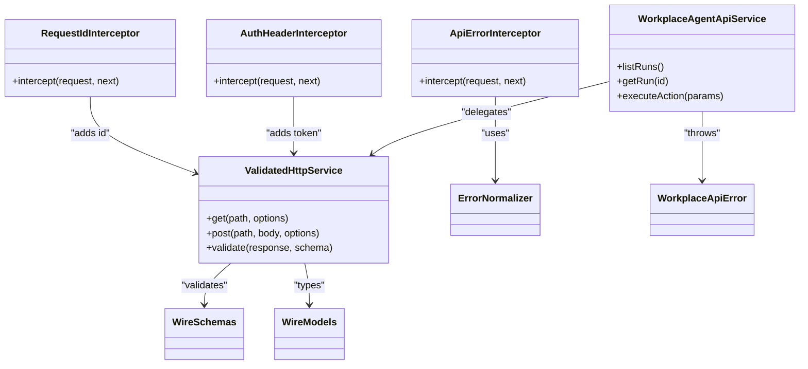
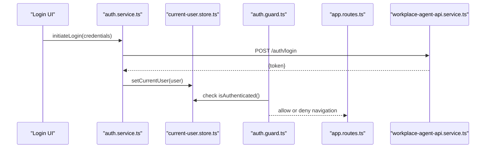
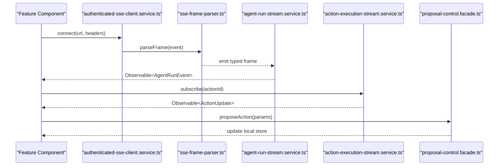
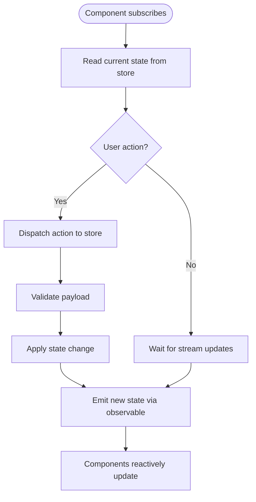
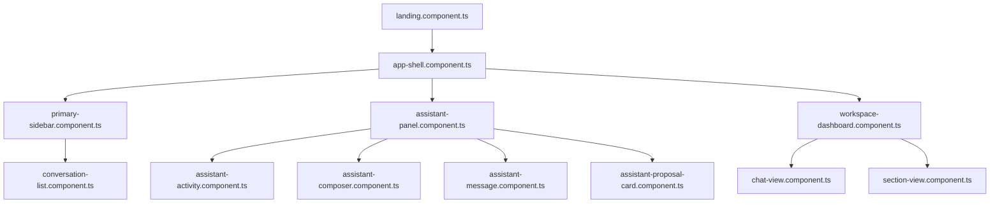
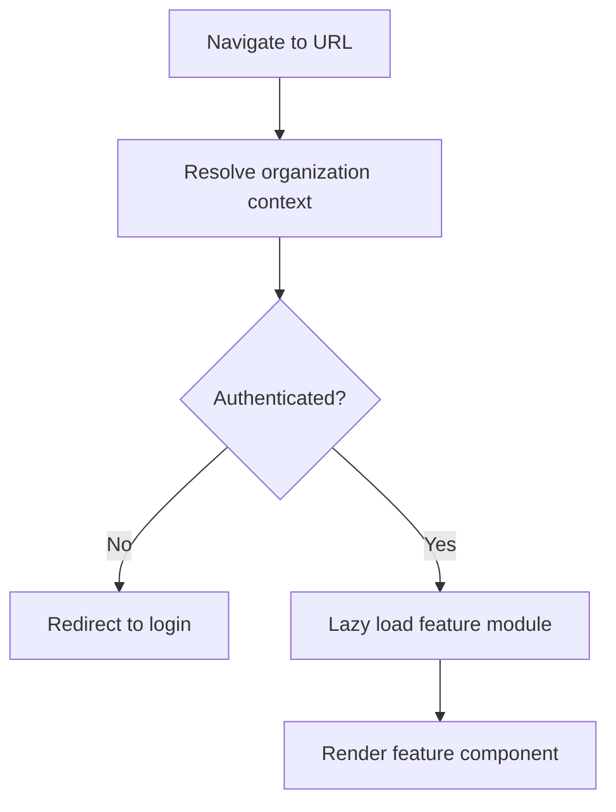
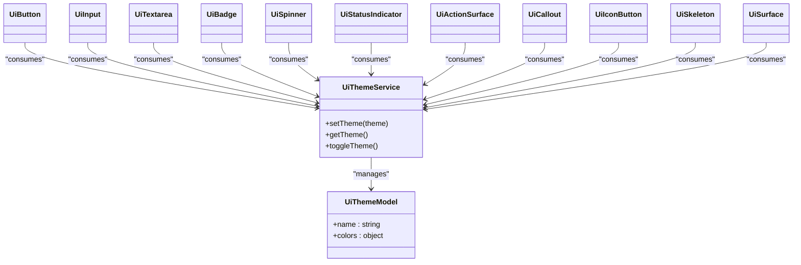
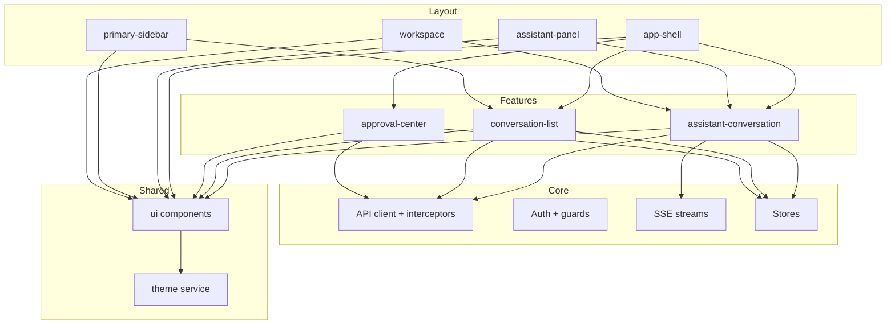

# Frontend Architecture

<cite>
**Referenced Files in This Document**
- [app.routes.ts](file://frontend/src/app/app.routes.ts)
- [app.config.ts](file://frontend/src/app/app.config.ts)
- [main.ts](file://frontend/src/main.ts)
- [api-error.interceptor.ts](file://frontend/src/app/core/api/api-error.interceptor.ts)
- [request-id.interceptor.ts](file://frontend/src/app/core/api/request-id.interceptor.ts)
- [auth-header.interceptor.ts](file://frontend/src/app/core/auth/auth-header.interceptor.ts)
- [workplace-agent-api.service.ts](file://frontend/src/app/core/api/workplace-agent-api.service.ts)
- [validated-http.service.ts](file://frontend/src/app/core/api/validated-http.service.ts)
- [wire.models.ts](file://frontend/src/app/core/api/wire.models.ts)
- [wire.schemas.ts](file://frontend/src/app/core/api/wire.schemas.ts)
- [error-normalizer.ts](file://frontend/src/app/core/errors/error-normalizer.ts)
- [workplace-api.error.ts](file://frontend/src/app/core/errors/workplace-api.error.ts)
- [auth.guard.ts](file://frontend/src/app/core/routing/auth.guard.ts)
- [organization-route.service.ts](file://frontend/src/app/core/routing/organization-route.service.ts)
- [current-user.store.ts](file://frontend/src/app/core/auth/current-user.store.ts)
- [auth.service.ts](file://frontend/src/app/core/auth/auth.service.ts)
- [authenticated-sse-client.service.ts](file://frontend/src/app/core/sse/authenticated-sse-client.service.ts)
- [agent-run-stream.service.ts](file://frontend/src/app/core/agent-run/agent-run-stream.service.ts)
- [sse-frame-parser.ts](file://frontend/src/app/core/agent-run/sse-frame-parser.ts)
- [action-execution-stream.service.ts](file://frontend/src/app/core/action-control/action-execution-stream.service.ts)
- [proposal-control.facade.ts](file://frontend/src/app/core/action-control/proposal-control.facade.ts)
- [agent-conversation.store.ts](file://frontend/src/app/features/assistant-conversation/agent-conversation.store.ts)
- [conversation-list.store.ts](file://frontend/src/app/features/conversation-list/conversation-list.store.ts)
- [approval-center.store.ts](file://frontend/src/app/features/approval-center/approval-center.store.ts)
- [assistant-activity.component.ts](file://frontend/src/app/features/assistant-conversation/assistant-activity/assistant-activity.component.ts)
- [assistant-composer.component.ts](file://frontend/src/app/features/assistant-conversation/assistant-composer/assistant-composer.component.ts)
- [assistant-message.component.ts](file://frontend/src/app/features/assistant-conversation/assistant-message/assistant-message.component.ts)
- [assistant-proposal-card.component.ts](file://frontend/src/app/features/assistant-conversation/assistant-proposal-card/assistant-proposal-card.component.ts)
- [conversation-list.component.ts](file://frontend/src/app/features/conversation-list/conversation-list.component.ts)
- [landing.component.ts](file://frontend/src/app/features/landing/landing.component.ts)
- [app-shell.component.ts](file://frontend/src/app/layout/app-shell/app-shell.component.ts)
- [assistant-panel.component.ts](file://frontend/src/app/layout/assistant-panel/assistant-panel.component.ts)
- [primary-sidebar.component.ts](file://frontend/src/app/layout/primary-sidebar/primary-sidebar.component.ts)
- [shell-state.service.ts](file://frontend/src/app/layout/shell/shell-state.service.ts)
- [workspace-dashboard.component.ts](file://frontend/src/app/layout/workspace/workspace-dashboard.component.ts)
- [chat-view.component.ts](file://frontend/src/app/layout/workspace/chat-view.component.ts)
- [section-view.component.ts](file://frontend/src/app/layout/workspace/section-view.component.ts)
- [ui-theme.service.ts](file://frontend/src/app/shared/theme/ui-theme.service.ts)
- [ui-theme.model.ts](file://frontend/src/app/shared/theme/ui-theme.model.ts)
- [ui-button.component.ts](file://frontend/src/app/shared/ui/ui-button/ui-button.component.ts)
- [ui-input.component.ts](file://frontend/src/app/shared/ui/ui-input/ui-input.component.ts)
- [ui-textarea.component.ts](file://frontend/src/app/shared/ui/ui-textarea/ui-textarea.component.ts)
- [ui-badge.component.ts](file://frontend/src/app/shared/ui/ui-badge/ui-badge.component.ts)
- [ui-spinner.component.ts](file://frontend/src/app/shared/ui/ui-spinner/ui-spinner.component.ts)
- [ui-status-indicator.component.ts](file://frontend/src/app/shared/ui/ui-status-indicator/ui-status-indicator.component.ts)
- [ui-action-surface.component.ts](file://frontend/src/app/shared/ui/ui-action-surface/ui-action-surface.component.ts)
- [ui-callout.component.ts](file://frontend/src/app/shared/ui/ui-callout/ui-callout.component.ts)
- [ui-icon-button.component.ts](file://frontend/src/app/shared/ui/ui-icon-button/ui-icon-button.component.ts)
- [ui-skeleton.component.ts](file://frontend/src/app/shared/ui/ui-skeleton/ui-skeleton.component.ts)
- [ui-surface.component.ts](file://frontend/src/app/shared/ui/ui-surface/ui-surface.component.ts)
</cite>

## Table of Contents
1. [Introduction](#introduction)
2. [Project Structure](#project-structure)
3. [Core Components](#core-components)
4. [Architecture Overview](#architecture-overview)
5. [Detailed Component Analysis](#detailed-component-analysis)
6. [Dependency Analysis](#dependency-analysis)
7. [Performance Considerations](#performance-considerations)
8. [Troubleshooting Guide](#troubleshooting-guide)
9. [Conclusion](#conclusion)
10. [Appendices](#appendices)

## Introduction
This document describes the Angular frontend architecture with a focus on feature-based module organization, reactive state management using stores and RxJS, API client layer design with interceptors and error handling, component hierarchy and data flow patterns, routing strategy with guards and lazy loading, design system architecture with theming, and real-time communication via Server-Sent Events (SSE). The goal is to provide both high-level architectural insights and code-level details for maintainability and extensibility.

## Project Structure
The frontend follows a feature-based structure under src/app:
- core: Cross-cutting concerns including API client, authentication, SSE, configuration, errors, and routing utilities.
- features: Feature modules such as assistant conversation, conversation list, approval center, and landing.
- layout: Application shell, panels, sidebar, and workspace views.
- shared: Reusable UI components and theme services.

[No sources needed since this diagram shows conceptual project structure]

## Core Components
This section outlines the foundational building blocks that power the application’s behavior and integration points.

- API Client Layer
  - Interceptors: Authentication header injection, request ID propagation, and centralized error normalization.
  - HTTP Service: Validated HTTP wrapper around Angular HttpClient with schema validation support.
  - Wire Models and Schemas: Shared type definitions and JSON schemas used for runtime validation.
  - Error Handling: Normalized error objects and domain-specific error types.

- Authentication and Authorization
  - Auth Service: Manages login flows and token lifecycle.
  - Current User Store: Reactive user state exposed as an observable store.
  - Auth Guard: Route guard enforcing authenticated access.
  - Organization Route Helper: Utility for resolving organization-scoped routes.

- Real-Time Communication (SSE)
  - Authenticated SSE Client: Wraps SSE connections with auth headers and reconnection logic.
  - Agent Run Stream Service: Parses SSE frames and exposes typed event streams for agent runs.
  - Action Execution Stream Service: Streams action execution updates.
  - Proposal Control Facade: Orchestrates proposal-related actions and state transitions.

- Configuration
  - App Config Loader: Loads runtime configuration at bootstrap.
  - App Config Token: Injection token for configuration values.

**Section sources**
- [api-error.interceptor.ts](file://frontend/src/app/core/api/api-error.interceptor.ts)
- [request-id.interceptor.ts](file://frontend/src/app/core/api/request-id.interceptor.ts)
- [auth-header.interceptor.ts](file://frontend/src/app/core/auth/auth-header.interceptor.ts)
- [workplace-agent-api.service.ts](file://frontend/src/app/core/api/workplace-agent-api.service.ts)
- [validated-http.service.ts](file://frontend/src/app/core/api/validated-http.service.ts)
- [wire.models.ts](file://frontend/src/app/core/api/wire.models.ts)
- [wire.schemas.ts](file://frontend/src/app/core/api/wire.schemas.ts)
- [error-normalizer.ts](file://frontend/src/app/core/errors/error-normalizer.ts)
- [workplace-api.error.ts](file://frontend/src/app/core/errors/workplace-api.error.ts)
- [auth.guard.ts](file://frontend/src/app/core/routing/auth.guard.ts)
- [organization-route.service.ts](file://frontend/src/app/core/routing/organization-route.service.ts)
- [current-user.store.ts](file://frontend/src/app/core/auth/current-user.store.ts)
- [auth.service.ts](file://frontend/src/app/core/auth/auth.service.ts)
- [authenticated-sse-client.service.ts](file://frontend/src/app/core/sse/authenticated-sse-client.service.ts)
- [agent-run-stream.service.ts](file://frontend/src/app/core/agent-run/agent-run-stream.service.ts)
- [sse-frame-parser.ts](file://frontend/src/app/core/agent-run/sse-frame-parser.ts)
- [action-execution-stream.service.ts](file://frontend/src/app/core/action-control/action-execution-stream.service.ts)
- [proposal-control.facade.ts](file://frontend/src/app/core/action-control/proposal-control.facade.ts)

## Architecture Overview
The application bootstraps with a minimal main entry point, configures providers and routes, and then renders the app shell. Features are organized by capability and consume core services for API, auth, and SSE.

**Diagram sources**
- [main.ts](file://frontend/src/main.ts)
- [app.config.ts](file://frontend/src/app/app.config.ts)
- [app.routes.ts](file://frontend/src/app/app.routes.ts)
- [app-shell.component.ts](file://frontend/src/app/layout/app-shell/app-shell.component.ts)
- [workplace-agent-api.service.ts](file://frontend/src/app/core/api/workplace-agent-api.service.ts)
- [agent-run-stream.service.ts](file://frontend/src/app/core/agent-run/agent-run-stream.service.ts)

**Section sources**
- [main.ts](file://frontend/src/main.ts)
- [app.config.ts](file://frontend/src/app/app.config.ts)
- [app.routes.ts](file://frontend/src/app/app.routes.ts)

## Detailed Component Analysis

### API Client Layer and Interceptors
The API client layer centralizes HTTP interactions and cross-cutting concerns:
- Interceptors:
  - Authentication header interceptor injects bearer tokens into outgoing requests.
  - Request ID interceptor attaches unique identifiers for tracing.
  - API error interceptor normalizes backend errors into consistent shapes.
- Validated HTTP Service:
  - Wraps HttpClient calls with schema validation using wire schemas.
  - Provides typed methods for domain endpoints.
- Wire Models and Schemas:
  - Shared TypeScript models and JSON schemas ensure contract compliance.
- Error Handling:
  - Error normalizer maps server errors to domain-friendly structures.
  - Workplace API error types encapsulate specific failure modes.

**Diagram sources**
- [api-error.interceptor.ts](file://frontend/src/app/core/api/api-error.interceptor.ts)
- [request-id.interceptor.ts](file://frontend/src/app/core/api/request-id.interceptor.ts)
- [auth-header.interceptor.ts](file://frontend/src/app/core/auth/auth-header.interceptor.ts)
- [validated-http.service.ts](file://frontend/src/app/core/api/validated-http.service.ts)
- [workplace-agent-api.service.ts](file://frontend/src/app/core/api/workplace-agent-api.service.ts)
- [wire.models.ts](file://frontend/src/app/core/api/wire.models.ts)
- [wire.schemas.ts](file://frontend/src/app/core/api/wire.schemas.ts)
- [error-normalizer.ts](file://frontend/src/app/core/errors/error-normalizer.ts)
- [workplace-api.error.ts](file://frontend/src/app/core/errors/workplace-api.error.ts)

**Section sources**
- [api-error.interceptor.ts](file://frontend/src/app/core/api/api-error.interceptor.ts)
- [request-id.interceptor.ts](file://frontend/src/app/core/api/request-id.interceptor.ts)
- [auth-header.interceptor.ts](file://frontend/src/app/core/auth/auth-header.interceptor.ts)
- [validated-http.service.ts](file://frontend/src/app/core/api/validated-http.service.ts)
- [workplace-agent-api.service.ts](file://frontend/src/app/core/api/workplace-agent-api.service.ts)
- [wire.models.ts](file://frontend/src/app/core/api/wire.models.ts)
- [wire.schemas.ts](file://frontend/src/app/core/api/wire.schemas.ts)
- [error-normalizer.ts](file://frontend/src/app/core/errors/error-normalizer.ts)
- [workplace-api.error.ts](file://frontend/src/app/core/errors/workplace-api.error.ts)

### Authentication Flow and Guards
Authentication integrates with the API client via interceptors and protects routes through guards:
- Auth Service manages login/logout and token storage.
- Current User Store exposes reactive user state.
- Auth Guard prevents navigation to protected routes when unauthenticated.
- Organization Route Service assists in resolving organization context for routes.

**Diagram sources**
- [auth.service.ts](file://frontend/src/app/core/auth/auth.service.ts)
- [current-user.store.ts](file://frontend/src/app/core/auth/current-user.store.ts)
- [auth.guard.ts](file://frontend/src/app/core/routing/auth.guard.ts)
- [app.routes.ts](file://frontend/src/app/app.routes.ts)
- [workplace-agent-api.service.ts](file://frontend/src/app/core/api/workplace-agent-api.service.ts)

**Section sources**
- [auth.service.ts](file://frontend/src/app/core/auth/auth.service.ts)
- [current-user.store.ts](file://frontend/src/app/core/auth/current-user.store.ts)
- [auth.guard.ts](file://frontend/src/app/core/routing/auth.guard.ts)
- [organization-route.service.ts](file://frontend/src/app/core/routing/organization-route.service.ts)
- [app.routes.ts](file://frontend/src/app/app.routes.ts)

### Real-Time Communication with SSE
Real-time updates are implemented using Server-Sent Events:
- Authenticated SSE Client wraps connection setup and auth headers.
- Agent Run Stream Service parses SSE frames and emits typed events.
- Action Execution Stream Service provides action-specific streams.
- Proposal Control Facade orchestrates proposal workflows and state changes.

**Diagram sources**
- [authenticated-sse-client.service.ts](file://frontend/src/app/core/sse/authenticated-sse-client.service.ts)
- [sse-frame-parser.ts](file://frontend/src/app/core/agent-run/sse-frame-parser.ts)
- [agent-run-stream.service.ts](file://frontend/src/app/core/agent-run/agent-run-stream.service.ts)
- [action-execution-stream.service.ts](file://frontend/src/app/core/action-control/action-execution-stream.service.ts)
- [proposal-control.facade.ts](file://frontend/src/app/core/action-control/proposal-control.facade.ts)

**Section sources**
- [authenticated-sse-client.service.ts](file://frontend/src/app/core/sse/authenticated-sse-client.service.ts)
- [sse-frame-parser.ts](file://frontend/src/app/core/agent-run/sse-frame-parser.ts)
- [agent-run-stream.service.ts](file://frontend/src/app/core/agent-run/agent-run-stream.service.ts)
- [action-execution-stream.service.ts](file://frontend/src/app/core/action-control/action-execution-stream.service.ts)
- [proposal-control.facade.ts](file://frontend/src/app/core/action-control/proposal-control.facade.ts)

### Reactive State Management with Stores and RxJS
State is managed using feature-scoped stores exposing observables:
- Agent Conversation Store: Holds conversation state and messages.
- Conversation List Store: Manages list of conversations and selection.
- Approval Center Store: Tracks approvals and related actions.

**Diagram sources**
- [agent-conversation.store.ts](file://frontend/src/app/features/assistant-conversation/agent-conversation.store.ts)
- [conversation-list.store.ts](file://frontend/src/app/features/conversation-list/conversation-list.store.ts)
- [approval-center.store.ts](file://frontend/src/app/features/approval-center/approval-center.store.ts)

**Section sources**
- [agent-conversation.store.ts](file://frontend/src/app/features/assistant-conversation/agent-conversation.store.ts)
- [conversation-list.store.ts](file://frontend/src/app/features/conversation-list/conversation-list.store.ts)
- [approval-center.store.ts](file://frontend/src/app/features/approval-center/approval-center.store.ts)

### Component Hierarchy and Data Flow
The layout defines the application shell and panels; features render within the workspace area. Parent-child data flow uses inputs/outputs and shared stores.

**Diagram sources**
- [app-shell.component.ts](file://frontend/src/app/layout/app-shell/app-shell.component.ts)
- [assistant-panel.component.ts](file://frontend/src/app/layout/assistant-panel/assistant-panel.component.ts)
- [primary-sidebar.component.ts](file://frontend/src/app/layout/primary-sidebar/primary-sidebar.component.ts)
- [workspace-dashboard.component.ts](file://frontend/src/app/layout/workspace/workspace-dashboard.component.ts)
- [chat-view.component.ts](file://frontend/src/app/layout/workspace/chat-view.component.ts)
- [section-view.component.ts](file://frontend/src/app/layout/workspace/section-view.component.ts)
- [assistant-activity.component.ts](file://frontend/src/app/features/assistant-conversation/assistant-activity/assistant-activity.component.ts)
- [assistant-composer.component.ts](file://frontend/src/app/features/assistant-conversation/assistant-composer/assistant-composer.component.ts)
- [assistant-message.component.ts](file://frontend/src/app/features/assistant-conversation/assistant-message/assistant-message.component.ts)
- [assistant-proposal-card.component.ts](file://frontend/src/app/features/assistant-conversation/assistant-proposal-card/assistant-proposal-card.component.ts)
- [conversation-list.component.ts](file://frontend/src/app/features/conversation-list/conversation-list.component.ts)
- [landing.component.ts](file://frontend/src/app/features/landing/landing.component.ts)

**Section sources**
- [app-shell.component.ts](file://frontend/src/app/layout/app-shell/app-shell.component.ts)
- [assistant-panel.component.ts](file://frontend/src/app/layout/assistant-panel/assistant-panel.component.ts)
- [primary-sidebar.component.ts](file://frontend/src/app/layout/primary-sidebar/primary-sidebar.component.ts)
- [workspace-dashboard.component.ts](file://frontend/src/app/layout/workspace/workspace-dashboard.component.ts)
- [chat-view.component.ts](file://frontend/src/app/layout/workspace/chat-view.component.ts)
- [section-view.component.ts](file://frontend/src/app/layout/workspace/section-view.component.ts)
- [assistant-activity.component.ts](file://frontend/src/app/features/assistant-conversation/assistant-activity/assistant-activity.component.ts)
- [assistant-composer.component.ts](file://frontend/src/app/features/assistant-conversation/assistant-composer/assistant-composer.component.ts)
- [assistant-message.component.ts](file://frontend/src/app/features/assistant-conversation/assistant-message/assistant-message.component.ts)
- [assistant-proposal-card.component.ts](file://frontend/src/app/features/assistant-conversation/assistant-proposal-card/assistant-proposal-card.component.ts)
- [conversation-list.component.ts](file://frontend/src/app/features/conversation-list/conversation-list.component.ts)
- [landing.component.ts](file://frontend/src/app/features/landing/landing.component.ts)

### Routing Strategy with Guards and Lazy Loading
Routes are configured centrally and protected by guards:
- app.routes.ts defines top-level routes and feature lazy-loading paths.
- auth.guard.ts enforces authentication before navigation.
- organization-route.service.ts resolves organization context for scoped routes.

**Diagram sources**
- [app.routes.ts](file://frontend/src/app/app.routes.ts)
- [auth.guard.ts](file://frontend/src/app/core/routing/auth.guard.ts)
- [organization-route.service.ts](file://frontend/src/app/core/routing/organization-route.service.ts)

**Section sources**
- [app.routes.ts](file://frontend/src/app/app.routes.ts)
- [auth.guard.ts](file://frontend/src/app/core/routing/auth.guard.ts)
- [organization-route.service.ts](file://frontend/src/app/core/routing/organization-route.service.ts)

### Design System Architecture and Theming
The design system provides reusable UI components and theming support:
- Theme Service and Model manage theme state and toggling.
- UI Components include buttons, inputs, textareas, badges, spinners, status indicators, surfaces, callouts, icon buttons, skeletons, and action surfaces.

**Diagram sources**
- [ui-theme.service.ts](file://frontend/src/app/shared/theme/ui-theme.service.ts)
- [ui-theme.model.ts](file://frontend/src/app/shared/theme/ui-theme.model.ts)
- [ui-button.component.ts](file://frontend/src/app/shared/ui/ui-button/ui-button.component.ts)
- [ui-input.component.ts](file://frontend/src/app/shared/ui/ui-input/ui-input.component.ts)
- [ui-textarea.component.ts](file://frontend/src/app/shared/ui/ui-textarea/ui-textarea.component.ts)
- [ui-badge.component.ts](file://frontend/src/app/shared/ui/ui-badge/ui-badge.component.ts)
- [ui-spinner.component.ts](file://frontend/src/app/shared/ui/ui-spinner/ui-spinner.component.ts)
- [ui-status-indicator.component.ts](file://frontend/src/app/shared/ui/ui-status-indicator/ui-status-indicator.component.ts)
- [ui-action-surface.component.ts](file://frontend/src/app/shared/ui/ui-action-surface/ui-action-surface.component.ts)
- [ui-callout.component.ts](file://frontend/src/app/shared/ui/ui-callout/ui-callout.component.ts)
- [ui-icon-button.component.ts](file://frontend/src/app/shared/ui/ui-icon-button/ui-icon-button.component.ts)
- [ui-skeleton.component.ts](file://frontend/src/app/shared/ui/ui-skeleton/ui-skeleton.component.ts)
- [ui-surface.component.ts](file://frontend/src/app/shared/ui/ui-surface/ui-surface.component.ts)

**Section sources**
- [ui-theme.service.ts](file://frontend/src/app/shared/theme/ui-theme.service.ts)
- [ui-theme.model.ts](file://frontend/src/app/shared/theme/ui-theme.model.ts)
- [ui-button.component.ts](file://frontend/src/app/shared/ui/ui-button/ui-button.component.ts)
- [ui-input.component.ts](file://frontend/src/app/shared/ui/ui-input/ui-input.component.ts)
- [ui-textarea.component.ts](file://frontend/src/app/shared/ui/ui-textarea/ui-textarea.component.ts)
- [ui-badge.component.ts](file://frontend/src/app/shared/ui/ui-badge/ui-badge.component.ts)
- [ui-spinner.component.ts](file://frontend/src/app/shared/ui/ui-spinner/ui-spinner.component.ts)
- [ui-status-indicator.component.ts](file://frontend/src/app/shared/ui/ui-status-indicator/ui-status-indicator.component.ts)
- [ui-action-surface.component.ts](file://frontend/src/app/shared/ui/ui-action-surface/ui-action-surface.component.ts)
- [ui-callout.component.ts](file://frontend/src/app/shared/ui/ui-callout/ui-callout.component.ts)
- [ui-icon-button.component.ts](file://frontend/src/app/shared/ui/ui-icon-button/ui-icon-button.component.ts)
- [ui-skeleton.component.ts](file://frontend/src/app/shared/ui/ui-skeleton/ui-skeleton.component.ts)
- [ui-surface.component.ts](file://frontend/src/app/shared/ui/ui-surface/ui-surface.component.ts)

## Dependency Analysis
High-level dependencies between layers:
- Features depend on core services (API, SSE, stores).
- Layout depends on feature components and shared UI.
- Shared UI components depend on theme service.
- Interceptors wrap HTTP calls globally.

[No sources needed since this diagram shows conceptual dependency relationships]

## Performance Considerations
- Prefer lazy loading of feature modules to reduce initial bundle size.
- Use RxJS operators like shareReplay and takeUntil to avoid memory leaks and redundant subscriptions.
- Debounce heavy computations and input handlers in components.
- Leverage OnPush change detection where appropriate to minimize re-renders.
- Cache frequently accessed data in stores and invalidate on mutations.
- Optimize SSE streams by filtering events and avoiding unnecessary emissions.

[No sources needed since this section provides general guidance]

## Troubleshooting Guide
Common issues and strategies:
- Authentication failures: Verify token presence and expiration; ensure auth header interceptor is active.
- Network errors: Inspect normalized error objects and workplace API error types for actionable messages.
- SSE disconnections: Confirm authenticated SSE client handles reconnection and backoff.
- Route guards blocking navigation: Ensure auth guard conditions match expected user state.
- Schema validation errors: Review wire schemas and models for mismatches.

**Section sources**
- [api-error.interceptor.ts](file://frontend/src/app/core/api/api-error.interceptor.ts)
- [auth-header.interceptor.ts](file://frontend/src/app/core/auth/auth-header.interceptor.ts)
- [error-normalizer.ts](file://frontend/src/app/core/errors/error-normalizer.ts)
- [workplace-api.error.ts](file://frontend/src/app/core/errors/workplace-api.error.ts)
- [authenticated-sse-client.service.ts](file://frontend/src/app/core/sse/authenticated-sse-client.service.ts)
- [auth.guard.ts](file://frontend/src/app/core/routing/auth.guard.ts)
- [wire.schemas.ts](file://frontend/src/app/core/api/wire.schemas.ts)
- [wire.models.ts](file://frontend/src/app/core/api/wire.models.ts)

## Conclusion
The Angular frontend employs a clear separation of concerns with feature-based modules, robust core services, and a comprehensive design system. Reactive state management via stores and RxJS enables real-time synchronization, while the API client layer ensures secure, validated, and traceable HTTP interactions. SSE provides live updates for agent runs and actions. The routing strategy leverages guards and lazy loading for security and performance. Together, these patterns yield a maintainable, scalable, and user-friendly application.

## Appendices
- For detailed API contracts and event schemas, refer to the contracts directory and documentation files in the frontend docs folder.
- For testing strategies and acceptance criteria, consult the testing documentation and e2e specs.

[No sources needed since this section summarizes without analyzing specific files]