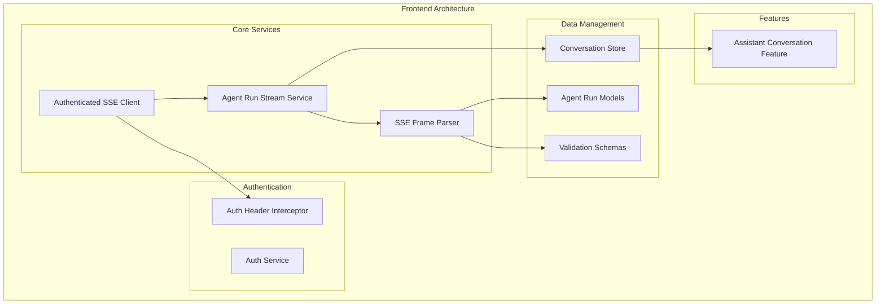
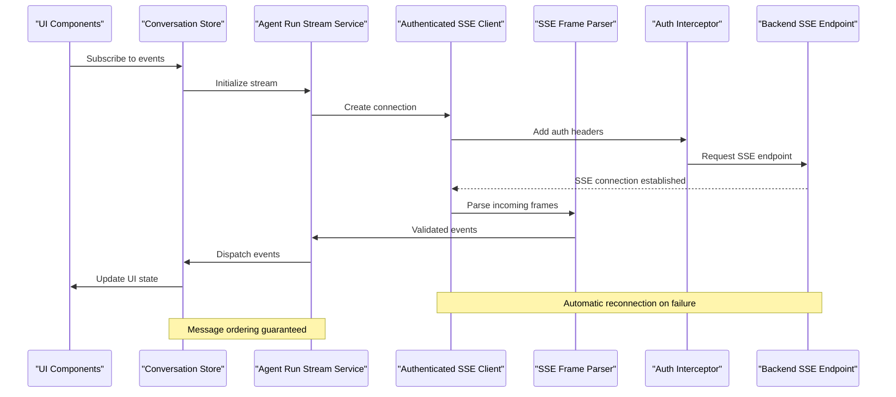
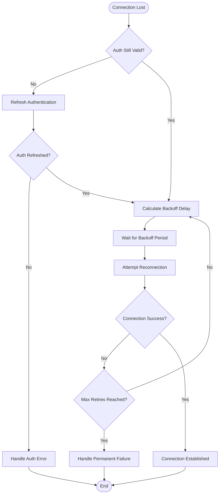
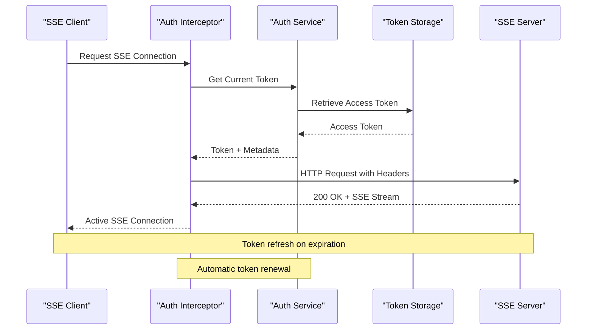

# Real-time Communication & SSE

<cite>
**Referenced Files in This Document**
- [authenticated-sse-client.service.ts](file://frontend/src/app/core/sse/authenticated-sse-client.service.ts)
- [agent-run-stream.service.ts](file://frontend/src/app/core/agent-run/agent-run-stream.service.ts)
- [sse-frame-parser.ts](file://frontend/src/app/core/agent-run/sse-frame-parser.ts)
- [AGENT_RUNS_SSE.md](file://docs/AGENT_RUNS_SSE.md)
- [PHASE_5_DURABLE_RUNS_SSE.md](file://frontend/docs/PHASE_5_DURABLE_RUNS_SSE.md)
- [agent-run.models.ts](file://frontend/src/app/core/agent-run/agent-run.models.ts)
- [agent-run.schemas.ts](file://frontend/src/app/core/agent-run/agent-run.schemas.ts)
- [auth-header.interceptor.ts](file://frontend/src/app/core/auth/auth-header.interceptor.ts)
- [auth.service.ts](file://frontend/src/app/core/auth/auth.service.ts)
- [agent-conversation.store.ts](file://frontend/src/app/features/assistant-conversation/agent-conversation.store.ts)
</cite>

## Table of Contents
1. [Introduction](#introduction)
2. [Project Structure](#project-structure)
3. [Core Components](#core-components)
4. [Architecture Overview](#architecture-overview)
5. [Detailed Component Analysis](#detailed-component-analysis)
6. [Authentication Integration](#authentication-integration)
7. [Event Streaming Architecture](#event-streaming-architecture)
8. [Performance Considerations](#performance-considerations)
9. [Troubleshooting Guide](#troubleshooting-guide)
10. [Conclusion](#conclusion)

## Introduction

This document provides comprehensive documentation for the real-time communication system implemented using Server-Sent Events (SSE). The system enables real-time updates for agent runs and activities, providing a robust foundation for live data streaming between the frontend Angular application and the backend server.

The implementation focuses on connection management, automatic reconnection capabilities, error handling, event parsing, message ordering guarantees, and authentication integration for secure real-time communication.

## Project Structure

The SSE implementation is organized within the Angular frontend application with clear separation of concerns:

**Diagram sources**
- [authenticated-sse-client.service.ts](file://frontend/src/app/core/sse/authenticated-sse-client.service.ts)
- [agent-run-stream.service.ts](file://frontend/src/app/core/agent-run/agent-run-stream.service.ts)
- [sse-frame-parser.ts](file://frontend/src/app/core/agent-run/sse-frame-parser.ts)

**Section sources**
- [authenticated-sse-client.service.ts](file://frontend/src/app/core/sse/authenticated-sse-client.service.ts)
- [agent-run-stream.service.ts](file://frontend/src/app/core/agent-run/agent-run-stream.service.ts)
- [sse-frame-parser.ts](file://frontend/src/app/core/agent-run/sse-frame-parser.ts)

## Core Components

### Authenticated SSE Client Service

The authenticated SSE client service serves as the primary interface for establishing and managing Server-Sent Event connections with proper authentication headers.

#### Key Responsibilities:
- Connection lifecycle management
- Automatic reconnection with exponential backoff
- Authentication header injection
- Error handling and recovery
- Connection state monitoring

#### Connection Management Features:
- **Automatic Reconnection**: Implements retry logic with configurable backoff strategies
- **Connection Pooling**: Manages multiple concurrent SSE connections efficiently
- **Resource Cleanup**: Properly closes connections to prevent memory leaks
- **Health Monitoring**: Tracks connection status and availability

**Section sources**
- [authenticated-sse-client.service.ts](file://frontend/src/app/core/sse/authenticated-sse-client.service.ts)

### Agent Run Stream Service

The agent run stream service orchestrates the complete SSE workflow for agent run events, providing a high-level API for consuming real-time updates.

#### Primary Functions:
- Event subscription management
- Message routing and dispatching
- State synchronization with backend
- Offline support and queueing
- Performance optimization through batching

#### Stream Lifecycle:
1. **Initialization**: Establishes connection and authenticates
2. **Subscription**: Registers event handlers and filters
3. **Processing**: Parses and validates incoming events
4. **Dispatch**: Routes events to appropriate consumers
5. **Cleanup**: Handles disconnection and resource cleanup

**Section sources**
- [agent-run-stream.service.ts](file://frontend/src/app/core/agent-run/agent-run-stream.service.ts)

### SSE Frame Parser

The SSE frame parser handles the low-level parsing of Server-Sent Event frames, ensuring proper message extraction and validation.

#### Parsing Capabilities:
- **Frame Extraction**: Separates individual events from continuous streams
- **Message Validation**: Ensures event format compliance
- **Type Detection**: Identifies event types and payloads
- **Error Recovery**: Handles malformed frames gracefully

#### Data Structures:
- Event frame representation
- Parsed message objects
- Validation results
- Error contexts

**Section sources**
- [sse-frame-parser.ts](file://frontend/src/app/core/agent-run/sse-frame-parser.ts)

## Architecture Overview

The SSE architecture follows a layered approach with clear separation of concerns:

**Diagram sources**
- [agent-run-stream.service.ts](file://frontend/src/app/core/agent-run/agent-run-stream.service.ts)
- [authenticated-sse-client.service.ts](file://frontend/src/app/core/sse/authenticated-sse-client.service.ts)
- [sse-frame-parser.ts](file://frontend/src/app/core/agent-run/sse-frame-parser.ts)

## Detailed Component Analysis

### Connection Management Implementation

The connection management system implements robust lifecycle control with comprehensive error handling:

#### Connection States:
- **Idle**: Initial state before connection attempt
- **Connecting**: Establishing connection with server
- **Connected**: Active connection ready for events
- **Disconnected**: Connection lost or closed
- **Reconnecting**: Attempting to re-establish connection

#### Reconnection Strategy:

**Diagram sources**
- [authenticated-sse-client.service.ts](file://frontend/src/app/core/sse/authenticated-sse-client.service.ts)

### Event Processing Pipeline

The event processing pipeline ensures reliable message delivery and proper ordering:

#### Processing Stages:
1. **Frame Reception**: Raw SSE frames received from connection
2. **Parsing**: Frame extraction and message deserialization
3. **Validation**: Schema validation and type checking
4. **Enrichment**: Adding metadata and context
5. **Routing**: Dispatching to appropriate handlers
6. **Acknowledgment**: Confirming successful processing

#### Message Ordering Guarantees:
- **Sequence Numbers**: Each event includes a monotonically increasing sequence number
- **Buffer Management**: Out-of-order messages are buffered and reordered
- **Gap Detection**: Missing messages trigger resynchronization requests
- **Deduplication**: Duplicate events are filtered out

**Section sources**
- [agent-run-stream.service.ts](file://frontend/src/app/core/agent-run/agent-run-stream.service.ts)
- [sse-frame-parser.ts](file://frontend/src/app/core/agent-run/sse-frame-parser.ts)

### Data Model Integration

The SSE system integrates with the existing data models and schemas:

#### Event Types Supported:
- **Agent Run Events**: Status changes, progress updates, completion notifications
- **Activity Events**: Tool execution, user interactions, system actions
- **State Events**: Global state changes, configuration updates
- **Error Events**: System errors, validation failures, network issues

#### Schema Validation:
- **Type Safety**: TypeScript interfaces ensure compile-time safety
- **Runtime Validation**: JSON schema validation for runtime safety
- **Migration Support**: Versioned schemas for backward compatibility

**Section sources**
- [agent-run.models.ts](file://frontend/src/app/core/agent-run/agent-run.models.ts)
- [agent-run.schemas.ts](file://frontend/src/app/core/agent-run/agent-run.schemas.ts)

## Authentication Integration

The SSE system integrates seamlessly with the existing authentication infrastructure:

### Authentication Flow

**Diagram sources**
- [auth-header.interceptor.ts](file://frontend/src/app/core/auth/auth-header.interceptor.ts)
- [auth.service.ts](file://frontend/src/app/core/auth/auth.service.ts)

### Security Considerations

#### Token Management:
- **Secure Transmission**: Tokens sent via secure headers only
- **Expiration Handling**: Automatic token refresh before expiration
- **Scope Validation**: Server-side validation of token permissions
- **Session Isolation**: Separate sessions per user context

#### Error Handling:
- **Authentication Failures**: Graceful degradation with fallback mechanisms
- **Token Expiration**: Silent token refresh without user intervention
- **Permission Errors**: Clear error messages with recovery options

**Section sources**
- [auth-header.interceptor.ts](file://frontend/src/app/core/auth/auth-header.interceptor.ts)
- [auth.service.ts](file://frontend/src/app/core/auth/auth.service.ts)

## Event Streaming Architecture

### Event Types and Payloads

The system supports various event types for comprehensive real-time communication:

#### Agent Run Events:
- **Run Started**: Initial run creation and configuration
- **Progress Updates**: Step-by-step execution progress
- **Tool Execution**: External tool invocation and results
- **Completion**: Final run status and results
- **Error Events**: Runtime errors and exceptions

#### Activity Events:
- **User Actions**: User interactions and inputs
- **System Actions**: Automated processes and background tasks
- **State Changes**: Application state modifications
- **Notifications**: User-facing alerts and messages

### Message Ordering and Consistency

#### Ordering Guarantees:
- **Monotonic Sequencing**: Events maintain strict ordering within a session
- **Cross-Session Ordering**: Logical ordering across multiple sessions
- **Conflict Resolution**: Deterministic conflict resolution for concurrent updates
- **Checkpointing**: Regular checkpoints for recovery and consistency

#### Consistency Models:
- **Eventual Consistency**: All clients eventually converge to same state
- **Causal Consistency**: Causally related events maintain order
- **Session Consistency**: Single session maintains consistent view

**Section sources**
- [agent-run-stream.service.ts](file://frontend/src/app/core/agent-run/agent-run-stream.service.ts)

### Offline Support and Queueing

#### Offline Detection:
- **Network Monitoring**: Continuous network connectivity checks
- **Connection Health**: Heartbeat mechanism for connection validation
- **Graceful Degradation**: Fallback to polling when SSE unavailable

#### Queue Management:
- **Local Buffering**: Events queued during offline periods
- **Batch Processing**: Efficient batch upload when reconnected
- **Conflict Resolution**: Smart merging of local and remote changes
- **Memory Management**: Bounded buffer size with overflow handling

**Section sources**
- [agent-run-stream.service.ts](file://frontend/src/app/core/agent-run/agent-run-stream.service.ts)

## Performance Considerations

### Connection Optimization

#### Connection Pooling:
- **Shared Connections**: Multiple subscribers share single SSE connection
- **Lazy Initialization**: Connections created on-demand
- **Connection Recycling**: Automatic cleanup of unused connections
- **Resource Limits**: Configurable limits on concurrent connections

#### Network Efficiency:
- **Compression**: Server-side compression for large payloads
- **Batching**: Multiple events combined into single transmission
- **Delta Updates**: Only changed fields transmitted
- **Protocol Optimization**: Minimal overhead framing

### Memory Management

#### Resource Control:
- **Event Throttling**: Rate limiting for high-frequency events
- **Memory Profiling**: Continuous monitoring of memory usage
- **Garbage Collection**: Aggressive cleanup of processed events
- **Buffer Limits**: Configurable limits on event buffering

#### Performance Monitoring:
- **Latency Tracking**: End-to-end latency measurement
- **Throughput Metrics**: Events processed per second
- **Error Rates**: Connection and processing error tracking
- **Resource Utilization**: CPU and memory usage monitoring

## Troubleshooting Guide

### Common Issues and Solutions

#### Connection Problems:
- **Symptoms**: Frequent disconnections, failed reconnections
- **Causes**: Network instability, server overload, authentication issues
- **Solutions**: Adjust backoff parameters, implement circuit breaker pattern

#### Event Processing Issues:
- **Symptoms**: Missing events, duplicate events, incorrect ordering
- **Causes**: Network interruptions, client crashes, server bugs
- **Solutions**: Implement checkpointing, add deduplication, enhance error reporting

#### Performance Issues:
- **Symptoms**: High memory usage, slow event processing, UI lag
- **Causes**: Large event payloads, excessive subscriptions, inefficient parsing
- **Solutions**: Optimize payload size, implement lazy loading, use web workers

### Debugging Techniques

#### Logging and Monitoring:
- **Structured Logging**: Machine-readable logs with correlation IDs
- **Performance Metrics**: Real-time performance dashboards
- **Error Tracking**: Centralized error collection and analysis
- **Connection Diagnostics**: Detailed connection state information

#### Development Tools:
- **Mock Servers**: Local development with simulated SSE endpoints
- **Event Replay**: Record and replay event sequences for testing
- **Connection Simulation**: Simulate various network conditions
- **Performance Profiling**: Identify bottlenecks in event processing

**Section sources**
- [AGENT_RUNS_SSE.md](file://docs/AGENT_RUNS_SSE.md)
- [PHASE_5_DURABLE_RUNS_SSE.md](file://frontend/docs/PHASE_5_DURABLE_RUNS_SSE.md)

## Conclusion

The real-time communication system built on Server-Sent Events provides a robust, scalable, and maintainable solution for live data streaming in the application. The implementation demonstrates best practices in connection management, authentication integration, error handling, and performance optimization.

Key strengths of the system include:
- **Reliability**: Comprehensive error handling and automatic recovery
- **Security**: Seamless integration with existing authentication infrastructure
- **Performance**: Optimized for high-throughput scenarios with minimal resource usage
- **Maintainability**: Clean architecture with clear separation of concerns
- **Extensibility**: Modular design supporting new event types and features

The system successfully balances complexity with usability, providing developers with powerful APIs while abstracting the underlying complexity of real-time communication protocols.