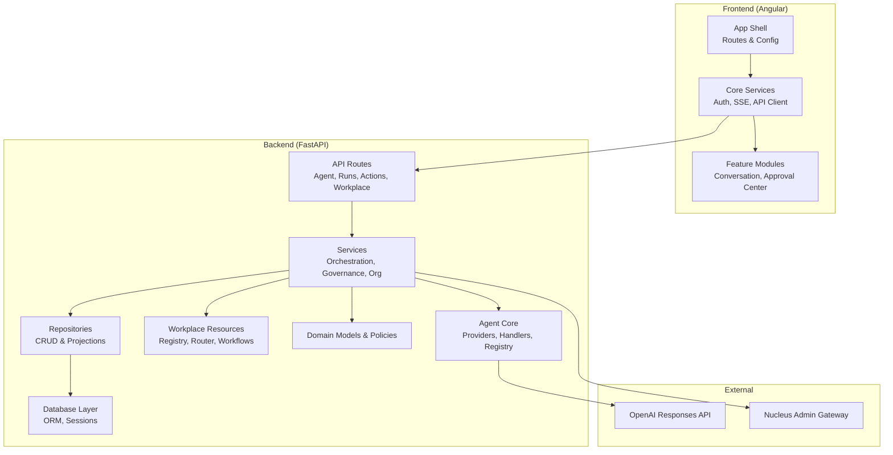
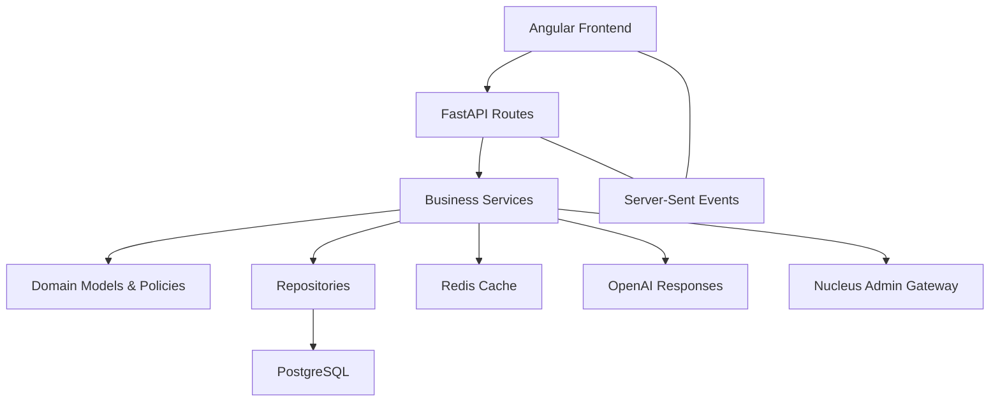
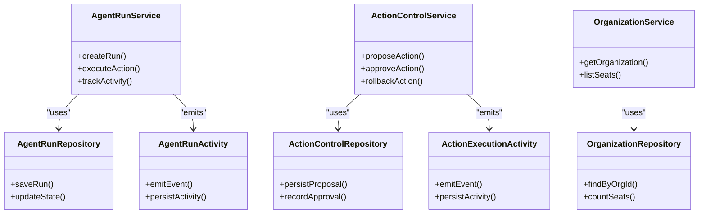
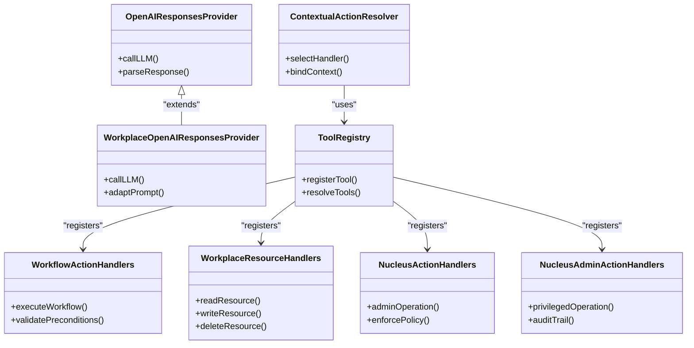
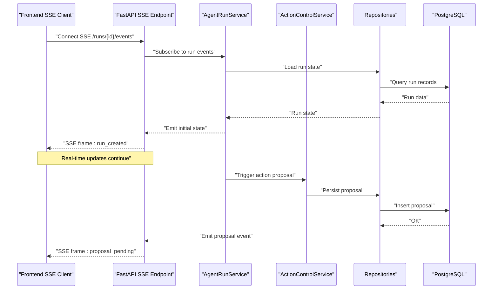
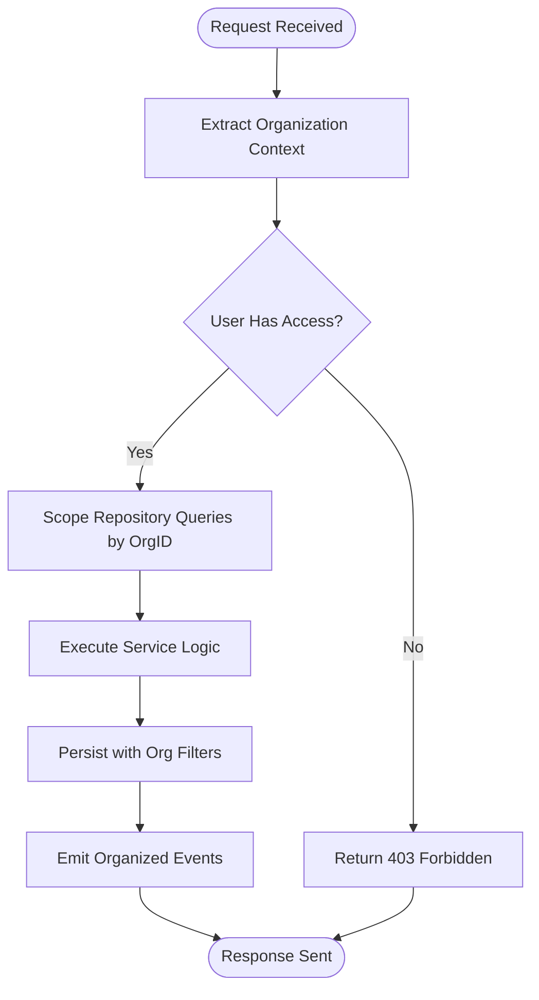
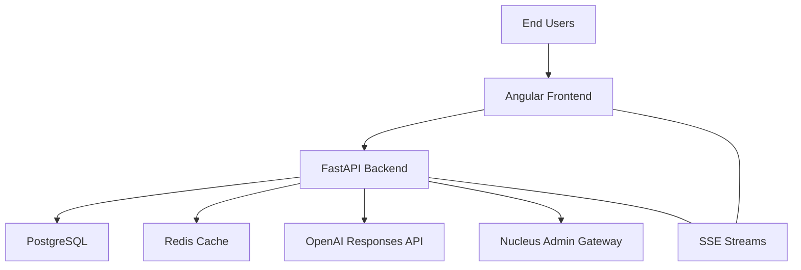
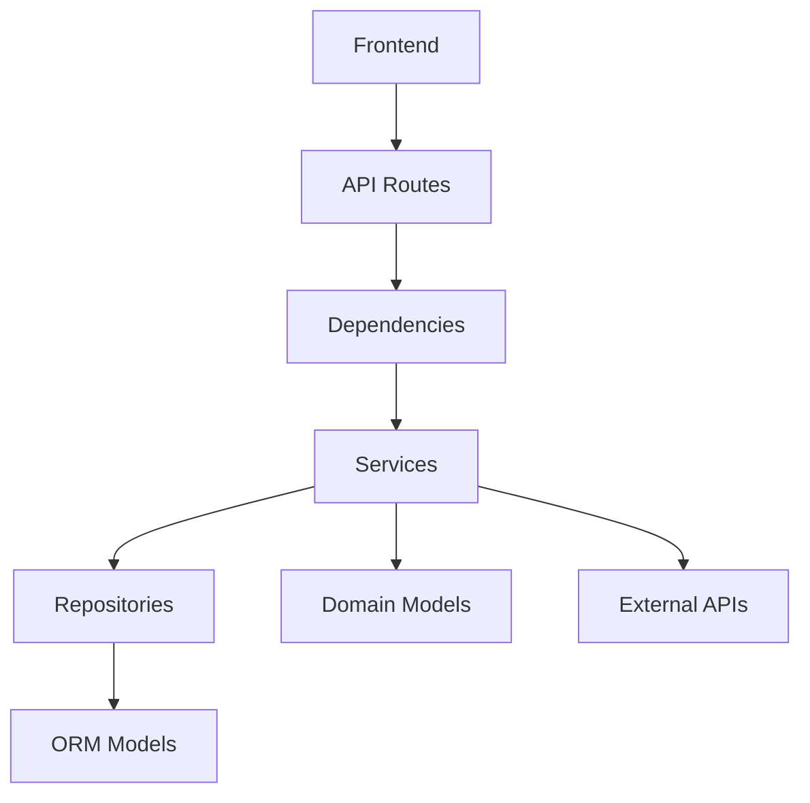

# System Design & Architecture Patterns

<cite>
**Referenced Files in This Document**
- [main.py](file://app/main.py)
- [config.py](file://app/core/config.py)
- [security.py](file://app/core/security.py)
- [agent_routes.py](file://app/api/agent_routes.py)
- [agent_run_routes.py](file://app/api/agent_run_routes.py)
- [conversation_routes.py](file://app/api/conversation_routes.py)
- [action_control_routes.py](file://app/api/action_control_routes.py)
- [workplace_resource_routes.py](file://app/api/workplace_resource_routes.py)
- [nucleus_routes.py](file://app/api/nucleus_routes.py)
- [auth_routes.py](file://app/api/auth_routes.py)
- [health_routes.py](file://app/api/health_routes.py)
- [dependencies.py](file://app/api/dependencies.py)
- [agent_dependencies.py](file://app/api/agent_dependencies.py)
- [agent_run_dependencies.py](file://app/api/agent_run_dependencies.py)
- [action_control_dependencies.py](file://app/api/action_control_dependencies.py)
- [orchestrator.py](file://app/agent/orchestrator.py)
- [instrumented_orchestrator.py](file://app/agent/instrumented_orchestrator.py)
- [response_service.py](file://app/agent/response_service.py)
- [synthesis.py](file://app/agent/synthesis.py)
- [tool_registry.py](file://app/agent/tool_registry.py)
- [action_handlers.py](file://app/agent/action_handlers.py)
- [workflow_action_handlers.py](file://app/agent/workflow_action_handlers.py)
- [workplace_resource_handlers.py](file://app/agent/workplace_resource_handlers.py)
- [nucleus_action_handlers.py](file://app/agent/nucleus_action_handlers.py)
- [nucleus_admin_action_handlers.py](file://app/agent/nucleus_admin_action_handlers.py)
- [contextual_action_resolver.py](file://app/agent/contextual_action_resolver.py)
- [openai_responses.py](file://app/agent/providers/openai_responses.py)
- [workplace_openai_responses.py](file://app/agent/providers/workplace_openai_responses.py)
- [run_contracts.py](file://app/agent/run_contracts.py)
- [run_runtime.py](file://app/agent/run_runtime.py)
- [action_state.py](file://app/agent/action_state.py)
- [action_errors.py](file://app/agent/action_errors.py)
- [errors.py](file://app/agent/errors.py)
- [agent_run_service.py](file://app/services/agent_run_service.py)
- [agent_action_service.py](file://app/services/agent_action_service.py)
- [action_control_service.py](file://app/services/action_control_service.py)
- [compaction_service.py](file://app/services/compaction_service.py)
- [context_memory_service.py](file://app/services/context_memory_service.py)
- [organization_service.py](file://app/services/organization_service.py)
- [nucleus_organization_service.py](file://app/services/nucleus_organization_service.py)
- [operational_resource_service.py](file://app/services/operational_resource_service.py)
- [agent_run_worker.py](file://app/services/agent_run_worker.py)
- [agent_run_activity.py](file://app/services/agent_run_activity.py)
- [action_execution_activity.py](file://app/services/action_execution_activity.py)
- [session_repository.py](file://app/repositories/session_repository.py)
- [user_repository.py](file://app/repositories/user_repository.py)
- [conversation_repository.py](file://app/repositories/conversation_repository.py)
- [conversation_search_repository.py](file://app/repositories/conversation_search_repository.py)
- [agent_run_repository.py](file://app/repositories/agent_run_repository.py)
- [agent_action_repository.py](file://app/repositories/agent_action_repository.py)
- [hardened_agent_action_repository.py](file://app/repositories/hardened_agent_action_repository.py)
- [multi_approval_agent_action_repository.py](file://app/repositories/multi_approval_agent_action_repository.py)
- [action_control_repository.py](file://app/repositories/action_control_repository.py)
- [organization_repository.py](file://app/repositories/organization_repository.py)
- [organization_overview_repository.py](file://app/repositories/organization_overview_repository.py)
- [nucleus_organization_repository.py](file://app/repositories/nucleus_organization_repository.py)
- [nucleus_user_repository.py](file://app/repositories/nucleus_user_repository.py)
- [nucleus_actor_mapping_repository.py](file://app/repositories/nucleus_actor_mapping_repository.py)
- [nucleus_administration_repository.py](file://app/repositories/nucleus_administration_repository.py)
- [nucleus_administration_projection_repository.py](file://app/repositories/nucleus_administration_projection_repository.py)
- [report_repository.py](file://app/repositories/report_repository.py)
- [seat_repository.py](file://app/repositories/seat_repository.py)
- [audit_repository.py](file://app/repositories/audit_repository.py)
- [base.py](file://app/db/base.py)
- [session.py](file://app/db/session.py)
- [orm_models.py](file://app/db/orm_models.py)
- [agent_run_models.py](file://app/db/agent_run_models.py)
- [action_models.py](file://app/db/action_models.py)
- [action_control_models.py](file://app/db/action_control_models.py)
- [nucleus_models.py](file://app/db/nucleus_models.py)
- [nucleus_admin_models.py](file://app/db/nucleus_admin_models.py)
- [nucleus_user_session.py](file://app/db/nucleus_user_session.py)
- [workplace_resource_models.py](file://app/db/workplace_resource_models.py)
- [models.py](file://app/domain/models.py)
- [nucleus_models.py](file://app/domain/nucleus_models.py)
- [nucleus_admin_models.py](file://app/domain/nucleus_admin_models.py)
- [nucleus_policy.py](file://app/domain/nucleus_policy.py)
- [enums.py](file://app/domain/enums.py)
- [effective_period.py](file://app/domain/effective_period.py)
- [permission_service.py](file://app/permissions/permission_service.py)
- [advanced_query.py](file://app/workplace_resources/advanced_query.py)
- [definitions.py](file://app/workplace_resources/definitions.py)
- [operation_router.py](file://app/workplace_resources/operation_router.py)
- [registry.py](file://app/workplace_resources/registry.py)
- [relationships.py](file://app/workplace_resources/relationships.py)
- [risk.py](file://app/workplace_resources/risk.py)
- [service.py](file://app/workplace_resources/service.py)
- [workflows.py](file://app/workplace_resources/workflows.py)
- [error_normalizer.ts](file://frontend/src/app/core/errors/error-normalizer.ts)
- [api-error.interceptor.ts](file://frontend/src/app/core/api/api-error.interceptor.ts)
- [request-id.interceptor.ts](file://frontend/src/app/core/api/request-id.interceptor.ts)
- [validated-http.service.ts](file://frontend/src/app/core/api/validated-http.service.ts)
- [wire.models.ts](file://frontend/src/app/core/api/wire.models.ts)
- [wire.schemas.ts](file://frontend/src/app/core/api/wire.schemas.ts)
- [auth-header.interceptor.ts](file://frontend/src/app/core/auth/auth-header.interceptor.ts)
- [auth.service.ts](file://frontend/src/app/core/auth/auth.service.ts)
- [current-user.store.ts](file://frontend/src/app/core/auth/current-user.store.ts)
- [app-config.loader.ts](file://frontend/src/app/core/config/app-config.loader.ts)
- [app-config.model.ts](file://frontend/src/app/core/config/app-config.model.ts)
- [app-config.token.ts](file://frontend/src/app/core/config/app-config.token.ts)
- [authenticated-sse-client.service.ts](file://frontend/src/app/core/sse/authenticated-sse-client.service.ts)
- [agent-run-stream.service.ts](file://frontend/src/app/core/agent-run/agent-run-stream.service.ts)
- [sse-frame-parser.ts](file://frontend/src/app/core/agent-run/sse-frame-parser.ts)
- [agent-run-api.service.ts](file://frontend/src/app/core/agent-run/agent-run-api.service.ts)
- [agent-run.models.ts](file://frontend/src/app/core/agent-run/agent-run.models.ts)
- [agent-run.schemas.ts](file://frontend/src/app/core/agent-run/agent-run.schemas.ts)
- [action-execution-stream.service.ts](file://frontend/src/app/core/action-control/action-execution-stream.service.ts)
- [proposal-control.facade.ts](file://frontend/src/app/core/action-control/proposal-control.facade.ts)
- [action-control-api.service.ts](file://frontend/src/app/core/action-control/action-control-api.service.ts)
- [action-control.models.ts](file://frontend/src/app/core/action-control/action-control.models.ts)
- [action-control.schemas.ts](file://frontend/src/app/core/action-control/action-control.schemas.ts)
- [conversation-api.service.ts](file://frontend/src/app/core/conversation/conversation-api.service.ts)
- [conversation.models.ts](file://frontend/src/app/core/conversation/conversation.models.ts)
- [organization-route.service.ts](file://frontend/src/app/core/routing/organization-route.service.ts)
- [auth.guard.ts](file://frontend/src/app/core/routing/auth.guard.ts)
- [workplace-agent-api.service.ts](file://frontend/src/app/core/api/workplace-agent-api.service.ts)
- [endpoint-count.ts](file://frontend/src/app/core/api/endpoint-count.ts)
- [agent-conversation.store.ts](file://frontend/src/app/features/assistant-conversation/agent-conversation.store.ts)
- [agent-response.mapper.ts](file://frontend/src/app/features/assistant-conversation/agent-response.mapper.ts)
- [approval-center.component.ts](file://frontend/src/app/features/approval-center/approval-center.component.ts)
- [approval-center.store.ts](file://frontend/src/app/features/approval-center/approval-center.store.ts)
- [workspace-dashboard.component.ts](file://frontend/src/app/layout/workspace/workspace-dashboard.component.ts)
- [organization-workspace.component.ts](file://frontend/src/app/layout/workspace/organization-workspace.component.ts)
- [chat-view.component.ts](file://frontend/src/app/layout/workspace/chat-view.component.ts)
- [section-view.component.ts](file://frontend/src/app/layout/workspace/section-view.component.ts)
- [shell-state.service.ts](file://frontend/src/app/layout/shell/shell-state.service.ts)
- [app.routes.ts](file://frontend/src/app/app.routes.ts)
- [app.config.ts](file://frontend/src/app/app.config.ts)
- [app.component.ts](file://frontend/src/app/app.component.ts)
- [ARCHITECTURE.md](file://docs/ARCHITECTURE.md)
- [AGENT_RUNS_SSE.md](file://docs/AGENT_RUNS_SSE.md)
- [GOVERNED_ACTION_CONTROL_PLANE.md](file://docs/GOVERNED_ACTION_CONTROL_PLANE.md)
- [WORKPLACE_WORKFLOWS.md](file://docs/WORKPLACE_WORKFLOWS.md)
</cite>

## Table of Contents
1. [Introduction](#introduction)
2. [Project Structure](#project-structure)
3. [Core Components](#core-components)
4. [Architecture Overview](#architecture-overview)
5. [Detailed Component Analysis](#detailed-component-analysis)
6. [Dependency Analysis](#dependency-analysis)
7. [Performance Considerations](#performance-considerations)
8. [Troubleshooting Guide](#troubleshooting-guide)
9. [Conclusion](#conclusion)
10. [Appendices](#appendices)

## Introduction
This document describes the system design and core architectural patterns of the AI Agent Platform. It explains a layered architecture with clear separation between presentation, business logic, data access, and domain layers; a plugin-based architecture for extensible AI providers and action handlers; an event-driven architecture using Server-Sent Events (SSE) for real-time communication; and multi-tenancy via organization isolation boundaries. It also provides system context diagrams, scalability considerations, deployment topology guidance, and technology stack decisions including FastAPI, Angular 17+, PostgreSQL, Redis, and OpenAI integration patterns.

## Project Structure
The repository is organized into:
- Backend (FastAPI): app directory with API routes, services, repositories, domain models, database layer, agent orchestration, and workplace resources.
- Frontend (Angular 17+): frontend/src with feature modules, core services, SSE client, and UI components.
- Documentation: docs describing architecture, SSE contracts, and governance.
- Migrations: alembic versions for schema evolution.
- Tests: comprehensive test suites validating behavior across layers.

**Diagram sources**
- [main.py:1-200](file://app/main.py#L1-L200)
- [agent_routes.py:1-200](file://app/api/agent_routes.py#L1-L200)
- [agent_run_routes.py:1-200](file://app/api/agent_run_routes.py#L1-L200)
- [conversation_routes.py:1-200](file://app/api/conversation_routes.py#L1-L200)
- [action_control_routes.py:1-200](file://app/api/action_control_routes.py#L1-L200)
- [workplace_resource_routes.py:1-200](file://app/api/workplace_resource_routes.py#L1-L200)
- [nucleus_routes.py:1-200](file://app/api/nucleus_routes.py#L1-L200)
- [auth_routes.py:1-200](file://app/api/auth_routes.py#L1-L200)
- [health_routes.py:1-200](file://app/api/health_routes.py#L1-L200)
- [orchestrator.py:1-200](file://app/agent/orchestrator.py#L1-L200)
- [openai_responses.py:1-200](file://app/agent/providers/openai_responses.py#L1-L200)
- [workplace_resource_handlers.py:1-200](file://app/agent/workplace_resource_handlers.py#L1-L200)
- [nucleus_action_handlers.py:1-200](file://app/agent/nucleus_action_handlers.py#L1-L200)
- [nucleus_admin_action_handlers.py:1-200](file://app/agent/nucleus_admin_action_handlers.py#L1-L200)
- [agent_run_service.py:1-200](file://app/services/agent_run_service.py#L1-L200)
- [agent_action_service.py:1-200](file://app/services/agent_action_service.py#L1-L200)
- [action_control_service.py:1-200](file://app/services/action_control_service.py#L1-L200)
- [compaction_service.py:1-200](file://app/services/compaction_service.py#L1-L200)
- [context_memory_service.py:1-200](file://app/services/context_memory_service.py#L1-L200)
- [organization_service.py:1-200](file://app/services/organization_service.py#L1-L200)
- [nucleus_organization_service.py:1-200](file://app/services/nucleus_organization_service.py#L1-L200)
- [operational_resource_service.py:1-200](file://app/services/operational_resource_service.py#L1-L200)
- [agent_run_worker.py:1-200](file://app/services/agent_run_worker.py#L1-L200)
- [agent_run_activity.py:1-200](file://app/services/agent_run_activity.py#L1-L200)
- [action_execution_activity.py:1-200](file://app/services/action_execution_activity.py#L1-L200)
- [session_repository.py:1-200](file://app/repositories/session_repository.py#L1-L200)
- [user_repository.py:1-200](file://app/repositories/user_repository.py#L1-L200)
- [conversation_repository.py:1-200](file://app/repositories/conversation_repository.py#L1-L200)
- [conversation_search_repository.py:1-200](file://app/repositories/conversation_search_repository.py#L1-L200)
- [agent_run_repository.py:1-200](file://app/repositories/agent_run_repository.py#L1-L200)
- [agent_action_repository.py:1-200](file://app/repositories/agent_action_repository.py#L1-L200)
- [hardened_agent_action_repository.py:1-200](file://app/repositories/hardened_agent_action_repository.py#L1-L200)
- [multi_approval_agent_action_repository.py:1-200](file://app/repositories/multi_approval_agent_action_repository.py#L1-L200)
- [action_control_repository.py:1-200](file://app/repositories/action_control_repository.py#L1-L200)
- [organization_repository.py:1-200](file://app/repositories/organization_repository.py#L1-L200)
- [organization_overview_repository.py:1-200](file://app/repositories/organization_overview_repository.py#L1-L200)
- [nucleus_organization_repository.py:1-200](file://app/repositories/nucleus_organization_repository.py#L1-L200)
- [nucleus_user_repository.py:1-200](file://app/repositories/nucleus_user_repository.py#L1-L200)
- [nucleus_actor_mapping_repository.py:1-200](file://app/repositories/nucleus_actor_mapping_repository.py#L1-L200)
- [nucleus_administration_repository.py:1-200](file://app/repositories/nucleus_administration_repository.py#L1-L200)
- [nucleus_administration_projection_repository.py:1-200](file://app/repositories/nucleus_administration_projection_repository.py#L1-L200)
- [report_repository.py:1-200](file://app/repositories/report_repository.py#L1-L200)
- [seat_repository.py:1-200](file://app/repositories/seat_repository.py#L1-L200)
- [audit_repository.py:1-200](file://app/repositories/audit_repository.py#L1-L200)
- [base.py:1-200](file://app/db/base.py#L1-L200)
- [session.py:1-200](file://app/db/session.py#L1-L200)
- [orm_models.py:1-200](file://app/db/orm_models.py#L1-L200)
- [agent_run_models.py:1-200](file://app/db/agent_run_models.py#L1-L200)
- [action_models.py:1-200](file://app/db/action_models.py#L1-L200)
- [action_control_models.py:1-200](file://app/db/action_control_models.py#L1-L200)
- [nucleus_models.py:1-200](file://app/db/nucleus_models.py#L1-L200)
- [nucleus_admin_models.py:1-200](file://app/db/nucleus_admin_models.py#L1-L200)
- [nucleus_user_session.py:1-200](file://app/db/nucleus_user_session.py#L1-L200)
- [workplace_resource_models.py:1-200](file://app/db/workplace_resource_models.py#L1-L200)
- [models.py:1-200](file://app/domain/models.py#L1-L200)
- [nucleus_models.py:1-200](file://app/domain/nucleus_models.py#L1-L200)
- [nucleus_admin_models.py:1-200](file://app/domain/nucleus_admin_models.py#L1-L200)
- [nucleus_policy.py:1-200](file://app/domain/nucleus_policy.py#L1-L200)
- [enums.py:1-200](file://app/domain/enums.py#L1-L200)
- [effective_period.py:1-200](file://app/domain/effective_period.py#L1-L200)
- [permission_service.py:1-200](file://app/permissions/permission_service.py#L1-200)
- [advanced_query.py:1-200](file://app/workplace_resources/advanced_query.py#L1-200)
- [definitions.py:1-200](file://app/workplace_resources/definitions.py#L1-200)
- [operation_router.py:1-200](file://app/workplace_resources/operation_router.py#L1-200)
- [registry.py:1-200](file://app/workplace_resources/registry.py#L1-200)
- [relationships.py:1-200](file://app/workplace_resources/relationships.py#L1-200)
- [risk.py:1-200](file://app/workplace_resources/risk.py#L1-200)
- [service.py:1-200](file://app/workplace_resources/service.py#L1-200)
- [workflows.py:1-200](file://app/workplace_resources/workflows.py#L1-200)

**Section sources**
- [main.py:1-200](file://app/main.py#L1-L200)
- [ARCHITECTURE.md:1-200](file://docs/ARCHITECTURE.md#L1-L200)

## Core Components
- Presentation Layer (Frontend): Angular application with core services for authentication, HTTP validation, request ID propagation, error normalization, and SSE streaming for agent runs and action control. Features include conversation UI, approval center, and workspace shell.
- API Layer (Backend): FastAPI routes exposing endpoints for agents, runs, conversations, actions, workplace resources, nucleus admin, auth, and health. Dependencies are injected per route group to enforce separation of concerns.
- Business Logic Layer (Services): Orchestrates agent runs, action proposals, approvals, compaction, context memory, organization management, and operational resources. Activities track run and execution progress.
- Domain Layer: Pure domain models, policies, and enums that encapsulate business rules independent of infrastructure.
- Data Access Layer (Repositories): Encapsulates persistence operations against ORM models and external projections. Includes hardened and multi-approval variants for safety-critical actions.
- Database Layer: SQLAlchemy ORM models, session management, and Alembic migrations.
- Plugin-Based Agent Core: Providers (e.g., OpenAI responses), action handlers (workflow, workplace, nucleus, nucleus admin), tool registry, contextual action resolver, and orchestrator with instrumentation.

Key responsibilities:
- Real-time updates via SSE from backend to frontend for agent runs and action control events.
- Multi-tenancy enforced by organization scoping at API, service, repository, and model levels.
- Extensibility through provider and handler registries.

**Section sources**
- [agent_routes.py:1-200](file://app/api/agent_routes.py#L1-L200)
- [agent_run_routes.py:1-200](file://app/api/agent_run_routes.py#L1-L200)
- [conversation_routes.py:1-200](file://app/api/conversation_routes.py#L1-L200)
- [action_control_routes.py:1-200](file://app/api/action_control_routes.py#L1-L200)
- [workplace_resource_routes.py:1-200](file://app/api/workplace_resource_routes.py#L1-L200)
- [nucleus_routes.py:1-200](file://app/api/nucleus_routes.py#L1-L200)
- [auth_routes.py:1-200](file://app/api/auth_routes.py#L1-L200)
- [health_routes.py:1-200](file://app/api/health_routes.py#L1-L200)
- [dependencies.py:1-200](file://app/api/dependencies.py#L1-L200)
- [agent_dependencies.py:1-200](file://app/api/agent_dependencies.py#L1-L200)
- [agent_run_dependencies.py:1-200](file://app/api/agent_run_dependencies.py#L1-L200)
- [action_control_dependencies.py:1-200](file://app/api/action_control_dependencies.py#L1-L200)
- [orchestrator.py:1-200](file://app/agent/orchestrator.py#L1-L200)
- [instrumented_orchestrator.py:1-200](file://app/agent/instrumented_orchestrator.py#L1-L200)
- [response_service.py:1-200](file://app/agent/response_service.py#L1-L200)
- [synthesis.py:1-200](file://app/agent/synthesis.py#L1-L200)
- [tool_registry.py:1-200](file://app/agent/tool_registry.py#L1-L200)
- [action_handlers.py:1-200](file://app/agent/action_handlers.py#L1-L200)
- [workflow_action_handlers.py:1-200](file://app/agent/workflow_action_handlers.py#L1-L200)
- [workplace_resource_handlers.py:1-200](file://app/agent/workplace_resource_handlers.py#L1-L200)
- [nucleus_action_handlers.py:1-200](file://app/agent/nucleus_action_handlers.py#L1-L200)
- [nucleus_admin_action_handlers.py:1-200](file://app/agent/nucleus_admin_action_handlers.py#L1-L200)
- [contextual_action_resolver.py:1-200](file://app/agent/contextual_action_resolver.py#L1-L200)
- [openai_responses.py:1-200](file://app/agent/providers/openai_responses.py#L1-L200)
- [workplace_openai_responses.py:1-200](file://app/agent/providers/workplace_openai_responses.py#L1-L200)
- [run_contracts.py:1-200](file://app/agent/run_contracts.py#L1-L200)
- [run_runtime.py:1-200](file://app/agent/run_runtime.py#L1-L200)
- [action_state.py:1-200](file://app/agent/action_state.py#L1-L200)
- [action_errors.py:1-200](file://app/agent/action_errors.py#L1-L200)
- [errors.py:1-200](file://app/agent/errors.py#L1-L200)
- [agent_run_service.py:1-200](file://app/services/agent_run_service.py#L1-L200)
- [agent_action_service.py:1-200](file://app/services/agent_action_service.py#L1-L200)
- [action_control_service.py:1-200](file://app/services/action_control_service.py#L1-L200)
- [compaction_service.py:1-200](file://app/services/compaction_service.py#L1-L200)
- [context_memory_service.py:1-200](file://app/services/context_memory_service.py#L1-L200)
- [organization_service.py:1-200](file://app/services/organization_service.py#L1-L200)
- [nucleus_organization_service.py:1-200](file://app/services/nucleus_organization_service.py#L1-L200)
- [operational_resource_service.py:1-200](file://app/services/operational_resource_service.py#L1-L200)
- [agent_run_worker.py:1-200](file://app/services/agent_run_worker.py#L1-L200)
- [agent_run_activity.py:1-200](file://app/services/agent_run_activity.py#L1-L200)
- [action_execution_activity.py:1-200](file://app/services/action_execution_activity.py#L1-L200)
- [session_repository.py:1-200](file://app/repositories/session_repository.py#L1-L200)
- [user_repository.py:1-200](file://app/repositories/user_repository.py#L1-L200)
- [conversation_repository.py:1-200](file://app/repositories/conversation_repository.py#L1-L200)
- [conversation_search_repository.py:1-200](file://app/repositories/conversation_search_repository.py#L1-L200)
- [agent_run_repository.py:1-200](file://app/repositories/agent_run_repository.py#L1-L200)
- [agent_action_repository.py:1-200](file://app/repositories/agent_action_repository.py#L1-L200)
- [hardened_agent_action_repository.py:1-200](file://app/repositories/hardened_agent_action_repository.py#L1-L200)
- [multi_approval_agent_action_repository.py:1-200](file://app/repositories/multi_approval_agent_action_repository.py#L1-L200)
- [action_control_repository.py:1-200](file://app/repositories/action_control_repository.py#L1-L200)
- [organization_repository.py:1-200](file://app/repositories/organization_repository.py#L1-L200)
- [organization_overview_repository.py:1-200](file://app/repositories/organization_overview_repository.py#L1-L200)
- [nucleus_organization_repository.py:1-200](file://app/repositories/nucleus_organization_repository.py#L1-L200)
- [nucleus_user_repository.py:1-200](file://app/repositories/nucleus_user_repository.py#L1-L200)
- [nucleus_actor_mapping_repository.py:1-200](file://app/repositories/nucleus_actor_mapping_repository.py#L1-L200)
- [nucleus_administration_repository.py:1-200](file://app/repositories/nucleus_administration_repository.py#L1-L200)
- [nucleus_administration_projection_repository.py:1-200](file://app/repositories/nucleus_administration_projection_repository.py#L1-L200)
- [report_repository.py:1-200](file://app/repositories/report_repository.py#L1-L200)
- [seat_repository.py:1-200](file://app/repositories/seat_repository.py#L1-L200)
- [audit_repository.py:1-200](file://app/repositories/audit_repository.py#L1-L200)
- [base.py:1-200](file://app/db/base.py#L1-L200)
- [session.py:1-200](file://app/db/session.py#L1-L200)
- [orm_models.py:1-200](file://app/db/orm_models.py#L1-L200)
- [agent_run_models.py:1-200](file://app/db/agent_run_models.py#L1-L200)
- [action_models.py:1-200](file://app/db/action_models.py#L1-L200)
- [action_control_models.py:1-200](file://app/db/action_control_models.py#L1-L200)
- [nucleus_models.py:1-200](file://app/db/nucleus_models.py#L1-L200)
- [nucleus_admin_models.py:1-200](file://app/db/nucleus_admin_models.py#L1-L200)
- [nucleus_user_session.py:1-200](file://app/db/nucleus_user_session.py#L1-L200)
- [workplace_resource_models.py:1-200](file://app/db/workplace_resource_models.py#L1-L200)
- [models.py:1-200](file://app/domain/models.py#L1-L200)
- [nucleus_models.py:1-200](file://app/domain/nucleus_models.py#L1-L200)
- [nucleus_admin_models.py:1-200](file://app/domain/nucleus_admin_models.py#L1-L200)
- [nucleus_policy.py:1-200](file://app/domain/nucleus_policy.py#L1-L200)
- [enums.py:1-200](file://app/domain/enums.py#L1-L200)
- [effective_period.py:1-200](file://app/domain/effective_period.py#L1-L200)
- [permission_service.py:1-200](file://app/permissions/permission_service.py#L1-200)
- [advanced_query.py:1-200](file://app/workplace_resources/advanced_query.py#L1-200)
- [definitions.py:1-200](file://app/workplace_resources/definitions.py#L1-200)
- [operation_router.py:1-200](file://app/workplace_resources/operation_router.py#L1-200)
- [registry.py:1-200](file://app/workplace_resources/registry.py#L1-200)
- [relationships.py:1-200](file://app/workplace_resources/relationships.py#L1-200)
- [risk.py:1-200](file://app/workplace_resources/risk.py#L1-200)
- [service.py:1-200](file://app/workplace_resources/service.py#L1-200)
- [workflows.py:1-200](file://app/workplace_resources/workflows.py#L1-200)

## Architecture Overview
The platform follows a layered architecture:
- Presentation: Angular frontend with SSE clients for real-time updates.
- API: FastAPI routes with dependency injection for cross-cutting concerns (auth, org scoping).
- Business Logic: Services coordinating orchestration, governance, and resource operations.
- Domain: Pure business entities and policies.
- Data Access: Repositories abstracting persistence and projections.
- Infrastructure: Database (PostgreSQL), caching (Redis), and external integrations (OpenAI, Nucleus).

[No sources needed since this diagram shows conceptual workflow, not actual code structure]

## Detailed Component Analysis

### Layered Architecture and Separation of Concerns
- Presentation Layer (Angular):
  - Core services handle authentication headers, request IDs, validated HTTP calls, error normalization, and SSE streaming.
  - Feature modules implement conversation flows and approval centers.
  - Routing enforces organization context and authentication guards.
- API Layer (FastAPI):
  - Route groups expose REST endpoints for agents, runs, actions, workplace resources, nucleus admin, auth, and health.
  - Dependency modules inject shared services, repositories, and security contexts.
- Business Logic Layer (Services):
  - Orchestrate agent runs, action lifecycle, approvals, compaction, context memory, and organizational operations.
  - Activity tracking captures run and execution state transitions.
- Domain Layer:
  - Encapsulates business rules, effective periods, and policies without infrastructure coupling.
- Data Access Layer (Repositories):
  - Provide CRUD and query abstractions over ORM models and projections.
  - Include hardened and multi-approval variants for safety-critical operations.
- Database Layer:
  - SQLAlchemy ORM models and sessions with Alembic migrations for schema evolution.

**Diagram sources**
- [agent_run_service.py:1-200](file://app/services/agent_run_service.py#L1-L200)
- [action_control_service.py:1-200](file://app/services/action_control_service.py#L1-L200)
- [organization_service.py:1-200](file://app/services/organization_service.py#L1-L200)
- [agent_run_repository.py:1-200](file://app/repositories/agent_run_repository.py#L1-L200)
- [action_control_repository.py:1-200](file://app/repositories/action_control_repository.py#L1-L200)
- [organization_repository.py:1-200](file://app/repositories/organization_repository.py#L1-L200)
- [agent_run_activity.py:1-200](file://app/services/agent_run_activity.py#L1-L200)
- [action_execution_activity.py:1-200](file://app/services/action_execution_activity.py#L1-L200)

**Section sources**
- [agent_run_service.py:1-200](file://app/services/agent_run_service.py#L1-L200)
- [action_control_service.py:1-200](file://app/services/action_control_service.py#L1-L200)
- [organization_service.py:1-200](file://app/services/organization_service.py#L1-L200)
- [agent_run_repository.py:1-200](file://app/repositories/agent_run_repository.py#L1-L200)
- [action_control_repository.py:1-200](file://app/repositories/action_control_repository.py#L1-L200)
- [organization_repository.py:1-200](file://app/repositories/organization_repository.py#L1-L200)
- [agent_run_activity.py:1-200](file://app/services/agent_run_activity.py#L1-L200)
- [action_execution_activity.py:1-200](file://app/services/action_execution_activity.py#L1-L200)

### Plugin-Based Architecture: AI Providers and Action Handlers
- Providers:
  - OpenAI responses provider implements LLM interaction patterns.
  - Workplace-specific provider adapts prompts and tools for workplace resources.
- Action Handlers:
  - Workflow handlers manage lifecycle of user-defined workflows.
  - Workplace resource handlers execute operations on managed resources.
  - Nucleus handlers integrate with admin gateway for administrative actions.
  - Nucleus admin handlers provide privileged operations under strict controls.
- Tool Registry and Contextual Resolver:
  - Central registry discovers and binds available tools.
  - Contextual resolver selects appropriate handlers based on runtime context.

**Diagram sources**
- [openai_responses.py:1-200](file://app/agent/providers/openai_responses.py#L1-L200)
- [workplace_openai_responses.py:1-200](file://app/agent/providers/workplace_openai_responses.py#L1-L200)
- [workflow_action_handlers.py:1-200](file://app/agent/workflow_action_handlers.py#L1-L200)
- [workplace_resource_handlers.py:1-200](file://app/agent/workplace_resource_handlers.py#L1-L200)
- [nucleus_action_handlers.py:1-200](file://app/agent/nucleus_action_handlers.py#L1-L200)
- [nucleus_admin_action_handlers.py:1-200](file://app/agent/nucleus_admin_action_handlers.py#L1-L200)
- [tool_registry.py:1-200](file://app/agent/tool_registry.py#L1-L200)
- [contextual_action_resolver.py:1-200](file://app/agent/contextual_action_resolver.py#L1-L200)

**Section sources**
- [openai_responses.py:1-200](file://app/agent/providers/openai_responses.py#L1-L200)
- [workplace_openai_responses.py:1-200](file://app/agent/providers/workplace_openai_responses.py#L1-L200)
- [workflow_action_handlers.py:1-200](file://app/agent/workflow_action_handlers.py#L1-L200)
- [workplace_resource_handlers.py:1-200](file://app/agent/workplace_resource_handlers.py#L1-L200)
- [nucleus_action_handlers.py:1-200](file://app/agent/nucleus_action_handlers.py#L1-L200)
- [nucleus_admin_action_handlers.py:1-200](file://app/agent/nucleus_admin_action_handlers.py#L1-L200)
- [tool_registry.py:1-200](file://app/agent/tool_registry.py#L1-L200)
- [contextual_action_resolver.py:1-200](file://app/agent/contextual_action_resolver.py#L1-L200)

### Event-Driven Architecture with Server-Sent Events (SSE)
- Backend emits structured events for agent run lifecycle and action control activities.
- Frontend maintains authenticated SSE connections to receive real-time updates.
- Frame parsing ensures robust handling of partial or fragmented SSE frames.

**Diagram sources**
- [agent_run_routes.py:1-200](file://app/api/agent_run_routes.py#L1-L200)
- [action_control_routes.py:1-200](file://app/api/action_control_routes.py#L1-L200)
- [agent_run_service.py:1-200](file://app/services/agent_run_service.py#L1-L200)
- [action_control_service.py:1-200](file://app/services/action_control_service.py#L1-L200)
- [agent_run_repository.py:1-200](file://app/repositories/agent_run_repository.py#L1-L200)
- [action_control_repository.py:1-200](file://app/repositories/action_control_repository.py#L1-L200)
- [agent_run_stream.service.ts:1-200](file://frontend/src/app/core/agent-run/agent-run-stream.service.ts#L1-L200)
- [sse-frame-parser.ts:1-200](file://frontend/src/app/core/agent-run/sse-frame-parser.ts#L1-L200)
- [authenticated-sse-client.service.ts:1-200](file://frontend/src/app/core/sse/authenticated-sse-client.service.ts#L1-L200)

**Section sources**
- [agent_run_routes.py:1-200](file://app/api/agent_run_routes.py#L1-L200)
- [action_control_routes.py:1-200](file://app/api/action_control_routes.py#L1-L200)
- [agent_run_service.py:1-200](file://app/services/agent_run_service.py#L1-L200)
- [action_control_service.py:1-200](file://app/services/action_control_service.py#L1-L200)
- [agent_run_repository.py:1-200](file://app/repositories/agent_run_repository.py#L1-L200)
- [action_control_repository.py:1-200](file://app/repositories/action_control_repository.py#L1-L200)
- [agent_run_stream.service.ts:1-200](file://frontend/src/app/core/agent-run/agent-run-stream.service.ts#L1-L200)
- [sse-frame-parser.ts:1-200](file://frontend/src/app/core/agent-run/sse-frame-parser.ts#L1-L200)
- [authenticated-sse-client.service.ts:1-200](file://frontend/src/app/core/sse/authenticated-sse-client.service.ts#L1-L200)

### Multi-Tenancy with Organization Isolation Boundaries
- Organization scoping is enforced at API dependencies, service methods, repository queries, and ORM filters.
- Seat management and overview repositories support capacity planning and visibility constraints.
- Nucleus organization services and repositories provide administrative views while maintaining isolation.

**Diagram sources**
- [dependencies.py:1-200](file://app/api/dependencies.py#L1-L200)
- [agent_dependencies.py:1-200](file://app/api/agent_dependencies.py#L1-L200)
- [agent_run_dependencies.py:1-200](file://app/api/agent_run_dependencies.py#L1-L200)
- [action_control_dependencies.py:1-200](file://app/api/action_control_dependencies.py#L1-L200)
- [organization_repository.py:1-200](file://app/repositories/organization_repository.py#L1-L200)
- [organization_overview_repository.py:1-200](file://app/repositories/organization_overview_repository.py#L1-L200)
- [nucleus_organization_repository.py:1-200](file://app/repositories/nucleus_organization_repository.py#L1-L200)
- [organization_service.py:1-200](file://app/services/organization_service.py#L1-L200)
- [nucleus_organization_service.py:1-200](file://app/services/nucleus_organization_service.py#L1-L200)

**Section sources**
- [dependencies.py:1-200](file://app/api/dependencies.py#L1-L200)
- [agent_dependencies.py:1-200](file://app/api/agent_dependencies.py#L1-L200)
- [agent_run_dependencies.py:1-200](file://app/api/agent_run_dependencies.py#L1-L200)
- [action_control_dependencies.py:1-200](file://app/api/action_control_dependencies.py#L1-L200)
- [organization_repository.py:1-200](file://app/repositories/organization_repository.py#L1-L200)
- [organization_overview_repository.py:1-200](file://app/repositories/organization_overview_repository.py#L1-L200)
- [nucleus_organization_repository.py:1-200](file://app/repositories/nucleus_organization_repository.py#L1-L200)
- [organization_service.py:1-200](file://app/services/organization_service.py#L1-L200)
- [nucleus_organization_service.py:1-200](file://app/services/nucleus_organization_service.py#L1-L200)

### System Context Diagram: Component Interactions

[No sources needed since this diagram shows conceptual workflow, not actual code structure]

## Dependency Analysis
- API routes depend on dependency modules for injecting services and repositories.
- Services depend on repositories and domain models.
- Repositories depend on ORM models and database sessions.
- Agent core depends on providers and action handlers registered via tool registry.
- Frontend depends on core services for HTTP, SSE, and routing.

**Diagram sources**
- [agent_routes.py:1-200](file://app/api/agent_routes.py#L1-L200)
- [agent_run_routes.py:1-200](file://app/api/agent_run_routes.py#L1-L200)
- [conversation_routes.py:1-200](file://app/api/conversation_routes.py#L1-L200)
- [action_control_routes.py:1-200](file://app/api/action_control_routes.py#L1-L200)
- [workplace_resource_routes.py:1-200](file://app/api/workplace_resource_routes.py#L1-L200)
- [nucleus_routes.py:1-200](file://app/api/nucleus_routes.py#L1-L200)
- [auth_routes.py:1-200](file://app/api/auth_routes.py#L1-L200)
- [health_routes.py:1-200](file://app/api/health_routes.py#L1-L200)
- [dependencies.py:1-200](file://app/api/dependencies.py#L1-L200)
- [agent_dependencies.py:1-200](file://app/api/agent_dependencies.py#L1-L200)
- [agent_run_dependencies.py:1-200](file://app/api/agent_run_dependencies.py#L1-L200)
- [action_control_dependencies.py:1-200](file://app/api/action_control_dependencies.py#L1-L200)
- [agent_run_service.py:1-200](file://app/services/agent_run_service.py#L1-L200)
- [action_control_service.py:1-200](file://app/services/action_control_service.py#L1-L200)
- [organization_service.py:1-200](file://app/services/organization_service.py#L1-L200)
- [agent_run_repository.py:1-200](file://app/repositories/agent_run_repository.py#L1-L200)
- [action_control_repository.py:1-200](file://app/repositories/action_control_repository.py#L1-L200)
- [organization_repository.py:1-200](file://app/repositories/organization_repository.py#L1-L200)
- [orm_models.py:1-200](file://app/db/orm_models.py#L1-L200)
- [models.py:1-200](file://app/domain/models.py#L1-L200)
- [openai_responses.py:1-200](file://app/agent/providers/openai_responses.py#L1-L200)

**Section sources**
- [agent_routes.py:1-200](file://app/api/agent_routes.py#L1-L200)
- [agent_run_routes.py:1-200](file://app/api/agent_run_routes.py#L1-L200)
- [conversation_routes.py:1-200](file://app/api/conversation_routes.py#L1-L200)
- [action_control_routes.py:1-200](file://app/api/action_control_routes.py#L1-L200)
- [workplace_resource_routes.py:1-200](file://app/api/workplace_resource_routes.py#L1-L200)
- [nucleus_routes.py:1-200](file://app/api/nucleus_routes.py#L1-L200)
- [auth_routes.py:1-200](file://app/api/auth_routes.py#L1-L200)
- [health_routes.py:1-200](file://app/api/health_routes.py#L1-L200)
- [dependencies.py:1-200](file://app/api/dependencies.py#L1-L200)
- [agent_dependencies.py:1-200](file://app/api/agent_dependencies.py#L1-L200)
- [agent_run_dependencies.py:1-200](file://app/api/agent_run_dependencies.py#L1-L200)
- [action_control_dependencies.py:1-200](file://app/api/action_control_dependencies.py#L1-L200)
- [agent_run_service.py:1-200](file://app/services/agent_run_service.py#L1-L200)
- [action_control_service.py:1-200](file://app/services/action_control_service.py#L1-L200)
- [organization_service.py:1-200](file://app/services/organization_service.py#L1-L200)
- [agent_run_repository.py:1-200](file://app/repositories/agent_run_repository.py#L1-L200)
- [action_control_repository.py:1-200](file://app/repositories/action_control_repository.py#L1-L200)
- [organization_repository.py:1-200](file://app/repositories/organization_repository.py#L1-L200)
- [orm_models.py:1-200](file://app/db/orm_models.py#L1-L200)
- [models.py:1-200](file://app/domain/models.py#L1-L200)
- [openai_responses.py:1-200](file://app/agent/providers/openai_responses.py#L1-L200)

## Performance Considerations
- Horizontal Scaling:
  - Stateless API nodes behind load balancer; share Redis cache and PostgreSQL cluster.
  - SSE endpoints benefit from sticky sessions or centralized message bus if scaling beyond single process.
- Concurrency:
  - Use async I/O for SSE and external API calls where possible.
  - Implement optimistic locking or versioned entities for concurrent writes.
- Caching:
  - Cache frequently read organization and seat data in Redis.
  - Invalidate caches on write paths to maintain consistency.
- Database Optimization:
  - Indexes on organization-scoped foreign keys and status fields.
  - Partition large tables (e.g., activity logs) by time or organization.
- Backpressure:
  - Apply rate limiting on SSE streams and external provider calls.
  - Use queues for long-running actions to avoid blocking requests.

[No sources needed since this section provides general guidance]

## Troubleshooting Guide
- Authentication and Authorization:
  - Verify JWT issuance and header propagation interceptors.
  - Check permission service evaluations and organization scoping.
- SSE Connectivity:
  - Ensure authenticated SSE client sets proper headers.
  - Inspect frame parser for partial frame handling and reconnection logic.
- Error Handling:
  - Normalize backend errors to consistent frontend error shapes.
  - Log request IDs propagated via interceptors for traceability.
- Provider Integration:
  - Validate OpenAI response parsing and fallback strategies.
  - Monitor external API latency and error rates.

**Section sources**
- [auth-header.interceptor.ts:1-200](file://frontend/src/app/core/auth/auth-header.interceptor.ts#L1-L200)
- [auth.service.ts:1-200](file://frontend/src/app/core/auth/auth.service.ts#L1-L200)
- [current-user.store.ts:1-200](file://frontend/src/app/core/auth/current-user.store.ts#L1-L200)
- [authenticated-sse-client.service.ts:1-200](file://frontend/src/app/core/sse/authenticated-sse-client.service.ts#L1-L200)
- [sse-frame-parser.ts:1-200](file://frontend/src/app/core/agent-run/sse-frame-parser.ts#L1-L200)
- [api-error.interceptor.ts:1-200](file://frontend/src/app/core/api/api-error.interceptor.ts#L1-L200)
- [request-id.interceptor.ts:1-200](file://frontend/src/app/core/api/request-id.interceptor.ts#L1-L200)
- [error_normalizer.ts:1-200](file://frontend/src/app/core/errors/error-normalizer.ts#L1-L200)
- [openai_responses.py:1-200](file://app/agent/providers/openai_responses.py#L1-L200)
- [permission_service.py:1-200](file://app/permissions/permission_service.py#L1-200)

## Conclusion
The AI Agent Platform employs a robust layered architecture with clear separation of concerns, a plugin-based design for extensibility, and an event-driven approach powered by SSE for real-time interactions. Multi-tenancy is enforced through organization isolation boundaries across all layers. The technology stack leverages FastAPI, Angular 17+, PostgreSQL, Redis, and OpenAI integration patterns to deliver scalable, secure, and extensible capabilities.

[No sources needed since this section summarizes without analyzing specific files]

## Appendices

### Technology Stack Decisions
- Backend: FastAPI for high-performance async web framework.
- Frontend: Angular 17+ for component-based UI with strong typing and modern tooling.
- Database: PostgreSQL for relational integrity and advanced querying.
- Cache: Redis for low-latency caching and session storage.
- AI Integration: OpenAI Responses API for LLM capabilities with provider abstraction.

[No sources needed since this section provides general guidance]