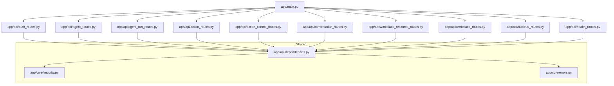
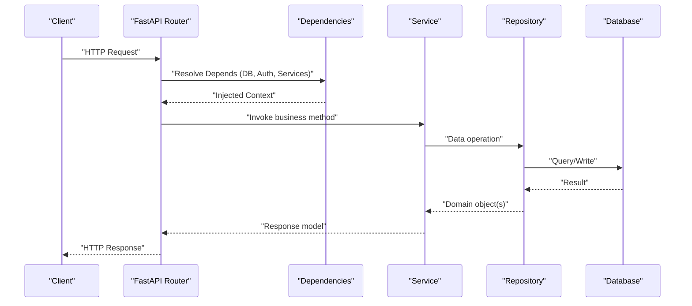
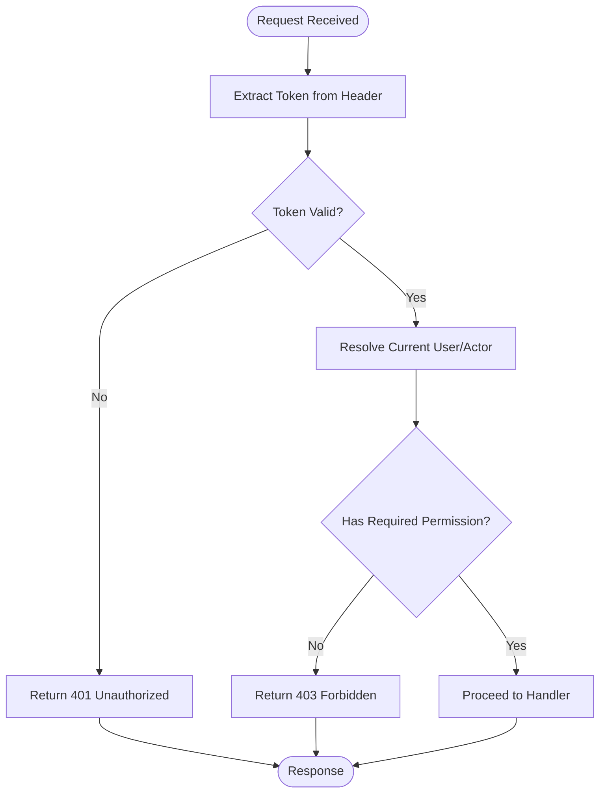
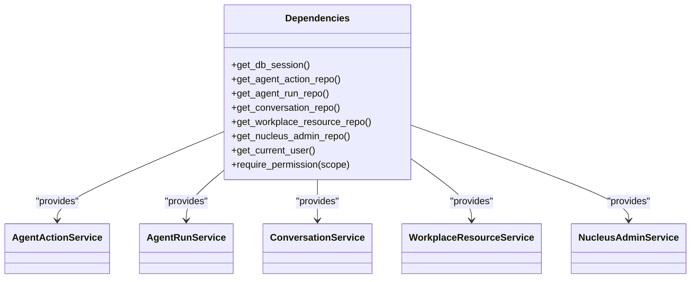
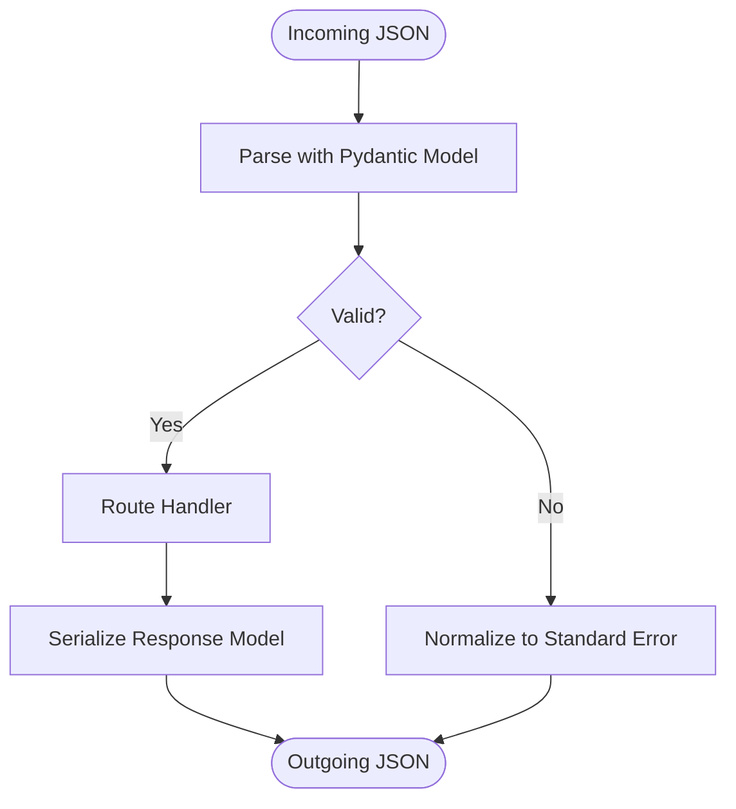
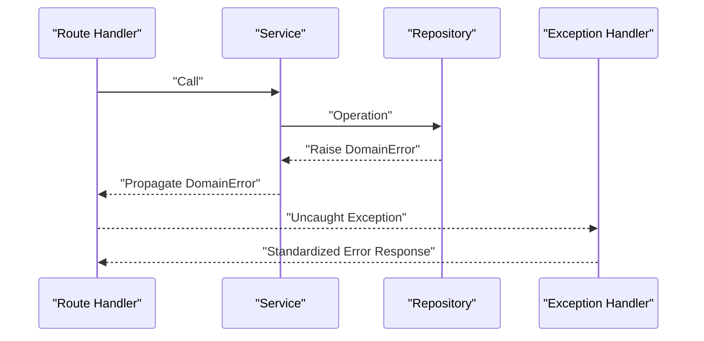
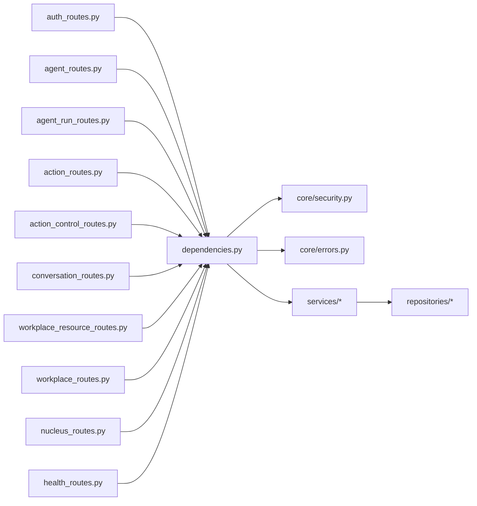

# API Layer & Routes

<cite>
**Referenced Files in This Document**
- [main.py](file://app/main.py)
- [dependencies.py](file://app/api/dependencies.py)
- [auth_routes.py](file://app/api/auth_routes.py)
- [agent_routes.py](file://app/api/agent_routes.py)
- [agent_run_routes.py](file://app/api/agent_run_routes.py)
- [action_routes.py](file://app/api/action_routes.py)
- [action_control_routes.py](file://app/api/action_control_routes.py)
- [conversation_routes.py](file://app/api/conversation_routes.py)
- [workplace_resource_routes.py](file://app/api/workplace_resource_routes.py)
- [workplace_routes.py](file://app/api/workplace_routes.py)
- [nucleus_routes.py](file://app/api/nucleus_routes.py)
- [health_routes.py](file://app/api/health_routes.py)
- [core/errors.py](file://app/core/errors.py)
- [core/security.py](file://app/core/security.py)
- [schemas/__init__.py](file://app/schemas/__init__.py)
- [repositories/__init__.py](file://app/repositories/__init__.py)
- [services/__init__.py](file://app/services/__init__.py)
</cite>

## Table of Contents
1. [Introduction](#introduction)
2. [Project Structure](#project-structure)
3. [Core Components](#core-components)
4. [Architecture Overview](#architecture-overview)
5. [Detailed Component Analysis](#detailed-component-analysis)
6. [Dependency Analysis](#dependency-analysis)
7. [Performance Considerations](#performance-considerations)
8. [Troubleshooting Guide](#troubleshooting-guide)
9. [Conclusion](#conclusion)
10. [Appendices](#appendices)

## Introduction
This document describes the API layer and route definitions, focusing on RESTful endpoint design, request/response schemas, authentication middleware, dependency injection patterns for services and repositories, input validation, error handling, response formatting, and operational concerns such as rate limiting, versioning, and documentation generation. It also provides guidelines for adding new endpoints while maintaining consistency across the API surface.

## Project Structure
The API is organized by feature domains under app/api, with shared concerns (security, errors, dependencies) centralized in app/core and app/api. Schemas are defined in app/schemas, repositories in app/repositories, and business logic in app/services. The application entry point wires routers and global configuration.

**Diagram sources**
- [main.py:1-200](file://app/main.py#L1-L200)
- [auth_routes.py:1-200](file://app/api/auth_routes.py#L1-L200)
- [agent_routes.py:1-200](file://app/api/agent_routes.py#L1-L200)
- [agent_run_routes.py:1-200](file://app/api/agent_run_routes.py#L1-L200)
- [action_routes.py:1-200](file://app/api/action_routes.py#L1-L200)
- [action_control_routes.py:1-200](file://app/api/action_control_routes.py#L1-L200)
- [conversation_routes.py:1-200](file://app/api/conversation_routes.py#L1-L200)
- [workplace_resource_routes.py:1-200](file://app/api/workplace_resource_routes.py#L1-L200)
- [workplace_routes.py:1-200](file://app/api/workplace_routes.py#L1-L200)
- [nucleus_routes.py:1-200](file://app/api/nucleus_routes.py#L1-L200)
- [health_routes.py:1-200](file://app/api/health_routes.py#L1-L200)
- [dependencies.py:1-200](file://app/api/dependencies.py#L1-L200)
- [core/security.py:1-200](file://app/core/security.py#L1-L200)
- [core/errors.py:1-200](file://app/core/errors.py#L1-L200)

**Section sources**
- [main.py:1-200](file://app/main.py#L1-L200)

## Core Components
- Application entrypoint and router registration: centralizes mount points for domain routers and global configuration.
- Shared dependency providers: create and cache service/repository instances per request via FastAPI Depends.
- Authentication and authorization: token extraction, verification, and current user resolution.
- Error handling: standardized exception types and response formatting.
- Schema contracts: Pydantic models for requests and responses used by routes.

Key responsibilities:
- app/main.py: mounts routers, configures lifespan, and sets up global middleware.
- app/api/dependencies.py: defines reusable Depends for services, repositories, DB sessions, and auth context.
- app/core/security.py: implements security primitives (e.g., token parsing, password hashing utilities).
- app/core/errors.py: defines domain exceptions and error response helpers.
- app/schemas/*: request/response models that enforce validation and serialization.

**Section sources**
- [main.py:1-200](file://app/main.py#L1-L200)
- [dependencies.py:1-200](file://app/api/dependencies.py#L1-L200)
- [core/security.py:1-200](file://app/core/security.py#L1-L200)
- [core/errors.py:1-200](file://app/core/errors.py#L1-L200)
- [schemas/__init__.py:1-200](file://app/schemas/__init__.py#L1-L200)

## Architecture Overview
The API follows a layered architecture:
- Routes (controllers): define HTTP endpoints, parse inputs, and orchestrate calls to services.
- Services: implement business logic, coordinate multiple repositories, and handle cross-cutting concerns.
- Repositories: encapsulate data access and persistence operations.
- Schemas: provide strict request/response contracts.
- Security: validates tokens and resolves identity.
- Errors: normalizes failures into consistent responses.

**Diagram sources**
- [main.py:1-200](file://app/main.py#L1-L200)
- [dependencies.py:1-200](file://app/api/dependencies.py#L1-L200)

## Detailed Component Analysis

### Authentication and Authorization Middleware
- Token extraction and verification are implemented in core security utilities.
- Route-level guards use dependency functions to resolve the current authenticated actor and required permissions.
- Unauthorized or invalid tokens result in standardized error responses.

**Diagram sources**
- [core/security.py:1-200](file://app/core/security.py#L1-L200)
- [dependencies.py:1-200](file://app/api/dependencies.py#L1-L200)
- [core/errors.py:1-200](file://app/core/errors.py#L1-L200)

**Section sources**
- [core/security.py:1-200](file://app/core/security.py#L1-L200)
- [dependencies.py:1-200](file://app/api/dependencies.py#L1-L200)
- [core/errors.py:1-200](file://app/core/errors.py#L1-L200)

### Dependency Injection Patterns
- Centralized dependency providers in app/api/dependencies.py supply:
  - Database session factories
  - Repository instances bound to sessions
  - Service instances bound to repositories
  - Authenticated user context
- Routers import these providers to keep handlers thin and testable.

**Diagram sources**
- [dependencies.py:1-200](file://app/api/dependencies.py#L1-L200)

**Section sources**
- [dependencies.py:1-200](file://app/api/dependencies.py#L1-L200)

### Input Validation and Response Formatting
- Requests are validated using Pydantic models defined in app/schemas/*.
- Responses are serialized against response models to ensure contract stability.
- Validation errors are normalized into consistent error payloads.

**Diagram sources**
- [schemas/__init__.py:1-200](file://app/schemas/__init__.py#L1-L200)
- [core/errors.py:1-200](file://app/core/errors.py#L1-L200)

**Section sources**
- [schemas/__init__.py:1-200](file://app/schemas/__init__.py#L1-L200)
- [core/errors.py:1-200](file://app/core/errors.py#L1-L200)

### Error Handling Strategy
- Domain-specific exceptions are raised in services/repositories.
- Global exception handlers convert them into standardized HTTP responses with consistent fields.
- Logging and correlation IDs are attached where applicable.

**Diagram sources**
- [core/errors.py:1-200](file://app/core/errors.py#L1-L200)

**Section sources**
- [core/errors.py:1-200](file://app/core/errors.py#L1-L200)

### API Endpoints by Feature

#### Authentication Endpoints
- Purpose: login, token refresh, logout, and user profile retrieval.
- Security: requires valid credentials; returns JWT or session tokens.
- Typical paths: /api/v1/auth/login, /api/v1/auth/me, /api/v1/auth/refresh.

**Section sources**
- [auth_routes.py:1-200](file://app/api/auth_routes.py#L1-L200)

#### Agent Endpoints
- Purpose: list agents, get agent details, update agent settings.
- Security: requires appropriate scopes.
- Typical paths: /api/v1/agents, /api/v1/agents/{id}.

**Section sources**
- [agent_routes.py:1-200](file://app/api/agent_routes.py#L1-L200)

#### Agent Run Endpoints
- Purpose: create runs, query run status, stream events (SSE), cancel runs.
- Security: requires write permissions for creation; read-only for queries.
- Typical paths: /api/v1/runs, /api/v1/runs/{id}, /api/v1/runs/{id}/events.

**Section sources**
- [agent_run_routes.py:1-200](file://app/api/agent_run_routes.py#L1-L200)

#### Action Endpoints
- Purpose: propose, approve, execute, and audit actions.
- Security: enforces role-based permissions and multi-approval workflows.
- Typical paths: /api/v1/actions, /api/v1/actions/{id}, /api/v1/actions/{id}/approve.

**Section sources**
- [action_routes.py:1-200](file://app/api/action_routes.py#L1-L200)

#### Action Control Plane Endpoints
- Purpose: control plane operations for governed actions, lifecycle transitions, and rollbacks.
- Security: admin-level permissions.
- Typical paths: /api/v1/control/actions, /api/v1/control/actions/{id}.

**Section sources**
- [action_control_routes.py:1-200](file://app/api/action_control_routes.py#L1-L200)

#### Conversation Endpoints
- Purpose: list conversations, retrieve messages, search content.
- Security: scoped by organization/user.
- Typical paths: /api/v1/conversations, /api/v1/conversations/{id}.

**Section sources**
- [conversation_routes.py:1-200](file://app/api/conversation_routes.py#L1-L200)

#### Workplace Resource Endpoints
- Purpose: CRUD and advanced queries over workplace resources, relationships, and risk metadata.
- Security: resource-scoped permissions.
- Typical paths: /api/v1/workplace/resources, /api/v1/workplace/resources/{id}.

**Section sources**
- [workplace_resource_routes.py:1-200](file://app/api/workplace_resource_routes.py#L1-L200)

#### Workplace Endpoints
- Purpose: higher-level workspace operations and workflow triggers.
- Security: workspace-scoped roles.
- Typical paths: /api/v1/workspaces, /api/v1/workspaces/{id}.

**Section sources**
- [workplace_routes.py:1-200](file://app/api/workplace_routes.py#L1-L200)

#### Nucleus Admin Endpoints
- Purpose: administrative operations for nucleus entities and policies.
- Security: admin-only.
- Typical paths: /api/v1/nucleus/admin/*

**Section sources**
- [nucleus_routes.py:1-200](file://app/api/nucleus_routes.py#L1-L200)

#### Health and Readiness Endpoints
- Purpose: liveness/readiness probes and basic system info.
- Security: public.
- Typical paths: /api/v1/health, /api/v1/ready

**Section sources**
- [health_routes.py:1-200](file://app/api/health_routes.py#L1-L200)

## Dependency Analysis
The following diagram shows how routers depend on shared dependencies and how services depend on repositories.

**Diagram sources**
- [auth_routes.py:1-200](file://app/api/auth_routes.py#L1-L200)
- [agent_routes.py:1-200](file://app/api/agent_routes.py#L1-L200)
- [agent_run_routes.py:1-200](file://app/api/agent_run_routes.py#L1-L200)
- [action_routes.py:1-200](file://app/api/action_routes.py#L1-L200)
- [action_control_routes.py:1-200](file://app/api/action_control_routes.py#L1-L200)
- [conversation_routes.py:1-200](file://app/api/conversation_routes.py#L1-L200)
- [workplace_resource_routes.py:1-200](file://app/api/workplace_resource_routes.py#L1-L200)
- [workplace_routes.py:1-200](file://app/api/workplace_routes.py#L1-L200)
- [nucleus_routes.py:1-200](file://app/api/nucleus_routes.py#L1-L200)
- [health_routes.py:1-200](file://app/api/health_routes.py#L1-L200)
- [dependencies.py:1-200](file://app/api/dependencies.py#L1-L200)
- [core/security.py:1-200](file://app/core/security.py#L1-L200)
- [core/errors.py:1-200](file://app/core/errors.py#L1-L200)
- [services/__init__.py:1-200](file://app/services/__init__.py#L1-L200)
- [repositories/__init__.py:1-200](file://app/repositories/__init__.py#L1-L200)

**Section sources**
- [dependencies.py:1-200](file://app/api/dependencies.py#L1-L200)
- [services/__init__.py:1-200](file://app/services/__init__.py#L1-L200)
- [repositories/__init__.py:1-200](file://app/repositories/__init__.py#L1-L200)

## Performance Considerations
- Use streaming responses (SSE) for long-running operations like agent run events to avoid blocking connections.
- Prefer pagination and filtering for list endpoints to reduce payload sizes.
- Cache frequently accessed read-only data at the service layer when safe.
- Keep database transactions short; avoid heavy computations inside repository methods.
- Apply rate limiting at the gateway or middleware layer for sensitive endpoints.

[No sources needed since this section provides general guidance]

## Troubleshooting Guide
Common issues and resolutions:
- Authentication failures: verify token format, expiration, and issuer; check security middleware logs.
- Validation errors: inspect request body against schema definitions; ensure required fields are present.
- Permission denied: confirm user roles and resource scoping; review permission checks in dependencies.
- Database errors: validate connection strings and migrations; check repository error propagation.
- Unexpected responses: compare actual response shape with schema definitions; enable detailed logging.

Operational tips:
- Use health/readiness endpoints to verify service state.
- Correlate requests using request IDs propagated through headers.
- Enable structured logging for all error paths.

**Section sources**
- [core/errors.py:1-200](file://app/core/errors.py#L1-L200)
- [health_routes.py:1-200](file://app/api/health_routes.py#L1-L200)

## Conclusion
The API layer is organized around clear feature boundaries, strong typing via schemas, and robust dependency injection. Authentication and authorization are enforced centrally, and errors are normalized for predictable client behavior. Following the provided guidelines ensures consistency, maintainability, and scalability as new endpoints are added.

[No sources needed since this section summarizes without analyzing specific files]

## Appendices

### Guidelines for Adding New API Endpoints
- Create or extend a router file under app/api/<feature>_routes.py.
- Define request/response models in app/schemas/<feature>.py.
- Implement business logic in app/services/<feature>_service.py.
- Add data access methods in app/repositories/<feature>_repository.py.
- Register dependency providers in app/api/dependencies.py if needed.
- Mount the router in app/main.py under an appropriate prefix (e.g., /api/v1/<feature>).
- Add tests covering happy path, validation errors, and authorization failures.

**Section sources**
- [main.py:1-200](file://app/main.py#L1-L200)
- [dependencies.py:1-200](file://app/api/dependencies.py#L1-L200)
- [schemas/__init__.py:1-200](file://app/schemas/__init__.py#L1-L200)
- [services/__init__.py:1-200](file://app/services/__init__.py#L1-L200)
- [repositories/__init__.py:1-200](file://app/repositories/__init__.py#L1-L200)

### Request Validation Checklist
- Use Pydantic models for both request bodies and path/query parameters.
- Provide descriptive field constraints and examples in schemas.
- Return standardized validation error responses.

**Section sources**
- [schemas/__init__.py:1-200](file://app/schemas/__init__.py#L1-L200)
- [core/errors.py:1-200](file://app/core/errors.py#L1-L200)

### Authentication and Authorization Checklist
- Enforce token validation via security utilities.
- Require explicit permissions per endpoint using dependency guards.
- Return 401/403 consistently for auth failures.

**Section sources**
- [core/security.py:1-200](file://app/core/security.py#L1-L200)
- [dependencies.py:1-200](file://app/api/dependencies.py#L1-L200)
- [core/errors.py:1-200](file://app/core/errors.py#L1-L200)

### Rate Limiting and Versioning Strategies
- Rate limiting: apply at the gateway or via middleware; configure per-endpoint limits for sensitive operations.
- Versioning: use URL prefixes (/api/v1/) and deprecation headers for backward compatibility.
- Documentation: generate OpenAPI specs automatically and publish interactive docs.

[No sources needed since this section provides general guidance]