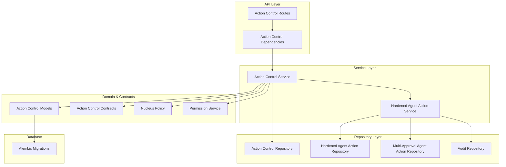
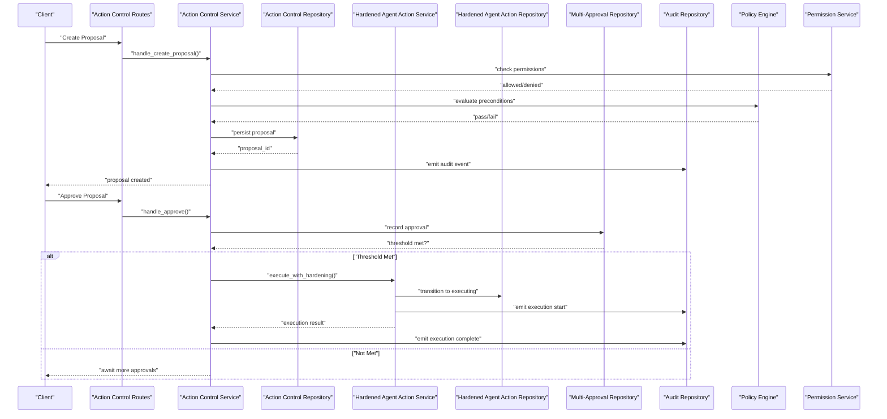
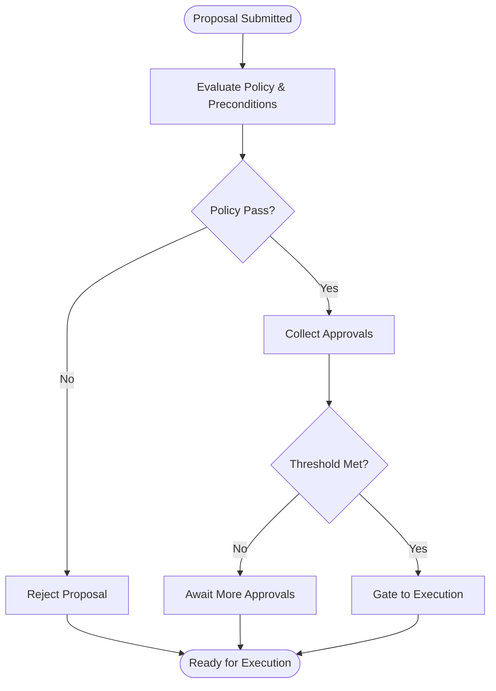
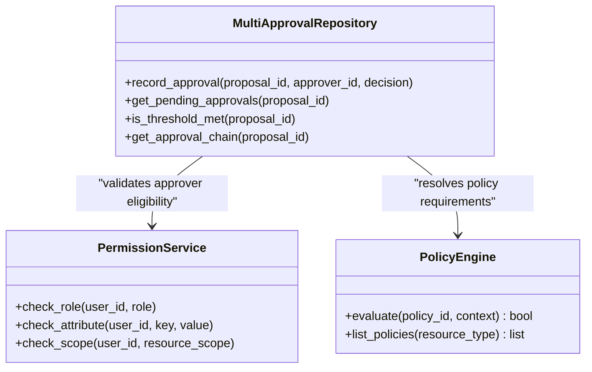
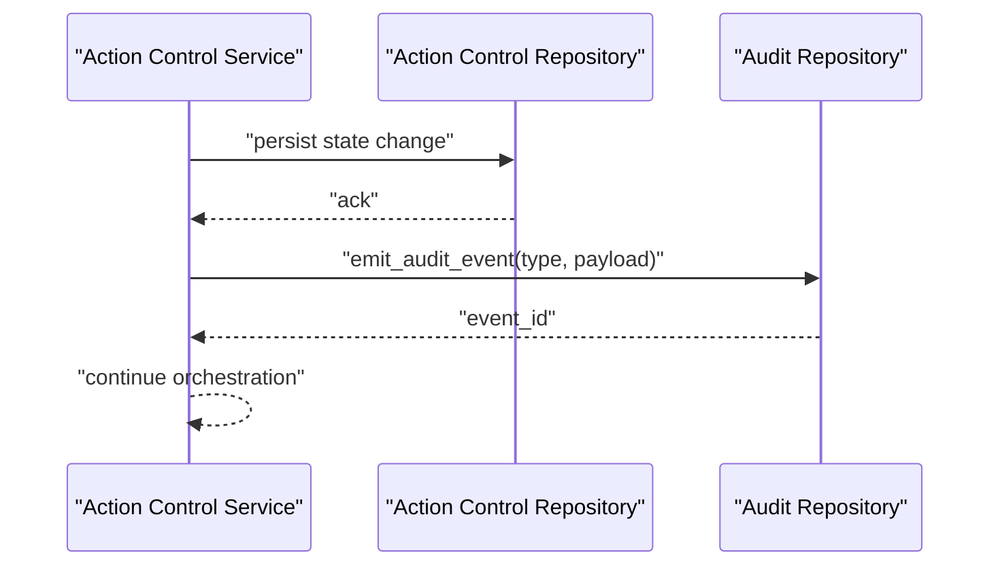
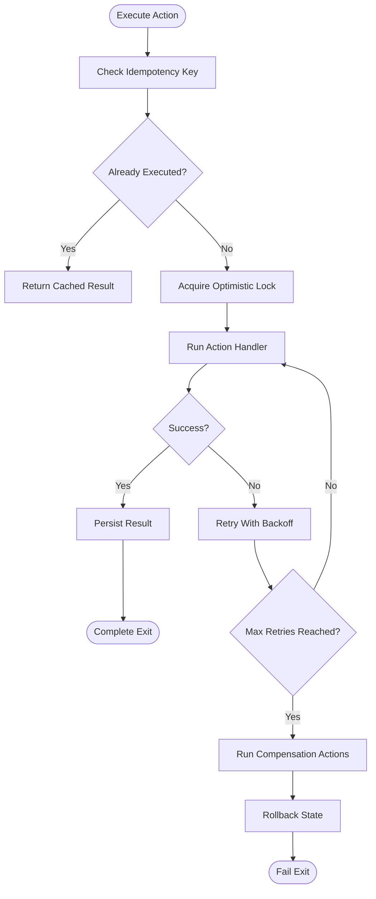
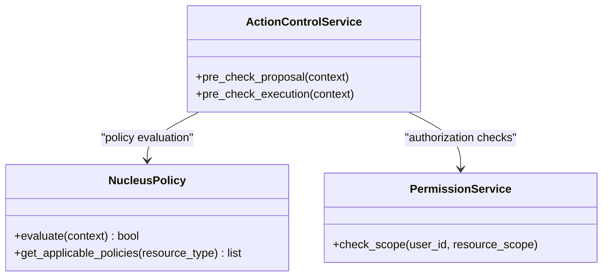
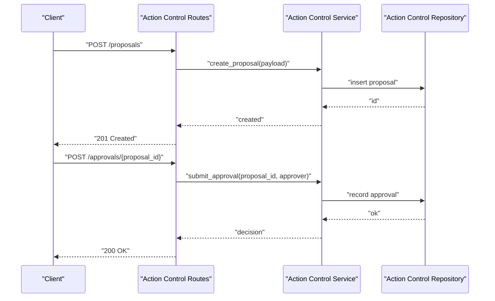
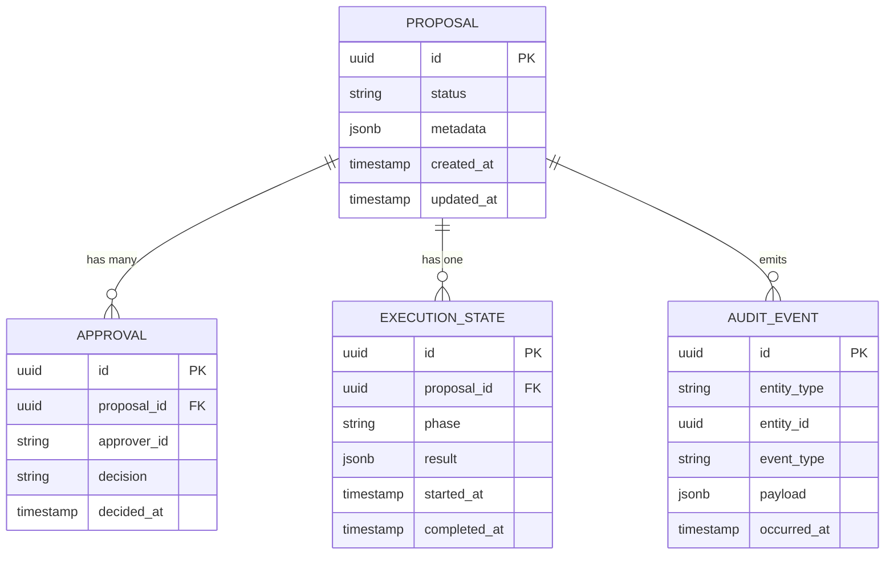
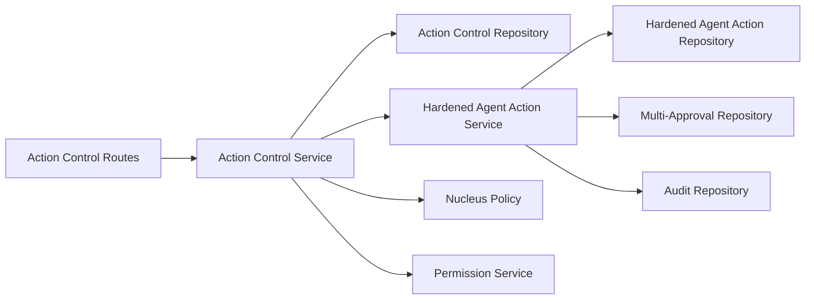

# Action Control Plane

<cite>
**Referenced Files in This Document**
- [GOVERNED_ACTION_CONTROL_PLANE.md](file://docs/GOVERNED_ACTION_CONTROL_PLANE.md)
- [action_control_models.py](file://app/db/action_control_models.py)
- [action_control_repository.py](file://app/repositories/action_control_repository.py)
- [action_control_service.py](file://app/services/action_control_service.py)
- [hardened_agent_action_repository.py](file://app/repositories/hardened_agent_action_repository.py)
- [multi_approval_agent_action_repository.py](file://app/repositories/multi_approval_agent_action_repository.py)
- [hardened_agent_action_service.py](file://app/services/hardened_agent_action_service.py)
- [action_control_routes.py](file://app/api/action_control_routes.py)
- [action_control_dependencies.py](file://app/api/action_control_dependencies.py)
- [action_contracts.py](file://app/agent/action_contracts.py)
- [action_control_contracts.py](file://app/agent/action_control_contracts.py)
- [nucleus_policy.py](file://app/domain/nucleus_policy.py)
- [permission_service.py](file://app/permissions/permission_service.py)
- [audit_repository.py](file://app/repositories/audit_repository.py)
- [0017_governed_action_control_plane.py](file://alembic/versions/0017_governed_action_control_plane.py)
- [0018_replace_local_users.py](file://alembic/versions/0018_replace_local_users.py)
- [0019_conversation_store.py](file://alembic/versions/0019_conversation_store.py)
- [0020_fts_search.py](file://alembic/versions/0020_fts_search.py)
- [0021_context_memory.py](file://alembic/versions/0021_context_memory.py)
- [0022_compaction_overlays.py](file://alembic/versions/0022_compaction_overlays.py)
- [test_multi_approval_and_rollback.py](file://tests/test_multi_approval_and_rollback.py)
- [test_action_control_contract.py](file://tests/test_action_control_contract.py)
- [test_action_control_events.py](file://tests/test_action_control_events.py)
- [test_action_resource_preconditions.py](file://tests/test_action_resource_preconditions.py)
- [test_agent_action_hardening.py](file://tests/test_agent_action_hardening.py)
- [test_agent_action_audit_failure.py](file://tests/test_agent_action_audit_failure.py)
- [test_proposal_authorization_order.py](file://tests/test_proposal_authorization_order.py)
</cite>

## Table of Contents
1. [Introduction](#introduction)
2. [Project Structure](#project-structure)
3. [Core Components](#core-components)
4. [Architecture Overview](#architecture-overview)
5. [Detailed Component Analysis](#detailed-component-analysis)
6. [Dependency Analysis](#dependency-analysis)
7. [Performance Considerations](#performance-considerations)
8. [Troubleshooting Guide](#troubleshooting-guide)
9. [Conclusion](#conclusion)
10. [Appendices](#appendices)

## Introduction
This document describes the governed action control plane system that provides a hardened, auditable, and policy-enforced lifecycle for agent actions. It covers:
- Approval workflow engine with multi-level authorization hierarchies
- Audit trail generation and compliance checking
- Hardened execution with rollback and compensation actions
- Policy enforcement mechanisms and preconditions
- Implementation guides for extending action types, workflows, and policies
- Security considerations, performance implications, and monitoring approaches

The control plane integrates with the broader agent runtime to propose, approve, execute, and reconcile actions while maintaining strong consistency and observability.

## Project Structure
The governed action control plane spans several layers:
- API layer exposes endpoints for proposals, approvals, and execution status
- Service layer orchestrates workflows, approvals, and execution hardening
- Repository layer persists state and audit events
- Domain models define contracts and policy constructs
- Database migrations evolve schema for governance features
- Tests validate end-to-end flows including multi-approval and rollback

**Diagram sources**
- [action_control_routes.py](file://app/api/action_control_routes.py)
- [action_control_dependencies.py](file://app/api/action_control_dependencies.py)
- [action_control_service.py](file://app/services/action_control_service.py)
- [hardened_agent_action_service.py](file://app/services/hardened_agent_action_service.py)
- [action_control_repository.py](file://app/repositories/action_control_repository.py)
- [hardened_agent_action_repository.py](file://app/repositories/hardened_agent_action_repository.py)
- [multi_approval_agent_action_repository.py](file://app/repositories/multi_approval_agent_action_repository.py)
- [audit_repository.py](file://app/repositories/audit_repository.py)
- [action_control_models.py](file://app/db/action_control_models.py)
- [action_control_contracts.py](file://app/agent/action_control_contracts.py)
- [nucleus_policy.py](file://app/domain/nucleus_policy.py)
- [permission_service.py](file://app/permissions/permission_service.py)
- [0017_governed_action_control_plane.py](file://alembic/versions/0017_governed_action_control_plane.py)

**Section sources**
- [GOVERNED_ACTION_CONTROL_PLANE.md](file://docs/GOVERNED_ACTION_CONTROL_PLANE.md)
- [action_control_routes.py](file://app/api/action_control_routes.py)
- [action_control_service.py](file://app/services/action_control_service.py)
- [action_control_models.py](file://app/db/action_control_models.py)
- [0017_governed_action_control_plane.py](file://alembic/versions/0017_governed_action_control_plane.py)

## Core Components
- Action Control Service: Orchestrates proposal creation, approval routing, execution gating, and reconciliation hooks.
- Hardened Agent Action Service: Enforces idempotency, retry/backoff, rollback, and compensation strategies during execution.
- Multi-Approval Repository: Manages hierarchical approvals (e.g., sequential or parallel approvers) and threshold-based decisions.
- Hardened Repository: Provides transactional guarantees, optimistic locking, and state transitions for actions.
- Audit Repository: Persists immutable audit events for compliance and traceability.
- Policy Engine: Evaluates domain policies and resource preconditions before allowing proposals or executions.
- Permission Service: Integrates role/attribute-based checks across organizational boundaries.

Key responsibilities:
- Proposal lifecycle: draft -> pending -> approved -> rejected -> executed -> reconciled
- Approval workflows: configurable hierarchies, delegation, and escalation
- Execution hardening: idempotent handlers, compensating actions, and safe rollbacks
- Compliance: policy checks, preconditions, and audit trails

**Section sources**
- [action_control_service.py](file://app/services/action_control_service.py)
- [hardened_agent_action_service.py](file://app/services/hardened_agent_action_service.py)
- [multi_approval_agent_action_repository.py](file://app/repositories/multi_approval_agent_action_repository.py)
- [hardened_agent_action_repository.py](file://app/repositories/hardened_agent_action_repository.py)
- [audit_repository.py](file://app/repositories/audit_repository.py)
- [nucleus_policy.py](file://app/domain/nucleus_policy.py)
- [permission_service.py](file://app/permissions/permission_service.py)

## Architecture Overview
The control plane enforces a strict separation between orchestration, persistence, and policy evaluation. APIs route requests into services which coordinate repositories and policy checks. All critical state changes are persisted with audit events.

**Diagram sources**
- [action_control_routes.py](file://app/api/action_control_routes.py)
- [action_control_service.py](file://app/services/action_control_service.py)
- [action_control_repository.py](file://app/repositories/action_control_repository.py)
- [hardened_agent_action_service.py](file://app/services/hardened_agent_action_service.py)
- [hardened_agent_action_repository.py](file://app/repositories/hardened_agent_action_repository.py)
- [multi_approval_agent_action_repository.py](file://app/repositories/multi_approval_agent_action_repository.py)
- [audit_repository.py](file://app/repositories/audit_repository.py)
- [nucleus_policy.py](file://app/domain/nucleus_policy.py)
- [permission_service.py](file://app/permissions/permission_service.py)

## Detailed Component Analysis

### Approval Workflow Engine
The approval engine supports multi-level hierarchies and configurable thresholds. It records each approval decision and evaluates whether the required conditions are satisfied to advance the proposal to execution.

**Diagram sources**
- [action_control_service.py](file://app/services/action_control_service.py)
- [multi_approval_agent_action_repository.py](file://app/repositories/multi_approval_agent_action_repository.py)
- [nucleus_policy.py](file://app/domain/nucleus_policy.py)

**Section sources**
- [action_control_service.py](file://app/services/action_control_service.py)
- [multi_approval_agent_action_repository.py](file://app/repositories/multi_approval_agent_action_repository.py)
- [test_proposal_authorization_order.py](file://tests/test_proposal_authorization_order.py)

### Multi-Level Authorization Hierarchies
Hierarchical approvals can be configured per organization or resource scope. The repository tracks approver identity, order constraints, and delegation rules. Decisions are aggregated to determine if the proposal advances.

**Diagram sources**
- [multi_approval_agent_action_repository.py](file://app/repositories/multi_approval_agent_action_repository.py)
- [permission_service.py](file://app/permissions/permission_service.py)
- [nucleus_policy.py](file://app/domain/nucleus_policy.py)

**Section sources**
- [multi_approval_agent_action_repository.py](file://app/repositories/multi_approval_agent_action_repository.py)
- [permission_service.py](file://app/permissions/permission_service.py)
- [test_proposal_authorization_order.py](file://tests/test_proposal_authorization_order.py)

### Audit Trail Generation
All critical operations emit audit events, capturing who did what, when, and why. Events include proposal creation, approval decisions, execution outcomes, and failures.

**Diagram sources**
- [action_control_service.py](file://app/services/action_control_service.py)
- [audit_repository.py](file://app/repositories/audit_repository.py)

**Section sources**
- [audit_repository.py](file://app/repositories/audit_repository.py)
- [test_agent_action_audit_failure.py](file://tests/test_agent_action_audit_failure.py)

### Hardened Action Execution with Rollback and Compensation
Execution is wrapped in a hardened service that ensures idempotency, retries with backoff, and applies compensating actions on failure. State transitions are guarded by optimistic locks to prevent concurrent mutations.

**Diagram sources**
- [hardened_agent_action_service.py](file://app/services/hardened_agent_action_service.py)
- [hardened_agent_action_repository.py](file://app/repositories/hardened_agent_action_repository.py)

**Section sources**
- [hardened_agent_action_service.py](file://app/services/hardened_agent_action_service.py)
- [hardened_agent_action_repository.py](file://app/repositories/hardened_agent_action_repository.py)
- [test_agent_action_hardening.py](file://tests/test_agent_action_hardening.py)

### Policy Enforcement and Compliance Checking
Policies define allowed operations based on user attributes, resource properties, and temporal constraints. Precondition checks gate both proposal creation and execution.

**Diagram sources**
- [nucleus_policy.py](file://app/domain/nucleus_policy.py)
- [action_control_service.py](file://app/services/action_control_service.py)
- [permission_service.py](file://app/permissions/permission_service.py)

**Section sources**
- [nucleus_policy.py](file://app/domain/nucleus_policy.py)
- [test_action_resource_preconditions.py](file://tests/test_action_resource_preconditions.py)

### API Surface and Contracts
The API exposes endpoints for creating proposals, submitting approvals, querying status, and streaming execution updates. Contracts define request/response shapes and event payloads.

**Diagram sources**
- [action_control_routes.py](file://app/api/action_control_routes.py)
- [action_control_service.py](file://app/services/action_control_service.py)
- [action_control_repository.py](file://app/repositories/action_control_repository.py)
- [action_control_contracts.py](file://app/agent/action_control_contracts.py)

**Section sources**
- [action_control_routes.py](file://app/api/action_control_routes.py)
- [action_control_contracts.py](file://app/agent/action_control_contracts.py)
- [test_action_control_contract.py](file://tests/test_action_control_contract.py)
- [test_action_control_events.py](file://tests/test_action_control_events.py)

### Data Model and Schema Evolution
The database schema includes tables for proposals, approvals, execution states, and audit events. Migrations introduce governance features and related indexes.

**Diagram sources**
- [action_control_models.py](file://app/db/action_control_models.py)
- [0017_governed_action_control_plane.py](file://alembic/versions/0017_governed_action_control_plane.py)

**Section sources**
- [action_control_models.py](file://app/db/action_control_models.py)
- [0017_governed_action_control_plane.py](file://alembic/versions/0017_governed_action_control_plane.py)

## Dependency Analysis
The control plane exhibits clear layering and low coupling:
- API depends on service abstractions
- Services depend on repositories and policy engines
- Repositories encapsulate persistence details
- Policies and permissions are independent evaluators

**Diagram sources**
- [action_control_routes.py](file://app/api/action_control_routes.py)
- [action_control_service.py](file://app/services/action_control_service.py)
- [hardened_agent_action_service.py](file://app/services/hardened_agent_action_service.py)
- [action_control_repository.py](file://app/repositories/action_control_repository.py)
- [hardened_agent_action_repository.py](file://app/repositories/hardened_agent_action_repository.py)
- [multi_approval_agent_action_repository.py](file://app/repositories/multi_approval_agent_action_repository.py)
- [audit_repository.py](file://app/repositories/audit_repository.py)
- [nucleus_policy.py](file://app/domain/nucleus_policy.py)
- [permission_service.py](file://app/permissions/permission_service.py)

**Section sources**
- [action_control_routes.py](file://app/api/action_control_routes.py)
- [action_control_service.py](file://app/services/action_control_service.py)
- [hardened_agent_action_service.py](file://app/services/hardened_agent_action_service.py)

## Performance Considerations
- Idempotency keys reduce redundant work and protect against duplicate submissions.
- Optimistic locking prevents contention and reduces lock duration.
- Batched audit writes minimize I/O overhead; consider asynchronous emission if needed.
- Indexes on frequently queried fields (proposal_id, approver_id, status) improve throughput.
- Policy evaluation should be cached where possible to avoid repeated computations.

[No sources needed since this section provides general guidance]

## Troubleshooting Guide
Common issues and diagnostics:
- Approval threshold not met: verify approver eligibility and hierarchy configuration.
- Execution failures: inspect hardened service logs for retry/backoff behavior and compensation actions.
- Audit gaps: ensure audit repository is available and write paths are healthy.
- Policy denials: review policy definitions and precondition contexts.

Operational checks:
- Validate migration state and schema integrity.
- Confirm permission service connectivity and attribute resolution.
- Monitor execution phases and transition anomalies.

**Section sources**
- [test_multi_approval_and_rollback.py](file://tests/test_multi_approval_and_rollback.py)
- [test_agent_action_audit_failure.py](file://tests/test_agent_action_audit_failure.py)
- [test_agent_action_hardening.py](file://tests/test_agent_action_hardening.py)

## Conclusion
The governed action control plane delivers a robust framework for proposing, approving, executing, and auditing actions with strong consistency and compliance. Its layered architecture, hardened execution model, and comprehensive audit trail support secure and reliable operations at scale. Extensibility points allow new action types, custom workflows, and policy rules to be integrated safely.

[No sources needed since this section summarizes without analyzing specific files]

## Appendices

### Implementation Guides

#### Defining New Action Types
- Extend action contracts to describe inputs, outputs, and side effects.
- Register handlers in the action registry and ensure idempotency keys are defined.
- Add preconditions and policy references to gate execution.
- Provide compensation actions for failure recovery.

**Section sources**
- [action_contracts.py](file://app/agent/action_contracts.py)
- [hardened_agent_action_service.py](file://app/services/hardened_agent_action_service.py)

#### Creating Approval Workflows
- Configure approval chains and thresholds via repository interfaces.
- Integrate with permission service to validate approver roles and scopes.
- Use policy engine to enforce contextual constraints (time, resource type).
- Emit audit events for each decision and state change.

**Section sources**
- [multi_approval_agent_action_repository.py](file://app/repositories/multi_approval_agent_action_repository.py)
- [permission_service.py](file://app/permissions/permission_service.py)
- [nucleus_policy.py](file://app/domain/nucleus_policy.py)
- [audit_repository.py](file://app/repositories/audit_repository.py)

#### Implementing Custom Policy Rules
- Define policy evaluators that accept context and return pass/fail.
- Bind policies to resources and actions using policy discovery mechanisms.
- Cache results where appropriate to optimize performance.
- Test policies with representative scenarios and edge cases.

**Section sources**
- [nucleus_policy.py](file://app/domain/nucleus_policy.py)
- [test_action_resource_preconditions.py](file://tests/test_action_resource_preconditions.py)

### Security Considerations
- Enforce least privilege via permission checks at proposal and execution gates.
- Validate all inputs and sanitize payloads to prevent injection.
- Protect sensitive data in audit events and storage.
- Ensure cryptographic integrity of idempotency keys and signatures.

[No sources needed since this section provides general guidance]

### Monitoring Approaches
- Track proposal lifecycle metrics (creation, approval, rejection, execution).
- Monitor execution success rates, retry counts, and compensation invocations.
- Alert on audit write failures and policy evaluation errors.
- Correlate events across services using consistent identifiers.

[No sources needed since this section provides general guidance]