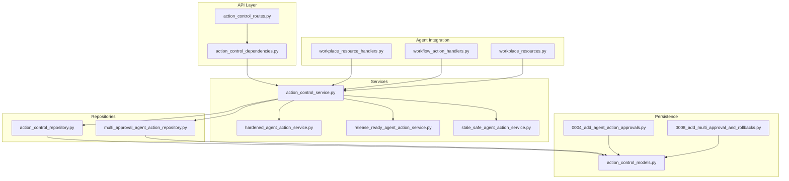
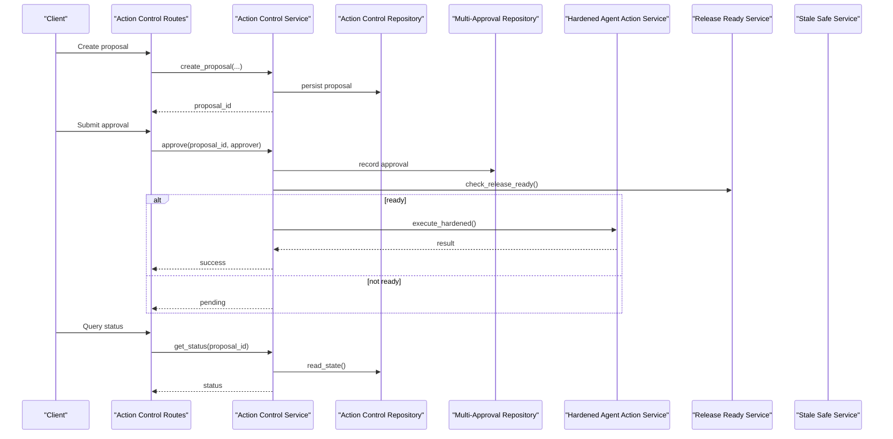
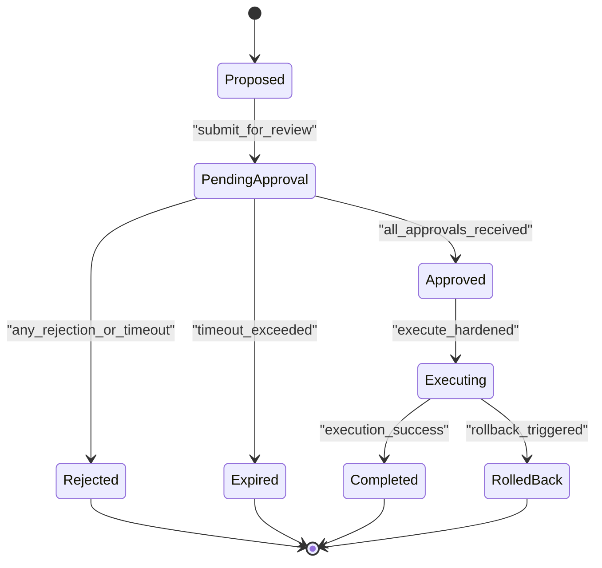
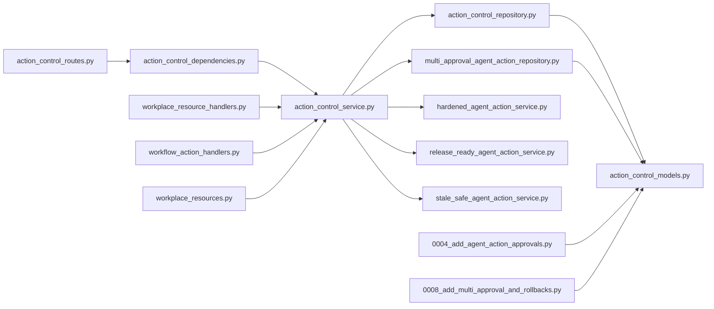

# Approval Workflows

<cite>
**Referenced Files in This Document**
- [WORKPLACE_WORKFLOWS.md](file://docs/WORKPLACE_WORKFLOWS.md)
- [GOVERNED_ACTION_CONTROL_PLANE.md](file://docs/GOVERNED_ACTION_CONTROL_PLANE.md)
- [action_control_models.py](file://app/db/action_control_models.py)
- [action_control_repository.py](file://app/repositories/action_control_repository.py)
- [multi_approval_agent_action_repository.py](file://app/repositories/multi_approval_agent_action_repository.py)
- [action_control_service.py](file://app/services/action_control_service.py)
- [hardened_agent_action_service.py](file://app/services/hardened_agent_action_service.py)
- [release_ready_agent_action_service.py](file://app/services/release_ready_agent_action_service.py)
- [stale_safe_agent_action_service.py](file://app/services/stale_safe_agent_action_service.py)
- [action_control_routes.py](file://app/api/action_control_routes.py)
- [action_control_dependencies.py](file://app/api/action_control_dependencies.py)
- [workplace_resource_handlers.py](file://app/agent/workplace_resource_handlers.py)
- [workflow_action_handlers.py](file://app/agent/workflow_action_handlers.py)
- [workplace_resources.py](file://app/workplace_resources/workflows.py)
- [test_multi_approval_and_rollback.py](file://tests/test_multi_approval_and_rollback.py)
- [test_proposal_authorization_order.py](file://tests/test_proposal_authorization_order.py)
- [0004_add_agent_action_approvals.py](file://alembic/versions/0004_add_agent_action_approvals.py)
- [0008_add_multi_approval_and_rollbacks.py](file://alembic/versions/0008_add_multi_approval_and_rollbacks.py)
</cite>

## Table of Contents
1. [Introduction](#introduction)
2. [Project Structure](#project-structure)
3. [Core Components](#core-components)
4. [Architecture Overview](#architecture-overview)
5. [Detailed Component Analysis](#detailed-component-analysis)
6. [Dependency Analysis](#dependency-analysis)
7. [Performance Considerations](#performance-considerations)
8. [Troubleshooting Guide](#troubleshooting-guide)
9. [Conclusion](#conclusion)
10. [Appendices](#appendices)

## Introduction
This document explains the approval workflow engine that governs how agent actions are proposed, reviewed, and executed with multi-level authorization. It covers:
- Multi-level authorization hierarchies
- Sequential and parallel approval patterns
- Conditional approval routing
- Workflow definition schema and state transitions
- Timeout handling
- Implementation guides for custom workflows, approver roles, and conditional logic
- Versioning and rollback scenarios
- Audit trail integration
- Common patterns such as single-approver, dual-approval, and hierarchical chains

The system is designed to be extensible, auditable, and resilient, enabling safe automation through controlled approvals.

## Project Structure
Approval-related functionality spans repositories, services, API routes, domain models, migrations, tests, and documentation. The key areas include:
- Data models and migrations for action control and approvals
- Repositories implementing multi-approval and hardened execution flows
- Services orchestrating proposal lifecycle, release readiness, and stale-safe behavior
- API endpoints exposing proposal creation, approval, and status queries
- Agent handlers integrating approvals into workplace resources and workflow actions
- Tests validating ordering, concurrency, and rollback behaviors

**Diagram sources**
- [action_control_routes.py](file://app/api/action_control_routes.py)
- [action_control_dependencies.py](file://app/api/action_control_dependencies.py)
- [action_control_service.py](file://app/services/action_control_service.py)
- [hardened_agent_action_service.py](file://app/services/hardened_agent_action_service.py)
- [release_ready_agent_action_service.py](file://app/services/release_ready_agent_action_service.py)
- [stale_safe_agent_action_service.py](file://app/services/stale_safe_agent_action_service.py)
- [action_control_repository.py](file://app/repositories/action_control_repository.py)
- [multi_approval_agent_action_repository.py](file://app/repositories/multi_approval_agent_action_repository.py)
- [workplace_resource_handlers.py](file://app/agent/workplace_resource_handlers.py)
- [workflow_action_handlers.py](file://app/agent/workflow_action_handlers.py)
- [workplace_resources.py](file://app/workplace_resources/workflows.py)
- [action_control_models.py](file://app/db/action_control_models.py)
- [0004_add_agent_action_approvals.py](file://alembic/versions/0004_add_agent_action_approvals.py)
- [0008_add_multi_approval_and_rollbacks.py](file://alembic/versions/0008_add_multi_approval_and_rollbacks.py)

**Section sources**
- [WORKPLACE_WORKFLOWS.md](file://docs/WORKPLACE_WORKFLOWS.md)
- [GOVERNED_ACTION_CONTROL_PLANE.md](file://docs/GOVERNED_ACTION_CONTROL_PLANE.md)

## Core Components
- Action Control Models: Define entities for proposals, approvals, and audit records, including fields for versioning, timestamps, and state.
- Repositories: Persist and query proposal states, track approvals, and enforce constraints.
- Services: Orchestrate proposal lifecycle, evaluate release readiness, harden execution, and handle staleness.
- API Routes: Expose endpoints for creating proposals, submitting approvals, querying status, and managing rollbacks.
- Agent Handlers: Integrate approvals into workplace resource operations and workflow actions.
- Migrations: Evolve schema to support approvals, multi-approval, and rollback capabilities.

Key responsibilities:
- Proposal creation and validation
- Approver resolution and role-based eligibility
- Sequential and parallel approval orchestration
- Conditional routing based on policy or context
- Timeout enforcement and expiration handling
- Versioned workflow definitions and rollback strategies
- Comprehensive audit logging

**Section sources**
- [action_control_models.py](file://app/db/action_control_models.py)
- [action_control_repository.py](file://app/repositories/action_control_repository.py)
- [multi_approval_agent_action_repository.py](file://app/repositories/multi_approval_agent_action_repository.py)
- [action_control_service.py](file://app/services/action_control_service.py)
- [hardened_agent_action_service.py](file://app/services/hardened_agent_action_service.py)
- [release_ready_agent_action_service.py](file://app/services/release_ready_agent_action_service.py)
- [stale_safe_agent_action_service.py](file://app/services/stale_safe_agent_action_service.py)
- [action_control_routes.py](file://app/api/action_control_routes.py)
- [workplace_resource_handlers.py](file://app/agent/workplace_resource_handlers.py)
- [workflow_action_handlers.py](file://app/agent/workflow_action_handlers.py)
- [workplace_resources.py](file://app/workplace_resources/workflows.py)
- [0004_add_agent_action_approvals.py](file://alembic/versions/0004_add_agent_action_approvals.py)
- [0008_add_multi_approval_and_rollbacks.py](file://alembic/versions/0008_add_multi_approval_and_rollbacks.py)

## Architecture Overview
The approval workflow engine follows a layered architecture:
- API layer exposes REST endpoints for proposal and approval operations.
- Service layer implements business logic for workflow orchestration, including sequencing, parallelism, conditionals, timeouts, and versioning.
- Repository layer persists state and supports concurrent updates safely.
- Agent integration hooks allow workplace resources and workflow actions to trigger and observe approvals.
- Migrations evolve the data model to support advanced features like multi-approval and rollback.

**Diagram sources**
- [action_control_routes.py](file://app/api/action_control_routes.py)
- [action_control_service.py](file://app/services/action_control_service.py)
- [action_control_repository.py](file://app/repositories/action_control_repository.py)
- [multi_approval_agent_action_repository.py](file://app/repositories/multi_approval_agent_action_repository.py)
- [hardened_agent_action_service.py](file://app/services/hardened_agent_action_service.py)
- [release_ready_agent_action_service.py](file://app/services/release_ready_agent_action_service.py)

## Detailed Component Analysis

### Workflow Definition Schema
The workflow definition describes:
- Steps (sequential or parallel)
- Approvers per step (roles, users, or dynamic resolvers)
- Conditions for routing between steps
- Timeouts and escalation rules
- Version identifiers for evolution and rollback

Implementation guidance:
- Use versioned schemas to define new workflows without breaking existing proposals.
- Include explicit timeout durations per step and global proposal timeouts.
- Provide default approver policies and override mechanisms for specific contexts.

**Section sources**
- [WORKPLACE_WORKFLOWS.md](file://docs/WORKPLACE_WORKFLOWS.md)
- [action_control_models.py](file://app/db/action_control_models.py)

### State Transitions and Lifecycle
Proposals transition through states such as:
- Draft/Proposed
- Pending Approval (single or multiple)
- Approved
- Executing
- Completed
- Rejected
- Rolled Back
- Expired (timeout)

Transitions are enforced by services and repositories to ensure consistency and prevent invalid jumps.

**Diagram sources**
- [action_control_service.py](file://app/services/action_control_service.py)
- [hardened_agent_action_service.py](file://app/services/hardened_agent_action_service.py)
- [release_ready_agent_action_service.py](file://app/services/release_ready_agent_action_service.py)
- [stale_safe_agent_action_service.py](file://app/services/stale_safe_agent_action_service.py)

**Section sources**
- [action_control_service.py](file://app/services/action_control_service.py)
- [hardened_agent_action_service.py](file://app/services/hardened_agent_action_service.py)
- [release_ready_agent_action_service.py](file://app/services/release_ready_agent_action_service.py)
- [stale_safe_agent_action_service.py](file://app/services/stale_safe_agent_action_service.py)

### Multi-Level Authorization Hierarchies
Hierarchical approvals can be modeled as ordered steps where each step requires an approver from a specific role or level. The engine resolves eligible approvers based on organizational context and user roles.

Guidance:
- Define hierarchy levels in the workflow schema.
- Map roles to approver sets at each level.
- Enforce order so higher-level approvals cannot precede lower-level ones.

**Section sources**
- [WORKPLACE_WORKFLOWS.md](file://docs/WORKPLACE_WORKFLOWS.md)
- [action_control_service.py](file://app/services/action_control_service.py)

### Sequential and Parallel Approval Patterns
- Sequential: Each step must complete before the next begins.
- Parallel: Multiple approvers can approve simultaneously; completion criteria determine when the step is satisfied (e.g., all vs. any).

Implementation notes:
- Use the multi-approval repository to track individual approvals and aggregate results.
- Configure thresholds per step to support “any” or “all” semantics.

**Section sources**
- [multi_approval_agent_action_repository.py](file://app/repositories/multi_approval_agent_action_repository.py)
- [action_control_service.py](file://app/services/action_control_service.py)

### Conditional Approval Routing
Conditional routing allows different paths based on:
- Resource type or sensitivity
- Requester role or department
- Risk score or preconditions
- External policy decisions

Guidance:
- Express conditions in the workflow schema using predicates evaluated at runtime.
- Ensure conditions are deterministic and auditable.

**Section sources**
- [WORKPLACE_WORKFLOWS.md](file://docs/WORKPLACE_WORKFLOWS.md)
- [action_control_service.py](file://app/services/action_control_service.py)

### Timeout Handling
Timeouts apply at both step and proposal levels:
- Step timeout: If not completed within duration, the step may escalate or reject.
- Proposal timeout: If overall time exceeds limit, the proposal expires.

Recommendations:
- Record timeout events in the audit trail.
- Provide configurable escalation rules.
- Surface expiry status via status queries.

**Section sources**
- [action_control_service.py](file://app/services/action_control_service.py)
- [action_control_models.py](file://app/db/action_control_models.py)

### Versioning and Rollback Scenarios
Versioning ensures backward compatibility:
- Each workflow definition carries a version identifier.
- Proposals bind to a specific version at creation time.
- New versions can introduce changes without affecting in-flight proposals.

Rollback strategies:
- Trigger rollback after execution if post-execution checks fail.
- Support partial rollbacks where applicable.
- Maintain immutable audit records for every change.

**Section sources**
- [action_control_models.py](file://app/db/action_control_models.py)
- [hardened_agent_action_service.py](file://app/services/hardened_agent_action_service.py)
- [0008_add_multi_approval_and_rollbacks.py](file://alembic/versions/0008_add_multi_approval_and_rollbacks.py)

### Audit Trail Integration
Every significant event is recorded:
- Proposal creation and updates
- Approvals and rejections
- Execution attempts and outcomes
- Rollbacks and expirations
- Policy evaluations and condition results

Ensure:
- Immutable logs with timestamps and actor identities.
- Correlation IDs linking related events across components.

**Section sources**
- [action_control_models.py](file://app/db/action_control_models.py)
- [action_control_repository.py](file://app/repositories/action_control_repository.py)

### Implementation Guides

#### Creating Custom Approval Workflows
Steps:
- Define a versioned workflow schema with steps, approvers, conditions, and timeouts.
- Register the workflow with the service layer.
- Bind proposals to the desired workflow version.

Best practices:
- Keep conditions simple and testable.
- Prefer role-based approver sets over hardcoded users.
- Document escalation and fallback behaviors.

**Section sources**
- [WORKPLACE_WORKFLOWS.md](file://docs/WORKPLACE_WORKFLOWS.md)
- [action_control_service.py](file://app/services/action_control_service.py)

#### Defining Approver Roles
Approver roles should map to organizational units:
- Role-to-user mapping resolved at runtime.
- Hierarchical roles supporting multi-level approvals.
- Dynamic resolvers for context-sensitive approver selection.

**Section sources**
- [WORKPLACE_WORKFLOWS.md](file://docs/WORKPLACE_WORKFLOWS.md)
- [action_control_service.py](file://app/services/action_control_service.py)

#### Implementing Conditional Logic
Conditions can be expressed as:
- Boolean predicates over request attributes.
- Precondition checks against resource state.
- External policy evaluation results.

Guidance:
- Validate conditions during workflow parsing.
- Log condition outcomes for auditability.

**Section sources**
- [WORKPLACE_WORKFLOWS.md](file://docs/WORKPLACE_WORKFLOWS.md)
- [action_control_service.py](file://app/services/action_control_service.py)

### Common Approval Patterns

#### Single-Approver Pattern
- One designated approver per proposal.
- Fast path to execution upon approval.
- Suitable for low-risk operations.

**Section sources**
- [action_control_service.py](file://app/services/action_control_service.py)
- [multi_approval_agent_action_repository.py](file://app/repositories/multi_approval_agent_action_repository.py)

#### Dual-Approval Pattern
- Two independent approvers required.
- Supports parallel submission and aggregation.
- Reduces risk of unilateral decisions.

**Section sources**
- [multi_approval_agent_action_repository.py](file://app/repositories/multi_approval_agent_action_repository.py)
- [action_control_service.py](file://app/services/action_control_service.py)

#### Hierarchical Approval Chain
- Ordered steps representing authority levels.
- Lower-level approvals must precede higher-level ones.
- Enables governance and compliance requirements.

**Section sources**
- [WORKPLACE_WORKFLOWS.md](file://docs/WORKPLACE_WORKFLOWS.md)
- [action_control_service.py](file://app/services/action_control_service.py)

## Dependency Analysis
The approval engine depends on:
- API routes for external interactions
- Services for orchestration and policy evaluation
- Repositories for persistence and concurrency control
- Agent handlers for integration with workplace resources
- Migrations for schema evolution

**Diagram sources**
- [action_control_routes.py](file://app/api/action_control_routes.py)
- [action_control_dependencies.py](file://app/api/action_control_dependencies.py)
- [action_control_service.py](file://app/services/action_control_service.py)
- [action_control_repository.py](file://app/repositories/action_control_repository.py)
- [multi_approval_agent_action_repository.py](file://app/repositories/multi_approval_agent_action_repository.py)
- [hardened_agent_action_service.py](file://app/services/hardened_agent_action_service.py)
- [release_ready_agent_action_service.py](file://app/services/release_ready_agent_action_service.py)
- [stale_safe_agent_action_service.py](file://app/services/stale_safe_agent_action_service.py)
- [workplace_resource_handlers.py](file://app/agent/workplace_resource_handlers.py)
- [workflow_action_handlers.py](file://app/agent/workflow_action_handlers.py)
- [workplace_resources.py](file://app/workplace_resources/workflows.py)
- [action_control_models.py](file://app/db/action_control_models.py)
- [0004_add_agent_action_approvals.py](file://alembic/versions/0004_add_agent_action_approvals.py)
- [0008_add_multi_approval_and_rollbacks.py](file://alembic/versions/0008_add_multi_approval_and_rollbacks.py)

**Section sources**
- [action_control_routes.py](file://app/api/action_control_routes.py)
- [action_control_service.py](file://app/services/action_control_service.py)
- [action_control_repository.py](file://app/repositories/action_control_repository.py)
- [multi_approval_agent_action_repository.py](file://app/repositories/multi_approval_agent_action_repository.py)
- [hardened_agent_action_service.py](file://app/services/hardened_agent_action_service.py)
- [release_ready_agent_action_service.py](file://app/services/release_ready_agent_action_service.py)
- [stale_safe_agent_action_service.py](file://app/services/stale_safe_agent_action_service.py)
- [workplace_resource_handlers.py](file://app/agent/workplace_resource_handlers.py)
- [workflow_action_handlers.py](file://app/agent/workflow_action_handlers.py)
- [workplace_resources.py](file://app/workplace_resources/workflows.py)
- [action_control_models.py](file://app/db/action_control_models.py)
- [0004_add_agent_action_approvals.py](file://alembic/versions/0004_add_agent_action_approvals.py)
- [0008_add_multi_approval_and_rollbacks.py](file://alembic/versions/0008_add_multi_approval_and_rollbacks.py)

## Performance Considerations
- Concurrency: Use optimistic locking or atomic updates in repositories to avoid race conditions during approvals.
- Batch operations: Aggregate approval checks to reduce database round-trips.
- Caching: Cache approver role mappings and policy results where appropriate, with invalidation on changes.
- Timeouts: Implement background workers to expire proposals and escalate steps efficiently.
- Indexing: Ensure indexes on proposal IDs, approver IDs, and timestamps for fast queries.

[No sources needed since this section provides general guidance]

## Troubleshooting Guide
Common issues and resolutions:
- Duplicate approvals: Verify repository constraints and idempotency keys.
- Missing approver: Check role mappings and organizational context.
- Stale proposals: Inspect timeout configurations and background job health.
- Rollback failures: Review hardened execution logs and post-check conditions.
- Ordering violations: Confirm sequential step enforcement and dependency resolution.

Validation references:
- Multi-approval and rollback behaviors
- Proposal authorization ordering

**Section sources**
- [test_multi_approval_and_rollback.py](file://tests/test_multi_approval_and_rollback.py)
- [test_proposal_authorization_order.py](file://tests/test_proposal_authorization_order.py)

## Conclusion
The approval workflow engine provides a robust foundation for governed automation. By combining versioned workflow definitions, flexible approval patterns, conditional routing, and comprehensive auditing, it enables secure and compliant operations. Extensibility points allow organizations to tailor approvals to their governance needs while maintaining reliability and performance.

[No sources needed since this section summarizes without analyzing specific files]

## Appendices

### API Endpoints Overview
- Create proposal: Initiates a new workflow instance bound to a specific version.
- Submit approval: Records an approver’s decision and evaluates release readiness.
- Query status: Returns current state, approvals, and audit highlights.
- Rollback: Triggers rollback procedures for failed executions.

**Section sources**
- [action_control_routes.py](file://app/api/action_control_routes.py)
- [action_control_dependencies.py](file://app/api/action_control_dependencies.py)

### Migration Highlights
- Initial approvals support added to models and repositories.
- Multi-approval and rollback capabilities introduced with schema evolution.

**Section sources**
- [0004_add_agent_action_approvals.py](file://alembic/versions/0004_add_agent_action_approvals.py)
- [0008_add_multi_approval_and_rollbacks.py](file://alembic/versions/0008_add_multi_approval_and_rollbacks.py)