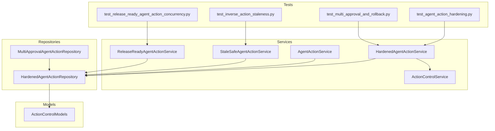
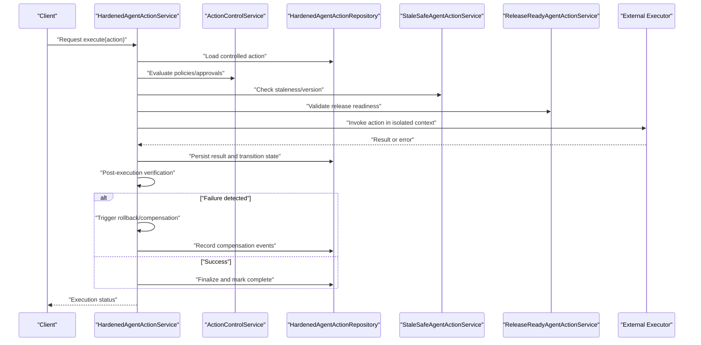
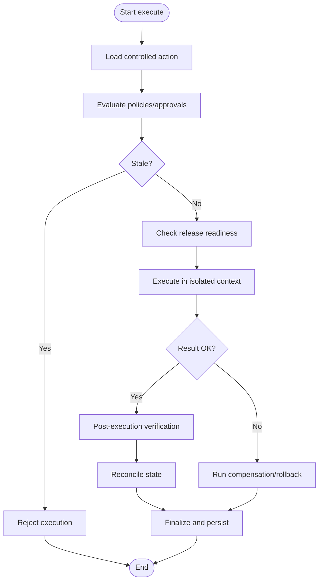
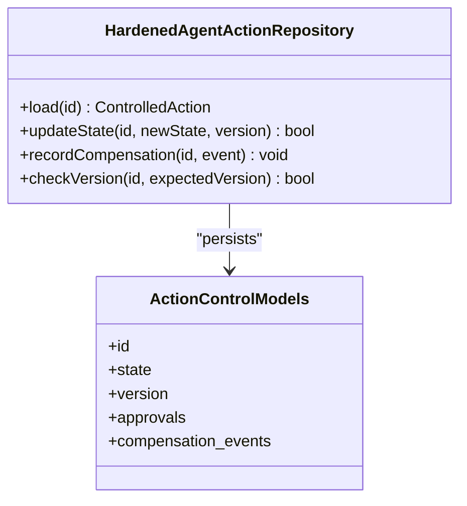
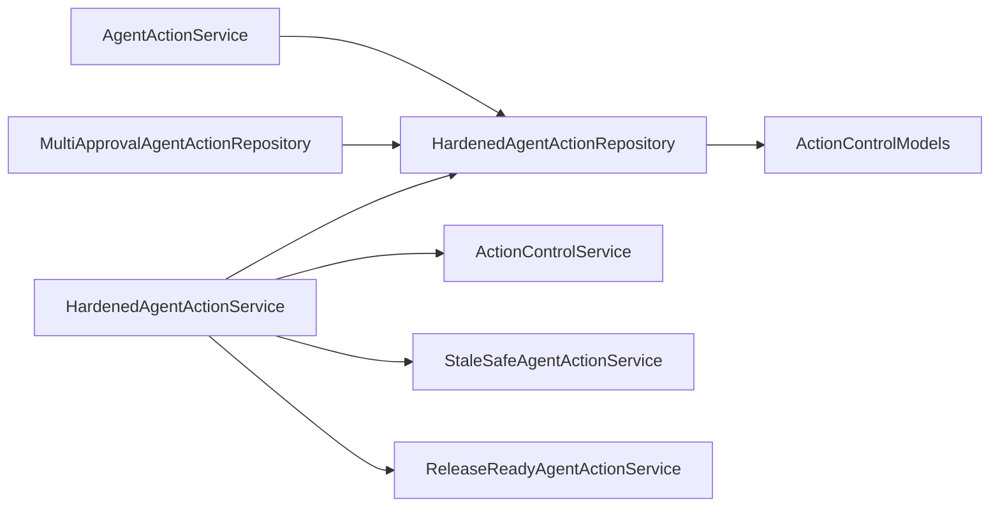

# Execution Hardening & Rollback

<cite>
**Referenced Files in This Document**
- [hardened_agent_action_service.py](file://app/services/hardened_agent_action_service.py)
- [hardened_agent_action_repository.py](file://app/repositories/hardened_agent_action_repository.py)
- [action_control_service.py](file://app/services/action_control_service.py)
- [action_control_models.py](file://app/db/action_control_models.py)
- [agent_action_service.py](file://app/services/agent_action_service.py)
- [stale_safe_agent_action_service.py](file://app/services/stale_safe_agent_action_service.py)
- [release_ready_agent_action_service.py](file://app/services/release_ready_agent_action_service.py)
- [multi_approval_agent_action_repository.py](file://app/repositories/multi_approval_agent_action_repository.py)
- [test_agent_action_hardening.py](file://tests/test_agent_action_hardening.py)
- [test_multi_approval_and_rollback.py](file://tests/test_multi_approval_and_rollback.py)
- [test_inverse_action_staleness.py](file://tests/test_inverse_action_staleness.py)
- [test_release_ready_agent_action_concurrency.py](file://tests/test_release_ready_agent_action_concurrency.py)
- [GOVERNED_ACTION_CONTROL_PLANE.md](file://docs/GOVERNED_ACTION_CONTROL_PLANE.md)
</cite>

## Table of Contents
1. [Introduction](#introduction)
2. [Project Structure](#project-structure)
3. [Core Components](#core-components)
4. [Architecture Overview](#architecture-overview)
5. [Detailed Component Analysis](#detailed-component-analysis)
6. [Dependency Analysis](#dependency-analysis)
7. [Performance Considerations](#performance-considerations)
8. [Troubleshooting Guide](#troubleshooting-guide)
9. [Conclusion](#conclusion)
10. [Appendices](#appendices)

## Introduction
This document explains the hardened action execution system with a focus on:
- Execution isolation and pre-execution validation
- Post-execution verification and reconciliation
- Rollback and compensation frameworks, including automatic triggers and manual intervention points
- Stale action detection, release readiness checks, and concurrency control
- Implementation guidance for defining compensation actions, custom hardening rules, and handling partial failures
- Monitoring execution health, performance impact analysis, and troubleshooting

The system enforces strict lifecycle governance over agent actions to ensure safe, auditable, and recoverable operations across distributed components.

## Project Structure
The hardened execution surface spans services, repositories, domain models, and tests. Key areas include:
- Service layer orchestrating hardening, approvals, staleness, and release readiness
- Repository layer enforcing state transitions and concurrency constraints
- Domain models capturing controlled action states and relationships
- Tests validating hardening behaviors, rollback flows, staleness detection, and concurrency

**Diagram sources**
- [hardened_agent_action_service.py](file://app/services/hardened_agent_action_service.py)
- [hardened_agent_action_repository.py](file://app/repositories/hardened_agent_action_repository.py)
- [action_control_service.py](file://app/services/action_control_service.py)
- [action_control_models.py](file://app/db/action_control_models.py)
- [agent_action_service.py](file://app/services/agent_action_service.py)
- [stale_safe_agent_action_service.py](file://app/services/stale_safe_agent_action_service.py)
- [release_ready_agent_action_service.py](file://app/services/release_ready_agent_action_service.py)
- [multi_approval_agent_action_repository.py](file://app/repositories/multi_approval_agent_action_repository.py)
- [test_agent_action_hardening.py](file://tests/test_agent_action_hardening.py)
- [test_multi_approval_and_rollback.py](file://tests/test_multi_approval_and_rollback.py)
- [test_inverse_action_staleness.py](file://tests/test_inverse_action_staleness.py)
- [test_release_ready_agent_action_concurrency.py](file://tests/test_release_ready_agent_action_concurrency.py)

**Section sources**
- [hardened_agent_action_service.py](file://app/services/hardened_agent_action_service.py)
- [hardened_agent_action_repository.py](file://app/repositories/hardened_agent_action_repository.py)
- [action_control_service.py](file://app/services/action_control_service.py)
- [action_control_models.py](file://app/db/action_control_models.py)
- [agent_action_service.py](file://app/services/agent_action_service.py)
- [stale_safe_agent_action_service.py](file://app/services/stale_safe_agent_action_service.py)
- [release_ready_agent_action_service.py](file://app/services/release_ready_agent_action_service.py)
- [multi_approval_agent_action_repository.py](file://app/repositories/multi_approval_agent_action_repository.py)
- [test_agent_action_hardening.py](file://tests/test_agent_action_hardening.py)
- [test_multi_approval_and_rollback.py](file://tests/test_multi_approval_and_rollback.py)
- [test_inverse_action_staleness.py](file://tests/test_inverse_action_staleness.py)
- [test_release_ready_agent_action_concurrency.py](file://tests/test_release_ready_agent_action_concurrency.py)

## Core Components
- HardenedAgentActionService: Central orchestrator for preflight validation, isolated execution, post-execution verification, and rollback/compensation orchestration. It coordinates approvals, staleness checks, and release readiness before committing changes.
- HardenedAgentActionRepository: Enforces state machine transitions, concurrency guards (e.g., optimistic locking), and persistence of controlled action artifacts.
- ActionControlService: Provides higher-level control plane capabilities such as approval workflows, policy evaluation, and auditability hooks.
- StaleSafeAgentActionService: Detects stale proposals/actions by comparing versioning or timestamps against current state to prevent unsafe execution.
- ReleaseReadyAgentActionService: Validates that all preconditions are satisfied before releasing an action for execution.
- MultiApprovalAgentActionRepository: Supports multi-approval gating and ensures consistent state updates under concurrent access.

Key responsibilities:
- Pre-execution validation: authorization, policy checks, resource preconditions, staleness detection, and release readiness
- Isolated execution: sandboxed invocation with bounded resources and clear boundaries
- Post-execution verification: outcome validation, reconciliation, and idempotency enforcement
- Rollback/compensation: automatic rollback on failure, compensating actions for partial success, and manual override points

**Section sources**
- [hardened_agent_action_service.py](file://app/services/hardened_agent_action_service.py)
- [hardened_agent_action_repository.py](file://app/repositories/hardened_agent_action_repository.py)
- [action_control_service.py](file://app/services/action_control_service.py)
- [stale_safe_agent_action_service.py](file://app/services/stale_safe_agent_action_service.py)
- [release_ready_agent_action_service.py](file://app/services/release_ready_agent_action_service.py)
- [multi_approval_agent_action_repository.py](file://app/repositories/multi_approval_agent_action_repository.py)

## Architecture Overview
The hardened execution pipeline integrates multiple stages to ensure safety and consistency:

**Diagram sources**
- [hardened_agent_action_service.py](file://app/services/hardened_agent_action_service.py)
- [action_control_service.py](file://app/services/action_control_service.py)
- [hardened_agent_action_repository.py](file://app/repositories/hardened_agent_action_repository.py)
- [stale_safe_agent_action_service.py](file://app/services/stale_safe_agent_action_service.py)
- [release_ready_agent_action_service.py](file://app/services/release_ready_agent_action_service.py)

## Detailed Component Analysis

### Hardened Agent Action Service
Responsibilities:
- Orchestrate preflight validations (authorization, policy, staleness, readiness)
- Execute actions within an isolated runtime boundary
- Perform post-execution verification and reconcile outcomes
- Manage rollback and compensation flows, including automatic triggers and manual intervention points

Key behaviors:
- Preflight: loads controlled action, evaluates approvals via control service, checks staleness, validates release readiness
- Execution: invokes external executor with isolation guarantees; captures results and errors
- Post-check: verifies expected side effects, runs reconciliation, and enforces idempotency
- Rollback/Compensation: on failure or inconsistency, executes compensating actions; supports manual overrides when necessary

**Diagram sources**
- [hardened_agent_action_service.py](file://app/services/hardened_agent_action_service.py)

**Section sources**
- [hardened_agent_action_service.py](file://app/services/hardened_agent_action_service.py)
- [test_agent_action_hardening.py](file://tests/test_agent_action_hardening.py)
- [test_multi_approval_and_rollback.py](file://tests/test_multi_approval_and_rollback.py)

### Hardened Agent Action Repository
Responsibilities:
- Persist controlled action entities and related artifacts
- Enforce state transitions and concurrency controls (optimistic locking/versioning)
- Provide query surfaces for approvals, staleness, and readiness checks

Concurrency model:
- Uses version fields or timestamps to detect conflicts
- Applies conditional updates to prevent lost updates during concurrent approvals or rollbacks

**Diagram sources**
- [hardened_agent_action_repository.py](file://app/repositories/hardened_agent_action_repository.py)
- [action_control_models.py](file://app/db/action_control_models.py)

**Section sources**
- [hardened_agent_action_repository.py](file://app/repositories/hardened_agent_action_repository.py)
- [action_control_models.py](file://app/db/action_control_models.py)

### Action Control Service
Responsibilities:
- Implement control plane features such as approval workflows, policy evaluation, and audit hooks
- Coordinate with repositories to record decisions and enforce governance rules

Integration points:
- Called by the hardened service during preflight
- Used by multi-approval repository to aggregate approvals and gate releases

**Section sources**
- [action_control_service.py](file://app/services/action_control_service.py)
- [multi_approval_agent_action_repository.py](file://app/repositories/multi_approval_agent_action_repository.py)

### Stale Safe Agent Action Service
Responsibilities:
- Detect stale proposals/actions by comparing versions/timestamps against current state
- Prevent execution if the underlying context has changed since proposal creation

Validation flow:
- Loads latest state
- Compares proposal metadata with current state
- Returns staleness decision used by the hardened service

**Section sources**
- [stale_safe_agent_action_service.py](file://app/services/stale_safe_agent_action_service.py)
- [test_inverse_action_staleness.py](file://tests/test_inverse_action_staleness.py)

### Release Ready Agent Action Service
Responsibilities:
- Validate that all preconditions are met before releasing an action for execution
- Ensure approvals, policies, and resource constraints are satisfied

Concurrency considerations:
- Guards against race conditions between readiness checks and concurrent updates
- Integrates with multi-approval repository to confirm finality

**Section sources**
- [release_ready_agent_action_service.py](file://app/services/release_ready_agent_action_service.py)
- [test_release_ready_agent_action_concurrency.py](file://tests/test_release_ready_agent_action_concurrency.py)

### Multi-Approval Agent Action Repository
Responsibilities:
- Support multi-approval gating and consistent state updates
- Ensure atomic transitions when aggregating approvals and releasing actions

Concurrency model:
- Uses optimistic locking to avoid inconsistent approval aggregation
- Records approval history for auditability

**Section sources**
- [multi_approval_agent_action_repository.py](file://app/repositories/multi_approval_agent_action_repository.py)

## Dependency Analysis
The hardened execution system exhibits layered dependencies:
- Services depend on repositories for persistence and state transitions
- Repositories depend on domain models for schema and constraints
- Tests validate cross-cutting concerns like hardening, rollback, staleness, and concurrency

**Diagram sources**
- [hardened_agent_action_service.py](file://app/services/hardened_agent_action_service.py)
- [hardened_agent_action_repository.py](file://app/repositories/hardened_agent_action_repository.py)
- [action_control_service.py](file://app/services/action_control_service.py)
- [agent_action_service.py](file://app/services/agent_action_service.py)
- [stale_safe_agent_action_service.py](file://app/services/stale_safe_agent_action_service.py)
- [release_ready_agent_action_service.py](file://app/services/release_ready_agent_action_service.py)
- [multi_approval_agent_action_repository.py](file://app/repositories/multi_approval_agent_action_repository.py)
- [action_control_models.py](file://app/db/action_control_models.py)

**Section sources**
- [hardened_agent_action_service.py](file://app/services/hardened_agent_action_service.py)
- [hardened_agent_action_repository.py](file://app/repositories/hardened_agent_action_repository.py)
- [action_control_service.py](file://app/services/action_control_service.py)
- [agent_action_service.py](file://app/services/agent_action_service.py)
- [stale_safe_agent_action_service.py](file://app/services/stale_safe_agent_action_service.py)
- [release_ready_agent_action_service.py](file://app/services/release_ready_agent_action_service.py)
- [multi_approval_agent_action_repository.py](file://app/repositories/multi_approval_agent_action_repository.py)
- [action_control_models.py](file://app/db/action_control_models.py)

## Performance Considerations
- Optimistic locking reduces contention but may increase retry rates under high concurrency; tune backoff strategies accordingly
- Pre-execution checks (policies, approvals, staleness, readiness) add latency; consider caching stable data where safe
- Compensation and rollback operations should be idempotent and efficient; batch updates where possible
- Post-execution verification can be expensive; use targeted reconciliation and incremental checks
- Monitor database lock waits and transaction durations to identify bottlenecks

[No sources needed since this section provides general guidance]

## Troubleshooting Guide
Common issues and diagnostics:
- Stale action rejections: verify version comparisons and ensure clients refresh proposals after state changes
- Approval deadlocks: check multi-approval repository logs for conflicting updates and ensure atomic transitions
- Rollback failures: inspect compensation event records and ensure compensating actions are idempotent
- Concurrency conflicts: analyze optimistic lock failures and adjust retry/backoff parameters
- Partial successes: run reconciliation routines to align persisted state with actual outcomes

Operational checks:
- Inspect controlled action state transitions and approval histories
- Review compensation events and their outcomes
- Validate release readiness prerequisites and policy evaluations

**Section sources**
- [test_agent_action_hardening.py](file://tests/test_agent_action_hardening.py)
- [test_multi_approval_and_rollback.py](file://tests/test_multi_approval_and_rollback.py)
- [test_inverse_action_staleness.py](file://tests/test_inverse_action_staleness.py)
- [test_release_ready_agent_action_concurrency.py](file://tests/test_release_ready_agent_action_concurrency.py)

## Conclusion
The hardened action execution system provides robust safeguards through pre-execution validation, isolated execution, post-execution verification, and comprehensive rollback/compensation mechanisms. Staleness detection, release readiness checks, and concurrency controls ensure safe operation under dynamic conditions. By following the implementation guides and monitoring recommendations, teams can define reliable compensation actions, extend hardening rules, and maintain healthy execution pipelines.

[No sources needed since this section summarizes without analyzing specific files]

## Appendices

### Implementation Guides

#### Defining Compensation Actions
- Identify side effects of primary actions and design inverse operations that restore prior state
- Ensure compensation actions are idempotent and safe to retry
- Record compensation events with sufficient context for auditing and debugging
- Integrate compensation triggers into the hardened service’s failure path

**Section sources**
- [hardened_agent_action_service.py](file://app/services/hardened_agent_action_service.py)
- [hardened_agent_action_repository.py](file://app/repositories/hardened_agent_action_repository.py)

#### Implementing Custom Hardening Rules
- Extend policy evaluation logic in the control service to incorporate new constraints
- Add preconditions checked by the release readiness service
- Update staleness detection criteria in the stale-safe service as needed
- Validate rule behavior using targeted tests covering edge cases and concurrency

**Section sources**
- [action_control_service.py](file://app/services/action_control_service.py)
- [release_ready_agent_action_service.py](file://app/services/release_ready_agent_action_service.py)
- [stale_safe_agent_action_service.py](file://app/services/stale_safe_agent_action_service.py)

#### Handling Partial Failures
- Use reconciliation to detect drift between intended and actual state
- Apply compensating actions selectively based on verified outcomes
- Log detailed evidence for each step to aid root cause analysis
- Provide manual intervention points for exceptional scenarios requiring human judgment

**Section sources**
- [hardened_agent_action_service.py](file://app/services/hardened_agent_action_service.py)
- [test_multi_approval_and_rollback.py](file://tests/test_multi_approval_and_rollback.py)

### Monitoring Execution Health
- Track state transitions, approval counts, and compensation event volumes
- Measure pre-execution validation latency and post-execution verification duration
- Alert on repeated staleness rejections and rollback invocations
- Monitor concurrency metrics such as lock wait times and retry rates

**Section sources**
- [GOVERNED_ACTION_CONTROL_PLANE.md](file://docs/GOVERNED_ACTION_CONTROL_PLANE.md)