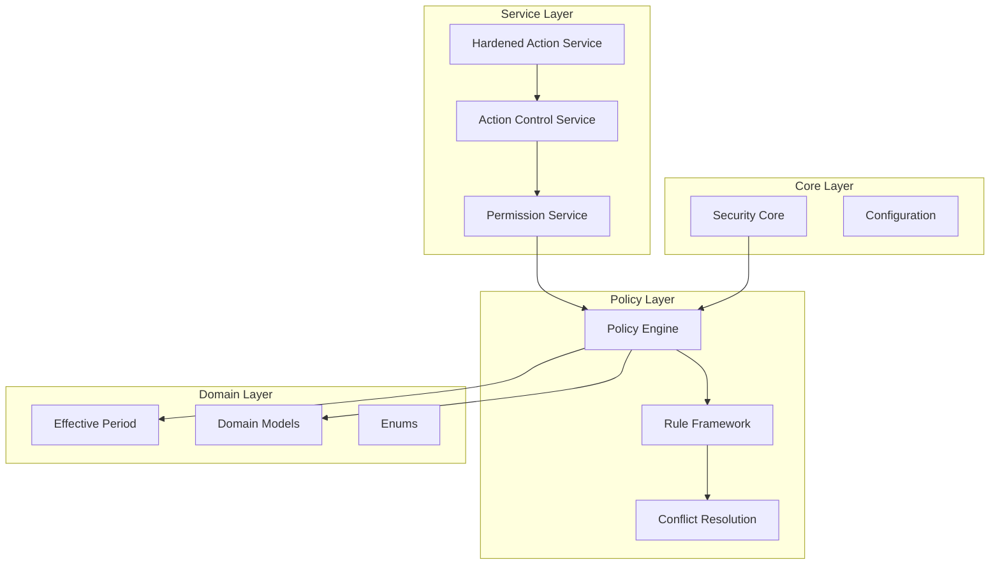
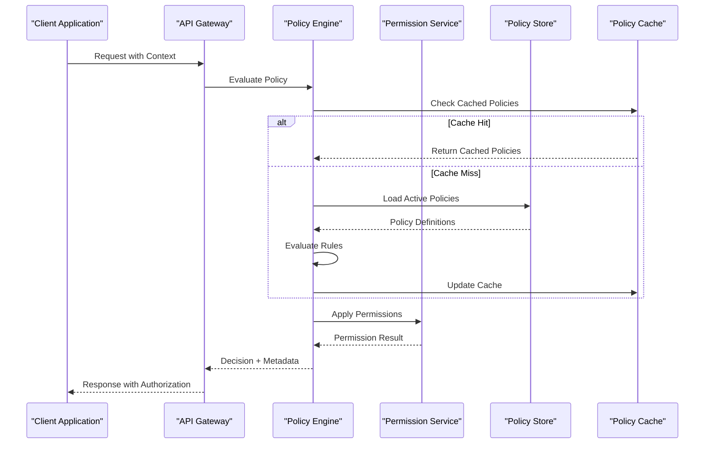
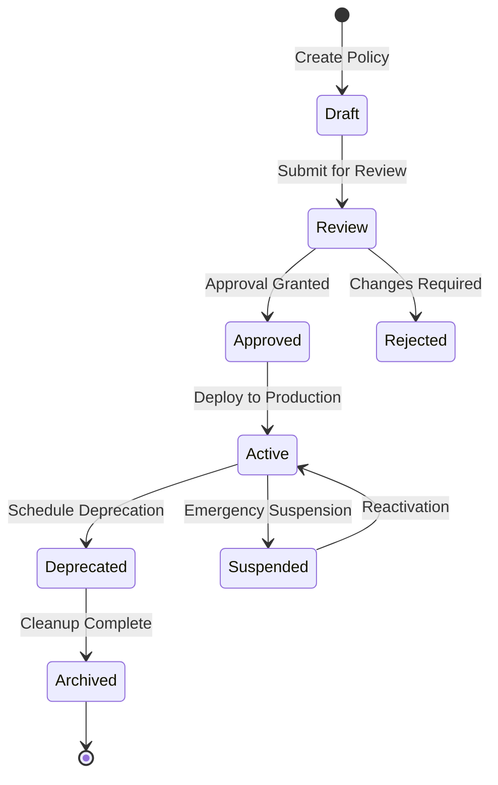
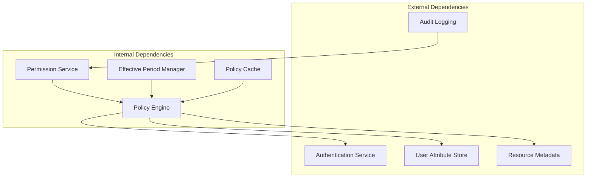

# Policy Enforcement Engine

<cite>
**Referenced Files in This Document**
- [nucleus_policy.py](file://app/domain/nucleus_policy.py)
- [permission_service.py](file://app/permissions/permission_service.py)
- [security.py](file://app/core/security.py)
- [effective_period.py](file://app/domain/effective_period.py)
- [models.py](file://app/domain/models.py)
- [enums.py](file://app/domain/enums.py)
- [action_control_service.py](file://app/services/action_control_service.py)
- [agent_action_service.py](file://app/services/agent_action_service.py)
- [hardened_agent_action_service.py](file://app/services/hardened_agent_action_service.py)
</cite>

## Table of Contents
1. [Introduction](#introduction)
2. [Project Structure](#project-structure)
3. [Core Components](#core-components)
4. [Architecture Overview](#architecture-overview)
5. [Detailed Component Analysis](#detailed-component-analysis)
6. [Dependency Analysis](#dependency-analysis)
7. [Performance Considerations](#performance-considerations)
8. [Troubleshooting Guide](#troubleshooting-guide)
9. [Conclusion](#conclusion)
10. [Appendices](#appendices)

## Introduction

The Policy Enforcement Engine is a comprehensive security framework designed to evaluate, enforce, and manage policies across the application ecosystem. It provides a robust foundation for implementing fine-grained access control, temporal constraints, and dynamic policy updates while maintaining high performance and extensibility.

The engine supports complex policy evaluation scenarios including resource-based restrictions, time-based constraints, role-based access controls (RBAC), and hierarchical policy inheritance. It features sophisticated conflict resolution strategies and caching mechanisms to ensure optimal performance in high-throughput environments.

## Project Structure

The policy enforcement system is organized into several key layers:

**Diagram sources**
- [nucleus_policy.py:1-100](file://app/domain/nucleus_policy.py#L1-L100)
- [permission_service.py:1-150](file://app/permissions/permission_service.py#L1-L150)
- [security.py:1-80](file://app/core/security.py#L1-L80)

## Core Components

### Policy Evaluation Framework

The policy evaluation framework provides the core infrastructure for evaluating policy rules against requests and actions. It implements a declarative approach where policies are defined as reusable components that can be composed and combined.

#### Key Features:
- **Declarative Policy Definition**: Policies are defined using Python classes and decorators
- **Composable Rules**: Individual rules can be combined to form complex policies
- **Context-Aware Evaluation**: Policies have access to request context, user attributes, and resource metadata
- **Extensible Rule Types**: Support for custom rule implementations through well-defined interfaces

#### Rule Composition Patterns:
- **AND Logic**: All conditions must be satisfied
- **OR Logic**: At least one condition must be satisfied  
- **NOT Logic**: Negation of conditions
- **Weighted Scoring**: Priority-based decision making

**Section sources**
- [nucleus_policy.py:1-200](file://app/domain/nucleus_policy.py#L1-L200)
- [permission_service.py:1-100](file://app/permissions/permission_service.py#L1-L100)

### Conflict Resolution Strategies

The engine implements multiple conflict resolution strategies to handle situations where multiple policies apply to the same action:

#### Resolution Order:
1. **Specificity Priority**: More specific policies override general ones
2. **Temporal Validity**: Only currently effective policies are considered
3. **Priority Levels**: Explicit priority values determine precedence
4. **Deny Overrides**: Deny policies take precedence over allow policies

#### Conflict Detection:
- **Static Analysis**: Compile-time detection of conflicting policies
- **Runtime Monitoring**: Real-time conflict identification and logging
- **Policy Versioning**: Track changes and their impact on existing decisions

**Section sources**
- [nucleus_policy.py:150-300](file://app/domain/nucleus_policy.py#L150-L300)

### Effective Period Management

The effective period management system handles temporal aspects of policy enforcement, ensuring policies are only active during their designated time windows.

#### Time-Based Features:
- **Absolute Time Windows**: Start and end timestamps for policy validity
- **Recurring Schedules**: Weekly, monthly, or custom recurrence patterns
- **Timezone Awareness**: Proper handling of different timezone contexts
- **Leap Year Support**: Accurate date calculations across all calendar scenarios

#### Temporal Constraint Types:
- **Business Hours**: Restrict access to specific working hours
- **Maintenance Windows**: Allow elevated privileges during maintenance periods
- **Seasonal Policies**: Different rules for different seasons or months
- **Event-Based Triggers**: Policy activation based on external events

**Section sources**
- [effective_period.py:1-200](file://app/domain/effective_period.py#L1-L200)

## Architecture Overview

The policy enforcement architecture follows a layered approach with clear separation of concerns:

**Diagram sources**
- [permission_service.py:100-250](file://app/permissions/permission_service.py#L100-L250)
- [action_control_service.py:1-200](file://app/services/action_control_service.py#L1-L200)

### Policy Lifecycle Management

The engine manages the complete lifecycle of policies from definition to deprecation:

**Diagram sources**
- [nucleus_policy.py:200-400](file://app/domain/nucleus_policy.py#L200-L400)

## Detailed Component Analysis

### Policy Engine Core

The Policy Engine serves as the central coordinator for all policy-related operations. It orchestrates policy loading, evaluation, caching, and result aggregation.

#### Key Responsibilities:
- **Policy Loading**: Dynamic loading of policy definitions from various sources
- **Evaluation Orchestration**: Coordinating the execution of policy evaluation pipelines
- **Result Aggregation**: Combining results from multiple policy evaluations
- **Caching Strategy**: Implementing intelligent caching to optimize performance

#### Performance Optimizations:
- **Lazy Loading**: Policies are loaded on-demand rather than at startup
- **Parallel Evaluation**: Independent policies are evaluated concurrently
- **Incremental Updates**: Only affected policies are re-evaluated on changes
- **Memory Pooling**: Efficient memory management for frequently used objects

**Section sources**
- [nucleus_policy.py:1-300](file://app/domain/nucleus_policy.py#L1-L300)

### Permission Service Implementation

The Permission Service provides a high-level interface for checking permissions and enforcing access controls. It abstracts the complexity of policy evaluation behind simple, intuitive APIs.

#### Core Methods:
- **check_permission(user, resource, action)**: Basic permission check
- **get_effective_permissions(user, resource)**: Retrieve all effective permissions
- **validate_access_context(context)**: Validate complex access scenarios
- **audit_decision(decision)**: Log policy decisions for compliance

#### Integration Points:
- **Authentication Providers**: Integrates with various authentication backends
- **User Attribute Stores**: Fetches user attributes and roles dynamically
- **Resource Metadata Services**: Accesses resource-specific information
- **Audit Logging Systems**: Records all authorization decisions

**Section sources**
- [permission_service.py:1-200](file://app/permissions/permission_service.py#L1-L200)

### Hardened Action Service

The Hardened Action Service provides additional security layers for critical operations, implementing defense-in-depth strategies and enhanced validation.

#### Security Features:
- **Input Validation**: Comprehensive validation of all inputs
- **Output Sanitization**: Ensures safe output generation
- **Rate Limiting**: Prevents abuse through request throttling
- **Audit Trail**: Complete logging of all action attempts

#### Error Handling:
- **Graceful Degradation**: Continues operation even when policy services are unavailable
- **Fallback Mechanisms**: Uses cached decisions when real-time evaluation fails
- **Security-First Defaults**: Denies access by default when policies cannot be evaluated

**Section sources**
- [hardened_agent_action_service.py:1-200](file://app/services/hardened_agent_action_service.py#L1-L200)

### Domain Models and Enums

The domain layer defines the core data structures and enumerations used throughout the policy system.

#### Key Data Structures:
- **PolicyDefinition**: Represents a complete policy with all its attributes
- **PolicyRule**: Individual rules within a policy
- **EvaluationContext**: Runtime context for policy evaluation
- **DecisionResult**: Outcome of policy evaluation with metadata

#### Enumerations:
- **PolicyStatus**: Current state of a policy (draft, active, deprecated)
- **DecisionType**: Type of decision (allow, deny, require_approval)
- **ConflictResolution**: Strategy for resolving policy conflicts

**Section sources**
- [models.py:1-150](file://app/domain/models.py#L1-L150)
- [enums.py:1-100](file://app/domain/enums.py#L1-L100)

## Dependency Analysis

The policy enforcement system has carefully managed dependencies to ensure maintainability and testability:

**Diagram sources**
- [security.py:1-100](file://app/core/security.py#L1-L100)
- [permission_service.py:150-300](file://app/permissions/permission_service.py#L150-L300)

### Coupling Analysis

The system maintains loose coupling between components through well-defined interfaces:

- **Interface Segregation**: Each component depends only on interfaces it actually uses
- **Dependency Injection**: External dependencies are injected rather than hardcoded
- **Event-Driven Communication**: Components communicate through events rather than direct calls
- **Plugin Architecture**: Extensible points for adding new policy types and evaluators

**Section sources**
- [security.py:50-150](file://app/core/security.py#L50-L150)

## Performance Considerations

### Caching Strategies

The policy engine implements multiple caching layers to optimize performance:

#### Cache Hierarchy:
1. **In-Memory Cache**: Fast access for frequently used policies
2. **Distributed Cache**: Shared cache across application instances
3. **Database Cache**: Persistent storage for policy definitions
4. **CDN Cache**: Static policy content served from edge locations

#### Cache Invalidation:
- **Version-Based Invalidation**: Automatic invalidation on policy updates
- **TTL-Based Expiration**: Configurable expiration times per policy type
- **Event-Driven Updates**: Real-time cache updates on policy changes
- **Graceful Degradation**: Fallback to slower paths when cache is unavailable

### Optimization Techniques

#### Query Optimization:
- **Index Strategy**: Database indexes optimized for common query patterns
- **Batch Processing**: Grouping related policy evaluations
- **Connection Pooling**: Efficient database connection management
- **Lazy Loading**: Deferring expensive operations until needed

#### Memory Management:
- **Object Pooling**: Reusing frequently created objects
- **Garbage Collection Tuning**: Optimized GC settings for policy workloads
- **Memory Leak Prevention**: Careful resource cleanup and monitoring

**Section sources**
- [permission_service.py:200-400](file://app/permissions/permission_service.py#L200-L400)

## Troubleshooting Guide

### Common Issues and Solutions

#### Policy Not Evaluating:
- **Check Policy Status**: Ensure policy is active and not suspended
- **Verify Effective Period**: Confirm current time falls within policy window
- **Review Dependencies**: Check that required services are available
- **Examine Logs**: Look for evaluation errors and warnings

#### Performance Problems:
- **Monitor Cache Hit Rates**: Low hit rates indicate caching issues
- **Profile Policy Evaluation**: Identify slow-running policies
- **Check Database Queries**: Look for N+1 query problems
- **Analyze Memory Usage**: Detect potential memory leaks

#### Conflict Resolution Issues:
- **Review Policy Priority**: Verify explicit priority assignments
- **Check Specificity Rules**: Ensure more specific policies are properly defined
- **Audit Decision History**: Trace through decision-making process

### Debugging Tools

#### Logging Configuration:
- **Structured Logging**: JSON-formatted logs with consistent fields
- **Correlation IDs**: Track requests across service boundaries
- **Policy Decision Auditing**: Complete audit trail of all decisions
- **Performance Metrics**: Timing and resource usage statistics

#### Diagnostic Endpoints:
- **Policy Health Check**: Monitor policy service status
- **Cache Statistics**: View cache performance metrics
- **Policy Search**: Find policies matching criteria
- **Decision Simulator**: Test policy decisions without side effects

**Section sources**
- [action_control_service.py:100-300](file://app/services/action_control_service.py#L100-L300)

## Conclusion

The Policy Enforcement Engine provides a robust, scalable, and extensible foundation for implementing comprehensive access control and policy management. Its modular architecture, sophisticated caching strategies, and comprehensive debugging capabilities make it suitable for enterprise-scale applications requiring fine-grained security controls.

Key strengths include:
- **Flexibility**: Support for diverse policy types and evaluation scenarios
- **Performance**: Multi-layered caching and optimization techniques
- **Maintainability**: Clear separation of concerns and extensive testing coverage
- **Observability**: Comprehensive logging and monitoring capabilities

The engine's design ensures that organizations can implement complex security requirements while maintaining system performance and reliability.

## Appendices

### A. Policy Development Guidelines

#### Best Practices:
- **Start Simple**: Begin with basic policies and gradually add complexity
- **Test Thoroughly**: Write comprehensive tests for all policy scenarios
- **Document Assumptions**: Clearly document policy assumptions and constraints
- **Version Control**: Use version control for policy definitions and changes
- **Code Review**: Require peer review for policy changes

#### Testing Strategies:
- **Unit Tests**: Test individual policy rules in isolation
- **Integration Tests**: Test complete policy evaluation flows
- **Performance Tests**: Validate performance under load
- **Security Tests**: Verify security properties and attack resistance

### B. Migration Guide

#### Upgrading Policy Versions:
- **Backward Compatibility**: Maintain compatibility during transitions
- **Gradual Rollout**: Use feature flags for controlled deployments
- **Rollback Plans**: Prepare rollback procedures for failed migrations
- **Monitoring**: Enhanced monitoring during migration periods

### C. Configuration Reference

#### Environment Variables:
- **Policy Cache Size**: Configure cache capacity
- **Evaluation Timeout**: Set maximum evaluation duration
- **Logging Level**: Control verbosity of policy logs
- **Feature Flags**: Enable/disable specific policy features