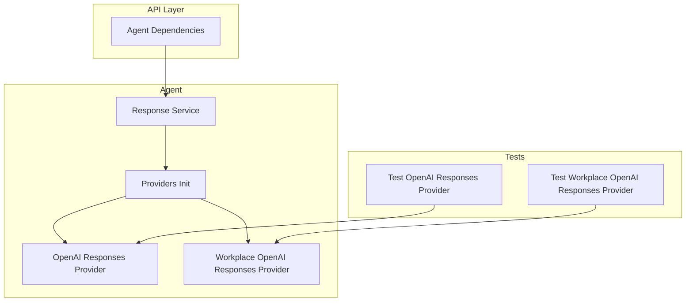
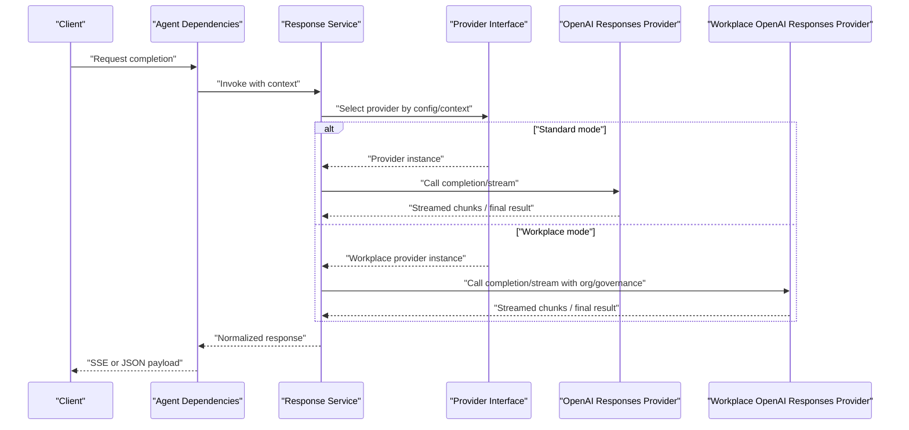
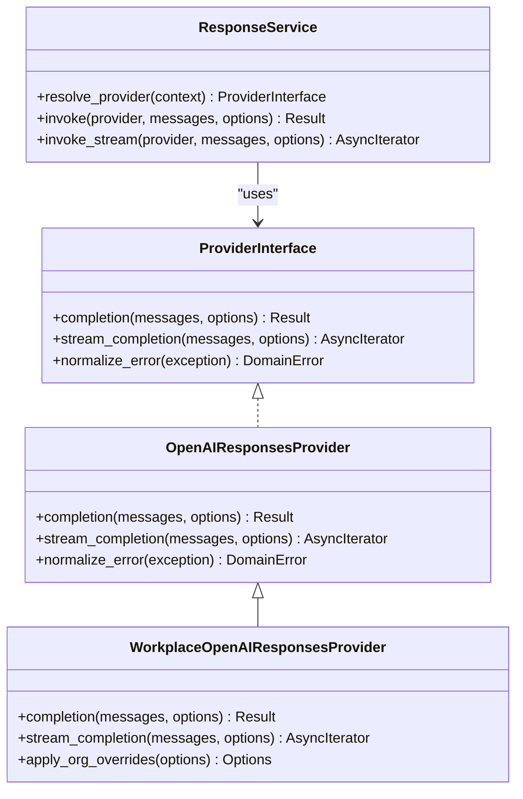
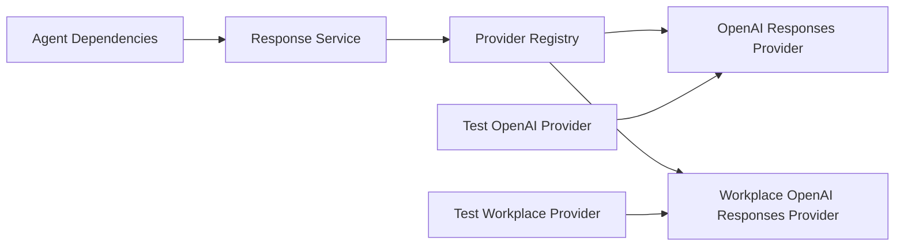

# AI Provider Integration

<cite>
**Referenced Files in This Document**
- [app/agent/providers/__init__.py](file://app/agent/providers/__init__.py)
- [app/agent/providers/openai_responses.py](file://app/agent/providers/openai_responses.py)
- [app/agent/providers/workplace_openai_responses.py](file://app/agent/providers/workplace_openai_responses.py)
- [app/agent/response_service.py](file://app/agent/response_service.py)
- [app/api/agent_dependencies.py](file://app/api/agent_dependencies.py)
- [tests/test_openai_responses_provider.py](file://tests/test_openai_responses_provider.py)
- [tests/test_workplace_openai_responses_provider.py](file://tests/test_workplace_openai_responses_provider.py)
</cite>

## Table of Contents
1. [Introduction](#introduction)
2. [Project Structure](#project-structure)
3. [Core Components](#core-components)
4. [Architecture Overview](#architecture-overview)
5. [Detailed Component Analysis](#detailed-component-analysis)
6. [Dependency Analysis](#dependency-analysis)
7. [Performance Considerations](#performance-considerations)
8. [Troubleshooting Guide](#troubleshooting-guide)
9. [Conclusion](#conclusion)
10. [Appendices](#appendices)

## Introduction
This document explains the AI provider integration architecture with a focus on the pluggable provider interface that supports multiple AI model backends. It details the OpenAI responses provider implementation, including streaming responses, error handling, and rate limiting strategies. It also documents workplace-specific provider extensions for enterprise features such as organization-scoped configuration and governance hooks. Finally, it provides step-by-step guidance for implementing custom providers, configuring provider selection, handling provider-specific optimizations, and designing fallback strategies, load balancing, and performance monitoring across different AI services.

## Project Structure
The AI provider integration is implemented under the agent subsystem and exposed via API dependencies:
- Providers are defined in app/agent/providers and include a base module, an OpenAI responses provider, and a workplace extension.
- The response service orchestrates provider usage within the agent runtime.
- API layer dependencies wire providers into request handlers.
- Tests validate provider behavior and workplace-specific features.

**Diagram sources**
- [app/agent/providers/__init__.py](file://app/agent/providers/__init__.py)
- [app/agent/providers/openai_responses.py](file://app/agent/providers/openai_responses.py)
- [app/agent/providers/workplace_openai_responses.py](file://app/agent/providers/workplace_openai_responses.py)
- [app/agent/response_service.py](file://app/agent/response_service.py)
- [app/api/agent_dependencies.py](file://app/api/agent_dependencies.py)
- [tests/test_openai_responses_provider.py](file://tests/test_openai_responses_provider.py)
- [tests/test_workplace_openai_responses_provider.py](file://tests/test_workplace_openai_responses_provider.py)

**Section sources**
- [app/agent/providers/__init__.py](file://app/agent/providers/__init__.py)
- [app/agent/providers/openai_responses.py](file://app/agent/providers/openai_responses.py)
- [app/agent/providers/workplace_openai_responses.py](file://app/agent/providers/workplace_openai_responses.py)
- [app/agent/response_service.py](file://app/agent/response_service.py)
- [app/api/agent_dependencies.py](file://app/api/agent_dependencies.py)
- [tests/test_openai_responses_provider.py](file://tests/test_openai_responses_provider.py)
- [tests/test_workplace_openai_responses_provider.py](file://tests/test_workplace_openai_responses_provider.py)

## Core Components
- Pluggable provider interface: A common abstraction defines how the agent calls any AI backend uniformly (e.g., chat completion, streaming). Implementations must adhere to this contract so the rest of the system remains provider-agnostic.
- OpenAI responses provider: Implements the provider interface using the OpenAI SDK’s responses API, supporting streaming outputs and standardized error mapping.
- Workplace OpenAI responses provider: Extends the OpenAI provider with enterprise features such as organization-scoped settings and governance hooks.
- Response service: Orchestrates provider selection and invocation from the agent runtime.
- API dependencies: Injects configured providers into route handlers.

Key responsibilities:
- Interface definition and registration for new providers.
- Streaming support for real-time UX.
- Error normalization and retry/fallback policies.
- Rate limiting and quota management.
- Enterprise overrides and policy enforcement.

**Section sources**
- [app/agent/providers/__init__.py](file://app/agent/providers/__init__.py)
- [app/agent/providers/openai_responses.py](file://app/agent/providers/openai_responses.py)
- [app/agent/providers/workplace_openai_responses.py](file://app/agent/providers/workplace_openai_responses.py)
- [app/agent/response_service.py](file://app/agent/response_service.py)
- [app/api/agent_dependencies.py](file://app/api/agent_dependencies.py)

## Architecture Overview
The provider architecture follows a clear separation of concerns:
- The agent runtime requests completions through the response service.
- The response service resolves the active provider based on configuration or context.
- The selected provider implements the standard interface and returns either synchronous results or a stream of events.
- Workplace extensions can override behavior for enterprise constraints.

**Diagram sources**
- [app/agent/response_service.py](file://app/agent/response_service.py)
- [app/agent/providers/openai_responses.py](file://app/agent/providers/openai_responses.py)
- [app/agent/providers/workplace_openai_responses.py](file://app/agent/providers/workplace_openai_responses.py)
- [app/api/agent_dependencies.py](file://app/api/agent_dependencies.py)

## Detailed Component Analysis

### Pluggable Provider Interface Design
- Purpose: Provide a uniform contract for all AI backends so the agent and API layers remain decoupled from specific SDKs.
- Typical responsibilities:
  - Completion call with messages and options.
  - Streaming call returning an async iterable of events.
  - Error normalization to a consistent domain error type.
  - Optional metadata (usage, latency, provider name).
- Registration: New providers register themselves via the providers init module so they can be resolved by name or context.

Implementation notes:
- Keep provider methods minimal and focused on transport and SDK specifics.
- Normalize errors and map provider-specific codes to domain errors.
- Emit telemetry/metrics at the provider boundary for observability.

**Section sources**
- [app/agent/providers/__init__.py](file://app/agent/providers/__init__.py)

### OpenAI Responses Provider
- Uses the OpenAI SDK’s responses API to perform chat-style interactions.
- Streaming: Returns an async iterator of partial updates suitable for SSE delivery to clients.
- Error handling: Translates SDK exceptions into normalized domain errors; includes retries for transient failures where appropriate.
- Rate limiting: Applies client-side throttling or respects server hints to avoid quota exhaustion.

Operational characteristics:
- Configurable model selection and parameters.
- Consistent event shape for consumers.
- Clear separation between transport logic and business orchestration.

**Section sources**
- [app/agent/providers/openai_responses.py](file://app/agent/providers/openai_responses.py)
- [tests/test_openai_responses_provider.py](file://tests/test_openai_responses_provider.py)

### Workplace OpenAI Responses Provider (Enterprise Extension)
- Extends the OpenAI provider with enterprise capabilities:
  - Organization-scoped configuration (e.g., model routing, safety filters).
  - Governance hooks (e.g., audit logging, policy checks before calling the model).
  - Overrides for prompts or tool use to align with organizational rules.
- Maintains compatibility with the same interface, allowing seamless switching between standard and workplace modes.

Usage patterns:
- Selected when workplace context is present or explicitly requested.
- Can enforce additional constraints without changing caller code.

**Section sources**
- [app/agent/providers/workplace_openai_responses.py](file://app/agent/providers/workplace_openai_responses.py)
- [tests/test_workplace_openai_responses_provider.py](file://tests/test_workplace_openai_responses_provider.py)

### Response Service Orchestration
- Resolves the active provider based on configuration and runtime context.
- Wraps provider calls with cross-cutting concerns (timing, metrics, retries).
- Normalizes responses and streams to a consistent format for the API layer.

Integration points:
- Consumed by API dependencies to serve HTTP endpoints.
- Exposes both synchronous and streaming interfaces.

**Section sources**
- [app/agent/response_service.py](file://app/agent/response_service.py)
- [app/api/agent_dependencies.py](file://app/api/agent_dependencies.py)

### Class Relationships

**Diagram sources**
- [app/agent/providers/openai_responses.py](file://app/agent/providers/openai_responses.py)
- [app/agent/providers/workplace_openai_responses.py](file://app/agent/providers/workplace_openai_responses.py)
- [app/agent/response_service.py](file://app/agent/response_service.py)

## Dependency Analysis
- Provider resolution depends on configuration and context passed from the API layer.
- The response service depends on the provider registry to select implementations.
- Tests mock external SDKs to validate provider behavior deterministically.

**Diagram sources**
- [app/api/agent_dependencies.py](file://app/api/agent_dependencies.py)
- [app/agent/response_service.py](file://app/agent/response_service.py)
- [app/agent/providers/__init__.py](file://app/agent/providers/__init__.py)
- [app/agent/providers/openai_responses.py](file://app/agent/providers/openai_responses.py)
- [app/agent/providers/workplace_openai_responses.py](file://app/agent/providers/workplace_openai_responses.py)
- [tests/test_openai_responses_provider.py](file://tests/test_openai_responses_provider.py)
- [tests/test_workplace_openai_responses_provider.py](file://tests/test_workplace_openai_responses_provider.py)

**Section sources**
- [app/api/agent_dependencies.py](file://app/api/agent_dependencies.py)
- [app/agent/response_service.py](file://app/agent/response_service.py)
- [app/agent/providers/__init__.py](file://app/agent/providers/__init__.py)
- [tests/test_openai_responses_provider.py](file://tests/test_openai_responses_provider.py)
- [tests/test_workplace_openai_responses_provider.py](file://tests/test_workplace_openai_responses_provider.py)

## Performance Considerations
- Streaming: Prefer streaming endpoints to reduce perceived latency and improve user experience.
- Backpressure: Ensure the provider stream adapts to downstream consumption rates to avoid memory spikes.
- Concurrency: Limit concurrent outbound requests per provider to respect quotas and avoid overloading upstream services.
- Caching: Cache deterministic lookups (e.g., prompt templates) outside the hot path.
- Metrics: Track latency percentiles, token usage, error rates, and provider availability.

[No sources needed since this section provides general guidance]

## Troubleshooting Guide
Common issues and remedies:
- Provider not found: Verify provider registration and configuration keys.
- Streaming stalls: Check consumer backpressure and ensure the stream is fully consumed.
- Quota exceeded: Inspect rate limiting and implement exponential backoff with jitter.
- Authentication failures: Validate credentials and scopes; log provider-specific error codes after normalization.
- Workplace overrides misapplied: Confirm organization context is present and policy hooks are enabled.

Diagnostic tips:
- Enable detailed logs around provider entry/exit points.
- Capture request IDs and correlate with provider telemetry.
- Use tests to reproduce failures deterministically with mocked SDKs.

**Section sources**
- [tests/test_openai_responses_provider.py](file://tests/test_openai_responses_provider.py)
- [tests/test_workplace_openai_responses_provider.py](file://tests/test_workplace_openai_responses_provider.py)

## Conclusion
The AI provider integration uses a clean, pluggable interface to abstract multiple model backends behind a unified contract. The OpenAI responses provider demonstrates streaming, error normalization, and rate-limiting practices, while the workplace extension adds enterprise-grade controls. With proper configuration, fallback strategies, and observability, teams can scale across providers and maintain reliability and performance.

[No sources needed since this section summarizes without analyzing specific files]

## Appendices

### Step-by-Step: Implementing a Custom AI Provider
1. Define your provider class implementing the provider interface methods (completion and streaming).
2. Normalize errors to the shared domain error type.
3. Register the provider in the providers init module so it can be resolved by name.
4. Add configuration entries for model selection, credentials, and limits.
5. Write unit tests mocking the external SDK to assert behavior and edge cases.
6. Integrate with the response service by ensuring your provider is selectable via configuration or context.

**Section sources**
- [app/agent/providers/__init__.py](file://app/agent/providers/__init__.py)
- [app/agent/providers/openai_responses.py](file://app/agent/providers/openai_responses.py)
- [tests/test_openai_responses_provider.py](file://tests/test_openai_responses_provider.py)

### Step-by-Step: Configuring Provider Selection
- Set environment variables or configuration keys for the desired provider name and model.
- For workplace mode, provide organization context so the workplace provider is selected.
- Validate configuration at startup and fail fast if required keys are missing.

**Section sources**
- [app/api/agent_dependencies.py](file://app/api/agent_dependencies.py)
- [app/agent/response_service.py](file://app/agent/response_service.py)

### Handling Provider-Specific Optimizations
- Tune concurrency limits per provider based on their quotas and SLAs.
- Use streaming for long-running generations to improve responsiveness.
- Apply provider-specific headers or flags only within the provider implementation.

**Section sources**
- [app/agent/providers/openai_responses.py](file://app/agent/providers/openai_responses.py)

### Fallback Strategies and Load Balancing
- Primary/secondary strategy: Attempt primary provider; on failure, fall back to secondary with degraded features if necessary.
- Weighted round-robin: Distribute traffic across providers based on cost or capacity.
- Circuit breaker: Temporarily stop sending requests to unhealthy providers and recover gradually.
- Health checks: Periodically probe provider endpoints and update routing weights accordingly.

[No sources needed since this section provides general guidance]

### Performance Monitoring Across Services
- Emit metrics for latency, throughput, token usage, and error rates per provider.
- Correlate traces with request IDs across API, response service, and provider boundaries.
- Alert on SLO breaches and quota thresholds.

[No sources needed since this section provides general guidance]