# Agent Lifecycle Management

<cite>
**Referenced Files in This Document**
- [app/agent/orchestrator.py](file://app/agent/orchestrator.py)
- [app/agent/instrumented_orchestrator.py](file://app/agent/instrumented_orchestrator.py)
- [app/services/agent_run_service.py](file://app/services/agent_run_service.py)
- [app/services/agent_run_worker.py](file://app/services/agent_run_worker.py)
- [app/agent/run_runtime.py](file://app/agent/run_runtime.py)
- [app/agent/action_state.py](file://app/agent/action_state.py)
- [app/db/agent_run_models.py](file://app/db/agent_run_models.py)
- [app/repositories/agent_run_repository.py](file://app/repositories/agent_run_repository.py)
- [app/api/agent_run_routes.py](file://app/api/agent_run_routes.py)
- [app/api/agent_run_dependencies.py](file://app/api/agent_run_dependencies.py)
- [app/services/agent_run_activity.py](file://app/services/agent_run_activity.py)
- [app/services/action_execution_activity.py](file://app/services/action_execution_activity.py)
- [app/agent/workflow_action_handlers.py](file://app/agent/workflow_action_handlers.py)
- [app/agent/nucleus_action_handlers.py](file://app/agent/nucleus_action_handlers.py)
- [app/agent/tool_registry.py](file://app/agent/tool_registry.py)
- [app/agent/contextual_action_resolver.py](file://app/agent/contextual_action_resolver.py)
- [app/agent/response_service.py](file://app/agent/response_service.py)
- [app/agent/synthesis.py](file://app/agent/synthesis.py)
- [app/agent/providers/openai_responses.py](file://app/agent/providers/openai_responses.py)
- [app/agent/providers/workplace_openai_responses.py](file://app/agent/providers/workplace_openai_responses.py)
- [app/agent/errors.py](file://app/agent/errors.py)
- [app/core/config.py](file://app/core/config.py)
- [app/db/session.py](file://app/db/session.py)
</cite>

## Table of Contents
1. [Introduction](#introduction)
2. [Project Structure](#project-structure)
3. [Core Components](#core-components)
4. [Architecture Overview](#architecture-overview)
5. [Detailed Component Analysis](#detailed-component-analysis)
6. [Dependency Analysis](#dependency-analysis)
7. [Performance Considerations](#performance-considerations)
8. [Troubleshooting Guide](#troubleshooting-guide)
9. [Conclusion](#conclusion)
10. [Appendices](#appendices)

## Introduction
This document explains the agent lifecycle management system, covering creation, initialization, execution phases, state transitions, and termination. It details how the orchestrator manages multiple concurrent agents, allocates resources, and recovers from failures. It also documents persistence and checkpointing for resuming runs, patterns for custom agent types, lifecycle hooks, monitoring integration, and performance strategies for high-concurrency environments.

## Project Structure
The agent lifecycle spans several layers:
- API layer exposes endpoints to start, monitor, and control agent runs.
- Services orchestrate run creation, scheduling, and coordination with workers.
- Orchestrators execute agent logic, manage actions, and handle provider calls.
- Repositories persist run state and events.
- Database models define persistent structures for runs and related entities.
- Providers implement LLM or external tool integrations used by agents.

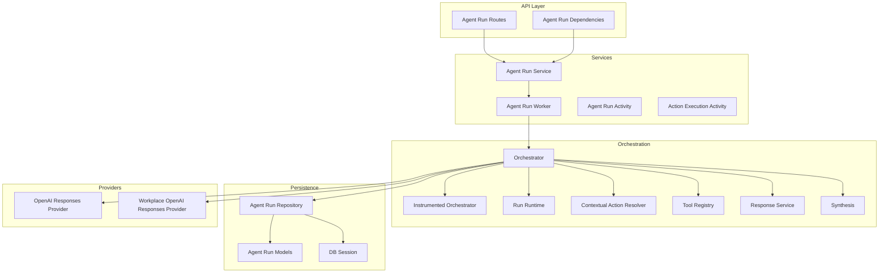

**Diagram sources**
- [app/api/agent_run_routes.py](file://app/api/agent_run_routes.py)
- [app/api/agent_run_dependencies.py](file://app/api/agent_run_dependencies.py)
- [app/services/agent_run_service.py](file://app/services/agent_run_service.py)
- [app/services/agent_run_worker.py](file://app/services/agent_run_worker.py)
- [app/services/agent_run_activity.py](file://app/services/agent_run_activity.py)
- [app/services/action_execution_activity.py](file://app/services/action_execution_activity.py)
- [app/agent/orchestrator.py](file://app/agent/orchestrator.py)
- [app/agent/instrumented_orchestrator.py](file://app/agent/instrumented_orchestrator.py)
- [app/agent/run_runtime.py](file://app/agent/run_runtime.py)
- [app/agent/contextual_action_resolver.py](file://app/agent/contextual_action_resolver.py)
- [app/agent/tool_registry.py](file://app/agent/tool_registry.py)
- [app/agent/response_service.py](file://app/agent/response_service.py)
- [app/agent/synthesis.py](file://app/agent/synthesis.py)
- [app/repositories/agent_run_repository.py](file://app/repositories/agent_run_repository.py)
- [app/db/agent_run_models.py](file://app/db/agent_run_models.py)
- [app/db/session.py](file://app/db/session.py)
- [app/agent/providers/openai_responses.py](file://app/agent/providers/openai_responses.py)
- [app/agent/providers/workplace_openai_responses.py](file://app/agent/providers/workplace_openai_responses.py)

**Section sources**
- [app/api/agent_run_routes.py](file://app/api/agent_run_routes.py)
- [app/api/agent_run_dependencies.py](file://app/api/agent_run_dependencies.py)
- [app/services/agent_run_service.py](file://app/services/agent_run_service.py)
- [app/services/agent_run_worker.py](file://app/services/agent_run_worker.py)
- [app/agent/orchestrator.py](file://app/agent/orchestrator.py)
- [app/agent/instrumented_orchestrator.py](file://app/agent/instrumented_orchestrator.py)
- [app/agent/run_runtime.py](file://app/agent/run_runtime.py)
- [app/agent/contextual_action_resolver.py](file://app/agent/contextual_action_resolver.py)
- [app/agent/tool_registry.py](file://app/agent/tool_registry.py)
- [app/agent/response_service.py](file://app/agent/response_service.py)
- [app/agent/synthesis.py](file://app/agent/synthesis.py)
- [app/repositories/agent_run_repository.py](file://app/repositories/agent_run_repository.py)
- [app/db/agent_run_models.py](file://app/db/agent_run_models.py)
- [app/db/session.py](file://app/db/session.py)
- [app/agent/providers/openai_responses.py](file://app/agent/providers/openai_responses.py)
- [app/agent/providers/workplace_openai_responses.py](file://app/agent/providers/workplace_openai_responses.py)

## Core Components
- Orchestrator: Central coordinator that drives agent execution, selects actions, invokes tools, and persists state transitions.
- Instrumented Orchestrator: Decorates core orchestrator behavior with telemetry and metrics.
- Run Runtime: Encapsulates per-run context, memory, and resource boundaries.
- Contextual Action Resolver: Determines applicable actions based on runtime context and policies.
- Tool Registry: Manages available tools and their contracts.
- Response Service: Formats and streams responses back to clients.
- Synthesis: Aggregates intermediate results into final outputs.
- Agent Run Service: Creates, schedules, and coordinates runs across workers.
- Agent Run Worker: Executes long-running runs asynchronously.
- Agent Run Repository and Models: Persist run state, checkpoints, and events.
- Providers: External model integrations (e.g., OpenAI).

Key responsibilities:
- Lifecycle transitions: created -> initializing -> running -> completed | failed | cancelled.
- Checkpointing: periodic snapshots of run state for resume.
- Concurrency control: worker pools, rate limiting, and resource quotas.
- Failure recovery: retry policies, idempotency, and rollback where applicable.

**Section sources**
- [app/agent/orchestrator.py](file://app/agent/orchestrator.py)
- [app/agent/instrumented_orchestrator.py](file://app/agent/instrumented_orchestrator.py)
- [app/agent/run_runtime.py](file://app/agent/run_runtime.py)
- [app/agent/contextual_action_resolver.py](file://app/agent/contextual_action_resolver.py)
- [app/agent/tool_registry.py](file://app/agent/tool_registry.py)
- [app/agent/response_service.py](file://app/agent/response_service.py)
- [app/agent/synthesis.py](file://app/agent/synthesis.py)
- [app/services/agent_run_service.py](file://app/services/agent_run_service.py)
- [app/services/agent_run_worker.py](file://app/services/agent_run_worker.py)
- [app/repositories/agent_run_repository.py](file://app/repositories/agent_run_repository.py)
- [app/db/agent_run_models.py](file://app/db/agent_run_models.py)
- [app/agent/providers/openai_responses.py](file://app/agent/providers/openai_responses.py)
- [app/agent/providers/workplace_openai_responses.py](file://app/agent/providers/workplace_openai_responses.py)

## Architecture Overview
The lifecycle begins when an API request creates a run. The service validates inputs, persists initial state, and enqueues work for a worker. The worker initializes the orchestrator with runtime context, then iteratively executes actions until completion or failure. State is persisted at key milestones to support resilience and resume.

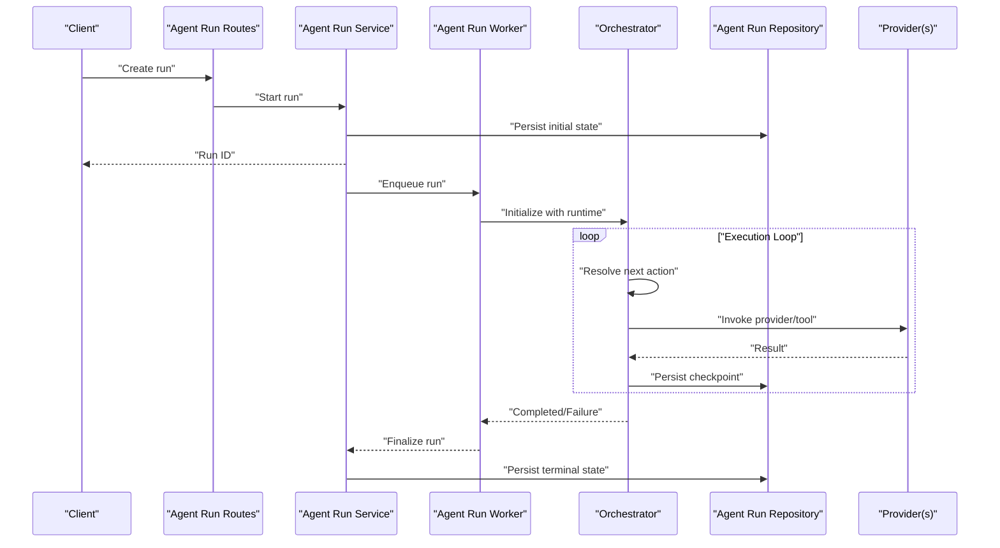

**Diagram sources**
- [app/api/agent_run_routes.py](file://app/api/agent_run_routes.py)
- [app/services/agent_run_service.py](file://app/services/agent_run_service.py)
- [app/services/agent_run_worker.py](file://app/services/agent_run_worker.py)
- [app/agent/orchestrator.py](file://app/agent/orchestrator.py)
- [app/repositories/agent_run_repository.py](file://app/repositories/agent_run_repository.py)
- [app/agent/providers/openai_responses.py](file://app/agent/providers/openai_responses.py)
- [app/agent/providers/workplace_openai_responses.py](file://app/agent/providers/workplace_openai_responses.py)

## Detailed Component Analysis

### Orchestrator and Instrumented Orchestrator
Responsibilities:
- Drive the main execution loop.
- Select and schedule actions using contextual resolution.
- Manage provider invocations and tool usage.
- Emit lifecycle events and update run state.
- Handle retries and error propagation.

The instrumented variant wraps the core orchestrator to capture metrics, traces, and audit logs without changing business logic.

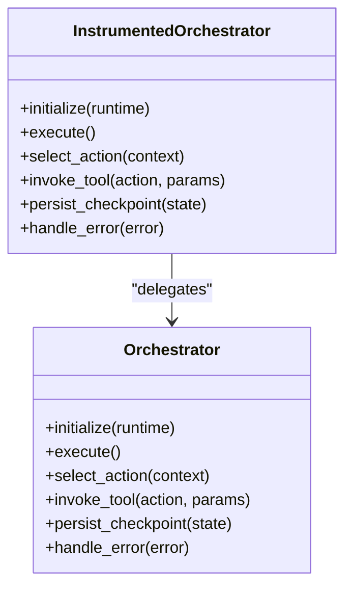

**Diagram sources**
- [app/agent/orchestrator.py](file://app/agent/orchestrator.py)
- [app/agent/instrumented_orchestrator.py](file://app/agent/instrumented_orchestrator.py)

**Section sources**
- [app/agent/orchestrator.py](file://app/agent/orchestrator.py)
- [app/agent/instrumented_orchestrator.py](file://app/agent/instrumented_orchestrator.py)

### Run Runtime and State Management
Run runtime encapsulates per-run context such as conversation history, memory buffers, configuration, and resource handles. It provides safe accessors and ensures isolation between concurrent runs.

State transitions are enforced via explicit methods and persisted through repositories. Checkpoints capture sufficient state to resume safely after interruptions.

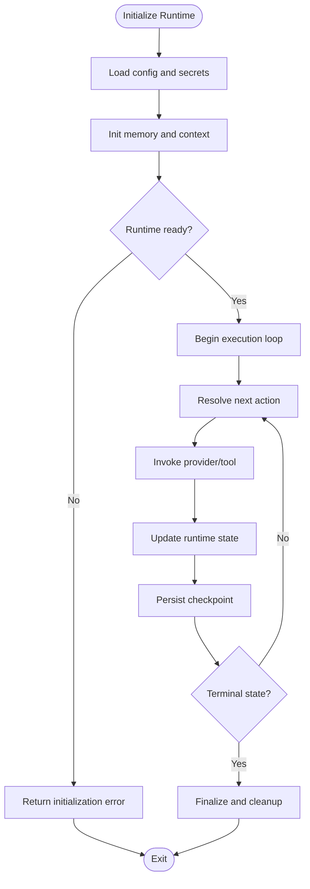

**Diagram sources**
- [app/agent/run_runtime.py](file://app/agent/run_runtime.py)
- [app/agent/action_state.py](file://app/agent/action_state.py)
- [app/repositories/agent_run_repository.py](file://app/repositories/agent_run_repository.py)

**Section sources**
- [app/agent/run_runtime.py](file://app/agent/run_runtime.py)
- [app/agent/action_state.py](file://app/agent/action_state.py)
- [app/repositories/agent_run_repository.py](file://app/repositories/agent_run_repository.py)

### Contextual Action Resolution and Tool Registry
Contextual action resolver determines which actions are applicable given current runtime context, constraints, and policies. The tool registry maintains available tools, their schemas, and invocation handlers. Together they enable dynamic, policy-aware action selection.

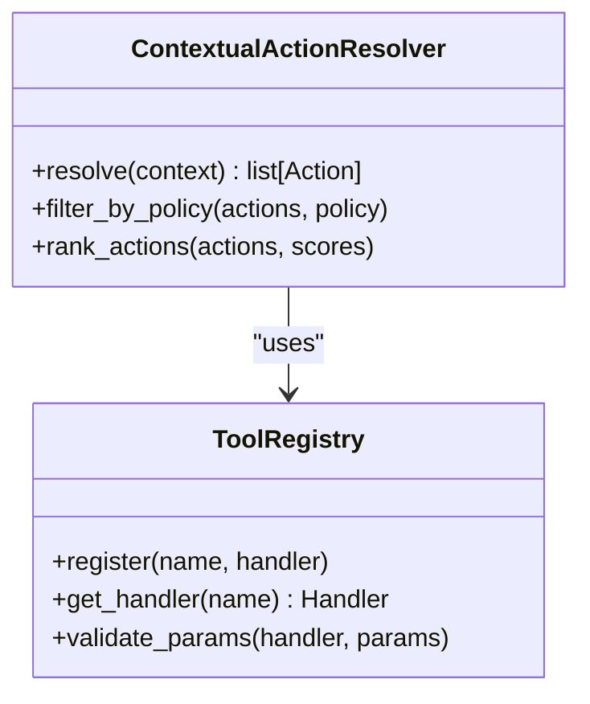

**Diagram sources**
- [app/agent/contextual_action_resolver.py](file://app/agent/contextual_action_resolver.py)
- [app/agent/tool_registry.py](file://app/agent/tool_registry.py)

**Section sources**
- [app/agent/contextual_action_resolver.py](file://app/agent/contextual_action_resolver.py)
- [app/agent/tool_registry.py](file://app/agent/tool_registry.py)

### Workflow and Nucleus Action Handlers
Workflow and nucleus action handlers implement domain-specific behaviors invoked by the orchestrator during execution. They encapsulate complex operations, coordinate with external systems, and emit structured events.

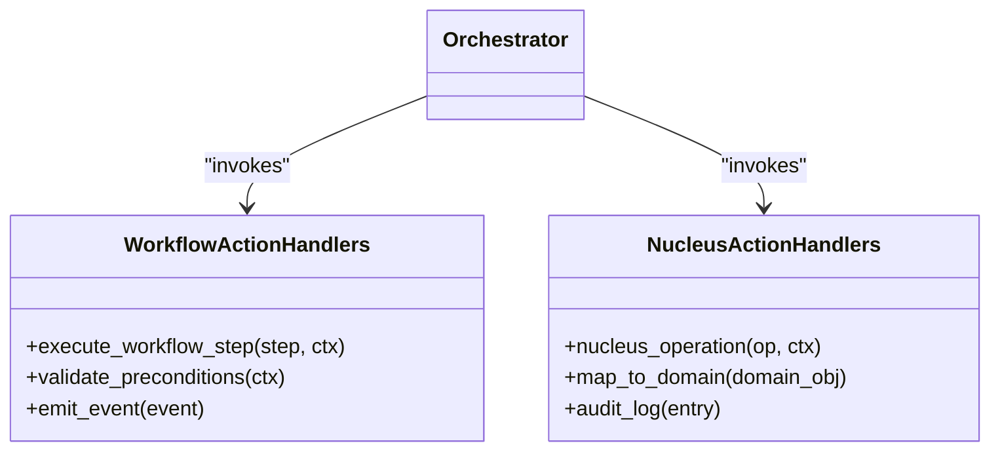

**Diagram sources**
- [app/agent/workflow_action_handlers.py](file://app/agent/workflow_action_handlers.py)
- [app/agent/nucleus_action_handlers.py](file://app/agent/nucleus_action_handlers.py)
- [app/agent/orchestrator.py](file://app/agent/orchestrator.py)

**Section sources**
- [app/agent/workflow_action_handlers.py](file://app/agent/workflow_action_handlers.py)
- [app/agent/nucleus_action_handlers.py](file://app/agent/nucleus_action_handlers.py)
- [app/agent/orchestrator.py](file://app/agent/orchestrator.py)

### Response Service and Synthesis
Response service formats outputs and streams updates to clients. Synthesis aggregates intermediate results into coherent final answers, applying formatting and summarization rules.

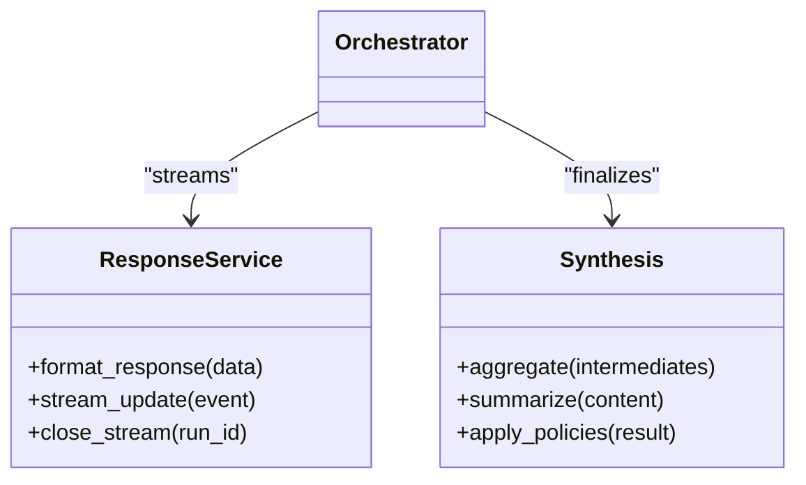

**Diagram sources**
- [app/agent/response_service.py](file://app/agent/response_service.py)
- [app/agent/synthesis.py](file://app/agent/synthesis.py)
- [app/agent/orchestrator.py](file://app/agent/orchestrator.py)

**Section sources**
- [app/agent/response_service.py](file://app/agent/response_service.py)
- [app/agent/synthesis.py](file://app/agent/synthesis.py)
- [app/agent/orchestrator.py](file://app/agent/orchestrator.py)

### Providers Integration
Providers abstract external model services. The orchestrator delegates provider calls through these interfaces, enabling pluggable backends and environment-specific configurations.

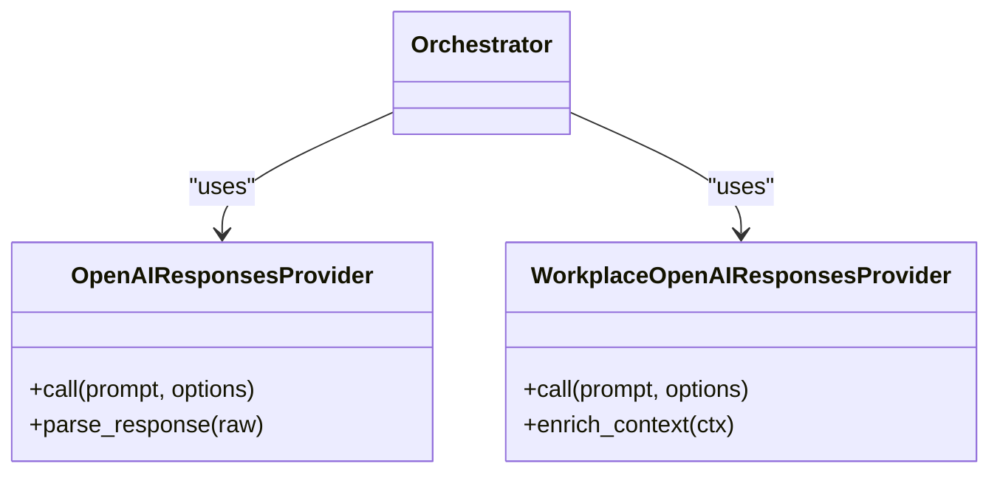

**Diagram sources**
- [app/agent/providers/openai_responses.py](file://app/agent/providers/openai_responses.py)
- [app/agent/providers/workplace_openai_responses.py](file://app/agent/providers/workplace_openai_responses.py)
- [app/agent/orchestrator.py](file://app/agent/orchestrator.py)

**Section sources**
- [app/agent/providers/openai_responses.py](file://app/agent/providers/openai_responses.py)
- [app/agent/providers/workplace_openai_responses.py](file://app/agent/providers/workplace_openai_responses.py)
- [app/agent/orchestrator.py](file://app/agent/orchestrator.py)

### Agent Run Service and Worker
The service layer creates runs, validates inputs, persists initial state, and dispatches work to workers. Workers initialize the orchestrator, drive execution, and finalize outcomes. Activities record progress and errors for observability.

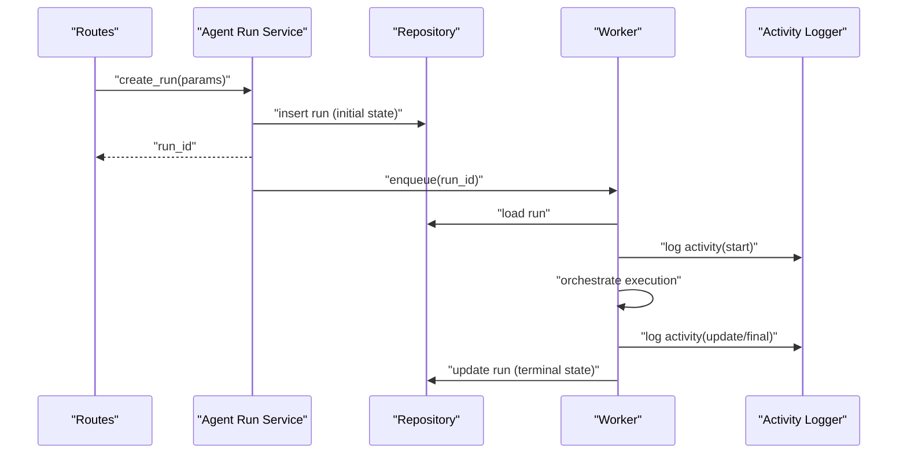

**Diagram sources**
- [app/api/agent_run_routes.py](file://app/api/agent_run_routes.py)
- [app/services/agent_run_service.py](file://app/services/agent_run_service.py)
- [app/services/agent_run_worker.py](file://app/services/agent_run_worker.py)
- [app/repositories/agent_run_repository.py](file://app/repositories/agent_run_repository.py)
- [app/services/agent_run_activity.py](file://app/services/agent_run_activity.py)
- [app/services/action_execution_activity.py](file://app/services/action_execution_activity.py)

**Section sources**
- [app/api/agent_run_routes.py](file://app/api/agent_run_routes.py)
- [app/services/agent_run_service.py](file://app/services/agent_run_service.py)
- [app/services/agent_run_worker.py](file://app/services/agent_run_worker.py)
- [app/repositories/agent_run_repository.py](file://app/repositories/agent_run_repository.py)
- [app/services/agent_run_activity.py](file://app/services/agent_run_activity.py)
- [app/services/action_execution_activity.py](file://app/services/action_execution_activity.py)

### Persistence and Resume
Run models define the schema for runs, including status, metadata, and checkpoints. The repository provides atomic transactions for state updates and supports querying by run identifiers and statuses. Resume capability relies on consistent checkpoint semantics and idempotent re-execution of partial steps.

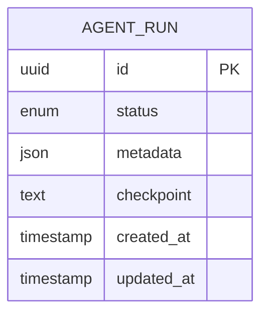

**Diagram sources**
- [app/db/agent_run_models.py](file://app/db/agent_run_models.py)
- [app/repositories/agent_run_repository.py](file://app/repositories/agent_run_repository.py)

**Section sources**
- [app/db/agent_run_models.py](file://app/db/agent_run_models.py)
- [app/repositories/agent_run_repository.py](file://app/repositories/agent_run_repository.py)

### Configuration and Database Session
Configuration centralizes runtime settings such as concurrency limits, timeouts, and feature flags. The database session manages connection pooling and transaction boundaries used by repositories.

**Section sources**
- [app/core/config.py](file://app/core/config.py)
- [app/db/session.py](file://app/db/session.py)

## Dependency Analysis
High-level dependencies:
- API depends on services for business logic.
- Services depend on repositories and workers.
- Orchestrator depends on runtime, resolvers, registries, providers, and response/synthesis utilities.
- Repositories depend on database models and sessions.

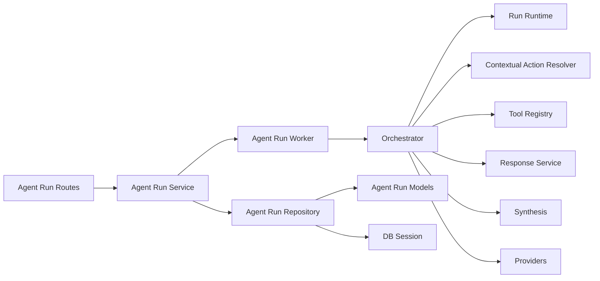

**Diagram sources**
- [app/api/agent_run_routes.py](file://app/api/agent_run_routes.py)
- [app/services/agent_run_service.py](file://app/services/agent_run_service.py)
- [app/services/agent_run_worker.py](file://app/services/agent_run_worker.py)
- [app/agent/orchestrator.py](file://app/agent/orchestrator.py)
- [app/agent/run_runtime.py](file://app/agent/run_runtime.py)
- [app/agent/contextual_action_resolver.py](file://app/agent/contextual_action_resolver.py)
- [app/agent/tool_registry.py](file://app/agent/tool_registry.py)
- [app/agent/response_service.py](file://app/agent/response_service.py)
- [app/agent/synthesis.py](file://app/agent/synthesis.py)
- [app/agent/providers/openai_responses.py](file://app/agent/providers/openai_responses.py)
- [app/agent/providers/workplace_openai_responses.py](file://app/agent/providers/workplace_openai_responses.py)
- [app/repositories/agent_run_repository.py](file://app/repositories/agent_run_repository.py)
- [app/db/agent_run_models.py](file://app/db/agent_run_models.py)
- [app/db/session.py](file://app/db/session.py)

**Section sources**
- [app/api/agent_run_routes.py](file://app/api/agent_run_routes.py)
- [app/services/agent_run_service.py](file://app/services/agent_run_service.py)
- [app/services/agent_run_worker.py](file://app/services/agent_run_worker.py)
- [app/agent/orchestrator.py](file://app/agent/orchestrator.py)
- [app/repositories/agent_run_repository.py](file://app/repositories/agent_run_repository.py)
- [app/db/agent_run_models.py](file://app/db/agent_run_models.py)
- [app/db/session.py](file://app/db/session.py)

## Performance Considerations
- Concurrency control: Use bounded worker pools and per-run semaphores to prevent resource exhaustion.
- Rate limiting: Apply provider-level throttling and circuit breakers to avoid cascading failures.
- Memory management: Stream large payloads, prune conversation history, and release tool handles promptly.
- Checkpoint frequency: Balance durability and overhead; checkpoint at logical step boundaries.
- Idempotency: Ensure actions can be retried safely without side effects duplication.
- Observability: Emit structured logs and metrics for latency, throughput, and error rates.

## Troubleshooting Guide
Common issues and diagnostics:
- Initialization failures: Validate configuration and secret availability before starting runs.
- Provider errors: Inspect provider call logs and retry/backoff parameters.
- Stuck runs: Check latest checkpoint and activity logs to identify last successful step.
- State inconsistencies: Verify repository transactions and ensure atomic updates around checkpoints.
- Resource leaks: Confirm tool registry cleanup and runtime disposal on termination paths.

Useful components for debugging:
- Activity logging for run and action execution.
- Error definitions and normalization.
- Instrumented orchestrator for tracing and metrics.

**Section sources**
- [app/services/agent_run_activity.py](file://app/services/agent_run_activity.py)
- [app/services/action_execution_activity.py](file://app/services/action_execution_activity.py)
- [app/agent/errors.py](file://app/agent/errors.py)
- [app/agent/instrumented_orchestrator.py](file://app/agent/instrumented_orchestrator.py)

## Conclusion
The agent lifecycle management system provides a robust, observable, and resilient framework for executing multi-step agent workflows. Through clear separation of concerns—API, services, orchestrator, runtime, providers, and persistence—it supports high-concurrency operation, durable checkpointing, and flexible extension points for custom agent types and tools.

## Appendices

### Custom Agent Types and Lifecycle Hooks
Patterns:
- Implement new action handlers and register them via the tool registry.
- Extend contextual action resolver to include custom selection criteria.
- Add lifecycle hooks in the orchestrator or runtime for pre/post step processing.
- Emit custom activities for monitoring and auditing.

**Section sources**
- [app/agent/tool_registry.py](file://app/agent/tool_registry.py)
- [app/agent/contextual_action_resolver.py](file://app/agent/contextual_action_resolver.py)
- [app/agent/orchestrator.py](file://app/agent/orchestrator.py)
- [app/services/agent_run_activity.py](file://app/services/agent_run_activity.py)

### Monitoring Integration
Recommendations:
- Wrap orchestrator calls with instrumentation to capture timing and error rates.
- Export metrics for queue depth, worker utilization, and checkpoint intervals.
- Correlate run IDs across logs, traces, and metrics for end-to-end visibility.

**Section sources**
- [app/agent/instrumented_orchestrator.py](file://app/agent/instrumented_orchestrator.py)
- [app/services/agent_run_activity.py](file://app/services/agent_run_activity.py)
- [app/services/action_execution_activity.py](file://app/services/action_execution_activity.py)