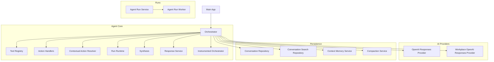
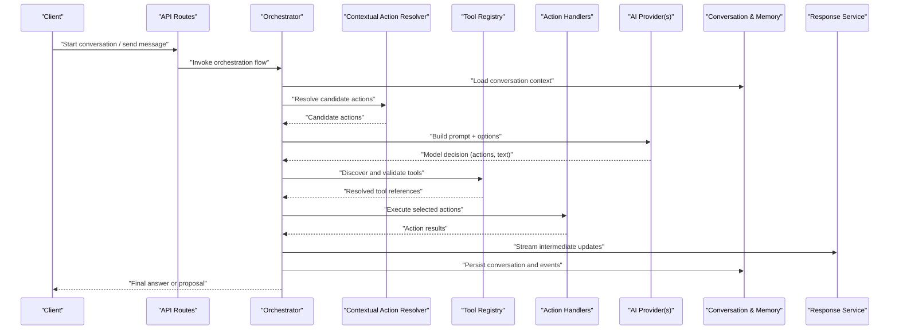
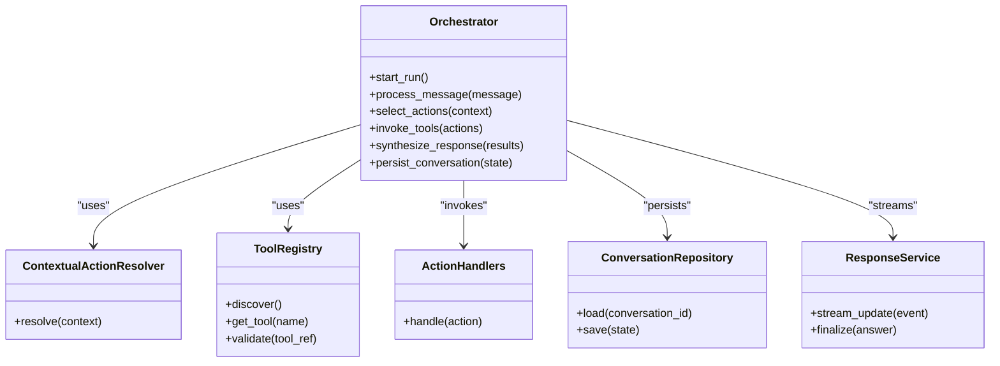
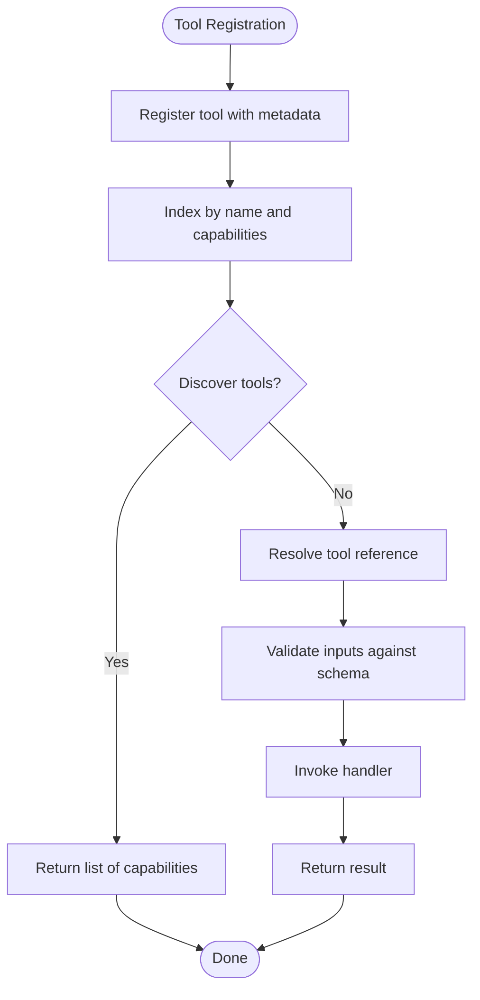
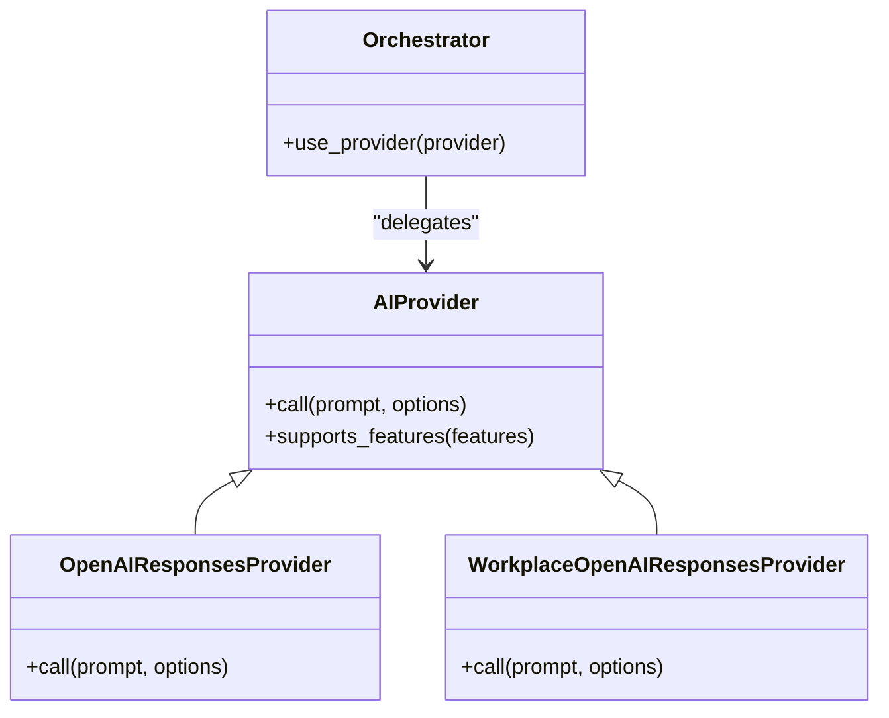
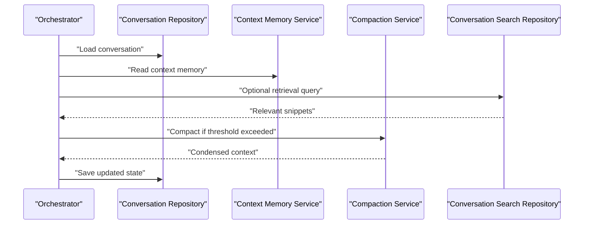
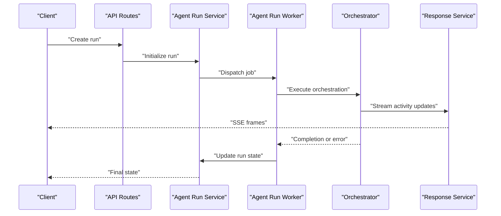
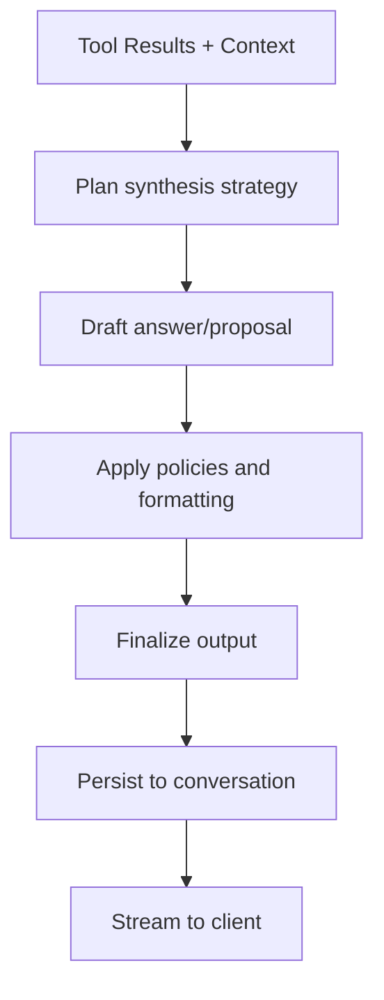
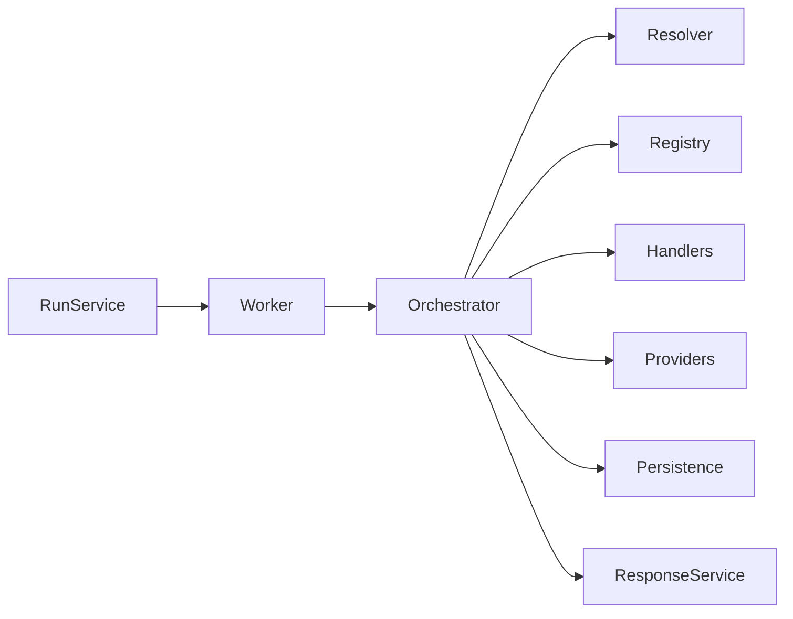

# Agent Orchestration Engine

<cite>
**Referenced Files in This Document**
- [orchestrator.py](file://app/agent/orchestrator.py)
- [tool_registry.py](file://app/agent/tool_registry.py)
- [action_handlers.py](file://app/agent/action_handlers.py)
- [contextual_action_resolver.py](file://app/agent/contextual_action_resolver.py)
- [instrumented_orchestrator.py](file://app/agent/instrumented_orchestrator.py)
- [run_runtime.py](file://app/agent/run_runtime.py)
- [synthesis.py](file://app/agent/synthesis.py)
- [response_service.py](file://app/agent/response_service.py)
- [openai_responses.py](file://app/agent/providers/openai_responses.py)
- [workplace_openai_responses.py](file://app/agent/providers/workplace_openai_responses.py)
- [conversation_repository.py](file://app/repositories/conversation_repository.py)
- [conversation_search_repository.py](file://app/repositories/conversation_search_repository.py)
- [context_memory_service.py](file://app/services/context_memory_service.py)
- [compaction_service.py](file://app/services/compaction_service.py)
- [agent_run_service.py](file://app/services/agent_run_service.py)
- [agent_run_worker.py](file://app/services/agent_run_worker.py)
- [main.py](file://app/main.py)
- [ARCHITECTURE.md](file://docs/ARCHITECTURE.md)
</cite>

## Table of Contents
1. [Introduction](#introduction)
2. [Project Structure](#project-structure)
3. [Core Components](#core-components)
4. [Architecture Overview](#architecture-overview)
5. [Detailed Component Analysis](#detailed-component-analysis)
6. [Dependency Analysis](#dependency-analysis)
7. [Performance Considerations](#performance-considerations)
8. [Troubleshooting Guide](#troubleshooting-guide)
9. [Conclusion](#conclusion)
10. [Appendices](#appendices)

## Introduction
This document explains the AI agent orchestration system with a focus on:
- Agent lifecycle management and execution flows
- Context handling and conversation state persistence
- Tool registry pattern for pluggable tools and capability discovery
- AI provider integration architecture supporting multiple model backends
- Implementation patterns for custom agents, tool registration, and execution flows
- Performance optimization, memory management, and error recovery strategies

The system is designed to be extensible, resilient, and observable, enabling robust multi-turn conversations with governed actions and durable runs.

## Project Structure
At a high level, the backend organizes orchestration logic under app/agent, integrates with AI providers under app/agent/providers, persists conversation and run state via repositories and services, and exposes APIs through app/api. The main application entry point wires dependencies and starts the server.

**Diagram sources**
- [orchestrator.py](file://app/agent/orchestrator.py)
- [tool_registry.py](file://app/agent/tool_registry.py)
- [action_handlers.py](file://app/agent/action_handlers.py)
- [contextual_action_resolver.py](file://app/agent/contextual_action_resolver.py)
- [instrumented_orchestrator.py](file://app/agent/instrumented_orchestrator.py)
- [run_runtime.py](file://app/agent/run_runtime.py)
- [synthesis.py](file://app/agent/synthesis.py)
- [response_service.py](file://app/agent/response_service.py)
- [openai_responses.py](file://app/agent/providers/openai_responses.py)
- [workplace_openai_responses.py](file://app/agent/providers/workplace_openai_responses.py)
- [conversation_repository.py](file://app/repositories/conversation_repository.py)
- [conversation_search_repository.py](file://app/repositories/conversation_search_repository.py)
- [context_memory_service.py](file://app/services/context_memory_service.py)
- [compaction_service.py](file://app/services/compaction_service.py)
- [agent_run_service.py](file://app/services/agent_run_service.py)
- [agent_run_worker.py](file://app/services/agent_run_worker.py)
- [main.py](file://app/main.py)

**Section sources**
- [main.py](file://app/main.py)
- [ARCHITECTURE.md](file://docs/ARCHITECTURE.md)

## Core Components
- Orchestrator: Central coordinator that manages agent lifecycle, composes context, selects actions, invokes tools, synthesizes responses, and persists conversation state.
- Tool Registry: Pluggable registry for discovering and invoking tools; supports capability discovery and dynamic resolution.
- Action Handlers: Typed handlers for specific action types (e.g., workflow, nucleus, workplace resources).
- Contextual Action Resolver: Resolves which actions are relevant given current context and user intent.
- Run Runtime: Encapsulates per-run execution environment and state.
- Synthesis: Composes final answers or proposals from tool outputs and conversation history.
- Response Service: Formats and streams responses to clients.
- Instrumented Orchestrator: Adds observability hooks around orchestrator operations.
- AI Providers: Abstractions over model backends (e.g., OpenAI Responses), including specialized workplace variants.
- Persistence Layer: Repositories and services for conversation storage, search, context memory, and compaction.
- Runs: Services and workers for durable, long-running agent executions.

**Section sources**
- [orchestrator.py](file://app/agent/orchestrator.py)
- [tool_registry.py](file://app/agent/tool_registry.py)
- [action_handlers.py](file://app/agent/action_handlers.py)
- [contextual_action_resolver.py](file://app/agent/contextual_action_resolver.py)
- [run_runtime.py](file://app/agent/run_runtime.py)
- [synthesis.py](file://app/agent/synthesis.py)
- [response_service.py](file://app/agent/response_service.py)
- [instrumented_orchestrator.py](file://app/agent/instrumented_orchestrator.py)
- [openai_responses.py](file://app/agent/providers/openai_responses.py)
- [workplace_openai_responses.py](file://app/agent/providers/workplace_openai_responses.py)
- [conversation_repository.py](file://app/repositories/conversation_repository.py)
- [conversation_search_repository.py](file://app/repositories/conversation_search_repository.py)
- [context_memory_service.py](file://app/services/context_memory_service.py)
- [compaction_service.py](file://app/services/compaction_service.py)
- [agent_run_service.py](file://app/services/agent_run_service.py)
- [agent_run_worker.py](file://app/services/agent_run_worker.py)

## Architecture Overview
The orchestration engine follows a layered architecture:
- API layer routes requests into the orchestrator.
- Orchestrator coordinates context building, action selection, tool invocation, synthesis, and response streaming.
- AI providers abstract model calls, allowing multiple backends.
- Persistence layer stores conversations, events, and context memory with optional compaction for efficiency.
- Runs service and worker manage durable, asynchronous execution.

**Diagram sources**
- [orchestrator.py](file://app/agent/orchestrator.py)
- [contextual_action_resolver.py](file://app/agent/contextual_action_resolver.py)
- [tool_registry.py](file://app/agent/tool_registry.py)
- [action_handlers.py](file://app/agent/action_handlers.py)
- [openai_responses.py](file://app/agent/providers/openai_responses.py)
- [workplace_openai_responses.py](file://app/agent/providers/workplace_openai_responses.py)
- [conversation_repository.py](file://app/repositories/conversation_repository.py)
- [context_memory_service.py](file://app/services/context_memory_service.py)
- [response_service.py](file://app/agent/response_service.py)

## Detailed Component Analysis

### Orchestrator and Lifecycle Management
Responsibilities:
- Initialize and manage per-run context and runtime state.
- Build prompts using conversation history and context memory.
- Select actions based on resolver output and policy constraints.
- Invoke tools via the registry and action handlers.
- Stream responses and persist conversation state.
- Coordinate with synthesis to produce final answers or proposals.

Key interactions:
- Uses contextual action resolver to narrow down relevant actions.
- Delegates tool discovery and validation to the tool registry.
- Persists conversation snapshots and events via repositories.
- Streams partial results through the response service.

**Diagram sources**
- [orchestrator.py](file://app/agent/orchestrator.py)
- [contextual_action_resolver.py](file://app/agent/contextual_action_resolver.py)
- [tool_registry.py](file://app/agent/tool_registry.py)
- [action_handlers.py](file://app/agent/action_handlers.py)
- [conversation_repository.py](file://app/repositories/conversation_repository.py)
- [response_service.py](file://app/agent/response_service.py)

**Section sources**
- [orchestrator.py](file://app/agent/orchestrator.py)
- [instrumented_orchestrator.py](file://app/agent/instrumented_orchestrator.py)

### Tool Registry Pattern and Capability Discovery
Responsibilities:
- Register tools dynamically at startup or runtime.
- Discover available tools and their capabilities.
- Validate tool references before invocation.
- Provide typed interfaces for tool execution.

Patterns:
- Declarative registration with metadata (name, schema, description).
- Capability-based discovery for UI and planning.
- Safe invocation with input/output validation.

**Diagram sources**
- [tool_registry.py](file://app/agent/tool_registry.py)
- [action_handlers.py](file://app/agent/action_handlers.py)

**Section sources**
- [tool_registry.py](file://app/agent/tool_registry.py)
- [action_handlers.py](file://app/agent/action_handlers.py)

### AI Provider Integration Architecture
Responsibilities:
- Abstract model calls behind a common interface.
- Support multiple backends (e.g., OpenAI Responses).
- Allow specialized providers (e.g., Workplace-specific behavior).
- Handle retries, timeouts, and error mapping.

Integration points:
- Orchestrator constructs prompts and options.
- Provider returns structured decisions (actions, text).
- Errors are normalized and surfaced consistently.

**Diagram sources**
- [openai_responses.py](file://app/agent/providers/openai_responses.py)
- [workplace_openai_responses.py](file://app/agent/providers/workplace_openai_responses.py)
- [orchestrator.py](file://app/agent/orchestrator.py)

**Section sources**
- [openai_responses.py](file://app/agent/providers/openai_responses.py)
- [workplace_openai_responses.py](file://app/agent/providers/workplace_openai_responses.py)

### Conversation State Persistence and Context Handling
Responsibilities:
- Load and save conversation snapshots.
- Maintain context memory across turns.
- Perform compaction to reduce token usage while preserving semantics.
- Enable full-text search over conversation content.

Data flow:
- On each turn, load recent history and context memory.
- After processing, persist updated state and compact if needed.
- Expose search queries for retrieval-augmented generation.

**Diagram sources**
- [conversation_repository.py](file://app/repositories/conversation_repository.py)
- [conversation_search_repository.py](file://app/repositories/conversation_search_repository.py)
- [context_memory_service.py](file://app/services/context_memory_service.py)
- [compaction_service.py](file://app/services/compaction_service.py)
- [orchestrator.py](file://app/agent/orchestrator.py)

**Section sources**
- [conversation_repository.py](file://app/repositories/conversation_repository.py)
- [conversation_search_repository.py](file://app/repositories/conversation_search_repository.py)
- [context_memory_service.py](file://app/services/context_memory_service.py)
- [compaction_service.py](file://app/services/compaction_service.py)

### Execution Flows and Run Management
Responsibilities:
- Manage durable agent runs with start, progress, completion, and failure states.
- Stream activity updates to clients.
- Offload long-running tasks to background workers.

Flow overview:
- API triggers run creation.
- Run service initializes runtime and persists initial state.
- Worker executes orchestration steps, emitting events.
- Response service streams updates; final state persisted upon completion.

**Diagram sources**
- [agent_run_service.py](file://app/services/agent_run_service.py)
- [agent_run_worker.py](file://app/services/agent_run_worker.py)
- [orchestrator.py](file://app/agent/orchestrator.py)
- [response_service.py](file://app/agent/response_service.py)

**Section sources**
- [agent_run_service.py](file://app/services/agent_run_service.py)
- [agent_run_worker.py](file://app/services/agent_run_worker.py)

### Synthesis and Answer Composition
Responsibilities:
- Combine tool outputs and conversation context into coherent answers or proposals.
- Apply formatting rules and safety checks.
- Prepare data for streaming and persistence.

**Diagram sources**
- [synthesis.py](file://app/agent/synthesis.py)
- [response_service.py](file://app/agent/response_service.py)
- [conversation_repository.py](file://app/repositories/conversation_repository.py)

**Section sources**
- [synthesis.py](file://app/agent/synthesis.py)
- [response_service.py](file://app/agent/response_service.py)

## Dependency Analysis
High-level dependency relationships:
- Orchestrator depends on resolver, registry, handlers, providers, persistence, and response services.
- Providers depend on external model APIs.
- Persistence components depend on database layers and search indexes.
- Run service and worker coordinate durable execution.

**Diagram sources**
- [orchestrator.py](file://app/agent/orchestrator.py)
- [contextual_action_resolver.py](file://app/agent/contextual_action_resolver.py)
- [tool_registry.py](file://app/agent/tool_registry.py)
- [action_handlers.py](file://app/agent/action_handlers.py)
- [openai_responses.py](file://app/agent/providers/openai_responses.py)
- [workplace_openai_responses.py](file://app/agent/providers/workplace_openai_responses.py)
- [conversation_repository.py](file://app/repositories/conversation_repository.py)
- [response_service.py](file://app/agent/response_service.py)
- [agent_run_service.py](file://app/services/agent_run_service.py)
- [agent_run_worker.py](file://app/services/agent_run_worker.py)

**Section sources**
- [orchestrator.py](file://app/agent/orchestrator.py)
- [agent_run_service.py](file://app/services/agent_run_service.py)
- [agent_run_worker.py](file://app/services/agent_run_worker.py)

## Performance Considerations
- Context compaction: Reduce token usage by summarizing older messages while preserving key facts.
- Streaming responses: Emit incremental updates to improve perceived latency.
- Batched persistence: Coalesce writes to minimize database overhead.
- Provider caching: Cache repeated lookups where safe to reduce external calls.
- Resource limits: Enforce timeouts and rate limits on provider calls.
- Memory management: Avoid retaining large payloads in memory; stream large outputs when possible.

[No sources needed since this section provides general guidance]

## Troubleshooting Guide
Common issues and strategies:
- Provider errors: Normalize and retry with backoff; surface actionable messages to clients.
- Stale context: Detect outdated conversation segments and trigger compaction or reload.
- Tool failures: Isolate failing tools, log diagnostics, and continue with partial results when safe.
- Run interruptions: Use durable state to resume or rollback safely.
- Observability: Leverage instrumented orchestrator hooks to trace slow paths and failures.

**Section sources**
- [instrumented_orchestrator.py](file://app/agent/instrumented_orchestrator.py)
- [response_service.py](file://app/agent/response_service.py)
- [context_memory_service.py](file://app/services/context_memory_service.py)
- [compaction_service.py](file://app/services/compaction_service.py)

## Conclusion
The orchestration engine provides a modular, extensible foundation for AI-driven agents. Its clear separation of concerns—orchestration, tooling, provider abstraction, persistence, and durable runs—enables rapid development of custom agents and tools while maintaining performance and reliability. By adopting the patterns described here, teams can scale capabilities, integrate new models, and deliver responsive, observable experiences.

[No sources needed since this section summarizes without analyzing specific files]

## Appendices

### Creating Custom Agents
- Define an agent configuration that specifies provider, tools, and policies.
- Implement any missing action handlers and register them with the registry.
- Wire the agent into the orchestrator via dependency injection.
- Test with representative conversations and edge cases.

**Section sources**
- [orchestrator.py](file://app/agent/orchestrator.py)
- [tool_registry.py](file://app/agent/tool_registry.py)
- [action_handlers.py](file://app/agent/action_handlers.py)

### Registering New Tools
- Declare tool metadata (name, schema, description).
- Implement a handler adhering to the action contract.
- Register the tool during startup or at runtime.
- Validate inputs and handle errors gracefully.

**Section sources**
- [tool_registry.py](file://app/agent/tool_registry.py)
- [action_handlers.py](file://app/agent/action_handlers.py)

### Handling Agent Execution Flows
- Use the run service to create and monitor durable runs.
- Stream activity updates via the response service.
- Persist conversation snapshots after each step.
- Implement retries and fallbacks for transient failures.

**Section sources**
- [agent_run_service.py](file://app/services/agent_run_service.py)
- [agent_run_worker.py](file://app/services/agent_run_worker.py)
- [response_service.py](file://app/agent/response_service.py)
- [conversation_repository.py](file://app/repositories/conversation_repository.py)