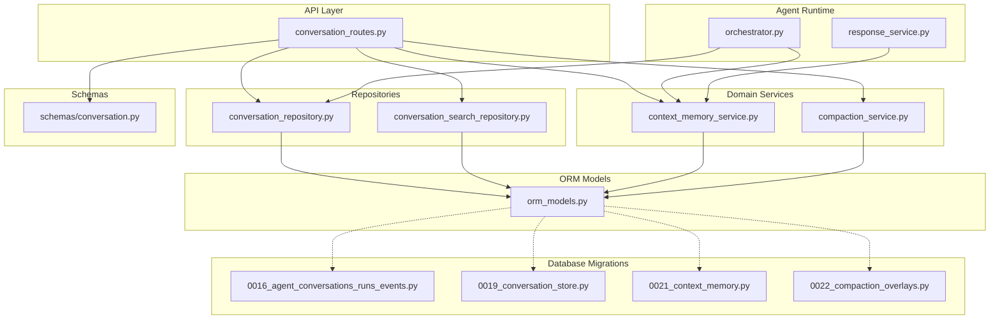
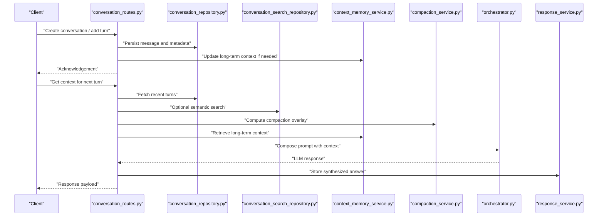
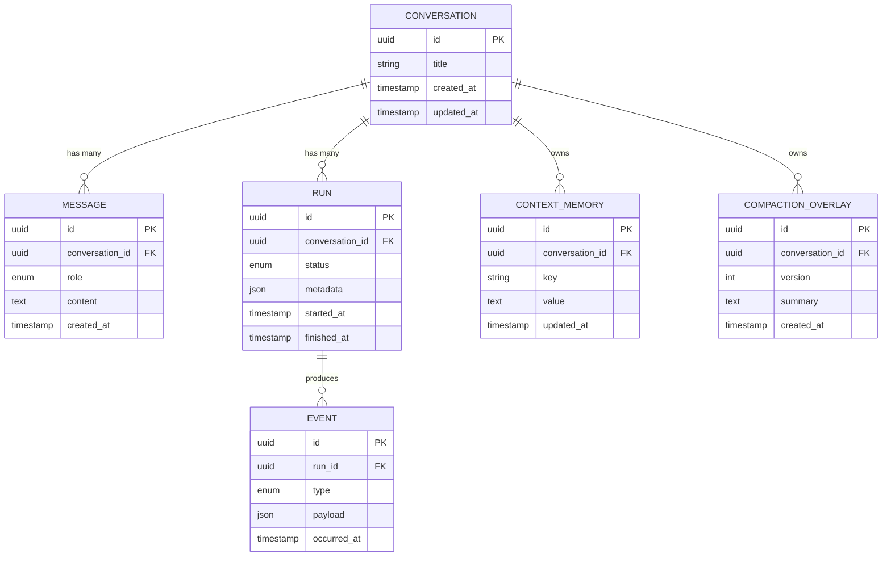
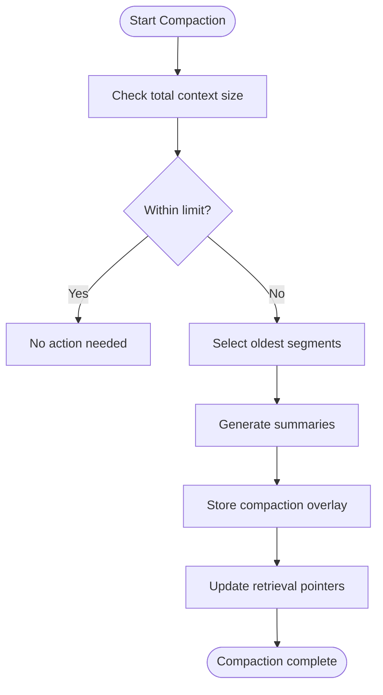
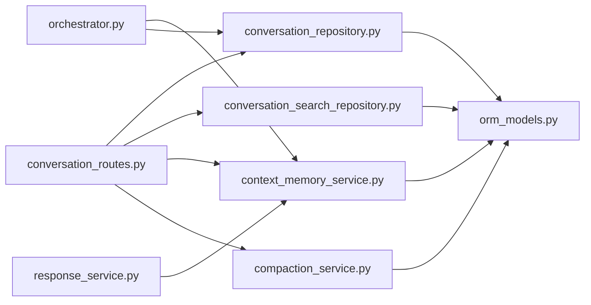

# Context & Conversation State

<cite>
**Referenced Files in This Document**
- [alembic/versions/0016_agent_conversations_runs_events.py](file://alembic/versions/0016_agent_conversations_runs_events.py)
- [alembic/versions/0019_conversation_store.py](file://alembic/versions/0019_conversation_store.py)
- [alembic/versions/0021_context_memory.py](file://alembic/versions/0021_context_memory.py)
- [alembic/versions/0022_compaction_overlays.py](file://alembic/versions/0022_compaction_overlays.py)
- [app/db/orm_models.py](file://app/db/orm_models.py)
- [app/repositories/conversation_repository.py](file://app/repositories/conversation_repository.py)
- [app/repositories/conversation_search_repository.py](file://app/repositories/conversation_search_repository.py)
- [app/services/context_memory_service.py](file://app/services/context_memory_service.py)
- [app/services/compaction_service.py](file://app/services/compaction_service.py)
- [app/api/conversation_routes.py](file://app/api/conversation_routes.py)
- [app/schemas/conversation.py](file://app/schemas/conversation.py)
- [app/agent/orchestrator.py](file://app/agent/orchestrator.py)
- [app/agent/response_service.py](file://app/agent/response_service.py)
</cite>

## Table of Contents
1. [Introduction](#introduction)
2. [Project Structure](#project-structure)
3. [Core Components](#core-components)
4. [Architecture Overview](#architecture-overview)
5. [Detailed Component Analysis](#detailed-component-analysis)
6. [Dependency Analysis](#dependency-analysis)
7. [Performance Considerations](#performance-considerations)
8. [Troubleshooting Guide](#troubleshooting-guide)
9. [Conclusion](#conclusion)
10. [Appendices](#appendices)

## Introduction
This document explains how conversation context and state are managed and persisted across multiple turns, including message history, user preferences, and session state. It covers the context memory service for long-term storage and retrieval, repository patterns for efficient persistence and query optimization, and implementation patterns for context enrichment, memory compaction, and context-aware response generation. It also addresses context size limitations, memory optimization strategies, and cross-session context sharing.

## Project Structure
The context and conversation system spans database migrations, ORM models, repositories, services, API routes, schemas, and agent orchestration:

- Database schema evolution is defined by Alembic migrations that introduce conversations, runs/events, a durable conversation store, context memory, and compaction overlays.
- ORM models represent conversations, messages, runs, events, and context memory entries.
- Repositories encapsulate persistence logic and provide optimized queries (including full-text search).
- Services implement business logic for context memory operations and compaction.
- API routes expose endpoints to create, update, and query conversations and context.
- Schemas define request/response contracts for conversation-related APIs.
- Agent orchestrator and response service integrate context into LLM calls and synthesis.

**Diagram sources**
- [app/api/conversation_routes.py](file://app/api/conversation_routes.py)
- [app/repositories/conversation_repository.py](file://app/repositories/conversation_repository.py)
- [app/repositories/conversation_search_repository.py](file://app/repositories/conversation_search_repository.py)
- [app/services/context_memory_service.py](file://app/services/context_memory_service.py)
- [app/services/compaction_service.py](file://app/services/compaction_service.py)
- [app/db/orm_models.py](file://app/db/orm_models.py)
- [app/agent/orchestrator.py](file://app/agent/orchestrator.py)
- [app/agent/response_service.py](file://app/agent/response_service.py)
- [app/schemas/conversation.py](file://app/schemas/conversation.py)
- [alembic/versions/0016_agent_conversations_runs_events.py](file://alembic/versions/0016_agent_conversations_runs_events.py)
- [alembic/versions/0019_conversation_store.py](file://alembic/versions/0019_conversation_store.py)
- [alembic/versions/0021_context_memory.py](file://alembic/versions/0021_context_memory.py)
- [alembic/versions/0022_compaction_overlays.py](file://alembic/versions/0022_compaction_overlays.py)

**Section sources**
- [alembic/versions/0016_agent_conversations_runs_events.py](file://alembic/versions/0016_agent_conversations_runs_events.py)
- [alembic/versions/0019_conversation_store.py](file://alembic/versions/0019_conversation_store.py)
- [alembic/versions/0021_context_memory.py](file://alembic/versions/0021_context_memory.py)
- [alembic/versions/0022_compaction_overlays.py](file://alembic/versions/0022_compaction_overlays.py)
- [app/db/orm_models.py](file://app/db/orm_models.py)
- [app/repositories/conversation_repository.py](file://app/repositories/conversation_repository.py)
- [app/repositories/conversation_search_repository.py](file://app/repositories/conversation_search_repository.py)
- [app/services/context_memory_service.py](file://app/services/context_memory_service.py)
- [app/services/compaction_service.py](file://app/services/compaction_service.py)
- [app/api/conversation_routes.py](file://app/api/conversation_routes.py)
- [app/schemas/conversation.py](file://app/schemas/conversation.py)
- [app/agent/orchestrator.py](file://app/agent/orchestrator.py)
- [app/agent/response_service.py](file://app/agent/response_service.py)

## Core Components
- Conversation Repository: Encapsulates CRUD and query operations for conversations, messages, runs, and events. Provides pagination, filtering, and efficient retrieval of recent turns.
- Conversation Search Repository: Adds full-text search capabilities over conversation content to support discovery and recall.
- Context Memory Service: Manages long-term context entries keyed by conversation or user scope, enabling persistent preferences, facts, and summaries across sessions.
- Compaction Service: Compresses conversation history and context into compact overlays to reduce token usage while preserving essential information.
- API Routes: Expose endpoints to manage conversations and context, integrating with repositories and services.
- Schemas: Define request/response structures for conversation and context operations.
- Agent Orchestration: Integrates context into LLM prompts and synthesizes responses using enriched context.

**Section sources**
- [app/repositories/conversation_repository.py](file://app/repositories/conversation_repository.py)
- [app/repositories/conversation_search_repository.py](file://app/repositories/conversation_search_repository.py)
- [app/services/context_memory_service.py](file://app/services/context_memory_service.py)
- [app/services/compaction_service.py](file://app/services/compaction_service.py)
- [app/api/conversation_routes.py](file://app/api/conversation_routes.py)
- [app/schemas/conversation.py](file://app/schemas/conversation.py)
- [app/agent/orchestrator.py](file://app/agent/orchestrator.py)
- [app/agent/response_service.py](file://app/agent/response_service.py)

## Architecture Overview
The system maintains multi-turn conversation state through layered components:

- API layer receives requests to create/update conversations and context.
- Repositories persist and retrieve conversation data efficiently.
- Context memory service stores long-term context entries and supports retrieval scoped by conversation or user.
- Compaction service reduces context size by summarizing older turns and merging overlays.
- Agent orchestrator composes context (recent turns + compacted summary + long-term memory) into prompts for LLM providers.
- Response service integrates synthesized answers back into conversation state.

**Diagram sources**
- [app/api/conversation_routes.py](file://app/api/conversation_routes.py)
- [app/repositories/conversation_repository.py](file://app/repositories/conversation_repository.py)
- [app/repositories/conversation_search_repository.py](file://app/repositories/conversation_search_repository.py)
- [app/services/context_memory_service.py](file://app/services/context_memory_service.py)
- [app/services/compaction_service.py](file://app/services/compaction_service.py)
- [app/agent/orchestrator.py](file://app/agent/orchestrator.py)
- [app/agent/response_service.py](file://app/agent/response_service.py)

## Detailed Component Analysis

### Conversation Data Model and Persistence
- Conversations, messages, runs, and events are modeled in ORM and evolved via migrations.
- The initial conversation schema introduces core entities for multi-turn interactions.
- A dedicated conversation store migration adds durable storage for conversation snapshots and related artifacts.
- Context memory migration defines tables for long-term context entries.
- Compaction overlays migration provides storage for summarized context segments.

**Diagram sources**
- [alembic/versions/0016_agent_conversations_runs_events.py](file://alembic/versions/0016_agent_conversations_runs_events.py)
- [alembic/versions/0019_conversation_store.py](file://alembic/versions/0019_conversation_store.py)
- [alembic/versions/0021_context_memory.py](file://alembic/versions/0021_context_memory.py)
- [alembic/versions/0022_compaction_overlays.py](file://alembic/versions/0022_compaction_overlays.py)
- [app/db/orm_models.py](file://app/db/orm_models.py)

**Section sources**
- [alembic/versions/0016_agent_conversations_runs_events.py](file://alembic/versions/0016_agent_conversations_runs_events.py)
- [alembic/versions/0019_conversation_store.py](file://alembic/versions/0019_conversation_store.py)
- [alembic/versions/0021_context_memory.py](file://alembic/versions/0021_context_memory.py)
- [alembic/versions/0022_compaction_overlays.py](file://alembic/versions/0022_compaction_overlays.py)
- [app/db/orm_models.py](file://app/db/orm_models.py)

### Conversation Repository Patterns
Responsibilities:
- Create, read, update, delete conversations and messages.
- Efficiently fetch recent turns with pagination and ordering.
- Manage runs and events lifecycle.
- Provide transactional boundaries for consistency.

Optimization patterns:
- Use indexed columns on foreign keys and timestamps for fast retrieval.
- Implement cursor-based pagination for large histories.
- Batch writes for high-throughput scenarios.

**Section sources**
- [app/repositories/conversation_repository.py](file://app/repositories/conversation_repository.py)

### Conversation Search Repository
Responsibilities:
- Full-text search over conversation content.
- Ranked retrieval based on relevance.
- Optional filters by date range, author role, or tags.

Implementation notes:
- Leverage database FTS features exposed by migrations.
- Combine lexical search with optional vector similarity where available.

**Section sources**
- [app/repositories/conversation_search_repository.py](file://app/repositories/conversation_search_repository.py)

### Context Memory Service
Responsibilities:
- Store long-term context entries keyed by conversation or user scope.
- Support incremental updates and versioning.
- Provide retrieval methods for context-aware prompting.

Key behaviors:
- Upsert semantics for context keys to avoid duplication.
- TTL-like policies can be enforced at the service layer.
- Atomic transactions ensure consistency between conversation state and context.

**Section sources**
- [app/services/context_memory_service.py](file://app/services/context_memory_service.py)

### Compaction Service
Responsibilities:
- Summarize older turns into compact overlays.
- Merge overlapping overlays to maintain coherence.
- Maintain versioning to allow rollback or re-compaction.

Algorithm outline:
- Identify segments eligible for compaction based on size thresholds.
- Generate summaries and store overlays.
- Update pointers to use compacted segments when retrieving context.

**Diagram sources**
- [app/services/compaction_service.py](file://app/services/compaction_service.py)

**Section sources**
- [app/services/compaction_service.py](file://app/services/compaction_service.py)

### API Layer and Schemas
Responsibilities:
- Expose endpoints to create conversations, append messages, query context, and manage compaction.
- Validate payloads against schemas.
- Coordinate repositories and services within transactions.

Typical flows:
- Append turn: validate input, persist message, update context if needed, return acknowledgement.
- Get context: fetch recent turns, apply compaction overlays, merge long-term context, return composed prompt.

**Section sources**
- [app/api/conversation_routes.py](file://app/api/conversation_routes.py)
- [app/schemas/conversation.py](file://app/schemas/conversation.py)

### Agent Integration: Orchestration and Response Generation
Responsibilities:
- Compose context from recent turns, compaction overlays, and long-term memory.
- Call LLM providers with enriched prompts.
- Persist synthesized responses and update conversation state.

Integration points:
- Orchestrator retrieves context via repositories and services.
- Response service persists answers and triggers downstream activities.

**Section sources**
- [app/agent/orchestrator.py](file://app/agent/orchestrator.py)
- [app/agent/response_service.py](file://app/agent/response_service.py)

## Dependency Analysis
The following diagram shows key dependencies among components involved in context management and conversation state:

**Diagram sources**
- [app/api/conversation_routes.py](file://app/api/conversation_routes.py)
- [app/repositories/conversation_repository.py](file://app/repositories/conversation_repository.py)
- [app/repositories/conversation_search_repository.py](file://app/repositories/conversation_search_repository.py)
- [app/services/context_memory_service.py](file://app/services/context_memory_service.py)
- [app/services/compaction_service.py](file://app/services/compaction_service.py)
- [app/db/orm_models.py](file://app/db/orm_models.py)
- [app/agent/orchestrator.py](file://app/agent/orchestrator.py)
- [app/agent/response_service.py](file://app/agent/response_service.py)

**Section sources**
- [app/api/conversation_routes.py](file://app/api/conversation_routes.py)
- [app/repositories/conversation_repository.py](file://app/repositories/conversation_repository.py)
- [app/repositories/conversation_search_repository.py](file://app/repositories/conversation_search_repository.py)
- [app/services/context_memory_service.py](file://app/services/context_memory_service.py)
- [app/services/compaction_service.py](file://app/services/compaction_service.py)
- [app/db/orm_models.py](file://app/db/orm_models.py)
- [app/agent/orchestrator.py](file://app/agent/orchestrator.py)
- [app/agent/response_service.py](file://app/agent/response_service.py)

## Performance Considerations
- Pagination and cursors: Use cursor-based pagination for message history to avoid deep offset scans.
- Indexing: Ensure indexes on conversation_id, timestamps, and searchable fields to optimize queries.
- Compaction thresholds: Tune compaction triggers to balance context richness and token costs.
- Batch operations: Group writes for messages and context updates to reduce transaction overhead.
- Search efficiency: Combine full-text search with filters to minimize result sets.
- Caching: Consider caching frequently accessed context overlays and summaries at the service layer.

[No sources needed since this section provides general guidance]

## Troubleshooting Guide
Common issues and resolutions:
- Missing context entries: Verify upsert logic in the context memory service and ensure consistent scoping by conversation or user.
- Stale compaction overlays: Re-run compaction with updated thresholds and verify pointer updates.
- Slow queries: Inspect indexes and query plans; consider adding composite indexes for common filters.
- Inconsistent state: Review transaction boundaries in repositories and services; ensure atomicity for multi-step updates.
- Search anomalies: Validate FTS configuration and normalization steps; adjust ranking weights if necessary.

**Section sources**
- [app/services/context_memory_service.py](file://app/services/context_memory_service.py)
- [app/services/compaction_service.py](file://app/services/compaction_service.py)
- [app/repositories/conversation_repository.py](file://app/repositories/conversation_repository.py)
- [app/repositories/conversation_search_repository.py](file://app/repositories/conversation_search_repository.py)

## Conclusion
The context and conversation state system combines durable persistence, efficient querying, long-term memory, and compaction to support robust multi-turn interactions. By leveraging repository patterns, context memory, and compaction overlays, the system maintains rich yet manageable context for context-aware response generation. Proper indexing, batching, and threshold tuning ensure performance and scalability.

[No sources needed since this section summarizes without analyzing specific files]

## Appendices

### Context Enrichment Patterns
- Merge recent turns with compaction overlays to form a concise narrative.
- Inject long-term context entries (preferences, facts) relevant to the current topic.
- Apply role-based filters to include only pertinent messages.

[No sources needed since this section provides general guidance]

### Cross-Session Context Sharing
- Scope context keys by user or organization to share preferences across conversations.
- Use versioning to handle evolving context and avoid conflicts.
- Implement conflict resolution strategies when merging overlapping contexts.

[No sources needed since this section provides general guidance]