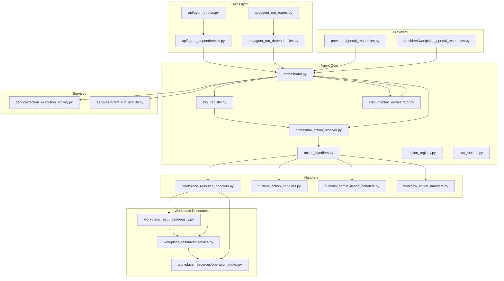
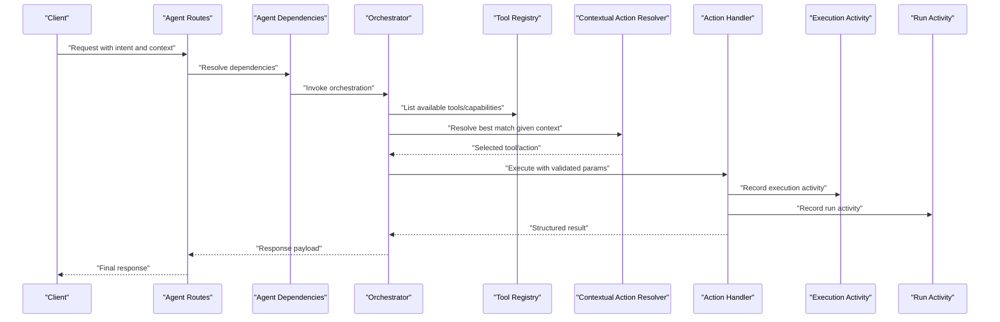
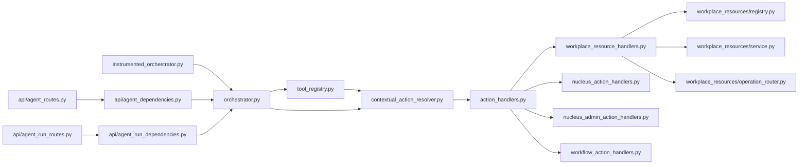
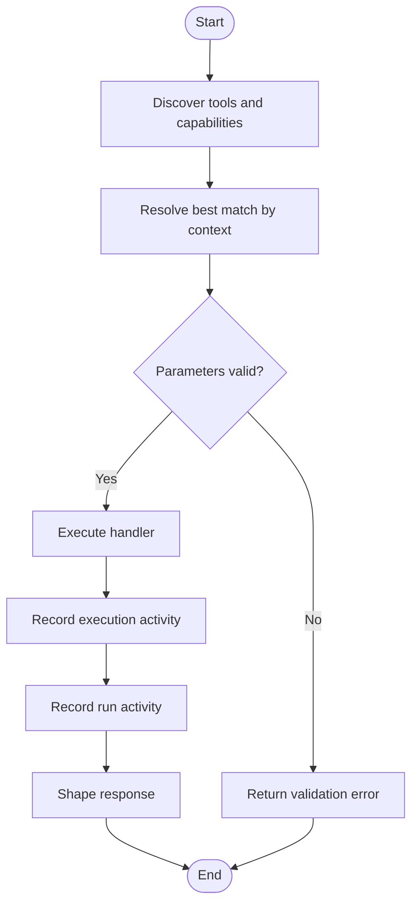

# Tool Registry & Capability Discovery

<cite>
**Referenced Files in This Document**
- [app/agent/tool_registry.py](file://app/agent/tool_registry.py)
- [app/agent/contextual_action_resolver.py](file://app/agent/contextual_action_resolver.py)
- [app/agent/action_handlers.py](file://app/agent/action_handlers.py)
- [app/agent/action_registry.py](file://app/agent/action_registry.py)
- [app/agent/orchestrator.py](file://app/agent/orchestrator.py)
- [app/agent/instrumented_orchestrator.py](file://app/agent/instrumented_orchestrator.py)
- [app/agent/workplace_resource_handlers.py](file://app/agent/workplace_resource_handlers.py)
- [app/agent/nucleus_action_handlers.py](file://app/agent/nucleus_action_handlers.py)
- [app/agent/nucleus_admin_action_handlers.py](file://app/agent/nucleus_admin_action_handlers.py)
- [app/agent/workflow_action_handlers.py](file://app/agent/workflow_action_handlers.py)
- [app/agent/action_errors.py](file://app/agent/action_errors.py)
- [app/agent/errors.py](file://app/agent/errors.py)
- [app/agent/run_runtime.py](file://app/agent/run_runtime.py)
- [app/agent/action_contracts.py](file://app/agent/action_contracts.py)
- [app/agent/action_control_contracts.py](file://app/agent/action_control_contracts.py)
- [app/agent/response_service.py](file://app/agent/response_service.py)
- [app/agent/synthesis.py](file://app/agent/synthesis.py)
- [app/agent/providers/openai_responses.py](file://app/agent/providers/openai_responses.py)
- [app/agent/providers/workplace_openai_responses.py](file://app/agent/providers/workplace_openai_responses.py)
- [app/api/agent_routes.py](file://app/api/agent_routes.py)
- [app/api/agent_run_routes.py](file://app/api/agent_run_routes.py)
- [app/api/agent_dependencies.py](file://app/api/agent_dependencies.py)
- [app/api/agent_run_dependencies.py](file://app/api/agent_run_dependencies.py)
- [app/core/security.py](file://app/core/security.py)
- [app/core/config.py](file://app/core/config.py)
- [app/services/action_execution_activity.py](file://app/services/action_execution_activity.py)
- [app/services/agent_run_activity.py](file://app/services/agent_run_activity.py)
- [app/workplace_resources/registry.py](file://app/workplace_resources/registry.py)
- [app/workplace_resources/service.py](file://app/workplace_resources/service.py)
- [app/workplace_resources/operation_router.py](file://app/workplace_resources/operation_router.py)
- [tests/test_contextual_seat_actions.py](file://tests/test_contextual_seat_actions.py)
- [tests/test_workplace_resource_registry.py](file://tests/test_workplace_resource_registry.py)
</cite>

## Table of Contents
1. [Introduction](#introduction)
2. [Project Structure](#project-structure)
3. [Core Components](#core-components)
4. [Architecture Overview](#architecture-overview)
5. [Detailed Component Analysis](#detailed-component-analysis)
6. [Dependency Analysis](#dependency-analysis)
7. [Performance Considerations](#performance-considerations)
8. [Troubleshooting Guide](#troubleshooting-guide)
9. [Conclusion](#conclusion)
10. [Appendices](#appendices)

## Introduction
This document explains the tool registry system and capability discovery mechanism used by the agent subsystem. It covers how tools are registered, discovered, and resolved at runtime; the action handler pattern for implementing custom tools; parameter validation and error handling; and the contextual action resolver that matches available tools to user requests based on context and capabilities. It also includes guidance on creating new tools, defining schemas, handling execution flows, versioning, dependency management, and security considerations.

## Project Structure
The tooling and capability discovery logic is primarily implemented under app/agent with supporting components in app/workplace_resources and integration points in app/api and app/services. The following diagram shows the high-level structure relevant to tool registration and discovery.

**Diagram sources**
- [app/agent/tool_registry.py](file://app/agent/tool_registry.py)
- [app/agent/contextual_action_resolver.py](file://app/agent/contextual_action_resolver.py)
- [app/agent/action_handlers.py](file://app/agent/action_handlers.py)
- [app/agent/action_registry.py](file://app/agent/action_registry.py)
- [app/agent/orchestrator.py](file://app/agent/orchestrator.py)
- [app/agent/instrumented_orchestrator.py](file://app/agent/instrumented_orchestrator.py)
- [app/agent/workplace_resource_handlers.py](file://app/agent/workplace_resource_handlers.py)
- [app/agent/nucleus_action_handlers.py](file://app/agent/nucleus_action_handlers.py)
- [app/agent/nucleus_admin_action_handlers.py](file://app/agent/nucleus_admin_action_handlers.py)
- [app/agent/workflow_action_handlers.py](file://app/agent/workflow_action_handlers.py)
- [app/workplace_resources/registry.py](file://app/workplace_resources/registry.py)
- [app/workplace_resources/service.py](file://app/workplace_resources/service.py)
- [app/workplace_resources/operation_router.py](file://app/workplace_resources/operation_router.py)
- [app/api/agent_routes.py](file://app/api/agent_routes.py)
- [app/api/agent_run_routes.py](file://app/api/agent_run_routes.py)
- [app/api/agent_dependencies.py](file://app/api/agent_dependencies.py)
- [app/api/agent_run_dependencies.py](file://app/api/agent_run_dependencies.py)
- [app/services/action_execution_activity.py](file://app/services/action_execution_activity.py)
- [app/services/agent_run_activity.py](file://app/services/agent_run_activity.py)
- [app/agent/providers/openai_responses.py](file://app/agent/providers/openai_responses.py)
- [app/agent/providers/workplace_openai_responses.py](file://app/agent/providers/workplace_openai_responses.py)

**Section sources**
- [app/agent/tool_registry.py](file://app/agent/tool_registry.py)
- [app/agent/contextual_action_resolver.py](file://app/agent/contextual_action_resolver.py)
- [app/agent/action_handlers.py](file://app/agent/action_handlers.py)
- [app/agent/orchestrator.py](file://app/agent/orchestrator.py)
- [app/agent/instrumented_orchestrator.py](file://app/agent/instrumented_orchestrator.py)
- [app/agent/workplace_resource_handlers.py](file://app/agent/workplace_resource_handlers.py)
- [app/agent/nucleus_action_handlers.py](file://app/agent/nucleus_action_handlers.py)
- [app/agent/nucleus_admin_action_handlers.py](file://app/agent/nucleus_admin_action_handlers.py)
- [app/agent/workflow_action_handlers.py](file://app/agent/workflow_action_handlers.py)
- [app/workplace_resources/registry.py](file://app/workplace_resources/registry.py)
- [app/workplace_resources/service.py](file://app/workplace_resources/service.py)
- [app/workplace_resources/operation_router.py](file://app/workplace_resources/operation_router.py)
- [app/api/agent_routes.py](file://app/api/agent_routes.py)
- [app/api/agent_run_routes.py](file://app/api/agent_run_routes.py)
- [app/api/agent_dependencies.py](file://app/api/agent_dependencies.py)
- [app/api/agent_run_dependencies.py](file://app/api/agent_run_dependencies.py)
- [app/services/action_execution_activity.py](file://app/services/action_execution_activity.py)
- [app/services/agent_run_activity.py](file://app/services/agent_run_activity.py)
- [app/agent/providers/openai_responses.py](file://app/agent/providers/openai_responses.py)
- [app/agent/providers/workplace_openai_responses.py](file://app/agent/providers/workplace_openai_responses.py)

## Core Components
- Tool Registry: Centralizes registration, lookup, and metadata exposure for tools and actions.
- Contextual Action Resolver: Matches a user request to an appropriate tool/action using context (e.g., seat, organization, domain) and declared capabilities.
- Action Handlers: Implementations of specific tool behaviors (workplace resources, nucleus operations, admin operations, workflows).
- Orchestrator and Instrumentation: Coordinates selection, execution, and observability of actions.
- Runtime and Contracts: Provides execution context, typed contracts, and response shaping.
- Workplace Resource Integration: Bridges tool handlers to workplace resource registries and services.

Key responsibilities:
- Registration: Tools declare their name, schema, capabilities, and handler references.
- Discovery: At startup or runtime, the registry exposes available tools and their capabilities.
- Resolution: Given a request and context, the resolver selects the best matching tool/action.
- Execution: The orchestrator invokes the selected handler with validated parameters and returns structured results.

**Section sources**
- [app/agent/tool_registry.py](file://app/agent/tool_registry.py)
- [app/agent/contextual_action_resolver.py](file://app/agent/contextual_action_resolver.py)
- [app/agent/action_handlers.py](file://app/agent/action_handlers.py)
- [app/agent/orchestrator.py](file://app/agent/orchestrator.py)
- [app/agent/instrumented_orchestrator.py](file://app/agent/instrumented_orchestrator.py)
- [app/agent/run_runtime.py](file://app/agent/run_runtime.py)
- [app/agent/action_contracts.py](file://app/agent/action_contracts.py)
- [app/agent/action_control_contracts.py](file://app/agent/action_control_contracts.py)
- [app/agent/response_service.py](file://app/agent/response_service.py)
- [app/workplace_resources/registry.py](file://app/workplace_resources/registry.py)
- [app/workplace_resources/service.py](file://app/workplace_resources/service.py)
- [app/workplace_resources/operation_router.py](file://app/workplace_resources/operation_router.py)

## Architecture Overview
The architecture follows a layered approach: API routes depend on dependencies that wire up the orchestrator; the orchestrator uses the tool registry and contextual resolver to select and execute actions; handlers implement business logic and may delegate to workplace resources or external providers.

**Diagram sources**
- [app/api/agent_routes.py](file://app/api/agent_routes.py)
- [app/api/agent_run_routes.py](file://app/api/agent_run_routes.py)
- [app/api/agent_dependencies.py](file://app/api/agent_dependencies.py)
- [app/api/agent_run_dependencies.py](file://app/api/agent_run_dependencies.py)
- [app/agent/orchestrator.py](file://app/agent/orchestrator.py)
- [app/agent/tool_registry.py](file://app/agent/tool_registry.py)
- [app/agent/contextual_action_resolver.py](file://app/agent/contextual_action_resolver.py)
- [app/agent/action_handlers.py](file://app/agent/action_handlers.py)
- [app/services/action_execution_activity.py](file://app/services/action_execution_activity.py)
- [app/services/agent_run_activity.py](file://app/services/agent_run_activity.py)

## Detailed Component Analysis

### Tool Registry
Responsibilities:
- Register tools/actions with metadata (name, version, description, schema, capabilities).
- Provide discovery endpoints for listing available tools and filtering by capabilities.
- Support versioned registrations and precedence rules.

Design patterns:
- Central registry with explicit registration functions.
- Capability-based indexing for fast filtering.
- Version-aware resolution when multiple implementations exist.

Usage:
- Handlers register themselves during application bootstrap.
- The orchestrator queries the registry to enumerate options before resolution.

**Section sources**
- [app/agent/tool_registry.py](file://app/agent/tool_registry.py)
- [app/agent/action_registry.py](file://app/agent/action_registry.py)

### Contextual Action Resolver
Responsibilities:
- Match a user request to a suitable tool/action based on:
  - Declared capabilities
  - Request context (seat, organization, domain, permissions)
  - Parameter compatibility
- Return a ranked list or the best match.

Resolution strategy:
- Filter candidates by capability intersection with context.
- Score candidates by specificity and relevance.
- Apply precedence rules (e.g., more specific handlers win).

Error handling:
- If no match, return a clear “no suitable tool” signal for fallback or clarification.

**Section sources**
- [app/agent/contextual_action_resolver.py](file://app/agent/contextual_action_resolver.py)

### Action Handler Pattern
Responsibilities:
- Implement discrete tool behaviors.
- Validate inputs against declared schemas.
- Produce standardized outputs and errors.
- Emit execution and run activities for observability.

Implementation guidelines:
- Define a handler class or function with a consistent interface.
- Use typed contracts for input/output.
- Raise domain-specific errors for invalid states or authorization failures.
- Integrate with execution/run activity services for auditing.

Examples of handler families:
- Workplace resource handlers
- Nucleus operation handlers
- Nucleus admin operation handlers
- Workflow action handlers

**Section sources**
- [app/agent/action_handlers.py](file://app/agent/action_handlers.py)
- [app/agent/workplace_resource_handlers.py](file://app/agent/workplace_resource_handlers.py)
- [app/agent/nucleus_action_handlers.py](file://app/agent/nucleus_action_handlers.py)
- [app/agent/nucleus_admin_action_handlers.py](file://app/agent/nucleus_admin_action_handlers.py)
- [app/agent/workflow_action_handlers.py](file://app/agent/workflow_action_handlers.py)
- [app/agent/action_contracts.py](file://app/agent/action_contracts.py)
- [app/agent/action_control_contracts.py](file://app/agent/action_control_contracts.py)
- [app/services/action_execution_activity.py](file://app/services/action_execution_activity.py)
- [app/services/agent_run_activity.py](file://app/services/agent_run_activity.py)

### Orchestrator and Instrumentation
Responsibilities:
- Coordinate discovery, resolution, and execution.
- Wrap execution with instrumentation for metrics and tracing.
- Manage lifecycle events and state transitions.

Instrumentation:
- Records start/end times, outcomes, and error codes.
- Integrates with run activity to correlate across runs.

**Section sources**
- [app/agent/orchestrator.py](file://app/agent/orchestrator.py)
- [app/agent/instrumented_orchestrator.py](file://app/agent/instrumented_orchestrator.py)
- [app/services/agent_run_activity.py](file://app/services/agent_run_activity.py)

### Runtime and Response Shaping
Responsibilities:
- Provide execution context (user, organization, seat).
- Shape responses into standard formats.
- Bridge between handlers and higher-level services.

**Section sources**
- [app/agent/run_runtime.py](file://app/agent/run_runtime.py)
- [app/agent/response_service.py](file://app/agent/response_service.py)

### Provider Integration
Responsibilities:
- Integrate with LLM providers for synthesis and decision-making.
- Supply provider-specific behavior where needed.

**Section sources**
- [app/agent/providers/openai_responses.py](file://app/agent/providers/openai_responses.py)
- [app/agent/providers/workplace_openai_responses.py](file://app/agent/providers/workplace_openai_responses.py)
- [app/agent/synthesis.py](file://app/agent/synthesis.py)

### Workplace Resources Integration
Responsibilities:
- Expose resource operations via handlers.
- Route operations through a centralized router.
- Maintain a registry of resource types and capabilities.

**Section sources**
- [app/workplace_resources/registry.py](file://app/workplace_resources/registry.py)
- [app/workplace_resources/service.py](file://app/workplace_resources/service.py)
- [app/workplace_resources/operation_router.py](file://app/workplace_resources/operation_router.py)
- [app/agent/workplace_resource_handlers.py](file://app/agent/workplace_resource_handlers.py)

## Dependency Analysis
The following diagram highlights key dependencies among core components involved in tool registration and discovery.

**Diagram sources**
- [app/agent/tool_registry.py](file://app/agent/tool_registry.py)
- [app/agent/contextual_action_resolver.py](file://app/agent/contextual_action_resolver.py)
- [app/agent/action_handlers.py](file://app/agent/action_handlers.py)
- [app/agent/workplace_resource_handlers.py](file://app/agent/workplace_resource_handlers.py)
- [app/agent/nucleus_action_handlers.py](file://app/agent/nucleus_action_handlers.py)
- [app/agent/nucleus_admin_action_handlers.py](file://app/agent/nucleus_admin_action_handlers.py)
- [app/agent/workflow_action_handlers.py](file://app/agent/workflow_action_handlers.py)
- [app/agent/orchestrator.py](file://app/agent/orchestrator.py)
- [app/agent/instrumented_orchestrator.py](file://app/agent/instrumented_orchestrator.py)
- [app/api/agent_routes.py](file://app/api/agent_routes.py)
- [app/api/agent_run_routes.py](file://app/api/agent_run_routes.py)
- [app/api/agent_dependencies.py](file://app/api/agent_dependencies.py)
- [app/api/agent_run_dependencies.py](file://app/api/agent_run_dependencies.py)
- [app/workplace_resources/registry.py](file://app/workplace_resources/registry.py)
- [app/workplace_resources/service.py](file://app/workplace_resources/service.py)
- [app/workplace_resources/operation_router.py](file://app/workplace_resources/operation_router.py)

**Section sources**
- [app/agent/tool_registry.py](file://app/agent/tool_registry.py)
- [app/agent/contextual_action_resolver.py](file://app/agent/contextual_action_resolver.py)
- [app/agent/action_handlers.py](file://app/agent/action_handlers.py)
- [app/agent/orchestrator.py](file://app/agent/orchestrator.py)
- [app/agent/instrumented_orchestrator.py](file://app/agent/instrumented_orchestrator.py)
- [app/api/agent_routes.py](file://app/api/agent_routes.py)
- [app/api/agent_run_routes.py](file://app/api/agent_run_routes.py)
- [app/api/agent_dependencies.py](file://app/api/agent_dependencies.py)
- [app/api/agent_run_dependencies.py](file://app/api/agent_run_dependencies.py)
- [app/workplace_resources/registry.py](file://app/workplace_resources/registry.py)
- [app/workplace_resources/service.py](file://app/workplace_resources/service.py)
- [app/workplace_resources/operation_router.py](file://app/workplace_resources/operation_router.py)

## Performance Considerations
- Prefer capability-based filtering early to reduce candidate set size.
- Cache tool metadata and capability indexes where safe to do so.
- Avoid heavy computations in resolution; defer to handlers for expensive work.
- Use streaming or incremental updates for large result sets.
- Instrument hot paths to identify bottlenecks and measure latency.

[No sources needed since this section provides general guidance]

## Troubleshooting Guide
Common issues and remedies:
- No tool matched: Ensure capabilities align with context and that handlers are registered. Verify precedence rules if multiple candidates exist.
- Parameter validation failures: Confirm schema definitions match actual payloads. Check required fields and types.
- Authorization errors: Review permission checks and ensure the current seat/user has necessary scopes.
- Execution timeouts: Inspect instrumentation logs and run activity for long-running steps. Consider breaking tasks into smaller actions.
- Provider errors: Validate configuration and credentials for LLM providers. Handle transient errors with retries where appropriate.

Relevant modules for diagnostics:
- Error types and exceptions
- Execution and run activity logging
- Response shaping utilities

**Section sources**
- [app/agent/action_errors.py](file://app/agent/action_errors.py)
- [app/agent/errors.py](file://app/agent/errors.py)
- [app/services/action_execution_activity.py](file://app/services/action_execution_activity.py)
- [app/services/agent_run_activity.py](file://app/services/agent_run_activity.py)
- [app/agent/response_service.py](file://app/agent/response_service.py)

## Conclusion
The tool registry and capability discovery system enables flexible, context-aware tool selection and execution. By registering tools with rich metadata and capabilities, and by resolving them against runtime context, the system supports extensibility, versioning, and secure execution. Following the action handler pattern ensures consistency, testability, and observability across all tools.

[No sources needed since this section summarizes without analyzing specific files]

## Appendices

### Creating a New Tool
Steps:
- Define a handler implementing the expected interface.
- Declare tool metadata: name, version, description, schema, and capabilities.
- Register the tool with the registry during application bootstrap.
- Add tests to validate discovery, resolution, and execution.

References:
- Handler implementation patterns
- Registry registration APIs
- Schema definition conventions

**Section sources**
- [app/agent/action_handlers.py](file://app/agent/action_handlers.py)
- [app/agent/tool_registry.py](file://app/agent/tool_registry.py)
- [app/agent/action_contracts.py](file://app/agent/action_contracts.py)

### Defining Tool Schemas
Guidelines:
- Use typed contracts for inputs and outputs.
- Include required fields, constraints, and examples.
- Align schemas with validation logic in handlers.

**Section sources**
- [app/agent/action_contracts.py](file://app/agent/action_contracts.py)
- [app/agent/action_control_contracts.py](file://app/agent/action_control_contracts.py)

### Handling Tool Execution Flows
Flow overview:
- Resolve best-matching tool from registry using context.
- Validate parameters against schema.
- Execute handler with execution and run activity tracking.
- Return structured response.

**Diagram sources**
- [app/agent/contextual_action_resolver.py](file://app/agent/contextual_action_resolver.py)
- [app/agent/tool_registry.py](file://app/agent/tool_registry.py)
- [app/agent/action_handlers.py](file://app/agent/action_handlers.py)
- [app/services/action_execution_activity.py](file://app/services/action_execution_activity.py)
- [app/services/agent_run_activity.py](file://app/services/agent_run_activity.py)
- [app/agent/response_service.py](file://app/agent/response_service.py)

### Tool Versioning and Precedence
Recommendations:
- Include a version field in tool metadata.
- Prefer newer versions unless explicitly pinned.
- Allow capability overrides for backward-compatible changes.
- Test upgrades with integration scenarios.

**Section sources**
- [app/agent/tool_registry.py](file://app/agent/tool_registry.py)

### Dependency Management
Guidelines:
- Keep handler dependencies minimal and injectable.
- Use service abstractions for external systems.
- Mock dependencies in tests for isolation.

**Section sources**
- [app/agent/workplace_resource_handlers.py](file://app/agent/workplace_resource_handlers.py)
- [app/workplace_resources/service.py](file://app/workplace_resources/service.py)

### Security Considerations
- Enforce least privilege per tool via capabilities and seat/organization scoping.
- Validate all inputs strictly against schemas.
- Audit execution via activity services.
- Restrict sensitive operations behind admin or elevated seats.
- Sanitize outputs and avoid leaking internal details.

**Section sources**
- [app/core/security.py](file://app/core/security.py)
- [app/agent/action_errors.py](file://app/agent/action_errors.py)
- [app/services/action_execution_activity.py](file://app/services/action_execution_activity.py)

### Example Scenarios
- Create a new workplace resource action:
  - Implement handler in workplace resource handlers.
  - Register with registry and define capabilities.
  - Wire into operation router if needed.
- Admin-only operation:
  - Implement in nucleus admin handlers.
  - Gate access via seat/role checks.
- Workflow-triggered action:
  - Implement in workflow handlers.
  - Ensure idempotency and proper rollback semantics.

**Section sources**
- [app/agent/workplace_resource_handlers.py](file://app/agent/workplace_resource_handlers.py)
- [app/agent/nucleus_admin_action_handlers.py](file://app/agent/nucleus_admin_action_handlers.py)
- [app/agent/workflow_action_handlers.py](file://app/agent/workflow_action_handlers.py)
- [app/workplace_resources/operation_router.py](file://app/workplace_resources/operation_router.py)

### Tests and Validation
Useful tests:
- Contextual seat actions resolution
- Workplace resource registry behavior

**Section sources**
- [tests/test_contextual_seat_actions.py](file://tests/test_contextual_seat_actions.py)
- [tests/test_workplace_resource_registry.py](file://tests/test_workplace_resource_registry.py)