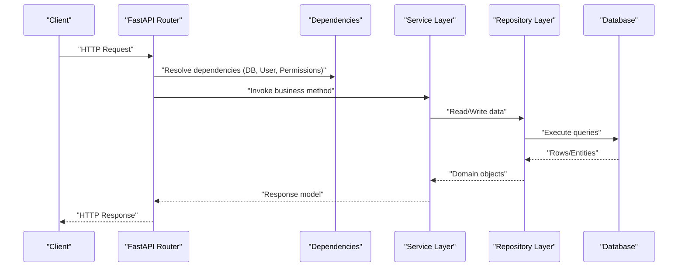
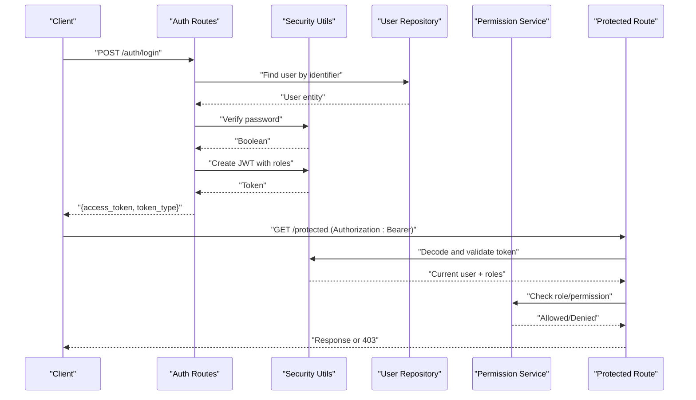
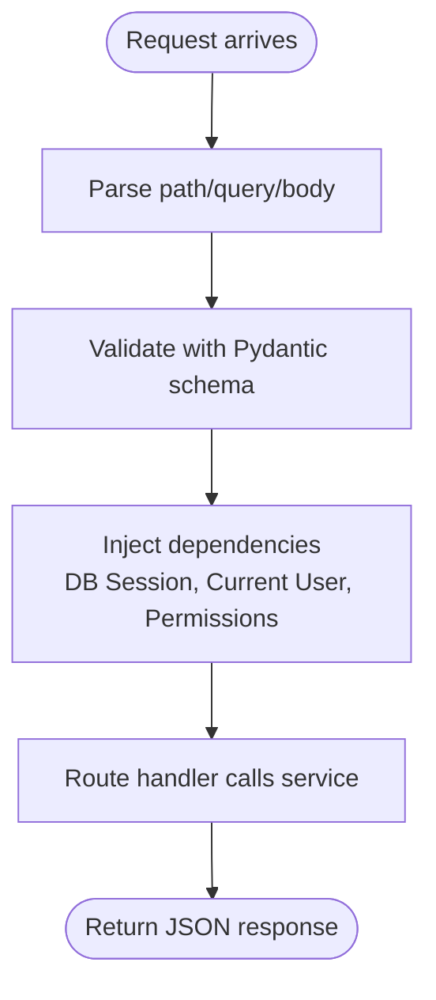
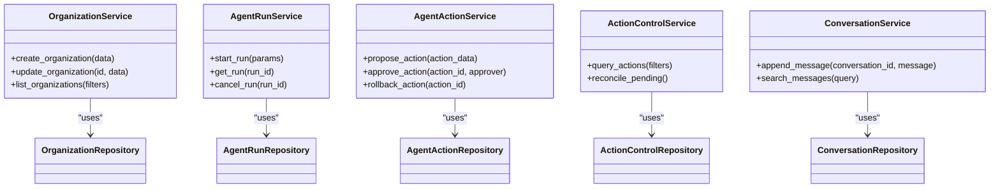
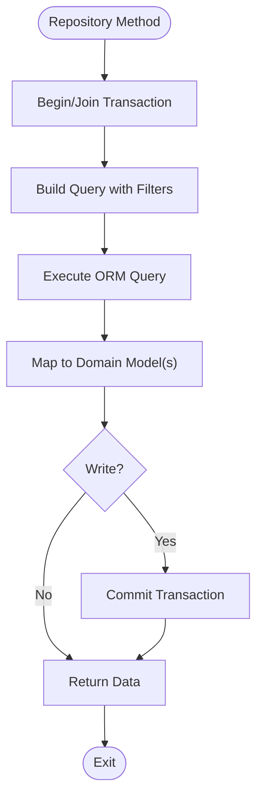
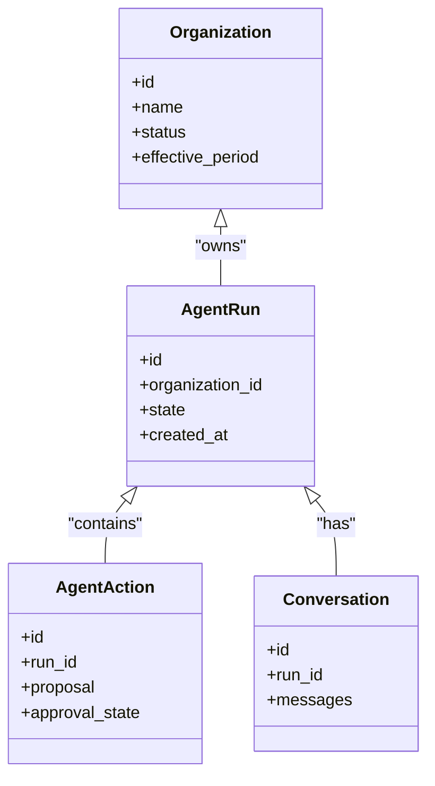
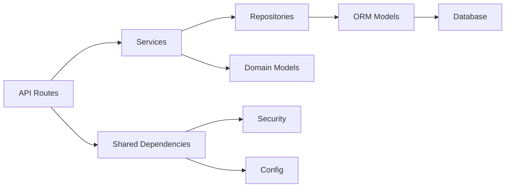

# Backend Development

<cite>
**Referenced Files in This Document**
- [main.py](file://app/main.py)
- [config.py](file://app/core/config.py)
- [security.py](file://app/core/security.py)
- [errors.py](file://app/core/errors.py)
- [dependencies.py](file://app/api/dependencies.py)
- [auth_routes.py](file://app/api/auth_routes.py)
- [agent_routes.py](file://app/api/agent_routes.py)
- [action_control_routes.py](file://app/api/action_control_routes.py)
- [conversation_routes.py](file://app/api/conversation_routes.py)
- [workplace_routes.py](file://app/api/workplace_routes.py)
- [nucleus_routes.py](file://app/api/nucleus_routes.py)
- [health_routes.py](file://app/api/health_routes.py)
- [session.py](file://app/db/session.py)
- [base.py](file://app/db/base.py)
- [orm_models.py](file://app/db/orm_models.py)
- [user_repository.py](file://app/repositories/user_repository.py)
- [organization_repository.py](file://app/repositories/organization_repository.py)
- [agent_run_repository.py](file://app/repositories/agent_run_repository.py)
- [agent_action_repository.py](file://app/repositories/agent_action_repository.py)
- [action_control_repository.py](file://app/repositories/action_control_repository.py)
- [conversation_repository.py](file://app/repositories/conversation_repository.py)
- [organization_service.py](file://app/services/organization_service.py)
- [agent_run_service.py](file://app/services/agent_run_service.py)
- [agent_action_service.py](file://app/services/agent_action_service.py)
- [action_control_service.py](file://app/services/action_control_service.py)
- [conversation_service.py](file://app/services/conversation_service.py)
- [permission_service.py](file://app/permissions/permission_service.py)
- [pyproject.toml](file://pyproject.toml)
</cite>

## Table of Contents
1. [Introduction](#introduction)
2. [Project Structure](#project-structure)
3. [Core Components](#core-components)
4. [Architecture Overview](#architecture-overview)
5. [Detailed Component Analysis](#detailed-component-analysis)
6. [Dependency Analysis](#dependency-analysis)
7. [Performance Considerations](#performance-considerations)
8. [Troubleshooting Guide](#troubleshooting-guide)
9. [Conclusion](#conclusion)
10. [Appendices](#appendices)

## Introduction
This document provides comprehensive backend development guidance for the Python/FastAPI application. It covers application bootstrap, middleware configuration, dependency injection, layered architecture (API routes, services, repositories, domain models), authentication and authorization with JWT and role-based access control, error handling, logging, monitoring, testing strategies, and practical guidelines for extending the system with new endpoints, business logic, and data access layers.

## Project Structure
The backend follows a clear layered architecture:
- API layer: FastAPI routers and request/response schemas
- Service layer: Business orchestration and cross-cutting concerns
- Repository layer: Data access abstractions over ORM models
- Domain layer: Core entities, enums, and policy definitions
- Infrastructure: Database session, migrations, adapters, and external integrations

```mermaid
graph TB
subgraph "API Layer"
A1["api/auth_routes.py"]
A2["api/agent_routes.py"]
A3["api/action_control_routes.py"]
A4["api/conversation_routes.py"]
A5["api/workplace_routes.py"]
A6["api/nucleus_routes.py"]
A7["api/health_routes.py"]
end
subgraph "Service Layer"
S1["services/organization_service.py"]
S2["services/agent_run_service.py"]
S3["services/agent_action_service.py"]
S4["services/action_control_service.py"]
S5["services/conversation_service.py"]
end
subgraph "Repository Layer"
R1["repositories/user_repository.py"]
R2["repositories/organization_repository.py"]
R3["repositories/agent_run_repository.py"]
R4["repositories/agent_action_repository.py"]
R5["repositories/action_control_repository.py"]
R6["repositories/conversation_repository.py"]
end
subgraph "Domain Models"
D1["domain/models.py"]
D2["domain/enums.py"]
D3["domain/nucleus_models.py"]
D4["domain/nucleus_admin_models.py"]
D5["domain/effective_period.py"]
D6["domain/nucleus_policy.py"]
end
subgraph "Infrastructure"
I1["db/session.py"]
I2["db/base.py"]
I3["db/orm_models.py"]
I4["core/config.py"]
I5["core/security.py"]
I6["core/errors.py"]
I7["api/dependencies.py"]
end
A1 --> S1
A2 --> S2
A3 --> S4
A4 --> S5
A5 --> S1
A6 --> S1
A7 --> I4
S1 --> R2
S2 --> R3
S3 --> R4
S4 --> R5
S5 --> R6
R1 --> I3
R2 --> I3
R3 --> I3
R4 --> I3
R5 --> I3
R6 --> I3
S1 -. uses .-> D1
S2 -. uses .-> D1
S3 -. uses .-> D1
S4 -. uses .-> D1
S5 -. uses .-> D1
I1 --> I2
I3 --> I2
I5 --> I4
I7 --> I5
```

**Diagram sources**
- [main.py:1-200](file://app/main.py#L1-L200)
- [auth_routes.py:1-200](file://app/api/auth_routes.py#L1-L200)
- [agent_routes.py:1-200](file://app/api/agent_routes.py#L1-L200)
- [action_control_routes.py:1-200](file://app/api/action_control_routes.py#L1-L200)
- [conversation_routes.py:1-200](file://app/api/conversation_routes.py#L1-L200)
- [workplace_routes.py:1-200](file://app/api/workplace_routes.py#L1-L200)
- [nucleus_routes.py:1-200](file://app/api/nucleus_routes.py#L1-L200)
- [health_routes.py:1-200](file://app/api/health_routes.py#L1-L200)
- [organization_service.py:1-200](file://app/services/organization_service.py#L1-L200)
- [agent_run_service.py:1-200](file://app/services/agent_run_service.py#L1-L200)
- [agent_action_service.py:1-200](file://app/services/agent_action_service.py#L1-L200)
- [action_control_service.py:1-200](file://app/services/action_control_service.py#L1-L200)
- [conversation_service.py:1-200](file://app/services/conversation_service.py#L1-L200)
- [user_repository.py:1-200](file://app/repositories/user_repository.py#L1-L200)
- [organization_repository.py:1-200](file://app/repositories/organization_repository.py#L1-L200)
- [agent_run_repository.py:1-200](file://app/repositories/agent_run_repository.py#L1-L200)
- [agent_action_repository.py:1-200](file://app/repositories/agent_action_repository.py#L1-L200)
- [action_control_repository.py:1-200](file://app/repositories/action_control_repository.py#L1-L200)
- [conversation_repository.py:1-200](file://app/repositories/conversation_repository.py#L1-L200)
- [models.py](file://app/domain/models.py)
- [enums.py](file://app/domain/enums.py)
- [nucleus_models.py](file://app/domain/nucleus_models.py)
- [nucleus_admin_models.py](file://app/domain/nucleus_admin_models.py)
- [effective_period.py](file://app/domain/effective_period.py)
- [nucleus_policy.py](file://app/domain/nucleus_policy.py)
- [session.py](file://app/db/session.py)
- [base.py](file://app/db/base.py)
- [orm_models.py](file://app/db/orm_models.py)
- [config.py](file://app/core/config.py)
- [security.py](file://app/core/security.py)
- [errors.py](file://app/core/errors.py)
- [dependencies.py](file://app/api/dependencies.py)

**Section sources**
- [main.py:1-200](file://app/main.py#L1-L200)
- [pyproject.toml:1-200](file://pyproject.toml#L1-L200)

## Core Components
- Application bootstrap and lifecycle: The FastAPI app is created, configured with settings from environment via a centralized config module, and mounts routers for each feature area. Startup/shutdown events initialize resources such as database sessions and background workers.
- Middleware configuration: Cross-cutting concerns like security headers, CORS, request ID propagation, and performance monitoring are applied at the app level before route registration.
- Dependency injection: Reusable dependencies provide authenticated users, database sessions, service instances, and permission evaluators to route handlers.
- Error handling: Centralized exception handlers map domain and infrastructure errors to consistent HTTP responses.
- Logging and monitoring: Structured logging is configured with correlation IDs; metrics and tracing hooks are integrated via middleware and service instrumentation points.

Key implementation references:
- App creation and router mounting: [main.py](file://app/main.py)
- Configuration loading: [config.py](file://app/core/config.py)
- Security utilities (JWT, password hashing): [security.py](file://app/core/security.py)
- Exception types and handlers: [errors.py](file://app/core/errors.py)
- Shared dependencies (DB session, current user, permissions): [dependencies.py](file://app/api/dependencies.py)

**Section sources**
- [main.py:1-200](file://app/main.py#L1-L200)
- [config.py:1-200](file://app/core/config.py#L1-L200)
- [security.py:1-200](file://app/core/security.py#L1-L200)
- [errors.py:1-200](file://app/core/errors.py#L1-L200)
- [dependencies.py:1-200](file://app/api/dependencies.py#L1-L200)

## Architecture Overview
The system adheres to a layered pattern:
- API routes receive requests, validate inputs using Pydantic schemas, and delegate to services.
- Services implement business logic, orchestrate multiple repositories, enforce policies, and return domain or response models.
- Repositories encapsulate all persistence operations against SQLAlchemy ORM models.
- Domain models define core entities, enumerations, and policy rules independent of persistence details.

**Diagram sources**
- [auth_routes.py:1-200](file://app/api/auth_routes.py#L1-L200)
- [agent_routes.py:1-200](file://app/api/agent_routes.py#L1-L200)
- [action_control_routes.py:1-200](file://app/api/action_control_routes.py#L1-L200)
- [conversation_routes.py:1-200](file://app/api/conversation_routes.py#L1-L200)
- [workplace_routes.py:1-200](file://app/api/workplace_routes.py#L1-L200)
- [nucleus_routes.py:1-200](file://app/api/nucleus_routes.py#L1-L200)
- [health_routes.py:1-200](file://app/api/health_routes.py#L1-L200)
- [organization_service.py:1-200](file://app/services/organization_service.py#L1-L200)
- [agent_run_service.py:1-200](file://app/services/agent_run_service.py#L1-L200)
- [agent_action_service.py:1-200](file://app/services/agent_action_service.py#L1-L200)
- [action_control_service.py:1-200](file://app/services/action_control_service.py#L1-L200)
- [conversation_service.py:1-200](file://app/services/conversation_service.py#L1-L200)
- [user_repository.py:1-200](file://app/repositories/user_repository.py#L1-L200)
- [organization_repository.py:1-200](file://app/repositories/organization_repository.py#L1-L200)
- [agent_run_repository.py:1-200](file://app/repositories/agent_run_repository.py#L1-L200)
- [agent_action_repository.py:1-200](file://app/repositories/agent_action_repository.py#L1-L200)
- [action_control_repository.py:1-200](file://app/repositories/action_control_repository.py#L1-L200)
- [conversation_repository.py:1-200](file://app/repositories/conversation_repository.py#L1-L200)
- [session.py:1-200](file://app/db/session.py#L1-L200)
- [orm_models.py:1-200](file://app/db/orm_models.py#L1-L200)

## Detailed Component Analysis

### Authentication and Authorization (JWT + RBAC)
- Token issuance and validation:
  - Login endpoint authenticates credentials and issues JWT tokens containing user identity and roles.
  - Protected endpoints require a valid token; the current user and roles are injected into handlers via dependencies.
- Role-based access control:
  - Permission checks are enforced by a dedicated permission service and can be composed with route-level guards or dependency-based checks.
- Security utilities:
  - Password hashing and token signing/verification are centralized in the security module.

**Diagram sources**
- [auth_routes.py:1-200](file://app/api/auth_routes.py#L1-L200)
- [security.py:1-200](file://app/core/security.py#L1-L200)
- [user_repository.py:1-200](file://app/repositories/user_repository.py#L1-L200)
- [permission_service.py:1-200](file://app/permissions/permission_service.py#L1-L200)
- [dependencies.py:1-200](file://app/api/dependencies.py#L1-L200)

**Section sources**
- [auth_routes.py:1-200](file://app/api/auth_routes.py#L1-L200)
- [security.py:1-200](file://app/core/security.py#L1-L200)
- [permission_service.py:1-200](file://app/permissions/permission_service.py#L1-L200)
- [dependencies.py:1-200](file://app/api/dependencies.py#L1-L200)

### API Layer: Routes and Dependencies
- Route organization:
  - Feature-specific routers: auth, agent runs, actions, conversations, workplace resources, nucleus admin, health.
- Request validation:
  - Pydantic schemas define input/output contracts for each endpoint.
- Dependency usage:
  - Database sessions, current user, and permission evaluators are provided via shared dependencies.

**Diagram sources**
- [agent_routes.py:1-200](file://app/api/agent_routes.py#L1-L200)
- [action_control_routes.py:1-200](file://app/api/action_control_routes.py#L1-L200)
- [conversation_routes.py:1-200](file://app/api/conversation_routes.py#L1-L200)
- [workplace_routes.py:1-200](file://app/api/workplace_routes.py#L1-L200)
- [nucleus_routes.py:1-200](file://app/api/nucleus_routes.py#L1-L200)
- [health_routes.py:1-200](file://app/api/health_routes.py#L1-L200)
- [dependencies.py:1-200](file://app/api/dependencies.py#L1-L200)

**Section sources**
- [agent_routes.py:1-200](file://app/api/agent_routes.py#L1-L200)
- [action_control_routes.py:1-200](file://app/api/action_control_routes.py#L1-L200)
- [conversation_routes.py:1-200](file://app/api/conversation_routes.py#L1-L200)
- [workplace_routes.py:1-200](file://app/api/workplace_routes.py#L1-L200)
- [nucleus_routes.py:1-200](file://app/api/nucleus_routes.py#L1-L200)
- [health_routes.py:1-200](file://app/api/health_routes.py#L1-L200)
- [dependencies.py:1-200](file://app/api/dependencies.py#L1-L200)

### Service Layer: Business Orchestration
Responsibilities:
- Implement use cases across multiple aggregates (e.g., agent run lifecycle, action proposals, approvals).
- Compose repository calls and apply domain policies.
- Emit structured logs and metrics for observability.

Examples:
- Organization management: create, update, list organizations and memberships.
- Agent runs: start, monitor, and manage execution state transitions.
- Action control: propose, approve, rollback, and reconcile governed actions.
- Conversations: persist messages and support search/indexing.

**Diagram sources**
- [organization_service.py:1-200](file://app/services/organization_service.py#L1-L200)
- [agent_run_service.py:1-200](file://app/services/agent_run_service.py#L1-L200)
- [agent_action_service.py:1-200](file://app/services/agent_action_service.py#L1-L200)
- [action_control_service.py:1-200](file://app/services/action_control_service.py#L1-L200)
- [conversation_service.py:1-200](file://app/services/conversation_service.py#L1-L200)
- [organization_repository.py:1-200](file://app/repositories/organization_repository.py#L1-L200)
- [agent_run_repository.py:1-200](file://app/repositories/agent_run_repository.py#L1-L200)
- [agent_action_repository.py:1-200](file://app/repositories/agent_action_repository.py#L1-L200)
- [action_control_repository.py:1-200](file://app/repositories/action_control_repository.py#L1-L200)
- [conversation_repository.py:1-200](file://app/repositories/conversation_repository.py#L1-L200)

**Section sources**
- [organization_service.py:1-200](file://app/services/organization_service.py#L1-L200)
- [agent_run_service.py:1-200](file://app/services/agent_run_service.py#L1-L200)
- [agent_action_service.py:1-200](file://app/services/agent_action_service.py#L1-L200)
- [action_control_service.py:1-200](file://app/services/action_control_service.py#L1-L200)
- [conversation_service.py:1-200](file://app/services/conversation_service.py#L1-L200)

### Repository Layer: Data Access Abstractions
Responsibilities:
- Encapsulate all SQL operations using SQLAlchemy ORM.
- Provide transactional boundaries and query composition helpers.
- Map between ORM entities and domain models.

Key repositories:
- User, Organization, Agent Run, Agent Action, Action Control, Conversation.

**Diagram sources**
- [user_repository.py:1-200](file://app/repositories/user_repository.py#L1-L200)
- [organization_repository.py:1-200](file://app/repositories/organization_repository.py#L1-L200)
- [agent_run_repository.py:1-200](file://app/repositories/agent_run_repository.py#L1-L200)
- [agent_action_repository.py:1-200](file://app/repositories/agent_action_repository.py#L1-L200)
- [action_control_repository.py:1-200](file://app/repositories/action_control_repository.py#L1-L200)
- [conversation_repository.py:1-200](file://app/repositories/conversation_repository.py#L1-L200)
- [session.py:1-200](file://app/db/session.py#L1-L200)
- [orm_models.py:1-200](file://app/db/orm_models.py#L1-L200)

**Section sources**
- [user_repository.py:1-200](file://app/repositories/user_repository.py#L1-L200)
- [organization_repository.py:1-200](file://app/repositories/organization_repository.py#L1-L200)
- [agent_run_repository.py:1-200](file://app/repositories/agent_run_repository.py#L1-L200)
- [agent_action_repository.py:1-200](file://app/repositories/agent_action_repository.py#L1-L200)
- [action_control_repository.py:1-200](file://app/repositories/action_control_repository.py#L1-L200)
- [conversation_repository.py:1-200](file://app/repositories/conversation_repository.py#L1-L200)
- [session.py:1-200](file://app/db/session.py#L1-L200)
- [orm_models.py:1-200](file://app/db/orm_models.py#L1-L200)

### Domain Models and Policies
- Entities and value objects define the core business concepts used across services and repositories.
- Enumerations capture state machines and allowed transitions.
- Policy modules encode constraints and validations that must be enforced before persistence.

**Diagram sources**
- [models.py](file://app/domain/models.py)
- [enums.py](file://app/domain/enums.py)
- [nucleus_models.py](file://app/domain/nucleus_models.py)
- [nucleus_admin_models.py](file://app/domain/nucleus_admin_models.py)
- [effective_period.py](file://app/domain/effective_period.py)
- [nucleus_policy.py](file://app/domain/nucleus_policy.py)

**Section sources**
- [models.py](file://app/domain/models.py)
- [enums.py](file://app/domain/enums.py)
- [nucleus_models.py](file://app/domain/nucleus_models.py)
- [nucleus_admin_models.py](file://app/domain/nucleus_admin_models.py)
- [effective_period.py](file://app/domain/effective_period.py)
- [nucleus_policy.py](file://app/domain/nucleus_policy.py)

## Dependency Analysis
- Coupling:
  - API routes depend on services and shared dependencies only.
  - Services depend on repositories and domain models.
  - Repositories depend on ORM models and DB session.
- External integrations:
  - Database via SQLAlchemy and Alembic migrations.
  - Optional external providers through adapter interfaces (e.g., user provider, organization contract).
- Circular dependencies:
  - Avoided by strict layering and interface-based contracts where needed.

**Diagram sources**
- [main.py:1-200](file://app/main.py#L1-L200)
- [dependencies.py:1-200](file://app/api/dependencies.py#L1-L200)
- [security.py:1-200](file://app/core/security.py#L1-L200)
- [config.py:1-200](file://app/core/config.py#L1-L200)
- [orm_models.py:1-200](file://app/db/orm_models.py#L1-L200)
- [session.py:1-200](file://app/db/session.py#L1-L200)

**Section sources**
- [main.py:1-200](file://app/main.py#L1-L200)
- [dependencies.py:1-200](file://app/api/dependencies.py#L1-L200)
- [security.py:1-200](file://app/core/security.py#L1-L200)
- [config.py:1-200](file://app/core/config.py#L1-L200)
- [orm_models.py:1-200](file://app/db/orm_models.py#L1-L200)
- [session.py:1-200](file://app/db/session.py#L1-L200)

## Performance Considerations
- Database:
  - Use connection pooling and tune pool sizes based on concurrency.
  - Prefer batched writes and efficient queries; avoid N+1 selects by eager loading when appropriate.
- Caching:
  - Cache read-heavy lookups (e.g., organization metadata) with short TTLs.
- Serialization:
  - Minimize payload size; use selective fields in response schemas.
- Background tasks:
  - Offload long-running work to workers; expose progress/status via SSE or polling endpoints.
- Observability:
  - Add latency histograms and error rates per endpoint; correlate logs with request IDs.

[No sources needed since this section provides general guidance]

## Troubleshooting Guide
- Common errors:
  - Authentication failures: invalid/expired tokens, missing roles.
  - Authorization denials: insufficient permissions for resource scope.
  - Validation errors: malformed request bodies or missing required fields.
  - Database errors: constraint violations, deadlocks, timeouts.
- Debugging steps:
  - Inspect structured logs with correlation IDs.
  - Reproduce with minimal payloads; enable verbose logging for specific components.
  - Check migration status and schema drift.
- Recovery:
  - Retry idempotent operations safely.
  - Rollback failed transactions; alert on persistent failures.

**Section sources**
- [errors.py:1-200](file://app/core/errors.py#L1-L200)
- [security.py:1-200](file://app/core/security.py#L1-L200)
- [session.py:1-200](file://app/db/session.py#L1-L200)

## Conclusion
The backend implements a clean, testable, and extensible FastAPI application with a layered architecture, robust JWT-based authentication and RBAC, centralized error handling, and strong separation of concerns. Following the guidelines below will help you add features consistently and maintain high quality.

## Appendices

### Guidelines: Adding a New API Endpoint
- Define request/response schemas under the relevant feature’s schema module.
- Create a route in the corresponding router file and register it in the main app.
- Implement business logic in a service method; keep routes thin.
- Add repository methods if new data access is required.
- Apply authentication and authorization via dependencies and permission checks.
- Write unit and integration tests covering happy paths and error conditions.

**Section sources**
- [agent_routes.py:1-200](file://app/api/agent_routes.py#L1-L200)
- [agent_run_service.py:1-200](file://app/services/agent_run_service.py#L1-L200)
- [agent_run_repository.py:1-200](file://app/repositories/agent_run_repository.py#L1-L200)
- [dependencies.py:1-200](file://app/api/dependencies.py#L1-L200)

### Guidelines: Implementing Business Logic in Services
- Keep services stateless and focused on a single use case.
- Compose multiple repositories and apply domain policies.
- Log key decisions and outcomes; surface meaningful exceptions.
- Avoid direct ORM usage; rely on repositories for persistence.

**Section sources**
- [organization_service.py:1-200](file://app/services/organization_service.py#L1-L200)
- [action_control_service.py:1-200](file://app/services/action_control_service.py#L1-L200)
- [conversation_service.py:1-200](file://app/services/conversation_service.py#L1-L200)

### Guidelines: Creating Database Repositories
- Use the shared DB session dependency to ensure proper transaction boundaries.
- Map ORM entities to domain models; keep mapping logic close to the repository.
- Provide composable query builders for complex filters.
- Handle unique constraints and optimistic locking where applicable.

**Section sources**
- [user_repository.py:1-200](file://app/repositories/user_repository.py#L1-L200)
- [organization_repository.py:1-200](file://app/repositories/organization_repository.py#L1-L200)
- [session.py:1-200](file://app/db/session.py#L1-L200)
- [orm_models.py:1-200](file://app/db/orm_models.py#L1-L200)

### Testing Strategies
- Unit tests:
  - Test services with mocked repositories and external dependencies.
  - Validate domain logic and policy enforcement.
- Integration tests:
  - Spin up an in-memory or test database; run migrations.
  - Exercise full request flows through FastAPI TestClient.
- Mocking:
  - Replace external providers (e.g., user directory, LLM providers) with deterministic mocks.
- Contract tests:
  - Validate request/response schemas against frontend contracts.

**Section sources**
- [test_agent_api.py](file://tests/test_agent_api.py)
- [test_permissions.py](file://tests/test_permissions.py)
- [test_database_constraints.py](file://tests/test_database_constraints.py)
- [test_frontend_contracts.py](file://tests/test_frontend_contracts.py)