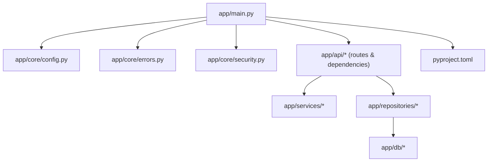
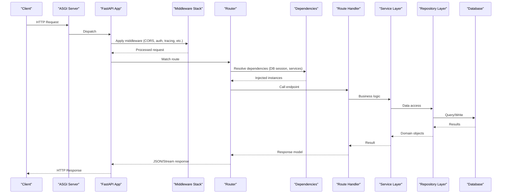
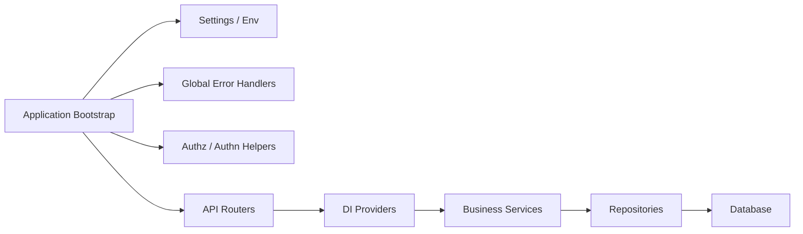

# Core Framework

<cite>
**Referenced Files in This Document**
- [app/main.py](file://app/main.py)
- [app/core/config.py](file://app/core/config.py)
- [app/core/errors.py](file://app/core/errors.py)
- [app/core/security.py](file://app/core/security.py)
- [pyproject.toml](file://pyproject.toml)
</cite>

## Table of Contents
1. [Introduction](#introduction)
2. [Project Structure](#project-structure)
3. [Core Components](#core-components)
4. [Architecture Overview](#architecture-overview)
5. [Detailed Component Analysis](#detailed-component-analysis)
6. [Dependency Analysis](#dependency-analysis)
7. [Performance Considerations](#performance-considerations)
8. [Troubleshooting Guide](#troubleshooting-guide)
9. [Conclusion](#conclusion)
10. [Appendices](#appendices)

## Introduction
This document explains the core FastAPI framework setup and configuration in the project, including application bootstrap, middleware stack, dependency injection, configuration management via environment variables and settings classes, global error handling, logging, and request/response processing. It also provides guidelines for adding middleware, configuring security policies, and extending the framework.

## Project Structure
The backend is organized into feature-oriented packages under app/. The core runtime entrypoint, configuration, errors, and security utilities live in app/ and app/core/. API routes and dependencies are defined under app/api/, while domain logic, repositories, services, and adapters are layered beneath their respective directories.

[No sources needed since this diagram shows conceptual structure]

## Core Components
- Application bootstrap and lifecycle: central FastAPI app creation, startup/shutdown hooks, router registration, and middleware assembly.
- Configuration management: typed settings loaded from environment variables and optional config files.
- Global error handling: standardized exception mapping and response formatting.
- Security: authentication and authorization helpers, token handling, and policy enforcement points.
- Dependency injection: reusable providers for DB sessions, services, and external integrations.

[No sources needed since this section provides general guidance]

## Architecture Overview
High-level flow of an HTTP request through the FastAPI pipeline:

[No sources needed since this diagram shows conceptual workflow]

## Detailed Component Analysis

### Application Bootstrap and Lifecycle
Responsibilities:
- Create the FastAPI application instance with metadata and lifespan events.
- Register routers for each feature area.
- Configure CORS, compression, and other cross-cutting concerns.
- Initialize logging and metrics collectors at startup.
- Graceful shutdown behavior for background tasks and resource cleanup.

Key implementation areas to review:
- Application factory and lifespan hooks.
- Router inclusion and prefixing strategy.
- Middleware ordering and composition.

Guidelines:
- Keep middleware order explicit and documented; place security and validation early.
- Use lifespan context managers for shared resources (e.g., DB pools).
- Avoid heavy work in startup; prefer lazy initialization where safe.

[No sources needed since this section provides general guidance]

### Middleware Stack Configuration
Typical layers:
- Security: authentication, authorization, CSRF protection.
- Validation and normalization: input sanitization, content-type checks.
- Observability: request ID propagation, tracing, audit logging.
- Performance: compression, caching headers, rate limiting.
- Cross-cutting: CORS, proxy forwarding, host validation.

How to add new middleware:
- Implement a callable or class-based middleware conforming to ASGI conventions.
- Insert it at the correct position in the stack to ensure proper ordering.
- Ensure it handles exceptions and does not swallow responses.
- Add tests covering success, failure, and edge cases.

Best practices:
- Keep middleware stateless when possible.
- Log only necessary fields; avoid sensitive data.
- Measure overhead and benchmark critical paths.

[No sources needed since this section provides general guidance]

### Dependency Injection System
Patterns used:
- Reusable providers for database sessions, clients, and services.
- Scoped dependencies per request using FastAPI’s dependency mechanism.
- Test overrides to inject mocks or test doubles.

Common providers:
- Database session provider.
- External service clients (e.g., LLM providers, storage backends).
- Feature flags and configuration objects.

Extending DI:
- Create a new provider function and register it.
- Use Depends() in routes and other dependencies.
- Provide override functions in tests.

[No sources needed since this section provides general guidance]

### Configuration Management (Environment Variables and Settings)
Approach:
- Centralized settings class with typed fields and defaults.
- Loading from environment variables and optional config files.
- Validation at startup to fail fast on misconfiguration.

Recommended fields:
- Runtime toggles (debug, profiling).
- Integrations (database URLs, cache endpoints, third-party keys).
- Security (JWT secrets, allowed origins, token lifetimes).
- Logging and observability (log level, sampling rates).

Validation and safety:
- Validate required values and ranges.
- Mask secrets in logs.
- Separate dev/staging/prod profiles if needed.

[No sources needed since this section provides general guidance]

### Global Error Handling Strategies
Goals:
- Consistent error shapes across APIs.
- Clear client-facing messages with actionable details.
- Rich server-side diagnostics without leaking internals.

Implementation approach:
- Map domain and infrastructure exceptions to HTTP status codes.
- Normalize payloads to include correlation IDs and timestamps.
- Preserve original stack traces in server logs only.

Operational considerations:
- Include request IDs for tracing.
- Avoid returning sensitive information in responses.
- Instrument error rates and categories.

[No sources needed since this section provides general guidance]

### Logging Configuration
Principles:
- Structured logs with consistent fields (request_id, user_id, duration).
- Level-appropriate verbosity by environment.
- Sensitive data redaction.

Recommendations:
- Central logger initialization at startup.
- Contextual loggers per module.
- Integration with distributed tracing where applicable.

[No sources needed since this section provides general guidance]

### Request/Response Processing Pipeline
Flow highlights:
- Input validation via Pydantic models.
- Authorization checks before business logic.
- Output serialization and compression.
- SSE streaming for long-running operations.

Optimization tips:
- Use streaming for large payloads and event streams.
- Cache repeated reads where appropriate.
- Batch database operations to reduce round-trips.

[No sources needed since this section provides general guidance]

### Security Policies
Focus areas:
- Authentication: token issuance, verification, rotation.
- Authorization: role/permission checks, resource scoping.
- Transport security: HTTPS-only, secure cookies, CORS allowlists.
- Secrets management: vault integration, secret rotation.

Guidelines:
- Enforce least privilege.
- Validate all inputs and outputs.
- Audit sensitive actions.

[No sources needed since this section provides general guidance]

## Dependency Analysis
Conceptual relationships between core components:

[No sources needed since this diagram shows conceptual relationships]

## Performance Considerations
- Prefer async handlers for I/O-bound operations.
- Minimize object allocations in hot paths.
- Use connection pooling and query optimization.
- Enable compression selectively for large responses.
- Profile with realistic workloads and monitor latency percentiles.

[No sources needed since this section provides general guidance]

## Troubleshooting Guide
Common issues and resolutions:
- Misconfigured environment variables: validate settings at startup and surface clear errors.
- Middleware ordering problems: verify sequence and ensure exceptions propagate correctly.
- Dependency resolution failures: check provider signatures and scopes.
- Slow endpoints: profile DB queries and external calls; consider caching or batching.
- Inconsistent error formats: confirm global exception mappings cover all domains.

[No sources needed since this section provides general guidance]

## Conclusion
A robust FastAPI foundation hinges on disciplined bootstrapping, explicit middleware ordering, strong DI, validated configuration, centralized error handling, and thoughtful logging. Following the guidelines above will improve reliability, security, and maintainability as the system evolves.

[No sources needed since this section summarizes without analyzing specific files]

## Appendices

### How to Add New Middleware
- Implement ASGI-compatible middleware.
- Register it in the application bootstrap with explicit ordering.
- Add unit and integration tests.
- Document its purpose and side effects.

### How to Configure Security Policies
- Define tokens, roles, and permissions in settings.
- Apply authorization checks in dependencies or middleware.
- Enforce CORS and cookie policies consistently.
- Rotate secrets and audit access.

### Extending Core Framework Functionality
- Create reusable providers and register them in DI.
- Encapsulate cross-cutting logic in middleware or dependencies.
- Maintain backward compatibility and versioned contracts.

[No sources needed since this section provides general guidance]