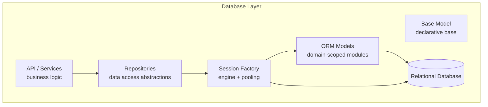
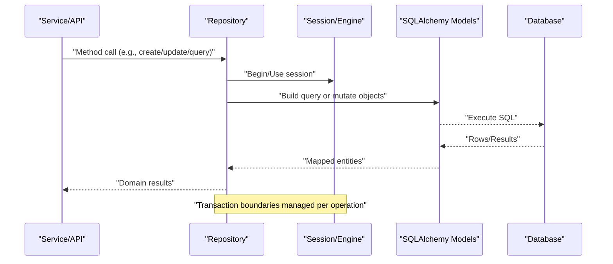
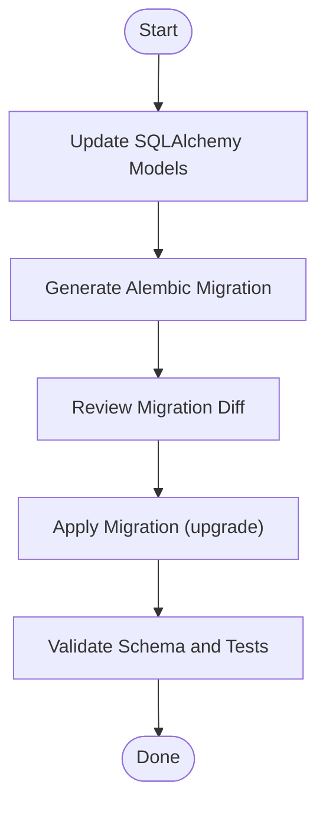
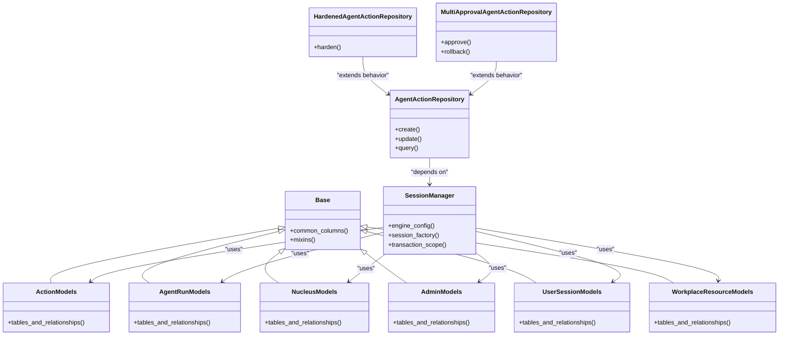

# Database Layer & ORM

<cite>
**Referenced Files in This Document**
- [app/db/base.py](file://app/db/base.py)
- [app/db/session.py](file://app/db/session.py)
- [app/db/orm_models.py](file://app/db/orm_models.py)
- [app/db/action_control_models.py](file://app/db/action_control_models.py)
- [app/db/action_models.py](file://app/db/action_models.py)
- [app/db/agent_run_models.py](file://app/db/agent_run_models.py)
- [app/db/nucleus_models.py](file://app/db/nucleus_models.py)
- [app/db/nucleus_admin_models.py](file://app/db/nucleus_admin_models.py)
- [app/db/nucleus_user_session.py](file://app/db/nucleus_user_session.py)
- [app/db/workplace_resource_models.py](file://app/db/workplace_resource_models.py)
- [alembic/env.py](file://alembic/env.py)
- [alembic/script.py.mako](file://alembic/script.py.mako)
- [alembic/versions/0001_initial.py](file://alembic/versions/0001_initial.py)
- [alembic/versions/0022_compaction_overlays.py](file://alembic/versions/0022_compaction_overlays.py)
- [app/repositories/__init__.py](file://app/repositories/__init__.py)
- [app/repositories/agent_action_repository.py](file://app/repositories/agent_action_repository.py)
- [app/repositories/hardened_agent_action_repository.py](file://app/repositories/hardened_agent_action_repository.py)
- [app/repositories/multi_approval_agent_action_repository.py](file://app/repositories/multi_approval_agent_action_repository.py)
- [app/repositories/conversation_repository.py](file://app/repositories/conversation_repository.py)
- [app/repositories/conversation_search_repository.py](file://app/repositories/conversation_search_repository.py)
- [app/repositories/organization_repository.py](file://app/repositories/organization_repository.py)
- [app/repositories/nucleus_organization_repository.py](file://app/repositories/nucleus_organization_repository.py)
- [app/repositories/nucleus_administration_repository.py](file://app/repositories/nucleus_administration_repository.py)
- [app/repositories/nucleus_actor_mapping_repository.py](file://app/repositories/nucleus_actor_mapping_repository.py)
- [app/repositories/nucleus_administration_projection_repository.py](file://app/repositories/nucleus_administration_projection_repository.py)
- [app/repositories/user_repository.py](file://app/repositories/user_repository.py)
- [app/repositories/seat_repository.py](file://app/repositories/seat_repository.py)
- [app/repositories/report_repository.py](file://app/repositories/report_repository.py)
- [app/repositories/audit_repository.py](file://app/repositories/audit_repository.py)
- [app/repositories/agent_run_repository.py](file://app/repositories/agent_run_repository.py)
- [app/repositories/action_control_repository.py](file://app/repositories/action_control_repository.py)
</cite>

## Table of Contents
1. [Introduction](#introduction)
2. [Project Structure](#project-structure)
3. [Core Components](#core-components)
4. [Architecture Overview](#architecture-overview)
5. [Detailed Component Analysis](#detailed-component-analysis)
6. [Dependency Analysis](#dependency-analysis)
7. [Performance Considerations](#performance-considerations)
8. [Troubleshooting Guide](#troubleshooting-guide)
9. [Conclusion](#conclusion)
10. [Appendices](#appendices)

## Introduction
This document explains the database layer and ORM implementation, focusing on SQLAlchemy model definitions, connection pooling, migration strategy with Alembic, and the repository pattern for clean data access separation. It also covers schema design, indexing strategies, performance optimizations, guidelines for creating new models and repositories, managing migrations, transaction management, concurrency handling, and data integrity constraints.

## Project Structure
The database-related code is organized into clear layers:
- Models: Declarative SQLAlchemy models grouped by domain area under app/db.
- Session and Engine: Centralized configuration for engine, session factories, and pooling under app/db.
- Repositories: Data access abstractions implementing the repository pattern under app/repositories.
- Migrations: Alembic configuration and versioned migration scripts under alembic.

**Diagram sources**
- [app/db/base.py](file://app/db/base.py)
- [app/db/session.py](file://app/db/session.py)
- [app/db/orm_models.py](file://app/db/orm_models.py)
- [app/repositories/agent_action_repository.py](file://app/repositories/agent_action_repository.py)

**Section sources**
- [app/db/base.py](file://app/db/base.py)
- [app/db/session.py](file://app/db/session.py)
- [app/db/orm_models.py](file://app/db/orm_models.py)

## Core Components
- Declarative base and shared mixins: A central base class provides common columns and utilities used across all models.
- Session and engine configuration: The session module configures the SQLAlchemy engine, connection pooling parameters, and scoped sessions.
- Domain-scoped models: Each feature area (actions, agent runs, nucleus, workplace resources) has its own model file to keep schemas cohesive.
- Repository layer: Each repository encapsulates queries and mutations for a bounded context, using the session and models without leaking persistence details to callers.

Key responsibilities:
- Base and models define schema, relationships, and constraints.
- Session manages connections, transactions, and pooling.
- Repositories implement read/write operations with consistent patterns and error handling.

**Section sources**
- [app/db/base.py](file://app/db/base.py)
- [app/db/session.py](file://app/db/session.py)
- [app/db/orm_models.py](file://app/db/orm_models.py)

## Architecture Overview
The system follows a layered architecture:
- API and services call repositories.
- Repositories use SQLAlchemy sessions to interact with models.
- Models map to tables and enforce constraints at the database level.
- Alembic manages schema evolution through versioned migrations.

**Diagram sources**
- [app/repositories/agent_action_repository.py](file://app/repositories/agent_action_repository.py)
- [app/db/session.py](file://app/db/session.py)
- [app/db/orm_models.py](file://app/db/orm_models.py)

## Detailed Component Analysis

### SQLAlchemy Base and Shared Definitions
- Provides a declarative base class and reusable attributes/columns used by all models.
- Encourages consistency in naming, timestamps, and soft deletes if applicable.

Guidelines:
- Extend the base class for new models.
- Use shared mixins for common fields like created_at, updated_at, and deleted flags.

**Section sources**
- [app/db/base.py](file://app/db/base.py)

### Session Management and Connection Pooling
- Configures the SQLAlchemy engine with pooling options suitable for concurrent workloads.
- Exposes session factories and helpers for transactional contexts.
- Ensures proper session lifecycle and resource cleanup.

Best practices:
- Use provided session helpers to start and commit/rollback transactions.
- Avoid holding sessions across long-running operations.
- Configure pool size and timeouts based on expected concurrency and database capacity.

**Section sources**
- [app/db/session.py](file://app/db/session.py)

### ORM Models: Actions and Action Control
- Defines core tables for actions and action control plane, including state transitions and approvals.
- Uses relationships and foreign keys to enforce referential integrity.
- Includes indexes for frequently queried columns.

Design notes:
- Separate concerns between operational actions and control-plane metadata.
- Prefer explicit constraints and enums to maintain data integrity.

**Section sources**
- [app/db/action_models.py](file://app/db/action_models.py)
- [app/db/action_control_models.py](file://app/db/action_control_models.py)

### ORM Models: Agent Runs and Conversations
- Represents durable agent run lifecycles, events, and conversation history.
- Supports streaming and event-driven updates via structured records.

Design notes:
- Keep run metadata separate from payload-heavy event logs.
- Index run identifiers and status fields for efficient lookups.

**Section sources**
- [app/db/agent_run_models.py](file://app/db/agent_run_models.py)

### ORM Models: Nucleus Domain
- Covers organization, administration, actor mapping, user sessions, and projections.
- Enforces organizational boundaries and multi-tenancy constraints.

Design notes:
- Use composite keys where necessary to ensure uniqueness within organizations.
- Maintain projection tables separately from source-of-truth tables.

**Section sources**
- [app/db/nucleus_models.py](file://app/db/nucleus_models.py)
- [app/db/nucleus_admin_models.py](file://app/db/nucleus_admin_models.py)
- [app/db/nucleus_user_session.py](file://app/db/nucleus_user_session.py)

### ORM Models: Workplace Resources
- Models for workplace resources and their workflows.
- Captures resource preconditions, relationships, and lifecycle states.

Design notes:
- Normalize resource definitions and runtime instances.
- Add indexes on resource type and owner identifiers.

**Section sources**
- [app/db/workplace_resource_models.py](file://app/db/workplace_resource_models.py)

### Repository Pattern Implementation
Repositories encapsulate data access for specific domains:
- Provide methods for CRUD, complex queries, and domain-specific operations.
- Hide SQLAlchemy internals and manage transactions consistently.
- Return domain-friendly structures rather than raw ORM objects when appropriate.

Examples:
- Agent action repositories implement hardening and multi-approval flows.
- Conversation repositories handle search and pagination.
- Organization and administration repositories enforce tenant scoping.

Guidelines:
- One repository per bounded context.
- Use explicit transaction boundaries around write operations.
- Favor parameterized queries and avoid N+1 selects by eager loading when needed.

**Section sources**
- [app/repositories/agent_action_repository.py](file://app/repositories/agent_action_repository.py)
- [app/repositories/hardened_agent_action_repository.py](file://app/repositories/hardened_agent_action_repository.py)
- [app/repositories/multi_approval_agent_action_repository.py](file://app/repositories/multi_approval_agent_action_repository.py)
- [app/repositories/conversation_repository.py](file://app/repositories/conversation_repository.py)
- [app/repositories/conversation_search_repository.py](file://app/repositories/conversation_search_repository.py)
- [app/repositories/organization_repository.py](file://app/repositories/organization_repository.py)
- [app/repositories/nucleus_organization_repository.py](file://app/repositories/nucleus_organization_repository.py)
- [app/repositories/nucleus_administration_repository.py](file://app/repositories/nucleus_administration_repository.py)
- [app/repositories/nucleus_actor_mapping_repository.py](file://app/repositories/nucleus_actor_mapping_repository.py)
- [app/repositories/nucleus_administration_projection_repository.py](file://app/repositories/nucleus_administration_projection_repository.py)
- [app/repositories/user_repository.py](file://app/repositories/user_repository.py)
- [app/repositories/seat_repository.py](file://app/repositories/seat_repository.py)
- [app/repositories/report_repository.py](file://app/repositories/report_repository.py)
- [app/repositories/audit_repository.py](file://app/repositories/audit_repository.py)
- [app/repositories/agent_run_repository.py](file://app/repositories/agent_run_repository.py)
- [app/repositories/action_control_repository.py](file://app/repositories/action_control_repository.py)

### Migration Strategy with Alembic
Alembic manages schema evolution through versioned migration scripts:
- Initial schema and subsequent changes are captured in numbered versions.
- env.py configures the environment, engine URL, and target metadata.
- script.py.mako defines the template for generating new migrations.

Operational guidance:
- Always generate a migration after changing models.
- Review generated diffs before applying to production.
- Test migrations against representative datasets.

**Diagram sources**
- [alembic/env.py](file://alembic/env.py)
- [alembic/script.py.mako](file://alembic/script.py.mako)
- [alembic/versions/0001_initial.py](file://alembic/versions/0001_initial.py)
- [alembic/versions/0022_compaction_overlays.py](file://alembic/versions/0022_compaction_overlays.py)

**Section sources**
- [alembic/env.py](file://alembic/env.py)
- [alembic/script.py.mako](file://alembic/script.py.mako)
- [alembic/versions/0001_initial.py](file://alembic/versions/0001_initial.py)
- [alembic/versions/0022_compaction_overlays.py](file://alembic/versions/0022_compaction_overlays.py)

## Dependency Analysis
The following diagram shows how repositories depend on session and models, and how models depend on the declarative base.

**Diagram sources**
- [app/db/base.py](file://app/db/base.py)
- [app/db/session.py](file://app/db/session.py)
- [app/db/action_models.py](file://app/db/action_models.py)
- [app/db/agent_run_models.py](file://app/db/agent_run_models.py)
- [app/db/nucleus_models.py](file://app/db/nucleus_models.py)
- [app/db/nucleus_admin_models.py](file://app/db/nucleus_admin_models.py)
- [app/db/nucleus_user_session.py](file://app/db/nucleus_user_session.py)
- [app/db/workplace_resource_models.py](file://app/db/workplace_resource_models.py)
- [app/repositories/agent_action_repository.py](file://app/repositories/agent_action_repository.py)
- [app/repositories/hardened_agent_action_repository.py](file://app/repositories/hardened_agent_action_repository.py)
- [app/repositories/multi_approval_agent_action_repository.py](file://app/repositories/multi_approval_agent_action_repository.py)

**Section sources**
- [app/db/base.py](file://app/db/base.py)
- [app/db/session.py](file://app/db/session.py)
- [app/db/orm_models.py](file://app/db/orm_models.py)
- [app/repositories/agent_action_repository.py](file://app/repositories/agent_action_repository.py)

## Performance Considerations
- Indexing:
  - Add indexes on high-cardinality filter columns (e.g., status, organization_id, actor_id).
  - Use composite indexes for frequent multi-column filters.
  - Consider partial indexes for hot paths (e.g., pending approvals).
- Query optimization:
  - Use eager loading to prevent N+1 queries.
  - Paginate large result sets and project only required fields.
  - Prefer bulk operations for batch writes.
- Connection pooling:
  - Tune pool size, max overflow, and timeout settings based on workload.
  - Ensure short-lived transactions to reduce lock contention.
- Concurrency:
  - Use optimistic locking or row-level locks where necessary.
  - Implement idempotent upserts for retryable operations.
- Full-text search:
  - Leverage database-native FTS features for text-heavy queries.

[No sources needed since this section provides general guidance]

## Troubleshooting Guide
Common issues and resolutions:
- Stale session errors:
  - Ensure sessions are closed or returned to the pool promptly.
  - Wrap operations in transaction scopes that commit or rollback explicitly.
- Deadlocks and lock waits:
  - Reduce transaction scope and order writes consistently.
  - Break large transactions into smaller units.
- Missing indexes:
  - Identify slow queries via logs and add targeted indexes.
- Migration failures:
  - Re-run migrations in a staging environment first.
  - Inspect migration diffs for destructive changes.

**Section sources**
- [app/db/session.py](file://app/db/session.py)
- [alembic/env.py](file://alembic/env.py)

## Conclusion
The database layer uses a clean separation of concerns with SQLAlchemy models, centralized session management, and a repository pattern for data access. Alembic ensures controlled schema evolution. By following the guidelines for modeling, indexing, transactions, and concurrency, teams can maintain a robust, performant, and scalable data layer.

[No sources needed since this section summarizes without analyzing specific files]

## Appendices

### Guidelines for Creating New Models
- Create a new model file under app/db grouped by domain.
- Inherit from the shared base and use common mixins.
- Define relationships and constraints explicitly.
- Add indexes for frequently filtered columns.
- Generate and review an Alembic migration.

**Section sources**
- [app/db/base.py](file://app/db/base.py)
- [alembic/versions/0001_initial.py](file://alembic/versions/0001_initial.py)

### Guidelines for Writing Repositories
- Place repositories under app/repositories with one per bounded context.
- Use session helpers for transaction boundaries.
- Return domain-friendly structures; avoid leaking ORM internals.
- Implement idempotent operations for retries.
- Add tests covering happy paths and edge cases.

**Section sources**
- [app/repositories/agent_action_repository.py](file://app/repositories/agent_action_repository.py)
- [app/repositories/hardened_agent_action_repository.py](file://app/repositories/hardened_agent_action_repository.py)
- [app/repositories/multi_approval_agent_action_repository.py](file://app/repositories/multi_approval_agent_action_repository.py)

### Managing Database Migrations
- After model changes, generate a migration script.
- Review the diff for correctness and safety.
- Apply migrations in development/staging before production.
- Rollback procedures should be documented and tested.

**Section sources**
- [alembic/env.py](file://alembic/env.py)
- [alembic/script.py.mako](file://alembic/script.py.mako)
- [alembic/versions/0022_compaction_overlays.py](file://alembic/versions/0022_compaction_overlays.py)