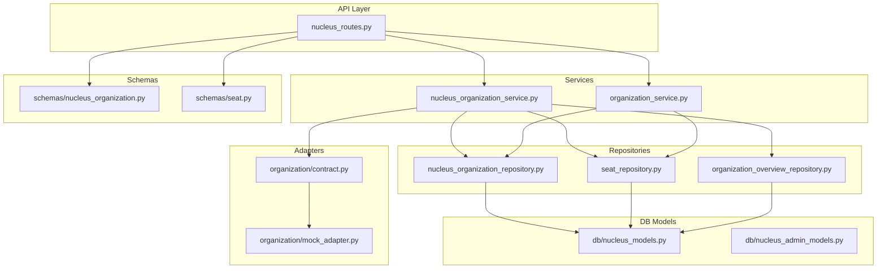
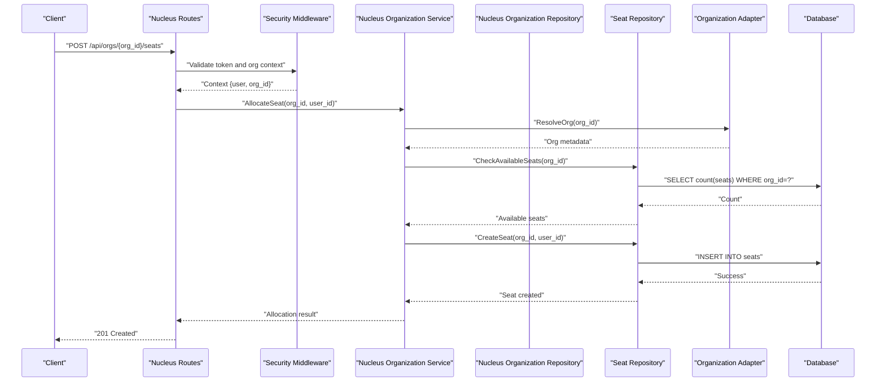
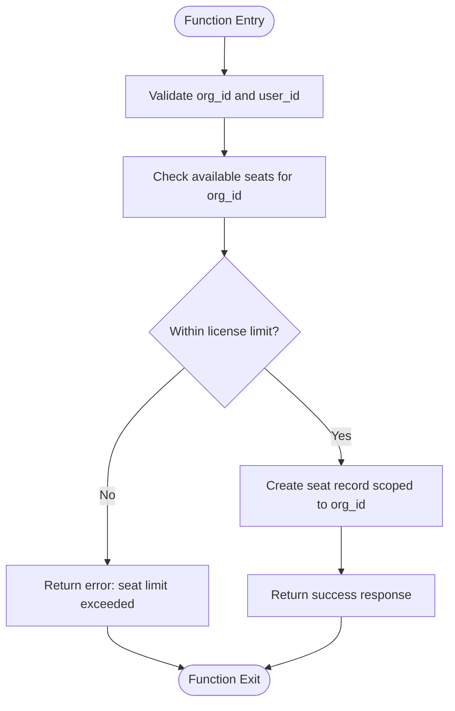
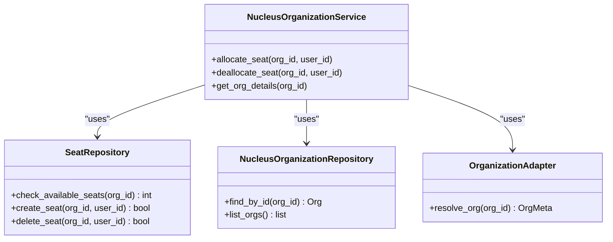
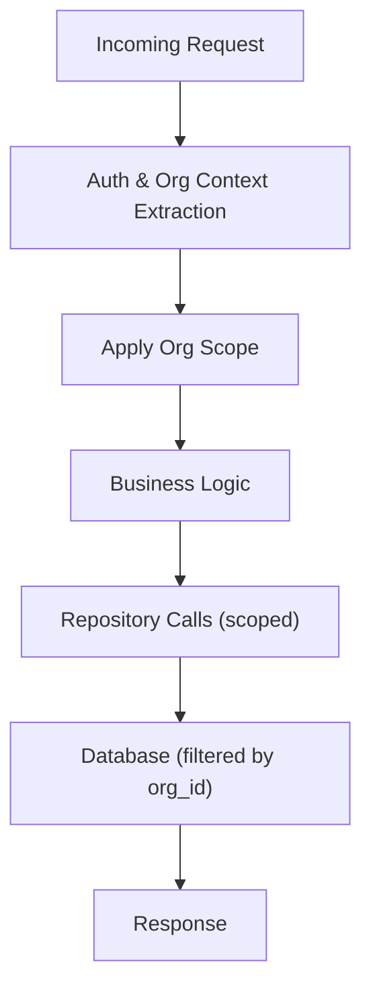
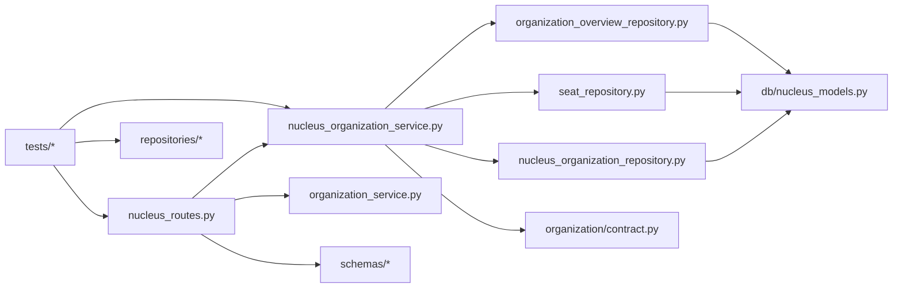

# Multi-Organization Support

<cite>
**Referenced Files in This Document**
- [app/adapters/organization/contract.py](file://app/adapters/organization/contract.py)
- [app/adapters/organization/mock_adapter.py](file://app/adapters/organization/mock_adapter.py)
- [app/repositories/nucleus_organization_repository.py](file://app/repositories/nucleus_organization_repository.py)
- [app/repositories/seat_repository.py](file://app/repositories/seat_repository.py)
- [app/repositories/organization_overview_repository.py](file://app/repositories/organization_overview_repository.py)
- [app/services/nucleus_organization_service.py](file://app/services/nucleus_organization_service.py)
- [app/services/organization_service.py](file://app/services/organization_service.py)
- [app/schemas/nucleus_organization.py](file://app/schemas/nucleus_organization.py)
- [app/schemas/seat.py](file://app/schemas/seat.py)
- [app/db/nucleus_models.py](file://app/db/nucleus_models.py)
- [app/db/nucleus_admin_models.py](file://app/db/nucleus_admin_models.py)
- [app/api/nucleus_routes.py](file://app/api/nucleus_routes.py)
- [app/core/security.py](file://app/core/security.py)
- [tests/test_nucleus_organization_api.py](file://tests/test_nucleus_organization_api.py)
- [tests/test_users_seats.py](file://tests/test_users_seats.py)
- [tests/test_organization_boundaries.py](file://tests/test_organization_boundaries.py)
- [tests/test_organization_overview.py](file://tests/test_organization_overview.py)
</cite>

## Table of Contents
1. [Introduction](#introduction)
2. [Project Structure](#project-structure)
3. [Core Components](#core-components)
4. [Architecture Overview](#architecture-overview)
5. [Detailed Component Analysis](#detailed-component-analysis)
6. [Dependency Analysis](#dependency-analysis)
7. [Performance Considerations](#performance-considerations)
8. [Troubleshooting Guide](#troubleshooting-guide)
9. [Conclusion](#conclusion)
10. [Appendices](#appendices)

## Introduction
This document explains the multi-tenant organization support system, focusing on tenant isolation strategies, seat management, and cross-organization query prevention. It also covers organization boundary enforcement, license allocation mechanisms, administrative interfaces, reporting capabilities, and implementation guidance for adding new organization features. Security implications and performance considerations for multi-tenant operations are addressed to help teams implement robust, scalable, and secure multi-tenancy.

## Project Structure
The multi-organization feature spans adapters, repositories, services, schemas, database models, API routes, and tests:
- Adapters define contracts and mock implementations for external organization providers.
- Repositories encapsulate data access for organizations, seats, and overview projections.
- Services orchestrate business logic for organization lifecycle and seat management.
- Schemas define request/response shapes for APIs.
- Database models represent persistent entities for organizations and admin-related structures.
- API routes expose endpoints for administration and tenant-scoped operations.
- Tests validate boundaries, seat limits, and cross-org query prevention.

**Diagram sources**
- [app/api/nucleus_routes.py](file://app/api/nucleus_routes.py)
- [app/services/nucleus_organization_service.py](file://app/services/nucleus_organization_service.py)
- [app/services/organization_service.py](file://app/services/organization_service.py)
- [app/repositories/nucleus_organization_repository.py](file://app/repositories/nucleus_organization_repository.py)
- [app/repositories/seat_repository.py](file://app/repositories/seat_repository.py)
- [app/repositories/organization_overview_repository.py](file://app/repositories/organization_overview_repository.py)
- [app/adapters/organization/contract.py](file://app/adapters/organization/contract.py)
- [app/adapters/organization/mock_adapter.py](file://app/adapters/organization/mock_adapter.py)
- [app/schemas/nucleus_organization.py](file://app/schemas/nucleus_organization.py)
- [app/schemas/seat.py](file://app/schemas/seat.py)
- [app/db/nucleus_models.py](file://app/db/nucleus_models.py)
- [app/db/nucleus_admin_models.py](file://app/db/nucleus_admin_models.py)

**Section sources**
- [app/api/nucleus_routes.py](file://app/api/nucleus_routes.py)
- [app/services/nucleus_organization_service.py](file://app/services/nucleus_organization_service.py)
- [app/services/organization_service.py](file://app/services/organization_service.py)
- [app/repositories/nucleus_organization_repository.py](file://app/repositories/nucleus_organization_repository.py)
- [app/repositories/seat_repository.py](file://app/repositories/seat_repository.py)
- [app/repositories/organization_overview_repository.py](file://app/repositories/organization_overview_repository.py)
- [app/adapters/organization/contract.py](file://app/adapters/organization/contract.py)
- [app/adapters/organization/mock_adapter.py](file://app/adapters/organization/mock_adapter.py)
- [app/schemas/nucleus_organization.py](file://app/schemas/nucleus_organization.py)
- [app/schemas/seat.py](file://app/schemas/seat.py)
- [app/db/nucleus_models.py](file://app/db/nucleus_models.py)
- [app/db/nucleus_admin_models.py](file://app/db/nucleus_admin_models.py)

## Core Components
- Organization adapter contract and mock: Defines the interface for fetching organization metadata and a test-friendly mock implementation.
- Nucleus organization repository: Provides tenant-scoped queries and writes for organization entities.
- Seat repository: Manages user seats per organization, enforcing seat limits and allocations.
- Organization overview repository: Aggregates metrics and summaries across an organization’s scope.
- Nucleus organization service: Orchestrates organization lifecycle, seat allocation, and boundary checks.
- Organization service: General organization utilities used by API routes and other services.
- Schemas: Typed request/response models for organization and seat operations.
- DB models: Persistent representations for organizations and admin-related structures.
- API routes: Endpoints for admin and tenant-scoped operations with security middleware.

Key responsibilities:
- Enforce tenant isolation at every layer (API, service, repository).
- Prevent cross-organization queries by scoping all reads/writes to the current organization context.
- Manage seat allocation and enforce license limits during user provisioning.
- Provide administrative interfaces for organization management and reporting.

**Section sources**
- [app/adapters/organization/contract.py](file://app/adapters/organization/contract.py)
- [app/adapters/organization/mock_adapter.py](file://app/adapters/organization/mock_adapter.py)
- [app/repositories/nucleus_organization_repository.py](file://app/repositories/nucleus_organization_repository.py)
- [app/repositories/seat_repository.py](file://app/repositories/seat_repository.py)
- [app/repositories/organization_overview_repository.py](file://app/repositories/organization_overview_repository.py)
- [app/services/nucleus_organization_service.py](file://app/services/nucleus_organization_service.py)
- [app/services/organization_service.py](file://app/services/organization_service.py)
- [app/schemas/nucleus_organization.py](file://app/schemas/nucleus_organization.py)
- [app/schemas/seat.py](file://app/schemas/seat.py)
- [app/db/nucleus_models.py](file://app/db/nucleus_models.py)
- [app/db/nucleus_admin_models.py](file://app/db/nucleus_admin_models.py)
- [app/api/nucleus_routes.py](file://app/api/nucleus_routes.py)

## Architecture Overview
The system enforces multi-tenancy through layered isolation:
- API routes accept an organization context from authentication or routing.
- Services validate and propagate the organization context.
- Repositories apply strict WHERE clauses scoped to the organization ID.
- Adapters abstract external organization lookups; mocks enable testing without external dependencies.
- Schemas ensure consistent payloads across boundaries.
- DB models reflect the schema for organizations and admin structures.

**Diagram sources**
- [app/api/nucleus_routes.py](file://app/api/nucleus_routes.py)
- [app/core/security.py](file://app/core/security.py)
- [app/services/nucleus_organization_service.py](file://app/services/nucleus_organization_service.py)
- [app/repositories/nucleus_organization_repository.py](file://app/repositories/nucleus_organization_repository.py)
- [app/repositories/seat_repository.py](file://app/repositories/seat_repository.py)
- [app/adapters/organization/contract.py](file://app/adapters/organization/contract.py)
- [app/adapters/organization/mock_adapter.py](file://app/adapters/organization/mock_adapter.py)

## Detailed Component Analysis

### Tenant Isolation Strategies
- Context propagation: The security layer extracts and validates the organization context from requests.
- Repository scoping: All repository methods include explicit organization filters to prevent cross-org access.
- Service validation: Services assert that incoming organization IDs match the authenticated context.
- Adapter isolation: External organization lookups are performed within the same org context.

Implementation notes:
- Ensure every repository method accepts and applies an organization ID parameter.
- Avoid global queries; always filter by organization.
- Use dependency injection to pass the organization context consistently.

**Section sources**
- [app/core/security.py](file://app/core/security.py)
- [app/repositories/nucleus_organization_repository.py](file://app/repositories/nucleus_organization_repository.py)
- [app/repositories/seat_repository.py](file://app/repositories/seat_repository.py)
- [app/repositories/organization_overview_repository.py](file://app/repositories/organization_overview_repository.py)
- [app/adapters/organization/contract.py](file://app/adapters/organization/contract.py)

### Seat Management and License Allocation
Seat management ensures each organization can only allocate up to its licensed limit:
- Check available seats before creating a new seat.
- Create seat records atomically under the organization scope.
- Return clear errors when exceeding limits.

**Diagram sources**
- [app/services/nucleus_organization_service.py](file://app/services/nucleus_organization_service.py)
- [app/repositories/seat_repository.py](file://app/repositories/seat_repository.py)
- [app/schemas/seat.py](file://app/schemas/seat.py)

**Section sources**
- [app/services/nucleus_organization_service.py](file://app/services/nucleus_organization_service.py)
- [app/repositories/seat_repository.py](file://app/repositories/seat_repository.py)
- [app/schemas/seat.py](file://app/schemas/seat.py)
- [tests/test_users_seats.py](file://tests/test_users_seats.py)

### Cross-Organization Query Prevention
Cross-org queries are prevented by:
- Forcing organization context into all repository calls.
- Validating that requested resources belong to the current organization.
- Using database constraints and indexes on organization IDs where applicable.

Verification:
- Tests assert that attempts to access another organization’s data fail.
- Error responses indicate insufficient permissions or invalid scope.

**Section sources**
- [tests/test_organization_boundaries.py](file://tests/test_organization_boundaries.py)
- [app/repositories/nucleus_organization_repository.py](file://app/repositories/nucleus_organization_repository.py)
- [app/repositories/seat_repository.py](file://app/repositories/seat_repository.py)

### Organization Boundary Enforcement
Boundary enforcement includes:
- API-level checks using security middleware to bind requests to an organization.
- Service-level assertions ensuring consistency between route parameters and context.
- Repository-level filtering to guarantee data isolation.

**Diagram sources**
- [app/services/nucleus_organization_service.py](file://app/services/nucleus_organization_service.py)
- [app/repositories/seat_repository.py](file://app/repositories/seat_repository.py)
- [app/repositories/nucleus_organization_repository.py](file://app/repositories/nucleus_organization_repository.py)
- [app/adapters/organization/contract.py](file://app/adapters/organization/contract.py)

**Section sources**
- [app/services/nucleus_organization_service.py](file://app/services/nucleus_organization_service.py)
- [app/repositories/nucleus_organization_repository.py](file://app/repositories/nucleus_organization_repository.py)
- [app/adapters/organization/contract.py](file://app/adapters/organization/contract.py)

### Administrative Interfaces and Reporting
Administrative capabilities:
- Organization CRUD via nucleus routes.
- Seat management endpoints for allocation and deallocation.
- Overview reporting aggregated by organization scope.

Reporting focuses on:
- Seat utilization counts per organization.
- Organization health and activity summaries.

**Section sources**
- [app/api/nucleus_routes.py](file://app/api/nucleus_routes.py)
- [app/repositories/organization_overview_repository.py](file://app/repositories/organization_overview_repository.py)
- [app/schemas/nucleus_organization.py](file://app/schemas/nucleus_organization.py)
- [tests/test_organization_overview.py](file://tests/test_organization_overview.py)

### Implementation Guides

#### Adding New Organization Features
Steps:
- Define schemas for new inputs/outputs in the appropriate schema files.
- Implement repository methods with explicit organization scoping.
- Add service methods to orchestrate business logic and enforce boundaries.
- Expose API routes with security middleware binding to the organization context.
- Write tests validating isolation and correct behavior.

Best practices:
- Always pass organization context explicitly.
- Fail fast on mismatched org IDs.
- Keep repository methods small and focused on single responsibilities.

**Section sources**
- [app/schemas/nucleus_organization.py](file://app/schemas/nucleus_organization.py)
- [app/repositories/nucleus_organization_repository.py](file://app/repositories/nucleus_organization_repository.py)
- [app/services/nucleus_organization_service.py](file://app/services/nucleus_organization_service.py)
- [app/api/nucleus_routes.py](file://app/api/nucleus_routes.py)

#### Managing User Seats
Guidelines:
- Before allocating, check available seats for the organization.
- On success, create a seat record scoped to the organization.
- On failure due to limits, return a clear error indicating remaining capacity.
- When deallocating, remove the seat record and update counters if needed.

**Section sources**
- [app/services/nucleus_organization_service.py](file://app/services/nucleus_organization_service.py)
- [app/repositories/seat_repository.py](file://app/repositories/seat_repository.py)
- [tests/test_users_seats.py](file://tests/test_users_seats.py)

#### Ensuring Data Isolation
Recommendations:
- Centralize organization context extraction in security middleware.
- Require organization ID in all repository calls.
- Use database indexes on organization IDs for efficient filtering.
- Add integration tests asserting cross-org access is denied.

**Section sources**
- [app/core/security.py](file://app/core/security.py)
- [app/repositories/nucleus_organization_repository.py](file://app/repositories/nucleus_organization_repository.py)
- [tests/test_organization_boundaries.py](file://tests/test_organization_boundaries.py)

### Conceptual Overview
Conceptually, multi-tenancy relies on:
- Strong identity and authorization boundaries.
- Explicit scoping at every layer.
- Clear error signaling for policy violations.
- Efficient indexing and query patterns to maintain performance.

[No sources needed since this diagram shows conceptual workflow, not actual code structure]

## Dependency Analysis
The multi-organization subsystem has clear dependencies:
- API routes depend on services and schemas.
- Services depend on repositories and adapters.
- Repositories depend on DB models.
- Tests validate behaviors across these layers.

**Diagram sources**
- [app/api/nucleus_routes.py](file://app/api/nucleus_routes.py)
- [app/services/nucleus_organization_service.py](file://app/services/nucleus_organization_service.py)
- [app/services/organization_service.py](file://app/services/organization_service.py)
- [app/repositories/nucleus_organization_repository.py](file://app/repositories/nucleus_organization_repository.py)
- [app/repositories/seat_repository.py](file://app/repositories/seat_repository.py)
- [app/repositories/organization_overview_repository.py](file://app/repositories/organization_overview_repository.py)
- [app/adapters/organization/contract.py](file://app/adapters/organization/contract.py)
- [app/db/nucleus_models.py](file://app/db/nucleus_models.py)
- [app/schemas/nucleus_organization.py](file://app/schemas/nucleus_organization.py)
- [app/schemas/seat.py](file://app/schemas/seat.py)
- [tests/test_nucleus_organization_api.py](file://tests/test_nucleus_organization_api.py)
- [tests/test_users_seats.py](file://tests/test_users_seats.py)
- [tests/test_organization_boundaries.py](file://tests/test_organization_boundaries.py)
- [tests/test_organization_overview.py](file://tests/test_organization_overview.py)

**Section sources**
- [app/api/nucleus_routes.py](file://app/api/nucleus_routes.py)
- [app/services/nucleus_organization_service.py](file://app/services/nucleus_organization_service.py)
- [app/repositories/nucleus_organization_repository.py](file://app/repositories/nucleus_organization_repository.py)
- [app/repositories/seat_repository.py](file://app/repositories/seat_repository.py)
- [app/repositories/organization_overview_repository.py](file://app/repositories/organization_overview_repository.py)
- [app/adapters/organization/contract.py](file://app/adapters/organization/contract.py)
- [app/db/nucleus_models.py](file://app/db/nucleus_models.py)
- [app/schemas/nucleus_organization.py](file://app/schemas/nucleus_organization.py)
- [app/schemas/seat.py](file://app/schemas/seat.py)
- [tests/test_nucleus_organization_api.py](file://tests/test_nucleus_organization_api.py)
- [tests/test_users_seats.py](file://tests/test_users_seats.py)
- [tests/test_organization_boundaries.py](file://tests/test_organization_boundaries.py)
- [tests/test_organization_overview.py](file://tests/test_organization_overview.py)

## Performance Considerations
- Indexing: Ensure organization_id is indexed in relevant tables to speed up filtered queries.
- Query design: Prefer narrow selects and avoid unnecessary joins; leverage repository abstractions to keep queries efficient.
- Caching: Consider caching frequently read organization metadata behind the adapter layer.
- Concurrency: Use atomic operations for seat allocation to prevent race conditions near license limits.
- Monitoring: Track seat allocation failures and cross-org access attempts for observability.

[No sources needed since this section provides general guidance]

## Troubleshooting Guide
Common issues and resolutions:
- Cross-org access errors: Verify that the organization context is correctly extracted and propagated; confirm repository filters include the org_id.
- Seat limit exceeded: Check available seat counts and license configuration; ensure allocation logic validates limits before creation.
- Admin endpoint failures: Confirm security middleware binds the request to the intended organization and that route parameters match context.

Validation references:
- Boundary enforcement tests demonstrate expected denial of cross-org operations.
- Seat management tests verify allocation and limit enforcement.
- Organization overview tests confirm scoped reporting.

**Section sources**
- [tests/test_organization_boundaries.py](file://tests/test_organization_boundaries.py)
- [tests/test_users_seats.py](file://tests/test_users_seats.py)
- [tests/test_organization_overview.py](file://tests/test_organization_overview.py)

## Conclusion
The multi-organization support system enforces strong tenant isolation through layered checks, scoped repositories, and explicit context propagation. Seat management and license allocation are handled with clear validation and error signaling. Administrative interfaces provide organization management and reporting capabilities. Following the implementation guides and best practices will help teams extend features safely while maintaining security and performance.

[No sources needed since this section summarizes without analyzing specific files]

## Appendices

### Security Implications
- Authentication and authorization must bind requests to a specific organization.
- Reject any operation that attempts to access resources outside the current organization.
- Log and monitor policy violations for audit and incident response.

**Section sources**
- [app/core/security.py](file://app/core/security.py)
- [tests/test_organization_boundaries.py](file://tests/test_organization_boundaries.py)

### Database Schema Notes
- Organization and admin-related entities are represented by dedicated models.
- Ensure foreign keys and constraints align with multi-tenant design principles.

**Section sources**
- [app/db/nucleus_models.py](file://app/db/nucleus_models.py)
- [app/db/nucleus_admin_models.py](file://app/db/nucleus_admin_models.py)