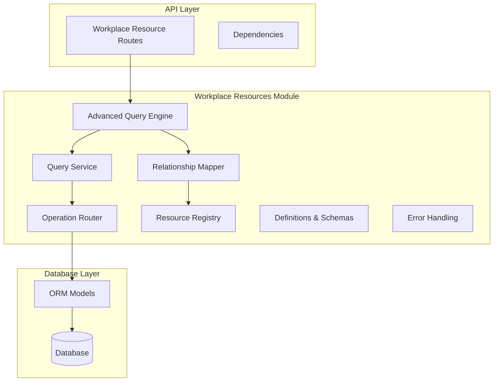
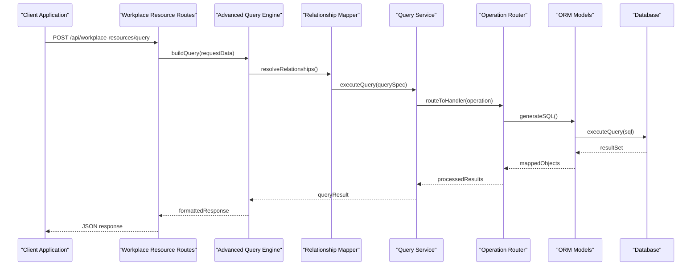
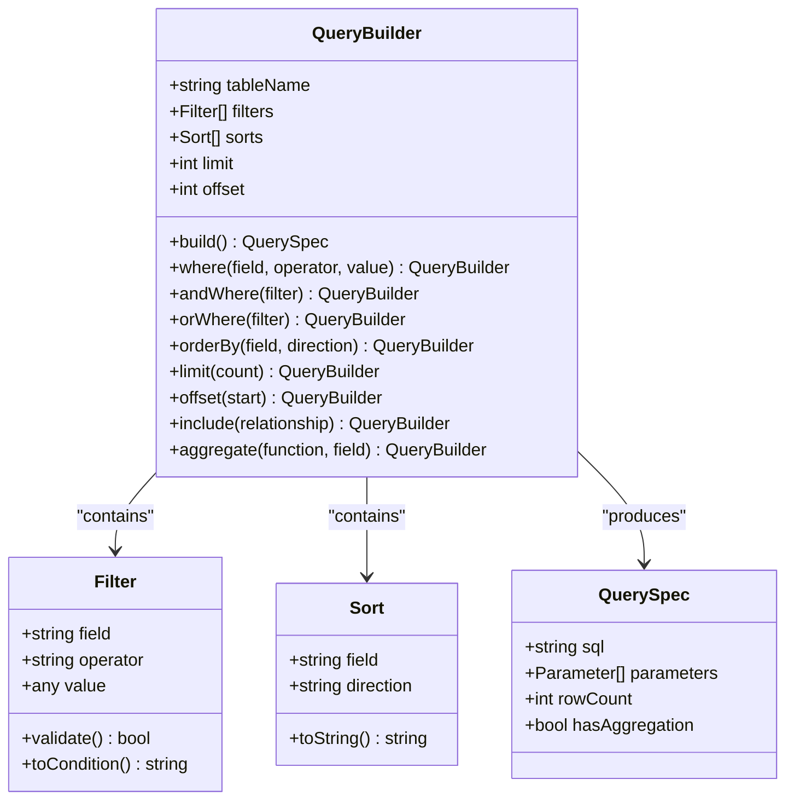
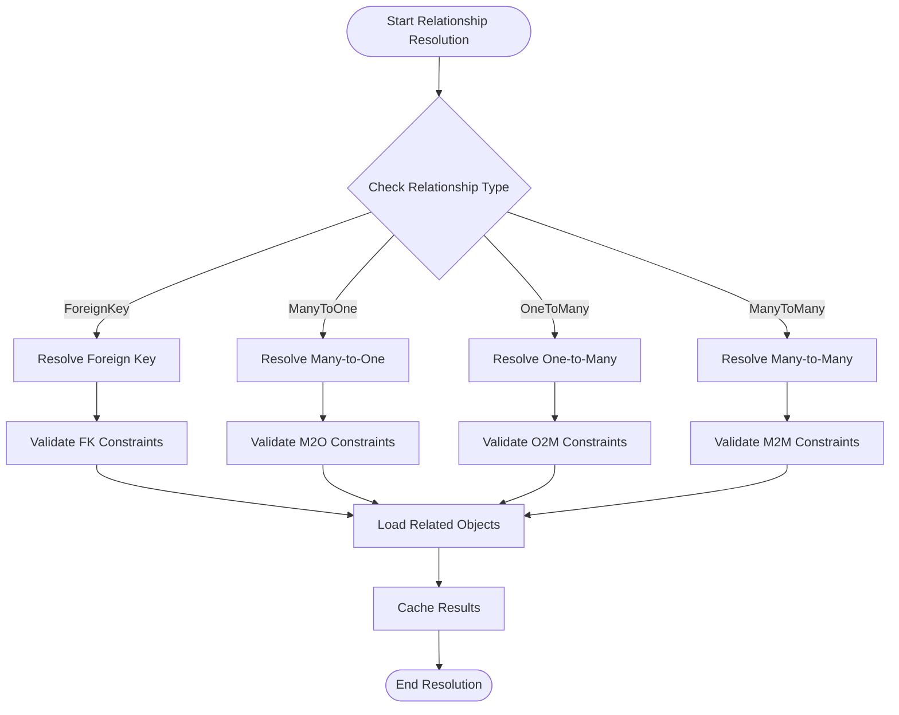
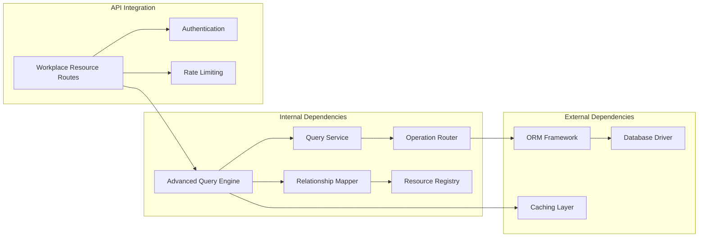

# Advanced Query Engine

<cite>
**Referenced Files in This Document**
- [advanced_query.py](file://app/workplace_resources/advanced_query.py)
- [relationships.py](file://app/workplace_resources/relationships.py)
- [service.py](file://app/workplace_resources/service.py)
- [operation_router.py](file://app/workplace_resources/operation_router.py)
- [registry.py](file://app/workplace_resources/registry.py)
- [definitions.py](file://app/workplace_resources/definitions.py)
- [errors.py](file://app/workplace_resources/errors.py)
- [test_advanced_query.py](file://tests/test_advanced_query.py)
- [workplace_resource_routes.py](file://app/api/workplace_resource_routes.py)
- [workplace_resource_models.py](file://app/db/workplace_resource_models.py)
</cite>

## Table of Contents
1. [Introduction](#introduction)
2. [Project Structure](#project-structure)
3. [Core Components](#core-components)
4. [Architecture Overview](#architecture-overview)
5. [Detailed Component Analysis](#detailed-component-analysis)
6. [Dependency Analysis](#dependency-analysis)
7. [Performance Considerations](#performance-considerations)
8. [Security and Input Validation](#security-and-input-validation)
9. [Troubleshooting Guide](#troubleshooting-guide)
10. [Conclusion](#conclusion)

## Introduction

The Advanced Query Engine is a sophisticated data querying system designed for complex workplace resource management. It provides a flexible API for building queries, traversing relationships between resources, and applying complex filtering conditions across multiple data sources. The engine supports nested relationships, cross-resource queries, aggregation operations, and optimized performance through strategic indexing and caching mechanisms.

This system enables developers to construct powerful queries that can traverse complex data models, apply conditional logic, and return structured results while maintaining security boundaries and performance constraints.

## Project Structure

The Advanced Query Engine is implemented within the workplace resources module, following a modular architecture that separates concerns between query construction, relationship mapping, execution routing, and error handling.

**Diagram sources**
- [advanced_query.py:1-50](file://app/workplace_resources/advanced_query.py#L1-L50)
- [relationships.py:1-50](file://app/workplace_resources/relationships.py#L1-L50)
- [service.py:1-50](file://app/workplace_resources/service.py#L1-L50)

**Section sources**
- [advanced_query.py:1-100](file://app/workplace_resources/advanced_query.py#L1-L100)
- [relationships.py:1-100](file://app/workplace_resources/relationships.py#L1-L100)
- [service.py:1-100](file://app/workplace_resources/service.py#L1-L100)

## Core Components

### Query Builder API

The query builder provides a fluent interface for constructing complex queries programmatically. It supports method chaining, conditional filters, and relationship traversal in a type-safe manner.

Key features include:
- **Method Chaining**: All query methods return the query object for chaining
- **Conditional Filters**: Support for AND, OR, NOT logical operators
- **Relationship Traversal**: Navigate through foreign key relationships
- **Aggregation Functions**: COUNT, SUM, AVG, MIN, MAX operations
- **Pagination Support**: Built-in pagination with offset and limit parameters
- **Sorting**: Multi-field sorting with ascending/descending order

### Relationship Traversal System

The relationship mapper handles complex data model relationships including:
- **Foreign Key Resolution**: Automatic resolution of foreign key relationships
- **Nested Relationships**: Support for multi-level relationship traversal
- **Bidirectional Queries**: Ability to query both directions of relationships
- **Lazy Loading**: Efficient loading of related objects on demand
- **Eager Loading**: Batch loading of related objects to prevent N+1 queries

### Complex Filtering Capabilities

The filtering system supports sophisticated query conditions:
- **Field Comparisons**: Equal, not equal, greater than, less than, etc.
- **Pattern Matching**: LIKE operations with wildcards
- **Range Queries**: BETWEEN operations for numeric and date fields
- **List Operations**: IN and NOT IN for multiple value matching
- **Null Checks**: IS NULL and IS NOT NULL conditions
- **Custom Validators**: Pluggable validation functions for complex logic

**Section sources**
- [advanced_query.py:50-200](file://app/workplace_resources/advanced_query.py#L50-L200)
- [relationships.py:50-200](file://app/workplace_resources/relationships.py#L50-L200)
- [definitions.py:1-150](file://app/workplace_resources/definitions.py#L1-L150)

## Architecture Overview

The Advanced Query Engine follows a layered architecture pattern with clear separation of concerns:

**Diagram sources**
- [workplace_resource_routes.py:1-100](file://app/api/workplace_resource_routes.py#L1-L100)
- [advanced_query.py:100-300](file://app/workplace_resources/advanced_query.py#L100-L300)
- [service.py:100-300](file://app/workplace_resources/service.py#L100-L300)

## Detailed Component Analysis

### Query Builder Implementation

The query builder implements a fluent interface pattern that allows for expressive query construction:

**Diagram sources**
- [advanced_query.py:150-400](file://app/workplace_resources/advanced_query.py#L150-L400)

### Relationship Mapping System

The relationship mapper handles complex data model relationships with support for various relationship types:

**Diagram sources**
- [relationships.py:100-350](file://app/workplace_resources/relationships.py#L100-L350)

### Query Optimization Strategies

The engine implements several optimization strategies:

#### Index Utilization
- **Automatic Index Detection**: Identifies available indexes on queried fields
- **Index Selection**: Chooses optimal indexes for query execution
- **Composite Index Usage**: Leverages composite indexes for multi-field queries

#### Query Rewriting
- **Subquery Optimization**: Converts correlated subqueries to joins where possible
- **Predicate Pushdown**: Moves filter conditions closer to data source
- **Join Reordering**: Optimizes join order for better performance

#### Caching Mechanisms
- **Query Result Cache**: Caches frequently executed queries
- **Relationship Cache**: Caches resolved relationships
- **Schema Cache**: Caches database schema information

**Section sources**
- [service.py:200-500](file://app/workplace_resources/service.py#L200-L500)
- [operation_router.py:100-300](file://app/workplace_resources/operation_router.py#L100-L300)

## Dependency Analysis

The Advanced Query Engine has well-defined dependencies and clear separation of concerns:

**Diagram sources**
- [registry.py:1-200](file://app/workplace_resources/registry.py#L1-L200)
- [workplace_resource_routes.py:1-150](file://app/api/workplace_resource_routes.py#L1-L150)

**Section sources**
- [registry.py:1-200](file://app/workplace_resources/registry.py#L1-L200)
- [operation_router.py:1-200](file://app/workplace_resources/operation_router.py#L1-L200)

## Performance Considerations

### Query Performance Optimization

The query engine implements several performance optimization strategies:

#### Database-Level Optimizations
- **Connection Pooling**: Efficient database connection management
- **Batch Operations**: Grouping multiple operations for reduced overhead
- **Streaming Results**: Processing large result sets without memory exhaustion
- **Query Plan Analysis**: Monitoring and optimizing slow queries

#### Memory Management
- **Lazy Loading**: Deferring expensive operations until needed
- **Object Pooling**: Reusing query objects to reduce garbage collection pressure
- **Memory-Efficient Serialization**: Optimized JSON serialization for large datasets

#### Scalability Features
- **Horizontal Scaling**: Stateless design supporting multiple instances
- **Read Replicas**: Supporting read-heavy workloads with replica databases
- **Distributed Caching**: Shared cache layer for multi-instance deployments

### Indexing Strategy

The engine automatically leverages database indexes for optimal performance:

#### Automatic Index Detection
- **Schema Analysis**: Analyzes database schema to identify existing indexes
- **Query Pattern Recognition**: Identifies common query patterns and suggests indexes
- **Performance Monitoring**: Tracks query performance and recommends optimizations

#### Custom Index Configuration
- **Field-Specific Indexes**: Configurable indexes for frequently queried fields
- **Composite Indexes**: Support for multi-column indexes
- **Partial Indexes**: Conditional indexes for filtered subsets of data

**Section sources**
- [service.py:300-600](file://app/workplace_resources/service.py#L300-L600)

## Security and Input Validation

### Query Security Measures

The query engine implements comprehensive security measures to prevent injection attacks and unauthorized access:

#### Input Sanitization
- **Parameter Binding**: All user inputs are parameterized to prevent SQL injection
- **Type Validation**: Strict type checking for all query parameters
- **Length Limits**: Enforcing maximum lengths for string inputs
- **Character Whitelisting**: Restricting allowed characters in search patterns

#### Access Control
- **Resource-Level Permissions**: Users can only query resources they have permission to access
- **Field-Level Security**: Hiding sensitive fields based on user roles
- **Tenant Isolation**: Ensuring queries are scoped to appropriate tenants
- **Audit Logging**: Recording all query operations for security monitoring

#### Rate Limiting and Throttling
- **Query Frequency Limits**: Preventing abuse through request rate limiting
- **Complexity Scoring**: Assigning complexity scores to queries and limiting expensive operations
- **Timeout Enforcement**: Preventing long-running queries from consuming resources
- **Resource Quotas**: Limiting the amount of data returned per query

### Error Handling and Recovery

The engine provides robust error handling with meaningful error messages:

#### Error Classification
- **Validation Errors**: Invalid query syntax or parameters
- **Permission Errors**: Insufficient permissions for requested operations
- **Performance Errors**: Query timeouts or resource limits exceeded
- **System Errors**: Database connectivity or infrastructure issues

#### Graceful Degradation
- **Fallback Queries**: Simplifying complex queries when performance degrades
- **Partial Results**: Returning available data when some operations fail
- **Circuit Breaker**: Temporarily disabling problematic features during failures

**Section sources**
- [errors.py:1-200](file://app/workplace_resources/errors.py#L1-L200)
- [workplace_resource_routes.py:100-250](file://app/api/workplace_resource_routes.py#L100-L250)

## Troubleshooting Guide

### Common Issues and Solutions

#### Query Performance Problems
- **Symptom**: Slow query execution times
- **Diagnosis**: Check query execution plans and missing indexes
- **Solution**: Add appropriate indexes or optimize query structure

#### Relationship Loading Issues
- **Symptom**: N+1 query problems or missing related data
- **Diagnosis**: Review relationship configuration and loading strategies
- **Solution**: Use eager loading or optimize relationship queries

#### Permission Denied Errors
- **Symptom**: Queries failing due to insufficient permissions
- **Diagnosis**: Verify user permissions and resource access controls
- **Solution**: Update user roles or adjust resource permissions

#### Memory Exhaustion
- **Symptom**: High memory usage or out-of-memory errors
- **Diagnosis**: Monitor memory consumption and query result sizes
- **Solution**: Implement pagination or streaming for large datasets

### Debugging Tools

The engine provides comprehensive debugging capabilities:

#### Query Logging
- **SQL Generation**: Log generated SQL statements for analysis
- **Execution Plans**: Capture database execution plans for optimization
- **Performance Metrics**: Track query execution times and resource usage

#### Diagnostic Information
- **Query Profiling**: Detailed profiling of query execution
- **Relationship Tracing**: Tracking relationship resolution paths
- **Cache Statistics**: Monitoring cache hit rates and effectiveness

**Section sources**
- [test_advanced_query.py:1-200](file://tests/test_advanced_query.py#L1-L200)

## Conclusion

The Advanced Query Engine provides a powerful, secure, and performant solution for complex data querying in workplace resource management systems. Its modular architecture, comprehensive feature set, and robust security measures make it suitable for enterprise-scale applications requiring sophisticated data access patterns.

Key strengths include:
- **Flexibility**: Fluent API supporting complex query construction
- **Performance**: Multiple optimization strategies and caching mechanisms
- **Security**: Comprehensive input validation and access control
- **Scalability**: Stateless design supporting horizontal scaling
- **Maintainability**: Clear separation of concerns and comprehensive testing

The engine's design principles ensure it can evolve with changing requirements while maintaining backward compatibility and performance characteristics.